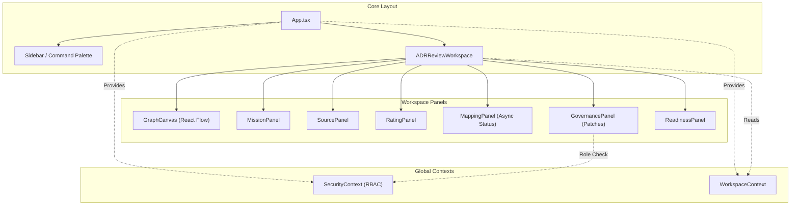

# 🗺️ PROJECT MAP — epios
> Автоматически сгенерировано: `2026-05-14 17:23:07`
> Скрипт: `node dev_studio/refresh.js`

## 📊 Telemetry / Context Health
| Metric | Value | Note |
|---|---|---|
| **Total Files** | `121` | Только JS/TS/TSX исходники |
| **Total Lines** | `12391` | Суммарно по проекту |
| **Project Weight** | `~99 745 tokens` | Оценка (4 символа/токен) |
| **Context Pressure** | `77.9%` | Нагрузка на окно 128k (Full Scan) |
| **Map Efficiency** | `~87%` | Экономия контекста через карту |

---

## Высокоуровневая архитектура
> Связи между основными пакетами и приложениями

```mermaid
flowchart LR

subgraph 0["apps"]
subgraph 1["demo-shell"]
subgraph 2["dist"]
subgraph 3["assets"]
4["index-COAmHwb-.js"]
end
end
subgraph 7["src"]
8["App.tsx"]
subgraph F["components"]
G["ADRReviewWorkspace.tsx"]
W["GovernancePanel.tsx"]
1B["ReadinessPanel.tsx"]
1C["ArchiveView.tsx"]
1Q["CommandPalette.tsx"]
1R["Sidebar.tsx"]
1S["Modal.tsx"]
1T["SidebarItem.tsx"]
1U["WorkspaceRoom.tsx"]
1V["GraphCanvas.tsx"]
1X["CustomNode.tsx"]
1Y["MissionPanel.tsx"]
1Z["MappingPanel.tsx"]
20["SourcePanel.tsx"]
21["RatingPanel.tsx"]
end
subgraph T["hooks"]
U["useApi.ts"]
end
V["api-config.ts"]
subgraph X["context"]
Y["SecurityContext.tsx"]
1J["WorkspaceContext.tsx"]
end
22["i18n.ts"]
2F["main.tsx"]
2G["index.css"]
end
end
end
subgraph 5["@emotion"]
6["is-prop-valid"]
end
subgraph 9["node_modules"]
subgraph A[".pnpm"]
subgraph B["react@18.3.1"]
subgraph C["node_modules"]
subgraph D["react"]
E["index.js"]
end
end
end
subgraph H["framer-motion@12.38.0_react-dom@18.3.1_react@18.3.1__react@18.3.1"]
subgraph I["node_modules"]
subgraph J["framer-motion"]
subgraph K["dist"]
subgraph L["cjs"]
M["index.js"]
end
end
end
end
end
subgraph N["lucide-react@1.14.0_react@18.3.1"]
subgraph O["node_modules"]
subgraph P["lucide-react"]
subgraph Q["dist"]
subgraph R["cjs"]
S["lucide-react.js"]
end
end
end
end
end
subgraph 1D["react-i18next@17.0.7_i18next@26.1.0_typescript@5.9.3__react-dom@18.3.1_react@18.3.1__react@18.3.1_typescript@5.9.3"]
subgraph 1E["node_modules"]
subgraph 1F["react-i18next"]
subgraph 1G["dist"]
subgraph 1H["es"]
1I["index.js"]
end
end
end
end
end
subgraph 1K["reactflow@11.11.4_@types+react@18.3.28_react-dom@18.3.1_react@18.3.1__react@18.3.1"]
subgraph 1L["node_modules"]
subgraph 1M["reactflow"]
subgraph 1N["dist"]
subgraph 1O["esm"]
1P["index.mjs"]
end
1W["style.css"]
end
end
end
end
subgraph 23["i18next@26.1.0_typescript@5.9.3"]
subgraph 24["node_modules"]
subgraph 25["i18next"]
subgraph 26["dist"]
subgraph 27["esm"]
28["i18next.js"]
end
end
end
end
end
subgraph 29["i18next-browser-languagedetector@8.2.1"]
subgraph 2A["node_modules"]
subgraph 2B["i18next-browser-languagedetector"]
subgraph 2C["dist"]
subgraph 2D["esm"]
2E["i18nextBrowserLanguageDetector.js"]
end
end
end
end
end
subgraph 2H["react-dom@18.3.1_react@18.3.1"]
subgraph 2I["node_modules"]
subgraph 2J["react-dom"]
2K["client.js"]
end
end
end
subgraph 2T["@fastify+cors@8.5.0"]
subgraph 2U["node_modules"]
subgraph 2V["@fastify"]
subgraph 2W["cors"]
2X["index.js"]
end
end
end
end
subgraph 2Y["dotenv@16.6.1"]
subgraph 2Z["node_modules"]
subgraph 30["dotenv"]
subgraph 31["lib"]
32["main.js"]
end
end
end
end
subgraph 33["dotenv-expand@11.0.7"]
subgraph 34["node_modules"]
subgraph 35["dotenv-expand"]
subgraph 36["lib"]
37["main.js"]
end
end
end
end
subgraph 38["drizzle-orm@0.45.2_postgres@3.4.9"]
subgraph 39["node_modules"]
subgraph 3A["drizzle-orm"]
subgraph 3B["postgres-js"]
3C["index.js"]
end
5I["index.js"]
subgraph 5K["pg-core"]
5L["index.js"]
end
end
end
end
subgraph 3D["fastify@4.29.1"]
subgraph 3E["node_modules"]
subgraph 3F["fastify"]
3G["fastify.js"]
end
end
end
subgraph 3H["postgres@3.4.9"]
subgraph 3I["node_modules"]
subgraph 3J["postgres"]
subgraph 3K["src"]
3L["index.js"]
end
end
end
end
subgraph 5Z["vitest@1.6.1_@types+node@25.7.0"]
subgraph 60["node_modules"]
subgraph 61["vitest"]
subgraph 62["dist"]
63["index.js"]
67["config.cjs"]
end
end
end
end
subgraph 8F["drizzle-kit@0.31.10"]
subgraph 8G["node_modules"]
subgraph 8H["drizzle-kit"]
8I["index.mjs"]
end
end
end
end
end
subgraph Z["packages"]
subgraph 10["domain"]
subgraph 11["src"]
12["index.ts"]
13["adr.ts"]
14["governance.ts"]
15["node.ts"]
16["mapping.ts"]
17["rating.ts"]
18["security.ts"]
19["source.ts"]
1A["workspace.ts"]
end
subgraph 6C["coverage"]
6D["block-navigation.js"]
6E["prettify.js"]
6F["sorter.js"]
end
subgraph 6G["test"]
6H["domain-smoke.test.ts"]
6I["node-invariants.test.ts"]
6J["source-rating.test.ts"]
6K["workspace.test.ts"]
end
6L["vitest.config.ts"]
end
subgraph 2L["api"]
subgraph 2M["coverage"]
2N["block-navigation.js"]
2O["prettify.js"]
2P["sorter.js"]
end
subgraph 2Q["src"]
2R["bin.ts"]
2S["server.ts"]
3M["mock-data.ts"]
subgraph 3N["routes"]
3O["adr.routes.ts"]
50["governance.routes.ts"]
51["mapping.routes.ts"]
54["mcp.routes.ts"]
55["rating.routes.ts"]
56["security.routes.ts"]
57["source.routes.ts"]
58["workspace.routes.ts"]
end
subgraph 52["dto"]
53["index.ts"]
end
5W["index.ts"]
end
subgraph 5X["test"]
5Y["adr.test.ts"]
64["api.test.ts"]
end
65["vitest.config.ts"]
end
subgraph 3P["application"]
subgraph 3Q["src"]
3R["index.ts"]
3S["mapping-processor.ts"]
subgraph 44["use-cases"]
45["add-edge.ts"]
4C["add-node.ts"]
4D["add-source.ts"]
4E["adr-use-cases.ts"]
4F["apply-patch.ts"]
4G["apply-retention.ts"]
4H["assess-readiness.ts"]
4I["cast-vote.ts"]
4J["create-workspace.ts"]
4K["get-mapping-run.ts"]
4L["get-node-ratings.ts"]
4M["get-readiness.ts"]
4N["get-trace.ts"]
4O["get-workspace-graph.ts"]
4P["list-mapping-runs.ts"]
4Q["list-patches.ts"]
4R["list-sources.ts"]
4S["list-workspaces.ts"]
4T["patch-node.ts"]
4U["patch-workspace.ts"]
4V["propose-patch.ts"]
4W["rate-node.ts"]
4X["redact-node.ts"]
4Y["start-mapping-run.ts"]
4Z["submit-claim.ts"]
end
end
subgraph 68["test"]
69["create-workspace.test.ts"]
6A["use-cases.test.ts"]
end
6B["vitest.config.ts"]
end
subgraph 3T["ports"]
subgraph 3U["src"]
3V["index.ts"]
3W["adr.repository.port.ts"]
3X["domain.repository.port.ts"]
3Y["governance.port.ts"]
3Z["graph.repository.port.ts"]
40["mapping.repository.port.ts"]
41["mcp.port.ts"]
42["outbox.repository.port.ts"]
43["security.port.ts"]
end
end
subgraph 47["observability"]
subgraph 48["src"]
49["index.ts"]
4A["audit.ts"]
4B["tracer.ts"]
end
end
subgraph 59["infrastructure-mcp"]
subgraph 5A["src"]
5B["index.ts"]
5C["mcp-app.registry.ts"]
5D["mcp-bridge.ts"]
end
subgraph 6M["dist"]
subgraph 6N["domain"]
subgraph 6O["src"]
6P["adr.d.ts"]
6Q["adr.js"]
6R["governance.d.ts"]
6S["node.js"]
6T["governance.js"]
6U["index.d.ts"]
6V["mapping.js"]
6W["rating.js"]
6X["security.js"]
6Y["source.js"]
6Z["workspace.js"]
70["index.js"]
71["mapping.d.ts"]
72["mission.d.ts"]
73["mission.js"]
74["node.d.ts"]
75["rating.d.ts"]
76["security.d.ts"]
77["source.d.ts"]
78["workspace.d.ts"]
end
end
79["index.d.ts"]
7A["mcp-app.registry.js"]
7B["mcp-bridge.js"]
7C["index.js"]
subgraph 7D["infrastructure-mcp"]
subgraph 7E["src"]
7F["index.d.ts"]
7G["mcp-app.registry.js"]
7H["mcp-bridge.js"]
7I["index.js"]
7J["mcp-app.registry.d.ts"]
7K["mcp-bridge.d.ts"]
end
end
7L["mcp-app.registry.d.ts"]
7O["mcp-bridge.d.ts"]
subgraph 7P["ports"]
subgraph 7Q["src"]
7R["adr.repository.port.d.ts"]
7S["adr.repository.port.js"]
7T["domain.repository.port.d.ts"]
7U["domain.repository.port.js"]
7V["governance.port.d.ts"]
7W["governance.port.js"]
7X["graph.repository.port.d.ts"]
7Y["graph.repository.port.js"]
7Z["index.d.ts"]
80["mapping.repository.port.js"]
81["mcp.port.js"]
82["outbox.repository.port.js"]
83["security.port.js"]
84["index.js"]
85["mapping.repository.port.d.ts"]
86["mcp.port.d.ts"]
87["outbox.repository.port.d.ts"]
88["security.port.d.ts"]
end
end
end
subgraph 89["test"]
8A["smoke.test.ts"]
end
end
subgraph 5E["infrastructure-postgres"]
subgraph 5F["src"]
5G["index.ts"]
5H["graph.repository.ts"]
5J["schema.ts"]
5M["identity.repository.ts"]
5N["rating.repository.ts"]
5O["source.repository.ts"]
5P["workspace.repository.ts"]
8J["manual_migrate.ts"]
8K["seed.ts"]
end
8E["drizzle.config.ts"]
end
subgraph 5Q["infrastructure-runtime"]
subgraph 5R["src"]
5S["index.ts"]
5T["in-memory-governance.repository.ts"]
5U["in-memory-repositories.ts"]
5V["security-mocks.ts"]
end
end
subgraph 8B["infrastructure-models"]
subgraph 8C["src"]
8D["index.ts"]
end
end
subgraph 8L["testing"]
subgraph 8M["src"]
8N["fixtures.ts"]
8O["index.ts"]
end
end
end
46["crypto"]
66["path"]
subgraph 7M["@epos"]
7N["ports"]
end
4-->6
8-->G
8-->1C
8-->1Q
8-->1R
8-->1U
8-->1J
8-->E
G-->U
G-->W
G-->1B
G-->M
G-->S
G-->E
U-->V
U-->E
W-->V
W-->Y
W-->M
W-->S
W-->E
Y-->V
Y-->12
Y-->E
12-->13
12-->14
12-->16
12-->15
12-->17
12-->18
12-->19
12-->1A
14-->15
1B-->V
1B-->M
1B-->S
1B-->E
1C-->1J
1C-->M
1C-->S
1C-->E
1C-->1I
1J-->12
1J-->E
1J-->1P
1Q-->1J
1Q-->M
1Q-->S
1Q-->E
1R-->V
1R-->Y
1R-->1J
1R-->U
1R-->1S
1R-->1T
1R-->12
1R-->M
1R-->S
1R-->E
1R-->1I
1S-->M
1S-->S
1S-->E
1T-->M
1T-->S
1T-->E
1T-->1I
1U-->V
1U-->Y
1U-->1J
1U-->1V
1U-->1Y
1U-->21
1U-->12
1U-->M
1U-->S
1U-->E
1V-->1J
1V-->U
1V-->1X
1V-->S
1V-->E
1V-->1P
1V-->1W
1X-->S
1X-->E
1X-->1P
1Y-->W
1Y-->1Z
1Y-->20
1Y-->12
1Y-->M
1Y-->S
1Y-->E
1Z-->V
1Z-->12
1Z-->M
1Z-->S
1Z-->E
20-->V
20-->M
20-->S
20-->E
21-->V
21-->S
21-->E
22-->28
22-->2E
22-->1I
2F-->8
2F-->Y
2F-->1J
2F-->22
2F-->2G
2F-->E
2F-->2K
2F-->1W
2R-->2S
2S-->3M
2S-->3O
2S-->50
2S-->51
2S-->54
2S-->55
2S-->56
2S-->57
2S-->58
2S-->3R
2S-->5B
2S-->5G
2S-->5S
2S-->3V
2S-->2X
2S-->32
2S-->37
2S-->3C
2S-->3G
2S-->3L
3M-->12
3O-->3R
3O-->3G
3R-->3S
3R-->45
3R-->4C
3R-->4D
3R-->4E
3R-->4F
3R-->4G
3R-->4H
3R-->4I
3R-->4J
3R-->4K
3R-->4L
3R-->4M
3R-->4N
3R-->4O
3R-->4P
3R-->4Q
3R-->4R
3R-->4S
3R-->4T
3R-->4U
3R-->4V
3R-->4W
3R-->4X
3R-->4Y
3R-->4Z
3S-->3V
3V-->3W
3V-->3X
3V-->3Y
3V-->3Z
3V-->40
3V-->41
3V-->42
3V-->43
3W-->12
3X-->12
3Y-->12
3Z-->12
40-->12
43-->12
45-->12
45-->49
45-->3V
45-->46
49-->4A
49-->4B
4C-->12
4C-->49
4C-->3V
4C-->46
4D-->12
4D-->3V
4D-->46
4E-->12
4E-->3V
4F-->12
4F-->3V
4F-->46
4G-->12
4G-->3V
4H-->12
4H-->3V
4H-->46
4I-->4F
4I-->12
4I-->49
4I-->3V
4I-->46
4J-->12
4J-->49
4J-->3V
4J-->46
4K-->12
4K-->3V
4L-->12
4L-->3V
4M-->12
4M-->3V
4N-->12
4N-->3V
4O-->12
4O-->3V
4P-->12
4P-->3V
4Q-->12
4Q-->3V
4R-->12
4R-->3V
4S-->12
4S-->3V
4T-->12
4T-->3V
4U-->12
4U-->3V
4V-->12
4V-->3V
4V-->46
4W-->12
4W-->3V
4W-->46
4X-->12
4X-->3V
4Y-->12
4Y-->3V
4Y-->46
4Z-->12
4Z-->3V
4Z-->46
50-->3R
50-->3V
50-->3G
51-->53
51-->3R
51-->3G
53-->12
54-->3V
54-->3G
55-->3R
55-->12
55-->3G
56-->3R
56-->12
56-->3V
56-->3G
57-->3R
57-->12
57-->3G
58-->53
58-->3R
58-->3G
5B-->5C
5B-->5D
5C-->3V
5D-->3V
5G-->5H
5G-->5M
5G-->5N
5G-->5J
5G-->5O
5G-->5P
5H-->5J
5H-->12
5H-->3V
5H-->5I
5H-->3C
5J-->5L
5M-->5J
5M-->12
5M-->3V
5M-->5I
5M-->3C
5N-->5J
5N-->12
5N-->3V
5N-->5I
5N-->3C
5O-->5J
5O-->12
5O-->3V
5O-->5I
5O-->3C
5P-->5J
5P-->12
5P-->3V
5P-->5I
5P-->3C
5S-->5T
5S-->5U
5S-->5V
5T-->12
5T-->3V
5U-->12
5U-->3V
5V-->12
5V-->3V
5V-->46
5W-->2S
5Y-->2S
5Y-->3G
5Y-->63
64-->2S
64-->3V
64-->3G
64-->63
65-->66
65-->67
69-->4J
69-->3V
69-->63
6A-->45
6A-->4C
6A-->4I
6A-->4J
6A-->4O
6A-->4S
6A-->4T
6A-->4Z
6A-->12
6A-->3V
6A-->63
6B-->66
6B-->67
6H-->12
6H-->63
6I-->12
6I-->63
6J-->12
6J-->63
6K-->1A
6K-->63
6L-->67
6R-->6S
6U-->6Q
6U-->6T
6U-->6V
6U-->6S
6U-->6W
6U-->6X
6U-->6Y
6U-->6Z
70-->6Q
70-->6T
70-->6V
70-->6S
70-->6W
70-->6X
70-->6Y
70-->6Z
79-->7A
79-->7B
7C-->7A
7C-->7B
7F-->7G
7F-->7H
7I-->7G
7I-->7H
7J-->3V
7K-->3V
7L-->7N
7O-->7N
7R-->12
7T-->12
7V-->12
7X-->12
7Z-->7S
7Z-->7U
7Z-->7W
7Z-->7Y
7Z-->80
7Z-->81
7Z-->82
7Z-->83
84-->7S
84-->7U
84-->7W
84-->7Y
84-->80
84-->81
84-->82
84-->83
85-->12
88-->12
8A-->63
8E-->32
8E-->37
8E-->8I
8J-->32
8J-->37
8J-->3L
8K-->5J
8K-->32
8K-->37
8K-->3C
8K-->3L
8N-->12
8O-->8N
```

## Детальная карта компонентов
> Полный граф зависимостей всех файлов проекта

```mermaid
flowchart LR

subgraph 0["apps"]
subgraph 1["demo-shell"]
subgraph 2["dist"]
subgraph 3["assets"]
4["index-COAmHwb-.js"]
end
end
subgraph 7["src"]
8["App.tsx"]
subgraph F["components"]
G["ADRReviewWorkspace.tsx"]
W["GovernancePanel.tsx"]
1B["ReadinessPanel.tsx"]
1C["ArchiveView.tsx"]
1Q["CommandPalette.tsx"]
1R["Sidebar.tsx"]
1S["Modal.tsx"]
1T["SidebarItem.tsx"]
1U["WorkspaceRoom.tsx"]
1V["GraphCanvas.tsx"]
1X["CustomNode.tsx"]
1Y["MissionPanel.tsx"]
1Z["MappingPanel.tsx"]
20["SourcePanel.tsx"]
21["RatingPanel.tsx"]
end
subgraph T["hooks"]
U["useApi.ts"]
end
V["api-config.ts"]
subgraph X["context"]
Y["SecurityContext.tsx"]
1J["WorkspaceContext.tsx"]
end
22["i18n.ts"]
2F["main.tsx"]
2G["index.css"]
end
end
end
subgraph 5["@emotion"]
6["is-prop-valid"]
end
subgraph 9["node_modules"]
subgraph A[".pnpm"]
subgraph B["react@18.3.1"]
subgraph C["node_modules"]
subgraph D["react"]
E["index.js"]
end
end
end
subgraph H["framer-motion@12.38.0_react-dom@18.3.1_react@18.3.1__react@18.3.1"]
subgraph I["node_modules"]
subgraph J["framer-motion"]
subgraph K["dist"]
subgraph L["cjs"]
M["index.js"]
end
end
end
end
end
subgraph N["lucide-react@1.14.0_react@18.3.1"]
subgraph O["node_modules"]
subgraph P["lucide-react"]
subgraph Q["dist"]
subgraph R["cjs"]
S["lucide-react.js"]
end
end
end
end
end
subgraph 1D["react-i18next@17.0.7_i18next@26.1.0_typescript@5.9.3__react-dom@18.3.1_react@18.3.1__react@18.3.1_typescript@5.9.3"]
subgraph 1E["node_modules"]
subgraph 1F["react-i18next"]
subgraph 1G["dist"]
subgraph 1H["es"]
1I["index.js"]
end
end
end
end
end
subgraph 1K["reactflow@11.11.4_@types+react@18.3.28_react-dom@18.3.1_react@18.3.1__react@18.3.1"]
subgraph 1L["node_modules"]
subgraph 1M["reactflow"]
subgraph 1N["dist"]
subgraph 1O["esm"]
1P["index.mjs"]
end
1W["style.css"]
end
end
end
end
subgraph 23["i18next@26.1.0_typescript@5.9.3"]
subgraph 24["node_modules"]
subgraph 25["i18next"]
subgraph 26["dist"]
subgraph 27["esm"]
28["i18next.js"]
end
end
end
end
end
subgraph 29["i18next-browser-languagedetector@8.2.1"]
subgraph 2A["node_modules"]
subgraph 2B["i18next-browser-languagedetector"]
subgraph 2C["dist"]
subgraph 2D["esm"]
2E["i18nextBrowserLanguageDetector.js"]
end
end
end
end
end
subgraph 2H["react-dom@18.3.1_react@18.3.1"]
subgraph 2I["node_modules"]
subgraph 2J["react-dom"]
2K["client.js"]
end
end
end
subgraph 2T["@fastify+cors@8.5.0"]
subgraph 2U["node_modules"]
subgraph 2V["@fastify"]
subgraph 2W["cors"]
2X["index.js"]
end
end
end
end
subgraph 2Y["dotenv@16.6.1"]
subgraph 2Z["node_modules"]
subgraph 30["dotenv"]
subgraph 31["lib"]
32["main.js"]
end
end
end
end
subgraph 33["dotenv-expand@11.0.7"]
subgraph 34["node_modules"]
subgraph 35["dotenv-expand"]
subgraph 36["lib"]
37["main.js"]
end
end
end
end
subgraph 38["drizzle-orm@0.45.2_postgres@3.4.9"]
subgraph 39["node_modules"]
subgraph 3A["drizzle-orm"]
subgraph 3B["postgres-js"]
3C["index.js"]
end
5I["index.js"]
subgraph 5K["pg-core"]
5L["index.js"]
end
end
end
end
subgraph 3D["fastify@4.29.1"]
subgraph 3E["node_modules"]
subgraph 3F["fastify"]
3G["fastify.js"]
end
end
end
subgraph 3H["postgres@3.4.9"]
subgraph 3I["node_modules"]
subgraph 3J["postgres"]
subgraph 3K["src"]
3L["index.js"]
end
end
end
end
subgraph 5Z["vitest@1.6.1_@types+node@25.7.0"]
subgraph 60["node_modules"]
subgraph 61["vitest"]
subgraph 62["dist"]
63["index.js"]
67["config.cjs"]
end
end
end
end
subgraph 8F["drizzle-kit@0.31.10"]
subgraph 8G["node_modules"]
subgraph 8H["drizzle-kit"]
8I["index.mjs"]
end
end
end
end
end
subgraph Z["packages"]
subgraph 10["domain"]
subgraph 11["src"]
12["index.ts"]
13["adr.ts"]
14["governance.ts"]
15["node.ts"]
16["mapping.ts"]
17["rating.ts"]
18["security.ts"]
19["source.ts"]
1A["workspace.ts"]
end
subgraph 6C["coverage"]
6D["block-navigation.js"]
6E["prettify.js"]
6F["sorter.js"]
end
subgraph 6G["test"]
6H["domain-smoke.test.ts"]
6I["node-invariants.test.ts"]
6J["source-rating.test.ts"]
6K["workspace.test.ts"]
end
6L["vitest.config.ts"]
end
subgraph 2L["api"]
subgraph 2M["coverage"]
2N["block-navigation.js"]
2O["prettify.js"]
2P["sorter.js"]
end
subgraph 2Q["src"]
2R["bin.ts"]
2S["server.ts"]
3M["mock-data.ts"]
subgraph 3N["routes"]
3O["adr.routes.ts"]
50["governance.routes.ts"]
51["mapping.routes.ts"]
54["mcp.routes.ts"]
55["rating.routes.ts"]
56["security.routes.ts"]
57["source.routes.ts"]
58["workspace.routes.ts"]
end
subgraph 52["dto"]
53["index.ts"]
end
5W["index.ts"]
end
subgraph 5X["test"]
5Y["adr.test.ts"]
64["api.test.ts"]
end
65["vitest.config.ts"]
end
subgraph 3P["application"]
subgraph 3Q["src"]
3R["index.ts"]
3S["mapping-processor.ts"]
subgraph 44["use-cases"]
45["add-edge.ts"]
4C["add-node.ts"]
4D["add-source.ts"]
4E["adr-use-cases.ts"]
4F["apply-patch.ts"]
4G["apply-retention.ts"]
4H["assess-readiness.ts"]
4I["cast-vote.ts"]
4J["create-workspace.ts"]
4K["get-mapping-run.ts"]
4L["get-node-ratings.ts"]
4M["get-readiness.ts"]
4N["get-trace.ts"]
4O["get-workspace-graph.ts"]
4P["list-mapping-runs.ts"]
4Q["list-patches.ts"]
4R["list-sources.ts"]
4S["list-workspaces.ts"]
4T["patch-node.ts"]
4U["patch-workspace.ts"]
4V["propose-patch.ts"]
4W["rate-node.ts"]
4X["redact-node.ts"]
4Y["start-mapping-run.ts"]
4Z["submit-claim.ts"]
end
end
subgraph 68["test"]
69["create-workspace.test.ts"]
6A["use-cases.test.ts"]
end
6B["vitest.config.ts"]
end
subgraph 3T["ports"]
subgraph 3U["src"]
3V["index.ts"]
3W["adr.repository.port.ts"]
3X["domain.repository.port.ts"]
3Y["governance.port.ts"]
3Z["graph.repository.port.ts"]
40["mapping.repository.port.ts"]
41["mcp.port.ts"]
42["outbox.repository.port.ts"]
43["security.port.ts"]
end
end
subgraph 47["observability"]
subgraph 48["src"]
49["index.ts"]
4A["audit.ts"]
4B["tracer.ts"]
end
end
subgraph 59["infrastructure-mcp"]
subgraph 5A["src"]
5B["index.ts"]
5C["mcp-app.registry.ts"]
5D["mcp-bridge.ts"]
end
subgraph 6M["dist"]
subgraph 6N["domain"]
subgraph 6O["src"]
6P["adr.d.ts"]
6Q["adr.js"]
6R["governance.d.ts"]
6S["node.js"]
6T["governance.js"]
6U["index.d.ts"]
6V["mapping.js"]
6W["rating.js"]
6X["security.js"]
6Y["source.js"]
6Z["workspace.js"]
70["index.js"]
71["mapping.d.ts"]
72["mission.d.ts"]
73["mission.js"]
74["node.d.ts"]
75["rating.d.ts"]
76["security.d.ts"]
77["source.d.ts"]
78["workspace.d.ts"]
end
end
79["index.d.ts"]
7A["mcp-app.registry.js"]
7B["mcp-bridge.js"]
7C["index.js"]
subgraph 7D["infrastructure-mcp"]
subgraph 7E["src"]
7F["index.d.ts"]
7G["mcp-app.registry.js"]
7H["mcp-bridge.js"]
7I["index.js"]
7J["mcp-app.registry.d.ts"]
7K["mcp-bridge.d.ts"]
end
end
7L["mcp-app.registry.d.ts"]
7O["mcp-bridge.d.ts"]
subgraph 7P["ports"]
subgraph 7Q["src"]
7R["adr.repository.port.d.ts"]
7S["adr.repository.port.js"]
7T["domain.repository.port.d.ts"]
7U["domain.repository.port.js"]
7V["governance.port.d.ts"]
7W["governance.port.js"]
7X["graph.repository.port.d.ts"]
7Y["graph.repository.port.js"]
7Z["index.d.ts"]
80["mapping.repository.port.js"]
81["mcp.port.js"]
82["outbox.repository.port.js"]
83["security.port.js"]
84["index.js"]
85["mapping.repository.port.d.ts"]
86["mcp.port.d.ts"]
87["outbox.repository.port.d.ts"]
88["security.port.d.ts"]
end
end
end
subgraph 89["test"]
8A["smoke.test.ts"]
end
end
subgraph 5E["infrastructure-postgres"]
subgraph 5F["src"]
5G["index.ts"]
5H["graph.repository.ts"]
5J["schema.ts"]
5M["identity.repository.ts"]
5N["rating.repository.ts"]
5O["source.repository.ts"]
5P["workspace.repository.ts"]
8J["manual_migrate.ts"]
8K["seed.ts"]
end
8E["drizzle.config.ts"]
end
subgraph 5Q["infrastructure-runtime"]
subgraph 5R["src"]
5S["index.ts"]
5T["in-memory-governance.repository.ts"]
5U["in-memory-repositories.ts"]
5V["security-mocks.ts"]
end
end
subgraph 8B["infrastructure-models"]
subgraph 8C["src"]
8D["index.ts"]
end
end
subgraph 8L["testing"]
subgraph 8M["src"]
8N["fixtures.ts"]
8O["index.ts"]
end
end
end
46["crypto"]
66["path"]
subgraph 7M["@epos"]
7N["ports"]
end
4-->6
8-->G
8-->1C
8-->1Q
8-->1R
8-->1U
8-->1J
8-->E
G-->U
G-->W
G-->1B
G-->M
G-->S
G-->E
U-->V
U-->E
W-->V
W-->Y
W-->M
W-->S
W-->E
Y-->V
Y-->12
Y-->E
12-->13
12-->14
12-->16
12-->15
12-->17
12-->18
12-->19
12-->1A
14-->15
1B-->V
1B-->M
1B-->S
1B-->E
1C-->1J
1C-->M
1C-->S
1C-->E
1C-->1I
1J-->12
1J-->E
1J-->1P
1Q-->1J
1Q-->M
1Q-->S
1Q-->E
1R-->V
1R-->Y
1R-->1J
1R-->U
1R-->1S
1R-->1T
1R-->12
1R-->M
1R-->S
1R-->E
1R-->1I
1S-->M
1S-->S
1S-->E
1T-->M
1T-->S
1T-->E
1T-->1I
1U-->V
1U-->Y
1U-->1J
1U-->1V
1U-->1Y
1U-->21
1U-->12
1U-->M
1U-->S
1U-->E
1V-->1J
1V-->U
1V-->1X
1V-->S
1V-->E
1V-->1P
1V-->1W
1X-->S
1X-->E
1X-->1P
1Y-->W
1Y-->1Z
1Y-->20
1Y-->12
1Y-->M
1Y-->S
1Y-->E
1Z-->V
1Z-->12
1Z-->M
1Z-->S
1Z-->E
20-->V
20-->M
20-->S
20-->E
21-->V
21-->S
21-->E
22-->28
22-->2E
22-->1I
2F-->8
2F-->Y
2F-->1J
2F-->22
2F-->2G
2F-->E
2F-->2K
2F-->1W
2R-->2S
2S-->3M
2S-->3O
2S-->50
2S-->51
2S-->54
2S-->55
2S-->56
2S-->57
2S-->58
2S-->3R
2S-->5B
2S-->5G
2S-->5S
2S-->3V
2S-->2X
2S-->32
2S-->37
2S-->3C
2S-->3G
2S-->3L
3M-->12
3O-->3R
3O-->3G
3R-->3S
3R-->45
3R-->4C
3R-->4D
3R-->4E
3R-->4F
3R-->4G
3R-->4H
3R-->4I
3R-->4J
3R-->4K
3R-->4L
3R-->4M
3R-->4N
3R-->4O
3R-->4P
3R-->4Q
3R-->4R
3R-->4S
3R-->4T
3R-->4U
3R-->4V
3R-->4W
3R-->4X
3R-->4Y
3R-->4Z
3S-->3V
3V-->3W
3V-->3X
3V-->3Y
3V-->3Z
3V-->40
3V-->41
3V-->42
3V-->43
3W-->12
3X-->12
3Y-->12
3Z-->12
40-->12
43-->12
45-->12
45-->49
45-->3V
45-->46
49-->4A
49-->4B
4C-->12
4C-->49
4C-->3V
4C-->46
4D-->12
4D-->3V
4D-->46
4E-->12
4E-->3V
4F-->12
4F-->3V
4F-->46
4G-->12
4G-->3V
4H-->12
4H-->3V
4H-->46
4I-->4F
4I-->12
4I-->49
4I-->3V
4I-->46
4J-->12
4J-->49
4J-->3V
4J-->46
4K-->12
4K-->3V
4L-->12
4L-->3V
4M-->12
4M-->3V
4N-->12
4N-->3V
4O-->12
4O-->3V
4P-->12
4P-->3V
4Q-->12
4Q-->3V
4R-->12
4R-->3V
4S-->12
4S-->3V
4T-->12
4T-->3V
4U-->12
4U-->3V
4V-->12
4V-->3V
4V-->46
4W-->12
4W-->3V
4W-->46
4X-->12
4X-->3V
4Y-->12
4Y-->3V
4Y-->46
4Z-->12
4Z-->3V
4Z-->46
50-->3R
50-->3V
50-->3G
51-->53
51-->3R
51-->3G
53-->12
54-->3V
54-->3G
55-->3R
55-->12
55-->3G
56-->3R
56-->12
56-->3V
56-->3G
57-->3R
57-->12
57-->3G
58-->53
58-->3R
58-->3G
5B-->5C
5B-->5D
5C-->3V
5D-->3V
5G-->5H
5G-->5M
5G-->5N
5G-->5J
5G-->5O
5G-->5P
5H-->5J
5H-->12
5H-->3V
5H-->5I
5H-->3C
5J-->5L
5M-->5J
5M-->12
5M-->3V
5M-->5I
5M-->3C
5N-->5J
5N-->12
5N-->3V
5N-->5I
5N-->3C
5O-->5J
5O-->12
5O-->3V
5O-->5I
5O-->3C
5P-->5J
5P-->12
5P-->3V
5P-->5I
5P-->3C
5S-->5T
5S-->5U
5S-->5V
5T-->12
5T-->3V
5U-->12
5U-->3V
5V-->12
5V-->3V
5V-->46
5W-->2S
5Y-->2S
5Y-->3G
5Y-->63
64-->2S
64-->3V
64-->3G
64-->63
65-->66
65-->67
69-->4J
69-->3V
69-->63
6A-->45
6A-->4C
6A-->4I
6A-->4J
6A-->4O
6A-->4S
6A-->4T
6A-->4Z
6A-->12
6A-->3V
6A-->63
6B-->66
6B-->67
6H-->12
6H-->63
6I-->12
6I-->63
6J-->12
6J-->63
6K-->1A
6K-->63
6L-->67
6R-->6S
6U-->6Q
6U-->6T
6U-->6V
6U-->6S
6U-->6W
6U-->6X
6U-->6Y
6U-->6Z
70-->6Q
70-->6T
70-->6V
70-->6S
70-->6W
70-->6X
70-->6Y
70-->6Z
79-->7A
79-->7B
7C-->7A
7C-->7B
7F-->7G
7F-->7H
7I-->7G
7I-->7H
7J-->3V
7K-->3V
7L-->7N
7O-->7N
7R-->12
7T-->12
7V-->12
7X-->12
7Z-->7S
7Z-->7U
7Z-->7W
7Z-->7Y
7Z-->80
7Z-->81
7Z-->82
7Z-->83
84-->7S
84-->7U
84-->7W
84-->7Y
84-->80
84-->81
84-->82
84-->83
85-->12
88-->12
8A-->63
8E-->32
8E-->37
8E-->8I
8J-->32
8J-->37
8J-->3L
8K-->5J
8K-->32
8K-->37
8K-->3C
8K-->3L
8N-->12
8O-->8N
```

## 🎨 Архитектура UI Интерфейсов (demo-shell)
> Обобщенная концептуальная структура компонентов пользовательского интерфейса



> Подробная документация и Roadmap по развитию интерфейсов находится в [docs/05_ui_roadmap/](docs/05_ui_roadmap/00_ROADMAP_INDEX.md)

## Компонент: `apps`

| Файл | Строк | Размер | Описание |
|---|---|---|---|
| `demo-shell/src/api-config.ts` | 7 | 0.3 KB | Централизованная конфигурация API URL. |
| `demo-shell/src/App.tsx` | 73 | 1.9 KB | — |
| `demo-shell/src/components/ADRReviewWorkspace.tsx` | 738 | 22.9 KB | — |
| `demo-shell/src/components/ArchiveView.tsx` | 247 | 7.4 KB | — |
| `demo-shell/src/components/CommandPalette.tsx` | 341 | 9.1 KB | — |
| `demo-shell/src/components/CustomNode.tsx` | 169 | 4.4 KB | — |
| `demo-shell/src/components/GovernancePanel.tsx` | 498 | 14.7 KB | — |
| `demo-shell/src/components/GraphCanvas.tsx` | 579 | 16.2 KB | — |
| `demo-shell/src/components/MappingPanel.tsx` | 270 | 7.8 KB | — |
| `demo-shell/src/components/MissionPanel.tsx` | 303 | 8.7 KB | — |
| `demo-shell/src/components/Modal.tsx` | 100 | 2.7 KB | — |
| `demo-shell/src/components/RatingPanel.tsx` | 234 | 6.2 KB | — |
| `demo-shell/src/components/ReadinessPanel.tsx` | 403 | 11.7 KB | — |
| `demo-shell/src/components/Sidebar.tsx` | 774 | 24.7 KB | — |
| `demo-shell/src/components/SidebarItem.tsx` | 281 | 7.6 KB | — |
| `demo-shell/src/components/SourcePanel.tsx` | 232 | 6.9 KB | — |
| `demo-shell/src/components/WorkspaceRoom.tsx` | 665 | 21.5 KB | — |
| `demo-shell/src/context/SecurityContext.tsx` | 68 | 1.6 KB | — |
| `demo-shell/src/context/WorkspaceContext.tsx` | 145 | 3.8 KB | — |
| `demo-shell/src/hooks/useApi.ts` | 43 | 1.1 KB | — |
| `demo-shell/src/i18n.ts` | 99 | 3.4 KB | — |
| `demo-shell/src/main.tsx` | 20 | 0.5 KB | — |

### `demo-shell/src/api-config.ts`
- **Экспорт**: `API_BASE_URL`

### `demo-shell/src/components/ArchiveView.tsx`
- **Экспорт**: `ArchiveView`
- **Зависимости**:
  - `../context/WorkspaceContext` → useWorkspace

### `demo-shell/src/components/GovernancePanel.tsx`
- **Экспорт**: `GovernancePanel`
- **Зависимости**:
  - `../api-config` → API_BASE_URL
  - `../context/SecurityContext` → useSecurity

### `demo-shell/src/components/MappingPanel.tsx`
- **Экспорт**: `MappingPanel`
- **Зависимости**:
  - `../api-config` → API_BASE_URL
  - `@epios/domain` → MappingRun

### `demo-shell/src/components/MissionPanel.tsx`
- **Экспорт**: `MissionPanel`
- **Зависимости**:
  - `./GovernancePanel` → GovernancePanel
  - `./SourcePanel` → SourcePanel
  - `./MappingPanel` → MappingPanel
  - `@epios/domain` → Workspace

### `demo-shell/src/components/Modal.tsx`
- **Экспорт**: `Modal`
- **Зависимости**:

### `demo-shell/src/components/RatingPanel.tsx`
- **Экспорт**: `RatingPanel`
- **Зависимости**:
  - `../api-config` → API_BASE_URL

### `demo-shell/src/components/ReadinessPanel.tsx`
- **Экспорт**: `ReadinessPanel`
- **Зависимости**:
  - `../api-config` → API_BASE_URL

### `demo-shell/src/components/SidebarItem.tsx`
- **Экспорт**: `SidebarItemProps`, `SidebarItem`
- **Зависимости**:

### `demo-shell/src/components/SourcePanel.tsx`
- **Экспорт**: `SourcePanel`
- **Зависимости**:
  - `../api-config` → API_BASE_URL

### `demo-shell/src/context/SecurityContext.tsx`
- **Экспорт**: `SecurityProvider`, `useSecurity`
- **Зависимости**:
  - `@epios/domain` → User
  - `../api-config` → API_BASE_URL

### `demo-shell/src/context/WorkspaceContext.tsx`
- **Экспорт**: `WorkspaceProvider`, `useWorkspace`
- **Зависимости**:
  - `@epios/domain` → Workspace, WorkspaceStatus

### `demo-shell/src/hooks/useApi.ts`
- **Экспорт**: `useApi`
- **Зависимости**:
  - `../api-config` → API_BASE_URL

## Компонент: `packages`

| Файл | Строк | Размер | Описание |
|---|---|---|---|
| `api/coverage/block-navigation.js` | 88 | 2.6 KB | — |
| `api/coverage/prettify.js` | 3 | 17.2 KB | — |
| `api/coverage/sorter.js` | 211 | 6.6 KB | — |
| `api/src/bin.ts` | 13 | 0.3 KB | — |
| `api/src/dto/index.ts` | 57 | 1.1 KB | — |
| `api/src/index.ts` | 3 | 0.0 KB | — |
| `api/src/mock-data.ts` | 551 | 17.0 KB | Mock data factory for demo/development mode. |
| `api/src/routes/adr.routes.ts` | 26 | 0.6 KB | — |
| `api/src/routes/governance.routes.ts` | 126 | 3.7 KB | — |
| `api/src/routes/mapping.routes.ts` | 95 | 2.8 KB | — |
| `api/src/routes/mcp.routes.ts` | 38 | 1.0 KB | — |
| `api/src/routes/rating.routes.ts` | 30 | 0.9 KB | — |
| `api/src/routes/security.routes.ts` | 66 | 2.0 KB | — |
| `api/src/routes/source.routes.ts` | 34 | 0.9 KB | — |
| `api/src/routes/workspace.routes.ts` | 52 | 1.4 KB | — |
| `api/src/server.ts` | 264 | 8.8 KB | — |
| `api/test/adr.test.ts` | 48 | 1.2 KB | — |
| `api/test/api.test.ts` | 222 | 5.9 KB | — |
| `api/vitest.config.ts` | 42 | 1.1 KB | — |
| `application/src/index.ts` | 27 | 1.2 KB | — |
| `application/src/mapping-processor.ts` | 93 | 2.4 KB | — |
| `application/src/use-cases/add-edge.ts` | 47 | 1.3 KB | — |
| `application/src/use-cases/add-node.ts` | 55 | 1.4 KB | — |
| `application/src/use-cases/add-source.ts` | 29 | 0.7 KB | — |
| `application/src/use-cases/adr-use-cases.ts` | 19 | 0.5 KB | — |
| `application/src/use-cases/apply-patch.ts` | 75 | 2.2 KB | — |
| `application/src/use-cases/apply-retention.ts` | 60 | 1.7 KB | — |
| `application/src/use-cases/assess-readiness.ts` | 90 | 2.8 KB | — |
| `application/src/use-cases/cast-vote.ts` | 131 | 4.0 KB | — |
| `application/src/use-cases/create-workspace.ts` | 49 | 1.2 KB | — |
| `application/src/use-cases/get-mapping-run.ts` | 11 | 0.3 KB | — |
| `application/src/use-cases/get-node-ratings.ts` | 11 | 0.3 KB | — |
| `application/src/use-cases/get-readiness.ts` | 11 | 0.4 KB | — |
| `application/src/use-cases/get-trace.ts` | 11 | 0.3 KB | — |
| `application/src/use-cases/get-workspace-graph.ts` | 21 | 0.6 KB | — |
| `application/src/use-cases/list-mapping-runs.ts` | 11 | 0.3 KB | — |
| `application/src/use-cases/list-patches.ts` | 15 | 0.4 KB | — |
| `application/src/use-cases/list-sources.ts` | 11 | 0.3 KB | — |
| `application/src/use-cases/list-workspaces.ts` | 11 | 0.3 KB | — |
| `application/src/use-cases/patch-node.ts` | 37 | 1.1 KB | — |
| `application/src/use-cases/patch-workspace.ts` | 34 | 1.0 KB | — |
| `application/src/use-cases/propose-patch.ts` | 55 | 1.5 KB | — |
| `application/src/use-cases/rate-node.ts` | 29 | 0.7 KB | — |
| `application/src/use-cases/redact-node.ts` | 67 | 1.7 KB | — |
| `application/src/use-cases/start-mapping-run.ts` | 43 | 1.0 KB | — |
| `application/src/use-cases/submit-claim.ts` | 49 | 1.2 KB | — |
| `application/test/create-workspace.test.ts` | 63 | 1.6 KB | — |
| `application/test/use-cases.test.ts` | 338 | 10.4 KB | — |
| `application/vitest.config.ts` | 28 | 0.6 KB | — |
| `domain/coverage/block-navigation.js` | 88 | 2.6 KB | — |
| `domain/coverage/prettify.js` | 3 | 17.2 KB | — |
| `domain/coverage/sorter.js` | 211 | 6.6 KB | — |
| `domain/src/adr.ts` | 42 | 0.7 KB | — |
| `domain/src/governance.ts` | 81 | 1.7 KB | A Claim in EPIOS is a node that undergoes a formal governance process. |
| `domain/src/index.ts` | 9 | 0.2 KB | — |
| `domain/src/mapping.ts` | 15 | 0.3 KB | — |
| `domain/src/node.ts` | 52 | 0.9 KB | — |
| `domain/src/rating.ts` | 11 | 0.2 KB | — |
| `domain/src/security.ts` | 40 | 0.8 KB | — |
| `domain/src/source.ts` | 11 | 0.2 KB | — |
| `domain/src/workspace.ts` | 53 | 1.0 KB | — |
| `domain/test/domain-smoke.test.ts` | 51 | 1.3 KB | — |
| `domain/test/node-invariants.test.ts` | 51 | 1.2 KB | — |
| `domain/test/source-rating.test.ts` | 33 | 0.8 KB | — |
| `domain/test/workspace.test.ts` | 51 | 1.3 KB | — |
| `domain/vitest.config.ts` | 21 | 0.4 KB | — |
| `infrastructure-mcp/src/index.ts` | 4 | 0.1 KB | — |
| `infrastructure-mcp/src/mcp-app.registry.ts` | 35 | 0.8 KB | — |
| `infrastructure-mcp/src/mcp-bridge.ts` | 64 | 1.6 KB | — |
| `infrastructure-mcp/test/smoke.test.ts` | 8 | 0.2 KB | — |
| `infrastructure-models/src/index.ts` | 3 | 0.1 KB | — |
| `infrastructure-postgres/drizzle.config.ts` | 17 | 0.4 KB | — |
| `infrastructure-postgres/src/graph.repository.ts` | 175 | 5.0 KB | — |
| `infrastructure-postgres/src/identity.repository.ts` | 68 | 1.7 KB | — |
| `infrastructure-postgres/src/index.ts` | 11 | 0.3 KB | — |
| `infrastructure-postgres/src/manual_migrate.ts` | 30 | 0.9 KB | — |
| `infrastructure-postgres/src/rating.repository.ts` | 50 | 1.4 KB | — |
| `infrastructure-postgres/src/schema.ts` | 110 | 3.5 KB | — |
| `infrastructure-postgres/src/seed.ts` | 378 | 13.2 KB | — |
| `infrastructure-postgres/src/source.repository.ts` | 60 | 1.6 KB | — |
| `infrastructure-postgres/src/workspace.repository.ts` | 110 | 3.6 KB | — |
| `infrastructure-runtime/src/in-memory-governance.repository.ts` | 97 | 2.9 KB | — |
| `infrastructure-runtime/src/in-memory-repositories.ts` | 237 | 6.2 KB | — |
| `infrastructure-runtime/src/index.ts` | 7 | 0.3 KB | — |
| `infrastructure-runtime/src/security-mocks.ts` | 82 | 2.2 KB | — |
| `observability/src/audit.ts` | 25 | 0.6 KB | — |
| `observability/src/index.ts` | 3 | 0.1 KB | — |
| `observability/src/tracer.ts` | 24 | 0.5 KB | — |
| `ports/src/adr.repository.port.ts` | 8 | 0.2 KB | — |
| `ports/src/domain.repository.port.ts` | 19 | 0.5 KB | — |
| `ports/src/governance.port.ts` | 32 | 1.2 KB | — |
| `ports/src/graph.repository.port.ts` | 14 | 0.6 KB | — |
| `ports/src/index.ts` | 10 | 0.3 KB | — |
| `ports/src/mapping.repository.port.ts` | 8 | 0.2 KB | — |
| `ports/src/mcp.port.ts` | 35 | 1.0 KB | Port for MCP Application Registry. |
| `ports/src/outbox.repository.port.ts` | 14 | 0.3 KB | — |
| `ports/src/security.port.ts` | 15 | 0.6 KB | — |
| `testing/src/fixtures.ts` | 23 | 0.5 KB | — |
| `testing/src/index.ts` | 3 | 0.1 KB | — |

### `api/src/dto/index.ts`
- **Экспорт**: `CreateWorkspaceDto`, `AddNodeDto`, `AddEdgeDto`, `PatchNodeDto`, `ADRDto`, `ADRFlowDto`, `AddSourceDto`, `RateNodeDto`

### `api/src/mock-data.ts`
- **Экспорт**: `MockData`, `createMockData`

### `api/src/server.ts`
- **Экспорт**: `ServerDependencies`, `buildServer`
- **Роуты**:
  - `GET /health`
- **Зависимости**:
  - `./routes/workspace.routes.js` → workspaceRoutes
  - `./routes/mapping.routes.js` → mappingRoutes
  - `./routes/governance.routes.js` → governanceRoutes
  - `./routes/adr.routes.js` → adrRoutes
  - `./routes/mcp.routes.js` → mcpRoutes
  - `./routes/source.routes.js` → sourceRoutes
  - `./routes/rating.routes.js` → ratingRoutes
  - `./routes/security.routes.js` → securityRoutes
  - `./mock-data.js` → createMockData

### `application/src/mapping-processor.ts`
- **Экспорт**: `MappingProcessor`

### `application/src/use-cases/add-edge.ts`
- **Экспорт**: `AddEdgeRequest`, `AddEdgeUseCase`
- **Зависимости**:
  - `@epios/domain` → EpistemicEdge, EpistemicEdgeType
  - `@epios/ports` → GraphRepositoryPort, WorkspaceRepositoryPort
  - `@epios/observability` → tracer

### `application/src/use-cases/add-node.ts`
- **Экспорт**: `AddNodeRequest`, `AddNodeUseCase`
- **Зависимости**:
  - `@epios/ports` → GraphRepositoryPort, WorkspaceRepositoryPort
  - `@epios/observability` → tracer

### `application/src/use-cases/add-source.ts`
- **Экспорт**: `AddSourceRequest`, `AddSourceUseCase`
- **Зависимости**:
  - `@epios/domain` → Source, SourceType
  - `@epios/ports` → SourceRepositoryPort

### `application/src/use-cases/adr-use-cases.ts`
- **Экспорт**: `ListADRsUseCase`, `GetADRUseCase`
- **Зависимости**:
  - `@epios/domain` → ADR
  - `@epios/ports` → ADRRepositoryPort

### `application/src/use-cases/apply-patch.ts`
- **Экспорт**: `ApplyPatchRequest`, `ApplyPatchUseCase`
- **Зависимости**:
  - `@epios/ports` → GovernanceRepositoryPort, GraphRepositoryPort
  - `@epios/domain` → ArtifactVersion

### `application/src/use-cases/apply-retention.ts`
- **Экспорт**: `ApplyRetentionUseCase`
- **Зависимости**:
  - `@epios/domain` → RetentionPolicy

### `application/src/use-cases/assess-readiness.ts`
- **Экспорт**: `AssessReadinessRequest`, `AssessReadinessUseCase`
- **Зависимости**:
  - `@epios/ports` → GovernanceRepositoryPort, GraphRepositoryPort
  - `@epios/domain` → ReadinessAssessment, ReadinessStatus

### `application/src/use-cases/cast-vote.ts`
- **Экспорт**: `CastVoteRequest`, `CastVoteUseCase`
- **Зависимости**:
  - `@epios/ports` → GovernanceRepositoryPort, GraphRepositoryPort
  - `@epios/domain` → Vote
  - `@epios/observability` → auditLogger
  - `./apply-patch.js` → ApplyPatchUseCase

### `application/src/use-cases/create-workspace.ts`
- **Экспорт**: `CreateWorkspaceRequest`, `CreateWorkspaceUseCase`
- **Зависимости**:
  - `@epios/ports` → WorkspaceRepositoryPort
  - `@epios/observability` → tracer

### `application/src/use-cases/get-mapping-run.ts`
- **Экспорт**: `GetMappingRunUseCase`
- **Зависимости**:
  - `@epios/domain` → MappingRun
  - `@epios/ports` → MappingRepositoryPort

### `application/src/use-cases/get-node-ratings.ts`
- **Экспорт**: `GetNodeRatingsUseCase`
- **Зависимости**:
  - `@epios/domain` → Rating
  - `@epios/ports` → RatingRepositoryPort

### `application/src/use-cases/get-readiness.ts`
- **Экспорт**: `GetReadinessUseCase`
- **Зависимости**:
  - `@epios/ports` → GovernanceRepositoryPort
  - `@epios/domain` → ReadinessAssessment

### `application/src/use-cases/get-trace.ts`
- **Экспорт**: `GetTraceUseCase`
- **Зависимости**:
  - `@epios/ports` → GovernanceRepositoryPort
  - `@epios/domain` → TraceEvent

### `application/src/use-cases/get-workspace-graph.ts`
- **Экспорт**: `WorkspaceGraph`, `GetWorkspaceGraphUseCase`
- **Зависимости**:
  - `@epios/domain` → EpistemicNode, EpistemicEdge
  - `@epios/ports` → GraphRepositoryPort

### `application/src/use-cases/list-mapping-runs.ts`
- **Экспорт**: `ListMappingRunsUseCase`
- **Зависимости**:
  - `@epios/domain` → MappingRun
  - `@epios/ports` → MappingRepositoryPort

### `application/src/use-cases/list-patches.ts`
- **Экспорт**: `ListPatchesRequest`, `ListPatchesUseCase`
- **Зависимости**:
  - `@epios/domain` → NodePatch
  - `@epios/ports` → GovernanceRepositoryPort

### `application/src/use-cases/list-sources.ts`
- **Экспорт**: `ListSourcesUseCase`
- **Зависимости**:
  - `@epios/domain` → Source
  - `@epios/ports` → SourceRepositoryPort

### `application/src/use-cases/list-workspaces.ts`
- **Экспорт**: `ListWorkspacesUseCase`
- **Зависимости**:
  - `@epios/domain` → Workspace
  - `@epios/ports` → WorkspaceRepositoryPort

### `application/src/use-cases/patch-node.ts`
- **Экспорт**: `PatchNodeRequest`, `PatchNodeUseCase`
- **Зависимости**:
  - `@epios/domain` → EpistemicNode, NodeStrength, EvidenceRef
  - `@epios/ports` → GraphRepositoryPort

### `application/src/use-cases/patch-workspace.ts`
- **Экспорт**: `PatchWorkspaceDto`, `PatchWorkspaceUseCase`
- **Зависимости**:
  - `@epios/ports` → WorkspaceRepositoryPort
  - `@epios/domain` → Workspace, WorkspaceStatus

### `application/src/use-cases/propose-patch.ts`
- **Экспорт**: `ProposePatchRequest`, `ProposePatchUseCase`
- **Зависимости**:
  - `@epios/domain` → NodePatch, GovernanceProcess
  - `@epios/ports` → GovernanceRepositoryPort, GraphRepositoryPort

### `application/src/use-cases/rate-node.ts`
- **Экспорт**: `RateNodeRequest`, `RateNodeUseCase`
- **Зависимости**:
  - `@epios/domain` → Rating, EpistemicRatingValue
  - `@epios/ports` → RatingRepositoryPort

### `application/src/use-cases/redact-node.ts`
- **Экспорт**: `RedactNodeUseCase`
- **Зависимости**:
  - `@epios/domain` → EpistemicNode, RedactionRule
  - `@epios/ports` → GraphRepositoryPort, SecurityPort

### `application/src/use-cases/start-mapping-run.ts`
- **Экспорт**: `StartMappingRunRequest`, `StartMappingRunUseCase`
- **Зависимости**:
  - `@epios/domain` → MappingRun
  - `@epios/ports` → MappingRepositoryPort, OutboxRepositoryPort

### `application/src/use-cases/submit-claim.ts`
- **Экспорт**: `SubmitClaimRequest`, `SubmitClaimUseCase`
- **Зависимости**:
  - `@epios/domain` → Claim, GovernanceProcess
  - `@epios/ports` → GraphRepositoryPort, GovernanceRepositoryPort

### `domain/src/adr.ts`
- **Экспорт**: `ADRStatus`, `ADRPriority`, `ADR`, `ADRFlow`

### `domain/src/governance.ts`
- **Экспорт**: `ApprovalStatus`, `Vote`, `GovernanceProcess`, `Claim`, `NodePatch`, `PatchGovernance`, `ReadinessStatus`, `ReadinessAssessment`, `ArtifactVersion`, `TraceEvent`
- **Зависимости**:
  - `./node.js` → EpistemicNode

### `domain/src/mapping.ts`
- **Экспорт**: `MappingRunStatus`, `MappingRun`

### `domain/src/node.ts`
- **Экспорт**: `NodeType`, `NodeStrength`, `EvidenceRef`, `EpistemicNode`, `EpistemicEdgeType`, `EpistemicEdge`

### `domain/src/rating.ts`
- **Экспорт**: `EpistemicRatingValue`, `Rating`

### `domain/src/security.ts`
- **Экспорт**: `UserRole`, `User`, `Permission`, `RetentionPolicy`, `RedactionRule`, `AuditRecord`

### `domain/src/source.ts`
- **Экспорт**: `SourceType`, `Source`

### `domain/src/workspace.ts`
- **Экспорт**: `WorkspaceStatus`, `WorkspaceMode`, `WorkspaceSensitivity`, `WorkspaceBrief`, `WorkspaceActor`, `Workspace`, `assertWorkspaceCanRun`

### `infrastructure-mcp/src/index.ts`
- **Экспорт**: `MCP_VERSION`

### `infrastructure-mcp/src/mcp-app.registry.ts`
- **Экспорт**: `InMemoryMCPAppRegistry`
- **Зависимости**:
  - `@epios/ports` → MCPApp, MCPAppRegistryPort

### `infrastructure-mcp/src/mcp-bridge.ts`
- **Экспорт**: `MockMCPBridge`
- **Зависимости**:
  - `@epios/ports` → MCPBridgePort, MCPAppRegistryPort

### `infrastructure-models/src/index.ts`
- **Экспорт**: `DEFAULT_PROVIDER`

### `infrastructure-postgres/src/graph.repository.ts`
- **Экспорт**: `PostgresGraphRepository`
- **Зависимости**:
  - `@epios/ports` → GraphRepositoryPort
  - `./schema.js` → epistemicNodes, epistemicEdges

### `infrastructure-postgres/src/identity.repository.ts`
- **Экспорт**: `PostgresIdentityRepository`
- **Зависимости**:
  - `@epios/domain` → User, UserRole
  - `@epios/ports` → IdentityRepositoryPort
  - `./schema.js` → identities

### `infrastructure-postgres/src/index.ts`
- **Экспорт**: `DB_ENGINE`, `DB_VERSION`

### `infrastructure-postgres/src/rating.repository.ts`
- **Экспорт**: `PostgresRatingRepository`
- **Зависимости**:
  - `@epios/domain` → Rating, EpistemicRatingValue
  - `@epios/ports` → RatingRepositoryPort
  - `./schema.js` → ratings

### `infrastructure-postgres/src/schema.ts`
- **Экспорт**: `workspaces`, `epistemicNodes`, `epistemicEdges`, `sources`, `ratings`, `identities`

### `infrastructure-postgres/src/source.repository.ts`
- **Экспорт**: `PostgresSourceRepository`
- **Зависимости**:
  - `@epios/domain` → Source, SourceType
  - `@epios/ports` → SourceRepositoryPort
  - `./schema.js` → sources

### `infrastructure-postgres/src/workspace.repository.ts`
- **Экспорт**: `PostgresWorkspaceRepository`
- **Зависимости**:
  - `@epios/ports` → WorkspaceRepositoryPort
  - `./schema.js` → workspaces

### `infrastructure-runtime/src/in-memory-governance.repository.ts`
- **Экспорт**: `InMemoryGovernanceRepository`
- **Зависимости**:
  - `@epios/ports` → GovernanceRepositoryPort

### `infrastructure-runtime/src/in-memory-repositories.ts`
- **Экспорт**: `InMemoryADRRepository`, `MOCK_ADRS`, `InMemoryWorkspaceRepository`, `InMemoryGraphRepository`, `InMemorySourceRepository`, `InMemoryRatingRepository`, `InMemoryMappingRepository`, `InMemoryOutboxRepository`

### `infrastructure-runtime/src/index.ts`
- **Экспорт**: `RUNTIME_MODE`, `DURABILITY_ENABLED`

### `infrastructure-runtime/src/security-mocks.ts`
- **Экспорт**: `InMemoryIdentityRepository`, `MockSecurityService`
- **Зависимости**:
  - `@epios/domain` → User, UserRole, AuditRecord
  - `@epios/ports` → SecurityPort, IdentityRepositoryPort

### `observability/src/audit.ts`
- **Экспорт**: `AuditEntry`, `AuditLogger`, `auditLogger`

### `observability/src/tracer.ts`
- **Экспорт**: `TraceEvent`, `Tracer`, `ConsoleTracer`, `tracer`

### `ports/src/adr.repository.port.ts`
- **Экспорт**: `ADRRepositoryPort`
- **Зависимости**:
  - `@epios/domain` → ADR

### `ports/src/domain.repository.port.ts`
- **Экспорт**: `WorkspaceRepositoryPort`, `SourceRepositoryPort`, `RatingRepositoryPort`
- **Зависимости**:
  - `@epios/domain` → Workspace, Source, Rating

### `ports/src/governance.port.ts`
- **Экспорт**: `GovernanceRepositoryPort`

### `ports/src/graph.repository.port.ts`
- **Экспорт**: `GraphRepositoryPort`
- **Зависимости**:
  - `@epios/domain` → EpistemicNode, EpistemicEdge

### `ports/src/mapping.repository.port.ts`
- **Экспорт**: `MappingRepositoryPort`
- **Зависимости**:
  - `@epios/domain` → MappingRun

### `ports/src/mcp.port.ts`
- **Экспорт**: `MCPApp`, `MCPAppRegistryPort`, `MCPBridgePort`

### `ports/src/outbox.repository.port.ts`
- **Экспорт**: `OutboxMessage`, `OutboxRepositoryPort`

### `ports/src/security.port.ts`
- **Экспорт**: `SecurityPort`, `IdentityRepositoryPort`
- **Зависимости**:
  - `@epios/domain` → User, UserRole, AuditRecord

### `testing/src/fixtures.ts`
- **Экспорт**: `createTestWorkspace`
- **Зависимости**:
  - `@epios/domain` → Workspace

## Переменные окружения

| Переменная | Используется в |
|---|---|
| `DATABASE_URL` | packages/server.ts, packages/drizzle.config.ts, packages/manual_migrate.ts, packages/seed.ts |
| `EPIOS_DATABASE_MODE` | packages/server.ts |
| `FRONTEND_URL` | packages/server.ts |
| `NODE_ENV` | packages/server.ts |
| `PORT` | packages/bin.ts |

## API Реестр

| Метод | Путь | Файл |
|---|---|---|
| `GET` | `/health` | `packages/api/src/server.ts` |
