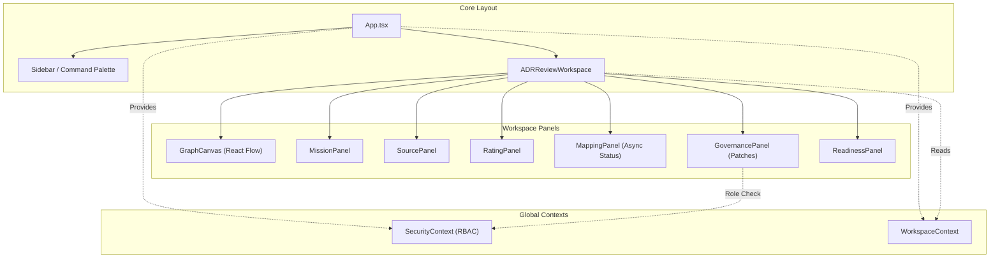

# 🗺️ PROJECT MAP — epios
> Автоматически сгенерировано: `2026-05-16 12:28:56`
> Скрипт: `node dev_studio/refresh.js`

## 📊 Telemetry / Context Health
| Metric | Value | Note |
|---|---|---|
| **Total Files** | `195` | Только JS/TS/TSX исходники |
| **Total Lines** | `23018` | Суммарно по проекту |
| **Project Weight** | `~183 337 tokens` | Оценка (4 символа/токен) |
| **Context Pressure** | `143.2%` | Нагрузка на окно 128k (Full Scan) |
| **Map Efficiency** | `~88%` | Экономия контекста через карту |

---

## Высокоуровневая архитектура
> Связи между основными пакетами и приложениями

```mermaid
flowchart LR

subgraph 0["apps"]
subgraph 1["demo-shell"]
2["check-icons.js"]
subgraph B["dist"]
subgraph C["assets"]
D["index-C4yosIsx.js"]
end
end
subgraph G["src"]
H["App.tsx"]
subgraph M["components"]
N["ADRReviewWorkspace.tsx"]
1K["ApprovalPanel.tsx"]
1L["ArtifactPatchPanel.tsx"]
1M["FinalADRPanel.tsx"]
1N["GovernancePanel.tsx"]
1O["ReadinessPanel.tsx"]
1P["SecureMcpIframe.tsx"]
2G["ArchiveView.tsx"]
2U["AuthScreen.tsx"]
2V["CommandPalette.tsx"]
2W["SecurityDashboard.tsx"]
2X["Sidebar.tsx"]
2Y["Modal.tsx"]
2Z["SettingsModal.tsx"]
30["AssignmentManager.tsx"]
31["RoleSwitcher.tsx"]
32["SidebarItem.tsx"]
33["WorkspaceRoom.tsx"]
34["GraphCanvas.tsx"]
36["CustomNode.tsx"]
37["MissionPanel.tsx"]
38["MappingPanel.tsx"]
39["SourcePanel.tsx"]
3A["RatingPanel.tsx"]
end
U["api-config.ts"]
subgraph V["context"]
W["SecurityContext.tsx"]
2N["WorkspaceContext.tsx"]
end
subgraph 1I["hooks"]
1J["useApi.ts"]
end
3B["i18n.ts"]
3O["main.tsx"]
3P["index.css"]
subgraph 3U["mcp"]
3V["schemas.ts"]
end
subgraph 3W["utils"]
3X["api.ts"]
end
end
end
end
subgraph 3["node_modules"]
subgraph 4[".pnpm"]
subgraph 5["lucide-react@1.14.0_react@18.3.1"]
subgraph 6["node_modules"]
subgraph 7["lucide-react"]
subgraph 8["dist"]
subgraph 9["cjs"]
A["lucide-react.js"]
end
end
end
end
end
subgraph I["react@18.3.1"]
subgraph J["node_modules"]
subgraph K["react"]
L["index.js"]
end
end
end
subgraph O["framer-motion@12.38.0_react-dom@18.3.1_react@18.3.1__react@18.3.1"]
subgraph P["node_modules"]
subgraph Q["framer-motion"]
subgraph R["dist"]
subgraph S["cjs"]
T["index.js"]
end
end
end
end
end
subgraph 2C["zod@4.4.3"]
subgraph 2D["node_modules"]
subgraph 2E["zod"]
2F["index.js"]
end
end
end
subgraph 2H["react-i18next@17.0.7_i18next@26.1.0_typescript@5.9.3__react-dom@18.3.1_react@18.3.1__react@18.3.1_typescript@5.9.3"]
subgraph 2I["node_modules"]
subgraph 2J["react-i18next"]
subgraph 2K["dist"]
subgraph 2L["es"]
2M["index.js"]
end
end
end
end
end
subgraph 2O["reactflow@11.11.4_@types+react@18.3.28_react-dom@18.3.1_react@18.3.1__react@18.3.1"]
subgraph 2P["node_modules"]
subgraph 2Q["reactflow"]
subgraph 2R["dist"]
subgraph 2S["esm"]
2T["index.mjs"]
end
35["style.css"]
end
end
end
end
subgraph 3C["i18next@26.1.0_typescript@5.9.3"]
subgraph 3D["node_modules"]
subgraph 3E["i18next"]
subgraph 3F["dist"]
subgraph 3G["esm"]
3H["i18next.js"]
end
end
end
end
end
subgraph 3I["i18next-browser-languagedetector@8.2.1"]
subgraph 3J["node_modules"]
subgraph 3K["i18next-browser-languagedetector"]
subgraph 3L["dist"]
subgraph 3M["esm"]
3N["i18nextBrowserLanguageDetector.js"]
end
end
end
end
end
subgraph 3Q["react-dom@18.3.1_react@18.3.1"]
subgraph 3R["node_modules"]
subgraph 3S["react-dom"]
3T["client.js"]
end
end
end
subgraph 46["@fastify+cors@8.5.0"]
subgraph 47["node_modules"]
subgraph 48["@fastify"]
subgraph 49["cors"]
4A["index.js"]
end
end
end
end
subgraph 4B["dotenv@16.6.1"]
subgraph 4C["node_modules"]
subgraph 4D["dotenv"]
subgraph 4E["lib"]
4F["main.js"]
end
end
end
end
subgraph 4G["dotenv-expand@11.0.7"]
subgraph 4H["node_modules"]
subgraph 4I["dotenv-expand"]
subgraph 4J["lib"]
4K["main.js"]
end
end
end
end
subgraph 4L["drizzle-orm@0.45.2_postgres@3.4.9"]
subgraph 4M["node_modules"]
subgraph 4N["drizzle-orm"]
subgraph 4O["postgres-js"]
4P["index.js"]
GB["migrator.js"]
end
6Y["index.js"]
subgraph 70["pg-core"]
71["index.js"]
end
end
end
end
subgraph 4Q["fastify@4.29.1"]
subgraph 4R["node_modules"]
subgraph 4S["fastify"]
4T["fastify.js"]
end
end
end
subgraph 4U["postgres@3.4.9"]
subgraph 4V["node_modules"]
subgraph 4W["postgres"]
subgraph 4X["src"]
4Y["index.js"]
end
end
end
end
subgraph 7M["bcrypt@6.0.0"]
subgraph 7N["node_modules"]
subgraph 7O["bcrypt"]
7P["bcrypt.js"]
end
end
end
subgraph 7Q["jsonwebtoken@9.0.3"]
subgraph 7R["node_modules"]
subgraph 7S["jsonwebtoken"]
7T["index.js"]
end
end
end
subgraph 82["vitest@1.6.1_@types+node@25.7.0"]
subgraph 83["node_modules"]
subgraph 84["vitest"]
subgraph 85["dist"]
86["index.js"]
8A["config.cjs"]
end
end
end
end
subgraph FV["drizzle-kit@0.31.10"]
subgraph FW["node_modules"]
subgraph FX["drizzle-kit"]
FY["index.mjs"]
end
end
end
subgraph G5["@testcontainers+postgresql@10.28.0"]
subgraph G6["node_modules"]
subgraph G7["@testcontainers"]
subgraph G8["postgresql"]
subgraph G9["build"]
GA["index.js"]
end
end
end
end
end
end
end
subgraph E["@emotion"]
F["is-prop-valid"]
end
subgraph X["packages"]
subgraph Y["domain"]
subgraph Z["src"]
10["index.ts"]
11["adr.ts"]
12["approval.ts"]
13["errors.ts"]
14["events.ts"]
15["mission.ts"]
16["artifact.ts"]
17["decision.ts"]
18["evidence.ts"]
19["governance.ts"]
1A["node.ts"]
1B["identity.ts"]
1C["mapping.ts"]
1D["policy.ts"]
1E["rating.ts"]
1F["security.ts"]
1G["source.ts"]
1H["workspace.ts"]
end
subgraph BU["coverage"]
BV["block-navigation.js"]
BW["prettify.js"]
BX["sorter.js"]
end
subgraph BY["dist"]
BZ["adr.d.ts"]
C0["adr.js"]
C1["approval.d.ts"]
C2["events.js"]
C3["mission.js"]
C4["errors.js"]
C5["approval.js"]
C6["artifact.d.ts"]
C7["artifact.js"]
C8["decision.d.ts"]
C9["decision.js"]
CA["errors.d.ts"]
CB["events.d.ts"]
CC["evidence.d.ts"]
CD["evidence.js"]
CE["governance.d.ts"]
CF["node.js"]
CG["governance.js"]
CH["index.d.ts"]
CI["mapping.js"]
CJ["policy.js"]
CK["rating.js"]
CL["security.js"]
CM["source.js"]
CN["workspace.js"]
CO["index.js"]
CP["mapping.d.ts"]
CQ["mission.d.ts"]
CR["node.d.ts"]
CS["policy.d.ts"]
CT["rating.d.ts"]
CU["security.d.ts"]
CV["source.d.ts"]
CW["workspace.d.ts"]
end
subgraph CX["test"]
CY["domain-smoke.test.ts"]
CZ["evidence.test.ts"]
D0["mission.test.ts"]
D1["node-invariants.test.ts"]
D2["patch-policy.test.ts"]
D3["source-rating.test.ts"]
D4["workspace.test.ts"]
end
D5["vitest.config.ts"]
end
subgraph 1Q["infrastructure-mcp"]
subgraph 1R["src"]
1S["index.ts"]
1T["mcp-app.registry.ts"]
2A["mcp-bridge.ts"]
2B["schemas.ts"]
end
subgraph D6["dist"]
subgraph D7["domain"]
subgraph D8["src"]
D9["adr.d.ts"]
DA["adr.js"]
DB["approval.d.ts"]
DC["events.js"]
DD["mission.js"]
DE["errors.js"]
DF["approval.js"]
DG["artifact.d.ts"]
DH["artifact.js"]
DI["decision.d.ts"]
DJ["decision.js"]
DK["errors.d.ts"]
DL["events.d.ts"]
DM["evidence.d.ts"]
DN["evidence.js"]
DO["governance.d.ts"]
DP["node.js"]
DQ["governance.js"]
DR["identity.d.ts"]
DS["identity.js"]
DT["index.d.ts"]
DU["mapping.js"]
DV["policy.js"]
DW["rating.js"]
DX["security.js"]
DY["source.js"]
DZ["workspace.js"]
E0["index.js"]
E1["mapping.d.ts"]
E2["mission.d.ts"]
E3["node.d.ts"]
E4["policy.d.ts"]
E5["rating.d.ts"]
E6["security.d.ts"]
E7["source.d.ts"]
E8["workspace.d.ts"]
end
end
E9["index.d.ts"]
EA["mcp-app.registry.js"]
EB["mcp-bridge.js"]
EC["index.js"]
subgraph ED["infrastructure-mcp"]
subgraph EE["src"]
EF["index.d.ts"]
EG["mcp-app.registry.js"]
EH["mcp-bridge.js"]
EI["schemas.js"]
EJ["index.js"]
EK["mcp-app.registry.d.ts"]
EL["mcp-bridge.d.ts"]
EM["schemas.d.ts"]
end
end
EN["mcp-app.registry.d.ts"]
EQ["mcp-bridge.d.ts"]
subgraph ER["ports"]
subgraph ES["src"]
ET["adr.repository.port.d.ts"]
EU["adr.repository.port.js"]
EV["artifact.repository.port.d.ts"]
EW["artifact.repository.port.js"]
EX["decision.repository.port.d.ts"]
EY["decision.repository.port.js"]
EZ["domain.repository.port.d.ts"]
F0["domain.repository.port.js"]
F1["evidence.repository.port.d.ts"]
F2["evidence.repository.port.js"]
F3["governance.port.d.ts"]
F4["governance.port.js"]
F5["graph.repository.port.d.ts"]
F6["graph.repository.port.js"]
F7["identity.repository.port.d.ts"]
F8["identity.repository.port.js"]
F9["index.d.ts"]
FA["mcp.port.js"]
FB["mission.repository.port.js"]
FC["outbox.repository.port.js"]
FD["security.port.js"]
FE["unit-of-work.port.js"]
FF["index.js"]
FG["mapping.repository.port.d.ts"]
FH["mapping.repository.port.js"]
FI["mcp.port.d.ts"]
FJ["mission.repository.port.d.ts"]
FK["outbox.repository.port.d.ts"]
FL["security.port.d.ts"]
FM["unit-of-work.port.d.ts"]
end
end
end
subgraph FN["test"]
FO["mcp-bridge.test.ts"]
FP["security.test.ts"]
FQ["smoke.test.ts"]
end
end
subgraph 1U["ports"]
subgraph 1V["src"]
1W["index.ts"]
1X["adr.repository.port.ts"]
1Y["artifact.repository.port.ts"]
1Z["decision.repository.port.ts"]
20["domain.repository.port.ts"]
21["evidence.repository.port.ts"]
22["governance.port.ts"]
23["graph.repository.port.ts"]
24["identity.repository.port.ts"]
25["mcp.port.ts"]
26["mission.repository.port.ts"]
27["outbox.repository.port.ts"]
28["security.port.ts"]
29["unit-of-work.port.ts"]
KZ["mapping.repository.port.ts"]
end
subgraph J4["dist"]
subgraph J5["domain"]
subgraph J6["src"]
J7["adr.d.ts"]
J8["adr.js"]
J9["approval.d.ts"]
JA["events.js"]
JB["mission.js"]
JC["errors.js"]
JD["approval.js"]
JE["artifact.d.ts"]
JF["artifact.js"]
JG["decision.d.ts"]
JH["decision.js"]
JI["errors.d.ts"]
JJ["events.d.ts"]
JK["evidence.d.ts"]
JL["evidence.js"]
JM["governance.d.ts"]
JN["node.js"]
JO["governance.js"]
JP["index.d.ts"]
JQ["mapping.js"]
JR["policy.js"]
JS["rating.js"]
JT["security.js"]
JU["source.js"]
JV["workspace.js"]
JW["index.js"]
JX["mapping.d.ts"]
JY["mission.d.ts"]
JZ["node.d.ts"]
K0["policy.d.ts"]
K1["rating.d.ts"]
K2["security.d.ts"]
K3["source.d.ts"]
K4["workspace.d.ts"]
end
end
subgraph K5["ports"]
subgraph K6["src"]
K7["adr.repository.port.d.ts"]
K8["adr.repository.port.js"]
K9["artifact.repository.port.d.ts"]
KA["artifact.repository.port.js"]
KB["decision.repository.port.d.ts"]
KC["decision.repository.port.js"]
KD["domain.repository.port.d.ts"]
KE["domain.repository.port.js"]
KF["evidence.repository.port.d.ts"]
KG["evidence.repository.port.js"]
KH["governance.port.d.ts"]
KI["governance.port.js"]
KJ["graph.repository.port.d.ts"]
KK["graph.repository.port.js"]
KL["index.d.ts"]
KM["mcp.port.js"]
KN["mission.repository.port.js"]
KO["outbox.repository.port.js"]
KP["security.port.js"]
KQ["unit-of-work.port.js"]
KR["index.js"]
KS["mapping.repository.port.d.ts"]
KT["mapping.repository.port.js"]
KU["mcp.port.d.ts"]
KV["mission.repository.port.d.ts"]
KW["outbox.repository.port.d.ts"]
KX["security.port.d.ts"]
KY["unit-of-work.port.d.ts"]
end
end
end
end
subgraph 3Y["api"]
subgraph 3Z["coverage"]
40["block-navigation.js"]
41["prettify.js"]
42["sorter.js"]
end
subgraph 43["src"]
44["bin.ts"]
45["server.ts"]
4Z["identity-context.ts"]
6H["mock-data.ts"]
subgraph 6I["routes"]
6J["adr.routes.ts"]
6K["governance.routes.ts"]
6L["identity.routes.ts"]
6M["mapping.routes.ts"]
6P["mcp.routes.ts"]
6Q["rating.routes.ts"]
6R["security.routes.ts"]
6S["source.routes.ts"]
6T["workspace.routes.ts"]
end
subgraph 6N["dto"]
6O["index.ts"]
end
subgraph 7U["contracts"]
7V["openapi.ts"]
7W["schemas.ts"]
end
7X["index.ts"]
7Y["ui-wrapper.ts"]
end
subgraph 80["test"]
81["adr.test.ts"]
87["api.test.ts"]
end
88["vitest.config.ts"]
end
subgraph 50["application"]
subgraph 51["src"]
52["index.ts"]
53["mapping-processor.ts"]
subgraph 55["use-cases"]
56["add-edge.ts"]
5C["add-node.ts"]
5D["adr-use-cases.ts"]
5E["apply-artifact-patch.ts"]
5F["apply-patch.ts"]
5G["apply-retention.ts"]
5H["assess-readiness.ts"]
5I["cast-vote.ts"]
5J["create-mission.ts"]
5K["create-workspace.ts"]
5L["delete-mission.ts"]
5M["delete-source.ts"]
5N["generate-final-adr.ts"]
5O["get-mapping-run.ts"]
5P["get-node-ratings.ts"]
5Q["get-readiness.ts"]
5R["get-trace-summary.ts"]
5S["get-trace.ts"]
5T["get-workspace-graph.ts"]
subgraph 5U["identity"]
5V["list-all-assignments.ts"]
5W["list-user-assignments.ts"]
5X["manage-assignment.ts"]
end
5Y["ingest-source.ts"]
5Z["list-approvals.ts"]
60["list-artifact-patches.ts"]
61["list-mapping-runs.ts"]
62["list-patches.ts"]
63["list-sources.ts"]
64["list-workspaces.ts"]
65["login.ts"]
66["patch-node.ts"]
67["patch-workspace.ts"]
68["propose-artifact-patch.ts"]
69["propose-patch.ts"]
6A["rate-node.ts"]
6B["rate-source.ts"]
6C["redact-node.ts"]
6D["resolve-approval.ts"]
6E["run-mapping.ts"]
6F["submit-claim.ts"]
6G["update-mission-brief.ts"]
end
subgraph BL["__tests__"]
BM["readiness.test.ts"]
end
end
subgraph 8B["dist"]
subgraph 8C["application"]
subgraph 8D["src"]
8E["mapping-processor.d.ts"]
8F["mapping-processor.js"]
subgraph 8G["use-cases"]
8H["add-edge.d.ts"]
8I["add-edge.js"]
8J["add-node.d.ts"]
8K["add-node.js"]
8L["adr-use-cases.d.ts"]
8M["adr-use-cases.js"]
8N["cast-vote.d.ts"]
8O["cast-vote.js"]
8P["create-mission.d.ts"]
8Q["create-mission.js"]
8R["create-workspace.d.ts"]
8S["create-workspace.js"]
8T["get-mapping-run.d.ts"]
8U["get-mapping-run.js"]
8V["get-node-ratings.d.ts"]
8W["get-node-ratings.js"]
8X["get-workspace-graph.d.ts"]
8Y["get-workspace-graph.js"]
8Z["ingest-source.d.ts"]
90["ingest-source.js"]
91["list-mapping-runs.d.ts"]
92["list-mapping-runs.js"]
93["list-sources.d.ts"]
94["list-sources.js"]
95["list-workspaces.d.ts"]
96["list-workspaces.js"]
97["patch-node.d.ts"]
98["patch-node.js"]
99["propose-patch.d.ts"]
9A["propose-patch.js"]
9B["rate-node.d.ts"]
9C["rate-node.js"]
9D["rate-source.d.ts"]
9E["rate-source.js"]
9F["run-mapping.d.ts"]
9G["run-mapping.js"]
9H["submit-claim.d.ts"]
9I["submit-claim.js"]
9J["update-mission-brief.d.ts"]
9K["update-mission-brief.js"]
end
end
end
subgraph 9L["domain"]
subgraph 9M["src"]
9N["adr.d.ts"]
9O["adr.js"]
9P["approval.d.ts"]
9Q["events.js"]
9R["mission.js"]
9S["errors.js"]
9T["approval.js"]
9U["artifact.d.ts"]
9V["artifact.js"]
9W["decision.d.ts"]
9X["decision.js"]
9Y["errors.d.ts"]
9Z["events.d.ts"]
A0["evidence.d.ts"]
A1["evidence.js"]
A2["governance.d.ts"]
A3["node.js"]
A4["governance.js"]
A5["index.d.ts"]
A6["mapping.js"]
A7["policy.js"]
A8["rating.js"]
A9["security.js"]
AA["source.js"]
AB["workspace.js"]
AC["index.js"]
AD["mapping.d.ts"]
AE["mission.d.ts"]
AF["node.d.ts"]
AG["policy.d.ts"]
AH["rating.d.ts"]
AI["security.d.ts"]
AJ["source.d.ts"]
AK["workspace.d.ts"]
end
end
subgraph AL["observability"]
subgraph AM["src"]
AN["audit.d.ts"]
AO["audit.js"]
AP["index.d.ts"]
AQ["tracer.js"]
AR["index.js"]
AS["tracer.d.ts"]
end
end
subgraph AT["ports"]
subgraph AU["src"]
AV["adr.repository.port.d.ts"]
AW["adr.repository.port.js"]
AX["artifact.repository.port.d.ts"]
AY["artifact.repository.port.js"]
AZ["decision.repository.port.d.ts"]
B0["decision.repository.port.js"]
B1["domain.repository.port.d.ts"]
B2["domain.repository.port.js"]
B3["evidence.repository.port.d.ts"]
B4["evidence.repository.port.js"]
B5["governance.port.d.ts"]
B6["governance.port.js"]
B7["graph.repository.port.d.ts"]
B8["graph.repository.port.js"]
B9["index.d.ts"]
BA["mcp.port.js"]
BB["mission.repository.port.js"]
BC["outbox.repository.port.js"]
BD["security.port.js"]
BE["unit-of-work.port.js"]
BF["index.js"]
BG["mcp.port.d.ts"]
BH["mission.repository.port.d.ts"]
BI["outbox.repository.port.d.ts"]
BJ["security.port.d.ts"]
BK["unit-of-work.port.d.ts"]
end
end
end
subgraph BN["test"]
BO["artifact-patch-flow.test.ts"]
BP["async-runtime.test.ts"]
BQ["create-workspace.test.ts"]
BR["mission.use-cases.test.ts"]
BS["use-cases.test.ts"]
end
BT["vitest.config.ts"]
end
subgraph 57["observability"]
subgraph 58["src"]
59["index.ts"]
5A["audit.ts"]
5B["tracer.ts"]
end
subgraph IV["dist"]
IW["audit.d.ts"]
IX["audit.js"]
IY["index.d.ts"]
IZ["tracer.js"]
J0["index.js"]
J1["tracer.d.ts"]
end
subgraph J2["test"]
J3["redaction.test.ts"]
end
end
subgraph 6U["infrastructure-postgres"]
subgraph 6V["src"]
6W["index.ts"]
6X["artifact.repository.ts"]
6Z["schema.ts"]
72["decision.repository.ts"]
73["evidence.repository.ts"]
74["governance.repository.ts"]
75["graph.repository.ts"]
76["identity.repository.ts"]
77["mapping.repository.ts"]
78["mission.repository.ts"]
79["outbox.repository.ts"]
7A["rating.repository.ts"]
7B["source.repository.ts"]
7C["unit-of-work.ts"]
7D["workspace.repository.ts"]
FZ["manual_migrate.ts"]
subgraph G0["scripts"]
G1["seed-identity.ts"]
end
G2["seed.ts"]
end
FU["drizzle.config.ts"]
subgraph G3["test"]
G4["container-setup.ts"]
GD["graph-concurrency.test.ts"]
GE["repository-integration.test.ts"]
GF["transactional-integrity.test.ts"]
end
end
subgraph 7E["infrastructure-runtime"]
subgraph 7F["src"]
7G["index.ts"]
7H["in-memory-governance.repository.ts"]
7I["in-memory-repositories.ts"]
7J["in-memory-unit-of-work.ts"]
7K["outbox-worker.ts"]
7L["security-mocks.ts"]
end
subgraph GG["dist"]
subgraph GH["domain"]
subgraph GI["src"]
GJ["adr.d.ts"]
GK["adr.js"]
GL["approval.d.ts"]
GM["events.js"]
GN["mission.js"]
GO["errors.js"]
GP["approval.js"]
GQ["artifact.d.ts"]
GR["artifact.js"]
GS["decision.d.ts"]
GT["decision.js"]
GU["errors.d.ts"]
GV["events.d.ts"]
GW["evidence.d.ts"]
GX["evidence.js"]
GY["governance.d.ts"]
GZ["node.js"]
H0["governance.js"]
H1["index.d.ts"]
H2["mapping.js"]
H3["policy.js"]
H4["rating.js"]
H5["security.js"]
H6["source.js"]
H7["workspace.js"]
H8["index.js"]
H9["mapping.d.ts"]
HA["mission.d.ts"]
HB["node.d.ts"]
HC["policy.d.ts"]
HD["rating.d.ts"]
HE["security.d.ts"]
HF["source.d.ts"]
HG["workspace.d.ts"]
end
end
subgraph HH["infrastructure-runtime"]
subgraph HI["src"]
HJ["in-memory-governance.repository.d.ts"]
HK["in-memory-governance.repository.js"]
HL["in-memory-repositories.d.ts"]
HM["in-memory-repositories.js"]
HN["in-memory-unit-of-work.d.ts"]
HO["in-memory-unit-of-work.js"]
HP["index.d.ts"]
HQ["outbox-worker.js"]
HR["security-mocks.js"]
HS["index.js"]
HT["outbox-worker.d.ts"]
HU["security-mocks.d.ts"]
end
end
subgraph HV["observability"]
subgraph HW["src"]
HX["audit.d.ts"]
HY["audit.js"]
HZ["index.d.ts"]
I0["tracer.js"]
I1["index.js"]
I2["tracer.d.ts"]
end
end
subgraph I3["ports"]
subgraph I4["src"]
I5["adr.repository.port.d.ts"]
I6["adr.repository.port.js"]
I7["artifact.repository.port.d.ts"]
I8["artifact.repository.port.js"]
I9["decision.repository.port.d.ts"]
IA["decision.repository.port.js"]
IB["domain.repository.port.d.ts"]
IC["domain.repository.port.js"]
ID["evidence.repository.port.d.ts"]
IE["evidence.repository.port.js"]
IF["governance.port.d.ts"]
IG["governance.port.js"]
IH["graph.repository.port.d.ts"]
II["graph.repository.port.js"]
IJ["index.d.ts"]
IK["mcp.port.js"]
IL["mission.repository.port.js"]
IM["outbox.repository.port.js"]
IN["security.port.js"]
IO["unit-of-work.port.js"]
IP["index.js"]
IQ["mcp.port.d.ts"]
IR["mission.repository.port.d.ts"]
IS["outbox.repository.port.d.ts"]
IT["security.port.d.ts"]
IU["unit-of-work.port.d.ts"]
end
end
end
end
subgraph FR["infrastructure-models"]
subgraph FS["src"]
FT["index.ts"]
end
end
subgraph L0["testing"]
subgraph L1["src"]
L2["fixtures.ts"]
L3["index.ts"]
end
end
end
54["crypto"]
7Z["child_process"]
89["path"]
subgraph EO["@epos"]
EP["ports"]
end
GC["url"]
2-->A
D-->F
H-->N
H-->2G
H-->2U
H-->2V
H-->2W
H-->2X
H-->33
H-->W
H-->2N
H-->L
N-->U
N-->W
N-->1J
N-->1K
N-->1L
N-->1M
N-->1N
N-->1O
N-->1P
N-->T
N-->A
N-->L
W-->U
W-->10
W-->L
10-->11
10-->12
10-->16
10-->17
10-->13
10-->14
10-->18
10-->19
10-->1B
10-->1C
10-->15
10-->1A
10-->1D
10-->1E
10-->1F
10-->1G
10-->1H
12-->13
12-->14
12-->15
15-->13
15-->14
16-->13
16-->14
16-->15
17-->15
18-->13
19-->13
19-->14
19-->1A
1A-->13
1A-->14
1B-->13
1D-->16
1F-->1B
1G-->13
1H-->13
1J-->U
1J-->W
1J-->L
1K-->U
1K-->W
1K-->T
1K-->A
1K-->L
1L-->U
1L-->W
1L-->T
1L-->A
1L-->L
1M-->U
1M-->T
1M-->A
1M-->L
1N-->U
1N-->W
1N-->T
1N-->A
1N-->L
1O-->U
1O-->T
1O-->A
1O-->L
1P-->1S
1P-->L
1S-->1T
1S-->2A
1S-->2B
1T-->1W
1W-->1X
1W-->1Y
1W-->1Z
1W-->20
1W-->21
1W-->22
1W-->23
1W-->24
1W-->25
1W-->26
1W-->27
1W-->28
1W-->29
1X-->10
1Y-->10
1Z-->10
20-->10
21-->10
22-->10
23-->10
24-->10
26-->10
28-->10
29-->1Y
29-->1Z
29-->20
29-->21
29-->22
29-->23
29-->26
29-->27
2A-->2B
2A-->10
2A-->1W
2B-->2F
2G-->2N
2G-->T
2G-->A
2G-->L
2G-->2M
2N-->U
2N-->1J
2N-->W
2N-->10
2N-->L
2N-->2T
2U-->U
2U-->A
2U-->L
2V-->2N
2V-->T
2V-->A
2V-->L
2W-->L
2X-->U
2X-->W
2X-->2N
2X-->2Y
2X-->2Z
2X-->32
2X-->10
2X-->T
2X-->A
2X-->L
2X-->2M
2Y-->T
2Y-->A
2Y-->L
2Z-->W
2Z-->2N
2Z-->30
2Z-->2Y
2Z-->31
2Z-->2W
2Z-->A
2Z-->L
2Z-->2M
30-->A
30-->L
31-->W
31-->A
31-->L
32-->T
32-->A
32-->L
32-->2M
33-->U
33-->W
33-->2N
33-->34
33-->37
33-->3A
33-->10
33-->T
33-->A
33-->L
34-->2N
34-->1J
34-->36
34-->A
34-->L
34-->2T
34-->35
36-->A
36-->L
36-->2T
37-->1N
37-->38
37-->39
37-->10
37-->T
37-->A
37-->L
38-->U
38-->10
38-->T
38-->A
38-->L
39-->U
39-->T
39-->A
39-->L
3A-->U
3A-->A
3A-->L
3B-->3H
3B-->3N
3B-->2M
3O-->H
3O-->W
3O-->2N
3O-->3B
3O-->3P
3O-->L
3O-->3T
3O-->35
3V-->2F
3X-->U
44-->45
45-->4Z
45-->6H
45-->6J
45-->6K
45-->6L
45-->6M
45-->6P
45-->6Q
45-->6R
45-->6S
45-->6T
45-->52
45-->10
45-->1S
45-->6W
45-->7G
45-->1W
45-->4A
45-->4F
45-->4K
45-->4P
45-->4T
45-->4Y
4Z-->52
4Z-->1W
52-->53
52-->56
52-->5C
52-->5D
52-->5E
52-->5F
52-->5G
52-->5H
52-->5I
52-->5J
52-->5K
52-->5L
52-->5M
52-->5N
52-->5O
52-->5P
52-->5Q
52-->5R
52-->5S
52-->5T
52-->5V
52-->5W
52-->5X
52-->5Y
52-->5Z
52-->60
52-->61
52-->62
52-->63
52-->64
52-->65
52-->66
52-->67
52-->68
52-->69
52-->6A
52-->6B
52-->6C
52-->6D
52-->6E
52-->6F
52-->6G
53-->10
53-->1W
53-->54
56-->10
56-->59
56-->1W
56-->54
59-->5A
59-->5B
5C-->10
5C-->59
5C-->1W
5C-->54
5D-->10
5D-->1W
5E-->10
5E-->1W
5E-->54
5F-->10
5F-->1W
5F-->54
5G-->10
5G-->1W
5H-->10
5H-->1W
5H-->54
5I-->10
5I-->59
5I-->1W
5I-->54
5J-->10
5J-->1W
5J-->54
5K-->10
5K-->59
5K-->1W
5K-->54
5L-->1W
5L-->54
5M-->1W
5M-->54
5N-->10
5N-->1W
5O-->10
5O-->1W
5P-->10
5P-->1W
5Q-->10
5Q-->1W
5R-->1W
5S-->10
5S-->1W
5T-->10
5T-->1W
5V-->10
5V-->1W
5W-->10
5W-->1W
5X-->10
5X-->1W
5Y-->10
5Y-->1W
5Y-->54
5Z-->10
5Z-->1W
60-->10
60-->1W
61-->10
61-->1W
62-->10
62-->1W
63-->10
63-->1W
64-->10
64-->1W
65-->10
65-->1W
66-->10
66-->1W
67-->10
67-->1W
68-->10
68-->1W
68-->54
69-->10
69-->1W
69-->54
6A-->10
6A-->1W
6A-->54
6B-->10
6B-->1W
6B-->54
6C-->10
6C-->1W
6D-->10
6D-->1W
6D-->54
6E-->10
6E-->1W
6E-->54
6F-->10
6F-->1W
6F-->54
6G-->10
6G-->1W
6G-->54
6H-->10
6J-->52
6J-->4T
6K-->52
6K-->10
6K-->1W
6K-->4T
6L-->4Z
6L-->4T
6M-->6O
6M-->52
6M-->4T
6O-->10
6P-->1S
6P-->1W
6P-->4T
6Q-->52
6Q-->10
6Q-->4T
6R-->52
6R-->10
6R-->1W
6R-->4T
6S-->52
6S-->10
6S-->4T
6T-->6O
6T-->52
6T-->4T
6W-->6X
6W-->72
6W-->73
6W-->74
6W-->75
6W-->76
6W-->77
6W-->78
6W-->79
6W-->7A
6W-->6Z
6W-->7B
6W-->7C
6W-->7D
6X-->6Z
6X-->10
6X-->1W
6X-->6Y
6X-->4P
6Z-->71
72-->6Z
72-->10
72-->1W
72-->6Y
72-->4P
73-->6Z
73-->10
73-->1W
73-->6Y
73-->4P
74-->6Z
74-->10
74-->59
74-->1W
74-->6Y
74-->4P
75-->6Z
75-->10
75-->1W
75-->6Y
75-->4P
76-->6Z
76-->10
76-->1W
76-->6Y
76-->4P
77-->6Z
77-->10
77-->1W
77-->6Y
77-->4P
78-->6Z
78-->10
78-->1W
78-->6Y
78-->4P
79-->6Z
79-->1W
79-->6Y
79-->4P
7A-->6Z
7A-->10
7A-->1W
7A-->6Y
7A-->4P
7B-->6Z
7B-->10
7B-->1W
7B-->54
7B-->6Y
7B-->4P
7C-->6X
7C-->72
7C-->73
7C-->74
7C-->75
7C-->77
7C-->78
7C-->79
7C-->7A
7C-->7B
7C-->7D
7C-->1W
7C-->4P
7D-->6Z
7D-->10
7D-->1W
7D-->6Y
7D-->4P
7G-->7H
7G-->7I
7G-->7J
7G-->7K
7G-->7L
7H-->10
7H-->1W
7I-->10
7I-->1W
7J-->1W
7K-->59
7K-->1W
7L-->10
7L-->1W
7L-->7P
7L-->54
7L-->7T
7W-->2F
7X-->45
7Y-->7Z
81-->45
81-->4T
81-->86
87-->45
87-->10
87-->1W
87-->4T
87-->86
88-->89
88-->8A
8E-->1W
8F-->10
8F-->54
8H-->10
8H-->1W
8I-->59
8I-->54
8J-->10
8J-->1W
8K-->10
8K-->59
8K-->54
8L-->10
8L-->1W
8N-->1W
8O-->59
8O-->54
8P-->10
8P-->1W
8Q-->10
8Q-->54
8R-->10
8R-->1W
8S-->10
8S-->59
8S-->54
8T-->10
8T-->1W
8V-->10
8V-->1W
8X-->10
8X-->1W
8Z-->10
8Z-->1W
90-->10
90-->54
91-->10
91-->1W
93-->10
93-->1W
95-->10
95-->1W
97-->10
97-->1W
99-->10
99-->1W
9A-->10
9A-->54
9B-->10
9B-->1W
9C-->54
9D-->10
9D-->1W
9E-->54
9F-->10
9F-->1W
9G-->10
9G-->54
9H-->10
9H-->1W
9I-->10
9I-->54
9J-->10
9J-->1W
9K-->54
9P-->9Q
9P-->9R
9R-->9S
9T-->9S
9U-->9Q
9U-->9R
9V-->9S
9W-->9R
A1-->9S
A2-->9Q
A2-->A3
A3-->9S
A4-->9S
A5-->9O
A5-->9T
A5-->9V
A5-->9X
A5-->9S
A5-->9Q
A5-->A1
A5-->A4
A5-->A6
A5-->9R
A5-->A3
A5-->A7
A5-->A8
A5-->A9
A5-->AA
A5-->AB
AA-->9S
AB-->9S
AC-->9O
AC-->9T
AC-->9V
AC-->9X
AC-->9S
AC-->9Q
AC-->A1
AC-->A4
AC-->A6
AC-->9R
AC-->A3
AC-->A7
AC-->A8
AC-->A9
AC-->AA
AC-->AB
AE-->9Q
AF-->9Q
AG-->9V
AP-->AO
AP-->AQ
AR-->AO
AR-->AQ
AV-->10
AX-->10
AZ-->10
B1-->10
B3-->10
B5-->10
B7-->10
B9-->AW
B9-->AY
B9-->B0
B9-->B2
B9-->B4
B9-->B6
B9-->B8
B9-->BA
B9-->BB
B9-->BC
B9-->BD
B9-->BE
BF-->AW
BF-->AY
BF-->B0
BF-->B2
BF-->B4
BF-->B6
BF-->B8
BF-->BA
BF-->BB
BF-->BC
BF-->BD
BF-->BE
BH-->10
BJ-->10
BK-->AY
BK-->B0
BK-->B2
BK-->B4
BK-->B6
BK-->B8
BK-->BB
BK-->BC
BM-->5H
BM-->1W
BM-->86
BO-->52
BO-->10
BO-->7G
BO-->86
BP-->6E
BP-->1W
BP-->54
BP-->86
BQ-->5K
BQ-->1W
BQ-->86
BR-->5J
BR-->5Y
BR-->6E
BR-->6G
BR-->10
BR-->1W
BR-->86
BS-->56
BS-->5C
BS-->5I
BS-->5K
BS-->5T
BS-->64
BS-->66
BS-->6F
BS-->10
BS-->1W
BS-->86
BT-->89
BT-->8A
C1-->C2
C1-->C3
C3-->C4
C5-->C4
C6-->C2
C6-->C3
C7-->C4
C8-->C3
CD-->C4
CE-->C2
CE-->CF
CF-->C4
CG-->C4
CH-->C0
CH-->C5
CH-->C7
CH-->C9
CH-->C4
CH-->C2
CH-->CD
CH-->CG
CH-->CI
CH-->C3
CH-->CF
CH-->CJ
CH-->CK
CH-->CL
CH-->CM
CH-->CN
CM-->C4
CN-->C4
CO-->C0
CO-->C5
CO-->C7
CO-->C9
CO-->C4
CO-->C2
CO-->CD
CO-->CG
CO-->CI
CO-->C3
CO-->CF
CO-->CJ
CO-->CK
CO-->CL
CO-->CM
CO-->CN
CQ-->C2
CR-->C2
CS-->C7
CY-->10
CY-->86
CZ-->18
CZ-->86
D0-->15
D0-->86
D1-->10
D1-->86
D2-->10
D2-->86
D3-->10
D3-->86
D4-->13
D4-->1H
D4-->86
D5-->8A
DB-->DC
DB-->DD
DD-->DE
DF-->DE
DG-->DC
DG-->DD
DH-->DE
DI-->DD
DN-->DE
DO-->DC
DO-->DP
DP-->DE
DQ-->DE
DS-->DE
DT-->DA
DT-->DF
DT-->DH
DT-->DJ
DT-->DE
DT-->DC
DT-->DN
DT-->DQ
DT-->DS
DT-->DU
DT-->DD
DT-->DP
DT-->DV
DT-->DW
DT-->DX
DT-->DY
DT-->DZ
DY-->DE
DZ-->DE
E0-->DA
E0-->DF
E0-->DH
E0-->DJ
E0-->DE
E0-->DC
E0-->DN
E0-->DQ
E0-->DS
E0-->DU
E0-->DD
E0-->DP
E0-->DV
E0-->DW
E0-->DX
E0-->DY
E0-->DZ
E2-->DC
E3-->DC
E4-->DH
E6-->DS
E9-->EA
E9-->EB
EC-->EA
EC-->EB
EF-->EG
EF-->EH
EF-->EI
EH-->EI
EH-->10
EI-->2F
EJ-->EG
EJ-->EH
EJ-->EI
EK-->1W
EL-->1W
EM-->2F
EN-->EP
EQ-->EP
ET-->10
EV-->10
EX-->10
EZ-->10
F1-->10
F3-->10
F5-->10
F7-->10
F9-->EU
F9-->EW
F9-->EY
F9-->F0
F9-->F2
F9-->F4
F9-->F6
F9-->F8
F9-->FA
F9-->FB
F9-->FC
F9-->FD
F9-->FE
FF-->EU
FF-->EW
FF-->EY
FF-->F0
FF-->F2
FF-->F4
FF-->F6
FF-->F8
FF-->FA
FF-->FB
FF-->FC
FF-->FD
FF-->FE
FG-->10
FJ-->10
FL-->10
FM-->EW
FM-->EY
FM-->F0
FM-->F2
FM-->F4
FM-->F6
FM-->FB
FM-->FC
FO-->2A
FO-->1W
FO-->86
FP-->2A
FP-->10
FP-->1W
FP-->86
FQ-->86
FU-->4F
FU-->4K
FU-->FY
FZ-->4F
FZ-->4K
FZ-->4Y
G1-->6Z
G1-->7P
G1-->54
G1-->4F
G1-->4P
G1-->4Y
G2-->6Z
G2-->4F
G2-->4K
G2-->4P
G2-->4Y
G4-->GA
G4-->4P
G4-->GB
G4-->89
G4-->4Y
G4-->GC
GD-->75
GD-->G4
GD-->10
GD-->GA
GD-->4P
GD-->4Y
GD-->86
GE-->7D
GE-->G4
GE-->10
GE-->GA
GE-->4P
GE-->4Y
GE-->86
GF-->78
GF-->7C
GF-->7D
GF-->G4
GF-->10
GF-->GA
GF-->4P
GF-->4Y
GF-->86
GL-->GM
GL-->GN
GN-->GO
GP-->GO
GQ-->GM
GQ-->GN
GR-->GO
GS-->GN
GX-->GO
GY-->GM
GY-->GZ
GZ-->GO
H0-->GO
H1-->GK
H1-->GP
H1-->GR
H1-->GT
H1-->GO
H1-->GM
H1-->GX
H1-->H0
H1-->H2
H1-->GN
H1-->GZ
H1-->H3
H1-->H4
H1-->H5
H1-->H6
H1-->H7
H6-->GO
H7-->GO
H8-->GK
H8-->GP
H8-->GR
H8-->GT
H8-->GO
H8-->GM
H8-->GX
H8-->H0
H8-->H2
H8-->GN
H8-->GZ
H8-->H3
H8-->H4
H8-->H5
H8-->H6
H8-->H7
HA-->GM
HB-->GM
HC-->GR
HJ-->10
HJ-->1W
HK-->10
HL-->10
HL-->1W
HM-->10
HN-->1W
HP-->HK
HP-->HM
HP-->HO
HP-->HQ
HP-->HR
HQ-->59
HR-->54
HS-->HK
HS-->HM
HS-->HO
HS-->HQ
HS-->HR
HT-->1W
HU-->10
HU-->1W
HZ-->HY
HZ-->I0
I1-->HY
I1-->I0
I5-->10
I7-->10
I9-->10
IB-->10
ID-->10
IF-->10
IH-->10
IJ-->I6
IJ-->I8
IJ-->IA
IJ-->IC
IJ-->IE
IJ-->IG
IJ-->II
IJ-->IK
IJ-->IL
IJ-->IM
IJ-->IN
IJ-->IO
IP-->I6
IP-->I8
IP-->IA
IP-->IC
IP-->IE
IP-->IG
IP-->II
IP-->IK
IP-->IL
IP-->IM
IP-->IN
IP-->IO
IR-->10
IT-->10
IU-->I8
IU-->IA
IU-->IC
IU-->IE
IU-->IG
IU-->II
IU-->IL
IU-->IM
IY-->IX
IY-->IZ
J0-->IX
J0-->IZ
J3-->5B
J3-->86
J9-->JA
J9-->JB
JB-->JC
JD-->JC
JE-->JA
JE-->JB
JF-->JC
JG-->JB
JL-->JC
JM-->JA
JM-->JN
JN-->JC
JO-->JC
JP-->J8
JP-->JD
JP-->JF
JP-->JH
JP-->JC
JP-->JA
JP-->JL
JP-->JO
JP-->JQ
JP-->JB
JP-->JN
JP-->JR
JP-->JS
JP-->JT
JP-->JU
JP-->JV
JU-->JC
JV-->JC
JW-->J8
JW-->JD
JW-->JF
JW-->JH
JW-->JC
JW-->JA
JW-->JL
JW-->JO
JW-->JQ
JW-->JB
JW-->JN
JW-->JR
JW-->JS
JW-->JT
JW-->JU
JW-->JV
JY-->JA
JZ-->JA
K0-->JF
K7-->10
K9-->10
KB-->10
KD-->10
KF-->10
KH-->10
KJ-->10
KL-->K8
KL-->KA
KL-->KC
KL-->KE
KL-->KG
KL-->KI
KL-->KK
KL-->KM
KL-->KN
KL-->KO
KL-->KP
KL-->KQ
KR-->K8
KR-->KA
KR-->KC
KR-->KE
KR-->KG
KR-->KI
KR-->KK
KR-->KM
KR-->KN
KR-->KO
KR-->KP
KR-->KQ
KS-->10
KV-->10
KX-->10
KY-->KA
KY-->KC
KY-->KE
KY-->KG
KY-->KI
KY-->KK
KY-->KN
KY-->KO
KZ-->10
L2-->10
L3-->L2
```

## Детальная карта компонентов
> Полный граф зависимостей всех файлов проекта

```mermaid
flowchart LR

subgraph 0["apps"]
subgraph 1["demo-shell"]
2["check-icons.js"]
subgraph B["dist"]
subgraph C["assets"]
D["index-C4yosIsx.js"]
end
end
subgraph G["src"]
H["App.tsx"]
subgraph M["components"]
N["ADRReviewWorkspace.tsx"]
1K["ApprovalPanel.tsx"]
1L["ArtifactPatchPanel.tsx"]
1M["FinalADRPanel.tsx"]
1N["GovernancePanel.tsx"]
1O["ReadinessPanel.tsx"]
1P["SecureMcpIframe.tsx"]
2G["ArchiveView.tsx"]
2U["AuthScreen.tsx"]
2V["CommandPalette.tsx"]
2W["SecurityDashboard.tsx"]
2X["Sidebar.tsx"]
2Y["Modal.tsx"]
2Z["SettingsModal.tsx"]
30["AssignmentManager.tsx"]
31["RoleSwitcher.tsx"]
32["SidebarItem.tsx"]
33["WorkspaceRoom.tsx"]
34["GraphCanvas.tsx"]
36["CustomNode.tsx"]
37["MissionPanel.tsx"]
38["MappingPanel.tsx"]
39["SourcePanel.tsx"]
3A["RatingPanel.tsx"]
end
U["api-config.ts"]
subgraph V["context"]
W["SecurityContext.tsx"]
2N["WorkspaceContext.tsx"]
end
subgraph 1I["hooks"]
1J["useApi.ts"]
end
3B["i18n.ts"]
3O["main.tsx"]
3P["index.css"]
subgraph 3U["mcp"]
3V["schemas.ts"]
end
subgraph 3W["utils"]
3X["api.ts"]
end
end
end
end
subgraph 3["node_modules"]
subgraph 4[".pnpm"]
subgraph 5["lucide-react@1.14.0_react@18.3.1"]
subgraph 6["node_modules"]
subgraph 7["lucide-react"]
subgraph 8["dist"]
subgraph 9["cjs"]
A["lucide-react.js"]
end
end
end
end
end
subgraph I["react@18.3.1"]
subgraph J["node_modules"]
subgraph K["react"]
L["index.js"]
end
end
end
subgraph O["framer-motion@12.38.0_react-dom@18.3.1_react@18.3.1__react@18.3.1"]
subgraph P["node_modules"]
subgraph Q["framer-motion"]
subgraph R["dist"]
subgraph S["cjs"]
T["index.js"]
end
end
end
end
end
subgraph 2C["zod@4.4.3"]
subgraph 2D["node_modules"]
subgraph 2E["zod"]
2F["index.js"]
end
end
end
subgraph 2H["react-i18next@17.0.7_i18next@26.1.0_typescript@5.9.3__react-dom@18.3.1_react@18.3.1__react@18.3.1_typescript@5.9.3"]
subgraph 2I["node_modules"]
subgraph 2J["react-i18next"]
subgraph 2K["dist"]
subgraph 2L["es"]
2M["index.js"]
end
end
end
end
end
subgraph 2O["reactflow@11.11.4_@types+react@18.3.28_react-dom@18.3.1_react@18.3.1__react@18.3.1"]
subgraph 2P["node_modules"]
subgraph 2Q["reactflow"]
subgraph 2R["dist"]
subgraph 2S["esm"]
2T["index.mjs"]
end
35["style.css"]
end
end
end
end
subgraph 3C["i18next@26.1.0_typescript@5.9.3"]
subgraph 3D["node_modules"]
subgraph 3E["i18next"]
subgraph 3F["dist"]
subgraph 3G["esm"]
3H["i18next.js"]
end
end
end
end
end
subgraph 3I["i18next-browser-languagedetector@8.2.1"]
subgraph 3J["node_modules"]
subgraph 3K["i18next-browser-languagedetector"]
subgraph 3L["dist"]
subgraph 3M["esm"]
3N["i18nextBrowserLanguageDetector.js"]
end
end
end
end
end
subgraph 3Q["react-dom@18.3.1_react@18.3.1"]
subgraph 3R["node_modules"]
subgraph 3S["react-dom"]
3T["client.js"]
end
end
end
subgraph 46["@fastify+cors@8.5.0"]
subgraph 47["node_modules"]
subgraph 48["@fastify"]
subgraph 49["cors"]
4A["index.js"]
end
end
end
end
subgraph 4B["dotenv@16.6.1"]
subgraph 4C["node_modules"]
subgraph 4D["dotenv"]
subgraph 4E["lib"]
4F["main.js"]
end
end
end
end
subgraph 4G["dotenv-expand@11.0.7"]
subgraph 4H["node_modules"]
subgraph 4I["dotenv-expand"]
subgraph 4J["lib"]
4K["main.js"]
end
end
end
end
subgraph 4L["drizzle-orm@0.45.2_postgres@3.4.9"]
subgraph 4M["node_modules"]
subgraph 4N["drizzle-orm"]
subgraph 4O["postgres-js"]
4P["index.js"]
GB["migrator.js"]
end
6Y["index.js"]
subgraph 70["pg-core"]
71["index.js"]
end
end
end
end
subgraph 4Q["fastify@4.29.1"]
subgraph 4R["node_modules"]
subgraph 4S["fastify"]
4T["fastify.js"]
end
end
end
subgraph 4U["postgres@3.4.9"]
subgraph 4V["node_modules"]
subgraph 4W["postgres"]
subgraph 4X["src"]
4Y["index.js"]
end
end
end
end
subgraph 7M["bcrypt@6.0.0"]
subgraph 7N["node_modules"]
subgraph 7O["bcrypt"]
7P["bcrypt.js"]
end
end
end
subgraph 7Q["jsonwebtoken@9.0.3"]
subgraph 7R["node_modules"]
subgraph 7S["jsonwebtoken"]
7T["index.js"]
end
end
end
subgraph 82["vitest@1.6.1_@types+node@25.7.0"]
subgraph 83["node_modules"]
subgraph 84["vitest"]
subgraph 85["dist"]
86["index.js"]
8A["config.cjs"]
end
end
end
end
subgraph FV["drizzle-kit@0.31.10"]
subgraph FW["node_modules"]
subgraph FX["drizzle-kit"]
FY["index.mjs"]
end
end
end
subgraph G5["@testcontainers+postgresql@10.28.0"]
subgraph G6["node_modules"]
subgraph G7["@testcontainers"]
subgraph G8["postgresql"]
subgraph G9["build"]
GA["index.js"]
end
end
end
end
end
end
end
subgraph E["@emotion"]
F["is-prop-valid"]
end
subgraph X["packages"]
subgraph Y["domain"]
subgraph Z["src"]
10["index.ts"]
11["adr.ts"]
12["approval.ts"]
13["errors.ts"]
14["events.ts"]
15["mission.ts"]
16["artifact.ts"]
17["decision.ts"]
18["evidence.ts"]
19["governance.ts"]
1A["node.ts"]
1B["identity.ts"]
1C["mapping.ts"]
1D["policy.ts"]
1E["rating.ts"]
1F["security.ts"]
1G["source.ts"]
1H["workspace.ts"]
end
subgraph BU["coverage"]
BV["block-navigation.js"]
BW["prettify.js"]
BX["sorter.js"]
end
subgraph BY["dist"]
BZ["adr.d.ts"]
C0["adr.js"]
C1["approval.d.ts"]
C2["events.js"]
C3["mission.js"]
C4["errors.js"]
C5["approval.js"]
C6["artifact.d.ts"]
C7["artifact.js"]
C8["decision.d.ts"]
C9["decision.js"]
CA["errors.d.ts"]
CB["events.d.ts"]
CC["evidence.d.ts"]
CD["evidence.js"]
CE["governance.d.ts"]
CF["node.js"]
CG["governance.js"]
CH["index.d.ts"]
CI["mapping.js"]
CJ["policy.js"]
CK["rating.js"]
CL["security.js"]
CM["source.js"]
CN["workspace.js"]
CO["index.js"]
CP["mapping.d.ts"]
CQ["mission.d.ts"]
CR["node.d.ts"]
CS["policy.d.ts"]
CT["rating.d.ts"]
CU["security.d.ts"]
CV["source.d.ts"]
CW["workspace.d.ts"]
end
subgraph CX["test"]
CY["domain-smoke.test.ts"]
CZ["evidence.test.ts"]
D0["mission.test.ts"]
D1["node-invariants.test.ts"]
D2["patch-policy.test.ts"]
D3["source-rating.test.ts"]
D4["workspace.test.ts"]
end
D5["vitest.config.ts"]
end
subgraph 1Q["infrastructure-mcp"]
subgraph 1R["src"]
1S["index.ts"]
1T["mcp-app.registry.ts"]
2A["mcp-bridge.ts"]
2B["schemas.ts"]
end
subgraph D6["dist"]
subgraph D7["domain"]
subgraph D8["src"]
D9["adr.d.ts"]
DA["adr.js"]
DB["approval.d.ts"]
DC["events.js"]
DD["mission.js"]
DE["errors.js"]
DF["approval.js"]
DG["artifact.d.ts"]
DH["artifact.js"]
DI["decision.d.ts"]
DJ["decision.js"]
DK["errors.d.ts"]
DL["events.d.ts"]
DM["evidence.d.ts"]
DN["evidence.js"]
DO["governance.d.ts"]
DP["node.js"]
DQ["governance.js"]
DR["identity.d.ts"]
DS["identity.js"]
DT["index.d.ts"]
DU["mapping.js"]
DV["policy.js"]
DW["rating.js"]
DX["security.js"]
DY["source.js"]
DZ["workspace.js"]
E0["index.js"]
E1["mapping.d.ts"]
E2["mission.d.ts"]
E3["node.d.ts"]
E4["policy.d.ts"]
E5["rating.d.ts"]
E6["security.d.ts"]
E7["source.d.ts"]
E8["workspace.d.ts"]
end
end
E9["index.d.ts"]
EA["mcp-app.registry.js"]
EB["mcp-bridge.js"]
EC["index.js"]
subgraph ED["infrastructure-mcp"]
subgraph EE["src"]
EF["index.d.ts"]
EG["mcp-app.registry.js"]
EH["mcp-bridge.js"]
EI["schemas.js"]
EJ["index.js"]
EK["mcp-app.registry.d.ts"]
EL["mcp-bridge.d.ts"]
EM["schemas.d.ts"]
end
end
EN["mcp-app.registry.d.ts"]
EQ["mcp-bridge.d.ts"]
subgraph ER["ports"]
subgraph ES["src"]
ET["adr.repository.port.d.ts"]
EU["adr.repository.port.js"]
EV["artifact.repository.port.d.ts"]
EW["artifact.repository.port.js"]
EX["decision.repository.port.d.ts"]
EY["decision.repository.port.js"]
EZ["domain.repository.port.d.ts"]
F0["domain.repository.port.js"]
F1["evidence.repository.port.d.ts"]
F2["evidence.repository.port.js"]
F3["governance.port.d.ts"]
F4["governance.port.js"]
F5["graph.repository.port.d.ts"]
F6["graph.repository.port.js"]
F7["identity.repository.port.d.ts"]
F8["identity.repository.port.js"]
F9["index.d.ts"]
FA["mcp.port.js"]
FB["mission.repository.port.js"]
FC["outbox.repository.port.js"]
FD["security.port.js"]
FE["unit-of-work.port.js"]
FF["index.js"]
FG["mapping.repository.port.d.ts"]
FH["mapping.repository.port.js"]
FI["mcp.port.d.ts"]
FJ["mission.repository.port.d.ts"]
FK["outbox.repository.port.d.ts"]
FL["security.port.d.ts"]
FM["unit-of-work.port.d.ts"]
end
end
end
subgraph FN["test"]
FO["mcp-bridge.test.ts"]
FP["security.test.ts"]
FQ["smoke.test.ts"]
end
end
subgraph 1U["ports"]
subgraph 1V["src"]
1W["index.ts"]
1X["adr.repository.port.ts"]
1Y["artifact.repository.port.ts"]
1Z["decision.repository.port.ts"]
20["domain.repository.port.ts"]
21["evidence.repository.port.ts"]
22["governance.port.ts"]
23["graph.repository.port.ts"]
24["identity.repository.port.ts"]
25["mcp.port.ts"]
26["mission.repository.port.ts"]
27["outbox.repository.port.ts"]
28["security.port.ts"]
29["unit-of-work.port.ts"]
KZ["mapping.repository.port.ts"]
end
subgraph J4["dist"]
subgraph J5["domain"]
subgraph J6["src"]
J7["adr.d.ts"]
J8["adr.js"]
J9["approval.d.ts"]
JA["events.js"]
JB["mission.js"]
JC["errors.js"]
JD["approval.js"]
JE["artifact.d.ts"]
JF["artifact.js"]
JG["decision.d.ts"]
JH["decision.js"]
JI["errors.d.ts"]
JJ["events.d.ts"]
JK["evidence.d.ts"]
JL["evidence.js"]
JM["governance.d.ts"]
JN["node.js"]
JO["governance.js"]
JP["index.d.ts"]
JQ["mapping.js"]
JR["policy.js"]
JS["rating.js"]
JT["security.js"]
JU["source.js"]
JV["workspace.js"]
JW["index.js"]
JX["mapping.d.ts"]
JY["mission.d.ts"]
JZ["node.d.ts"]
K0["policy.d.ts"]
K1["rating.d.ts"]
K2["security.d.ts"]
K3["source.d.ts"]
K4["workspace.d.ts"]
end
end
subgraph K5["ports"]
subgraph K6["src"]
K7["adr.repository.port.d.ts"]
K8["adr.repository.port.js"]
K9["artifact.repository.port.d.ts"]
KA["artifact.repository.port.js"]
KB["decision.repository.port.d.ts"]
KC["decision.repository.port.js"]
KD["domain.repository.port.d.ts"]
KE["domain.repository.port.js"]
KF["evidence.repository.port.d.ts"]
KG["evidence.repository.port.js"]
KH["governance.port.d.ts"]
KI["governance.port.js"]
KJ["graph.repository.port.d.ts"]
KK["graph.repository.port.js"]
KL["index.d.ts"]
KM["mcp.port.js"]
KN["mission.repository.port.js"]
KO["outbox.repository.port.js"]
KP["security.port.js"]
KQ["unit-of-work.port.js"]
KR["index.js"]
KS["mapping.repository.port.d.ts"]
KT["mapping.repository.port.js"]
KU["mcp.port.d.ts"]
KV["mission.repository.port.d.ts"]
KW["outbox.repository.port.d.ts"]
KX["security.port.d.ts"]
KY["unit-of-work.port.d.ts"]
end
end
end
end
subgraph 3Y["api"]
subgraph 3Z["coverage"]
40["block-navigation.js"]
41["prettify.js"]
42["sorter.js"]
end
subgraph 43["src"]
44["bin.ts"]
45["server.ts"]
4Z["identity-context.ts"]
6H["mock-data.ts"]
subgraph 6I["routes"]
6J["adr.routes.ts"]
6K["governance.routes.ts"]
6L["identity.routes.ts"]
6M["mapping.routes.ts"]
6P["mcp.routes.ts"]
6Q["rating.routes.ts"]
6R["security.routes.ts"]
6S["source.routes.ts"]
6T["workspace.routes.ts"]
end
subgraph 6N["dto"]
6O["index.ts"]
end
subgraph 7U["contracts"]
7V["openapi.ts"]
7W["schemas.ts"]
end
7X["index.ts"]
7Y["ui-wrapper.ts"]
end
subgraph 80["test"]
81["adr.test.ts"]
87["api.test.ts"]
end
88["vitest.config.ts"]
end
subgraph 50["application"]
subgraph 51["src"]
52["index.ts"]
53["mapping-processor.ts"]
subgraph 55["use-cases"]
56["add-edge.ts"]
5C["add-node.ts"]
5D["adr-use-cases.ts"]
5E["apply-artifact-patch.ts"]
5F["apply-patch.ts"]
5G["apply-retention.ts"]
5H["assess-readiness.ts"]
5I["cast-vote.ts"]
5J["create-mission.ts"]
5K["create-workspace.ts"]
5L["delete-mission.ts"]
5M["delete-source.ts"]
5N["generate-final-adr.ts"]
5O["get-mapping-run.ts"]
5P["get-node-ratings.ts"]
5Q["get-readiness.ts"]
5R["get-trace-summary.ts"]
5S["get-trace.ts"]
5T["get-workspace-graph.ts"]
subgraph 5U["identity"]
5V["list-all-assignments.ts"]
5W["list-user-assignments.ts"]
5X["manage-assignment.ts"]
end
5Y["ingest-source.ts"]
5Z["list-approvals.ts"]
60["list-artifact-patches.ts"]
61["list-mapping-runs.ts"]
62["list-patches.ts"]
63["list-sources.ts"]
64["list-workspaces.ts"]
65["login.ts"]
66["patch-node.ts"]
67["patch-workspace.ts"]
68["propose-artifact-patch.ts"]
69["propose-patch.ts"]
6A["rate-node.ts"]
6B["rate-source.ts"]
6C["redact-node.ts"]
6D["resolve-approval.ts"]
6E["run-mapping.ts"]
6F["submit-claim.ts"]
6G["update-mission-brief.ts"]
end
subgraph BL["__tests__"]
BM["readiness.test.ts"]
end
end
subgraph 8B["dist"]
subgraph 8C["application"]
subgraph 8D["src"]
8E["mapping-processor.d.ts"]
8F["mapping-processor.js"]
subgraph 8G["use-cases"]
8H["add-edge.d.ts"]
8I["add-edge.js"]
8J["add-node.d.ts"]
8K["add-node.js"]
8L["adr-use-cases.d.ts"]
8M["adr-use-cases.js"]
8N["cast-vote.d.ts"]
8O["cast-vote.js"]
8P["create-mission.d.ts"]
8Q["create-mission.js"]
8R["create-workspace.d.ts"]
8S["create-workspace.js"]
8T["get-mapping-run.d.ts"]
8U["get-mapping-run.js"]
8V["get-node-ratings.d.ts"]
8W["get-node-ratings.js"]
8X["get-workspace-graph.d.ts"]
8Y["get-workspace-graph.js"]
8Z["ingest-source.d.ts"]
90["ingest-source.js"]
91["list-mapping-runs.d.ts"]
92["list-mapping-runs.js"]
93["list-sources.d.ts"]
94["list-sources.js"]
95["list-workspaces.d.ts"]
96["list-workspaces.js"]
97["patch-node.d.ts"]
98["patch-node.js"]
99["propose-patch.d.ts"]
9A["propose-patch.js"]
9B["rate-node.d.ts"]
9C["rate-node.js"]
9D["rate-source.d.ts"]
9E["rate-source.js"]
9F["run-mapping.d.ts"]
9G["run-mapping.js"]
9H["submit-claim.d.ts"]
9I["submit-claim.js"]
9J["update-mission-brief.d.ts"]
9K["update-mission-brief.js"]
end
end
end
subgraph 9L["domain"]
subgraph 9M["src"]
9N["adr.d.ts"]
9O["adr.js"]
9P["approval.d.ts"]
9Q["events.js"]
9R["mission.js"]
9S["errors.js"]
9T["approval.js"]
9U["artifact.d.ts"]
9V["artifact.js"]
9W["decision.d.ts"]
9X["decision.js"]
9Y["errors.d.ts"]
9Z["events.d.ts"]
A0["evidence.d.ts"]
A1["evidence.js"]
A2["governance.d.ts"]
A3["node.js"]
A4["governance.js"]
A5["index.d.ts"]
A6["mapping.js"]
A7["policy.js"]
A8["rating.js"]
A9["security.js"]
AA["source.js"]
AB["workspace.js"]
AC["index.js"]
AD["mapping.d.ts"]
AE["mission.d.ts"]
AF["node.d.ts"]
AG["policy.d.ts"]
AH["rating.d.ts"]
AI["security.d.ts"]
AJ["source.d.ts"]
AK["workspace.d.ts"]
end
end
subgraph AL["observability"]
subgraph AM["src"]
AN["audit.d.ts"]
AO["audit.js"]
AP["index.d.ts"]
AQ["tracer.js"]
AR["index.js"]
AS["tracer.d.ts"]
end
end
subgraph AT["ports"]
subgraph AU["src"]
AV["adr.repository.port.d.ts"]
AW["adr.repository.port.js"]
AX["artifact.repository.port.d.ts"]
AY["artifact.repository.port.js"]
AZ["decision.repository.port.d.ts"]
B0["decision.repository.port.js"]
B1["domain.repository.port.d.ts"]
B2["domain.repository.port.js"]
B3["evidence.repository.port.d.ts"]
B4["evidence.repository.port.js"]
B5["governance.port.d.ts"]
B6["governance.port.js"]
B7["graph.repository.port.d.ts"]
B8["graph.repository.port.js"]
B9["index.d.ts"]
BA["mcp.port.js"]
BB["mission.repository.port.js"]
BC["outbox.repository.port.js"]
BD["security.port.js"]
BE["unit-of-work.port.js"]
BF["index.js"]
BG["mcp.port.d.ts"]
BH["mission.repository.port.d.ts"]
BI["outbox.repository.port.d.ts"]
BJ["security.port.d.ts"]
BK["unit-of-work.port.d.ts"]
end
end
end
subgraph BN["test"]
BO["artifact-patch-flow.test.ts"]
BP["async-runtime.test.ts"]
BQ["create-workspace.test.ts"]
BR["mission.use-cases.test.ts"]
BS["use-cases.test.ts"]
end
BT["vitest.config.ts"]
end
subgraph 57["observability"]
subgraph 58["src"]
59["index.ts"]
5A["audit.ts"]
5B["tracer.ts"]
end
subgraph IV["dist"]
IW["audit.d.ts"]
IX["audit.js"]
IY["index.d.ts"]
IZ["tracer.js"]
J0["index.js"]
J1["tracer.d.ts"]
end
subgraph J2["test"]
J3["redaction.test.ts"]
end
end
subgraph 6U["infrastructure-postgres"]
subgraph 6V["src"]
6W["index.ts"]
6X["artifact.repository.ts"]
6Z["schema.ts"]
72["decision.repository.ts"]
73["evidence.repository.ts"]
74["governance.repository.ts"]
75["graph.repository.ts"]
76["identity.repository.ts"]
77["mapping.repository.ts"]
78["mission.repository.ts"]
79["outbox.repository.ts"]
7A["rating.repository.ts"]
7B["source.repository.ts"]
7C["unit-of-work.ts"]
7D["workspace.repository.ts"]
FZ["manual_migrate.ts"]
subgraph G0["scripts"]
G1["seed-identity.ts"]
end
G2["seed.ts"]
end
FU["drizzle.config.ts"]
subgraph G3["test"]
G4["container-setup.ts"]
GD["graph-concurrency.test.ts"]
GE["repository-integration.test.ts"]
GF["transactional-integrity.test.ts"]
end
end
subgraph 7E["infrastructure-runtime"]
subgraph 7F["src"]
7G["index.ts"]
7H["in-memory-governance.repository.ts"]
7I["in-memory-repositories.ts"]
7J["in-memory-unit-of-work.ts"]
7K["outbox-worker.ts"]
7L["security-mocks.ts"]
end
subgraph GG["dist"]
subgraph GH["domain"]
subgraph GI["src"]
GJ["adr.d.ts"]
GK["adr.js"]
GL["approval.d.ts"]
GM["events.js"]
GN["mission.js"]
GO["errors.js"]
GP["approval.js"]
GQ["artifact.d.ts"]
GR["artifact.js"]
GS["decision.d.ts"]
GT["decision.js"]
GU["errors.d.ts"]
GV["events.d.ts"]
GW["evidence.d.ts"]
GX["evidence.js"]
GY["governance.d.ts"]
GZ["node.js"]
H0["governance.js"]
H1["index.d.ts"]
H2["mapping.js"]
H3["policy.js"]
H4["rating.js"]
H5["security.js"]
H6["source.js"]
H7["workspace.js"]
H8["index.js"]
H9["mapping.d.ts"]
HA["mission.d.ts"]
HB["node.d.ts"]
HC["policy.d.ts"]
HD["rating.d.ts"]
HE["security.d.ts"]
HF["source.d.ts"]
HG["workspace.d.ts"]
end
end
subgraph HH["infrastructure-runtime"]
subgraph HI["src"]
HJ["in-memory-governance.repository.d.ts"]
HK["in-memory-governance.repository.js"]
HL["in-memory-repositories.d.ts"]
HM["in-memory-repositories.js"]
HN["in-memory-unit-of-work.d.ts"]
HO["in-memory-unit-of-work.js"]
HP["index.d.ts"]
HQ["outbox-worker.js"]
HR["security-mocks.js"]
HS["index.js"]
HT["outbox-worker.d.ts"]
HU["security-mocks.d.ts"]
end
end
subgraph HV["observability"]
subgraph HW["src"]
HX["audit.d.ts"]
HY["audit.js"]
HZ["index.d.ts"]
I0["tracer.js"]
I1["index.js"]
I2["tracer.d.ts"]
end
end
subgraph I3["ports"]
subgraph I4["src"]
I5["adr.repository.port.d.ts"]
I6["adr.repository.port.js"]
I7["artifact.repository.port.d.ts"]
I8["artifact.repository.port.js"]
I9["decision.repository.port.d.ts"]
IA["decision.repository.port.js"]
IB["domain.repository.port.d.ts"]
IC["domain.repository.port.js"]
ID["evidence.repository.port.d.ts"]
IE["evidence.repository.port.js"]
IF["governance.port.d.ts"]
IG["governance.port.js"]
IH["graph.repository.port.d.ts"]
II["graph.repository.port.js"]
IJ["index.d.ts"]
IK["mcp.port.js"]
IL["mission.repository.port.js"]
IM["outbox.repository.port.js"]
IN["security.port.js"]
IO["unit-of-work.port.js"]
IP["index.js"]
IQ["mcp.port.d.ts"]
IR["mission.repository.port.d.ts"]
IS["outbox.repository.port.d.ts"]
IT["security.port.d.ts"]
IU["unit-of-work.port.d.ts"]
end
end
end
end
subgraph FR["infrastructure-models"]
subgraph FS["src"]
FT["index.ts"]
end
end
subgraph L0["testing"]
subgraph L1["src"]
L2["fixtures.ts"]
L3["index.ts"]
end
end
end
54["crypto"]
7Z["child_process"]
89["path"]
subgraph EO["@epos"]
EP["ports"]
end
GC["url"]
2-->A
D-->F
H-->N
H-->2G
H-->2U
H-->2V
H-->2W
H-->2X
H-->33
H-->W
H-->2N
H-->L
N-->U
N-->W
N-->1J
N-->1K
N-->1L
N-->1M
N-->1N
N-->1O
N-->1P
N-->T
N-->A
N-->L
W-->U
W-->10
W-->L
10-->11
10-->12
10-->16
10-->17
10-->13
10-->14
10-->18
10-->19
10-->1B
10-->1C
10-->15
10-->1A
10-->1D
10-->1E
10-->1F
10-->1G
10-->1H
12-->13
12-->14
12-->15
15-->13
15-->14
16-->13
16-->14
16-->15
17-->15
18-->13
19-->13
19-->14
19-->1A
1A-->13
1A-->14
1B-->13
1D-->16
1F-->1B
1G-->13
1H-->13
1J-->U
1J-->W
1J-->L
1K-->U
1K-->W
1K-->T
1K-->A
1K-->L
1L-->U
1L-->W
1L-->T
1L-->A
1L-->L
1M-->U
1M-->T
1M-->A
1M-->L
1N-->U
1N-->W
1N-->T
1N-->A
1N-->L
1O-->U
1O-->T
1O-->A
1O-->L
1P-->1S
1P-->L
1S-->1T
1S-->2A
1S-->2B
1T-->1W
1W-->1X
1W-->1Y
1W-->1Z
1W-->20
1W-->21
1W-->22
1W-->23
1W-->24
1W-->25
1W-->26
1W-->27
1W-->28
1W-->29
1X-->10
1Y-->10
1Z-->10
20-->10
21-->10
22-->10
23-->10
24-->10
26-->10
28-->10
29-->1Y
29-->1Z
29-->20
29-->21
29-->22
29-->23
29-->26
29-->27
2A-->2B
2A-->10
2A-->1W
2B-->2F
2G-->2N
2G-->T
2G-->A
2G-->L
2G-->2M
2N-->U
2N-->1J
2N-->W
2N-->10
2N-->L
2N-->2T
2U-->U
2U-->A
2U-->L
2V-->2N
2V-->T
2V-->A
2V-->L
2W-->L
2X-->U
2X-->W
2X-->2N
2X-->2Y
2X-->2Z
2X-->32
2X-->10
2X-->T
2X-->A
2X-->L
2X-->2M
2Y-->T
2Y-->A
2Y-->L
2Z-->W
2Z-->2N
2Z-->30
2Z-->2Y
2Z-->31
2Z-->2W
2Z-->A
2Z-->L
2Z-->2M
30-->A
30-->L
31-->W
31-->A
31-->L
32-->T
32-->A
32-->L
32-->2M
33-->U
33-->W
33-->2N
33-->34
33-->37
33-->3A
33-->10
33-->T
33-->A
33-->L
34-->2N
34-->1J
34-->36
34-->A
34-->L
34-->2T
34-->35
36-->A
36-->L
36-->2T
37-->1N
37-->38
37-->39
37-->10
37-->T
37-->A
37-->L
38-->U
38-->10
38-->T
38-->A
38-->L
39-->U
39-->T
39-->A
39-->L
3A-->U
3A-->A
3A-->L
3B-->3H
3B-->3N
3B-->2M
3O-->H
3O-->W
3O-->2N
3O-->3B
3O-->3P
3O-->L
3O-->3T
3O-->35
3V-->2F
3X-->U
44-->45
45-->4Z
45-->6H
45-->6J
45-->6K
45-->6L
45-->6M
45-->6P
45-->6Q
45-->6R
45-->6S
45-->6T
45-->52
45-->10
45-->1S
45-->6W
45-->7G
45-->1W
45-->4A
45-->4F
45-->4K
45-->4P
45-->4T
45-->4Y
4Z-->52
4Z-->1W
52-->53
52-->56
52-->5C
52-->5D
52-->5E
52-->5F
52-->5G
52-->5H
52-->5I
52-->5J
52-->5K
52-->5L
52-->5M
52-->5N
52-->5O
52-->5P
52-->5Q
52-->5R
52-->5S
52-->5T
52-->5V
52-->5W
52-->5X
52-->5Y
52-->5Z
52-->60
52-->61
52-->62
52-->63
52-->64
52-->65
52-->66
52-->67
52-->68
52-->69
52-->6A
52-->6B
52-->6C
52-->6D
52-->6E
52-->6F
52-->6G
53-->10
53-->1W
53-->54
56-->10
56-->59
56-->1W
56-->54
59-->5A
59-->5B
5C-->10
5C-->59
5C-->1W
5C-->54
5D-->10
5D-->1W
5E-->10
5E-->1W
5E-->54
5F-->10
5F-->1W
5F-->54
5G-->10
5G-->1W
5H-->10
5H-->1W
5H-->54
5I-->10
5I-->59
5I-->1W
5I-->54
5J-->10
5J-->1W
5J-->54
5K-->10
5K-->59
5K-->1W
5K-->54
5L-->1W
5L-->54
5M-->1W
5M-->54
5N-->10
5N-->1W
5O-->10
5O-->1W
5P-->10
5P-->1W
5Q-->10
5Q-->1W
5R-->1W
5S-->10
5S-->1W
5T-->10
5T-->1W
5V-->10
5V-->1W
5W-->10
5W-->1W
5X-->10
5X-->1W
5Y-->10
5Y-->1W
5Y-->54
5Z-->10
5Z-->1W
60-->10
60-->1W
61-->10
61-->1W
62-->10
62-->1W
63-->10
63-->1W
64-->10
64-->1W
65-->10
65-->1W
66-->10
66-->1W
67-->10
67-->1W
68-->10
68-->1W
68-->54
69-->10
69-->1W
69-->54
6A-->10
6A-->1W
6A-->54
6B-->10
6B-->1W
6B-->54
6C-->10
6C-->1W
6D-->10
6D-->1W
6D-->54
6E-->10
6E-->1W
6E-->54
6F-->10
6F-->1W
6F-->54
6G-->10
6G-->1W
6G-->54
6H-->10
6J-->52
6J-->4T
6K-->52
6K-->10
6K-->1W
6K-->4T
6L-->4Z
6L-->4T
6M-->6O
6M-->52
6M-->4T
6O-->10
6P-->1S
6P-->1W
6P-->4T
6Q-->52
6Q-->10
6Q-->4T
6R-->52
6R-->10
6R-->1W
6R-->4T
6S-->52
6S-->10
6S-->4T
6T-->6O
6T-->52
6T-->4T
6W-->6X
6W-->72
6W-->73
6W-->74
6W-->75
6W-->76
6W-->77
6W-->78
6W-->79
6W-->7A
6W-->6Z
6W-->7B
6W-->7C
6W-->7D
6X-->6Z
6X-->10
6X-->1W
6X-->6Y
6X-->4P
6Z-->71
72-->6Z
72-->10
72-->1W
72-->6Y
72-->4P
73-->6Z
73-->10
73-->1W
73-->6Y
73-->4P
74-->6Z
74-->10
74-->59
74-->1W
74-->6Y
74-->4P
75-->6Z
75-->10
75-->1W
75-->6Y
75-->4P
76-->6Z
76-->10
76-->1W
76-->6Y
76-->4P
77-->6Z
77-->10
77-->1W
77-->6Y
77-->4P
78-->6Z
78-->10
78-->1W
78-->6Y
78-->4P
79-->6Z
79-->1W
79-->6Y
79-->4P
7A-->6Z
7A-->10
7A-->1W
7A-->6Y
7A-->4P
7B-->6Z
7B-->10
7B-->1W
7B-->54
7B-->6Y
7B-->4P
7C-->6X
7C-->72
7C-->73
7C-->74
7C-->75
7C-->77
7C-->78
7C-->79
7C-->7A
7C-->7B
7C-->7D
7C-->1W
7C-->4P
7D-->6Z
7D-->10
7D-->1W
7D-->6Y
7D-->4P
7G-->7H
7G-->7I
7G-->7J
7G-->7K
7G-->7L
7H-->10
7H-->1W
7I-->10
7I-->1W
7J-->1W
7K-->59
7K-->1W
7L-->10
7L-->1W
7L-->7P
7L-->54
7L-->7T
7W-->2F
7X-->45
7Y-->7Z
81-->45
81-->4T
81-->86
87-->45
87-->10
87-->1W
87-->4T
87-->86
88-->89
88-->8A
8E-->1W
8F-->10
8F-->54
8H-->10
8H-->1W
8I-->59
8I-->54
8J-->10
8J-->1W
8K-->10
8K-->59
8K-->54
8L-->10
8L-->1W
8N-->1W
8O-->59
8O-->54
8P-->10
8P-->1W
8Q-->10
8Q-->54
8R-->10
8R-->1W
8S-->10
8S-->59
8S-->54
8T-->10
8T-->1W
8V-->10
8V-->1W
8X-->10
8X-->1W
8Z-->10
8Z-->1W
90-->10
90-->54
91-->10
91-->1W
93-->10
93-->1W
95-->10
95-->1W
97-->10
97-->1W
99-->10
99-->1W
9A-->10
9A-->54
9B-->10
9B-->1W
9C-->54
9D-->10
9D-->1W
9E-->54
9F-->10
9F-->1W
9G-->10
9G-->54
9H-->10
9H-->1W
9I-->10
9I-->54
9J-->10
9J-->1W
9K-->54
9P-->9Q
9P-->9R
9R-->9S
9T-->9S
9U-->9Q
9U-->9R
9V-->9S
9W-->9R
A1-->9S
A2-->9Q
A2-->A3
A3-->9S
A4-->9S
A5-->9O
A5-->9T
A5-->9V
A5-->9X
A5-->9S
A5-->9Q
A5-->A1
A5-->A4
A5-->A6
A5-->9R
A5-->A3
A5-->A7
A5-->A8
A5-->A9
A5-->AA
A5-->AB
AA-->9S
AB-->9S
AC-->9O
AC-->9T
AC-->9V
AC-->9X
AC-->9S
AC-->9Q
AC-->A1
AC-->A4
AC-->A6
AC-->9R
AC-->A3
AC-->A7
AC-->A8
AC-->A9
AC-->AA
AC-->AB
AE-->9Q
AF-->9Q
AG-->9V
AP-->AO
AP-->AQ
AR-->AO
AR-->AQ
AV-->10
AX-->10
AZ-->10
B1-->10
B3-->10
B5-->10
B7-->10
B9-->AW
B9-->AY
B9-->B0
B9-->B2
B9-->B4
B9-->B6
B9-->B8
B9-->BA
B9-->BB
B9-->BC
B9-->BD
B9-->BE
BF-->AW
BF-->AY
BF-->B0
BF-->B2
BF-->B4
BF-->B6
BF-->B8
BF-->BA
BF-->BB
BF-->BC
BF-->BD
BF-->BE
BH-->10
BJ-->10
BK-->AY
BK-->B0
BK-->B2
BK-->B4
BK-->B6
BK-->B8
BK-->BB
BK-->BC
BM-->5H
BM-->1W
BM-->86
BO-->52
BO-->10
BO-->7G
BO-->86
BP-->6E
BP-->1W
BP-->54
BP-->86
BQ-->5K
BQ-->1W
BQ-->86
BR-->5J
BR-->5Y
BR-->6E
BR-->6G
BR-->10
BR-->1W
BR-->86
BS-->56
BS-->5C
BS-->5I
BS-->5K
BS-->5T
BS-->64
BS-->66
BS-->6F
BS-->10
BS-->1W
BS-->86
BT-->89
BT-->8A
C1-->C2
C1-->C3
C3-->C4
C5-->C4
C6-->C2
C6-->C3
C7-->C4
C8-->C3
CD-->C4
CE-->C2
CE-->CF
CF-->C4
CG-->C4
CH-->C0
CH-->C5
CH-->C7
CH-->C9
CH-->C4
CH-->C2
CH-->CD
CH-->CG
CH-->CI
CH-->C3
CH-->CF
CH-->CJ
CH-->CK
CH-->CL
CH-->CM
CH-->CN
CM-->C4
CN-->C4
CO-->C0
CO-->C5
CO-->C7
CO-->C9
CO-->C4
CO-->C2
CO-->CD
CO-->CG
CO-->CI
CO-->C3
CO-->CF
CO-->CJ
CO-->CK
CO-->CL
CO-->CM
CO-->CN
CQ-->C2
CR-->C2
CS-->C7
CY-->10
CY-->86
CZ-->18
CZ-->86
D0-->15
D0-->86
D1-->10
D1-->86
D2-->10
D2-->86
D3-->10
D3-->86
D4-->13
D4-->1H
D4-->86
D5-->8A
DB-->DC
DB-->DD
DD-->DE
DF-->DE
DG-->DC
DG-->DD
DH-->DE
DI-->DD
DN-->DE
DO-->DC
DO-->DP
DP-->DE
DQ-->DE
DS-->DE
DT-->DA
DT-->DF
DT-->DH
DT-->DJ
DT-->DE
DT-->DC
DT-->DN
DT-->DQ
DT-->DS
DT-->DU
DT-->DD
DT-->DP
DT-->DV
DT-->DW
DT-->DX
DT-->DY
DT-->DZ
DY-->DE
DZ-->DE
E0-->DA
E0-->DF
E0-->DH
E0-->DJ
E0-->DE
E0-->DC
E0-->DN
E0-->DQ
E0-->DS
E0-->DU
E0-->DD
E0-->DP
E0-->DV
E0-->DW
E0-->DX
E0-->DY
E0-->DZ
E2-->DC
E3-->DC
E4-->DH
E6-->DS
E9-->EA
E9-->EB
EC-->EA
EC-->EB
EF-->EG
EF-->EH
EF-->EI
EH-->EI
EH-->10
EI-->2F
EJ-->EG
EJ-->EH
EJ-->EI
EK-->1W
EL-->1W
EM-->2F
EN-->EP
EQ-->EP
ET-->10
EV-->10
EX-->10
EZ-->10
F1-->10
F3-->10
F5-->10
F7-->10
F9-->EU
F9-->EW
F9-->EY
F9-->F0
F9-->F2
F9-->F4
F9-->F6
F9-->F8
F9-->FA
F9-->FB
F9-->FC
F9-->FD
F9-->FE
FF-->EU
FF-->EW
FF-->EY
FF-->F0
FF-->F2
FF-->F4
FF-->F6
FF-->F8
FF-->FA
FF-->FB
FF-->FC
FF-->FD
FF-->FE
FG-->10
FJ-->10
FL-->10
FM-->EW
FM-->EY
FM-->F0
FM-->F2
FM-->F4
FM-->F6
FM-->FB
FM-->FC
FO-->2A
FO-->1W
FO-->86
FP-->2A
FP-->10
FP-->1W
FP-->86
FQ-->86
FU-->4F
FU-->4K
FU-->FY
FZ-->4F
FZ-->4K
FZ-->4Y
G1-->6Z
G1-->7P
G1-->54
G1-->4F
G1-->4P
G1-->4Y
G2-->6Z
G2-->4F
G2-->4K
G2-->4P
G2-->4Y
G4-->GA
G4-->4P
G4-->GB
G4-->89
G4-->4Y
G4-->GC
GD-->75
GD-->G4
GD-->10
GD-->GA
GD-->4P
GD-->4Y
GD-->86
GE-->7D
GE-->G4
GE-->10
GE-->GA
GE-->4P
GE-->4Y
GE-->86
GF-->78
GF-->7C
GF-->7D
GF-->G4
GF-->10
GF-->GA
GF-->4P
GF-->4Y
GF-->86
GL-->GM
GL-->GN
GN-->GO
GP-->GO
GQ-->GM
GQ-->GN
GR-->GO
GS-->GN
GX-->GO
GY-->GM
GY-->GZ
GZ-->GO
H0-->GO
H1-->GK
H1-->GP
H1-->GR
H1-->GT
H1-->GO
H1-->GM
H1-->GX
H1-->H0
H1-->H2
H1-->GN
H1-->GZ
H1-->H3
H1-->H4
H1-->H5
H1-->H6
H1-->H7
H6-->GO
H7-->GO
H8-->GK
H8-->GP
H8-->GR
H8-->GT
H8-->GO
H8-->GM
H8-->GX
H8-->H0
H8-->H2
H8-->GN
H8-->GZ
H8-->H3
H8-->H4
H8-->H5
H8-->H6
H8-->H7
HA-->GM
HB-->GM
HC-->GR
HJ-->10
HJ-->1W
HK-->10
HL-->10
HL-->1W
HM-->10
HN-->1W
HP-->HK
HP-->HM
HP-->HO
HP-->HQ
HP-->HR
HQ-->59
HR-->54
HS-->HK
HS-->HM
HS-->HO
HS-->HQ
HS-->HR
HT-->1W
HU-->10
HU-->1W
HZ-->HY
HZ-->I0
I1-->HY
I1-->I0
I5-->10
I7-->10
I9-->10
IB-->10
ID-->10
IF-->10
IH-->10
IJ-->I6
IJ-->I8
IJ-->IA
IJ-->IC
IJ-->IE
IJ-->IG
IJ-->II
IJ-->IK
IJ-->IL
IJ-->IM
IJ-->IN
IJ-->IO
IP-->I6
IP-->I8
IP-->IA
IP-->IC
IP-->IE
IP-->IG
IP-->II
IP-->IK
IP-->IL
IP-->IM
IP-->IN
IP-->IO
IR-->10
IT-->10
IU-->I8
IU-->IA
IU-->IC
IU-->IE
IU-->IG
IU-->II
IU-->IL
IU-->IM
IY-->IX
IY-->IZ
J0-->IX
J0-->IZ
J3-->5B
J3-->86
J9-->JA
J9-->JB
JB-->JC
JD-->JC
JE-->JA
JE-->JB
JF-->JC
JG-->JB
JL-->JC
JM-->JA
JM-->JN
JN-->JC
JO-->JC
JP-->J8
JP-->JD
JP-->JF
JP-->JH
JP-->JC
JP-->JA
JP-->JL
JP-->JO
JP-->JQ
JP-->JB
JP-->JN
JP-->JR
JP-->JS
JP-->JT
JP-->JU
JP-->JV
JU-->JC
JV-->JC
JW-->J8
JW-->JD
JW-->JF
JW-->JH
JW-->JC
JW-->JA
JW-->JL
JW-->JO
JW-->JQ
JW-->JB
JW-->JN
JW-->JR
JW-->JS
JW-->JT
JW-->JU
JW-->JV
JY-->JA
JZ-->JA
K0-->JF
K7-->10
K9-->10
KB-->10
KD-->10
KF-->10
KH-->10
KJ-->10
KL-->K8
KL-->KA
KL-->KC
KL-->KE
KL-->KG
KL-->KI
KL-->KK
KL-->KM
KL-->KN
KL-->KO
KL-->KP
KL-->KQ
KR-->K8
KR-->KA
KR-->KC
KR-->KE
KR-->KG
KR-->KI
KR-->KK
KR-->KM
KR-->KN
KR-->KO
KR-->KP
KR-->KQ
KS-->10
KV-->10
KX-->10
KY-->KA
KY-->KC
KY-->KE
KY-->KG
KY-->KI
KY-->KK
KY-->KN
KY-->KO
KZ-->10
L2-->10
L3-->L2
```

## 🎨 Архитектура UI Интерфейсов (demo-shell)
> Обобщенная концептуальная структура компонентов пользовательского интерфейса



> Подробная документация и Roadmap по развитию интерфейсов находится в [docs/05_ui_roadmap/](docs/05_ui_roadmap/00_ROADMAP_INDEX.md)

## Компонент: `apps`

| Файл | Строк | Размер | Описание |
|---|---|---|---|
| `demo-shell/check-icons.js` | 3 | 0.1 KB | — |
| `demo-shell/src/api-config.ts` | 7 | 0.3 KB | Централизованная конфигурация API URL. |
| `demo-shell/src/App.tsx` | 83 | 2.2 KB | — |
| `demo-shell/src/components/ADRReviewWorkspace.tsx` | 955 | 31.6 KB | — |
| `demo-shell/src/components/ApprovalPanel.tsx` | 313 | 9.2 KB | — |
| `demo-shell/src/components/ArchiveView.tsx` | 247 | 7.4 KB | — |
| `demo-shell/src/components/ArtifactPatchPanel.tsx` | 288 | 8.7 KB | — |
| `demo-shell/src/components/AssignmentManager.tsx` | 333 | 12.8 KB | — |
| `demo-shell/src/components/AuthScreen.tsx` | 252 | 8.9 KB | — |
| `demo-shell/src/components/CommandPalette.tsx` | 341 | 9.1 KB | — |
| `demo-shell/src/components/CustomNode.tsx` | 169 | 4.4 KB | — |
| `demo-shell/src/components/FinalADRPanel.tsx` | 275 | 7.7 KB | — |
| `demo-shell/src/components/GovernancePanel.tsx` | 583 | 18.4 KB | — |
| `demo-shell/src/components/GraphCanvas.tsx` | 596 | 16.8 KB | — |
| `demo-shell/src/components/MappingPanel.tsx` | 506 | 15.2 KB | — |
| `demo-shell/src/components/MissionPanel.tsx` | 303 | 8.7 KB | — |
| `demo-shell/src/components/Modal.tsx` | 102 | 2.8 KB | — |
| `demo-shell/src/components/RatingPanel.tsx` | 234 | 6.2 KB | — |
| `demo-shell/src/components/ReadinessPanel.tsx` | 416 | 12.1 KB | — |
| `demo-shell/src/components/RoleSwitcher.tsx` | 126 | 3.2 KB | — |
| `demo-shell/src/components/SecureMcpIframe.tsx` | 101 | 3.0 KB | — |
| `demo-shell/src/components/SecurityDashboard.tsx` | 159 | 8.0 KB | — |
| `demo-shell/src/components/SettingsModal.tsx` | 207 | 10.4 KB | — |
| `demo-shell/src/components/Sidebar.tsx` | 511 | 15.9 KB | — |
| `demo-shell/src/components/SidebarItem.tsx` | 280 | 7.8 KB | — |
| `demo-shell/src/components/SourcePanel.tsx` | 232 | 6.9 KB | — |
| `demo-shell/src/components/WorkspaceRoom.tsx` | 665 | 21.5 KB | — |
| `demo-shell/src/context/SecurityContext.tsx` | 149 | 4.1 KB | — |
| `demo-shell/src/context/WorkspaceContext.tsx` | 204 | 5.7 KB | — |
| `demo-shell/src/hooks/useApi.ts` | 55 | 1.5 KB | — |
| `demo-shell/src/i18n.ts` | 99 | 3.4 KB | — |
| `demo-shell/src/main.tsx` | 20 | 0.5 KB | — |
| `demo-shell/src/mcp/schemas.ts` | 20 | 0.7 KB | — |
| `demo-shell/src/utils/api.ts` | 30 | 0.7 KB | — |

### `demo-shell/src/api-config.ts`
- **Экспорт**: `API_BASE_URL`

### `demo-shell/src/components/ApprovalPanel.tsx`
- **Экспорт**: `ApprovalPanel`
- **Зависимости**:
  - `../api-config` → API_BASE_URL
  - `../context/SecurityContext` → useSecurity

### `demo-shell/src/components/ArchiveView.tsx`
- **Экспорт**: `ArchiveView`
- **Зависимости**:
  - `../context/WorkspaceContext` → useWorkspace

### `demo-shell/src/components/ArtifactPatchPanel.tsx`
- **Экспорт**: `ArtifactPatchPanel`
- **Зависимости**:
  - `../api-config` → API_BASE_URL
  - `../context/SecurityContext` → useSecurity

### `demo-shell/src/components/FinalADRPanel.tsx`
- **Экспорт**: `FinalADRPanel`
- **Зависимости**:
  - `../api-config` → API_BASE_URL

### `demo-shell/src/components/GovernancePanel.tsx`
- **Экспорт**: `GovernancePanel`
- **Зависимости**:
  - `../api-config` → API_BASE_URL
  - `../context/SecurityContext` → useSecurity

### `demo-shell/src/components/MappingPanel.tsx`
- **Экспорт**: `MappingPanel`
- **Зависимости**:
  - `../api-config` → API_BASE_URL
  - `@epios/domain` → MappingRun

### `demo-shell/src/components/MissionPanel.tsx`
- **Экспорт**: `MissionPanel`
- **Зависимости**:
  - `./GovernancePanel` → GovernancePanel
  - `./SourcePanel` → SourcePanel
  - `./MappingPanel` → MappingPanel
  - `@epios/domain` → Workspace

### `demo-shell/src/components/Modal.tsx`
- **Экспорт**: `Modal`
- **Зависимости**:

### `demo-shell/src/components/RatingPanel.tsx`
- **Экспорт**: `RatingPanel`
- **Зависимости**:
  - `../api-config` → API_BASE_URL

### `demo-shell/src/components/ReadinessPanel.tsx`
- **Экспорт**: `ReadinessPanel`
- **Зависимости**:
  - `../api-config` → API_BASE_URL

### `demo-shell/src/components/RoleSwitcher.tsx`
- **Экспорт**: `RoleSwitcher`
- **Зависимости**:
  - `../context/SecurityContext` → useSecurity

### `demo-shell/src/components/SecureMcpIframe.tsx`
- **Экспорт**: `SecureMcpIframe`
- **Зависимости**:
  - `@epios/infrastructure-mcp` → McpRequestSchema

### `demo-shell/src/components/SidebarItem.tsx`
- **Экспорт**: `SidebarItemProps`, `SidebarItem`
- **Зависимости**:

### `demo-shell/src/components/SourcePanel.tsx`
- **Экспорт**: `SourcePanel`
- **Зависимости**:
  - `../api-config` → API_BASE_URL

### `demo-shell/src/context/SecurityContext.tsx`
- **Экспорт**: `SecurityProvider`, `useSecurity`
- **Зависимости**:
  - `@epios/domain` → User, Assignment, WorkPlace
  - `../api-config` → API_BASE_URL

### `demo-shell/src/context/WorkspaceContext.tsx`
- **Экспорт**: `WorkspaceProvider`, `useWorkspace`
- **Зависимости**:
  - `@epios/domain` → Workspace, WorkspaceStatus
  - `../api-config` → API_BASE_URL
  - `../hooks/useApi` → useApi
  - `./SecurityContext` → useSecurity

### `demo-shell/src/hooks/useApi.ts`
- **Экспорт**: `useApi`
- **Зависимости**:
  - `../api-config` → API_BASE_URL
  - `../context/SecurityContext` → useSecurity

### `demo-shell/src/mcp/schemas.ts`
- **Экспорт**: `McpRequestSchema`, `McpResponseSchema`, `McpRequest`, `McpResponse`
- **Зависимости**:

### `demo-shell/src/utils/api.ts`
- **Экспорт**: `RequestOptions`
- **Зависимости**:
  - `../api-config` → API_BASE_URL

## Компонент: `packages`

| Файл | Строк | Размер | Описание |
|---|---|---|---|
| `api/coverage/block-navigation.js` | 88 | 2.6 KB | — |
| `api/coverage/prettify.js` | 3 | 17.2 KB | — |
| `api/coverage/sorter.js` | 211 | 6.6 KB | — |
| `api/src/bin.ts` | 13 | 0.3 KB | — |
| `api/src/contracts/openapi.ts` | 30 | 0.6 KB | OpenAPI Definition for EPIOS (Derived from Schemas) |
| `api/src/contracts/schemas.ts` | 57 | 1.3 KB | — |
| `api/src/dto/index.ts` | 58 | 1.1 KB | — |
| `api/src/identity-context.ts` | 36 | 1.1 KB | IdentityContext encapsulates all identity-related components (repositories and use cases). |
| `api/src/index.ts` | 3 | 0.0 KB | — |
| `api/src/mock-data.ts` | 579 | 17.8 KB | Mock data factory for demo/development mode. |
| `api/src/routes/adr.routes.ts` | 27 | 0.6 KB | — |
| `api/src/routes/governance.routes.ts` | 244 | 7.7 KB | — |
| `api/src/routes/identity.routes.ts` | 96 | 3.1 KB | — |
| `api/src/routes/mapping.routes.ts` | 204 | 6.1 KB | GET /workspaces/:workspaceId/mapping/runs/:runId/stream |
| `api/src/routes/mcp.routes.ts` | 45 | 1.3 KB | — |
| `api/src/routes/rating.routes.ts` | 30 | 0.9 KB | — |
| `api/src/routes/security.routes.ts` | 66 | 2.0 KB | — |
| `api/src/routes/source.routes.ts` | 38 | 1.1 KB | — |
| `api/src/routes/workspace.routes.ts` | 52 | 1.4 KB | — |
| `api/src/server.ts` | 467 | 16.0 KB | — |
| `api/src/ui-wrapper.ts` | 14 | 0.3 KB | — |
| `api/test/adr.test.ts` | 55 | 1.4 KB | — |
| `api/test/api.test.ts` | 238 | 6.0 KB | — |
| `api/vitest.config.ts` | 42 | 1.1 KB | — |
| `application/src/index.ts` | 44 | 2.0 KB | — |
| `application/src/mapping-processor.ts` | 160 | 5.4 KB | MappingProcessor — background worker that polls the outbox for "mapping_started" |
| `application/src/use-cases/add-edge.ts` | 47 | 1.3 KB | — |
| `application/src/use-cases/add-node.ts` | 57 | 1.5 KB | — |
| `application/src/use-cases/adr-use-cases.ts` | 19 | 0.5 KB | — |
| `application/src/use-cases/apply-artifact-patch.ts` | 106 | 3.5 KB | — |
| `application/src/use-cases/apply-patch.ts` | 75 | 2.3 KB | — |
| `application/src/use-cases/apply-retention.ts` | 60 | 1.7 KB | — |
| `application/src/use-cases/assess-readiness.ts` | 100 | 3.3 KB | — |
| `application/src/use-cases/cast-vote.ts` | 171 | 5.2 KB | — |
| `application/src/use-cases/create-mission.ts` | 78 | 2.1 KB | — |
| `application/src/use-cases/create-workspace.ts` | 49 | 1.2 KB | — |
| `application/src/use-cases/delete-mission.ts` | 39 | 1.1 KB | — |
| `application/src/use-cases/delete-source.ts` | 39 | 1.1 KB | — |
| `application/src/use-cases/generate-final-adr.ts` | 104 | 3.2 KB | — |
| `application/src/use-cases/get-mapping-run.ts` | 11 | 0.3 KB | — |
| `application/src/use-cases/get-node-ratings.ts` | 11 | 0.3 KB | — |
| `application/src/use-cases/get-readiness.ts` | 11 | 0.4 KB | — |
| `application/src/use-cases/get-trace-summary.ts` | 103 | 3.1 KB | — |
| `application/src/use-cases/get-trace.ts` | 11 | 0.3 KB | — |
| `application/src/use-cases/get-workspace-graph.ts` | 21 | 0.6 KB | — |
| `application/src/use-cases/identity/list-all-assignments.ts` | 11 | 0.3 KB | — |
| `application/src/use-cases/identity/list-user-assignments.ts` | 11 | 0.3 KB | — |
| `application/src/use-cases/identity/manage-assignment.ts` | 46 | 1.3 KB | — |
| `application/src/use-cases/ingest-source.ts` | 65 | 1.8 KB | — |
| `application/src/use-cases/list-approvals.ts` | 21 | 0.7 KB | — |
| `application/src/use-cases/list-artifact-patches.ts` | 33 | 1.1 KB | — |
| `application/src/use-cases/list-mapping-runs.ts` | 11 | 0.3 KB | — |
| `application/src/use-cases/list-patches.ts` | 15 | 0.4 KB | — |
| `application/src/use-cases/list-sources.ts` | 11 | 0.3 KB | — |
| `application/src/use-cases/list-workspaces.ts` | 24 | 0.6 KB | — |
| `application/src/use-cases/login.ts` | 44 | 1.0 KB | — |
| `application/src/use-cases/patch-node.ts` | 35 | 1.3 KB | — |
| `application/src/use-cases/patch-workspace.ts` | 39 | 1.1 KB | — |
| `application/src/use-cases/propose-artifact-patch.ts` | 112 | 3.1 KB | — |
| `application/src/use-cases/propose-patch.ts` | 68 | 1.6 KB | — |
| `application/src/use-cases/rate-node.ts` | 30 | 0.7 KB | — |
| `application/src/use-cases/rate-source.ts` | 47 | 1.3 KB | — |
| `application/src/use-cases/redact-node.ts` | 63 | 1.6 KB | — |
| `application/src/use-cases/resolve-approval.ts` | 90 | 2.6 KB | — |
| `application/src/use-cases/run-mapping.ts` | 85 | 2.5 KB | — |
| `application/src/use-cases/submit-claim.ts` | 64 | 1.5 KB | — |
| `application/src/use-cases/update-mission-brief.ts` | 51 | 1.6 KB | — |
| `application/src/__tests__/readiness.test.ts` | 121 | 3.3 KB | — |
| `application/test/artifact-patch-flow.test.ts` | 183 | 5.5 KB | — |
| `application/test/async-runtime.test.ts` | 98 | 3.1 KB | — |
| `application/test/create-workspace.test.ts` | 63 | 1.6 KB | — |
| `application/test/mission.use-cases.test.ts` | 191 | 5.7 KB | — |
| `application/test/use-cases.test.ts` | 395 | 11.8 KB | — |
| `application/vitest.config.ts` | 32 | 0.8 KB | — |
| `domain/coverage/block-navigation.js` | 88 | 2.6 KB | — |
| `domain/coverage/prettify.js` | 3 | 17.2 KB | — |
| `domain/coverage/sorter.js` | 211 | 6.6 KB | — |
| `domain/src/adr.ts` | 42 | 0.7 KB | — |
| `domain/src/approval.ts` | 188 | 4.6 KB | — |
| `domain/src/artifact.ts` | 287 | 7.2 KB | — |
| `domain/src/decision.ts` | 46 | 1.1 KB | — |
| `domain/src/errors.ts` | 35 | 0.9 KB | — |
| `domain/src/events.ts` | 6 | 0.1 KB | — |
| `domain/src/evidence.ts` | 114 | 2.6 KB | — |
| `domain/src/governance.ts` | 283 | 6.3 KB | — |
| `domain/src/identity.ts` | 135 | 2.5 KB | WorkPlaceRole is a subset of UserRole used within a specific context. |
| `domain/src/index.ts` | 18 | 0.5 KB | — |
| `domain/src/mapping.ts` | 16 | 0.4 KB | — |
| `domain/src/mission.ts` | 262 | 5.8 KB | — |
| `domain/src/node.ts` | 170 | 3.8 KB | — |
| `domain/src/policy.ts` | 72 | 2.2 KB | Verdict produced by PatchPolicyService after evaluating a patch. |
| `domain/src/rating.ts` | 12 | 0.2 KB | — |
| `domain/src/security.ts` | 33 | 0.6 KB | — |
| `domain/src/source.ts` | 85 | 1.7 KB | — |
| `domain/src/workspace.ts` | 201 | 4.6 KB | Returns a plain object representation for persistence/serialization. |
| `domain/test/domain-smoke.test.ts` | 51 | 1.3 KB | — |
| `domain/test/evidence.test.ts` | 34 | 0.9 KB | — |
| `domain/test/mission.test.ts` | 49 | 1.4 KB | — |
| `domain/test/node-invariants.test.ts` | 51 | 1.2 KB | — |
| `domain/test/patch-policy.test.ts` | 60 | 2.0 KB | — |
| `domain/test/source-rating.test.ts` | 33 | 0.8 KB | — |
| `domain/test/workspace.test.ts` | 63 | 1.7 KB | — |
| `domain/vitest.config.ts` | 21 | 0.4 KB | — |
| `infrastructure-mcp/src/index.ts` | 5 | 0.1 KB | — |
| `infrastructure-mcp/src/mcp-app.registry.ts` | 35 | 0.8 KB | — |
| `infrastructure-mcp/src/mcp-bridge.ts` | 103 | 3.0 KB | — |
| `infrastructure-mcp/src/schemas.ts` | 44 | 1.3 KB | — |
| `infrastructure-mcp/test/mcp-bridge.test.ts` | 49 | 1.4 KB | — |
| `infrastructure-mcp/test/security.test.ts` | 86 | 2.7 KB | — |
| `infrastructure-mcp/test/smoke.test.ts` | 8 | 0.2 KB | — |
| `infrastructure-models/src/index.ts` | 3 | 0.1 KB | — |
| `infrastructure-postgres/drizzle.config.ts` | 17 | 0.4 KB | — |
| `infrastructure-postgres/src/artifact.repository.ts` | 299 | 8.6 KB | — |
| `infrastructure-postgres/src/decision.repository.ts` | 224 | 6.7 KB | — |
| `infrastructure-postgres/src/evidence.repository.ts` | 156 | 4.9 KB | — |
| `infrastructure-postgres/src/governance.repository.ts` | 375 | 10.6 KB | — |
| `infrastructure-postgres/src/graph.repository.ts` | 203 | 6.0 KB | — |
| `infrastructure-postgres/src/identity.repository.ts` | 235 | 6.6 KB | — |
| `infrastructure-postgres/src/index.ts` | 19 | 0.7 KB | — |
| `infrastructure-postgres/src/manual_migrate.ts` | 30 | 0.9 KB | — |
| `infrastructure-postgres/src/mapping.repository.ts` | 84 | 2.5 KB | — |
| `infrastructure-postgres/src/mission.repository.ts` | 227 | 7.0 KB | — |
| `infrastructure-postgres/src/outbox.repository.ts` | 57 | 1.7 KB | — |
| `infrastructure-postgres/src/rating.repository.ts` | 52 | 1.5 KB | — |
| `infrastructure-postgres/src/schema.ts` | 574 | 19.8 KB | — |
| `infrastructure-postgres/src/scripts/seed-identity.ts` | 145 | 4.0 KB | — |
| `infrastructure-postgres/src/seed.ts` | 211 | 8.3 KB | — |
| `infrastructure-postgres/src/source.repository.ts` | 169 | 4.7 KB | — |
| `infrastructure-postgres/src/unit-of-work.ts` | 89 | 3.6 KB | PostgresUnitOfWork provides access to all repositories within a single Drizzle transaction. |
| `infrastructure-postgres/src/workspace.repository.ts` | 127 | 4.1 KB | — |
| `infrastructure-postgres/test/container-setup.ts` | 37 | 0.9 KB | — |
| `infrastructure-postgres/test/graph-concurrency.test.ts` | 70 | 2.2 KB | — |
| `infrastructure-postgres/test/repository-integration.test.ts` | 100 | 3.1 KB | — |
| `infrastructure-postgres/test/transactional-integrity.test.ts` | 151 | 4.7 KB | — |
| `infrastructure-runtime/src/in-memory-governance.repository.ts` | 108 | 3.3 KB | — |
| `infrastructure-runtime/src/in-memory-repositories.ts` | 563 | 15.3 KB | — |
| `infrastructure-runtime/src/in-memory-unit-of-work.ts` | 80 | 2.9 KB | — |
| `infrastructure-runtime/src/index.ts` | 9 | 0.3 KB | — |
| `infrastructure-runtime/src/outbox-worker.ts` | 75 | 2.0 KB | — |
| `infrastructure-runtime/src/security-mocks.ts` | 120 | 3.5 KB | — |
| `observability/src/audit.ts` | 25 | 0.6 KB | — |
| `observability/src/index.ts` | 3 | 0.1 KB | — |
| `observability/src/tracer.ts` | 62 | 1.4 KB | — |
| `observability/test/redaction.test.ts` | 47 | 1.5 KB | — |
| `ports/src/adr.repository.port.ts` | 8 | 0.2 KB | — |
| `ports/src/artifact.repository.port.ts` | 16 | 0.7 KB | — |
| `ports/src/decision.repository.port.ts` | 16 | 0.6 KB | — |
| `ports/src/domain.repository.port.ts` | 29 | 1.0 KB | — |
| `ports/src/evidence.repository.port.ts` | 12 | 0.4 KB | — |
| `ports/src/governance.port.ts` | 32 | 1.2 KB | — |
| `ports/src/graph.repository.port.ts` | 14 | 0.6 KB | — |
| `ports/src/identity.repository.port.ts` | 26 | 0.9 KB | — |
| `ports/src/index.ts` | 15 | 0.6 KB | — |
| `ports/src/mapping.repository.port.ts` | 8 | 0.2 KB | — |
| `ports/src/mcp.port.ts` | 35 | 1.0 KB | Port for MCP Application Registry. |
| `ports/src/mission.repository.port.ts` | 15 | 0.5 KB | — |
| `ports/src/outbox.repository.port.ts` | 16 | 0.4 KB | — |
| `ports/src/security.port.ts` | 19 | 0.7 KB | — |
| `ports/src/unit-of-work.port.ts` | 51 | 1.8 KB | — |
| `testing/src/fixtures.ts` | 23 | 0.5 KB | — |
| `testing/src/index.ts` | 3 | 0.1 KB | — |

### `api/src/contracts/openapi.ts`
- **Экспорт**: `OpenAPIConfig`

### `api/src/contracts/schemas.ts`
- **Экспорт**: `MissionStatusSchema`, `MissionBriefSchema`, `MissionReadModelSchema`, `CreateMissionSchema`, `UpdateMissionBriefSchema`, `IngestSourceSchema`, `StartRunSchema`, `ResolveApprovalSchema`, `ErrorResponseSchema`
- **Зависимости**:

### `api/src/dto/index.ts`
- **Экспорт**: `CreateWorkspaceDto`, `AddNodeDto`, `AddEdgeDto`, `PatchNodeDto`, `ADRDto`, `ADRFlowDto`, `AddSourceDto`, `RateNodeDto`

### `api/src/identity-context.ts`
- **Экспорт**: `IdentityContext`

### `api/src/mock-data.ts`
- **Экспорт**: `MockData`, `createMockData`

### `api/src/server.ts`
- **Экспорт**: `ServerDependencies`
- **Роуты**:
  - `GET /`
  - `GET /health`
- **Зависимости**:
  - `./identity-context.js` → IdentityContext
  - `./routes/workspace.routes.js` → workspaceRoutes
  - `./routes/mapping.routes.js` → mappingRoutes
  - `./routes/governance.routes.js` → governanceRoutes
  - `./routes/adr.routes.js` → adrRoutes
  - `./routes/mcp.routes.js` → mcpRoutes
  - `./routes/source.routes.js` → sourceRoutes
  - `./routes/rating.routes.js` → ratingRoutes
  - `./routes/security.routes.js` → securityRoutes
  - `./routes/identity.routes.js` → identityRoutes
  - `@epios/domain` → User, Assignment, OrgUnit, OrgPosition
  - `./mock-data.js` → createMockData

### `application/src/mapping-processor.ts`
- **Экспорт**: `MappingProcessor`
- **Зависимости**:
  - `@epios/ports` → UnitOfWorkPort
  - `@epios/domain` → EpistemicNode, EvidenceRef, MappingRun

### `application/src/use-cases/add-edge.ts`
- **Экспорт**: `AddEdgeRequest`, `AddEdgeUseCase`
- **Зависимости**:
  - `@epios/domain` → EpistemicEdge, EpistemicEdgeType
  - `@epios/ports` → GraphRepositoryPort, WorkspaceRepositoryPort
  - `@epios/observability` → tracer

### `application/src/use-cases/add-node.ts`
- **Экспорт**: `AddNodeRequest`, `AddNodeUseCase`
- **Зависимости**:
  - `@epios/ports` → GraphRepositoryPort, WorkspaceRepositoryPort
  - `@epios/observability` → tracer

### `application/src/use-cases/adr-use-cases.ts`
- **Экспорт**: `ListADRsUseCase`, `GetADRUseCase`
- **Зависимости**:
  - `@epios/domain` → ADR
  - `@epios/ports` → ADRRepositoryPort

### `application/src/use-cases/apply-artifact-patch.ts`
- **Экспорт**: `ApplyArtifactPatchRequest`, `ApplyArtifactPatchUseCase`
- **Зависимости**:
  - `@epios/ports` → UnitOfWorkPort, SecurityPort
  - `@epios/domain` → PatchPolicyService, ActorRef

### `application/src/use-cases/apply-patch.ts`
- **Экспорт**: `ApplyPatchRequest`, `ApplyPatchUseCase`
- **Зависимости**:
  - `@epios/ports` → UnitOfWorkPort
  - `@epios/domain` → ArtifactVersion

### `application/src/use-cases/apply-retention.ts`
- **Экспорт**: `ApplyRetentionUseCase`
- **Зависимости**:
  - `@epios/domain` → RetentionPolicy

### `application/src/use-cases/assess-readiness.ts`
- **Экспорт**: `AssessReadinessRequest`, `AssessReadinessUseCase`
- **Зависимости**:
  - `@epios/ports` → GovernanceRepositoryPort, GraphRepositoryPort
  - `@epios/domain` → ReadinessAssessment, ReadinessStatus

### `application/src/use-cases/cast-vote.ts`
- **Экспорт**: `CastVoteRequest`, `CastVoteUseCase`
- **Зависимости**:
  - `@epios/ports` → UnitOfWorkPort, OutboxMessage, SecurityPort
  - `@epios/observability` → auditLogger
  - `@epios/domain` → DomainEvent

### `application/src/use-cases/create-mission.ts`
- **Экспорт**: `CreateMissionRequest`, `CreateMissionUseCase`
- **Зависимости**:
  - `@epios/domain` → Mission, MissionBrief, ActorRef, DomainEvent
  - `@epios/ports` → UnitOfWorkPort, SecurityPort

### `application/src/use-cases/create-workspace.ts`
- **Экспорт**: `CreateWorkspaceRequest`, `CreateWorkspaceUseCase`
- **Зависимости**:
  - `@epios/ports` → WorkspaceRepositoryPort
  - `@epios/observability` → tracer

### `application/src/use-cases/delete-mission.ts`
- **Экспорт**: `DeleteMissionUseCase`
- **Зависимости**:
  - `@epios/ports` → UnitOfWorkPort, SecurityPort

### `application/src/use-cases/delete-source.ts`
- **Экспорт**: `DeleteSourceUseCase`
- **Зависимости**:
  - `@epios/ports` → UnitOfWorkPort, SecurityPort

### `application/src/use-cases/generate-final-adr.ts`
- **Экспорт**: `GenerateFinalADRRequest`, `FinalADROutput`, `GenerateFinalADRUseCase`
- **Зависимости**:
  - `@epios/domain` → ReadinessStatus

### `application/src/use-cases/get-mapping-run.ts`
- **Экспорт**: `GetMappingRunUseCase`
- **Зависимости**:
  - `@epios/domain` → MappingRun
  - `@epios/ports` → MappingRepositoryPort

### `application/src/use-cases/get-node-ratings.ts`
- **Экспорт**: `GetNodeRatingsUseCase`
- **Зависимости**:
  - `@epios/domain` → Rating
  - `@epios/ports` → RatingRepositoryPort

### `application/src/use-cases/get-readiness.ts`
- **Экспорт**: `GetReadinessUseCase`
- **Зависимости**:
  - `@epios/ports` → GovernanceRepositoryPort
  - `@epios/domain` → ReadinessAssessment

### `application/src/use-cases/get-trace-summary.ts`
- **Экспорт**: `TraceSummaryStage`, `TraceSummary`, `GetTraceSummaryUseCase`
- **Зависимости**:
  - `@epios/ports` → GovernanceRepositoryPort

### `application/src/use-cases/get-trace.ts`
- **Экспорт**: `GetTraceUseCase`
- **Зависимости**:
  - `@epios/ports` → GovernanceRepositoryPort
  - `@epios/domain` → TraceEvent

### `application/src/use-cases/get-workspace-graph.ts`
- **Экспорт**: `WorkspaceGraph`, `GetWorkspaceGraphUseCase`
- **Зависимости**:
  - `@epios/domain` → EpistemicNode, EpistemicEdge
  - `@epios/ports` → GraphRepositoryPort

### `application/src/use-cases/identity/list-all-assignments.ts`
- **Экспорт**: `ListAllAssignmentsUseCase`
- **Зависимости**:
  - `@epios/ports` → AssignmentRepositoryPort
  - `@epios/domain` → Assignment

### `application/src/use-cases/identity/list-user-assignments.ts`
- **Экспорт**: `ListUserAssignmentsUseCase`
- **Зависимости**:
  - `@epios/ports` → AssignmentRepositoryPort
  - `@epios/domain` → Assignment

### `application/src/use-cases/identity/manage-assignment.ts`
- **Экспорт**: `CreateAssignmentCommand`, `ManageAssignmentUseCase`
- **Зависимости**:
  - `@epios/ports` → AssignmentRepositoryPort
  - `@epios/domain` → Assignment, WorkPlaceRole

### `application/src/use-cases/ingest-source.ts`
- **Экспорт**: `IngestSourceRequest`, `IngestSourceUseCase`
- **Зависимости**:
  - `@epios/domain` → Source, SourceType
  - `@epios/ports` → UnitOfWorkPort, SecurityPort

### `application/src/use-cases/list-approvals.ts`
- **Экспорт**: `ListApprovalsRequest`, `ListApprovalsUseCase`
- **Зависимости**:
  - `@epios/domain` → ApprovalRequest
  - `@epios/ports` → ApprovalRepositoryPort

### `application/src/use-cases/list-artifact-patches.ts`
- **Экспорт**: `ListArtifactPatchesRequest`, `ListArtifactPatchesUseCase`
- **Зависимости**:
  - `@epios/domain` → ArtifactPatch
  - `@epios/ports` → ArtifactRepositoryPort

### `application/src/use-cases/list-mapping-runs.ts`
- **Экспорт**: `ListMappingRunsUseCase`
- **Зависимости**:
  - `@epios/domain` → MappingRun
  - `@epios/ports` → MappingRepositoryPort

### `application/src/use-cases/list-patches.ts`
- **Экспорт**: `ListPatchesRequest`, `ListPatchesUseCase`
- **Зависимости**:
  - `@epios/domain` → NodePatch
  - `@epios/ports` → GovernanceRepositoryPort

### `application/src/use-cases/list-sources.ts`
- **Экспорт**: `ListSourcesUseCase`
- **Зависимости**:
  - `@epios/domain` → Source
  - `@epios/ports` → SourceRepositoryPort

### `application/src/use-cases/list-workspaces.ts`
- **Экспорт**: `ListWorkspacesUseCase`
- **Зависимости**:
  - `@epios/domain` → Workspace
  - `@epios/ports` → WorkspaceRepositoryPort, SecurityPort

### `application/src/use-cases/login.ts`
- **Экспорт**: `LoginRequest`, `LoginResponse`, `LoginUseCase`
- **Зависимости**:
  - `@epios/domain` → User
  - `@epios/ports` → IdentityRepositoryPort, SecurityPort

### `application/src/use-cases/patch-node.ts`
- **Экспорт**: `PatchNodeRequest`, `PatchNodeUseCase`
- **Зависимости**:
  - `@epios/domain` → EpistemicNode, NodeStrength, EvidenceRef
  - `@epios/ports` → GraphRepositoryPort

### `application/src/use-cases/patch-workspace.ts`
- **Экспорт**: `PatchWorkspaceDto`, `PatchWorkspaceUseCase`
- **Зависимости**:
  - `@epios/ports` → WorkspaceRepositoryPort
  - `@epios/domain` → Workspace, WorkspaceStatus

### `application/src/use-cases/propose-artifact-patch.ts`
- **Экспорт**: `ProposeArtifactPatchRequest`, `ProposeArtifactPatchUseCase`
- **Зависимости**:
  - `@epios/ports` → UnitOfWorkPort, SecurityPort

### `application/src/use-cases/propose-patch.ts`
- **Экспорт**: `ProposePatchRequest`, `ProposePatchUseCase`
- **Зависимости**:
  - `@epios/domain` → NodePatch, GovernanceProcess

### `application/src/use-cases/rate-node.ts`
- **Экспорт**: `RateNodeRequest`, `RateNodeUseCase`
- **Зависимости**:
  - `@epios/domain` → Rating, EpistemicRatingValue
  - `@epios/ports` → RatingRepositoryPort

### `application/src/use-cases/rate-source.ts`
- **Экспорт**: `RateSourceRequest`, `RateSourceUseCase`
- **Зависимости**:
  - `@epios/domain` → Rating, EpistemicRatingValue
  - `@epios/ports` → UnitOfWorkPort, SecurityPort

### `application/src/use-cases/redact-node.ts`
- **Экспорт**: `RedactNodeUseCase`
- **Зависимости**:
  - `@epios/domain` → EpistemicNode, RedactionRule
  - `@epios/ports` → GraphRepositoryPort, SecurityPort

### `application/src/use-cases/resolve-approval.ts`
- **Экспорт**: `ResolveApprovalRequest`, `ResolveApprovalUseCase`
- **Зависимости**:
  - `@epios/ports` → UnitOfWorkPort, SecurityPort
  - `@epios/domain` → DecisionRecord, ActorRef

### `application/src/use-cases/run-mapping.ts`
- **Экспорт**: `RunMappingRequest`, `RunMappingUseCase`
- **Зависимости**:
  - `@epios/domain` → MissionRun, ActorRef
  - `@epios/ports` → UnitOfWorkPort, OutboxMessage, SecurityPort

### `application/src/use-cases/submit-claim.ts`
- **Экспорт**: `SubmitClaimRequest`, `SubmitClaimUseCase`
- **Зависимости**:
  - `@epios/ports` → UnitOfWorkPort, SecurityPort

### `application/src/use-cases/update-mission-brief.ts`
- **Экспорт**: `UpdateMissionBriefRequest`, `UpdateMissionBriefUseCase`
- **Зависимости**:
  - `@epios/domain` → MissionBrief
  - `@epios/ports` → UnitOfWorkPort, OutboxMessage

### `domain/src/adr.ts`
- **Экспорт**: `ADRStatus`, `ADRPriority`, `ADR`, `ADRFlow`

### `domain/src/approval.ts`
- **Экспорт**: `ApprovalStatus`, `ApprovalPreview`, `ApprovalRequestProps`, `ApprovalRequest`
- **Зависимости**:
  - `./errors.js` → ValidationError, InvalidTransitionError
  - `./events.js` → DomainEvent
  - `./mission.js` → ActorRef

### `domain/src/artifact.ts`
- **Экспорт**: `ArtifactType`, `ArtifactStatus`, `LivingArtifactProps`, `LivingArtifact`, `ArtifactPatchStatus`, `ArtifactPatchProps`, `ArtifactPatch`
- **Зависимости**:
  - `./errors.js` → ValidationError, InvalidTransitionError
  - `./events.js` → DomainEvent
  - `./mission.js` → ActorRef

### `domain/src/decision.ts`
- **Экспорт**: `DecisionType`, `DecisionOption`, `DecisionRecordProps`, `DecisionRecord`
- **Зависимости**:
  - `./mission.js` → ActorRef

### `domain/src/errors.ts`
- **Экспорт**: `DomainError`, `ValidationError`, `InvalidTransitionError`, `ConcurrencyError`, `SecurityError`

### `domain/src/events.ts`
- **Экспорт**: `DomainEvent`

### `domain/src/evidence.ts`
- **Экспорт**: `CitationStatus`, `SourceSpan`, `EvidenceRefProps`, `EvidenceRef`, `EvidenceSetProps`, `EvidenceSet`
- **Зависимости**:
  - `./errors.js` → ValidationError

### `domain/src/governance.ts`
- **Экспорт**: `GovernanceStatus`, `Vote`, `GovernanceProcessProps`, `GovernanceProcess`, `Claim`, `NodePatchProps`, `NodePatch`, `PatchGovernanceProps`, `PatchGovernance`, `ReadinessStatus`, `ReadinessAssessment`, `ArtifactVersion`, `TraceEvent`
- **Зависимости**:
  - `./errors.js` → ValidationError, InvalidTransitionError
  - `./events.js` → DomainEvent
  - `./node.js` → EpistemicNode

### `domain/src/identity.ts`
- **Экспорт**: `UserRole`, `WorkPlaceRole`, `User`, `OrgUnit`, `OrgPosition`, `AssignmentProps`, `Assignment`, `WorkPlace`
- **Зависимости**:
  - `./errors.js` → ValidationError

### `domain/src/mapping.ts`
- **Экспорт**: `MappingRunStatus`, `MappingRun`

### `domain/src/mission.ts`
- **Экспорт**: `MissionStatus`, `MissionMode`, `ActorRef`, `MissionBrief`, `MissionProps`, `Mission`, `MissionRunStatus`, `MissionRunStage`, `MissionRunProps`, `MissionRun`
- **Зависимости**:
  - `./errors.js` → ValidationError, InvalidTransitionError
  - `./events.js` → DomainEvent

### `domain/src/node.ts`
- **Экспорт**: `NodeType`, `NodeStrength`, `EpistemicNodeProps`, `EpistemicNode`, `EpistemicEdgeType`, `EpistemicEdge`
- **Зависимости**:
  - `./errors.js` → ValidationError
  - `./events.js` → DomainEvent

### `domain/src/policy.ts`
- **Экспорт**: `PolicyVerdict`, `PatchPolicyService`
- **Зависимости**:
  - `./artifact.js` → ArtifactPatch

### `domain/src/rating.ts`
- **Экспорт**: `EpistemicRatingValue`, `Rating`

### `domain/src/security.ts`
- **Экспорт**: `Permission`, `RetentionPolicy`, `RedactionRule`, `AuditRecord`
- **Зависимости**:
  - `./identity.js` → User, UserRole

### `domain/src/source.ts`
- **Экспорт**: `SourceType`, `SourceQuality`, `SourceProps`, `Source`
- **Зависимости**:
  - `./errors.js` → ValidationError

### `domain/src/workspace.ts`
- **Экспорт**: `WorkspaceStatus`, `WorkspaceMode`, `WorkspaceSensitivity`, `WorkspaceBrief`, `WorkspaceActor`, `WorkspaceProps`, `Workspace`, `assertWorkspaceCanRun`
- **Зависимости**:
  - `./errors.js` → ValidationError, InvalidTransitionError

### `infrastructure-mcp/src/index.ts`
- **Экспорт**: `MCP_VERSION`

### `infrastructure-mcp/src/mcp-app.registry.ts`
- **Экспорт**: `InMemoryMCPAppRegistry`
- **Зависимости**:
  - `@epios/ports` → MCPApp, MCPAppRegistryPort

### `infrastructure-mcp/src/mcp-bridge.ts`
- **Экспорт**: `MockMCPBridge`
- **Зависимости**:
  - `@epios/ports` → MCPBridgePort, MCPAppRegistryPort
  - `@epios/domain` → SecurityError
  - `./schemas.js` → ExecuteToolSchema, CallResourceSchema, GetAppMetadataSchema

### `infrastructure-mcp/src/schemas.ts`
- **Экспорт**: `McpRequestSchema`, `McpResponseSchema`, `ExecuteToolSchema`, `CallResourceSchema`, `GetAppMetadataSchema`, `McpRequest`, `McpResponse`, `ExecuteTool`, `CallResource`, `GetAppMetadata`
- **Зависимости**:

### `infrastructure-models/src/index.ts`
- **Экспорт**: `DEFAULT_PROVIDER`

### `infrastructure-postgres/src/artifact.repository.ts`
- **Экспорт**: `PostgresArtifactRepository`
- **Зависимости**:
  - `@epios/ports` → ArtifactRepositoryPort

### `infrastructure-postgres/src/decision.repository.ts`
- **Экспорт**: `PostgresDecisionRepository`, `PostgresApprovalRepository`
- **Зависимости**:
  - `@epios/ports` → DecisionRepositoryPort, ApprovalRepositoryPort
  - `./schema.js` → decisionRecords, approvalRequests

### `infrastructure-postgres/src/evidence.repository.ts`
- **Экспорт**: `PostgresEvidenceRepository`
- **Зависимости**:
  - `@epios/domain` → EvidenceRef, EvidenceSet
  - `@epios/ports` → EvidenceRepositoryPort
  - `./schema.js` → evidenceRefs, evidenceSets

### `infrastructure-postgres/src/governance.repository.ts`
- **Экспорт**: `PostgresGovernanceRepository`
- **Зависимости**:
  - `@epios/ports` → GovernanceRepositoryPort
  - `@epios/observability` → redact

### `infrastructure-postgres/src/graph.repository.ts`
- **Экспорт**: `PostgresGraphRepository`
- **Зависимости**:
  - `@epios/ports` → GraphRepositoryPort
  - `./schema.js` → epistemicNodes, epistemicEdges

### `infrastructure-postgres/src/identity.repository.ts`
- **Экспорт**: `PostgresIdentityRepository`, `PostgresAssignmentRepository`, `PostgresOrgRepository`
- **Зависимости**:
  - `@epios/domain` → User, UserRole, Assignment, OrgUnit, OrgPosition, WorkPlaceRole
  - `@epios/ports` → IdentityRepositoryPort, AssignmentRepositoryPort, OrgRepositoryPort
  - `./schema.js` → identities, userAssignments, orgUnits, orgPositions

### `infrastructure-postgres/src/index.ts`
- **Экспорт**: `DB_ENGINE`, `DB_VERSION`

### `infrastructure-postgres/src/mapping.repository.ts`
- **Экспорт**: `PostgresMappingRepository`
- **Зависимости**:
  - `@epios/domain` → MappingRun, MappingRunStatus
  - `@epios/ports` → MappingRepositoryPort
  - `./schema.js` → mappingRuns

### `infrastructure-postgres/src/mission.repository.ts`
- **Экспорт**: `PostgresMissionRepository`, `PostgresMissionRunRepository`
- **Зависимости**:
  - `@epios/ports` → MissionRepositoryPort, MissionRunRepositoryPort
  - `./schema.js` → missions, missionRuns

### `infrastructure-postgres/src/outbox.repository.ts`
- **Экспорт**: `PostgresOutboxRepository`
- **Зависимости**:
  - `@epios/ports` → OutboxMessage, OutboxRepositoryPort
  - `./schema.js` → outboxEvents

### `infrastructure-postgres/src/rating.repository.ts`
- **Экспорт**: `PostgresRatingRepository`
- **Зависимости**:
  - `@epios/domain` → Rating, EpistemicRatingValue
  - `@epios/ports` → RatingRepositoryPort
  - `./schema.js` → ratings

### `infrastructure-postgres/src/schema.ts`
- **Экспорт**: `workspaces`, `epistemicNodes`, `epistemicEdges`, `sources`, `sourceChunks`, `ratings`, `identities`, `orgUnits`, `orgPositions`, `userAssignments`, `governanceProcesses`, `nodePatches`, `readinessAssessments`, `livingArtifacts`, `artifactVersions`, `artifactPatches`, `artifactPatchNodeRefs`, `decisionRecords`, `approvalRequests`, `conflictCards`, `traceEvents`, `outboxEvents`, `missions`, `missionRuns`, `evidenceRefs`, `epistemicNodeEvidenceRefs`, `evidenceSets`, `domainBoundaries`, `mappingRuns`

### `infrastructure-postgres/src/source.repository.ts`
- **Экспорт**: `PostgresSourceRepository`
- **Зависимости**:
  - `@epios/domain` → Source, SourceType, SourceQuality
  - `@epios/ports` → SourceRepositoryPort
  - `./schema.js` → sources, sourceChunks

### `infrastructure-postgres/src/unit-of-work.ts`
- **Экспорт**: `PostgresUnitOfWork`, `PostgresUnitOfWorkProvider`
- **Зависимости**:
  - `./graph.repository.js` → PostgresGraphRepository
  - `./workspace.repository.js` → PostgresWorkspaceRepository
  - `./source.repository.js` → PostgresSourceRepository
  - `./rating.repository.js` → PostgresRatingRepository
  - `./governance.repository.js` → PostgresGovernanceRepository
  - `./outbox.repository.js` → PostgresOutboxRepository
  - `./evidence.repository.js` → PostgresEvidenceRepository
  - `./artifact.repository.js` → PostgresArtifactRepository
  - `./mapping.repository.js` → PostgresMappingRepository

### `infrastructure-postgres/src/workspace.repository.ts`
- **Экспорт**: `PostgresWorkspaceRepository`
- **Зависимости**:
  - `@epios/ports` → WorkspaceRepositoryPort
  - `./schema.js` → workspaces

### `infrastructure-runtime/src/in-memory-governance.repository.ts`
- **Экспорт**: `InMemoryGovernanceRepository`
- **Зависимости**:
  - `@epios/ports` → GovernanceRepositoryPort

### `infrastructure-runtime/src/in-memory-repositories.ts`
- **Экспорт**: `InMemoryADRRepository`, `MOCK_ADRS`, `InMemoryWorkspaceRepository`, `InMemoryGraphRepository`, `InMemorySourceRepository`, `InMemoryRatingRepository`, `InMemoryMappingRepository`, `InMemoryOutboxRepository`, `InMemoryMissionRepository`, `InMemoryMissionRunRepository`, `InMemoryEvidenceRepository`, `InMemoryArtifactRepository`, `InMemoryDecisionRepository`, `InMemoryApprovalRepository`, `InMemoryAssignmentRepository`, `InMemoryOrgRepository`, `InMemoryIdentityRepository`

### `infrastructure-runtime/src/in-memory-unit-of-work.ts`
- **Экспорт**: `InMemoryUnitOfWork`, `InMemoryUnitOfWorkProvider`

### `infrastructure-runtime/src/index.ts`
- **Экспорт**: `RUNTIME_MODE`, `DURABILITY_ENABLED`

### `infrastructure-runtime/src/outbox-worker.ts`
- **Экспорт**: `OutboxWorkerOptions`, `OutboxWorker`
- **Зависимости**:
  - `@epios/ports` → OutboxRepositoryPort
  - `@epios/observability` → auditLogger

### `infrastructure-runtime/src/security-mocks.ts`
- **Экспорт**: `MockSecurityService`
- **Зависимости**:
  - `@epios/domain` → User, UserRole, AuditRecord, WorkPlace, Assignment
  - `@epios/ports` → SecurityPort, IdentityRepositoryPort, AssignmentRepositoryPort

### `observability/src/audit.ts`
- **Экспорт**: `AuditEntry`, `AuditLogger`, `auditLogger`

### `observability/src/tracer.ts`
- **Экспорт**: `TraceEvent`, `Tracer`, `redact`, `ConsoleTracer`, `tracer`

### `ports/src/adr.repository.port.ts`
- **Экспорт**: `ADRRepositoryPort`
- **Зависимости**:
  - `@epios/domain` → ADR

### `ports/src/artifact.repository.port.ts`
- **Экспорт**: `ArtifactRepositoryPort`
- **Зависимости**:
  - `@epios/domain` → LivingArtifact, ArtifactPatch, ArtifactVersion

### `ports/src/decision.repository.port.ts`
- **Экспорт**: `DecisionRepositoryPort`, `ApprovalRepositoryPort`
- **Зависимости**:
  - `@epios/domain` → DecisionRecord, ApprovalRequest

### `ports/src/domain.repository.port.ts`
- **Экспорт**: `WorkspaceRepositoryPort`, `SourceRepositoryPort`, `RatingRepositoryPort`, `MappingRepositoryPort`
- **Зависимости**:
  - `@epios/domain` → Workspace, Source, Rating, MappingRun

### `ports/src/evidence.repository.port.ts`
- **Экспорт**: `EvidenceRepositoryPort`
- **Зависимости**:
  - `@epios/domain` → EvidenceRef, EvidenceSet

### `ports/src/governance.port.ts`
- **Экспорт**: `GovernanceRepositoryPort`

### `ports/src/graph.repository.port.ts`
- **Экспорт**: `GraphRepositoryPort`
- **Зависимости**:
  - `@epios/domain` → EpistemicNode, EpistemicEdge

### `ports/src/identity.repository.port.ts`
- **Экспорт**: `IdentityRepositoryPort`, `AssignmentRepositoryPort`, `OrgRepositoryPort`
- **Зависимости**:
  - `@epios/domain` → User, Assignment, OrgUnit, OrgPosition

### `ports/src/mapping.repository.port.ts`
- **Экспорт**: `MappingRepositoryPort`
- **Зависимости**:
  - `@epios/domain` → MappingRun

### `ports/src/mcp.port.ts`
- **Экспорт**: `MCPApp`, `MCPAppRegistryPort`, `MCPBridgePort`

### `ports/src/mission.repository.port.ts`
- **Экспорт**: `MissionRepositoryPort`, `MissionRunRepositoryPort`
- **Зависимости**:
  - `@epios/domain` → Mission, MissionRun

### `ports/src/outbox.repository.port.ts`
- **Экспорт**: `OutboxMessage`, `OutboxRepositoryPort`

### `ports/src/security.port.ts`
- **Экспорт**: `SecurityPort`
- **Зависимости**:
  - `@epios/domain` → User, UserRole, AuditRecord, WorkPlace

### `ports/src/unit-of-work.port.ts`
- **Экспорт**: `UnitOfWork`, `UnitOfWorkPort`
- **Зависимости**:
  - `./graph.repository.port.js` → GraphRepositoryPort
  - `./governance.port.js` → GovernanceRepositoryPort
  - `./outbox.repository.port.js` → OutboxRepositoryPort
  - `./evidence.repository.port.js` → EvidenceRepositoryPort
  - `./artifact.repository.port.js` → ArtifactRepositoryPort

### `testing/src/fixtures.ts`
- **Экспорт**: `createTestWorkspace`
- **Зависимости**:
  - `@epios/domain` → Workspace

## Переменные окружения

| Переменная | Используется в |
|---|---|
| `DATABASE_URL` | packages/server.ts, packages/drizzle.config.ts, packages/manual_migrate.ts, packages/seed-identity.ts, packages/seed.ts |
| `EPIOS_DATABASE_MODE` | packages/server.ts, packages/adr.test.ts, packages/api.test.ts |
| `JWT_SECRET` | packages/security-mocks.ts |
| `PORT` | packages/bin.ts |

## API Реестр

| Метод | Путь | Файл |
|---|---|---|
| `GET` | `/` | `packages/api/src/server.ts` |
| `GET` | `/health` | `packages/api/src/server.ts` |
