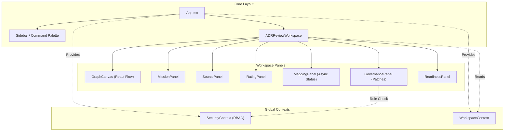

# 🗺️ PROJECT MAP — epios
> Автоматически сгенерировано: `2026-05-15 22:42:05`
> Скрипт: `node dev_studio/refresh.js`

## 📊 Telemetry / Context Health
| Metric | Value | Note |
|---|---|---|
| **Total Files** | `179` | Только JS/TS/TSX исходники |
| **Total Lines** | `20768` | Суммарно по проекту |
| **Project Weight** | `~163 159 tokens` | Оценка (4 символа/токен) |
| **Context Pressure** | `127.5%` | Нагрузка на окно 128k (Full Scan) |
| **Map Efficiency** | `~87%` | Экономия контекста через карту |

---

## Высокоуровневая архитектура
> Связи между основными пакетами и приложениями

```mermaid
flowchart LR

subgraph 0["apps"]
subgraph 1["demo-shell"]
subgraph 2["dist"]
subgraph 3["assets"]
4["index-C4yosIsx.js"]
end
end
subgraph 7["src"]
8["App.tsx"]
subgraph F["components"]
G["ADRReviewWorkspace.tsx"]
1I["ApprovalPanel.tsx"]
1J["ArtifactPatchPanel.tsx"]
1K["FinalADRPanel.tsx"]
1L["GovernancePanel.tsx"]
1M["ReadinessPanel.tsx"]
1N["SecureMcpIframe.tsx"]
2D["ArchiveView.tsx"]
2R["CommandPalette.tsx"]
2S["Sidebar.tsx"]
2T["Modal.tsx"]
2U["RoleSwitcher.tsx"]
2V["SidebarItem.tsx"]
2W["WorkspaceRoom.tsx"]
2X["GraphCanvas.tsx"]
2Z["CustomNode.tsx"]
30["MissionPanel.tsx"]
31["MappingPanel.tsx"]
32["SourcePanel.tsx"]
33["RatingPanel.tsx"]
end
T["api-config.ts"]
subgraph U["context"]
V["SecurityContext.tsx"]
2K["WorkspaceContext.tsx"]
end
subgraph 1G["hooks"]
1H["useApi.ts"]
end
34["i18n.ts"]
3H["main.tsx"]
3I["index.css"]
subgraph 3N["mcp"]
3O["schemas.ts"]
end
end
end
end
subgraph 5["@emotion"]
6["is-prop-valid"]
end
subgraph 9["node_modules"]
subgraph A[".pnpm"]
subgraph B["react@18.3.1"]
subgraph C["node_modules"]
subgraph D["react"]
E["index.js"]
end
end
end
subgraph H["framer-motion@12.38.0_react-dom@18.3.1_react@18.3.1__react@18.3.1"]
subgraph I["node_modules"]
subgraph J["framer-motion"]
subgraph K["dist"]
subgraph L["cjs"]
M["index.js"]
end
end
end
end
end
subgraph N["lucide-react@1.14.0_react@18.3.1"]
subgraph O["node_modules"]
subgraph P["lucide-react"]
subgraph Q["dist"]
subgraph R["cjs"]
S["lucide-react.js"]
end
end
end
end
end
subgraph 29["zod@4.4.3"]
subgraph 2A["node_modules"]
subgraph 2B["zod"]
2C["index.js"]
end
end
end
subgraph 2E["react-i18next@17.0.7_i18next@26.1.0_typescript@5.9.3__react-dom@18.3.1_react@18.3.1__react@18.3.1_typescript@5.9.3"]
subgraph 2F["node_modules"]
subgraph 2G["react-i18next"]
subgraph 2H["dist"]
subgraph 2I["es"]
2J["index.js"]
end
end
end
end
end
subgraph 2L["reactflow@11.11.4_@types+react@18.3.28_react-dom@18.3.1_react@18.3.1__react@18.3.1"]
subgraph 2M["node_modules"]
subgraph 2N["reactflow"]
subgraph 2O["dist"]
subgraph 2P["esm"]
2Q["index.mjs"]
end
2Y["style.css"]
end
end
end
end
subgraph 35["i18next@26.1.0_typescript@5.9.3"]
subgraph 36["node_modules"]
subgraph 37["i18next"]
subgraph 38["dist"]
subgraph 39["esm"]
3A["i18next.js"]
end
end
end
end
end
subgraph 3B["i18next-browser-languagedetector@8.2.1"]
subgraph 3C["node_modules"]
subgraph 3D["i18next-browser-languagedetector"]
subgraph 3E["dist"]
subgraph 3F["esm"]
3G["i18nextBrowserLanguageDetector.js"]
end
end
end
end
end
subgraph 3J["react-dom@18.3.1_react@18.3.1"]
subgraph 3K["node_modules"]
subgraph 3L["react-dom"]
3M["client.js"]
end
end
end
subgraph 3X["@fastify+cors@8.5.0"]
subgraph 3Y["node_modules"]
subgraph 3Z["@fastify"]
subgraph 40["cors"]
41["index.js"]
end
end
end
end
subgraph 42["dotenv@16.6.1"]
subgraph 43["node_modules"]
subgraph 44["dotenv"]
subgraph 45["lib"]
46["main.js"]
end
end
end
end
subgraph 47["dotenv-expand@11.0.7"]
subgraph 48["node_modules"]
subgraph 49["dotenv-expand"]
subgraph 4A["lib"]
4B["main.js"]
end
end
end
end
subgraph 4C["drizzle-orm@0.45.2_postgres@3.4.9"]
subgraph 4D["node_modules"]
subgraph 4E["drizzle-orm"]
subgraph 4F["postgres-js"]
4G["index.js"]
FF["migrator.js"]
end
6I["index.js"]
subgraph 6K["pg-core"]
6L["index.js"]
end
end
end
end
subgraph 4H["fastify@4.29.1"]
subgraph 4I["node_modules"]
subgraph 4J["fastify"]
4K["fastify.js"]
end
end
end
subgraph 4L["postgres@3.4.9"]
subgraph 4M["node_modules"]
subgraph 4N["postgres"]
subgraph 4O["src"]
4P["index.js"]
end
end
end
end
subgraph 7C["vitest@1.6.1_@types+node@25.7.0"]
subgraph 7D["node_modules"]
subgraph 7E["vitest"]
subgraph 7F["dist"]
7G["index.js"]
7K["config.cjs"]
end
end
end
end
subgraph F1["drizzle-kit@0.31.10"]
subgraph F2["node_modules"]
subgraph F3["drizzle-kit"]
F4["index.mjs"]
end
end
end
subgraph F9["@testcontainers+postgresql@10.28.0"]
subgraph FA["node_modules"]
subgraph FB["@testcontainers"]
subgraph FC["postgresql"]
subgraph FD["build"]
FE["index.js"]
end
end
end
end
end
end
end
subgraph W["packages"]
subgraph X["domain"]
subgraph Y["src"]
Z["index.ts"]
10["adr.ts"]
11["approval.ts"]
12["errors.ts"]
13["events.ts"]
14["mission.ts"]
15["artifact.ts"]
16["decision.ts"]
17["evidence.ts"]
18["governance.ts"]
19["node.ts"]
1A["mapping.ts"]
1B["policy.ts"]
1C["rating.ts"]
1D["security.ts"]
1E["source.ts"]
1F["workspace.ts"]
end
subgraph B4["coverage"]
B5["block-navigation.js"]
B6["prettify.js"]
B7["sorter.js"]
end
subgraph B8["dist"]
B9["adr.d.ts"]
BA["adr.js"]
BB["approval.d.ts"]
BC["events.js"]
BD["mission.js"]
BE["errors.js"]
BF["approval.js"]
BG["artifact.d.ts"]
BH["artifact.js"]
BI["decision.d.ts"]
BJ["decision.js"]
BK["errors.d.ts"]
BL["events.d.ts"]
BM["evidence.d.ts"]
BN["evidence.js"]
BO["governance.d.ts"]
BP["node.js"]
BQ["governance.js"]
BR["index.d.ts"]
BS["mapping.js"]
BT["policy.js"]
BU["rating.js"]
BV["security.js"]
BW["source.js"]
BX["workspace.js"]
BY["index.js"]
BZ["mapping.d.ts"]
C0["mission.d.ts"]
C1["node.d.ts"]
C2["policy.d.ts"]
C3["rating.d.ts"]
C4["security.d.ts"]
C5["source.d.ts"]
C6["workspace.d.ts"]
end
subgraph C7["test"]
C8["domain-smoke.test.ts"]
C9["evidence.test.ts"]
CA["mission.test.ts"]
CB["node-invariants.test.ts"]
CC["patch-policy.test.ts"]
CD["source-rating.test.ts"]
CE["workspace.test.ts"]
end
CF["vitest.config.ts"]
end
subgraph 1O["infrastructure-mcp"]
subgraph 1P["src"]
1Q["index.ts"]
1R["mcp-app.registry.ts"]
27["mcp-bridge.ts"]
28["schemas.ts"]
end
subgraph CG["dist"]
subgraph CH["domain"]
subgraph CI["src"]
CJ["adr.d.ts"]
CK["adr.js"]
CL["approval.d.ts"]
CM["events.js"]
CN["mission.js"]
CO["errors.js"]
CP["approval.js"]
CQ["artifact.d.ts"]
CR["artifact.js"]
CS["decision.d.ts"]
CT["decision.js"]
CU["errors.d.ts"]
CV["events.d.ts"]
CW["evidence.d.ts"]
CX["evidence.js"]
CY["governance.d.ts"]
CZ["node.js"]
D0["governance.js"]
D1["index.d.ts"]
D2["mapping.js"]
D3["policy.js"]
D4["rating.js"]
D5["security.js"]
D6["source.js"]
D7["workspace.js"]
D8["index.js"]
D9["mapping.d.ts"]
DA["mission.d.ts"]
DB["node.d.ts"]
DC["policy.d.ts"]
DD["rating.d.ts"]
DE["security.d.ts"]
DF["source.d.ts"]
DG["workspace.d.ts"]
end
end
DH["index.d.ts"]
DI["mcp-app.registry.js"]
DJ["mcp-bridge.js"]
DK["index.js"]
subgraph DL["infrastructure-mcp"]
subgraph DM["src"]
DN["index.d.ts"]
DO["mcp-app.registry.js"]
DP["mcp-bridge.js"]
DQ["schemas.js"]
DR["index.js"]
DS["mcp-app.registry.d.ts"]
DT["mcp-bridge.d.ts"]
DU["schemas.d.ts"]
end
end
DV["mcp-app.registry.d.ts"]
DY["mcp-bridge.d.ts"]
subgraph DZ["ports"]
subgraph E0["src"]
E1["adr.repository.port.d.ts"]
E2["adr.repository.port.js"]
E3["artifact.repository.port.d.ts"]
E4["artifact.repository.port.js"]
E5["decision.repository.port.d.ts"]
E6["decision.repository.port.js"]
E7["domain.repository.port.d.ts"]
E8["domain.repository.port.js"]
E9["evidence.repository.port.d.ts"]
EA["evidence.repository.port.js"]
EB["governance.port.d.ts"]
EC["governance.port.js"]
ED["graph.repository.port.d.ts"]
EE["graph.repository.port.js"]
EF["index.d.ts"]
EG["mcp.port.js"]
EH["mission.repository.port.js"]
EI["outbox.repository.port.js"]
EJ["security.port.js"]
EK["unit-of-work.port.js"]
EL["index.js"]
EM["mapping.repository.port.d.ts"]
EN["mapping.repository.port.js"]
EO["mcp.port.d.ts"]
EP["mission.repository.port.d.ts"]
EQ["outbox.repository.port.d.ts"]
ER["security.port.d.ts"]
ES["unit-of-work.port.d.ts"]
end
end
end
subgraph ET["test"]
EU["mcp-bridge.test.ts"]
EV["security.test.ts"]
EW["smoke.test.ts"]
end
end
subgraph 1S["ports"]
subgraph 1T["src"]
1U["index.ts"]
1V["adr.repository.port.ts"]
1W["artifact.repository.port.ts"]
1X["decision.repository.port.ts"]
1Y["domain.repository.port.ts"]
1Z["evidence.repository.port.ts"]
20["governance.port.ts"]
21["graph.repository.port.ts"]
22["mcp.port.ts"]
23["mission.repository.port.ts"]
24["outbox.repository.port.ts"]
25["security.port.ts"]
26["unit-of-work.port.ts"]
K3["mapping.repository.port.ts"]
end
subgraph I8["dist"]
subgraph I9["domain"]
subgraph IA["src"]
IB["adr.d.ts"]
IC["adr.js"]
ID["approval.d.ts"]
IE["events.js"]
IF["mission.js"]
IG["errors.js"]
IH["approval.js"]
II["artifact.d.ts"]
IJ["artifact.js"]
IK["decision.d.ts"]
IL["decision.js"]
IM["errors.d.ts"]
IN["events.d.ts"]
IO["evidence.d.ts"]
IP["evidence.js"]
IQ["governance.d.ts"]
IR["node.js"]
IS["governance.js"]
IT["index.d.ts"]
IU["mapping.js"]
IV["policy.js"]
IW["rating.js"]
IX["security.js"]
IY["source.js"]
IZ["workspace.js"]
J0["index.js"]
J1["mapping.d.ts"]
J2["mission.d.ts"]
J3["node.d.ts"]
J4["policy.d.ts"]
J5["rating.d.ts"]
J6["security.d.ts"]
J7["source.d.ts"]
J8["workspace.d.ts"]
end
end
subgraph J9["ports"]
subgraph JA["src"]
JB["adr.repository.port.d.ts"]
JC["adr.repository.port.js"]
JD["artifact.repository.port.d.ts"]
JE["artifact.repository.port.js"]
JF["decision.repository.port.d.ts"]
JG["decision.repository.port.js"]
JH["domain.repository.port.d.ts"]
JI["domain.repository.port.js"]
JJ["evidence.repository.port.d.ts"]
JK["evidence.repository.port.js"]
JL["governance.port.d.ts"]
JM["governance.port.js"]
JN["graph.repository.port.d.ts"]
JO["graph.repository.port.js"]
JP["index.d.ts"]
JQ["mcp.port.js"]
JR["mission.repository.port.js"]
JS["outbox.repository.port.js"]
JT["security.port.js"]
JU["unit-of-work.port.js"]
JV["index.js"]
JW["mapping.repository.port.d.ts"]
JX["mapping.repository.port.js"]
JY["mcp.port.d.ts"]
JZ["mission.repository.port.d.ts"]
K0["outbox.repository.port.d.ts"]
K1["security.port.d.ts"]
K2["unit-of-work.port.d.ts"]
end
end
end
end
subgraph 3P["api"]
subgraph 3Q["coverage"]
3R["block-navigation.js"]
3S["prettify.js"]
3T["sorter.js"]
end
subgraph 3U["src"]
3V["bin.ts"]
3W["server.ts"]
4Q["mock-data.ts"]
subgraph 4R["routes"]
4S["adr.routes.ts"]
65["governance.routes.ts"]
66["mapping.routes.ts"]
69["mcp.routes.ts"]
6A["rating.routes.ts"]
6B["security.routes.ts"]
6C["source.routes.ts"]
6D["workspace.routes.ts"]
end
subgraph 67["dto"]
68["index.ts"]
end
subgraph 76["contracts"]
77["openapi.ts"]
78["schemas.ts"]
end
79["index.ts"]
end
subgraph 7A["test"]
7B["adr.test.ts"]
7H["api.test.ts"]
end
7I["vitest.config.ts"]
end
subgraph 4T["application"]
subgraph 4U["src"]
4V["index.ts"]
4W["mapping-processor.ts"]
subgraph 4Y["use-cases"]
4Z["add-edge.ts"]
55["add-node.ts"]
56["adr-use-cases.ts"]
57["apply-artifact-patch.ts"]
58["apply-patch.ts"]
59["apply-retention.ts"]
5A["assess-readiness.ts"]
5B["cast-vote.ts"]
5C["create-mission.ts"]
5D["create-workspace.ts"]
5E["delete-mission.ts"]
5F["delete-source.ts"]
5G["generate-final-adr.ts"]
5H["get-mapping-run.ts"]
5I["get-node-ratings.ts"]
5J["get-readiness.ts"]
5K["get-trace-summary.ts"]
5L["get-trace.ts"]
5M["get-workspace-graph.ts"]
5N["ingest-source.ts"]
5O["list-approvals.ts"]
5P["list-artifact-patches.ts"]
5Q["list-mapping-runs.ts"]
5R["list-patches.ts"]
5S["list-sources.ts"]
5T["list-workspaces.ts"]
5U["patch-node.ts"]
5V["patch-workspace.ts"]
5W["propose-artifact-patch.ts"]
5X["propose-patch.ts"]
5Y["rate-node.ts"]
5Z["rate-source.ts"]
60["redact-node.ts"]
61["resolve-approval.ts"]
62["run-mapping.ts"]
63["submit-claim.ts"]
64["update-mission-brief.ts"]
end
subgraph AV["__tests__"]
AW["readiness.test.ts"]
end
end
subgraph 7L["dist"]
subgraph 7M["application"]
subgraph 7N["src"]
7O["mapping-processor.d.ts"]
7P["mapping-processor.js"]
subgraph 7Q["use-cases"]
7R["add-edge.d.ts"]
7S["add-edge.js"]
7T["add-node.d.ts"]
7U["add-node.js"]
7V["adr-use-cases.d.ts"]
7W["adr-use-cases.js"]
7X["cast-vote.d.ts"]
7Y["cast-vote.js"]
7Z["create-mission.d.ts"]
80["create-mission.js"]
81["create-workspace.d.ts"]
82["create-workspace.js"]
83["get-mapping-run.d.ts"]
84["get-mapping-run.js"]
85["get-node-ratings.d.ts"]
86["get-node-ratings.js"]
87["get-workspace-graph.d.ts"]
88["get-workspace-graph.js"]
89["ingest-source.d.ts"]
8A["ingest-source.js"]
8B["list-mapping-runs.d.ts"]
8C["list-mapping-runs.js"]
8D["list-sources.d.ts"]
8E["list-sources.js"]
8F["list-workspaces.d.ts"]
8G["list-workspaces.js"]
8H["patch-node.d.ts"]
8I["patch-node.js"]
8J["propose-patch.d.ts"]
8K["propose-patch.js"]
8L["rate-node.d.ts"]
8M["rate-node.js"]
8N["rate-source.d.ts"]
8O["rate-source.js"]
8P["run-mapping.d.ts"]
8Q["run-mapping.js"]
8R["submit-claim.d.ts"]
8S["submit-claim.js"]
8T["update-mission-brief.d.ts"]
8U["update-mission-brief.js"]
end
end
end
subgraph 8V["domain"]
subgraph 8W["src"]
8X["adr.d.ts"]
8Y["adr.js"]
8Z["approval.d.ts"]
90["events.js"]
91["mission.js"]
92["errors.js"]
93["approval.js"]
94["artifact.d.ts"]
95["artifact.js"]
96["decision.d.ts"]
97["decision.js"]
98["errors.d.ts"]
99["events.d.ts"]
9A["evidence.d.ts"]
9B["evidence.js"]
9C["governance.d.ts"]
9D["node.js"]
9E["governance.js"]
9F["index.d.ts"]
9G["mapping.js"]
9H["policy.js"]
9I["rating.js"]
9J["security.js"]
9K["source.js"]
9L["workspace.js"]
9M["index.js"]
9N["mapping.d.ts"]
9O["mission.d.ts"]
9P["node.d.ts"]
9Q["policy.d.ts"]
9R["rating.d.ts"]
9S["security.d.ts"]
9T["source.d.ts"]
9U["workspace.d.ts"]
end
end
subgraph 9V["observability"]
subgraph 9W["src"]
9X["audit.d.ts"]
9Y["audit.js"]
9Z["index.d.ts"]
A0["tracer.js"]
A1["index.js"]
A2["tracer.d.ts"]
end
end
subgraph A3["ports"]
subgraph A4["src"]
A5["adr.repository.port.d.ts"]
A6["adr.repository.port.js"]
A7["artifact.repository.port.d.ts"]
A8["artifact.repository.port.js"]
A9["decision.repository.port.d.ts"]
AA["decision.repository.port.js"]
AB["domain.repository.port.d.ts"]
AC["domain.repository.port.js"]
AD["evidence.repository.port.d.ts"]
AE["evidence.repository.port.js"]
AF["governance.port.d.ts"]
AG["governance.port.js"]
AH["graph.repository.port.d.ts"]
AI["graph.repository.port.js"]
AJ["index.d.ts"]
AK["mcp.port.js"]
AL["mission.repository.port.js"]
AM["outbox.repository.port.js"]
AN["security.port.js"]
AO["unit-of-work.port.js"]
AP["index.js"]
AQ["mcp.port.d.ts"]
AR["mission.repository.port.d.ts"]
AS["outbox.repository.port.d.ts"]
AT["security.port.d.ts"]
AU["unit-of-work.port.d.ts"]
end
end
end
subgraph AX["test"]
AY["artifact-patch-flow.test.ts"]
AZ["async-runtime.test.ts"]
B0["create-workspace.test.ts"]
B1["mission.use-cases.test.ts"]
B2["use-cases.test.ts"]
end
B3["vitest.config.ts"]
end
subgraph 50["observability"]
subgraph 51["src"]
52["index.ts"]
53["audit.ts"]
54["tracer.ts"]
end
subgraph HZ["dist"]
I0["audit.d.ts"]
I1["audit.js"]
I2["index.d.ts"]
I3["tracer.js"]
I4["index.js"]
I5["tracer.d.ts"]
end
subgraph I6["test"]
I7["redaction.test.ts"]
end
end
subgraph 6E["infrastructure-postgres"]
subgraph 6F["src"]
6G["index.ts"]
6H["artifact.repository.ts"]
6J["schema.ts"]
6M["decision.repository.ts"]
6N["evidence.repository.ts"]
6O["governance.repository.ts"]
6P["graph.repository.ts"]
6Q["identity.repository.ts"]
6R["mapping.repository.ts"]
6S["mission.repository.ts"]
6T["outbox.repository.ts"]
6U["rating.repository.ts"]
6V["source.repository.ts"]
6W["unit-of-work.ts"]
6X["workspace.repository.ts"]
F5["manual_migrate.ts"]
F6["seed.ts"]
end
F0["drizzle.config.ts"]
subgraph F7["test"]
F8["container-setup.ts"]
FH["graph-concurrency.test.ts"]
FI["repository-integration.test.ts"]
FJ["transactional-integrity.test.ts"]
end
end
subgraph 6Y["infrastructure-runtime"]
subgraph 6Z["src"]
70["index.ts"]
71["in-memory-governance.repository.ts"]
72["in-memory-repositories.ts"]
73["in-memory-unit-of-work.ts"]
74["outbox-worker.ts"]
75["security-mocks.ts"]
end
subgraph FK["dist"]
subgraph FL["domain"]
subgraph FM["src"]
FN["adr.d.ts"]
FO["adr.js"]
FP["approval.d.ts"]
FQ["events.js"]
FR["mission.js"]
FS["errors.js"]
FT["approval.js"]
FU["artifact.d.ts"]
FV["artifact.js"]
FW["decision.d.ts"]
FX["decision.js"]
FY["errors.d.ts"]
FZ["events.d.ts"]
G0["evidence.d.ts"]
G1["evidence.js"]
G2["governance.d.ts"]
G3["node.js"]
G4["governance.js"]
G5["index.d.ts"]
G6["mapping.js"]
G7["policy.js"]
G8["rating.js"]
G9["security.js"]
GA["source.js"]
GB["workspace.js"]
GC["index.js"]
GD["mapping.d.ts"]
GE["mission.d.ts"]
GF["node.d.ts"]
GG["policy.d.ts"]
GH["rating.d.ts"]
GI["security.d.ts"]
GJ["source.d.ts"]
GK["workspace.d.ts"]
end
end
subgraph GL["infrastructure-runtime"]
subgraph GM["src"]
GN["in-memory-governance.repository.d.ts"]
GO["in-memory-governance.repository.js"]
GP["in-memory-repositories.d.ts"]
GQ["in-memory-repositories.js"]
GR["in-memory-unit-of-work.d.ts"]
GS["in-memory-unit-of-work.js"]
GT["index.d.ts"]
GU["outbox-worker.js"]
GV["security-mocks.js"]
GW["index.js"]
GX["outbox-worker.d.ts"]
GY["security-mocks.d.ts"]
end
end
subgraph GZ["observability"]
subgraph H0["src"]
H1["audit.d.ts"]
H2["audit.js"]
H3["index.d.ts"]
H4["tracer.js"]
H5["index.js"]
H6["tracer.d.ts"]
end
end
subgraph H7["ports"]
subgraph H8["src"]
H9["adr.repository.port.d.ts"]
HA["adr.repository.port.js"]
HB["artifact.repository.port.d.ts"]
HC["artifact.repository.port.js"]
HD["decision.repository.port.d.ts"]
HE["decision.repository.port.js"]
HF["domain.repository.port.d.ts"]
HG["domain.repository.port.js"]
HH["evidence.repository.port.d.ts"]
HI["evidence.repository.port.js"]
HJ["governance.port.d.ts"]
HK["governance.port.js"]
HL["graph.repository.port.d.ts"]
HM["graph.repository.port.js"]
HN["index.d.ts"]
HO["mcp.port.js"]
HP["mission.repository.port.js"]
HQ["outbox.repository.port.js"]
HR["security.port.js"]
HS["unit-of-work.port.js"]
HT["index.js"]
HU["mcp.port.d.ts"]
HV["mission.repository.port.d.ts"]
HW["outbox.repository.port.d.ts"]
HX["security.port.d.ts"]
HY["unit-of-work.port.d.ts"]
end
end
end
end
subgraph EX["infrastructure-models"]
subgraph EY["src"]
EZ["index.ts"]
end
end
subgraph K4["testing"]
subgraph K5["src"]
K6["fixtures.ts"]
K7["index.ts"]
end
end
end
4X["crypto"]
7J["path"]
subgraph DW["@epos"]
DX["ports"]
end
FG["url"]
4-->6
8-->G
8-->2D
8-->2R
8-->2S
8-->2W
8-->2K
8-->E
G-->T
G-->V
G-->1H
G-->1I
G-->1J
G-->1K
G-->1L
G-->1M
G-->1N
G-->M
G-->S
G-->E
V-->T
V-->Z
V-->E
Z-->10
Z-->11
Z-->15
Z-->16
Z-->12
Z-->13
Z-->17
Z-->18
Z-->1A
Z-->14
Z-->19
Z-->1B
Z-->1C
Z-->1D
Z-->1E
Z-->1F
11-->12
11-->13
11-->14
14-->12
14-->13
15-->12
15-->13
15-->14
16-->14
17-->12
18-->12
18-->13
18-->19
19-->12
19-->13
1B-->15
1E-->12
1F-->12
1H-->T
1H-->E
1I-->T
1I-->V
1I-->M
1I-->S
1I-->E
1J-->T
1J-->V
1J-->M
1J-->S
1J-->E
1K-->T
1K-->M
1K-->S
1K-->E
1L-->T
1L-->V
1L-->M
1L-->S
1L-->E
1M-->T
1M-->M
1M-->S
1M-->E
1N-->1Q
1N-->E
1Q-->1R
1Q-->27
1Q-->28
1R-->1U
1U-->1V
1U-->1W
1U-->1X
1U-->1Y
1U-->1Z
1U-->20
1U-->21
1U-->22
1U-->23
1U-->24
1U-->25
1U-->26
1V-->Z
1W-->Z
1X-->Z
1Y-->Z
1Z-->Z
20-->Z
21-->Z
23-->Z
25-->Z
26-->1W
26-->1X
26-->1Y
26-->1Z
26-->20
26-->21
26-->23
26-->24
27-->28
27-->Z
27-->1U
28-->2C
2D-->2K
2D-->M
2D-->S
2D-->E
2D-->2J
2K-->Z
2K-->E
2K-->2Q
2R-->2K
2R-->M
2R-->S
2R-->E
2S-->T
2S-->V
2S-->2K
2S-->1H
2S-->2T
2S-->2U
2S-->2V
2S-->Z
2S-->M
2S-->S
2S-->E
2S-->2J
2T-->M
2T-->S
2T-->E
2U-->V
2U-->S
2U-->E
2V-->M
2V-->S
2V-->E
2V-->2J
2W-->T
2W-->V
2W-->2K
2W-->2X
2W-->30
2W-->33
2W-->Z
2W-->M
2W-->S
2W-->E
2X-->2K
2X-->1H
2X-->2Z
2X-->S
2X-->E
2X-->2Q
2X-->2Y
2Z-->S
2Z-->E
2Z-->2Q
30-->1L
30-->31
30-->32
30-->Z
30-->M
30-->S
30-->E
31-->T
31-->Z
31-->M
31-->S
31-->E
32-->T
32-->M
32-->S
32-->E
33-->T
33-->S
33-->E
34-->3A
34-->3G
34-->2J
3H-->8
3H-->V
3H-->2K
3H-->34
3H-->3I
3H-->E
3H-->3M
3H-->2Y
3O-->2C
3V-->3W
3W-->4Q
3W-->4S
3W-->65
3W-->66
3W-->69
3W-->6A
3W-->6B
3W-->6C
3W-->6D
3W-->4V
3W-->1Q
3W-->6G
3W-->70
3W-->1U
3W-->41
3W-->46
3W-->4B
3W-->4G
3W-->4K
3W-->4P
4Q-->Z
4S-->4V
4S-->4K
4V-->4W
4V-->4Z
4V-->55
4V-->56
4V-->57
4V-->58
4V-->59
4V-->5A
4V-->5B
4V-->5C
4V-->5D
4V-->5E
4V-->5F
4V-->5G
4V-->5H
4V-->5I
4V-->5J
4V-->5K
4V-->5L
4V-->5M
4V-->5N
4V-->5O
4V-->5P
4V-->5Q
4V-->5R
4V-->5S
4V-->5T
4V-->5U
4V-->5V
4V-->5W
4V-->5X
4V-->5Y
4V-->5Z
4V-->60
4V-->61
4V-->62
4V-->63
4V-->64
4W-->Z
4W-->1U
4W-->4X
4Z-->Z
4Z-->52
4Z-->1U
4Z-->4X
52-->53
52-->54
55-->Z
55-->52
55-->1U
55-->4X
56-->Z
56-->1U
57-->Z
57-->1U
57-->4X
58-->Z
58-->1U
58-->4X
59-->Z
59-->1U
5A-->Z
5A-->1U
5A-->4X
5B-->Z
5B-->52
5B-->1U
5B-->4X
5C-->Z
5C-->1U
5C-->4X
5D-->Z
5D-->52
5D-->1U
5D-->4X
5E-->1U
5E-->4X
5F-->1U
5F-->4X
5G-->Z
5G-->1U
5H-->Z
5H-->1U
5I-->Z
5I-->1U
5J-->Z
5J-->1U
5K-->1U
5L-->Z
5L-->1U
5M-->Z
5M-->1U
5N-->Z
5N-->1U
5N-->4X
5O-->Z
5O-->1U
5P-->Z
5P-->1U
5Q-->Z
5Q-->1U
5R-->Z
5R-->1U
5S-->Z
5S-->1U
5T-->Z
5T-->1U
5U-->Z
5U-->1U
5V-->Z
5V-->1U
5W-->Z
5W-->1U
5W-->4X
5X-->Z
5X-->1U
5X-->4X
5Y-->Z
5Y-->1U
5Y-->4X
5Z-->Z
5Z-->1U
5Z-->4X
60-->Z
60-->1U
61-->Z
61-->1U
61-->4X
62-->Z
62-->1U
62-->4X
63-->Z
63-->1U
63-->4X
64-->Z
64-->1U
64-->4X
65-->4V
65-->Z
65-->1U
65-->4K
66-->68
66-->4V
66-->4K
68-->Z
69-->1Q
69-->1U
69-->4K
6A-->4V
6A-->Z
6A-->4K
6B-->4V
6B-->Z
6B-->1U
6B-->4K
6C-->4V
6C-->Z
6C-->4K
6D-->68
6D-->4V
6D-->4K
6G-->6H
6G-->6M
6G-->6N
6G-->6O
6G-->6P
6G-->6Q
6G-->6R
6G-->6S
6G-->6T
6G-->6U
6G-->6J
6G-->6V
6G-->6W
6G-->6X
6H-->6J
6H-->Z
6H-->1U
6H-->6I
6H-->4G
6J-->6L
6M-->6J
6M-->Z
6M-->1U
6M-->6I
6M-->4G
6N-->6J
6N-->Z
6N-->1U
6N-->6I
6N-->4G
6O-->6J
6O-->Z
6O-->52
6O-->1U
6O-->6I
6O-->4G
6P-->6J
6P-->Z
6P-->1U
6P-->6I
6P-->4G
6Q-->6J
6Q-->Z
6Q-->1U
6Q-->6I
6Q-->4G
6R-->6J
6R-->Z
6R-->1U
6R-->6I
6R-->4G
6S-->6J
6S-->Z
6S-->1U
6S-->6I
6S-->4G
6T-->6J
6T-->1U
6T-->6I
6T-->4G
6U-->6J
6U-->Z
6U-->1U
6U-->6I
6U-->4G
6V-->6J
6V-->Z
6V-->1U
6V-->4X
6V-->6I
6V-->4G
6W-->6H
6W-->6M
6W-->6N
6W-->6O
6W-->6P
6W-->6R
6W-->6S
6W-->6T
6W-->6U
6W-->6V
6W-->6X
6W-->1U
6W-->4G
6X-->6J
6X-->Z
6X-->1U
6X-->6I
6X-->4G
70-->71
70-->72
70-->73
70-->74
70-->75
71-->Z
71-->1U
72-->Z
72-->1U
73-->1U
74-->52
74-->1U
75-->Z
75-->1U
75-->4X
78-->2C
79-->3W
7B-->3W
7B-->4K
7B-->7G
7H-->3W
7H-->Z
7H-->1U
7H-->4K
7H-->7G
7I-->7J
7I-->7K
7O-->1U
7P-->Z
7P-->4X
7R-->Z
7R-->1U
7S-->52
7S-->4X
7T-->Z
7T-->1U
7U-->Z
7U-->52
7U-->4X
7V-->Z
7V-->1U
7X-->1U
7Y-->52
7Y-->4X
7Z-->Z
7Z-->1U
80-->Z
80-->4X
81-->Z
81-->1U
82-->Z
82-->52
82-->4X
83-->Z
83-->1U
85-->Z
85-->1U
87-->Z
87-->1U
89-->Z
89-->1U
8A-->Z
8A-->4X
8B-->Z
8B-->1U
8D-->Z
8D-->1U
8F-->Z
8F-->1U
8H-->Z
8H-->1U
8J-->Z
8J-->1U
8K-->Z
8K-->4X
8L-->Z
8L-->1U
8M-->4X
8N-->Z
8N-->1U
8O-->4X
8P-->Z
8P-->1U
8Q-->Z
8Q-->4X
8R-->Z
8R-->1U
8S-->Z
8S-->4X
8T-->Z
8T-->1U
8U-->4X
8Z-->90
8Z-->91
91-->92
93-->92
94-->90
94-->91
95-->92
96-->91
9B-->92
9C-->90
9C-->9D
9D-->92
9E-->92
9F-->8Y
9F-->93
9F-->95
9F-->97
9F-->92
9F-->90
9F-->9B
9F-->9E
9F-->9G
9F-->91
9F-->9D
9F-->9H
9F-->9I
9F-->9J
9F-->9K
9F-->9L
9K-->92
9L-->92
9M-->8Y
9M-->93
9M-->95
9M-->97
9M-->92
9M-->90
9M-->9B
9M-->9E
9M-->9G
9M-->91
9M-->9D
9M-->9H
9M-->9I
9M-->9J
9M-->9K
9M-->9L
9O-->90
9P-->90
9Q-->95
9Z-->9Y
9Z-->A0
A1-->9Y
A1-->A0
A5-->Z
A7-->Z
A9-->Z
AB-->Z
AD-->Z
AF-->Z
AH-->Z
AJ-->A6
AJ-->A8
AJ-->AA
AJ-->AC
AJ-->AE
AJ-->AG
AJ-->AI
AJ-->AK
AJ-->AL
AJ-->AM
AJ-->AN
AJ-->AO
AP-->A6
AP-->A8
AP-->AA
AP-->AC
AP-->AE
AP-->AG
AP-->AI
AP-->AK
AP-->AL
AP-->AM
AP-->AN
AP-->AO
AR-->Z
AT-->Z
AU-->A8
AU-->AA
AU-->AC
AU-->AE
AU-->AG
AU-->AI
AU-->AL
AU-->AM
AW-->5A
AW-->1U
AW-->7G
AY-->4V
AY-->Z
AY-->70
AY-->7G
AZ-->62
AZ-->1U
AZ-->4X
AZ-->7G
B0-->5D
B0-->1U
B0-->7G
B1-->5C
B1-->5N
B1-->62
B1-->64
B1-->Z
B1-->1U
B1-->7G
B2-->4Z
B2-->55
B2-->5B
B2-->5D
B2-->5M
B2-->5T
B2-->5U
B2-->63
B2-->Z
B2-->1U
B2-->7G
B3-->7J
B3-->7K
BB-->BC
BB-->BD
BD-->BE
BF-->BE
BG-->BC
BG-->BD
BH-->BE
BI-->BD
BN-->BE
BO-->BC
BO-->BP
BP-->BE
BQ-->BE
BR-->BA
BR-->BF
BR-->BH
BR-->BJ
BR-->BE
BR-->BC
BR-->BN
BR-->BQ
BR-->BS
BR-->BD
BR-->BP
BR-->BT
BR-->BU
BR-->BV
BR-->BW
BR-->BX
BW-->BE
BX-->BE
BY-->BA
BY-->BF
BY-->BH
BY-->BJ
BY-->BE
BY-->BC
BY-->BN
BY-->BQ
BY-->BS
BY-->BD
BY-->BP
BY-->BT
BY-->BU
BY-->BV
BY-->BW
BY-->BX
C0-->BC
C1-->BC
C2-->BH
C8-->Z
C8-->7G
C9-->17
C9-->7G
CA-->14
CA-->7G
CB-->Z
CB-->7G
CC-->Z
CC-->7G
CD-->Z
CD-->7G
CE-->12
CE-->1F
CE-->7G
CF-->7K
CL-->CM
CL-->CN
CN-->CO
CP-->CO
CQ-->CM
CQ-->CN
CR-->CO
CS-->CN
CX-->CO
CY-->CM
CY-->CZ
CZ-->CO
D0-->CO
D1-->CK
D1-->CP
D1-->CR
D1-->CT
D1-->CO
D1-->CM
D1-->CX
D1-->D0
D1-->D2
D1-->CN
D1-->CZ
D1-->D3
D1-->D4
D1-->D5
D1-->D6
D1-->D7
D6-->CO
D7-->CO
D8-->CK
D8-->CP
D8-->CR
D8-->CT
D8-->CO
D8-->CM
D8-->CX
D8-->D0
D8-->D2
D8-->CN
D8-->CZ
D8-->D3
D8-->D4
D8-->D5
D8-->D6
D8-->D7
DA-->CM
DB-->CM
DC-->CR
DH-->DI
DH-->DJ
DK-->DI
DK-->DJ
DN-->DO
DN-->DP
DN-->DQ
DP-->DQ
DP-->Z
DQ-->2C
DR-->DO
DR-->DP
DR-->DQ
DS-->1U
DT-->1U
DU-->2C
DV-->DX
DY-->DX
E1-->Z
E3-->Z
E5-->Z
E7-->Z
E9-->Z
EB-->Z
ED-->Z
EF-->E2
EF-->E4
EF-->E6
EF-->E8
EF-->EA
EF-->EC
EF-->EE
EF-->EG
EF-->EH
EF-->EI
EF-->EJ
EF-->EK
EL-->E2
EL-->E4
EL-->E6
EL-->E8
EL-->EA
EL-->EC
EL-->EE
EL-->EG
EL-->EH
EL-->EI
EL-->EJ
EL-->EK
EM-->Z
EP-->Z
ER-->Z
ES-->E4
ES-->E6
ES-->E8
ES-->EA
ES-->EC
ES-->EE
ES-->EH
ES-->EI
EU-->27
EU-->1U
EU-->7G
EV-->27
EV-->Z
EV-->1U
EV-->7G
EW-->7G
F0-->46
F0-->4B
F0-->F4
F5-->46
F5-->4B
F5-->4P
F6-->6J
F6-->46
F6-->4B
F6-->4G
F6-->4P
F8-->FE
F8-->4G
F8-->FF
F8-->7J
F8-->4P
F8-->FG
FH-->6P
FH-->F8
FH-->Z
FH-->FE
FH-->4G
FH-->4P
FH-->7G
FI-->6X
FI-->F8
FI-->Z
FI-->FE
FI-->4G
FI-->4P
FI-->7G
FJ-->6S
FJ-->6W
FJ-->6X
FJ-->F8
FJ-->Z
FJ-->FE
FJ-->4G
FJ-->4P
FJ-->7G
FP-->FQ
FP-->FR
FR-->FS
FT-->FS
FU-->FQ
FU-->FR
FV-->FS
FW-->FR
G1-->FS
G2-->FQ
G2-->G3
G3-->FS
G4-->FS
G5-->FO
G5-->FT
G5-->FV
G5-->FX
G5-->FS
G5-->FQ
G5-->G1
G5-->G4
G5-->G6
G5-->FR
G5-->G3
G5-->G7
G5-->G8
G5-->G9
G5-->GA
G5-->GB
GA-->FS
GB-->FS
GC-->FO
GC-->FT
GC-->FV
GC-->FX
GC-->FS
GC-->FQ
GC-->G1
GC-->G4
GC-->G6
GC-->FR
GC-->G3
GC-->G7
GC-->G8
GC-->G9
GC-->GA
GC-->GB
GE-->FQ
GF-->FQ
GG-->FV
GN-->Z
GN-->1U
GO-->Z
GP-->Z
GP-->1U
GQ-->Z
GR-->1U
GT-->GO
GT-->GQ
GT-->GS
GT-->GU
GT-->GV
GU-->52
GV-->4X
GW-->GO
GW-->GQ
GW-->GS
GW-->GU
GW-->GV
GX-->1U
GY-->Z
GY-->1U
H3-->H2
H3-->H4
H5-->H2
H5-->H4
H9-->Z
HB-->Z
HD-->Z
HF-->Z
HH-->Z
HJ-->Z
HL-->Z
HN-->HA
HN-->HC
HN-->HE
HN-->HG
HN-->HI
HN-->HK
HN-->HM
HN-->HO
HN-->HP
HN-->HQ
HN-->HR
HN-->HS
HT-->HA
HT-->HC
HT-->HE
HT-->HG
HT-->HI
HT-->HK
HT-->HM
HT-->HO
HT-->HP
HT-->HQ
HT-->HR
HT-->HS
HV-->Z
HX-->Z
HY-->HC
HY-->HE
HY-->HG
HY-->HI
HY-->HK
HY-->HM
HY-->HP
HY-->HQ
I2-->I1
I2-->I3
I4-->I1
I4-->I3
I7-->54
I7-->7G
ID-->IE
ID-->IF
IF-->IG
IH-->IG
II-->IE
II-->IF
IJ-->IG
IK-->IF
IP-->IG
IQ-->IE
IQ-->IR
IR-->IG
IS-->IG
IT-->IC
IT-->IH
IT-->IJ
IT-->IL
IT-->IG
IT-->IE
IT-->IP
IT-->IS
IT-->IU
IT-->IF
IT-->IR
IT-->IV
IT-->IW
IT-->IX
IT-->IY
IT-->IZ
IY-->IG
IZ-->IG
J0-->IC
J0-->IH
J0-->IJ
J0-->IL
J0-->IG
J0-->IE
J0-->IP
J0-->IS
J0-->IU
J0-->IF
J0-->IR
J0-->IV
J0-->IW
J0-->IX
J0-->IY
J0-->IZ
J2-->IE
J3-->IE
J4-->IJ
JB-->Z
JD-->Z
JF-->Z
JH-->Z
JJ-->Z
JL-->Z
JN-->Z
JP-->JC
JP-->JE
JP-->JG
JP-->JI
JP-->JK
JP-->JM
JP-->JO
JP-->JQ
JP-->JR
JP-->JS
JP-->JT
JP-->JU
JV-->JC
JV-->JE
JV-->JG
JV-->JI
JV-->JK
JV-->JM
JV-->JO
JV-->JQ
JV-->JR
JV-->JS
JV-->JT
JV-->JU
JW-->Z
JZ-->Z
K1-->Z
K2-->JE
K2-->JG
K2-->JI
K2-->JK
K2-->JM
K2-->JO
K2-->JR
K2-->JS
K3-->Z
K6-->Z
K7-->K6
```

## Детальная карта компонентов
> Полный граф зависимостей всех файлов проекта

```mermaid
flowchart LR

subgraph 0["apps"]
subgraph 1["demo-shell"]
subgraph 2["dist"]
subgraph 3["assets"]
4["index-C4yosIsx.js"]
end
end
subgraph 7["src"]
8["App.tsx"]
subgraph F["components"]
G["ADRReviewWorkspace.tsx"]
1I["ApprovalPanel.tsx"]
1J["ArtifactPatchPanel.tsx"]
1K["FinalADRPanel.tsx"]
1L["GovernancePanel.tsx"]
1M["ReadinessPanel.tsx"]
1N["SecureMcpIframe.tsx"]
2D["ArchiveView.tsx"]
2R["CommandPalette.tsx"]
2S["Sidebar.tsx"]
2T["Modal.tsx"]
2U["RoleSwitcher.tsx"]
2V["SidebarItem.tsx"]
2W["WorkspaceRoom.tsx"]
2X["GraphCanvas.tsx"]
2Z["CustomNode.tsx"]
30["MissionPanel.tsx"]
31["MappingPanel.tsx"]
32["SourcePanel.tsx"]
33["RatingPanel.tsx"]
end
T["api-config.ts"]
subgraph U["context"]
V["SecurityContext.tsx"]
2K["WorkspaceContext.tsx"]
end
subgraph 1G["hooks"]
1H["useApi.ts"]
end
34["i18n.ts"]
3H["main.tsx"]
3I["index.css"]
subgraph 3N["mcp"]
3O["schemas.ts"]
end
end
end
end
subgraph 5["@emotion"]
6["is-prop-valid"]
end
subgraph 9["node_modules"]
subgraph A[".pnpm"]
subgraph B["react@18.3.1"]
subgraph C["node_modules"]
subgraph D["react"]
E["index.js"]
end
end
end
subgraph H["framer-motion@12.38.0_react-dom@18.3.1_react@18.3.1__react@18.3.1"]
subgraph I["node_modules"]
subgraph J["framer-motion"]
subgraph K["dist"]
subgraph L["cjs"]
M["index.js"]
end
end
end
end
end
subgraph N["lucide-react@1.14.0_react@18.3.1"]
subgraph O["node_modules"]
subgraph P["lucide-react"]
subgraph Q["dist"]
subgraph R["cjs"]
S["lucide-react.js"]
end
end
end
end
end
subgraph 29["zod@4.4.3"]
subgraph 2A["node_modules"]
subgraph 2B["zod"]
2C["index.js"]
end
end
end
subgraph 2E["react-i18next@17.0.7_i18next@26.1.0_typescript@5.9.3__react-dom@18.3.1_react@18.3.1__react@18.3.1_typescript@5.9.3"]
subgraph 2F["node_modules"]
subgraph 2G["react-i18next"]
subgraph 2H["dist"]
subgraph 2I["es"]
2J["index.js"]
end
end
end
end
end
subgraph 2L["reactflow@11.11.4_@types+react@18.3.28_react-dom@18.3.1_react@18.3.1__react@18.3.1"]
subgraph 2M["node_modules"]
subgraph 2N["reactflow"]
subgraph 2O["dist"]
subgraph 2P["esm"]
2Q["index.mjs"]
end
2Y["style.css"]
end
end
end
end
subgraph 35["i18next@26.1.0_typescript@5.9.3"]
subgraph 36["node_modules"]
subgraph 37["i18next"]
subgraph 38["dist"]
subgraph 39["esm"]
3A["i18next.js"]
end
end
end
end
end
subgraph 3B["i18next-browser-languagedetector@8.2.1"]
subgraph 3C["node_modules"]
subgraph 3D["i18next-browser-languagedetector"]
subgraph 3E["dist"]
subgraph 3F["esm"]
3G["i18nextBrowserLanguageDetector.js"]
end
end
end
end
end
subgraph 3J["react-dom@18.3.1_react@18.3.1"]
subgraph 3K["node_modules"]
subgraph 3L["react-dom"]
3M["client.js"]
end
end
end
subgraph 3X["@fastify+cors@8.5.0"]
subgraph 3Y["node_modules"]
subgraph 3Z["@fastify"]
subgraph 40["cors"]
41["index.js"]
end
end
end
end
subgraph 42["dotenv@16.6.1"]
subgraph 43["node_modules"]
subgraph 44["dotenv"]
subgraph 45["lib"]
46["main.js"]
end
end
end
end
subgraph 47["dotenv-expand@11.0.7"]
subgraph 48["node_modules"]
subgraph 49["dotenv-expand"]
subgraph 4A["lib"]
4B["main.js"]
end
end
end
end
subgraph 4C["drizzle-orm@0.45.2_postgres@3.4.9"]
subgraph 4D["node_modules"]
subgraph 4E["drizzle-orm"]
subgraph 4F["postgres-js"]
4G["index.js"]
FF["migrator.js"]
end
6I["index.js"]
subgraph 6K["pg-core"]
6L["index.js"]
end
end
end
end
subgraph 4H["fastify@4.29.1"]
subgraph 4I["node_modules"]
subgraph 4J["fastify"]
4K["fastify.js"]
end
end
end
subgraph 4L["postgres@3.4.9"]
subgraph 4M["node_modules"]
subgraph 4N["postgres"]
subgraph 4O["src"]
4P["index.js"]
end
end
end
end
subgraph 7C["vitest@1.6.1_@types+node@25.7.0"]
subgraph 7D["node_modules"]
subgraph 7E["vitest"]
subgraph 7F["dist"]
7G["index.js"]
7K["config.cjs"]
end
end
end
end
subgraph F1["drizzle-kit@0.31.10"]
subgraph F2["node_modules"]
subgraph F3["drizzle-kit"]
F4["index.mjs"]
end
end
end
subgraph F9["@testcontainers+postgresql@10.28.0"]
subgraph FA["node_modules"]
subgraph FB["@testcontainers"]
subgraph FC["postgresql"]
subgraph FD["build"]
FE["index.js"]
end
end
end
end
end
end
end
subgraph W["packages"]
subgraph X["domain"]
subgraph Y["src"]
Z["index.ts"]
10["adr.ts"]
11["approval.ts"]
12["errors.ts"]
13["events.ts"]
14["mission.ts"]
15["artifact.ts"]
16["decision.ts"]
17["evidence.ts"]
18["governance.ts"]
19["node.ts"]
1A["mapping.ts"]
1B["policy.ts"]
1C["rating.ts"]
1D["security.ts"]
1E["source.ts"]
1F["workspace.ts"]
end
subgraph B4["coverage"]
B5["block-navigation.js"]
B6["prettify.js"]
B7["sorter.js"]
end
subgraph B8["dist"]
B9["adr.d.ts"]
BA["adr.js"]
BB["approval.d.ts"]
BC["events.js"]
BD["mission.js"]
BE["errors.js"]
BF["approval.js"]
BG["artifact.d.ts"]
BH["artifact.js"]
BI["decision.d.ts"]
BJ["decision.js"]
BK["errors.d.ts"]
BL["events.d.ts"]
BM["evidence.d.ts"]
BN["evidence.js"]
BO["governance.d.ts"]
BP["node.js"]
BQ["governance.js"]
BR["index.d.ts"]
BS["mapping.js"]
BT["policy.js"]
BU["rating.js"]
BV["security.js"]
BW["source.js"]
BX["workspace.js"]
BY["index.js"]
BZ["mapping.d.ts"]
C0["mission.d.ts"]
C1["node.d.ts"]
C2["policy.d.ts"]
C3["rating.d.ts"]
C4["security.d.ts"]
C5["source.d.ts"]
C6["workspace.d.ts"]
end
subgraph C7["test"]
C8["domain-smoke.test.ts"]
C9["evidence.test.ts"]
CA["mission.test.ts"]
CB["node-invariants.test.ts"]
CC["patch-policy.test.ts"]
CD["source-rating.test.ts"]
CE["workspace.test.ts"]
end
CF["vitest.config.ts"]
end
subgraph 1O["infrastructure-mcp"]
subgraph 1P["src"]
1Q["index.ts"]
1R["mcp-app.registry.ts"]
27["mcp-bridge.ts"]
28["schemas.ts"]
end
subgraph CG["dist"]
subgraph CH["domain"]
subgraph CI["src"]
CJ["adr.d.ts"]
CK["adr.js"]
CL["approval.d.ts"]
CM["events.js"]
CN["mission.js"]
CO["errors.js"]
CP["approval.js"]
CQ["artifact.d.ts"]
CR["artifact.js"]
CS["decision.d.ts"]
CT["decision.js"]
CU["errors.d.ts"]
CV["events.d.ts"]
CW["evidence.d.ts"]
CX["evidence.js"]
CY["governance.d.ts"]
CZ["node.js"]
D0["governance.js"]
D1["index.d.ts"]
D2["mapping.js"]
D3["policy.js"]
D4["rating.js"]
D5["security.js"]
D6["source.js"]
D7["workspace.js"]
D8["index.js"]
D9["mapping.d.ts"]
DA["mission.d.ts"]
DB["node.d.ts"]
DC["policy.d.ts"]
DD["rating.d.ts"]
DE["security.d.ts"]
DF["source.d.ts"]
DG["workspace.d.ts"]
end
end
DH["index.d.ts"]
DI["mcp-app.registry.js"]
DJ["mcp-bridge.js"]
DK["index.js"]
subgraph DL["infrastructure-mcp"]
subgraph DM["src"]
DN["index.d.ts"]
DO["mcp-app.registry.js"]
DP["mcp-bridge.js"]
DQ["schemas.js"]
DR["index.js"]
DS["mcp-app.registry.d.ts"]
DT["mcp-bridge.d.ts"]
DU["schemas.d.ts"]
end
end
DV["mcp-app.registry.d.ts"]
DY["mcp-bridge.d.ts"]
subgraph DZ["ports"]
subgraph E0["src"]
E1["adr.repository.port.d.ts"]
E2["adr.repository.port.js"]
E3["artifact.repository.port.d.ts"]
E4["artifact.repository.port.js"]
E5["decision.repository.port.d.ts"]
E6["decision.repository.port.js"]
E7["domain.repository.port.d.ts"]
E8["domain.repository.port.js"]
E9["evidence.repository.port.d.ts"]
EA["evidence.repository.port.js"]
EB["governance.port.d.ts"]
EC["governance.port.js"]
ED["graph.repository.port.d.ts"]
EE["graph.repository.port.js"]
EF["index.d.ts"]
EG["mcp.port.js"]
EH["mission.repository.port.js"]
EI["outbox.repository.port.js"]
EJ["security.port.js"]
EK["unit-of-work.port.js"]
EL["index.js"]
EM["mapping.repository.port.d.ts"]
EN["mapping.repository.port.js"]
EO["mcp.port.d.ts"]
EP["mission.repository.port.d.ts"]
EQ["outbox.repository.port.d.ts"]
ER["security.port.d.ts"]
ES["unit-of-work.port.d.ts"]
end
end
end
subgraph ET["test"]
EU["mcp-bridge.test.ts"]
EV["security.test.ts"]
EW["smoke.test.ts"]
end
end
subgraph 1S["ports"]
subgraph 1T["src"]
1U["index.ts"]
1V["adr.repository.port.ts"]
1W["artifact.repository.port.ts"]
1X["decision.repository.port.ts"]
1Y["domain.repository.port.ts"]
1Z["evidence.repository.port.ts"]
20["governance.port.ts"]
21["graph.repository.port.ts"]
22["mcp.port.ts"]
23["mission.repository.port.ts"]
24["outbox.repository.port.ts"]
25["security.port.ts"]
26["unit-of-work.port.ts"]
K3["mapping.repository.port.ts"]
end
subgraph I8["dist"]
subgraph I9["domain"]
subgraph IA["src"]
IB["adr.d.ts"]
IC["adr.js"]
ID["approval.d.ts"]
IE["events.js"]
IF["mission.js"]
IG["errors.js"]
IH["approval.js"]
II["artifact.d.ts"]
IJ["artifact.js"]
IK["decision.d.ts"]
IL["decision.js"]
IM["errors.d.ts"]
IN["events.d.ts"]
IO["evidence.d.ts"]
IP["evidence.js"]
IQ["governance.d.ts"]
IR["node.js"]
IS["governance.js"]
IT["index.d.ts"]
IU["mapping.js"]
IV["policy.js"]
IW["rating.js"]
IX["security.js"]
IY["source.js"]
IZ["workspace.js"]
J0["index.js"]
J1["mapping.d.ts"]
J2["mission.d.ts"]
J3["node.d.ts"]
J4["policy.d.ts"]
J5["rating.d.ts"]
J6["security.d.ts"]
J7["source.d.ts"]
J8["workspace.d.ts"]
end
end
subgraph J9["ports"]
subgraph JA["src"]
JB["adr.repository.port.d.ts"]
JC["adr.repository.port.js"]
JD["artifact.repository.port.d.ts"]
JE["artifact.repository.port.js"]
JF["decision.repository.port.d.ts"]
JG["decision.repository.port.js"]
JH["domain.repository.port.d.ts"]
JI["domain.repository.port.js"]
JJ["evidence.repository.port.d.ts"]
JK["evidence.repository.port.js"]
JL["governance.port.d.ts"]
JM["governance.port.js"]
JN["graph.repository.port.d.ts"]
JO["graph.repository.port.js"]
JP["index.d.ts"]
JQ["mcp.port.js"]
JR["mission.repository.port.js"]
JS["outbox.repository.port.js"]
JT["security.port.js"]
JU["unit-of-work.port.js"]
JV["index.js"]
JW["mapping.repository.port.d.ts"]
JX["mapping.repository.port.js"]
JY["mcp.port.d.ts"]
JZ["mission.repository.port.d.ts"]
K0["outbox.repository.port.d.ts"]
K1["security.port.d.ts"]
K2["unit-of-work.port.d.ts"]
end
end
end
end
subgraph 3P["api"]
subgraph 3Q["coverage"]
3R["block-navigation.js"]
3S["prettify.js"]
3T["sorter.js"]
end
subgraph 3U["src"]
3V["bin.ts"]
3W["server.ts"]
4Q["mock-data.ts"]
subgraph 4R["routes"]
4S["adr.routes.ts"]
65["governance.routes.ts"]
66["mapping.routes.ts"]
69["mcp.routes.ts"]
6A["rating.routes.ts"]
6B["security.routes.ts"]
6C["source.routes.ts"]
6D["workspace.routes.ts"]
end
subgraph 67["dto"]
68["index.ts"]
end
subgraph 76["contracts"]
77["openapi.ts"]
78["schemas.ts"]
end
79["index.ts"]
end
subgraph 7A["test"]
7B["adr.test.ts"]
7H["api.test.ts"]
end
7I["vitest.config.ts"]
end
subgraph 4T["application"]
subgraph 4U["src"]
4V["index.ts"]
4W["mapping-processor.ts"]
subgraph 4Y["use-cases"]
4Z["add-edge.ts"]
55["add-node.ts"]
56["adr-use-cases.ts"]
57["apply-artifact-patch.ts"]
58["apply-patch.ts"]
59["apply-retention.ts"]
5A["assess-readiness.ts"]
5B["cast-vote.ts"]
5C["create-mission.ts"]
5D["create-workspace.ts"]
5E["delete-mission.ts"]
5F["delete-source.ts"]
5G["generate-final-adr.ts"]
5H["get-mapping-run.ts"]
5I["get-node-ratings.ts"]
5J["get-readiness.ts"]
5K["get-trace-summary.ts"]
5L["get-trace.ts"]
5M["get-workspace-graph.ts"]
5N["ingest-source.ts"]
5O["list-approvals.ts"]
5P["list-artifact-patches.ts"]
5Q["list-mapping-runs.ts"]
5R["list-patches.ts"]
5S["list-sources.ts"]
5T["list-workspaces.ts"]
5U["patch-node.ts"]
5V["patch-workspace.ts"]
5W["propose-artifact-patch.ts"]
5X["propose-patch.ts"]
5Y["rate-node.ts"]
5Z["rate-source.ts"]
60["redact-node.ts"]
61["resolve-approval.ts"]
62["run-mapping.ts"]
63["submit-claim.ts"]
64["update-mission-brief.ts"]
end
subgraph AV["__tests__"]
AW["readiness.test.ts"]
end
end
subgraph 7L["dist"]
subgraph 7M["application"]
subgraph 7N["src"]
7O["mapping-processor.d.ts"]
7P["mapping-processor.js"]
subgraph 7Q["use-cases"]
7R["add-edge.d.ts"]
7S["add-edge.js"]
7T["add-node.d.ts"]
7U["add-node.js"]
7V["adr-use-cases.d.ts"]
7W["adr-use-cases.js"]
7X["cast-vote.d.ts"]
7Y["cast-vote.js"]
7Z["create-mission.d.ts"]
80["create-mission.js"]
81["create-workspace.d.ts"]
82["create-workspace.js"]
83["get-mapping-run.d.ts"]
84["get-mapping-run.js"]
85["get-node-ratings.d.ts"]
86["get-node-ratings.js"]
87["get-workspace-graph.d.ts"]
88["get-workspace-graph.js"]
89["ingest-source.d.ts"]
8A["ingest-source.js"]
8B["list-mapping-runs.d.ts"]
8C["list-mapping-runs.js"]
8D["list-sources.d.ts"]
8E["list-sources.js"]
8F["list-workspaces.d.ts"]
8G["list-workspaces.js"]
8H["patch-node.d.ts"]
8I["patch-node.js"]
8J["propose-patch.d.ts"]
8K["propose-patch.js"]
8L["rate-node.d.ts"]
8M["rate-node.js"]
8N["rate-source.d.ts"]
8O["rate-source.js"]
8P["run-mapping.d.ts"]
8Q["run-mapping.js"]
8R["submit-claim.d.ts"]
8S["submit-claim.js"]
8T["update-mission-brief.d.ts"]
8U["update-mission-brief.js"]
end
end
end
subgraph 8V["domain"]
subgraph 8W["src"]
8X["adr.d.ts"]
8Y["adr.js"]
8Z["approval.d.ts"]
90["events.js"]
91["mission.js"]
92["errors.js"]
93["approval.js"]
94["artifact.d.ts"]
95["artifact.js"]
96["decision.d.ts"]
97["decision.js"]
98["errors.d.ts"]
99["events.d.ts"]
9A["evidence.d.ts"]
9B["evidence.js"]
9C["governance.d.ts"]
9D["node.js"]
9E["governance.js"]
9F["index.d.ts"]
9G["mapping.js"]
9H["policy.js"]
9I["rating.js"]
9J["security.js"]
9K["source.js"]
9L["workspace.js"]
9M["index.js"]
9N["mapping.d.ts"]
9O["mission.d.ts"]
9P["node.d.ts"]
9Q["policy.d.ts"]
9R["rating.d.ts"]
9S["security.d.ts"]
9T["source.d.ts"]
9U["workspace.d.ts"]
end
end
subgraph 9V["observability"]
subgraph 9W["src"]
9X["audit.d.ts"]
9Y["audit.js"]
9Z["index.d.ts"]
A0["tracer.js"]
A1["index.js"]
A2["tracer.d.ts"]
end
end
subgraph A3["ports"]
subgraph A4["src"]
A5["adr.repository.port.d.ts"]
A6["adr.repository.port.js"]
A7["artifact.repository.port.d.ts"]
A8["artifact.repository.port.js"]
A9["decision.repository.port.d.ts"]
AA["decision.repository.port.js"]
AB["domain.repository.port.d.ts"]
AC["domain.repository.port.js"]
AD["evidence.repository.port.d.ts"]
AE["evidence.repository.port.js"]
AF["governance.port.d.ts"]
AG["governance.port.js"]
AH["graph.repository.port.d.ts"]
AI["graph.repository.port.js"]
AJ["index.d.ts"]
AK["mcp.port.js"]
AL["mission.repository.port.js"]
AM["outbox.repository.port.js"]
AN["security.port.js"]
AO["unit-of-work.port.js"]
AP["index.js"]
AQ["mcp.port.d.ts"]
AR["mission.repository.port.d.ts"]
AS["outbox.repository.port.d.ts"]
AT["security.port.d.ts"]
AU["unit-of-work.port.d.ts"]
end
end
end
subgraph AX["test"]
AY["artifact-patch-flow.test.ts"]
AZ["async-runtime.test.ts"]
B0["create-workspace.test.ts"]
B1["mission.use-cases.test.ts"]
B2["use-cases.test.ts"]
end
B3["vitest.config.ts"]
end
subgraph 50["observability"]
subgraph 51["src"]
52["index.ts"]
53["audit.ts"]
54["tracer.ts"]
end
subgraph HZ["dist"]
I0["audit.d.ts"]
I1["audit.js"]
I2["index.d.ts"]
I3["tracer.js"]
I4["index.js"]
I5["tracer.d.ts"]
end
subgraph I6["test"]
I7["redaction.test.ts"]
end
end
subgraph 6E["infrastructure-postgres"]
subgraph 6F["src"]
6G["index.ts"]
6H["artifact.repository.ts"]
6J["schema.ts"]
6M["decision.repository.ts"]
6N["evidence.repository.ts"]
6O["governance.repository.ts"]
6P["graph.repository.ts"]
6Q["identity.repository.ts"]
6R["mapping.repository.ts"]
6S["mission.repository.ts"]
6T["outbox.repository.ts"]
6U["rating.repository.ts"]
6V["source.repository.ts"]
6W["unit-of-work.ts"]
6X["workspace.repository.ts"]
F5["manual_migrate.ts"]
F6["seed.ts"]
end
F0["drizzle.config.ts"]
subgraph F7["test"]
F8["container-setup.ts"]
FH["graph-concurrency.test.ts"]
FI["repository-integration.test.ts"]
FJ["transactional-integrity.test.ts"]
end
end
subgraph 6Y["infrastructure-runtime"]
subgraph 6Z["src"]
70["index.ts"]
71["in-memory-governance.repository.ts"]
72["in-memory-repositories.ts"]
73["in-memory-unit-of-work.ts"]
74["outbox-worker.ts"]
75["security-mocks.ts"]
end
subgraph FK["dist"]
subgraph FL["domain"]
subgraph FM["src"]
FN["adr.d.ts"]
FO["adr.js"]
FP["approval.d.ts"]
FQ["events.js"]
FR["mission.js"]
FS["errors.js"]
FT["approval.js"]
FU["artifact.d.ts"]
FV["artifact.js"]
FW["decision.d.ts"]
FX["decision.js"]
FY["errors.d.ts"]
FZ["events.d.ts"]
G0["evidence.d.ts"]
G1["evidence.js"]
G2["governance.d.ts"]
G3["node.js"]
G4["governance.js"]
G5["index.d.ts"]
G6["mapping.js"]
G7["policy.js"]
G8["rating.js"]
G9["security.js"]
GA["source.js"]
GB["workspace.js"]
GC["index.js"]
GD["mapping.d.ts"]
GE["mission.d.ts"]
GF["node.d.ts"]
GG["policy.d.ts"]
GH["rating.d.ts"]
GI["security.d.ts"]
GJ["source.d.ts"]
GK["workspace.d.ts"]
end
end
subgraph GL["infrastructure-runtime"]
subgraph GM["src"]
GN["in-memory-governance.repository.d.ts"]
GO["in-memory-governance.repository.js"]
GP["in-memory-repositories.d.ts"]
GQ["in-memory-repositories.js"]
GR["in-memory-unit-of-work.d.ts"]
GS["in-memory-unit-of-work.js"]
GT["index.d.ts"]
GU["outbox-worker.js"]
GV["security-mocks.js"]
GW["index.js"]
GX["outbox-worker.d.ts"]
GY["security-mocks.d.ts"]
end
end
subgraph GZ["observability"]
subgraph H0["src"]
H1["audit.d.ts"]
H2["audit.js"]
H3["index.d.ts"]
H4["tracer.js"]
H5["index.js"]
H6["tracer.d.ts"]
end
end
subgraph H7["ports"]
subgraph H8["src"]
H9["adr.repository.port.d.ts"]
HA["adr.repository.port.js"]
HB["artifact.repository.port.d.ts"]
HC["artifact.repository.port.js"]
HD["decision.repository.port.d.ts"]
HE["decision.repository.port.js"]
HF["domain.repository.port.d.ts"]
HG["domain.repository.port.js"]
HH["evidence.repository.port.d.ts"]
HI["evidence.repository.port.js"]
HJ["governance.port.d.ts"]
HK["governance.port.js"]
HL["graph.repository.port.d.ts"]
HM["graph.repository.port.js"]
HN["index.d.ts"]
HO["mcp.port.js"]
HP["mission.repository.port.js"]
HQ["outbox.repository.port.js"]
HR["security.port.js"]
HS["unit-of-work.port.js"]
HT["index.js"]
HU["mcp.port.d.ts"]
HV["mission.repository.port.d.ts"]
HW["outbox.repository.port.d.ts"]
HX["security.port.d.ts"]
HY["unit-of-work.port.d.ts"]
end
end
end
end
subgraph EX["infrastructure-models"]
subgraph EY["src"]
EZ["index.ts"]
end
end
subgraph K4["testing"]
subgraph K5["src"]
K6["fixtures.ts"]
K7["index.ts"]
end
end
end
4X["crypto"]
7J["path"]
subgraph DW["@epos"]
DX["ports"]
end
FG["url"]
4-->6
8-->G
8-->2D
8-->2R
8-->2S
8-->2W
8-->2K
8-->E
G-->T
G-->V
G-->1H
G-->1I
G-->1J
G-->1K
G-->1L
G-->1M
G-->1N
G-->M
G-->S
G-->E
V-->T
V-->Z
V-->E
Z-->10
Z-->11
Z-->15
Z-->16
Z-->12
Z-->13
Z-->17
Z-->18
Z-->1A
Z-->14
Z-->19
Z-->1B
Z-->1C
Z-->1D
Z-->1E
Z-->1F
11-->12
11-->13
11-->14
14-->12
14-->13
15-->12
15-->13
15-->14
16-->14
17-->12
18-->12
18-->13
18-->19
19-->12
19-->13
1B-->15
1E-->12
1F-->12
1H-->T
1H-->E
1I-->T
1I-->V
1I-->M
1I-->S
1I-->E
1J-->T
1J-->V
1J-->M
1J-->S
1J-->E
1K-->T
1K-->M
1K-->S
1K-->E
1L-->T
1L-->V
1L-->M
1L-->S
1L-->E
1M-->T
1M-->M
1M-->S
1M-->E
1N-->1Q
1N-->E
1Q-->1R
1Q-->27
1Q-->28
1R-->1U
1U-->1V
1U-->1W
1U-->1X
1U-->1Y
1U-->1Z
1U-->20
1U-->21
1U-->22
1U-->23
1U-->24
1U-->25
1U-->26
1V-->Z
1W-->Z
1X-->Z
1Y-->Z
1Z-->Z
20-->Z
21-->Z
23-->Z
25-->Z
26-->1W
26-->1X
26-->1Y
26-->1Z
26-->20
26-->21
26-->23
26-->24
27-->28
27-->Z
27-->1U
28-->2C
2D-->2K
2D-->M
2D-->S
2D-->E
2D-->2J
2K-->Z
2K-->E
2K-->2Q
2R-->2K
2R-->M
2R-->S
2R-->E
2S-->T
2S-->V
2S-->2K
2S-->1H
2S-->2T
2S-->2U
2S-->2V
2S-->Z
2S-->M
2S-->S
2S-->E
2S-->2J
2T-->M
2T-->S
2T-->E
2U-->V
2U-->S
2U-->E
2V-->M
2V-->S
2V-->E
2V-->2J
2W-->T
2W-->V
2W-->2K
2W-->2X
2W-->30
2W-->33
2W-->Z
2W-->M
2W-->S
2W-->E
2X-->2K
2X-->1H
2X-->2Z
2X-->S
2X-->E
2X-->2Q
2X-->2Y
2Z-->S
2Z-->E
2Z-->2Q
30-->1L
30-->31
30-->32
30-->Z
30-->M
30-->S
30-->E
31-->T
31-->Z
31-->M
31-->S
31-->E
32-->T
32-->M
32-->S
32-->E
33-->T
33-->S
33-->E
34-->3A
34-->3G
34-->2J
3H-->8
3H-->V
3H-->2K
3H-->34
3H-->3I
3H-->E
3H-->3M
3H-->2Y
3O-->2C
3V-->3W
3W-->4Q
3W-->4S
3W-->65
3W-->66
3W-->69
3W-->6A
3W-->6B
3W-->6C
3W-->6D
3W-->4V
3W-->1Q
3W-->6G
3W-->70
3W-->1U
3W-->41
3W-->46
3W-->4B
3W-->4G
3W-->4K
3W-->4P
4Q-->Z
4S-->4V
4S-->4K
4V-->4W
4V-->4Z
4V-->55
4V-->56
4V-->57
4V-->58
4V-->59
4V-->5A
4V-->5B
4V-->5C
4V-->5D
4V-->5E
4V-->5F
4V-->5G
4V-->5H
4V-->5I
4V-->5J
4V-->5K
4V-->5L
4V-->5M
4V-->5N
4V-->5O
4V-->5P
4V-->5Q
4V-->5R
4V-->5S
4V-->5T
4V-->5U
4V-->5V
4V-->5W
4V-->5X
4V-->5Y
4V-->5Z
4V-->60
4V-->61
4V-->62
4V-->63
4V-->64
4W-->Z
4W-->1U
4W-->4X
4Z-->Z
4Z-->52
4Z-->1U
4Z-->4X
52-->53
52-->54
55-->Z
55-->52
55-->1U
55-->4X
56-->Z
56-->1U
57-->Z
57-->1U
57-->4X
58-->Z
58-->1U
58-->4X
59-->Z
59-->1U
5A-->Z
5A-->1U
5A-->4X
5B-->Z
5B-->52
5B-->1U
5B-->4X
5C-->Z
5C-->1U
5C-->4X
5D-->Z
5D-->52
5D-->1U
5D-->4X
5E-->1U
5E-->4X
5F-->1U
5F-->4X
5G-->Z
5G-->1U
5H-->Z
5H-->1U
5I-->Z
5I-->1U
5J-->Z
5J-->1U
5K-->1U
5L-->Z
5L-->1U
5M-->Z
5M-->1U
5N-->Z
5N-->1U
5N-->4X
5O-->Z
5O-->1U
5P-->Z
5P-->1U
5Q-->Z
5Q-->1U
5R-->Z
5R-->1U
5S-->Z
5S-->1U
5T-->Z
5T-->1U
5U-->Z
5U-->1U
5V-->Z
5V-->1U
5W-->Z
5W-->1U
5W-->4X
5X-->Z
5X-->1U
5X-->4X
5Y-->Z
5Y-->1U
5Y-->4X
5Z-->Z
5Z-->1U
5Z-->4X
60-->Z
60-->1U
61-->Z
61-->1U
61-->4X
62-->Z
62-->1U
62-->4X
63-->Z
63-->1U
63-->4X
64-->Z
64-->1U
64-->4X
65-->4V
65-->Z
65-->1U
65-->4K
66-->68
66-->4V
66-->4K
68-->Z
69-->1Q
69-->1U
69-->4K
6A-->4V
6A-->Z
6A-->4K
6B-->4V
6B-->Z
6B-->1U
6B-->4K
6C-->4V
6C-->Z
6C-->4K
6D-->68
6D-->4V
6D-->4K
6G-->6H
6G-->6M
6G-->6N
6G-->6O
6G-->6P
6G-->6Q
6G-->6R
6G-->6S
6G-->6T
6G-->6U
6G-->6J
6G-->6V
6G-->6W
6G-->6X
6H-->6J
6H-->Z
6H-->1U
6H-->6I
6H-->4G
6J-->6L
6M-->6J
6M-->Z
6M-->1U
6M-->6I
6M-->4G
6N-->6J
6N-->Z
6N-->1U
6N-->6I
6N-->4G
6O-->6J
6O-->Z
6O-->52
6O-->1U
6O-->6I
6O-->4G
6P-->6J
6P-->Z
6P-->1U
6P-->6I
6P-->4G
6Q-->6J
6Q-->Z
6Q-->1U
6Q-->6I
6Q-->4G
6R-->6J
6R-->Z
6R-->1U
6R-->6I
6R-->4G
6S-->6J
6S-->Z
6S-->1U
6S-->6I
6S-->4G
6T-->6J
6T-->1U
6T-->6I
6T-->4G
6U-->6J
6U-->Z
6U-->1U
6U-->6I
6U-->4G
6V-->6J
6V-->Z
6V-->1U
6V-->4X
6V-->6I
6V-->4G
6W-->6H
6W-->6M
6W-->6N
6W-->6O
6W-->6P
6W-->6R
6W-->6S
6W-->6T
6W-->6U
6W-->6V
6W-->6X
6W-->1U
6W-->4G
6X-->6J
6X-->Z
6X-->1U
6X-->6I
6X-->4G
70-->71
70-->72
70-->73
70-->74
70-->75
71-->Z
71-->1U
72-->Z
72-->1U
73-->1U
74-->52
74-->1U
75-->Z
75-->1U
75-->4X
78-->2C
79-->3W
7B-->3W
7B-->4K
7B-->7G
7H-->3W
7H-->Z
7H-->1U
7H-->4K
7H-->7G
7I-->7J
7I-->7K
7O-->1U
7P-->Z
7P-->4X
7R-->Z
7R-->1U
7S-->52
7S-->4X
7T-->Z
7T-->1U
7U-->Z
7U-->52
7U-->4X
7V-->Z
7V-->1U
7X-->1U
7Y-->52
7Y-->4X
7Z-->Z
7Z-->1U
80-->Z
80-->4X
81-->Z
81-->1U
82-->Z
82-->52
82-->4X
83-->Z
83-->1U
85-->Z
85-->1U
87-->Z
87-->1U
89-->Z
89-->1U
8A-->Z
8A-->4X
8B-->Z
8B-->1U
8D-->Z
8D-->1U
8F-->Z
8F-->1U
8H-->Z
8H-->1U
8J-->Z
8J-->1U
8K-->Z
8K-->4X
8L-->Z
8L-->1U
8M-->4X
8N-->Z
8N-->1U
8O-->4X
8P-->Z
8P-->1U
8Q-->Z
8Q-->4X
8R-->Z
8R-->1U
8S-->Z
8S-->4X
8T-->Z
8T-->1U
8U-->4X
8Z-->90
8Z-->91
91-->92
93-->92
94-->90
94-->91
95-->92
96-->91
9B-->92
9C-->90
9C-->9D
9D-->92
9E-->92
9F-->8Y
9F-->93
9F-->95
9F-->97
9F-->92
9F-->90
9F-->9B
9F-->9E
9F-->9G
9F-->91
9F-->9D
9F-->9H
9F-->9I
9F-->9J
9F-->9K
9F-->9L
9K-->92
9L-->92
9M-->8Y
9M-->93
9M-->95
9M-->97
9M-->92
9M-->90
9M-->9B
9M-->9E
9M-->9G
9M-->91
9M-->9D
9M-->9H
9M-->9I
9M-->9J
9M-->9K
9M-->9L
9O-->90
9P-->90
9Q-->95
9Z-->9Y
9Z-->A0
A1-->9Y
A1-->A0
A5-->Z
A7-->Z
A9-->Z
AB-->Z
AD-->Z
AF-->Z
AH-->Z
AJ-->A6
AJ-->A8
AJ-->AA
AJ-->AC
AJ-->AE
AJ-->AG
AJ-->AI
AJ-->AK
AJ-->AL
AJ-->AM
AJ-->AN
AJ-->AO
AP-->A6
AP-->A8
AP-->AA
AP-->AC
AP-->AE
AP-->AG
AP-->AI
AP-->AK
AP-->AL
AP-->AM
AP-->AN
AP-->AO
AR-->Z
AT-->Z
AU-->A8
AU-->AA
AU-->AC
AU-->AE
AU-->AG
AU-->AI
AU-->AL
AU-->AM
AW-->5A
AW-->1U
AW-->7G
AY-->4V
AY-->Z
AY-->70
AY-->7G
AZ-->62
AZ-->1U
AZ-->4X
AZ-->7G
B0-->5D
B0-->1U
B0-->7G
B1-->5C
B1-->5N
B1-->62
B1-->64
B1-->Z
B1-->1U
B1-->7G
B2-->4Z
B2-->55
B2-->5B
B2-->5D
B2-->5M
B2-->5T
B2-->5U
B2-->63
B2-->Z
B2-->1U
B2-->7G
B3-->7J
B3-->7K
BB-->BC
BB-->BD
BD-->BE
BF-->BE
BG-->BC
BG-->BD
BH-->BE
BI-->BD
BN-->BE
BO-->BC
BO-->BP
BP-->BE
BQ-->BE
BR-->BA
BR-->BF
BR-->BH
BR-->BJ
BR-->BE
BR-->BC
BR-->BN
BR-->BQ
BR-->BS
BR-->BD
BR-->BP
BR-->BT
BR-->BU
BR-->BV
BR-->BW
BR-->BX
BW-->BE
BX-->BE
BY-->BA
BY-->BF
BY-->BH
BY-->BJ
BY-->BE
BY-->BC
BY-->BN
BY-->BQ
BY-->BS
BY-->BD
BY-->BP
BY-->BT
BY-->BU
BY-->BV
BY-->BW
BY-->BX
C0-->BC
C1-->BC
C2-->BH
C8-->Z
C8-->7G
C9-->17
C9-->7G
CA-->14
CA-->7G
CB-->Z
CB-->7G
CC-->Z
CC-->7G
CD-->Z
CD-->7G
CE-->12
CE-->1F
CE-->7G
CF-->7K
CL-->CM
CL-->CN
CN-->CO
CP-->CO
CQ-->CM
CQ-->CN
CR-->CO
CS-->CN
CX-->CO
CY-->CM
CY-->CZ
CZ-->CO
D0-->CO
D1-->CK
D1-->CP
D1-->CR
D1-->CT
D1-->CO
D1-->CM
D1-->CX
D1-->D0
D1-->D2
D1-->CN
D1-->CZ
D1-->D3
D1-->D4
D1-->D5
D1-->D6
D1-->D7
D6-->CO
D7-->CO
D8-->CK
D8-->CP
D8-->CR
D8-->CT
D8-->CO
D8-->CM
D8-->CX
D8-->D0
D8-->D2
D8-->CN
D8-->CZ
D8-->D3
D8-->D4
D8-->D5
D8-->D6
D8-->D7
DA-->CM
DB-->CM
DC-->CR
DH-->DI
DH-->DJ
DK-->DI
DK-->DJ
DN-->DO
DN-->DP
DN-->DQ
DP-->DQ
DP-->Z
DQ-->2C
DR-->DO
DR-->DP
DR-->DQ
DS-->1U
DT-->1U
DU-->2C
DV-->DX
DY-->DX
E1-->Z
E3-->Z
E5-->Z
E7-->Z
E9-->Z
EB-->Z
ED-->Z
EF-->E2
EF-->E4
EF-->E6
EF-->E8
EF-->EA
EF-->EC
EF-->EE
EF-->EG
EF-->EH
EF-->EI
EF-->EJ
EF-->EK
EL-->E2
EL-->E4
EL-->E6
EL-->E8
EL-->EA
EL-->EC
EL-->EE
EL-->EG
EL-->EH
EL-->EI
EL-->EJ
EL-->EK
EM-->Z
EP-->Z
ER-->Z
ES-->E4
ES-->E6
ES-->E8
ES-->EA
ES-->EC
ES-->EE
ES-->EH
ES-->EI
EU-->27
EU-->1U
EU-->7G
EV-->27
EV-->Z
EV-->1U
EV-->7G
EW-->7G
F0-->46
F0-->4B
F0-->F4
F5-->46
F5-->4B
F5-->4P
F6-->6J
F6-->46
F6-->4B
F6-->4G
F6-->4P
F8-->FE
F8-->4G
F8-->FF
F8-->7J
F8-->4P
F8-->FG
FH-->6P
FH-->F8
FH-->Z
FH-->FE
FH-->4G
FH-->4P
FH-->7G
FI-->6X
FI-->F8
FI-->Z
FI-->FE
FI-->4G
FI-->4P
FI-->7G
FJ-->6S
FJ-->6W
FJ-->6X
FJ-->F8
FJ-->Z
FJ-->FE
FJ-->4G
FJ-->4P
FJ-->7G
FP-->FQ
FP-->FR
FR-->FS
FT-->FS
FU-->FQ
FU-->FR
FV-->FS
FW-->FR
G1-->FS
G2-->FQ
G2-->G3
G3-->FS
G4-->FS
G5-->FO
G5-->FT
G5-->FV
G5-->FX
G5-->FS
G5-->FQ
G5-->G1
G5-->G4
G5-->G6
G5-->FR
G5-->G3
G5-->G7
G5-->G8
G5-->G9
G5-->GA
G5-->GB
GA-->FS
GB-->FS
GC-->FO
GC-->FT
GC-->FV
GC-->FX
GC-->FS
GC-->FQ
GC-->G1
GC-->G4
GC-->G6
GC-->FR
GC-->G3
GC-->G7
GC-->G8
GC-->G9
GC-->GA
GC-->GB
GE-->FQ
GF-->FQ
GG-->FV
GN-->Z
GN-->1U
GO-->Z
GP-->Z
GP-->1U
GQ-->Z
GR-->1U
GT-->GO
GT-->GQ
GT-->GS
GT-->GU
GT-->GV
GU-->52
GV-->4X
GW-->GO
GW-->GQ
GW-->GS
GW-->GU
GW-->GV
GX-->1U
GY-->Z
GY-->1U
H3-->H2
H3-->H4
H5-->H2
H5-->H4
H9-->Z
HB-->Z
HD-->Z
HF-->Z
HH-->Z
HJ-->Z
HL-->Z
HN-->HA
HN-->HC
HN-->HE
HN-->HG
HN-->HI
HN-->HK
HN-->HM
HN-->HO
HN-->HP
HN-->HQ
HN-->HR
HN-->HS
HT-->HA
HT-->HC
HT-->HE
HT-->HG
HT-->HI
HT-->HK
HT-->HM
HT-->HO
HT-->HP
HT-->HQ
HT-->HR
HT-->HS
HV-->Z
HX-->Z
HY-->HC
HY-->HE
HY-->HG
HY-->HI
HY-->HK
HY-->HM
HY-->HP
HY-->HQ
I2-->I1
I2-->I3
I4-->I1
I4-->I3
I7-->54
I7-->7G
ID-->IE
ID-->IF
IF-->IG
IH-->IG
II-->IE
II-->IF
IJ-->IG
IK-->IF
IP-->IG
IQ-->IE
IQ-->IR
IR-->IG
IS-->IG
IT-->IC
IT-->IH
IT-->IJ
IT-->IL
IT-->IG
IT-->IE
IT-->IP
IT-->IS
IT-->IU
IT-->IF
IT-->IR
IT-->IV
IT-->IW
IT-->IX
IT-->IY
IT-->IZ
IY-->IG
IZ-->IG
J0-->IC
J0-->IH
J0-->IJ
J0-->IL
J0-->IG
J0-->IE
J0-->IP
J0-->IS
J0-->IU
J0-->IF
J0-->IR
J0-->IV
J0-->IW
J0-->IX
J0-->IY
J0-->IZ
J2-->IE
J3-->IE
J4-->IJ
JB-->Z
JD-->Z
JF-->Z
JH-->Z
JJ-->Z
JL-->Z
JN-->Z
JP-->JC
JP-->JE
JP-->JG
JP-->JI
JP-->JK
JP-->JM
JP-->JO
JP-->JQ
JP-->JR
JP-->JS
JP-->JT
JP-->JU
JV-->JC
JV-->JE
JV-->JG
JV-->JI
JV-->JK
JV-->JM
JV-->JO
JV-->JQ
JV-->JR
JV-->JS
JV-->JT
JV-->JU
JW-->Z
JZ-->Z
K1-->Z
K2-->JE
K2-->JG
K2-->JI
K2-->JK
K2-->JM
K2-->JO
K2-->JR
K2-->JS
K3-->Z
K6-->Z
K7-->K6
```

## 🎨 Архитектура UI Интерфейсов (demo-shell)
> Обобщенная концептуальная структура компонентов пользовательского интерфейса



> Подробная документация и Roadmap по развитию интерфейсов находится в [docs/05_ui_roadmap/](docs/05_ui_roadmap/00_ROADMAP_INDEX.md)

## Компонент: `apps`

| Файл | Строк | Размер | Описание |
|---|---|---|---|
| `demo-shell/src/api-config.ts` | 7 | 0.3 KB | Централизованная конфигурация API URL. |
| `demo-shell/src/App.tsx` | 73 | 1.9 KB | — |
| `demo-shell/src/components/ADRReviewWorkspace.tsx` | 955 | 31.6 KB | — |
| `demo-shell/src/components/ApprovalPanel.tsx` | 313 | 9.2 KB | — |
| `demo-shell/src/components/ArchiveView.tsx` | 247 | 7.4 KB | — |
| `demo-shell/src/components/ArtifactPatchPanel.tsx` | 288 | 8.7 KB | — |
| `demo-shell/src/components/CommandPalette.tsx` | 341 | 9.1 KB | — |
| `demo-shell/src/components/CustomNode.tsx` | 169 | 4.4 KB | — |
| `demo-shell/src/components/FinalADRPanel.tsx` | 275 | 7.7 KB | — |
| `demo-shell/src/components/GovernancePanel.tsx` | 498 | 14.7 KB | — |
| `demo-shell/src/components/GraphCanvas.tsx` | 579 | 16.2 KB | — |
| `demo-shell/src/components/MappingPanel.tsx` | 506 | 15.2 KB | — |
| `demo-shell/src/components/MissionPanel.tsx` | 303 | 8.7 KB | — |
| `demo-shell/src/components/Modal.tsx` | 100 | 2.7 KB | — |
| `demo-shell/src/components/RatingPanel.tsx` | 234 | 6.2 KB | — |
| `demo-shell/src/components/ReadinessPanel.tsx` | 416 | 12.1 KB | — |
| `demo-shell/src/components/RoleSwitcher.tsx` | 126 | 3.2 KB | — |
| `demo-shell/src/components/SecureMcpIframe.tsx` | 101 | 3.0 KB | — |
| `demo-shell/src/components/Sidebar.tsx` | 613 | 19.2 KB | — |
| `demo-shell/src/components/SidebarItem.tsx` | 278 | 7.6 KB | — |
| `demo-shell/src/components/SourcePanel.tsx` | 232 | 6.9 KB | — |
| `demo-shell/src/components/WorkspaceRoom.tsx` | 665 | 21.5 KB | — |
| `demo-shell/src/context/SecurityContext.tsx` | 68 | 1.6 KB | — |
| `demo-shell/src/context/WorkspaceContext.tsx` | 147 | 3.8 KB | — |
| `demo-shell/src/hooks/useApi.ts` | 43 | 1.1 KB | — |
| `demo-shell/src/i18n.ts` | 99 | 3.4 KB | — |
| `demo-shell/src/main.tsx` | 20 | 0.5 KB | — |
| `demo-shell/src/mcp/schemas.ts` | 20 | 0.7 KB | — |

### `demo-shell/src/api-config.ts`
- **Экспорт**: `API_BASE_URL`

### `demo-shell/src/components/ApprovalPanel.tsx`
- **Экспорт**: `ApprovalPanel`
- **Зависимости**:
  - `../api-config` → API_BASE_URL
  - `../context/SecurityContext` → useSecurity

### `demo-shell/src/components/ArchiveView.tsx`
- **Экспорт**: `ArchiveView`
- **Зависимости**:
  - `../context/WorkspaceContext` → useWorkspace

### `demo-shell/src/components/ArtifactPatchPanel.tsx`
- **Экспорт**: `ArtifactPatchPanel`
- **Зависимости**:
  - `../api-config` → API_BASE_URL
  - `../context/SecurityContext` → useSecurity

### `demo-shell/src/components/FinalADRPanel.tsx`
- **Экспорт**: `FinalADRPanel`
- **Зависимости**:
  - `../api-config` → API_BASE_URL

### `demo-shell/src/components/GovernancePanel.tsx`
- **Экспорт**: `GovernancePanel`
- **Зависимости**:
  - `../api-config` → API_BASE_URL
  - `../context/SecurityContext` → useSecurity

### `demo-shell/src/components/MappingPanel.tsx`
- **Экспорт**: `MappingPanel`
- **Зависимости**:
  - `../api-config` → API_BASE_URL
  - `@epios/domain` → MappingRun

### `demo-shell/src/components/MissionPanel.tsx`
- **Экспорт**: `MissionPanel`
- **Зависимости**:
  - `./GovernancePanel` → GovernancePanel
  - `./SourcePanel` → SourcePanel
  - `./MappingPanel` → MappingPanel
  - `@epios/domain` → Workspace

### `demo-shell/src/components/Modal.tsx`
- **Экспорт**: `Modal`
- **Зависимости**:

### `demo-shell/src/components/RatingPanel.tsx`
- **Экспорт**: `RatingPanel`
- **Зависимости**:
  - `../api-config` → API_BASE_URL

### `demo-shell/src/components/ReadinessPanel.tsx`
- **Экспорт**: `ReadinessPanel`
- **Зависимости**:
  - `../api-config` → API_BASE_URL

### `demo-shell/src/components/RoleSwitcher.tsx`
- **Экспорт**: `RoleSwitcher`
- **Зависимости**:
  - `../context/SecurityContext` → useSecurity

### `demo-shell/src/components/SecureMcpIframe.tsx`
- **Экспорт**: `SecureMcpIframe`
- **Зависимости**:
  - `@epios/infrastructure-mcp` → McpRequestSchema

### `demo-shell/src/components/SidebarItem.tsx`
- **Экспорт**: `SidebarItemProps`, `SidebarItem`
- **Зависимости**:

### `demo-shell/src/components/SourcePanel.tsx`
- **Экспорт**: `SourcePanel`
- **Зависимости**:
  - `../api-config` → API_BASE_URL

### `demo-shell/src/context/SecurityContext.tsx`
- **Экспорт**: `SecurityProvider`, `useSecurity`
- **Зависимости**:
  - `@epios/domain` → User
  - `../api-config` → API_BASE_URL

### `demo-shell/src/context/WorkspaceContext.tsx`
- **Экспорт**: `WorkspaceProvider`, `useWorkspace`
- **Зависимости**:
  - `@epios/domain` → Workspace, WorkspaceStatus

### `demo-shell/src/hooks/useApi.ts`
- **Экспорт**: `useApi`
- **Зависимости**:
  - `../api-config` → API_BASE_URL

### `demo-shell/src/mcp/schemas.ts`
- **Экспорт**: `McpRequestSchema`, `McpResponseSchema`, `McpRequest`, `McpResponse`
- **Зависимости**:

## Компонент: `packages`

| Файл | Строк | Размер | Описание |
|---|---|---|---|
| `api/coverage/block-navigation.js` | 88 | 2.6 KB | — |
| `api/coverage/prettify.js` | 3 | 17.2 KB | — |
| `api/coverage/sorter.js` | 211 | 6.6 KB | — |
| `api/src/bin.ts` | 13 | 0.3 KB | — |
| `api/src/contracts/openapi.ts` | 30 | 0.6 KB | OpenAPI Definition for EPIOS (Derived from Schemas) |
| `api/src/contracts/schemas.ts` | 57 | 1.3 KB | — |
| `api/src/dto/index.ts` | 58 | 1.1 KB | — |
| `api/src/index.ts` | 3 | 0.0 KB | — |
| `api/src/mock-data.ts` | 579 | 17.8 KB | Mock data factory for demo/development mode. |
| `api/src/routes/adr.routes.ts` | 27 | 0.6 KB | — |
| `api/src/routes/governance.routes.ts` | 230 | 7.2 KB | — |
| `api/src/routes/mapping.routes.ts` | 204 | 6.1 KB | GET /workspaces/:workspaceId/mapping/runs/:runId/stream |
| `api/src/routes/mcp.routes.ts` | 45 | 1.3 KB | — |
| `api/src/routes/rating.routes.ts` | 30 | 0.9 KB | — |
| `api/src/routes/security.routes.ts` | 66 | 2.0 KB | — |
| `api/src/routes/source.routes.ts` | 38 | 1.1 KB | — |
| `api/src/routes/workspace.routes.ts` | 52 | 1.4 KB | — |
| `api/src/server.ts` | 391 | 12.7 KB | — |
| `api/test/adr.test.ts` | 55 | 1.4 KB | — |
| `api/test/api.test.ts` | 238 | 6.0 KB | — |
| `api/vitest.config.ts` | 42 | 1.1 KB | — |
| `application/src/index.ts` | 40 | 1.7 KB | — |
| `application/src/mapping-processor.ts` | 160 | 5.4 KB | MappingProcessor — background worker that polls the outbox for "mapping_started" |
| `application/src/use-cases/add-edge.ts` | 47 | 1.3 KB | — |
| `application/src/use-cases/add-node.ts` | 57 | 1.5 KB | — |
| `application/src/use-cases/adr-use-cases.ts` | 19 | 0.5 KB | — |
| `application/src/use-cases/apply-artifact-patch.ts` | 106 | 3.5 KB | — |
| `application/src/use-cases/apply-patch.ts` | 75 | 2.3 KB | — |
| `application/src/use-cases/apply-retention.ts` | 60 | 1.7 KB | — |
| `application/src/use-cases/assess-readiness.ts` | 100 | 3.3 KB | — |
| `application/src/use-cases/cast-vote.ts` | 171 | 5.1 KB | — |
| `application/src/use-cases/create-mission.ts` | 78 | 2.1 KB | — |
| `application/src/use-cases/create-workspace.ts` | 49 | 1.2 KB | — |
| `application/src/use-cases/delete-mission.ts` | 39 | 1.1 KB | — |
| `application/src/use-cases/delete-source.ts` | 39 | 1.1 KB | — |
| `application/src/use-cases/generate-final-adr.ts` | 104 | 3.2 KB | — |
| `application/src/use-cases/get-mapping-run.ts` | 11 | 0.3 KB | — |
| `application/src/use-cases/get-node-ratings.ts` | 11 | 0.3 KB | — |
| `application/src/use-cases/get-readiness.ts` | 11 | 0.4 KB | — |
| `application/src/use-cases/get-trace-summary.ts` | 103 | 3.1 KB | — |
| `application/src/use-cases/get-trace.ts` | 11 | 0.3 KB | — |
| `application/src/use-cases/get-workspace-graph.ts` | 21 | 0.6 KB | — |
| `application/src/use-cases/ingest-source.ts` | 65 | 1.8 KB | — |
| `application/src/use-cases/list-approvals.ts` | 21 | 0.7 KB | — |
| `application/src/use-cases/list-artifact-patches.ts` | 33 | 1.1 KB | — |
| `application/src/use-cases/list-mapping-runs.ts` | 11 | 0.3 KB | — |
| `application/src/use-cases/list-patches.ts` | 15 | 0.4 KB | — |
| `application/src/use-cases/list-sources.ts` | 11 | 0.3 KB | — |
| `application/src/use-cases/list-workspaces.ts` | 11 | 0.3 KB | — |
| `application/src/use-cases/patch-node.ts` | 35 | 1.3 KB | — |
| `application/src/use-cases/patch-workspace.ts` | 36 | 1.1 KB | — |
| `application/src/use-cases/propose-artifact-patch.ts` | 112 | 3.1 KB | — |
| `application/src/use-cases/propose-patch.ts` | 68 | 1.6 KB | — |
| `application/src/use-cases/rate-node.ts` | 30 | 0.7 KB | — |
| `application/src/use-cases/rate-source.ts` | 47 | 1.3 KB | — |
| `application/src/use-cases/redact-node.ts` | 63 | 1.6 KB | — |
| `application/src/use-cases/resolve-approval.ts` | 90 | 2.6 KB | — |
| `application/src/use-cases/run-mapping.ts` | 85 | 2.5 KB | — |
| `application/src/use-cases/submit-claim.ts` | 64 | 1.5 KB | — |
| `application/src/use-cases/update-mission-brief.ts` | 51 | 1.6 KB | — |
| `application/src/__tests__/readiness.test.ts` | 121 | 3.6 KB | — |
| `application/test/artifact-patch-flow.test.ts` | 183 | 5.5 KB | — |
| `application/test/async-runtime.test.ts` | 98 | 3.1 KB | — |
| `application/test/create-workspace.test.ts` | 63 | 1.6 KB | — |
| `application/test/mission.use-cases.test.ts` | 191 | 5.7 KB | — |
| `application/test/use-cases.test.ts` | 395 | 11.8 KB | — |
| `application/vitest.config.ts` | 32 | 0.8 KB | — |
| `domain/coverage/block-navigation.js` | 88 | 2.6 KB | — |
| `domain/coverage/prettify.js` | 3 | 17.2 KB | — |
| `domain/coverage/sorter.js` | 211 | 6.6 KB | — |
| `domain/src/adr.ts` | 42 | 0.7 KB | — |
| `domain/src/approval.ts` | 188 | 4.6 KB | — |
| `domain/src/artifact.ts` | 287 | 7.2 KB | — |
| `domain/src/decision.ts` | 46 | 1.1 KB | — |
| `domain/src/errors.ts` | 35 | 0.9 KB | — |
| `domain/src/events.ts` | 6 | 0.1 KB | — |
| `domain/src/evidence.ts` | 114 | 2.6 KB | — |
| `domain/src/governance.ts` | 282 | 6.3 KB | — |
| `domain/src/index.ts` | 17 | 0.5 KB | — |
| `domain/src/mapping.ts` | 16 | 0.4 KB | — |
| `domain/src/mission.ts` | 262 | 5.8 KB | — |
| `domain/src/node.ts` | 170 | 3.8 KB | — |
| `domain/src/policy.ts` | 72 | 2.2 KB | Verdict produced by PatchPolicyService after evaluating a patch. |
| `domain/src/rating.ts` | 12 | 0.2 KB | — |
| `domain/src/security.ts` | 40 | 0.8 KB | — |
| `domain/src/source.ts` | 85 | 1.7 KB | — |
| `domain/src/workspace.ts` | 189 | 4.3 KB | Returns a plain object representation for persistence/serialization. |
| `domain/test/domain-smoke.test.ts` | 51 | 1.3 KB | — |
| `domain/test/evidence.test.ts` | 34 | 0.9 KB | — |
| `domain/test/mission.test.ts` | 49 | 1.4 KB | — |
| `domain/test/node-invariants.test.ts` | 51 | 1.2 KB | — |
| `domain/test/patch-policy.test.ts` | 60 | 2.0 KB | — |
| `domain/test/source-rating.test.ts` | 33 | 0.8 KB | — |
| `domain/test/workspace.test.ts` | 63 | 1.7 KB | — |
| `domain/vitest.config.ts` | 21 | 0.4 KB | — |
| `infrastructure-mcp/src/index.ts` | 5 | 0.1 KB | — |
| `infrastructure-mcp/src/mcp-app.registry.ts` | 35 | 0.8 KB | — |
| `infrastructure-mcp/src/mcp-bridge.ts` | 103 | 3.0 KB | — |
| `infrastructure-mcp/src/schemas.ts` | 44 | 1.3 KB | — |
| `infrastructure-mcp/test/mcp-bridge.test.ts` | 49 | 1.4 KB | — |
| `infrastructure-mcp/test/security.test.ts` | 86 | 2.7 KB | — |
| `infrastructure-mcp/test/smoke.test.ts` | 8 | 0.2 KB | — |
| `infrastructure-models/src/index.ts` | 3 | 0.1 KB | — |
| `infrastructure-postgres/drizzle.config.ts` | 17 | 0.4 KB | — |
| `infrastructure-postgres/src/artifact.repository.ts` | 299 | 8.6 KB | — |
| `infrastructure-postgres/src/decision.repository.ts` | 224 | 6.7 KB | — |
| `infrastructure-postgres/src/evidence.repository.ts` | 156 | 4.9 KB | — |
| `infrastructure-postgres/src/governance.repository.ts` | 371 | 10.5 KB | — |
| `infrastructure-postgres/src/graph.repository.ts` | 203 | 6.0 KB | — |
| `infrastructure-postgres/src/identity.repository.ts` | 68 | 1.7 KB | — |
| `infrastructure-postgres/src/index.ts` | 19 | 0.7 KB | — |
| `infrastructure-postgres/src/manual_migrate.ts` | 30 | 0.9 KB | — |
| `infrastructure-postgres/src/mapping.repository.ts` | 84 | 2.5 KB | — |
| `infrastructure-postgres/src/mission.repository.ts` | 227 | 7.0 KB | — |
| `infrastructure-postgres/src/outbox.repository.ts` | 57 | 1.7 KB | — |
| `infrastructure-postgres/src/rating.repository.ts` | 52 | 1.5 KB | — |
| `infrastructure-postgres/src/schema.ts` | 544 | 18.8 KB | — |
| `infrastructure-postgres/src/seed.ts` | 148 | 5.8 KB | — |
| `infrastructure-postgres/src/source.repository.ts` | 169 | 4.7 KB | — |
| `infrastructure-postgres/src/unit-of-work.ts` | 89 | 3.6 KB | PostgresUnitOfWork provides access to all repositories within a single Drizzle transaction. |
| `infrastructure-postgres/src/workspace.repository.ts` | 126 | 4.1 KB | — |
| `infrastructure-postgres/test/container-setup.ts` | 37 | 0.9 KB | — |
| `infrastructure-postgres/test/graph-concurrency.test.ts` | 70 | 2.2 KB | — |
| `infrastructure-postgres/test/repository-integration.test.ts` | 100 | 3.1 KB | — |
| `infrastructure-postgres/test/transactional-integrity.test.ts` | 151 | 4.7 KB | — |
| `infrastructure-runtime/src/in-memory-governance.repository.ts` | 108 | 3.3 KB | — |
| `infrastructure-runtime/src/in-memory-repositories.ts` | 448 | 12.3 KB | — |
| `infrastructure-runtime/src/in-memory-unit-of-work.ts` | 80 | 2.9 KB | — |
| `infrastructure-runtime/src/index.ts` | 9 | 0.3 KB | — |
| `infrastructure-runtime/src/outbox-worker.ts` | 75 | 2.0 KB | — |
| `infrastructure-runtime/src/security-mocks.ts` | 84 | 2.3 KB | — |
| `observability/src/audit.ts` | 25 | 0.6 KB | — |
| `observability/src/index.ts` | 3 | 0.1 KB | — |
| `observability/src/tracer.ts` | 62 | 1.4 KB | — |
| `observability/test/redaction.test.ts` | 47 | 1.5 KB | — |
| `ports/src/adr.repository.port.ts` | 8 | 0.2 KB | — |
| `ports/src/artifact.repository.port.ts` | 16 | 0.7 KB | — |
| `ports/src/decision.repository.port.ts` | 16 | 0.6 KB | — |
| `ports/src/domain.repository.port.ts` | 29 | 1.0 KB | — |
| `ports/src/evidence.repository.port.ts` | 12 | 0.4 KB | — |
| `ports/src/governance.port.ts` | 32 | 1.2 KB | — |
| `ports/src/graph.repository.port.ts` | 14 | 0.6 KB | — |
| `ports/src/index.ts` | 14 | 0.5 KB | — |
| `ports/src/mapping.repository.port.ts` | 8 | 0.2 KB | — |
| `ports/src/mcp.port.ts` | 35 | 1.0 KB | Port for MCP Application Registry. |
| `ports/src/mission.repository.port.ts` | 15 | 0.5 KB | — |
| `ports/src/outbox.repository.port.ts` | 16 | 0.4 KB | — |
| `ports/src/security.port.ts` | 15 | 0.6 KB | — |
| `ports/src/unit-of-work.port.ts` | 51 | 1.8 KB | — |
| `testing/src/fixtures.ts` | 23 | 0.5 KB | — |
| `testing/src/index.ts` | 3 | 0.1 KB | — |

### `api/src/contracts/openapi.ts`
- **Экспорт**: `OpenAPIConfig`

### `api/src/contracts/schemas.ts`
- **Экспорт**: `MissionStatusSchema`, `MissionBriefSchema`, `MissionReadModelSchema`, `CreateMissionSchema`, `UpdateMissionBriefSchema`, `IngestSourceSchema`, `StartRunSchema`, `ResolveApprovalSchema`, `ErrorResponseSchema`
- **Зависимости**:

### `api/src/dto/index.ts`
- **Экспорт**: `CreateWorkspaceDto`, `AddNodeDto`, `AddEdgeDto`, `PatchNodeDto`, `ADRDto`, `ADRFlowDto`, `AddSourceDto`, `RateNodeDto`

### `api/src/mock-data.ts`
- **Экспорт**: `MockData`, `createMockData`

### `api/src/server.ts`
- **Экспорт**: `ServerDependencies`, `buildServer`
- **Роуты**:
  - `GET /`
  - `GET /health`
- **Зависимости**:
  - `./routes/workspace.routes.js` → workspaceRoutes
  - `./routes/mapping.routes.js` → mappingRoutes
  - `./routes/governance.routes.js` → governanceRoutes
  - `./routes/adr.routes.js` → adrRoutes
  - `./routes/mcp.routes.js` → mcpRoutes
  - `./routes/source.routes.js` → sourceRoutes
  - `./routes/rating.routes.js` → ratingRoutes
  - `./routes/security.routes.js` → securityRoutes
  - `./mock-data.js` → createMockData

### `application/src/mapping-processor.ts`
- **Экспорт**: `MappingProcessor`
- **Зависимости**:
  - `@epios/ports` → UnitOfWorkPort
  - `@epios/domain` → EpistemicNode, EvidenceRef, MappingRun

### `application/src/use-cases/add-edge.ts`
- **Экспорт**: `AddEdgeRequest`, `AddEdgeUseCase`
- **Зависимости**:
  - `@epios/domain` → EpistemicEdge, EpistemicEdgeType
  - `@epios/ports` → GraphRepositoryPort, WorkspaceRepositoryPort
  - `@epios/observability` → tracer

### `application/src/use-cases/add-node.ts`
- **Экспорт**: `AddNodeRequest`, `AddNodeUseCase`
- **Зависимости**:
  - `@epios/ports` → GraphRepositoryPort, WorkspaceRepositoryPort
  - `@epios/observability` → tracer

### `application/src/use-cases/adr-use-cases.ts`
- **Экспорт**: `ListADRsUseCase`, `GetADRUseCase`
- **Зависимости**:
  - `@epios/domain` → ADR
  - `@epios/ports` → ADRRepositoryPort

### `application/src/use-cases/apply-artifact-patch.ts`
- **Экспорт**: `ApplyArtifactPatchRequest`, `ApplyArtifactPatchUseCase`
- **Зависимости**:
  - `@epios/ports` → UnitOfWorkPort, SecurityPort
  - `@epios/domain` → PatchPolicyService

### `application/src/use-cases/apply-patch.ts`
- **Экспорт**: `ApplyPatchRequest`, `ApplyPatchUseCase`
- **Зависимости**:
  - `@epios/ports` → UnitOfWorkPort
  - `@epios/domain` → ArtifactVersion

### `application/src/use-cases/apply-retention.ts`
- **Экспорт**: `ApplyRetentionUseCase`
- **Зависимости**:
  - `@epios/domain` → RetentionPolicy

### `application/src/use-cases/assess-readiness.ts`
- **Экспорт**: `AssessReadinessRequest`, `AssessReadinessUseCase`
- **Зависимости**:
  - `@epios/ports` → GovernanceRepositoryPort, GraphRepositoryPort
  - `@epios/domain` → ReadinessAssessment, ReadinessStatus

### `application/src/use-cases/cast-vote.ts`
- **Экспорт**: `CastVoteRequest`, `CastVoteUseCase`
- **Зависимости**:
  - `@epios/ports` → UnitOfWorkPort, OutboxMessage
  - `@epios/observability` → auditLogger
  - `@epios/domain` → DomainEvent

### `application/src/use-cases/create-mission.ts`
- **Экспорт**: `CreateMissionRequest`, `CreateMissionUseCase`
- **Зависимости**:
  - `@epios/domain` → Mission, MissionBrief, ActorRef, DomainEvent
  - `@epios/ports` → UnitOfWorkPort

### `application/src/use-cases/create-workspace.ts`
- **Экспорт**: `CreateWorkspaceRequest`, `CreateWorkspaceUseCase`
- **Зависимости**:
  - `@epios/ports` → WorkspaceRepositoryPort
  - `@epios/observability` → tracer

### `application/src/use-cases/delete-mission.ts`
- **Экспорт**: `DeleteMissionUseCase`
- **Зависимости**:
  - `@epios/ports` → UnitOfWorkPort, SecurityPort

### `application/src/use-cases/delete-source.ts`
- **Экспорт**: `DeleteSourceUseCase`
- **Зависимости**:
  - `@epios/ports` → UnitOfWorkPort, SecurityPort

### `application/src/use-cases/generate-final-adr.ts`
- **Экспорт**: `GenerateFinalADRRequest`, `FinalADROutput`, `GenerateFinalADRUseCase`
- **Зависимости**:
  - `@epios/domain` → ReadinessStatus

### `application/src/use-cases/get-mapping-run.ts`
- **Экспорт**: `GetMappingRunUseCase`
- **Зависимости**:
  - `@epios/domain` → MappingRun
  - `@epios/ports` → MappingRepositoryPort

### `application/src/use-cases/get-node-ratings.ts`
- **Экспорт**: `GetNodeRatingsUseCase`
- **Зависимости**:
  - `@epios/domain` → Rating
  - `@epios/ports` → RatingRepositoryPort

### `application/src/use-cases/get-readiness.ts`
- **Экспорт**: `GetReadinessUseCase`
- **Зависимости**:
  - `@epios/ports` → GovernanceRepositoryPort
  - `@epios/domain` → ReadinessAssessment

### `application/src/use-cases/get-trace-summary.ts`
- **Экспорт**: `TraceSummaryStage`, `TraceSummary`, `GetTraceSummaryUseCase`
- **Зависимости**:
  - `@epios/ports` → GovernanceRepositoryPort

### `application/src/use-cases/get-trace.ts`
- **Экспорт**: `GetTraceUseCase`
- **Зависимости**:
  - `@epios/ports` → GovernanceRepositoryPort
  - `@epios/domain` → TraceEvent

### `application/src/use-cases/get-workspace-graph.ts`
- **Экспорт**: `WorkspaceGraph`, `GetWorkspaceGraphUseCase`
- **Зависимости**:
  - `@epios/domain` → EpistemicNode, EpistemicEdge
  - `@epios/ports` → GraphRepositoryPort

### `application/src/use-cases/ingest-source.ts`
- **Экспорт**: `IngestSourceRequest`, `IngestSourceUseCase`
- **Зависимости**:
  - `@epios/domain` → Source, SourceType
  - `@epios/ports` → UnitOfWorkPort, SecurityPort

### `application/src/use-cases/list-approvals.ts`
- **Экспорт**: `ListApprovalsRequest`, `ListApprovalsUseCase`
- **Зависимости**:
  - `@epios/domain` → ApprovalRequest
  - `@epios/ports` → ApprovalRepositoryPort

### `application/src/use-cases/list-artifact-patches.ts`
- **Экспорт**: `ListArtifactPatchesRequest`, `ListArtifactPatchesUseCase`
- **Зависимости**:
  - `@epios/domain` → ArtifactPatch
  - `@epios/ports` → ArtifactRepositoryPort

### `application/src/use-cases/list-mapping-runs.ts`
- **Экспорт**: `ListMappingRunsUseCase`
- **Зависимости**:
  - `@epios/domain` → MappingRun
  - `@epios/ports` → MappingRepositoryPort

### `application/src/use-cases/list-patches.ts`
- **Экспорт**: `ListPatchesRequest`, `ListPatchesUseCase`
- **Зависимости**:
  - `@epios/domain` → NodePatch
  - `@epios/ports` → GovernanceRepositoryPort

### `application/src/use-cases/list-sources.ts`
- **Экспорт**: `ListSourcesUseCase`
- **Зависимости**:
  - `@epios/domain` → Source
  - `@epios/ports` → SourceRepositoryPort

### `application/src/use-cases/list-workspaces.ts`
- **Экспорт**: `ListWorkspacesUseCase`
- **Зависимости**:
  - `@epios/domain` → Workspace
  - `@epios/ports` → WorkspaceRepositoryPort

### `application/src/use-cases/patch-node.ts`
- **Экспорт**: `PatchNodeRequest`, `PatchNodeUseCase`
- **Зависимости**:
  - `@epios/domain` → EpistemicNode, NodeStrength, EvidenceRef
  - `@epios/ports` → GraphRepositoryPort

### `application/src/use-cases/patch-workspace.ts`
- **Экспорт**: `PatchWorkspaceDto`, `PatchWorkspaceUseCase`
- **Зависимости**:
  - `@epios/ports` → WorkspaceRepositoryPort
  - `@epios/domain` → Workspace, WorkspaceStatus

### `application/src/use-cases/propose-artifact-patch.ts`
- **Экспорт**: `ProposeArtifactPatchRequest`, `ProposeArtifactPatchUseCase`
- **Зависимости**:
  - `@epios/ports` → UnitOfWorkPort, SecurityPort

### `application/src/use-cases/propose-patch.ts`
- **Экспорт**: `ProposePatchRequest`, `ProposePatchUseCase`
- **Зависимости**:
  - `@epios/domain` → NodePatch, GovernanceProcess

### `application/src/use-cases/rate-node.ts`
- **Экспорт**: `RateNodeRequest`, `RateNodeUseCase`
- **Зависимости**:
  - `@epios/domain` → Rating, EpistemicRatingValue
  - `@epios/ports` → RatingRepositoryPort

### `application/src/use-cases/rate-source.ts`
- **Экспорт**: `RateSourceRequest`, `RateSourceUseCase`
- **Зависимости**:
  - `@epios/domain` → Rating, EpistemicRatingValue
  - `@epios/ports` → UnitOfWorkPort, SecurityPort

### `application/src/use-cases/redact-node.ts`
- **Экспорт**: `RedactNodeUseCase`
- **Зависимости**:
  - `@epios/domain` → EpistemicNode, RedactionRule
  - `@epios/ports` → GraphRepositoryPort, SecurityPort

### `application/src/use-cases/resolve-approval.ts`
- **Экспорт**: `ResolveApprovalRequest`, `ResolveApprovalUseCase`
- **Зависимости**:
  - `@epios/ports` → UnitOfWorkPort, SecurityPort
  - `@epios/domain` → DecisionRecord, ActorRef

### `application/src/use-cases/run-mapping.ts`
- **Экспорт**: `RunMappingRequest`, `RunMappingUseCase`
- **Зависимости**:
  - `@epios/domain` → MissionRun, ActorRef
  - `@epios/ports` → UnitOfWorkPort, OutboxMessage, SecurityPort

### `application/src/use-cases/submit-claim.ts`
- **Экспорт**: `SubmitClaimRequest`, `SubmitClaimUseCase`
- **Зависимости**:
  - `@epios/ports` → UnitOfWorkPort, SecurityPort

### `application/src/use-cases/update-mission-brief.ts`
- **Экспорт**: `UpdateMissionBriefRequest`, `UpdateMissionBriefUseCase`
- **Зависимости**:
  - `@epios/domain` → MissionBrief
  - `@epios/ports` → UnitOfWorkPort, OutboxMessage

### `domain/src/adr.ts`
- **Экспорт**: `ADRStatus`, `ADRPriority`, `ADR`, `ADRFlow`

### `domain/src/approval.ts`
- **Экспорт**: `ApprovalStatus`, `ApprovalPreview`, `ApprovalRequestProps`, `ApprovalRequest`
- **Зависимости**:
  - `./errors.js` → ValidationError, InvalidTransitionError
  - `./events.js` → DomainEvent
  - `./mission.js` → ActorRef

### `domain/src/artifact.ts`
- **Экспорт**: `ArtifactType`, `ArtifactStatus`, `LivingArtifactProps`, `LivingArtifact`, `ArtifactPatchStatus`, `ArtifactPatchProps`, `ArtifactPatch`
- **Зависимости**:
  - `./errors.js` → ValidationError, InvalidTransitionError
  - `./events.js` → DomainEvent
  - `./mission.js` → ActorRef

### `domain/src/decision.ts`
- **Экспорт**: `DecisionType`, `DecisionOption`, `DecisionRecordProps`, `DecisionRecord`
- **Зависимости**:
  - `./mission.js` → ActorRef

### `domain/src/errors.ts`
- **Экспорт**: `DomainError`, `ValidationError`, `InvalidTransitionError`, `ConcurrencyError`, `SecurityError`

### `domain/src/events.ts`
- **Экспорт**: `DomainEvent`

### `domain/src/evidence.ts`
- **Экспорт**: `CitationStatus`, `SourceSpan`, `EvidenceRefProps`, `EvidenceRef`, `EvidenceSetProps`, `EvidenceSet`
- **Зависимости**:
  - `./errors.js` → ValidationError

### `domain/src/governance.ts`
- **Экспорт**: `GovernanceStatus`, `Vote`, `GovernanceProcessProps`, `GovernanceProcess`, `Claim`, `NodePatchProps`, `NodePatch`, `PatchGovernanceProps`, `PatchGovernance`, `ReadinessStatus`, `ReadinessAssessment`, `ArtifactVersion`, `TraceEvent`
- **Зависимости**:
  - `./errors.js` → ValidationError, InvalidTransitionError
  - `./events.js` → DomainEvent
  - `./node.js` → EpistemicNode

### `domain/src/mapping.ts`
- **Экспорт**: `MappingRunStatus`, `MappingRun`

### `domain/src/mission.ts`
- **Экспорт**: `MissionStatus`, `MissionMode`, `ActorRef`, `MissionBrief`, `MissionProps`, `Mission`, `MissionRunStatus`, `MissionRunStage`, `MissionRunProps`, `MissionRun`
- **Зависимости**:
  - `./errors.js` → ValidationError, InvalidTransitionError
  - `./events.js` → DomainEvent

### `domain/src/node.ts`
- **Экспорт**: `NodeType`, `NodeStrength`, `EpistemicNodeProps`, `EpistemicNode`, `EpistemicEdgeType`, `EpistemicEdge`
- **Зависимости**:
  - `./errors.js` → ValidationError
  - `./events.js` → DomainEvent

### `domain/src/policy.ts`
- **Экспорт**: `PolicyVerdict`, `PatchPolicyService`
- **Зависимости**:
  - `./artifact.js` → ArtifactPatch

### `domain/src/rating.ts`
- **Экспорт**: `EpistemicRatingValue`, `Rating`

### `domain/src/security.ts`
- **Экспорт**: `UserRole`, `User`, `Permission`, `RetentionPolicy`, `RedactionRule`, `AuditRecord`

### `domain/src/source.ts`
- **Экспорт**: `SourceType`, `SourceQuality`, `SourceProps`, `Source`
- **Зависимости**:
  - `./errors.js` → ValidationError

### `domain/src/workspace.ts`
- **Экспорт**: `WorkspaceStatus`, `WorkspaceMode`, `WorkspaceSensitivity`, `WorkspaceBrief`, `WorkspaceActor`, `WorkspaceProps`, `Workspace`, `assertWorkspaceCanRun`
- **Зависимости**:
  - `./errors.js` → ValidationError, InvalidTransitionError

### `infrastructure-mcp/src/index.ts`
- **Экспорт**: `MCP_VERSION`

### `infrastructure-mcp/src/mcp-app.registry.ts`
- **Экспорт**: `InMemoryMCPAppRegistry`
- **Зависимости**:
  - `@epios/ports` → MCPApp, MCPAppRegistryPort

### `infrastructure-mcp/src/mcp-bridge.ts`
- **Экспорт**: `MockMCPBridge`
- **Зависимости**:
  - `@epios/ports` → MCPBridgePort, MCPAppRegistryPort
  - `@epios/domain` → SecurityError
  - `./schemas.js` → ExecuteToolSchema, CallResourceSchema, GetAppMetadataSchema

### `infrastructure-mcp/src/schemas.ts`
- **Экспорт**: `McpRequestSchema`, `McpResponseSchema`, `ExecuteToolSchema`, `CallResourceSchema`, `GetAppMetadataSchema`, `McpRequest`, `McpResponse`, `ExecuteTool`, `CallResource`, `GetAppMetadata`
- **Зависимости**:

### `infrastructure-models/src/index.ts`
- **Экспорт**: `DEFAULT_PROVIDER`

### `infrastructure-postgres/src/artifact.repository.ts`
- **Экспорт**: `PostgresArtifactRepository`
- **Зависимости**:
  - `@epios/ports` → ArtifactRepositoryPort

### `infrastructure-postgres/src/decision.repository.ts`
- **Экспорт**: `PostgresDecisionRepository`, `PostgresApprovalRepository`
- **Зависимости**:
  - `@epios/ports` → DecisionRepositoryPort, ApprovalRepositoryPort
  - `./schema.js` → decisionRecords, approvalRequests

### `infrastructure-postgres/src/evidence.repository.ts`
- **Экспорт**: `PostgresEvidenceRepository`
- **Зависимости**:
  - `@epios/domain` → EvidenceRef, EvidenceSet
  - `@epios/ports` → EvidenceRepositoryPort
  - `./schema.js` → evidenceRefs, evidenceSets

### `infrastructure-postgres/src/governance.repository.ts`
- **Экспорт**: `PostgresGovernanceRepository`
- **Зависимости**:
  - `@epios/ports` → GovernanceRepositoryPort
  - `@epios/observability` → redact

### `infrastructure-postgres/src/graph.repository.ts`
- **Экспорт**: `PostgresGraphRepository`
- **Зависимости**:
  - `@epios/ports` → GraphRepositoryPort
  - `./schema.js` → epistemicNodes, epistemicEdges

### `infrastructure-postgres/src/identity.repository.ts`
- **Экспорт**: `PostgresIdentityRepository`
- **Зависимости**:
  - `@epios/domain` → User, UserRole
  - `@epios/ports` → IdentityRepositoryPort
  - `./schema.js` → identities

### `infrastructure-postgres/src/index.ts`
- **Экспорт**: `DB_ENGINE`, `DB_VERSION`

### `infrastructure-postgres/src/mapping.repository.ts`
- **Экспорт**: `PostgresMappingRepository`
- **Зависимости**:
  - `@epios/domain` → MappingRun, MappingRunStatus
  - `@epios/ports` → MappingRepositoryPort
  - `./schema.js` → mappingRuns

### `infrastructure-postgres/src/mission.repository.ts`
- **Экспорт**: `PostgresMissionRepository`, `PostgresMissionRunRepository`
- **Зависимости**:
  - `@epios/ports` → MissionRepositoryPort, MissionRunRepositoryPort
  - `./schema.js` → missions, missionRuns

### `infrastructure-postgres/src/outbox.repository.ts`
- **Экспорт**: `PostgresOutboxRepository`
- **Зависимости**:
  - `@epios/ports` → OutboxMessage, OutboxRepositoryPort
  - `./schema.js` → outboxEvents

### `infrastructure-postgres/src/rating.repository.ts`
- **Экспорт**: `PostgresRatingRepository`
- **Зависимости**:
  - `@epios/domain` → Rating, EpistemicRatingValue
  - `@epios/ports` → RatingRepositoryPort
  - `./schema.js` → ratings

### `infrastructure-postgres/src/schema.ts`
- **Экспорт**: `workspaces`, `epistemicNodes`, `epistemicEdges`, `sources`, `sourceChunks`, `ratings`, `identities`, `governanceProcesses`, `nodePatches`, `readinessAssessments`, `livingArtifacts`, `artifactVersions`, `artifactPatches`, `artifactPatchNodeRefs`, `decisionRecords`, `approvalRequests`, `conflictCards`, `traceEvents`, `outboxEvents`, `missions`, `missionRuns`, `evidenceRefs`, `epistemicNodeEvidenceRefs`, `evidenceSets`, `domainBoundaries`, `mappingRuns`

### `infrastructure-postgres/src/source.repository.ts`
- **Экспорт**: `PostgresSourceRepository`
- **Зависимости**:
  - `@epios/domain` → Source, SourceType, SourceQuality
  - `@epios/ports` → SourceRepositoryPort
  - `./schema.js` → sources, sourceChunks

### `infrastructure-postgres/src/unit-of-work.ts`
- **Экспорт**: `PostgresUnitOfWork`, `PostgresUnitOfWorkProvider`
- **Зависимости**:
  - `./graph.repository.js` → PostgresGraphRepository
  - `./workspace.repository.js` → PostgresWorkspaceRepository
  - `./source.repository.js` → PostgresSourceRepository
  - `./rating.repository.js` → PostgresRatingRepository
  - `./governance.repository.js` → PostgresGovernanceRepository
  - `./outbox.repository.js` → PostgresOutboxRepository
  - `./evidence.repository.js` → PostgresEvidenceRepository
  - `./artifact.repository.js` → PostgresArtifactRepository
  - `./mapping.repository.js` → PostgresMappingRepository

### `infrastructure-postgres/src/workspace.repository.ts`
- **Экспорт**: `PostgresWorkspaceRepository`
- **Зависимости**:
  - `@epios/ports` → WorkspaceRepositoryPort
  - `./schema.js` → workspaces

### `infrastructure-runtime/src/in-memory-governance.repository.ts`
- **Экспорт**: `InMemoryGovernanceRepository`
- **Зависимости**:
  - `@epios/ports` → GovernanceRepositoryPort

### `infrastructure-runtime/src/in-memory-repositories.ts`
- **Экспорт**: `InMemoryADRRepository`, `MOCK_ADRS`, `InMemoryWorkspaceRepository`, `InMemoryGraphRepository`, `InMemorySourceRepository`, `InMemoryRatingRepository`, `InMemoryMappingRepository`, `InMemoryOutboxRepository`, `InMemoryMissionRepository`, `InMemoryMissionRunRepository`, `InMemoryEvidenceRepository`, `InMemoryArtifactRepository`, `InMemoryDecisionRepository`, `InMemoryApprovalRepository`

### `infrastructure-runtime/src/in-memory-unit-of-work.ts`
- **Экспорт**: `InMemoryUnitOfWork`, `InMemoryUnitOfWorkProvider`

### `infrastructure-runtime/src/index.ts`
- **Экспорт**: `RUNTIME_MODE`, `DURABILITY_ENABLED`

### `infrastructure-runtime/src/outbox-worker.ts`
- **Экспорт**: `OutboxWorkerOptions`, `OutboxWorker`
- **Зависимости**:
  - `@epios/ports` → OutboxRepositoryPort
  - `@epios/observability` → auditLogger

### `infrastructure-runtime/src/security-mocks.ts`
- **Экспорт**: `InMemoryIdentityRepository`, `MockSecurityService`
- **Зависимости**:
  - `@epios/domain` → User, UserRole, AuditRecord
  - `@epios/ports` → SecurityPort, IdentityRepositoryPort

### `observability/src/audit.ts`
- **Экспорт**: `AuditEntry`, `AuditLogger`, `auditLogger`

### `observability/src/tracer.ts`
- **Экспорт**: `TraceEvent`, `Tracer`, `redact`, `ConsoleTracer`, `tracer`

### `ports/src/adr.repository.port.ts`
- **Экспорт**: `ADRRepositoryPort`
- **Зависимости**:
  - `@epios/domain` → ADR

### `ports/src/artifact.repository.port.ts`
- **Экспорт**: `ArtifactRepositoryPort`
- **Зависимости**:
  - `@epios/domain` → LivingArtifact, ArtifactPatch, ArtifactVersion

### `ports/src/decision.repository.port.ts`
- **Экспорт**: `DecisionRepositoryPort`, `ApprovalRepositoryPort`
- **Зависимости**:
  - `@epios/domain` → DecisionRecord, ApprovalRequest

### `ports/src/domain.repository.port.ts`
- **Экспорт**: `WorkspaceRepositoryPort`, `SourceRepositoryPort`, `RatingRepositoryPort`, `MappingRepositoryPort`
- **Зависимости**:
  - `@epios/domain` → Workspace, Source, Rating, MappingRun

### `ports/src/evidence.repository.port.ts`
- **Экспорт**: `EvidenceRepositoryPort`
- **Зависимости**:
  - `@epios/domain` → EvidenceRef, EvidenceSet

### `ports/src/governance.port.ts`
- **Экспорт**: `GovernanceRepositoryPort`

### `ports/src/graph.repository.port.ts`
- **Экспорт**: `GraphRepositoryPort`
- **Зависимости**:
  - `@epios/domain` → EpistemicNode, EpistemicEdge

### `ports/src/mapping.repository.port.ts`
- **Экспорт**: `MappingRepositoryPort`
- **Зависимости**:
  - `@epios/domain` → MappingRun

### `ports/src/mcp.port.ts`
- **Экспорт**: `MCPApp`, `MCPAppRegistryPort`, `MCPBridgePort`

### `ports/src/mission.repository.port.ts`
- **Экспорт**: `MissionRepositoryPort`, `MissionRunRepositoryPort`
- **Зависимости**:
  - `@epios/domain` → Mission, MissionRun

### `ports/src/outbox.repository.port.ts`
- **Экспорт**: `OutboxMessage`, `OutboxRepositoryPort`

### `ports/src/security.port.ts`
- **Экспорт**: `SecurityPort`, `IdentityRepositoryPort`
- **Зависимости**:
  - `@epios/domain` → User, UserRole, AuditRecord

### `ports/src/unit-of-work.port.ts`
- **Экспорт**: `UnitOfWork`, `UnitOfWorkPort`
- **Зависимости**:
  - `./graph.repository.port.js` → GraphRepositoryPort
  - `./governance.port.js` → GovernanceRepositoryPort
  - `./outbox.repository.port.js` → OutboxRepositoryPort
  - `./evidence.repository.port.js` → EvidenceRepositoryPort
  - `./artifact.repository.port.js` → ArtifactRepositoryPort

### `testing/src/fixtures.ts`
- **Экспорт**: `createTestWorkspace`
- **Зависимости**:
  - `@epios/domain` → Workspace

## Переменные окружения

| Переменная | Используется в |
|---|---|
| `DATABASE_URL` | packages/server.ts, packages/drizzle.config.ts, packages/manual_migrate.ts, packages/seed.ts |
| `EPIOS_DATABASE_MODE` | packages/server.ts, packages/adr.test.ts, packages/api.test.ts |
| `FRONTEND_URL` | packages/server.ts |
| `NODE_ENV` | packages/server.ts |
| `PORT` | packages/bin.ts |

## API Реестр

| Метод | Путь | Файл |
|---|---|---|
| `GET` | `/` | `packages/api/src/server.ts` |
| `GET` | `/health` | `packages/api/src/server.ts` |
