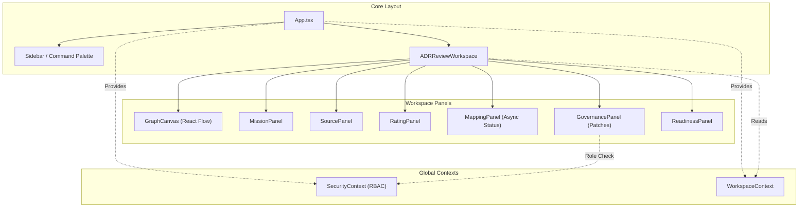

# 🗺️ PROJECT MAP — epios
> Автоматически сгенерировано: `2026-05-15 05:20:44`
> Скрипт: `node dev_studio/refresh.js`

## 📊 Telemetry / Context Health
| Metric | Value | Note |
|---|---|---|
| **Total Files** | `136` | Только JS/TS/TSX исходники |
| **Total Lines** | `14421` | Суммарно по проекту |
| **Project Weight** | `~114 545 tokens` | Оценка (4 символа/токен) |
| **Context Pressure** | `89.5%` | Нагрузка на окно 128k (Full Scan) |
| **Map Efficiency** | `~87%` | Экономия контекста через карту |

---

## Высокоуровневая архитектура
> Связи между основными пакетами и приложениями

```mermaid
flowchart LR

subgraph 0["apps"]
subgraph 1["demo-shell"]
subgraph 2["dist"]
subgraph 3["apps"]
subgraph 4["demo-shell"]
subgraph 5["src"]
6["App.d.ts"]
D["App.js"]
subgraph F["components"]
G["ADRReviewWorkspace.js"]
Y["GovernancePanel.js"]
Z["ReadinessPanel.js"]
10["SecureMcpIframe.js"]
21["ArchiveView.js"]
29["CommandPalette.js"]
2A["Sidebar.js"]
2B["Modal.js"]
2C["SidebarItem.js"]
2D["WorkspaceRoom.js"]
2E["GraphCanvas.js"]
2M["CustomNode.js"]
2N["MissionPanel.js"]
2O["MappingPanel.js"]
2P["SourcePanel.js"]
2Q["RatingPanel.js"]
2S["ADRReviewWorkspace.d.ts"]
2T["ArchiveView.d.ts"]
2U["CommandPalette.d.ts"]
2V["CustomNode.d.ts"]
2W["GovernancePanel.d.ts"]
2X["GraphCanvas.d.ts"]
2Y["MappingPanel.d.ts"]
2Z["MissionPanel.d.ts"]
30["Modal.d.ts"]
31["RatingPanel.d.ts"]
32["ReadinessPanel.d.ts"]
33["SecureMcpIframe.d.ts"]
34["Sidebar.d.ts"]
35["SidebarItem.d.ts"]
36["SourcePanel.d.ts"]
37["WorkspaceRoom.d.ts"]
end
T["api-config.js"]
subgraph U["context"]
V["SecurityContext.js"]
28["WorkspaceContext.js"]
38["SecurityContext.d.ts"]
39["WorkspaceContext.d.ts"]
end
subgraph W["hooks"]
X["useApi.js"]
3A["useApi.d.ts"]
end
2R["api-config.d.ts"]
3B["i18n.d.ts"]
3I["i18n.js"]
3P["main.d.ts"]
3S["main.js"]
subgraph 3X["mcp"]
3Y["schemas.d.ts"]
3Z["schemas.js"]
end
end
end
end
subgraph 40["assets"]
41["index-COAmHwb-.js"]
end
subgraph 44["packages"]
subgraph 45["domain"]
subgraph 46["src"]
47["adr.d.ts"]
48["adr.js"]
49["errors.d.ts"]
4A["errors.js"]
4B["events.d.ts"]
4C["events.js"]
4D["governance.d.ts"]
4E["node.js"]
4F["governance.js"]
4G["index.d.ts"]
4H["mapping.js"]
4I["rating.js"]
4J["security.js"]
4K["source.js"]
4L["workspace.js"]
4M["index.js"]
4N["mapping.d.ts"]
4O["node.d.ts"]
4P["rating.d.ts"]
4Q["security.d.ts"]
4R["source.d.ts"]
4S["workspace.d.ts"]
end
end
subgraph 4T["infrastructure-mcp"]
subgraph 4U["src"]
4V["index.d.ts"]
4W["mcp-app.registry.js"]
4X["mcp-bridge.js"]
4Y["schemas.js"]
4Z["index.js"]
50["mcp-app.registry.d.ts"]
51["mcp-bridge.d.ts"]
52["schemas.d.ts"]
end
end
subgraph 53["ports"]
subgraph 54["src"]
55["adr.repository.port.d.ts"]
56["adr.repository.port.js"]
57["domain.repository.port.d.ts"]
58["domain.repository.port.js"]
59["governance.port.d.ts"]
5A["governance.port.js"]
5B["graph.repository.port.d.ts"]
5C["graph.repository.port.js"]
5D["index.d.ts"]
5E["mapping.repository.port.js"]
5F["mcp.port.js"]
5G["outbox.repository.port.js"]
5H["security.port.js"]
5I["unit-of-work.port.js"]
5J["index.js"]
5K["mapping.repository.port.d.ts"]
5L["mcp.port.d.ts"]
5M["outbox.repository.port.d.ts"]
5N["security.port.d.ts"]
5O["unit-of-work.port.d.ts"]
end
end
end
end
subgraph 5P["src"]
5Q["App.tsx"]
subgraph 5R["components"]
5S["ADRReviewWorkspace.tsx"]
5Y["GovernancePanel.tsx"]
5Z["ReadinessPanel.tsx"]
60["SecureMcpIframe.tsx"]
61["ArchiveView.tsx"]
63["CommandPalette.tsx"]
64["Sidebar.tsx"]
65["Modal.tsx"]
66["SidebarItem.tsx"]
67["WorkspaceRoom.tsx"]
68["GraphCanvas.tsx"]
69["CustomNode.tsx"]
6A["MissionPanel.tsx"]
6B["MappingPanel.tsx"]
6C["SourcePanel.tsx"]
6D["RatingPanel.tsx"]
end
5T["api-config.ts"]
subgraph 5U["context"]
5V["SecurityContext.tsx"]
62["WorkspaceContext.tsx"]
end
subgraph 5W["hooks"]
5X["useApi.ts"]
end
6E["i18n.ts"]
6F["main.tsx"]
6G["index.css"]
subgraph 6H["mcp"]
6I["schemas.ts"]
end
end
end
end
subgraph 7["node_modules"]
subgraph 8[".pnpm"]
subgraph 9["react@18.3.1"]
subgraph A["node_modules"]
subgraph B["react"]
C["jsx-runtime.js"]
E["index.js"]
end
end
end
subgraph H["framer-motion@12.38.0_react-dom@18.3.1_react@18.3.1__react@18.3.1"]
subgraph I["node_modules"]
subgraph J["framer-motion"]
subgraph K["dist"]
subgraph L["cjs"]
M["index.js"]
end
end
end
end
end
subgraph N["lucide-react@1.14.0_react@18.3.1"]
subgraph O["node_modules"]
subgraph P["lucide-react"]
subgraph Q["dist"]
subgraph R["cjs"]
S["lucide-react.js"]
end
end
end
end
end
subgraph 1X["zod@4.4.3"]
subgraph 1Y["node_modules"]
subgraph 1Z["zod"]
20["index.js"]
end
end
end
subgraph 22["react-i18next@17.0.7_i18next@26.1.0_typescript@5.9.3__react-dom@18.3.1_react@18.3.1__react@18.3.1_typescript@5.9.3"]
subgraph 23["node_modules"]
subgraph 24["react-i18next"]
subgraph 25["dist"]
subgraph 26["es"]
27["index.js"]
end
end
end
end
end
subgraph 2F["reactflow@11.11.4_@types+react@18.3.28_react-dom@18.3.1_react@18.3.1__react@18.3.1"]
subgraph 2G["node_modules"]
subgraph 2H["reactflow"]
subgraph 2I["dist"]
subgraph 2J["esm"]
2K["index.mjs"]
end
2L["style.css"]
end
end
end
end
subgraph 3C["i18next@26.1.0_typescript@5.9.3"]
subgraph 3D["node_modules"]
subgraph 3E["i18next"]
subgraph 3F["dist"]
subgraph 3G["esm"]
3H["i18next.js"]
end
end
end
end
end
subgraph 3J["i18next-browser-languagedetector@8.2.1"]
subgraph 3K["node_modules"]
subgraph 3L["i18next-browser-languagedetector"]
subgraph 3M["dist"]
subgraph 3N["esm"]
3O["i18nextBrowserLanguageDetector.js"]
end
end
end
end
end
subgraph 3T["react-dom@18.3.1_react@18.3.1"]
subgraph 3U["node_modules"]
subgraph 3V["react-dom"]
3W["client.js"]
end
end
end
subgraph 6R["@fastify+cors@8.5.0"]
subgraph 6S["node_modules"]
subgraph 6T["@fastify"]
subgraph 6U["cors"]
6V["index.js"]
end
end
end
end
subgraph 6W["dotenv@16.6.1"]
subgraph 6X["node_modules"]
subgraph 6Y["dotenv"]
subgraph 6Z["lib"]
70["main.js"]
end
end
end
end
subgraph 71["dotenv-expand@11.0.7"]
subgraph 72["node_modules"]
subgraph 73["dotenv-expand"]
subgraph 74["lib"]
75["main.js"]
end
end
end
end
subgraph 76["drizzle-orm@0.45.2_postgres@3.4.9"]
subgraph 77["node_modules"]
subgraph 78["drizzle-orm"]
subgraph 79["postgres-js"]
7A["index.js"]
end
90["index.js"]
subgraph 92["pg-core"]
93["index.js"]
end
end
end
end
subgraph 7B["fastify@4.29.1"]
subgraph 7C["node_modules"]
subgraph 7D["fastify"]
7E["fastify.js"]
end
end
end
subgraph 7F["postgres@3.4.9"]
subgraph 7G["node_modules"]
subgraph 7H["postgres"]
subgraph 7I["src"]
7J["index.js"]
end
end
end
end
subgraph 9P["vitest@1.6.1_@types+node@25.7.0"]
subgraph 9Q["node_modules"]
subgraph 9R["vitest"]
subgraph 9S["dist"]
9T["index.js"]
9X["config.cjs"]
end
end
end
end
subgraph CF["drizzle-kit@0.31.10"]
subgraph CG["node_modules"]
subgraph CH["drizzle-kit"]
CI["index.mjs"]
end
end
end
end
end
subgraph 11["packages"]
subgraph 12["infrastructure-mcp"]
subgraph 13["src"]
14["index.ts"]
15["mcp-app.registry.ts"]
1V["mcp-bridge.ts"]
1W["schemas.ts"]
end
subgraph AD["dist"]
subgraph AE["domain"]
subgraph AF["src"]
AG["adr.d.ts"]
AH["adr.js"]
AI["errors.d.ts"]
AJ["errors.js"]
AK["events.d.ts"]
AL["events.js"]
AM["governance.d.ts"]
AN["node.js"]
AO["governance.js"]
AP["index.d.ts"]
AQ["mapping.js"]
AR["rating.js"]
AS["security.js"]
AT["source.js"]
AU["workspace.js"]
AV["index.js"]
AW["mapping.d.ts"]
AX["mission.d.ts"]
AY["mission.js"]
AZ["node.d.ts"]
B0["rating.d.ts"]
B1["security.d.ts"]
B2["source.d.ts"]
B3["workspace.d.ts"]
end
end
B4["index.d.ts"]
B5["mcp-app.registry.js"]
B6["mcp-bridge.js"]
B7["index.js"]
subgraph B8["infrastructure-mcp"]
subgraph B9["src"]
BA["index.d.ts"]
BB["mcp-app.registry.js"]
BC["mcp-bridge.js"]
BD["schemas.js"]
BE["index.js"]
BF["mcp-app.registry.d.ts"]
BG["mcp-bridge.d.ts"]
BH["schemas.d.ts"]
end
end
BI["mcp-app.registry.d.ts"]
BL["mcp-bridge.d.ts"]
subgraph BM["ports"]
subgraph BN["src"]
BO["adr.repository.port.d.ts"]
BP["adr.repository.port.js"]
BQ["domain.repository.port.d.ts"]
BR["domain.repository.port.js"]
BS["governance.port.d.ts"]
BT["governance.port.js"]
BU["graph.repository.port.d.ts"]
BV["graph.repository.port.js"]
BW["index.d.ts"]
BX["mapping.repository.port.js"]
BY["mcp.port.js"]
BZ["outbox.repository.port.js"]
C0["security.port.js"]
C1["unit-of-work.port.js"]
C2["index.js"]
C3["mapping.repository.port.d.ts"]
C4["mcp.port.d.ts"]
C5["outbox.repository.port.d.ts"]
C6["security.port.d.ts"]
C7["unit-of-work.port.d.ts"]
end
end
end
subgraph C8["test"]
C9["mcp-bridge.test.ts"]
CA["smoke.test.ts"]
end
end
subgraph 16["ports"]
subgraph 17["src"]
18["index.ts"]
19["adr.repository.port.ts"]
1N["domain.repository.port.ts"]
1O["governance.port.ts"]
1P["graph.repository.port.ts"]
1Q["mapping.repository.port.ts"]
1R["mcp.port.ts"]
1S["outbox.repository.port.ts"]
1T["security.port.ts"]
1U["unit-of-work.port.ts"]
end
end
subgraph 1A["domain"]
subgraph 1B["src"]
1C["index.ts"]
1D["adr.ts"]
1E["errors.ts"]
1F["events.ts"]
1G["governance.ts"]
1H["node.ts"]
1I["mapping.ts"]
1J["rating.ts"]
1K["security.ts"]
1L["source.ts"]
1M["workspace.ts"]
end
subgraph A3["coverage"]
A4["block-navigation.js"]
A5["prettify.js"]
A6["sorter.js"]
end
subgraph A7["test"]
A8["domain-smoke.test.ts"]
A9["node-invariants.test.ts"]
AA["source-rating.test.ts"]
AB["workspace.test.ts"]
end
AC["vitest.config.ts"]
end
subgraph 6J["api"]
subgraph 6K["coverage"]
6L["block-navigation.js"]
6M["prettify.js"]
6N["sorter.js"]
end
subgraph 6O["src"]
6P["bin.ts"]
6Q["server.ts"]
7K["mock-data.ts"]
subgraph 7L["routes"]
7M["adr.routes.ts"]
8N["governance.routes.ts"]
8O["mapping.routes.ts"]
8R["mcp.routes.ts"]
8S["rating.routes.ts"]
8T["security.routes.ts"]
8U["source.routes.ts"]
8V["workspace.routes.ts"]
end
subgraph 8P["dto"]
8Q["index.ts"]
end
subgraph 9J["contracts"]
9K["openapi.ts"]
9L["schemas.ts"]
end
9M["index.ts"]
end
subgraph 9N["test"]
9O["adr.test.ts"]
9U["api.test.ts"]
end
9V["vitest.config.ts"]
end
subgraph 7N["application"]
subgraph 7O["src"]
7P["index.ts"]
7Q["mapping-processor.ts"]
subgraph 7R["use-cases"]
7S["add-edge.ts"]
7Z["add-node.ts"]
80["add-source.ts"]
81["adr-use-cases.ts"]
82["apply-patch.ts"]
83["apply-retention.ts"]
84["assess-readiness.ts"]
85["cast-vote.ts"]
86["create-workspace.ts"]
87["get-mapping-run.ts"]
88["get-node-ratings.ts"]
89["get-readiness.ts"]
8A["get-trace.ts"]
8B["get-workspace-graph.ts"]
8C["list-mapping-runs.ts"]
8D["list-patches.ts"]
8E["list-sources.ts"]
8F["list-workspaces.ts"]
8G["patch-node.ts"]
8H["patch-workspace.ts"]
8I["propose-patch.ts"]
8J["rate-node.ts"]
8K["redact-node.ts"]
8L["start-mapping-run.ts"]
8M["submit-claim.ts"]
end
end
subgraph 9Y["test"]
9Z["async-runtime.test.ts"]
A0["create-workspace.test.ts"]
A1["use-cases.test.ts"]
end
A2["vitest.config.ts"]
end
subgraph 7U["observability"]
subgraph 7V["src"]
7W["index.ts"]
7X["audit.ts"]
7Y["tracer.ts"]
end
end
subgraph 8W["infrastructure-postgres"]
subgraph 8X["src"]
8Y["index.ts"]
8Z["governance.repository.ts"]
91["schema.ts"]
94["graph.repository.ts"]
95["identity.repository.ts"]
96["outbox.repository.ts"]
97["rating.repository.ts"]
98["source.repository.ts"]
99["unit-of-work.ts"]
9A["workspace.repository.ts"]
CJ["manual_migrate.ts"]
CK["seed.ts"]
end
CE["drizzle.config.ts"]
end
subgraph 9B["infrastructure-runtime"]
subgraph 9C["src"]
9D["index.ts"]
9E["in-memory-governance.repository.ts"]
9F["in-memory-repositories.ts"]
9G["in-memory-unit-of-work.ts"]
9H["outbox-worker.ts"]
9I["security-mocks.ts"]
end
end
subgraph CB["infrastructure-models"]
subgraph CC["src"]
CD["index.ts"]
end
end
subgraph CL["testing"]
subgraph CM["src"]
CN["fixtures.ts"]
CO["index.ts"]
end
end
end
subgraph 3Q["."]
3R["index.css"]
end
subgraph 42["@emotion"]
43["is-prop-valid"]
end
7T["crypto"]
9W["path"]
subgraph BJ["@epos"]
BK["ports"]
end
6-->C
D-->G
D-->21
D-->29
D-->2A
D-->2D
D-->28
D-->E
D-->C
G-->T
G-->V
G-->X
G-->Y
G-->Z
G-->10
G-->M
G-->S
G-->E
G-->C
V-->T
V-->E
V-->C
X-->T
X-->E
Y-->T
Y-->V
Y-->M
Y-->S
Y-->E
Y-->C
Z-->T
Z-->M
Z-->S
Z-->E
Z-->C
10-->14
10-->E
10-->C
14-->15
14-->1V
14-->1W
15-->18
18-->19
18-->1N
18-->1O
18-->1P
18-->1Q
18-->1R
18-->1S
18-->1T
18-->1U
19-->1C
1C-->1D
1C-->1E
1C-->1F
1C-->1G
1C-->1I
1C-->1H
1C-->1J
1C-->1K
1C-->1L
1C-->1M
1G-->1E
1G-->1F
1G-->1H
1H-->1E
1H-->1F
1M-->1E
1N-->1C
1O-->1C
1P-->1C
1Q-->1C
1T-->1C
1U-->1N
1U-->1O
1U-->1P
1U-->1S
1V-->1W
1V-->18
1W-->20
21-->28
21-->M
21-->S
21-->27
21-->C
28-->E
28-->C
29-->28
29-->M
29-->S
29-->E
29-->C
2A-->T
2A-->V
2A-->28
2A-->X
2A-->2B
2A-->2C
2A-->M
2A-->S
2A-->E
2A-->27
2A-->C
2B-->M
2B-->S
2B-->E
2B-->C
2C-->M
2C-->S
2C-->E
2C-->27
2C-->C
2D-->T
2D-->V
2D-->28
2D-->2E
2D-->2N
2D-->2Q
2D-->M
2D-->S
2D-->E
2D-->C
2E-->28
2E-->X
2E-->2M
2E-->S
2E-->E
2E-->C
2E-->2K
2E-->2L
2M-->S
2M-->E
2M-->C
2M-->2K
2N-->Y
2N-->2O
2N-->2P
2N-->M
2N-->S
2N-->E
2N-->C
2O-->T
2O-->M
2O-->S
2O-->E
2O-->C
2P-->T
2P-->M
2P-->S
2P-->E
2P-->C
2Q-->T
2Q-->S
2Q-->E
2Q-->C
2S-->E
2T-->E
2U-->E
2V-->E
2V-->C
2V-->2K
2W-->E
2X-->E
2X-->2L
2Y-->E
2Z-->1C
2Z-->E
30-->E
31-->E
32-->E
33-->E
34-->E
35-->E
36-->E
37-->E
38-->1C
38-->E
39-->1C
39-->E
39-->2K
3B-->3H
3I-->3H
3I-->3O
3I-->27
3P-->3I
3P-->3R
3P-->2L
3S-->D
3S-->V
3S-->28
3S-->3I
3S-->3R
3S-->E
3S-->3W
3S-->C
3S-->2L
3Y-->20
3Z-->20
41-->43
4D-->4C
4D-->4E
4E-->4A
4F-->4A
4G-->48
4G-->4A
4G-->4C
4G-->4F
4G-->4H
4G-->4E
4G-->4I
4G-->4J
4G-->4K
4G-->4L
4L-->4A
4M-->48
4M-->4A
4M-->4C
4M-->4F
4M-->4H
4M-->4E
4M-->4I
4M-->4J
4M-->4K
4M-->4L
4O-->4C
4V-->4W
4V-->4X
4V-->4Y
4X-->4Y
4Y-->20
4Z-->4W
4Z-->4X
4Z-->4Y
50-->18
51-->18
52-->20
55-->1C
57-->1C
59-->1C
5B-->1C
5D-->56
5D-->58
5D-->5A
5D-->5C
5D-->5E
5D-->5F
5D-->5G
5D-->5H
5D-->5I
5J-->56
5J-->58
5J-->5A
5J-->5C
5J-->5E
5J-->5F
5J-->5G
5J-->5H
5J-->5I
5K-->1C
5N-->1C
5O-->58
5O-->5A
5O-->5C
5O-->5G
5Q-->5S
5Q-->61
5Q-->63
5Q-->64
5Q-->67
5Q-->62
5Q-->E
5S-->5T
5S-->5V
5S-->5X
5S-->5Y
5S-->5Z
5S-->60
5S-->M
5S-->S
5S-->E
5V-->5T
5V-->1C
5V-->E
5X-->5T
5X-->E
5Y-->5T
5Y-->5V
5Y-->M
5Y-->S
5Y-->E
5Z-->5T
5Z-->M
5Z-->S
5Z-->E
60-->14
60-->E
61-->62
61-->M
61-->S
61-->E
61-->27
62-->1C
62-->E
62-->2K
63-->62
63-->M
63-->S
63-->E
64-->5T
64-->5V
64-->62
64-->5X
64-->65
64-->66
64-->1C
64-->M
64-->S
64-->E
64-->27
65-->M
65-->S
65-->E
66-->M
66-->S
66-->E
66-->27
67-->5T
67-->5V
67-->62
67-->68
67-->6A
67-->6D
67-->1C
67-->M
67-->S
67-->E
68-->62
68-->5X
68-->69
68-->S
68-->E
68-->2K
68-->2L
69-->S
69-->E
69-->2K
6A-->5Y
6A-->6B
6A-->6C
6A-->1C
6A-->M
6A-->S
6A-->E
6B-->5T
6B-->1C
6B-->M
6B-->S
6B-->E
6C-->5T
6C-->M
6C-->S
6C-->E
6D-->5T
6D-->S
6D-->E
6E-->3H
6E-->3O
6E-->27
6F-->5Q
6F-->5V
6F-->62
6F-->6E
6F-->6G
6F-->E
6F-->3W
6F-->2L
6I-->20
6P-->6Q
6Q-->7K
6Q-->7M
6Q-->8N
6Q-->8O
6Q-->8R
6Q-->8S
6Q-->8T
6Q-->8U
6Q-->8V
6Q-->7P
6Q-->14
6Q-->8Y
6Q-->9D
6Q-->18
6Q-->6V
6Q-->70
6Q-->75
6Q-->7A
6Q-->7E
6Q-->7J
7K-->1C
7M-->7P
7M-->7E
7P-->7Q
7P-->7S
7P-->7Z
7P-->80
7P-->81
7P-->82
7P-->83
7P-->84
7P-->85
7P-->86
7P-->87
7P-->88
7P-->89
7P-->8A
7P-->8B
7P-->8C
7P-->8D
7P-->8E
7P-->8F
7P-->8G
7P-->8H
7P-->8I
7P-->8J
7P-->8K
7P-->8L
7P-->8M
7Q-->1C
7Q-->18
7S-->1C
7S-->7W
7S-->18
7S-->7T
7W-->7X
7W-->7Y
7Z-->1C
7Z-->7W
7Z-->18
7Z-->7T
80-->1C
80-->18
80-->7T
81-->1C
81-->18
82-->1C
82-->18
82-->7T
83-->1C
83-->18
84-->1C
84-->18
84-->7T
85-->1C
85-->7W
85-->18
85-->7T
86-->1C
86-->7W
86-->18
86-->7T
87-->1C
87-->18
88-->1C
88-->18
89-->1C
89-->18
8A-->1C
8A-->18
8B-->1C
8B-->18
8C-->1C
8C-->18
8D-->1C
8D-->18
8E-->1C
8E-->18
8F-->1C
8F-->18
8G-->1C
8G-->18
8H-->1C
8H-->18
8I-->1C
8I-->18
8I-->7T
8J-->1C
8J-->18
8J-->7T
8K-->1C
8K-->18
8L-->1C
8L-->18
8L-->7T
8M-->1C
8M-->18
8M-->7T
8N-->7P
8N-->18
8N-->7E
8O-->8Q
8O-->7P
8O-->7E
8Q-->1C
8R-->14
8R-->18
8R-->7E
8S-->7P
8S-->1C
8S-->7E
8T-->7P
8T-->1C
8T-->18
8T-->7E
8U-->7P
8U-->1C
8U-->7E
8V-->8Q
8V-->7P
8V-->7E
8Y-->8Z
8Y-->94
8Y-->95
8Y-->96
8Y-->97
8Y-->91
8Y-->98
8Y-->99
8Y-->9A
8Z-->91
8Z-->1C
8Z-->18
8Z-->90
8Z-->7A
91-->93
94-->91
94-->1C
94-->18
94-->90
94-->7A
95-->91
95-->1C
95-->18
95-->90
95-->7A
96-->91
96-->18
96-->90
96-->7A
97-->91
97-->1C
97-->18
97-->90
97-->7A
98-->91
98-->1C
98-->18
98-->90
98-->7A
99-->8Z
99-->94
99-->96
99-->97
99-->98
99-->9A
99-->18
99-->7A
9A-->91
9A-->1C
9A-->18
9A-->90
9A-->7A
9D-->9E
9D-->9F
9D-->9G
9D-->9H
9D-->9I
9E-->1C
9E-->18
9F-->1C
9F-->18
9G-->18
9H-->7W
9H-->18
9I-->1C
9I-->18
9I-->7T
9L-->20
9M-->6Q
9O-->6Q
9O-->7E
9O-->9T
9U-->6Q
9U-->1C
9U-->18
9U-->7E
9U-->9T
9V-->9W
9V-->9X
9Z-->8L
9Z-->18
9Z-->7T
9Z-->9T
A0-->86
A0-->18
A0-->9T
A1-->7S
A1-->7Z
A1-->85
A1-->86
A1-->8B
A1-->8F
A1-->8G
A1-->8M
A1-->1C
A1-->18
A1-->9T
A2-->9W
A2-->9X
A8-->1C
A8-->9T
A9-->1C
A9-->9T
AA-->1C
AA-->9T
AB-->1E
AB-->1M
AB-->9T
AC-->9X
AM-->AL
AM-->AN
AN-->AJ
AO-->AJ
AP-->AH
AP-->AJ
AP-->AL
AP-->AO
AP-->AQ
AP-->AN
AP-->AR
AP-->AS
AP-->AT
AP-->AU
AU-->AJ
AV-->AH
AV-->AJ
AV-->AL
AV-->AO
AV-->AQ
AV-->AN
AV-->AR
AV-->AS
AV-->AT
AV-->AU
AZ-->AL
B4-->B5
B4-->B6
B7-->B5
B7-->B6
BA-->BB
BA-->BC
BA-->BD
BC-->BD
BD-->20
BE-->BB
BE-->BC
BE-->BD
BF-->18
BG-->18
BH-->20
BI-->BK
BL-->BK
BO-->1C
BQ-->1C
BS-->1C
BU-->1C
BW-->BP
BW-->BR
BW-->BT
BW-->BV
BW-->BX
BW-->BY
BW-->BZ
BW-->C0
BW-->C1
C2-->BP
C2-->BR
C2-->BT
C2-->BV
C2-->BX
C2-->BY
C2-->BZ
C2-->C0
C2-->C1
C3-->1C
C6-->1C
C7-->BR
C7-->BT
C7-->BV
C7-->BZ
C9-->1V
C9-->18
C9-->9T
CA-->9T
CE-->70
CE-->75
CE-->CI
CJ-->70
CJ-->75
CJ-->7J
CK-->91
CK-->70
CK-->75
CK-->7A
CK-->7J
CN-->1C
CO-->CN
```

## Детальная карта компонентов
> Полный граф зависимостей всех файлов проекта

```mermaid
flowchart LR

subgraph 0["apps"]
subgraph 1["demo-shell"]
subgraph 2["dist"]
subgraph 3["apps"]
subgraph 4["demo-shell"]
subgraph 5["src"]
6["App.d.ts"]
D["App.js"]
subgraph F["components"]
G["ADRReviewWorkspace.js"]
Y["GovernancePanel.js"]
Z["ReadinessPanel.js"]
10["SecureMcpIframe.js"]
21["ArchiveView.js"]
29["CommandPalette.js"]
2A["Sidebar.js"]
2B["Modal.js"]
2C["SidebarItem.js"]
2D["WorkspaceRoom.js"]
2E["GraphCanvas.js"]
2M["CustomNode.js"]
2N["MissionPanel.js"]
2O["MappingPanel.js"]
2P["SourcePanel.js"]
2Q["RatingPanel.js"]
2S["ADRReviewWorkspace.d.ts"]
2T["ArchiveView.d.ts"]
2U["CommandPalette.d.ts"]
2V["CustomNode.d.ts"]
2W["GovernancePanel.d.ts"]
2X["GraphCanvas.d.ts"]
2Y["MappingPanel.d.ts"]
2Z["MissionPanel.d.ts"]
30["Modal.d.ts"]
31["RatingPanel.d.ts"]
32["ReadinessPanel.d.ts"]
33["SecureMcpIframe.d.ts"]
34["Sidebar.d.ts"]
35["SidebarItem.d.ts"]
36["SourcePanel.d.ts"]
37["WorkspaceRoom.d.ts"]
end
T["api-config.js"]
subgraph U["context"]
V["SecurityContext.js"]
28["WorkspaceContext.js"]
38["SecurityContext.d.ts"]
39["WorkspaceContext.d.ts"]
end
subgraph W["hooks"]
X["useApi.js"]
3A["useApi.d.ts"]
end
2R["api-config.d.ts"]
3B["i18n.d.ts"]
3I["i18n.js"]
3P["main.d.ts"]
3S["main.js"]
subgraph 3X["mcp"]
3Y["schemas.d.ts"]
3Z["schemas.js"]
end
end
end
end
subgraph 40["assets"]
41["index-COAmHwb-.js"]
end
subgraph 44["packages"]
subgraph 45["domain"]
subgraph 46["src"]
47["adr.d.ts"]
48["adr.js"]
49["errors.d.ts"]
4A["errors.js"]
4B["events.d.ts"]
4C["events.js"]
4D["governance.d.ts"]
4E["node.js"]
4F["governance.js"]
4G["index.d.ts"]
4H["mapping.js"]
4I["rating.js"]
4J["security.js"]
4K["source.js"]
4L["workspace.js"]
4M["index.js"]
4N["mapping.d.ts"]
4O["node.d.ts"]
4P["rating.d.ts"]
4Q["security.d.ts"]
4R["source.d.ts"]
4S["workspace.d.ts"]
end
end
subgraph 4T["infrastructure-mcp"]
subgraph 4U["src"]
4V["index.d.ts"]
4W["mcp-app.registry.js"]
4X["mcp-bridge.js"]
4Y["schemas.js"]
4Z["index.js"]
50["mcp-app.registry.d.ts"]
51["mcp-bridge.d.ts"]
52["schemas.d.ts"]
end
end
subgraph 53["ports"]
subgraph 54["src"]
55["adr.repository.port.d.ts"]
56["adr.repository.port.js"]
57["domain.repository.port.d.ts"]
58["domain.repository.port.js"]
59["governance.port.d.ts"]
5A["governance.port.js"]
5B["graph.repository.port.d.ts"]
5C["graph.repository.port.js"]
5D["index.d.ts"]
5E["mapping.repository.port.js"]
5F["mcp.port.js"]
5G["outbox.repository.port.js"]
5H["security.port.js"]
5I["unit-of-work.port.js"]
5J["index.js"]
5K["mapping.repository.port.d.ts"]
5L["mcp.port.d.ts"]
5M["outbox.repository.port.d.ts"]
5N["security.port.d.ts"]
5O["unit-of-work.port.d.ts"]
end
end
end
end
subgraph 5P["src"]
5Q["App.tsx"]
subgraph 5R["components"]
5S["ADRReviewWorkspace.tsx"]
5Y["GovernancePanel.tsx"]
5Z["ReadinessPanel.tsx"]
60["SecureMcpIframe.tsx"]
61["ArchiveView.tsx"]
63["CommandPalette.tsx"]
64["Sidebar.tsx"]
65["Modal.tsx"]
66["SidebarItem.tsx"]
67["WorkspaceRoom.tsx"]
68["GraphCanvas.tsx"]
69["CustomNode.tsx"]
6A["MissionPanel.tsx"]
6B["MappingPanel.tsx"]
6C["SourcePanel.tsx"]
6D["RatingPanel.tsx"]
end
5T["api-config.ts"]
subgraph 5U["context"]
5V["SecurityContext.tsx"]
62["WorkspaceContext.tsx"]
end
subgraph 5W["hooks"]
5X["useApi.ts"]
end
6E["i18n.ts"]
6F["main.tsx"]
6G["index.css"]
subgraph 6H["mcp"]
6I["schemas.ts"]
end
end
end
end
subgraph 7["node_modules"]
subgraph 8[".pnpm"]
subgraph 9["react@18.3.1"]
subgraph A["node_modules"]
subgraph B["react"]
C["jsx-runtime.js"]
E["index.js"]
end
end
end
subgraph H["framer-motion@12.38.0_react-dom@18.3.1_react@18.3.1__react@18.3.1"]
subgraph I["node_modules"]
subgraph J["framer-motion"]
subgraph K["dist"]
subgraph L["cjs"]
M["index.js"]
end
end
end
end
end
subgraph N["lucide-react@1.14.0_react@18.3.1"]
subgraph O["node_modules"]
subgraph P["lucide-react"]
subgraph Q["dist"]
subgraph R["cjs"]
S["lucide-react.js"]
end
end
end
end
end
subgraph 1X["zod@4.4.3"]
subgraph 1Y["node_modules"]
subgraph 1Z["zod"]
20["index.js"]
end
end
end
subgraph 22["react-i18next@17.0.7_i18next@26.1.0_typescript@5.9.3__react-dom@18.3.1_react@18.3.1__react@18.3.1_typescript@5.9.3"]
subgraph 23["node_modules"]
subgraph 24["react-i18next"]
subgraph 25["dist"]
subgraph 26["es"]
27["index.js"]
end
end
end
end
end
subgraph 2F["reactflow@11.11.4_@types+react@18.3.28_react-dom@18.3.1_react@18.3.1__react@18.3.1"]
subgraph 2G["node_modules"]
subgraph 2H["reactflow"]
subgraph 2I["dist"]
subgraph 2J["esm"]
2K["index.mjs"]
end
2L["style.css"]
end
end
end
end
subgraph 3C["i18next@26.1.0_typescript@5.9.3"]
subgraph 3D["node_modules"]
subgraph 3E["i18next"]
subgraph 3F["dist"]
subgraph 3G["esm"]
3H["i18next.js"]
end
end
end
end
end
subgraph 3J["i18next-browser-languagedetector@8.2.1"]
subgraph 3K["node_modules"]
subgraph 3L["i18next-browser-languagedetector"]
subgraph 3M["dist"]
subgraph 3N["esm"]
3O["i18nextBrowserLanguageDetector.js"]
end
end
end
end
end
subgraph 3T["react-dom@18.3.1_react@18.3.1"]
subgraph 3U["node_modules"]
subgraph 3V["react-dom"]
3W["client.js"]
end
end
end
subgraph 6R["@fastify+cors@8.5.0"]
subgraph 6S["node_modules"]
subgraph 6T["@fastify"]
subgraph 6U["cors"]
6V["index.js"]
end
end
end
end
subgraph 6W["dotenv@16.6.1"]
subgraph 6X["node_modules"]
subgraph 6Y["dotenv"]
subgraph 6Z["lib"]
70["main.js"]
end
end
end
end
subgraph 71["dotenv-expand@11.0.7"]
subgraph 72["node_modules"]
subgraph 73["dotenv-expand"]
subgraph 74["lib"]
75["main.js"]
end
end
end
end
subgraph 76["drizzle-orm@0.45.2_postgres@3.4.9"]
subgraph 77["node_modules"]
subgraph 78["drizzle-orm"]
subgraph 79["postgres-js"]
7A["index.js"]
end
90["index.js"]
subgraph 92["pg-core"]
93["index.js"]
end
end
end
end
subgraph 7B["fastify@4.29.1"]
subgraph 7C["node_modules"]
subgraph 7D["fastify"]
7E["fastify.js"]
end
end
end
subgraph 7F["postgres@3.4.9"]
subgraph 7G["node_modules"]
subgraph 7H["postgres"]
subgraph 7I["src"]
7J["index.js"]
end
end
end
end
subgraph 9P["vitest@1.6.1_@types+node@25.7.0"]
subgraph 9Q["node_modules"]
subgraph 9R["vitest"]
subgraph 9S["dist"]
9T["index.js"]
9X["config.cjs"]
end
end
end
end
subgraph CF["drizzle-kit@0.31.10"]
subgraph CG["node_modules"]
subgraph CH["drizzle-kit"]
CI["index.mjs"]
end
end
end
end
end
subgraph 11["packages"]
subgraph 12["infrastructure-mcp"]
subgraph 13["src"]
14["index.ts"]
15["mcp-app.registry.ts"]
1V["mcp-bridge.ts"]
1W["schemas.ts"]
end
subgraph AD["dist"]
subgraph AE["domain"]
subgraph AF["src"]
AG["adr.d.ts"]
AH["adr.js"]
AI["errors.d.ts"]
AJ["errors.js"]
AK["events.d.ts"]
AL["events.js"]
AM["governance.d.ts"]
AN["node.js"]
AO["governance.js"]
AP["index.d.ts"]
AQ["mapping.js"]
AR["rating.js"]
AS["security.js"]
AT["source.js"]
AU["workspace.js"]
AV["index.js"]
AW["mapping.d.ts"]
AX["mission.d.ts"]
AY["mission.js"]
AZ["node.d.ts"]
B0["rating.d.ts"]
B1["security.d.ts"]
B2["source.d.ts"]
B3["workspace.d.ts"]
end
end
B4["index.d.ts"]
B5["mcp-app.registry.js"]
B6["mcp-bridge.js"]
B7["index.js"]
subgraph B8["infrastructure-mcp"]
subgraph B9["src"]
BA["index.d.ts"]
BB["mcp-app.registry.js"]
BC["mcp-bridge.js"]
BD["schemas.js"]
BE["index.js"]
BF["mcp-app.registry.d.ts"]
BG["mcp-bridge.d.ts"]
BH["schemas.d.ts"]
end
end
BI["mcp-app.registry.d.ts"]
BL["mcp-bridge.d.ts"]
subgraph BM["ports"]
subgraph BN["src"]
BO["adr.repository.port.d.ts"]
BP["adr.repository.port.js"]
BQ["domain.repository.port.d.ts"]
BR["domain.repository.port.js"]
BS["governance.port.d.ts"]
BT["governance.port.js"]
BU["graph.repository.port.d.ts"]
BV["graph.repository.port.js"]
BW["index.d.ts"]
BX["mapping.repository.port.js"]
BY["mcp.port.js"]
BZ["outbox.repository.port.js"]
C0["security.port.js"]
C1["unit-of-work.port.js"]
C2["index.js"]
C3["mapping.repository.port.d.ts"]
C4["mcp.port.d.ts"]
C5["outbox.repository.port.d.ts"]
C6["security.port.d.ts"]
C7["unit-of-work.port.d.ts"]
end
end
end
subgraph C8["test"]
C9["mcp-bridge.test.ts"]
CA["smoke.test.ts"]
end
end
subgraph 16["ports"]
subgraph 17["src"]
18["index.ts"]
19["adr.repository.port.ts"]
1N["domain.repository.port.ts"]
1O["governance.port.ts"]
1P["graph.repository.port.ts"]
1Q["mapping.repository.port.ts"]
1R["mcp.port.ts"]
1S["outbox.repository.port.ts"]
1T["security.port.ts"]
1U["unit-of-work.port.ts"]
end
end
subgraph 1A["domain"]
subgraph 1B["src"]
1C["index.ts"]
1D["adr.ts"]
1E["errors.ts"]
1F["events.ts"]
1G["governance.ts"]
1H["node.ts"]
1I["mapping.ts"]
1J["rating.ts"]
1K["security.ts"]
1L["source.ts"]
1M["workspace.ts"]
end
subgraph A3["coverage"]
A4["block-navigation.js"]
A5["prettify.js"]
A6["sorter.js"]
end
subgraph A7["test"]
A8["domain-smoke.test.ts"]
A9["node-invariants.test.ts"]
AA["source-rating.test.ts"]
AB["workspace.test.ts"]
end
AC["vitest.config.ts"]
end
subgraph 6J["api"]
subgraph 6K["coverage"]
6L["block-navigation.js"]
6M["prettify.js"]
6N["sorter.js"]
end
subgraph 6O["src"]
6P["bin.ts"]
6Q["server.ts"]
7K["mock-data.ts"]
subgraph 7L["routes"]
7M["adr.routes.ts"]
8N["governance.routes.ts"]
8O["mapping.routes.ts"]
8R["mcp.routes.ts"]
8S["rating.routes.ts"]
8T["security.routes.ts"]
8U["source.routes.ts"]
8V["workspace.routes.ts"]
end
subgraph 8P["dto"]
8Q["index.ts"]
end
subgraph 9J["contracts"]
9K["openapi.ts"]
9L["schemas.ts"]
end
9M["index.ts"]
end
subgraph 9N["test"]
9O["adr.test.ts"]
9U["api.test.ts"]
end
9V["vitest.config.ts"]
end
subgraph 7N["application"]
subgraph 7O["src"]
7P["index.ts"]
7Q["mapping-processor.ts"]
subgraph 7R["use-cases"]
7S["add-edge.ts"]
7Z["add-node.ts"]
80["add-source.ts"]
81["adr-use-cases.ts"]
82["apply-patch.ts"]
83["apply-retention.ts"]
84["assess-readiness.ts"]
85["cast-vote.ts"]
86["create-workspace.ts"]
87["get-mapping-run.ts"]
88["get-node-ratings.ts"]
89["get-readiness.ts"]
8A["get-trace.ts"]
8B["get-workspace-graph.ts"]
8C["list-mapping-runs.ts"]
8D["list-patches.ts"]
8E["list-sources.ts"]
8F["list-workspaces.ts"]
8G["patch-node.ts"]
8H["patch-workspace.ts"]
8I["propose-patch.ts"]
8J["rate-node.ts"]
8K["redact-node.ts"]
8L["start-mapping-run.ts"]
8M["submit-claim.ts"]
end
end
subgraph 9Y["test"]
9Z["async-runtime.test.ts"]
A0["create-workspace.test.ts"]
A1["use-cases.test.ts"]
end
A2["vitest.config.ts"]
end
subgraph 7U["observability"]
subgraph 7V["src"]
7W["index.ts"]
7X["audit.ts"]
7Y["tracer.ts"]
end
end
subgraph 8W["infrastructure-postgres"]
subgraph 8X["src"]
8Y["index.ts"]
8Z["governance.repository.ts"]
91["schema.ts"]
94["graph.repository.ts"]
95["identity.repository.ts"]
96["outbox.repository.ts"]
97["rating.repository.ts"]
98["source.repository.ts"]
99["unit-of-work.ts"]
9A["workspace.repository.ts"]
CJ["manual_migrate.ts"]
CK["seed.ts"]
end
CE["drizzle.config.ts"]
end
subgraph 9B["infrastructure-runtime"]
subgraph 9C["src"]
9D["index.ts"]
9E["in-memory-governance.repository.ts"]
9F["in-memory-repositories.ts"]
9G["in-memory-unit-of-work.ts"]
9H["outbox-worker.ts"]
9I["security-mocks.ts"]
end
end
subgraph CB["infrastructure-models"]
subgraph CC["src"]
CD["index.ts"]
end
end
subgraph CL["testing"]
subgraph CM["src"]
CN["fixtures.ts"]
CO["index.ts"]
end
end
end
subgraph 3Q["."]
3R["index.css"]
end
subgraph 42["@emotion"]
43["is-prop-valid"]
end
7T["crypto"]
9W["path"]
subgraph BJ["@epos"]
BK["ports"]
end
6-->C
D-->G
D-->21
D-->29
D-->2A
D-->2D
D-->28
D-->E
D-->C
G-->T
G-->V
G-->X
G-->Y
G-->Z
G-->10
G-->M
G-->S
G-->E
G-->C
V-->T
V-->E
V-->C
X-->T
X-->E
Y-->T
Y-->V
Y-->M
Y-->S
Y-->E
Y-->C
Z-->T
Z-->M
Z-->S
Z-->E
Z-->C
10-->14
10-->E
10-->C
14-->15
14-->1V
14-->1W
15-->18
18-->19
18-->1N
18-->1O
18-->1P
18-->1Q
18-->1R
18-->1S
18-->1T
18-->1U
19-->1C
1C-->1D
1C-->1E
1C-->1F
1C-->1G
1C-->1I
1C-->1H
1C-->1J
1C-->1K
1C-->1L
1C-->1M
1G-->1E
1G-->1F
1G-->1H
1H-->1E
1H-->1F
1M-->1E
1N-->1C
1O-->1C
1P-->1C
1Q-->1C
1T-->1C
1U-->1N
1U-->1O
1U-->1P
1U-->1S
1V-->1W
1V-->18
1W-->20
21-->28
21-->M
21-->S
21-->27
21-->C
28-->E
28-->C
29-->28
29-->M
29-->S
29-->E
29-->C
2A-->T
2A-->V
2A-->28
2A-->X
2A-->2B
2A-->2C
2A-->M
2A-->S
2A-->E
2A-->27
2A-->C
2B-->M
2B-->S
2B-->E
2B-->C
2C-->M
2C-->S
2C-->E
2C-->27
2C-->C
2D-->T
2D-->V
2D-->28
2D-->2E
2D-->2N
2D-->2Q
2D-->M
2D-->S
2D-->E
2D-->C
2E-->28
2E-->X
2E-->2M
2E-->S
2E-->E
2E-->C
2E-->2K
2E-->2L
2M-->S
2M-->E
2M-->C
2M-->2K
2N-->Y
2N-->2O
2N-->2P
2N-->M
2N-->S
2N-->E
2N-->C
2O-->T
2O-->M
2O-->S
2O-->E
2O-->C
2P-->T
2P-->M
2P-->S
2P-->E
2P-->C
2Q-->T
2Q-->S
2Q-->E
2Q-->C
2S-->E
2T-->E
2U-->E
2V-->E
2V-->C
2V-->2K
2W-->E
2X-->E
2X-->2L
2Y-->E
2Z-->1C
2Z-->E
30-->E
31-->E
32-->E
33-->E
34-->E
35-->E
36-->E
37-->E
38-->1C
38-->E
39-->1C
39-->E
39-->2K
3B-->3H
3I-->3H
3I-->3O
3I-->27
3P-->3I
3P-->3R
3P-->2L
3S-->D
3S-->V
3S-->28
3S-->3I
3S-->3R
3S-->E
3S-->3W
3S-->C
3S-->2L
3Y-->20
3Z-->20
41-->43
4D-->4C
4D-->4E
4E-->4A
4F-->4A
4G-->48
4G-->4A
4G-->4C
4G-->4F
4G-->4H
4G-->4E
4G-->4I
4G-->4J
4G-->4K
4G-->4L
4L-->4A
4M-->48
4M-->4A
4M-->4C
4M-->4F
4M-->4H
4M-->4E
4M-->4I
4M-->4J
4M-->4K
4M-->4L
4O-->4C
4V-->4W
4V-->4X
4V-->4Y
4X-->4Y
4Y-->20
4Z-->4W
4Z-->4X
4Z-->4Y
50-->18
51-->18
52-->20
55-->1C
57-->1C
59-->1C
5B-->1C
5D-->56
5D-->58
5D-->5A
5D-->5C
5D-->5E
5D-->5F
5D-->5G
5D-->5H
5D-->5I
5J-->56
5J-->58
5J-->5A
5J-->5C
5J-->5E
5J-->5F
5J-->5G
5J-->5H
5J-->5I
5K-->1C
5N-->1C
5O-->58
5O-->5A
5O-->5C
5O-->5G
5Q-->5S
5Q-->61
5Q-->63
5Q-->64
5Q-->67
5Q-->62
5Q-->E
5S-->5T
5S-->5V
5S-->5X
5S-->5Y
5S-->5Z
5S-->60
5S-->M
5S-->S
5S-->E
5V-->5T
5V-->1C
5V-->E
5X-->5T
5X-->E
5Y-->5T
5Y-->5V
5Y-->M
5Y-->S
5Y-->E
5Z-->5T
5Z-->M
5Z-->S
5Z-->E
60-->14
60-->E
61-->62
61-->M
61-->S
61-->E
61-->27
62-->1C
62-->E
62-->2K
63-->62
63-->M
63-->S
63-->E
64-->5T
64-->5V
64-->62
64-->5X
64-->65
64-->66
64-->1C
64-->M
64-->S
64-->E
64-->27
65-->M
65-->S
65-->E
66-->M
66-->S
66-->E
66-->27
67-->5T
67-->5V
67-->62
67-->68
67-->6A
67-->6D
67-->1C
67-->M
67-->S
67-->E
68-->62
68-->5X
68-->69
68-->S
68-->E
68-->2K
68-->2L
69-->S
69-->E
69-->2K
6A-->5Y
6A-->6B
6A-->6C
6A-->1C
6A-->M
6A-->S
6A-->E
6B-->5T
6B-->1C
6B-->M
6B-->S
6B-->E
6C-->5T
6C-->M
6C-->S
6C-->E
6D-->5T
6D-->S
6D-->E
6E-->3H
6E-->3O
6E-->27
6F-->5Q
6F-->5V
6F-->62
6F-->6E
6F-->6G
6F-->E
6F-->3W
6F-->2L
6I-->20
6P-->6Q
6Q-->7K
6Q-->7M
6Q-->8N
6Q-->8O
6Q-->8R
6Q-->8S
6Q-->8T
6Q-->8U
6Q-->8V
6Q-->7P
6Q-->14
6Q-->8Y
6Q-->9D
6Q-->18
6Q-->6V
6Q-->70
6Q-->75
6Q-->7A
6Q-->7E
6Q-->7J
7K-->1C
7M-->7P
7M-->7E
7P-->7Q
7P-->7S
7P-->7Z
7P-->80
7P-->81
7P-->82
7P-->83
7P-->84
7P-->85
7P-->86
7P-->87
7P-->88
7P-->89
7P-->8A
7P-->8B
7P-->8C
7P-->8D
7P-->8E
7P-->8F
7P-->8G
7P-->8H
7P-->8I
7P-->8J
7P-->8K
7P-->8L
7P-->8M
7Q-->1C
7Q-->18
7S-->1C
7S-->7W
7S-->18
7S-->7T
7W-->7X
7W-->7Y
7Z-->1C
7Z-->7W
7Z-->18
7Z-->7T
80-->1C
80-->18
80-->7T
81-->1C
81-->18
82-->1C
82-->18
82-->7T
83-->1C
83-->18
84-->1C
84-->18
84-->7T
85-->1C
85-->7W
85-->18
85-->7T
86-->1C
86-->7W
86-->18
86-->7T
87-->1C
87-->18
88-->1C
88-->18
89-->1C
89-->18
8A-->1C
8A-->18
8B-->1C
8B-->18
8C-->1C
8C-->18
8D-->1C
8D-->18
8E-->1C
8E-->18
8F-->1C
8F-->18
8G-->1C
8G-->18
8H-->1C
8H-->18
8I-->1C
8I-->18
8I-->7T
8J-->1C
8J-->18
8J-->7T
8K-->1C
8K-->18
8L-->1C
8L-->18
8L-->7T
8M-->1C
8M-->18
8M-->7T
8N-->7P
8N-->18
8N-->7E
8O-->8Q
8O-->7P
8O-->7E
8Q-->1C
8R-->14
8R-->18
8R-->7E
8S-->7P
8S-->1C
8S-->7E
8T-->7P
8T-->1C
8T-->18
8T-->7E
8U-->7P
8U-->1C
8U-->7E
8V-->8Q
8V-->7P
8V-->7E
8Y-->8Z
8Y-->94
8Y-->95
8Y-->96
8Y-->97
8Y-->91
8Y-->98
8Y-->99
8Y-->9A
8Z-->91
8Z-->1C
8Z-->18
8Z-->90
8Z-->7A
91-->93
94-->91
94-->1C
94-->18
94-->90
94-->7A
95-->91
95-->1C
95-->18
95-->90
95-->7A
96-->91
96-->18
96-->90
96-->7A
97-->91
97-->1C
97-->18
97-->90
97-->7A
98-->91
98-->1C
98-->18
98-->90
98-->7A
99-->8Z
99-->94
99-->96
99-->97
99-->98
99-->9A
99-->18
99-->7A
9A-->91
9A-->1C
9A-->18
9A-->90
9A-->7A
9D-->9E
9D-->9F
9D-->9G
9D-->9H
9D-->9I
9E-->1C
9E-->18
9F-->1C
9F-->18
9G-->18
9H-->7W
9H-->18
9I-->1C
9I-->18
9I-->7T
9L-->20
9M-->6Q
9O-->6Q
9O-->7E
9O-->9T
9U-->6Q
9U-->1C
9U-->18
9U-->7E
9U-->9T
9V-->9W
9V-->9X
9Z-->8L
9Z-->18
9Z-->7T
9Z-->9T
A0-->86
A0-->18
A0-->9T
A1-->7S
A1-->7Z
A1-->85
A1-->86
A1-->8B
A1-->8F
A1-->8G
A1-->8M
A1-->1C
A1-->18
A1-->9T
A2-->9W
A2-->9X
A8-->1C
A8-->9T
A9-->1C
A9-->9T
AA-->1C
AA-->9T
AB-->1E
AB-->1M
AB-->9T
AC-->9X
AM-->AL
AM-->AN
AN-->AJ
AO-->AJ
AP-->AH
AP-->AJ
AP-->AL
AP-->AO
AP-->AQ
AP-->AN
AP-->AR
AP-->AS
AP-->AT
AP-->AU
AU-->AJ
AV-->AH
AV-->AJ
AV-->AL
AV-->AO
AV-->AQ
AV-->AN
AV-->AR
AV-->AS
AV-->AT
AV-->AU
AZ-->AL
B4-->B5
B4-->B6
B7-->B5
B7-->B6
BA-->BB
BA-->BC
BA-->BD
BC-->BD
BD-->20
BE-->BB
BE-->BC
BE-->BD
BF-->18
BG-->18
BH-->20
BI-->BK
BL-->BK
BO-->1C
BQ-->1C
BS-->1C
BU-->1C
BW-->BP
BW-->BR
BW-->BT
BW-->BV
BW-->BX
BW-->BY
BW-->BZ
BW-->C0
BW-->C1
C2-->BP
C2-->BR
C2-->BT
C2-->BV
C2-->BX
C2-->BY
C2-->BZ
C2-->C0
C2-->C1
C3-->1C
C6-->1C
C7-->BR
C7-->BT
C7-->BV
C7-->BZ
C9-->1V
C9-->18
C9-->9T
CA-->9T
CE-->70
CE-->75
CE-->CI
CJ-->70
CJ-->75
CJ-->7J
CK-->91
CK-->70
CK-->75
CK-->7A
CK-->7J
CN-->1C
CO-->CN
```

## 🎨 Архитектура UI Интерфейсов (demo-shell)
> Обобщенная концептуальная структура компонентов пользовательского интерфейса



> Подробная документация и Roadmap по развитию интерфейсов находится в [docs/05_ui_roadmap/](docs/05_ui_roadmap/00_ROADMAP_INDEX.md)

## Компонент: `apps`

| Файл | Строк | Размер | Описание |
|---|---|---|---|
| `demo-shell/src/api-config.ts` | 7 | 0.3 KB | Централизованная конфигурация API URL. |
| `demo-shell/src/App.tsx` | 73 | 1.9 KB | — |
| `demo-shell/src/components/ADRReviewWorkspace.tsx` | 853 | 27.9 KB | — |
| `demo-shell/src/components/ArchiveView.tsx` | 247 | 7.4 KB | — |
| `demo-shell/src/components/CommandPalette.tsx` | 341 | 9.1 KB | — |
| `demo-shell/src/components/CustomNode.tsx` | 169 | 4.4 KB | — |
| `demo-shell/src/components/GovernancePanel.tsx` | 498 | 14.7 KB | — |
| `demo-shell/src/components/GraphCanvas.tsx` | 579 | 16.2 KB | — |
| `demo-shell/src/components/MappingPanel.tsx` | 270 | 7.8 KB | — |
| `demo-shell/src/components/MissionPanel.tsx` | 303 | 8.7 KB | — |
| `demo-shell/src/components/Modal.tsx` | 100 | 2.7 KB | — |
| `demo-shell/src/components/RatingPanel.tsx` | 234 | 6.2 KB | — |
| `demo-shell/src/components/ReadinessPanel.tsx` | 403 | 11.7 KB | — |
| `demo-shell/src/components/SecureMcpIframe.tsx` | 101 | 3.0 KB | — |
| `demo-shell/src/components/Sidebar.tsx` | 774 | 24.7 KB | — |
| `demo-shell/src/components/SidebarItem.tsx` | 278 | 7.6 KB | — |
| `demo-shell/src/components/SourcePanel.tsx` | 232 | 6.9 KB | — |
| `demo-shell/src/components/WorkspaceRoom.tsx` | 665 | 21.5 KB | — |
| `demo-shell/src/context/SecurityContext.tsx` | 68 | 1.6 KB | — |
| `demo-shell/src/context/WorkspaceContext.tsx` | 145 | 3.8 KB | — |
| `demo-shell/src/hooks/useApi.ts` | 43 | 1.1 KB | — |
| `demo-shell/src/i18n.ts` | 99 | 3.4 KB | — |
| `demo-shell/src/main.tsx` | 20 | 0.5 KB | — |
| `demo-shell/src/mcp/schemas.ts` | 20 | 0.7 KB | — |

### `demo-shell/src/api-config.ts`
- **Экспорт**: `API_BASE_URL`

### `demo-shell/src/components/ArchiveView.tsx`
- **Экспорт**: `ArchiveView`
- **Зависимости**:
  - `../context/WorkspaceContext` → useWorkspace

### `demo-shell/src/components/GovernancePanel.tsx`
- **Экспорт**: `GovernancePanel`
- **Зависимости**:
  - `../api-config` → API_BASE_URL
  - `../context/SecurityContext` → useSecurity

### `demo-shell/src/components/MappingPanel.tsx`
- **Экспорт**: `MappingPanel`
- **Зависимости**:
  - `../api-config` → API_BASE_URL
  - `@epios/domain` → MappingRun

### `demo-shell/src/components/MissionPanel.tsx`
- **Экспорт**: `MissionPanel`
- **Зависимости**:
  - `./GovernancePanel` → GovernancePanel
  - `./SourcePanel` → SourcePanel
  - `./MappingPanel` → MappingPanel
  - `@epios/domain` → Workspace

### `demo-shell/src/components/Modal.tsx`
- **Экспорт**: `Modal`
- **Зависимости**:

### `demo-shell/src/components/RatingPanel.tsx`
- **Экспорт**: `RatingPanel`
- **Зависимости**:
  - `../api-config` → API_BASE_URL

### `demo-shell/src/components/ReadinessPanel.tsx`
- **Экспорт**: `ReadinessPanel`
- **Зависимости**:
  - `../api-config` → API_BASE_URL

### `demo-shell/src/components/SecureMcpIframe.tsx`
- **Экспорт**: `SecureMcpIframe`
- **Зависимости**:
  - `@epios/infrastructure-mcp` → McpRequestSchema

### `demo-shell/src/components/SidebarItem.tsx`
- **Экспорт**: `SidebarItemProps`, `SidebarItem`
- **Зависимости**:

### `demo-shell/src/components/SourcePanel.tsx`
- **Экспорт**: `SourcePanel`
- **Зависимости**:
  - `../api-config` → API_BASE_URL

### `demo-shell/src/context/SecurityContext.tsx`
- **Экспорт**: `SecurityProvider`, `useSecurity`
- **Зависимости**:
  - `@epios/domain` → User
  - `../api-config` → API_BASE_URL

### `demo-shell/src/context/WorkspaceContext.tsx`
- **Экспорт**: `WorkspaceProvider`, `useWorkspace`
- **Зависимости**:
  - `@epios/domain` → Workspace, WorkspaceStatus

### `demo-shell/src/hooks/useApi.ts`
- **Экспорт**: `useApi`
- **Зависимости**:
  - `../api-config` → API_BASE_URL

### `demo-shell/src/mcp/schemas.ts`
- **Экспорт**: `McpRequestSchema`, `McpResponseSchema`, `McpRequest`, `McpResponse`
- **Зависимости**:

## Компонент: `packages`

| Файл | Строк | Размер | Описание |
|---|---|---|---|
| `api/coverage/block-navigation.js` | 88 | 2.6 KB | — |
| `api/coverage/prettify.js` | 3 | 17.2 KB | — |
| `api/coverage/sorter.js` | 211 | 6.6 KB | — |
| `api/src/bin.ts` | 13 | 0.3 KB | — |
| `api/src/contracts/openapi.ts` | 30 | 0.6 KB | OpenAPI Definition for EPIOS (Derived from Schemas) |
| `api/src/contracts/schemas.ts` | 69 | 1.7 KB | EPIOS API Core Schemas (Source of Truth) |
| `api/src/dto/index.ts` | 57 | 1.1 KB | — |
| `api/src/index.ts` | 3 | 0.0 KB | — |
| `api/src/mock-data.ts` | 578 | 17.6 KB | Mock data factory for demo/development mode. |
| `api/src/routes/adr.routes.ts` | 27 | 0.6 KB | — |
| `api/src/routes/governance.routes.ts` | 126 | 3.7 KB | — |
| `api/src/routes/mapping.routes.ts` | 95 | 2.8 KB | — |
| `api/src/routes/mcp.routes.ts` | 45 | 1.3 KB | — |
| `api/src/routes/rating.routes.ts` | 30 | 0.9 KB | — |
| `api/src/routes/security.routes.ts` | 66 | 2.0 KB | — |
| `api/src/routes/source.routes.ts` | 34 | 0.9 KB | — |
| `api/src/routes/workspace.routes.ts` | 52 | 1.4 KB | — |
| `api/src/server.ts` | 300 | 9.7 KB | — |
| `api/test/adr.test.ts` | 55 | 1.4 KB | — |
| `api/test/api.test.ts` | 320 | 8.3 KB | — |
| `api/vitest.config.ts` | 42 | 1.1 KB | — |
| `application/src/index.ts` | 27 | 1.2 KB | — |
| `application/src/mapping-processor.ts` | 96 | 2.5 KB | — |
| `application/src/use-cases/add-edge.ts` | 47 | 1.3 KB | — |
| `application/src/use-cases/add-node.ts` | 56 | 1.4 KB | — |
| `application/src/use-cases/add-source.ts` | 29 | 0.7 KB | — |
| `application/src/use-cases/adr-use-cases.ts` | 19 | 0.5 KB | — |
| `application/src/use-cases/apply-patch.ts` | 75 | 2.3 KB | — |
| `application/src/use-cases/apply-retention.ts` | 60 | 1.7 KB | — |
| `application/src/use-cases/assess-readiness.ts` | 90 | 2.8 KB | — |
| `application/src/use-cases/cast-vote.ts` | 144 | 4.6 KB | — |
| `application/src/use-cases/create-workspace.ts` | 49 | 1.2 KB | — |
| `application/src/use-cases/get-mapping-run.ts` | 11 | 0.3 KB | — |
| `application/src/use-cases/get-node-ratings.ts` | 11 | 0.3 KB | — |
| `application/src/use-cases/get-readiness.ts` | 11 | 0.4 KB | — |
| `application/src/use-cases/get-trace.ts` | 11 | 0.3 KB | — |
| `application/src/use-cases/get-workspace-graph.ts` | 21 | 0.6 KB | — |
| `application/src/use-cases/list-mapping-runs.ts` | 11 | 0.3 KB | — |
| `application/src/use-cases/list-patches.ts` | 15 | 0.4 KB | — |
| `application/src/use-cases/list-sources.ts` | 11 | 0.3 KB | — |
| `application/src/use-cases/list-workspaces.ts` | 11 | 0.3 KB | — |
| `application/src/use-cases/patch-node.ts` | 35 | 1.2 KB | — |
| `application/src/use-cases/patch-workspace.ts` | 36 | 1.1 KB | — |
| `application/src/use-cases/propose-patch.ts` | 57 | 1.5 KB | — |
| `application/src/use-cases/rate-node.ts` | 29 | 0.7 KB | — |
| `application/src/use-cases/redact-node.ts` | 63 | 1.6 KB | — |
| `application/src/use-cases/start-mapping-run.ts` | 53 | 1.4 KB | — |
| `application/src/use-cases/submit-claim.ts` | 54 | 1.3 KB | — |
| `application/test/async-runtime.test.ts` | 47 | 1.4 KB | — |
| `application/test/create-workspace.test.ts` | 63 | 1.6 KB | — |
| `application/test/use-cases.test.ts` | 390 | 11.7 KB | — |
| `application/vitest.config.ts` | 28 | 0.6 KB | — |
| `domain/coverage/block-navigation.js` | 88 | 2.6 KB | — |
| `domain/coverage/prettify.js` | 3 | 17.2 KB | — |
| `domain/coverage/sorter.js` | 211 | 6.6 KB | — |
| `domain/src/adr.ts` | 42 | 0.7 KB | — |
| `domain/src/errors.ts` | 28 | 0.7 KB | — |
| `domain/src/events.ts` | 6 | 0.1 KB | — |
| `domain/src/governance.ts` | 282 | 6.0 KB | A Claim in EPIOS is a node that undergoes a formal governance process. |
| `domain/src/index.ts` | 11 | 0.3 KB | — |
| `domain/src/mapping.ts` | 15 | 0.3 KB | — |
| `domain/src/node.ts` | 174 | 3.7 KB | — |
| `domain/src/rating.ts` | 11 | 0.2 KB | — |
| `domain/src/security.ts` | 40 | 0.8 KB | — |
| `domain/src/source.ts` | 11 | 0.2 KB | — |
| `domain/src/workspace.ts` | 189 | 4.3 KB | Returns a plain object representation for persistence/serialization. |
| `domain/test/domain-smoke.test.ts` | 51 | 1.3 KB | — |
| `domain/test/node-invariants.test.ts` | 51 | 1.2 KB | — |
| `domain/test/source-rating.test.ts` | 33 | 0.8 KB | — |
| `domain/test/workspace.test.ts` | 63 | 1.7 KB | — |
| `domain/vitest.config.ts` | 21 | 0.4 KB | — |
| `infrastructure-mcp/src/index.ts` | 5 | 0.1 KB | — |
| `infrastructure-mcp/src/mcp-app.registry.ts` | 35 | 0.8 KB | — |
| `infrastructure-mcp/src/mcp-bridge.ts` | 77 | 2.0 KB | Hardened MCP Bridge implementation. |
| `infrastructure-mcp/src/schemas.ts` | 33 | 1.0 KB | MCP Bridge Message Schemas |
| `infrastructure-mcp/test/mcp-bridge.test.ts` | 49 | 1.4 KB | — |
| `infrastructure-mcp/test/smoke.test.ts` | 8 | 0.2 KB | — |
| `infrastructure-models/src/index.ts` | 3 | 0.1 KB | — |
| `infrastructure-postgres/drizzle.config.ts` | 17 | 0.4 KB | — |
| `infrastructure-postgres/src/governance.repository.ts` | 357 | 10.2 KB | — |
| `infrastructure-postgres/src/graph.repository.ts` | 202 | 5.8 KB | — |
| `infrastructure-postgres/src/identity.repository.ts` | 68 | 1.7 KB | — |
| `infrastructure-postgres/src/index.ts` | 14 | 0.5 KB | — |
| `infrastructure-postgres/src/manual_migrate.ts` | 30 | 0.9 KB | — |
| `infrastructure-postgres/src/outbox.repository.ts` | 53 | 1.4 KB | — |
| `infrastructure-postgres/src/rating.repository.ts` | 50 | 1.4 KB | — |
| `infrastructure-postgres/src/schema.ts` | 209 | 6.9 KB | — |
| `infrastructure-postgres/src/seed.ts` | 378 | 13.2 KB | — |
| `infrastructure-postgres/src/source.repository.ts` | 60 | 1.6 KB | — |
| `infrastructure-postgres/src/unit-of-work.ts` | 55 | 2.1 KB | PostgresUnitOfWork provides access to all repositories within a single Drizzle transaction. |
| `infrastructure-postgres/src/workspace.repository.ts` | 126 | 4.1 KB | — |
| `infrastructure-runtime/src/in-memory-governance.repository.ts` | 108 | 3.3 KB | — |
| `infrastructure-runtime/src/in-memory-repositories.ts` | 242 | 6.4 KB | — |
| `infrastructure-runtime/src/in-memory-unit-of-work.ts` | 52 | 1.6 KB | InMemoryUnitOfWork provides access to all repositories. |
| `infrastructure-runtime/src/index.ts` | 9 | 0.3 KB | — |
| `infrastructure-runtime/src/outbox-worker.ts` | 75 | 2.0 KB | — |
| `infrastructure-runtime/src/security-mocks.ts` | 83 | 2.2 KB | — |
| `observability/src/audit.ts` | 25 | 0.6 KB | — |
| `observability/src/index.ts` | 3 | 0.1 KB | — |
| `observability/src/tracer.ts` | 24 | 0.5 KB | — |
| `ports/src/adr.repository.port.ts` | 8 | 0.2 KB | — |
| `ports/src/domain.repository.port.ts` | 19 | 0.5 KB | — |
| `ports/src/governance.port.ts` | 32 | 1.2 KB | — |
| `ports/src/graph.repository.port.ts` | 14 | 0.6 KB | — |
| `ports/src/index.ts` | 11 | 0.4 KB | — |
| `ports/src/mapping.repository.port.ts` | 8 | 0.2 KB | — |
| `ports/src/mcp.port.ts` | 35 | 1.0 KB | Port for MCP Application Registry. |
| `ports/src/outbox.repository.port.ts` | 14 | 0.3 KB | — |
| `ports/src/security.port.ts` | 15 | 0.6 KB | — |
| `ports/src/unit-of-work.port.ts` | 33 | 1.1 KB | UnitOfWork provides access to all repositories within a single transaction scope. |
| `testing/src/fixtures.ts` | 23 | 0.5 KB | — |
| `testing/src/index.ts` | 3 | 0.1 KB | — |

### `api/src/contracts/openapi.ts`
- **Экспорт**: `OpenAPIConfig`

### `api/src/contracts/schemas.ts`
- **Экспорт**: `NodeTypeSchema`, `NodeStrengthSchema`, `EvidenceRefSchema`, `CreateWorkspaceSchema`, `AddNodeSchema`, `EpistemicEdgeTypeSchema`, `AddEdgeSchema`, `PatchNodeSchema`, `ErrorResponseSchema`
- **Зависимости**:

### `api/src/dto/index.ts`
- **Экспорт**: `CreateWorkspaceDto`, `AddNodeDto`, `AddEdgeDto`, `PatchNodeDto`, `ADRDto`, `ADRFlowDto`, `AddSourceDto`, `RateNodeDto`

### `api/src/mock-data.ts`
- **Экспорт**: `MockData`, `createMockData`

### `api/src/server.ts`
- **Экспорт**: `ServerDependencies`, `buildServer`
- **Роуты**:
  - `GET /health`
- **Зависимости**:
  - `./routes/workspace.routes.js` → workspaceRoutes
  - `./routes/mapping.routes.js` → mappingRoutes
  - `./routes/governance.routes.js` → governanceRoutes
  - `./routes/adr.routes.js` → adrRoutes
  - `./routes/mcp.routes.js` → mcpRoutes
  - `./routes/source.routes.js` → sourceRoutes
  - `./routes/rating.routes.js` → ratingRoutes
  - `./routes/security.routes.js` → securityRoutes
  - `./mock-data.js` → createMockData

### `application/src/mapping-processor.ts`
- **Экспорт**: `MappingProcessor`
- **Зависимости**:
  - `@epios/domain` → EpistemicNode

### `application/src/use-cases/add-edge.ts`
- **Экспорт**: `AddEdgeRequest`, `AddEdgeUseCase`
- **Зависимости**:
  - `@epios/domain` → EpistemicEdge, EpistemicEdgeType
  - `@epios/ports` → GraphRepositoryPort, WorkspaceRepositoryPort
  - `@epios/observability` → tracer

### `application/src/use-cases/add-node.ts`
- **Экспорт**: `AddNodeRequest`, `AddNodeUseCase`
- **Зависимости**:
  - `@epios/ports` → GraphRepositoryPort, WorkspaceRepositoryPort
  - `@epios/observability` → tracer

### `application/src/use-cases/add-source.ts`
- **Экспорт**: `AddSourceRequest`, `AddSourceUseCase`
- **Зависимости**:
  - `@epios/domain` → Source, SourceType
  - `@epios/ports` → SourceRepositoryPort

### `application/src/use-cases/adr-use-cases.ts`
- **Экспорт**: `ListADRsUseCase`, `GetADRUseCase`
- **Зависимости**:
  - `@epios/domain` → ADR
  - `@epios/ports` → ADRRepositoryPort

### `application/src/use-cases/apply-patch.ts`
- **Экспорт**: `ApplyPatchRequest`, `ApplyPatchUseCase`
- **Зависимости**:
  - `@epios/ports` → UnitOfWorkPort
  - `@epios/domain` → ArtifactVersion

### `application/src/use-cases/apply-retention.ts`
- **Экспорт**: `ApplyRetentionUseCase`
- **Зависимости**:
  - `@epios/domain` → RetentionPolicy

### `application/src/use-cases/assess-readiness.ts`
- **Экспорт**: `AssessReadinessRequest`, `AssessReadinessUseCase`
- **Зависимости**:
  - `@epios/ports` → GovernanceRepositoryPort, GraphRepositoryPort
  - `@epios/domain` → ReadinessAssessment, ReadinessStatus

### `application/src/use-cases/cast-vote.ts`
- **Экспорт**: `CastVoteRequest`, `CastVoteUseCase`
- **Зависимости**:
  - `@epios/ports` → UnitOfWorkPort, OutboxMessage
  - `@epios/observability` → auditLogger
  - `@epios/domain` → DomainEvent

### `application/src/use-cases/create-workspace.ts`
- **Экспорт**: `CreateWorkspaceRequest`, `CreateWorkspaceUseCase`
- **Зависимости**:
  - `@epios/ports` → WorkspaceRepositoryPort
  - `@epios/observability` → tracer

### `application/src/use-cases/get-mapping-run.ts`
- **Экспорт**: `GetMappingRunUseCase`
- **Зависимости**:
  - `@epios/domain` → MappingRun
  - `@epios/ports` → MappingRepositoryPort

### `application/src/use-cases/get-node-ratings.ts`
- **Экспорт**: `GetNodeRatingsUseCase`
- **Зависимости**:
  - `@epios/domain` → Rating
  - `@epios/ports` → RatingRepositoryPort

### `application/src/use-cases/get-readiness.ts`
- **Экспорт**: `GetReadinessUseCase`
- **Зависимости**:
  - `@epios/ports` → GovernanceRepositoryPort
  - `@epios/domain` → ReadinessAssessment

### `application/src/use-cases/get-trace.ts`
- **Экспорт**: `GetTraceUseCase`
- **Зависимости**:
  - `@epios/ports` → GovernanceRepositoryPort
  - `@epios/domain` → TraceEvent

### `application/src/use-cases/get-workspace-graph.ts`
- **Экспорт**: `WorkspaceGraph`, `GetWorkspaceGraphUseCase`
- **Зависимости**:
  - `@epios/domain` → EpistemicNode, EpistemicEdge
  - `@epios/ports` → GraphRepositoryPort

### `application/src/use-cases/list-mapping-runs.ts`
- **Экспорт**: `ListMappingRunsUseCase`
- **Зависимости**:
  - `@epios/domain` → MappingRun
  - `@epios/ports` → MappingRepositoryPort

### `application/src/use-cases/list-patches.ts`
- **Экспорт**: `ListPatchesRequest`, `ListPatchesUseCase`
- **Зависимости**:
  - `@epios/domain` → NodePatch
  - `@epios/ports` → GovernanceRepositoryPort

### `application/src/use-cases/list-sources.ts`
- **Экспорт**: `ListSourcesUseCase`
- **Зависимости**:
  - `@epios/domain` → Source
  - `@epios/ports` → SourceRepositoryPort

### `application/src/use-cases/list-workspaces.ts`
- **Экспорт**: `ListWorkspacesUseCase`
- **Зависимости**:
  - `@epios/domain` → Workspace
  - `@epios/ports` → WorkspaceRepositoryPort

### `application/src/use-cases/patch-node.ts`
- **Экспорт**: `PatchNodeRequest`, `PatchNodeUseCase`
- **Зависимости**:
  - `@epios/domain` → EpistemicNode, NodeStrength, EvidenceRef
  - `@epios/ports` → GraphRepositoryPort

### `application/src/use-cases/patch-workspace.ts`
- **Экспорт**: `PatchWorkspaceDto`, `PatchWorkspaceUseCase`
- **Зависимости**:
  - `@epios/ports` → WorkspaceRepositoryPort
  - `@epios/domain` → Workspace, WorkspaceStatus

### `application/src/use-cases/propose-patch.ts`
- **Экспорт**: `ProposePatchRequest`, `ProposePatchUseCase`
- **Зависимости**:
  - `@epios/domain` → NodePatch, GovernanceProcess
  - `@epios/ports` → GovernanceRepositoryPort, GraphRepositoryPort

### `application/src/use-cases/rate-node.ts`
- **Экспорт**: `RateNodeRequest`, `RateNodeUseCase`
- **Зависимости**:
  - `@epios/domain` → Rating, EpistemicRatingValue
  - `@epios/ports` → RatingRepositoryPort

### `application/src/use-cases/redact-node.ts`
- **Экспорт**: `RedactNodeUseCase`
- **Зависимости**:
  - `@epios/domain` → EpistemicNode, RedactionRule
  - `@epios/ports` → GraphRepositoryPort, SecurityPort

### `application/src/use-cases/start-mapping-run.ts`
- **Экспорт**: `StartMappingRunRequest`, `StartMappingRunUseCase`
- **Зависимости**:
  - `@epios/domain` → MappingRun
  - `@epios/ports` → MappingRepositoryPort, OutboxRepositoryPort

### `application/src/use-cases/submit-claim.ts`
- **Экспорт**: `SubmitClaimRequest`, `SubmitClaimUseCase`
- **Зависимости**:
  - `@epios/ports` → UnitOfWorkPort

### `domain/src/adr.ts`
- **Экспорт**: `ADRStatus`, `ADRPriority`, `ADR`, `ADRFlow`

### `domain/src/errors.ts`
- **Экспорт**: `DomainError`, `ValidationError`, `InvalidTransitionError`, `ConcurrencyError`

### `domain/src/events.ts`
- **Экспорт**: `DomainEvent`

### `domain/src/governance.ts`
- **Экспорт**: `ApprovalStatus`, `Vote`, `GovernanceProcessProps`, `GovernanceProcess`, `Claim`, `NodePatchProps`, `NodePatch`, `PatchGovernanceProps`, `PatchGovernance`, `ReadinessStatus`, `ReadinessAssessment`, `ArtifactVersion`, `TraceEvent`
- **Зависимости**:
  - `./errors.js` → ValidationError, InvalidTransitionError
  - `./events.js` → DomainEvent
  - `./node.js` → EpistemicNode

### `domain/src/mapping.ts`
- **Экспорт**: `MappingRunStatus`, `MappingRun`

### `domain/src/node.ts`
- **Экспорт**: `NodeType`, `NodeStrength`, `EvidenceRef`, `EpistemicNodeProps`, `EpistemicNode`, `EpistemicEdgeType`, `EpistemicEdge`
- **Зависимости**:
  - `./errors.js` → ValidationError
  - `./events.js` → DomainEvent

### `domain/src/rating.ts`
- **Экспорт**: `EpistemicRatingValue`, `Rating`

### `domain/src/security.ts`
- **Экспорт**: `UserRole`, `User`, `Permission`, `RetentionPolicy`, `RedactionRule`, `AuditRecord`

### `domain/src/source.ts`
- **Экспорт**: `SourceType`, `Source`

### `domain/src/workspace.ts`
- **Экспорт**: `WorkspaceStatus`, `WorkspaceMode`, `WorkspaceSensitivity`, `WorkspaceBrief`, `WorkspaceActor`, `WorkspaceProps`, `Workspace`, `assertWorkspaceCanRun`
- **Зависимости**:
  - `./errors.js` → ValidationError, InvalidTransitionError

### `infrastructure-mcp/src/index.ts`
- **Экспорт**: `MCP_VERSION`

### `infrastructure-mcp/src/mcp-app.registry.ts`
- **Экспорт**: `InMemoryMCPAppRegistry`
- **Зависимости**:
  - `@epios/ports` → MCPApp, MCPAppRegistryPort

### `infrastructure-mcp/src/mcp-bridge.ts`
- **Экспорт**: `MockMCPBridge`
- **Зависимости**:
  - `@epios/ports` → MCPBridgePort, MCPAppRegistryPort
  - `./schemas.js` → ExecuteToolSchema

### `infrastructure-mcp/src/schemas.ts`
- **Экспорт**: `McpRequestSchema`, `McpResponseSchema`, `ExecuteToolSchema`, `McpRequest`, `McpResponse`, `ExecuteTool`
- **Зависимости**:

### `infrastructure-models/src/index.ts`
- **Экспорт**: `DEFAULT_PROVIDER`

### `infrastructure-postgres/src/governance.repository.ts`
- **Экспорт**: `PostgresGovernanceRepository`
- **Зависимости**:
  - `@epios/ports` → GovernanceRepositoryPort

### `infrastructure-postgres/src/graph.repository.ts`
- **Экспорт**: `PostgresGraphRepository`
- **Зависимости**:
  - `@epios/ports` → GraphRepositoryPort
  - `./schema.js` → epistemicNodes, epistemicEdges

### `infrastructure-postgres/src/identity.repository.ts`
- **Экспорт**: `PostgresIdentityRepository`
- **Зависимости**:
  - `@epios/domain` → User, UserRole
  - `@epios/ports` → IdentityRepositoryPort
  - `./schema.js` → identities

### `infrastructure-postgres/src/index.ts`
- **Экспорт**: `DB_ENGINE`, `DB_VERSION`

### `infrastructure-postgres/src/outbox.repository.ts`
- **Экспорт**: `PostgresOutboxRepository`
- **Зависимости**:
  - `@epios/ports` → OutboxMessage, OutboxRepositoryPort
  - `./schema.js` → outbox

### `infrastructure-postgres/src/rating.repository.ts`
- **Экспорт**: `PostgresRatingRepository`
- **Зависимости**:
  - `@epios/domain` → Rating, EpistemicRatingValue
  - `@epios/ports` → RatingRepositoryPort
  - `./schema.js` → ratings

### `infrastructure-postgres/src/schema.ts`
- **Экспорт**: `workspaces`, `epistemicNodes`, `epistemicEdges`, `sources`, `ratings`, `identities`, `governanceProcesses`, `nodePatches`, `readinessAssessments`, `artifactVersions`, `traceEvents`, `outbox`

### `infrastructure-postgres/src/source.repository.ts`
- **Экспорт**: `PostgresSourceRepository`
- **Зависимости**:
  - `@epios/domain` → Source, SourceType
  - `@epios/ports` → SourceRepositoryPort
  - `./schema.js` → sources

### `infrastructure-postgres/src/unit-of-work.ts`
- **Экспорт**: `PostgresUnitOfWork`, `PostgresUnitOfWorkProvider`
- **Зависимости**:
  - `./graph.repository.js` → PostgresGraphRepository
  - `./workspace.repository.js` → PostgresWorkspaceRepository
  - `./source.repository.js` → PostgresSourceRepository
  - `./rating.repository.js` → PostgresRatingRepository
  - `./governance.repository.js` → PostgresGovernanceRepository
  - `./outbox.repository.js` → PostgresOutboxRepository

### `infrastructure-postgres/src/workspace.repository.ts`
- **Экспорт**: `PostgresWorkspaceRepository`
- **Зависимости**:
  - `@epios/ports` → WorkspaceRepositoryPort
  - `./schema.js` → workspaces

### `infrastructure-runtime/src/in-memory-governance.repository.ts`
- **Экспорт**: `InMemoryGovernanceRepository`
- **Зависимости**:
  - `@epios/ports` → GovernanceRepositoryPort

### `infrastructure-runtime/src/in-memory-repositories.ts`
- **Экспорт**: `InMemoryADRRepository`, `MOCK_ADRS`, `InMemoryWorkspaceRepository`, `InMemoryGraphRepository`, `InMemorySourceRepository`, `InMemoryRatingRepository`, `InMemoryMappingRepository`, `InMemoryOutboxRepository`

### `infrastructure-runtime/src/in-memory-unit-of-work.ts`
- **Экспорт**: `InMemoryUnitOfWork`, `InMemoryUnitOfWorkProvider`

### `infrastructure-runtime/src/index.ts`
- **Экспорт**: `RUNTIME_MODE`, `DURABILITY_ENABLED`

### `infrastructure-runtime/src/outbox-worker.ts`
- **Экспорт**: `OutboxWorkerOptions`, `OutboxWorker`
- **Зависимости**:
  - `@epios/ports` → OutboxRepositoryPort
  - `@epios/observability` → auditLogger

### `infrastructure-runtime/src/security-mocks.ts`
- **Экспорт**: `InMemoryIdentityRepository`, `MockSecurityService`
- **Зависимости**:
  - `@epios/domain` → User, UserRole, AuditRecord
  - `@epios/ports` → SecurityPort, IdentityRepositoryPort

### `observability/src/audit.ts`
- **Экспорт**: `AuditEntry`, `AuditLogger`, `auditLogger`

### `observability/src/tracer.ts`
- **Экспорт**: `TraceEvent`, `Tracer`, `ConsoleTracer`, `tracer`

### `ports/src/adr.repository.port.ts`
- **Экспорт**: `ADRRepositoryPort`
- **Зависимости**:
  - `@epios/domain` → ADR

### `ports/src/domain.repository.port.ts`
- **Экспорт**: `WorkspaceRepositoryPort`, `SourceRepositoryPort`, `RatingRepositoryPort`
- **Зависимости**:
  - `@epios/domain` → Workspace, Source, Rating

### `ports/src/governance.port.ts`
- **Экспорт**: `GovernanceRepositoryPort`

### `ports/src/graph.repository.port.ts`
- **Экспорт**: `GraphRepositoryPort`
- **Зависимости**:
  - `@epios/domain` → EpistemicNode, EpistemicEdge

### `ports/src/mapping.repository.port.ts`
- **Экспорт**: `MappingRepositoryPort`
- **Зависимости**:
  - `@epios/domain` → MappingRun

### `ports/src/mcp.port.ts`
- **Экспорт**: `MCPApp`, `MCPAppRegistryPort`, `MCPBridgePort`

### `ports/src/outbox.repository.port.ts`
- **Экспорт**: `OutboxMessage`, `OutboxRepositoryPort`

### `ports/src/security.port.ts`
- **Экспорт**: `SecurityPort`, `IdentityRepositoryPort`
- **Зависимости**:
  - `@epios/domain` → User, UserRole, AuditRecord

### `ports/src/unit-of-work.port.ts`
- **Экспорт**: `UnitOfWork`, `UnitOfWorkPort`
- **Зависимости**:
  - `./graph.repository.port.js` → GraphRepositoryPort
  - `./governance.port.js` → GovernanceRepositoryPort
  - `./outbox.repository.port.js` → OutboxRepositoryPort

### `testing/src/fixtures.ts`
- **Экспорт**: `createTestWorkspace`
- **Зависимости**:
  - `@epios/domain` → Workspace

## Переменные окружения

| Переменная | Используется в |
|---|---|
| `DATABASE_URL` | packages/server.ts, packages/drizzle.config.ts, packages/manual_migrate.ts, packages/seed.ts |
| `EPIOS_DATABASE_MODE` | packages/server.ts, packages/adr.test.ts, packages/api.test.ts |
| `FRONTEND_URL` | packages/server.ts |
| `NODE_ENV` | packages/server.ts |
| `PORT` | packages/bin.ts |

## API Реестр

| Метод | Путь | Файл |
|---|---|---|
| `GET` | `/health` | `packages/api/src/server.ts` |
