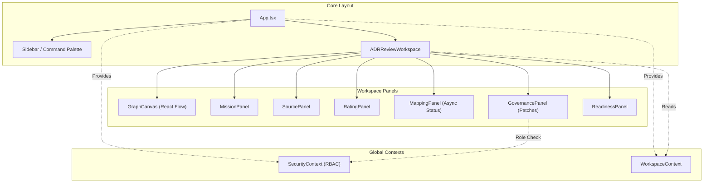

# 🗺️ PROJECT MAP — epios
> Автоматически сгенерировано: `2026-05-14 13:23:57`
> Скрипт: `node dev_studio/refresh.js`

## 📊 Telemetry / Context Health
| Metric | Value | Note |
|---|---|---|
| **Total Files** | `118` | Только JS/TS/TSX исходники |
| **Total Lines** | `11787` | Суммарно по проекту |
| **Project Weight** | `~94 973 tokens` | Оценка (4 символа/токен) |
| **Context Pressure** | `74.2%` | Нагрузка на окно 128k (Full Scan) |
| **Map Efficiency** | `~87%` | Экономия контекста через карту |

---

## Высокоуровневая архитектура
> Связи между основными пакетами и приложениями

```mermaid
flowchart LR

subgraph 0["apps"]
subgraph 1["demo-shell"]
subgraph 2["dist"]
subgraph 3["assets"]
4["index-CTiC8DDP.js"]
end
end
subgraph 7["src"]
8["App.tsx"]
subgraph F["components"]
G["ADRReviewWorkspace.tsx"]
W["GovernancePanel.tsx"]
1B["ReadinessPanel.tsx"]
1C["CommandPalette.tsx"]
1K["Sidebar.tsx"]
1R["Modal.tsx"]
1S["SidebarItem.tsx"]
1T["WorkspaceRoom.tsx"]
1U["GraphCanvas.tsx"]
1W["CustomNode.tsx"]
1X["MissionPanel.tsx"]
1Y["MappingPanel.tsx"]
1Z["SourcePanel.tsx"]
20["RatingPanel.tsx"]
end
subgraph T["hooks"]
U["useApi.ts"]
end
V["api-config.ts"]
subgraph X["context"]
Y["SecurityContext.tsx"]
1D["WorkspaceContext.tsx"]
end
21["i18n.ts"]
2E["main.tsx"]
2F["index.css"]
end
end
end
subgraph 5["@emotion"]
6["is-prop-valid"]
end
subgraph 9["node_modules"]
subgraph A[".pnpm"]
subgraph B["react@18.3.1"]
subgraph C["node_modules"]
subgraph D["react"]
E["index.js"]
end
end
end
subgraph H["framer-motion@12.38.0_react-dom@18.3.1_react@18.3.1__react@18.3.1"]
subgraph I["node_modules"]
subgraph J["framer-motion"]
subgraph K["dist"]
subgraph L["cjs"]
M["index.js"]
end
end
end
end
end
subgraph N["lucide-react@1.14.0_react@18.3.1"]
subgraph O["node_modules"]
subgraph P["lucide-react"]
subgraph Q["dist"]
subgraph R["cjs"]
S["lucide-react.js"]
end
end
end
end
end
subgraph 1E["reactflow@11.11.4_@types+react@18.3.28_react-dom@18.3.1_react@18.3.1__react@18.3.1"]
subgraph 1F["node_modules"]
subgraph 1G["reactflow"]
subgraph 1H["dist"]
subgraph 1I["esm"]
1J["index.mjs"]
end
1V["style.css"]
end
end
end
end
subgraph 1L["react-i18next@17.0.7_i18next@26.1.0_typescript@5.9.3__react-dom@18.3.1_react@18.3.1__react@18.3.1_typescript@5.9.3"]
subgraph 1M["node_modules"]
subgraph 1N["react-i18next"]
subgraph 1O["dist"]
subgraph 1P["es"]
1Q["index.js"]
end
end
end
end
end
subgraph 22["i18next@26.1.0_typescript@5.9.3"]
subgraph 23["node_modules"]
subgraph 24["i18next"]
subgraph 25["dist"]
subgraph 26["esm"]
27["i18next.js"]
end
end
end
end
end
subgraph 28["i18next-browser-languagedetector@8.2.1"]
subgraph 29["node_modules"]
subgraph 2A["i18next-browser-languagedetector"]
subgraph 2B["dist"]
subgraph 2C["esm"]
2D["i18nextBrowserLanguageDetector.js"]
end
end
end
end
end
subgraph 2G["react-dom@18.3.1_react@18.3.1"]
subgraph 2H["node_modules"]
subgraph 2I["react-dom"]
2J["client.js"]
end
end
end
subgraph 2S["@fastify+cors@8.5.0"]
subgraph 2T["node_modules"]
subgraph 2U["@fastify"]
subgraph 2V["cors"]
2W["index.js"]
end
end
end
end
subgraph 2X["dotenv@16.6.1"]
subgraph 2Y["node_modules"]
subgraph 2Z["dotenv"]
subgraph 30["lib"]
31["main.js"]
end
end
end
end
subgraph 32["dotenv-expand@11.0.7"]
subgraph 33["node_modules"]
subgraph 34["dotenv-expand"]
subgraph 35["lib"]
36["main.js"]
end
end
end
end
subgraph 37["drizzle-orm@0.45.2_postgres@3.4.9"]
subgraph 38["node_modules"]
subgraph 39["drizzle-orm"]
subgraph 3A["postgres-js"]
3B["index.js"]
end
5G["index.js"]
subgraph 5I["pg-core"]
5J["index.js"]
end
end
end
end
subgraph 3C["fastify@4.29.1"]
subgraph 3D["node_modules"]
subgraph 3E["fastify"]
3F["fastify.js"]
end
end
end
subgraph 3G["postgres@3.4.9"]
subgraph 3H["node_modules"]
subgraph 3I["postgres"]
subgraph 3J["src"]
3K["index.js"]
end
end
end
end
subgraph 5X["vitest@1.6.1_@types+node@25.7.0"]
subgraph 5Y["node_modules"]
subgraph 5Z["vitest"]
subgraph 60["dist"]
61["index.js"]
65["config.cjs"]
end
end
end
end
subgraph 8B["drizzle-kit@0.31.10"]
subgraph 8C["node_modules"]
subgraph 8D["drizzle-kit"]
8E["index.mjs"]
end
end
end
end
end
subgraph Z["packages"]
subgraph 10["domain"]
subgraph 11["src"]
12["index.ts"]
13["adr.ts"]
14["governance.ts"]
15["node.ts"]
16["mapping.ts"]
17["rating.ts"]
18["security.ts"]
19["source.ts"]
1A["workspace.ts"]
end
subgraph 6A["coverage"]
6B["block-navigation.js"]
6C["prettify.js"]
6D["sorter.js"]
end
subgraph 6E["test"]
6F["domain-smoke.test.ts"]
6G["node-invariants.test.ts"]
6H["source-rating.test.ts"]
6I["workspace.test.ts"]
end
6J["vitest.config.ts"]
end
subgraph 2K["api"]
subgraph 2L["coverage"]
2M["block-navigation.js"]
2N["prettify.js"]
2O["sorter.js"]
end
subgraph 2P["src"]
2Q["bin.ts"]
2R["server.ts"]
3L["mock-data.ts"]
subgraph 3M["routes"]
3N["adr.routes.ts"]
4Y["governance.routes.ts"]
4Z["mapping.routes.ts"]
52["mcp.routes.ts"]
53["rating.routes.ts"]
54["security.routes.ts"]
55["source.routes.ts"]
56["workspace.routes.ts"]
end
subgraph 50["dto"]
51["index.ts"]
end
5U["index.ts"]
end
subgraph 5V["test"]
5W["adr.test.ts"]
62["api.test.ts"]
end
63["vitest.config.ts"]
end
subgraph 3O["application"]
subgraph 3P["src"]
3Q["index.ts"]
3R["mapping-processor.ts"]
subgraph 43["use-cases"]
44["add-edge.ts"]
4B["add-node.ts"]
4C["add-source.ts"]
4D["adr-use-cases.ts"]
4E["apply-patch.ts"]
4F["apply-retention.ts"]
4G["assess-readiness.ts"]
4H["cast-vote.ts"]
4I["create-workspace.ts"]
4J["get-mapping-run.ts"]
4K["get-node-ratings.ts"]
4L["get-readiness.ts"]
4M["get-trace.ts"]
4N["get-workspace-graph.ts"]
4O["list-mapping-runs.ts"]
4P["list-patches.ts"]
4Q["list-sources.ts"]
4R["list-workspaces.ts"]
4S["patch-node.ts"]
4T["propose-patch.ts"]
4U["rate-node.ts"]
4V["redact-node.ts"]
4W["start-mapping-run.ts"]
4X["submit-claim.ts"]
end
end
subgraph 66["test"]
67["create-workspace.test.ts"]
68["use-cases.test.ts"]
end
69["vitest.config.ts"]
end
subgraph 3S["ports"]
subgraph 3T["src"]
3U["index.ts"]
3V["adr.repository.port.ts"]
3W["domain.repository.port.ts"]
3X["governance.port.ts"]
3Y["graph.repository.port.ts"]
3Z["mapping.repository.port.ts"]
40["mcp.port.ts"]
41["outbox.repository.port.ts"]
42["security.port.ts"]
end
end
subgraph 46["observability"]
subgraph 47["src"]
48["index.ts"]
49["audit.ts"]
4A["tracer.ts"]
end
end
subgraph 57["infrastructure-mcp"]
subgraph 58["src"]
59["index.ts"]
5A["mcp-app.registry.ts"]
5B["mcp-bridge.ts"]
end
subgraph 6K["dist"]
subgraph 6L["domain"]
subgraph 6M["src"]
6N["adr.d.ts"]
6O["adr.js"]
6P["governance.d.ts"]
6Q["node.js"]
6R["governance.js"]
6S["index.d.ts"]
6T["mapping.js"]
6U["rating.js"]
6V["security.js"]
6W["source.js"]
6X["workspace.js"]
6Y["index.js"]
6Z["mapping.d.ts"]
70["mission.d.ts"]
71["mission.js"]
72["node.d.ts"]
73["rating.d.ts"]
74["security.d.ts"]
75["source.d.ts"]
76["workspace.d.ts"]
end
end
77["index.d.ts"]
78["mcp-app.registry.js"]
79["mcp-bridge.js"]
7A["index.js"]
subgraph 7B["infrastructure-mcp"]
subgraph 7C["src"]
7D["index.d.ts"]
7E["mcp-app.registry.js"]
7F["mcp-bridge.js"]
7G["index.js"]
7H["mcp-app.registry.d.ts"]
7I["mcp-bridge.d.ts"]
end
end
7J["mcp-app.registry.d.ts"]
7M["mcp-bridge.d.ts"]
subgraph 7N["ports"]
subgraph 7O["src"]
7P["domain.repository.port.d.ts"]
7Q["domain.repository.port.js"]
7R["governance.port.d.ts"]
7S["governance.port.js"]
7T["graph.repository.port.d.ts"]
7U["graph.repository.port.js"]
7V["index.d.ts"]
7W["mapping.repository.port.js"]
7X["mcp.port.js"]
7Y["outbox.repository.port.js"]
7Z["security.port.js"]
80["index.js"]
81["mapping.repository.port.d.ts"]
82["mcp.port.d.ts"]
83["outbox.repository.port.d.ts"]
84["security.port.d.ts"]
end
end
end
subgraph 85["test"]
86["smoke.test.ts"]
end
end
subgraph 5C["infrastructure-postgres"]
subgraph 5D["src"]
5E["index.ts"]
5F["graph.repository.ts"]
5H["schema.ts"]
5K["identity.repository.ts"]
5L["rating.repository.ts"]
5M["source.repository.ts"]
5N["workspace.repository.ts"]
8F["seed.ts"]
end
8A["drizzle.config.ts"]
end
subgraph 5O["infrastructure-runtime"]
subgraph 5P["src"]
5Q["index.ts"]
5R["in-memory-governance.repository.ts"]
5S["in-memory-repositories.ts"]
5T["security-mocks.ts"]
end
end
subgraph 87["infrastructure-models"]
subgraph 88["src"]
89["index.ts"]
end
end
subgraph 8G["testing"]
subgraph 8H["src"]
8I["fixtures.ts"]
8J["index.ts"]
end
end
end
45["crypto"]
64["path"]
subgraph 7K["@epos"]
7L["ports"]
end
4-->6
8-->G
8-->1C
8-->1K
8-->1T
8-->1D
8-->E
G-->U
G-->W
G-->1B
G-->M
G-->S
G-->E
U-->V
U-->E
W-->V
W-->Y
W-->M
W-->S
W-->E
Y-->V
Y-->12
Y-->E
12-->13
12-->14
12-->16
12-->15
12-->17
12-->18
12-->19
12-->1A
14-->15
1B-->V
1B-->M
1B-->S
1B-->E
1C-->1D
1C-->M
1C-->S
1C-->E
1D-->12
1D-->E
1D-->1J
1K-->Y
1K-->1D
1K-->U
1K-->1R
1K-->1S
1K-->12
1K-->M
1K-->S
1K-->E
1K-->1Q
1R-->M
1R-->S
1R-->E
1S-->M
1S-->S
1S-->E
1S-->1Q
1T-->V
1T-->Y
1T-->1D
1T-->1U
1T-->1X
1T-->20
1T-->12
1T-->M
1T-->S
1T-->E
1U-->1D
1U-->U
1U-->1W
1U-->S
1U-->E
1U-->1J
1U-->1V
1W-->S
1W-->E
1W-->1J
1X-->W
1X-->1Y
1X-->1Z
1X-->12
1X-->M
1X-->S
1X-->E
1Y-->V
1Y-->12
1Y-->M
1Y-->S
1Y-->E
1Z-->V
1Z-->M
1Z-->S
1Z-->E
20-->V
20-->S
20-->E
21-->27
21-->2D
21-->1Q
2E-->8
2E-->Y
2E-->1D
2E-->21
2E-->2F
2E-->E
2E-->2J
2E-->1V
2Q-->2R
2R-->3L
2R-->3N
2R-->4Y
2R-->4Z
2R-->52
2R-->53
2R-->54
2R-->55
2R-->56
2R-->3Q
2R-->59
2R-->5E
2R-->5Q
2R-->3U
2R-->2W
2R-->31
2R-->36
2R-->3B
2R-->3F
2R-->3K
3L-->12
3N-->3Q
3N-->3F
3Q-->3R
3Q-->44
3Q-->4B
3Q-->4C
3Q-->4D
3Q-->4E
3Q-->4F
3Q-->4G
3Q-->4H
3Q-->4I
3Q-->4J
3Q-->4K
3Q-->4L
3Q-->4M
3Q-->4N
3Q-->4O
3Q-->4P
3Q-->4Q
3Q-->4R
3Q-->4S
3Q-->4T
3Q-->4U
3Q-->4V
3Q-->4W
3Q-->4X
3R-->3U
3U-->3V
3U-->3W
3U-->3X
3U-->3Y
3U-->3Z
3U-->40
3U-->41
3U-->42
3V-->12
3W-->12
3X-->12
3Y-->12
3Z-->12
42-->12
44-->12
44-->48
44-->3U
44-->45
48-->49
48-->4A
4B-->12
4B-->48
4B-->3U
4B-->45
4C-->12
4C-->3U
4C-->45
4D-->12
4D-->3U
4E-->12
4E-->3U
4E-->45
4F-->12
4F-->3U
4G-->12
4G-->3U
4G-->45
4H-->4E
4H-->12
4H-->48
4H-->3U
4H-->45
4I-->12
4I-->48
4I-->3U
4I-->45
4J-->12
4J-->3U
4K-->12
4K-->3U
4L-->12
4L-->3U
4M-->12
4M-->3U
4N-->12
4N-->3U
4O-->12
4O-->3U
4P-->12
4P-->3U
4Q-->12
4Q-->3U
4R-->12
4R-->3U
4S-->12
4S-->3U
4T-->12
4T-->3U
4T-->45
4U-->12
4U-->3U
4U-->45
4V-->12
4V-->3U
4W-->12
4W-->3U
4W-->45
4X-->12
4X-->3U
4X-->45
4Y-->3Q
4Y-->3U
4Y-->3F
4Z-->51
4Z-->3Q
4Z-->3F
51-->12
52-->3U
52-->3F
53-->3Q
53-->12
53-->3F
54-->3Q
54-->12
54-->3U
54-->3F
55-->3Q
55-->12
55-->3F
56-->51
56-->3Q
56-->3F
59-->5A
59-->5B
5A-->3U
5B-->3U
5E-->5F
5E-->5K
5E-->5L
5E-->5H
5E-->5M
5E-->5N
5F-->5H
5F-->12
5F-->3U
5F-->5G
5F-->3B
5H-->5J
5K-->5H
5K-->12
5K-->3U
5K-->5G
5K-->3B
5L-->5H
5L-->12
5L-->3U
5L-->5G
5L-->3B
5M-->5H
5M-->12
5M-->3U
5M-->5G
5M-->3B
5N-->5H
5N-->12
5N-->3U
5N-->5G
5N-->3B
5Q-->5R
5Q-->5S
5Q-->5T
5R-->12
5R-->3U
5S-->12
5S-->3U
5T-->12
5T-->3U
5T-->45
5U-->2R
5W-->2R
5W-->3F
5W-->61
62-->2R
62-->3U
62-->3F
62-->61
63-->64
63-->65
67-->4I
67-->3U
67-->61
68-->44
68-->4B
68-->4H
68-->4I
68-->4N
68-->4R
68-->4S
68-->4X
68-->12
68-->3U
68-->61
69-->64
69-->65
6F-->12
6F-->61
6G-->12
6G-->61
6H-->12
6H-->61
6I-->1A
6I-->61
6J-->65
6P-->6Q
6S-->6O
6S-->6R
6S-->6T
6S-->6Q
6S-->6U
6S-->6V
6S-->6W
6S-->6X
6Y-->6O
6Y-->6R
6Y-->6T
6Y-->6Q
6Y-->6U
6Y-->6V
6Y-->6W
6Y-->6X
77-->78
77-->79
7A-->78
7A-->79
7D-->7E
7D-->7F
7G-->7E
7G-->7F
7H-->3U
7I-->3U
7J-->7L
7M-->7L
7P-->12
7R-->12
7T-->12
7V-->7Q
7V-->7S
7V-->7U
7V-->7W
7V-->7X
7V-->7Y
7V-->7Z
80-->7Q
80-->7S
80-->7U
80-->7W
80-->7X
80-->7Y
80-->7Z
81-->12
84-->12
86-->61
8A-->31
8A-->36
8A-->8E
8F-->5H
8F-->31
8F-->36
8F-->3B
8F-->3K
8I-->12
8J-->8I
```

## Детальная карта компонентов
> Полный граф зависимостей всех файлов проекта

```mermaid
flowchart LR

subgraph 0["apps"]
subgraph 1["demo-shell"]
subgraph 2["dist"]
subgraph 3["assets"]
4["index-CTiC8DDP.js"]
end
end
subgraph 7["src"]
8["App.tsx"]
subgraph F["components"]
G["ADRReviewWorkspace.tsx"]
W["GovernancePanel.tsx"]
1B["ReadinessPanel.tsx"]
1C["CommandPalette.tsx"]
1K["Sidebar.tsx"]
1R["Modal.tsx"]
1S["SidebarItem.tsx"]
1T["WorkspaceRoom.tsx"]
1U["GraphCanvas.tsx"]
1W["CustomNode.tsx"]
1X["MissionPanel.tsx"]
1Y["MappingPanel.tsx"]
1Z["SourcePanel.tsx"]
20["RatingPanel.tsx"]
end
subgraph T["hooks"]
U["useApi.ts"]
end
V["api-config.ts"]
subgraph X["context"]
Y["SecurityContext.tsx"]
1D["WorkspaceContext.tsx"]
end
21["i18n.ts"]
2E["main.tsx"]
2F["index.css"]
end
end
end
subgraph 5["@emotion"]
6["is-prop-valid"]
end
subgraph 9["node_modules"]
subgraph A[".pnpm"]
subgraph B["react@18.3.1"]
subgraph C["node_modules"]
subgraph D["react"]
E["index.js"]
end
end
end
subgraph H["framer-motion@12.38.0_react-dom@18.3.1_react@18.3.1__react@18.3.1"]
subgraph I["node_modules"]
subgraph J["framer-motion"]
subgraph K["dist"]
subgraph L["cjs"]
M["index.js"]
end
end
end
end
end
subgraph N["lucide-react@1.14.0_react@18.3.1"]
subgraph O["node_modules"]
subgraph P["lucide-react"]
subgraph Q["dist"]
subgraph R["cjs"]
S["lucide-react.js"]
end
end
end
end
end
subgraph 1E["reactflow@11.11.4_@types+react@18.3.28_react-dom@18.3.1_react@18.3.1__react@18.3.1"]
subgraph 1F["node_modules"]
subgraph 1G["reactflow"]
subgraph 1H["dist"]
subgraph 1I["esm"]
1J["index.mjs"]
end
1V["style.css"]
end
end
end
end
subgraph 1L["react-i18next@17.0.7_i18next@26.1.0_typescript@5.9.3__react-dom@18.3.1_react@18.3.1__react@18.3.1_typescript@5.9.3"]
subgraph 1M["node_modules"]
subgraph 1N["react-i18next"]
subgraph 1O["dist"]
subgraph 1P["es"]
1Q["index.js"]
end
end
end
end
end
subgraph 22["i18next@26.1.0_typescript@5.9.3"]
subgraph 23["node_modules"]
subgraph 24["i18next"]
subgraph 25["dist"]
subgraph 26["esm"]
27["i18next.js"]
end
end
end
end
end
subgraph 28["i18next-browser-languagedetector@8.2.1"]
subgraph 29["node_modules"]
subgraph 2A["i18next-browser-languagedetector"]
subgraph 2B["dist"]
subgraph 2C["esm"]
2D["i18nextBrowserLanguageDetector.js"]
end
end
end
end
end
subgraph 2G["react-dom@18.3.1_react@18.3.1"]
subgraph 2H["node_modules"]
subgraph 2I["react-dom"]
2J["client.js"]
end
end
end
subgraph 2S["@fastify+cors@8.5.0"]
subgraph 2T["node_modules"]
subgraph 2U["@fastify"]
subgraph 2V["cors"]
2W["index.js"]
end
end
end
end
subgraph 2X["dotenv@16.6.1"]
subgraph 2Y["node_modules"]
subgraph 2Z["dotenv"]
subgraph 30["lib"]
31["main.js"]
end
end
end
end
subgraph 32["dotenv-expand@11.0.7"]
subgraph 33["node_modules"]
subgraph 34["dotenv-expand"]
subgraph 35["lib"]
36["main.js"]
end
end
end
end
subgraph 37["drizzle-orm@0.45.2_postgres@3.4.9"]
subgraph 38["node_modules"]
subgraph 39["drizzle-orm"]
subgraph 3A["postgres-js"]
3B["index.js"]
end
5G["index.js"]
subgraph 5I["pg-core"]
5J["index.js"]
end
end
end
end
subgraph 3C["fastify@4.29.1"]
subgraph 3D["node_modules"]
subgraph 3E["fastify"]
3F["fastify.js"]
end
end
end
subgraph 3G["postgres@3.4.9"]
subgraph 3H["node_modules"]
subgraph 3I["postgres"]
subgraph 3J["src"]
3K["index.js"]
end
end
end
end
subgraph 5X["vitest@1.6.1_@types+node@25.7.0"]
subgraph 5Y["node_modules"]
subgraph 5Z["vitest"]
subgraph 60["dist"]
61["index.js"]
65["config.cjs"]
end
end
end
end
subgraph 8B["drizzle-kit@0.31.10"]
subgraph 8C["node_modules"]
subgraph 8D["drizzle-kit"]
8E["index.mjs"]
end
end
end
end
end
subgraph Z["packages"]
subgraph 10["domain"]
subgraph 11["src"]
12["index.ts"]
13["adr.ts"]
14["governance.ts"]
15["node.ts"]
16["mapping.ts"]
17["rating.ts"]
18["security.ts"]
19["source.ts"]
1A["workspace.ts"]
end
subgraph 6A["coverage"]
6B["block-navigation.js"]
6C["prettify.js"]
6D["sorter.js"]
end
subgraph 6E["test"]
6F["domain-smoke.test.ts"]
6G["node-invariants.test.ts"]
6H["source-rating.test.ts"]
6I["workspace.test.ts"]
end
6J["vitest.config.ts"]
end
subgraph 2K["api"]
subgraph 2L["coverage"]
2M["block-navigation.js"]
2N["prettify.js"]
2O["sorter.js"]
end
subgraph 2P["src"]
2Q["bin.ts"]
2R["server.ts"]
3L["mock-data.ts"]
subgraph 3M["routes"]
3N["adr.routes.ts"]
4Y["governance.routes.ts"]
4Z["mapping.routes.ts"]
52["mcp.routes.ts"]
53["rating.routes.ts"]
54["security.routes.ts"]
55["source.routes.ts"]
56["workspace.routes.ts"]
end
subgraph 50["dto"]
51["index.ts"]
end
5U["index.ts"]
end
subgraph 5V["test"]
5W["adr.test.ts"]
62["api.test.ts"]
end
63["vitest.config.ts"]
end
subgraph 3O["application"]
subgraph 3P["src"]
3Q["index.ts"]
3R["mapping-processor.ts"]
subgraph 43["use-cases"]
44["add-edge.ts"]
4B["add-node.ts"]
4C["add-source.ts"]
4D["adr-use-cases.ts"]
4E["apply-patch.ts"]
4F["apply-retention.ts"]
4G["assess-readiness.ts"]
4H["cast-vote.ts"]
4I["create-workspace.ts"]
4J["get-mapping-run.ts"]
4K["get-node-ratings.ts"]
4L["get-readiness.ts"]
4M["get-trace.ts"]
4N["get-workspace-graph.ts"]
4O["list-mapping-runs.ts"]
4P["list-patches.ts"]
4Q["list-sources.ts"]
4R["list-workspaces.ts"]
4S["patch-node.ts"]
4T["propose-patch.ts"]
4U["rate-node.ts"]
4V["redact-node.ts"]
4W["start-mapping-run.ts"]
4X["submit-claim.ts"]
end
end
subgraph 66["test"]
67["create-workspace.test.ts"]
68["use-cases.test.ts"]
end
69["vitest.config.ts"]
end
subgraph 3S["ports"]
subgraph 3T["src"]
3U["index.ts"]
3V["adr.repository.port.ts"]
3W["domain.repository.port.ts"]
3X["governance.port.ts"]
3Y["graph.repository.port.ts"]
3Z["mapping.repository.port.ts"]
40["mcp.port.ts"]
41["outbox.repository.port.ts"]
42["security.port.ts"]
end
end
subgraph 46["observability"]
subgraph 47["src"]
48["index.ts"]
49["audit.ts"]
4A["tracer.ts"]
end
end
subgraph 57["infrastructure-mcp"]
subgraph 58["src"]
59["index.ts"]
5A["mcp-app.registry.ts"]
5B["mcp-bridge.ts"]
end
subgraph 6K["dist"]
subgraph 6L["domain"]
subgraph 6M["src"]
6N["adr.d.ts"]
6O["adr.js"]
6P["governance.d.ts"]
6Q["node.js"]
6R["governance.js"]
6S["index.d.ts"]
6T["mapping.js"]
6U["rating.js"]
6V["security.js"]
6W["source.js"]
6X["workspace.js"]
6Y["index.js"]
6Z["mapping.d.ts"]
70["mission.d.ts"]
71["mission.js"]
72["node.d.ts"]
73["rating.d.ts"]
74["security.d.ts"]
75["source.d.ts"]
76["workspace.d.ts"]
end
end
77["index.d.ts"]
78["mcp-app.registry.js"]
79["mcp-bridge.js"]
7A["index.js"]
subgraph 7B["infrastructure-mcp"]
subgraph 7C["src"]
7D["index.d.ts"]
7E["mcp-app.registry.js"]
7F["mcp-bridge.js"]
7G["index.js"]
7H["mcp-app.registry.d.ts"]
7I["mcp-bridge.d.ts"]
end
end
7J["mcp-app.registry.d.ts"]
7M["mcp-bridge.d.ts"]
subgraph 7N["ports"]
subgraph 7O["src"]
7P["domain.repository.port.d.ts"]
7Q["domain.repository.port.js"]
7R["governance.port.d.ts"]
7S["governance.port.js"]
7T["graph.repository.port.d.ts"]
7U["graph.repository.port.js"]
7V["index.d.ts"]
7W["mapping.repository.port.js"]
7X["mcp.port.js"]
7Y["outbox.repository.port.js"]
7Z["security.port.js"]
80["index.js"]
81["mapping.repository.port.d.ts"]
82["mcp.port.d.ts"]
83["outbox.repository.port.d.ts"]
84["security.port.d.ts"]
end
end
end
subgraph 85["test"]
86["smoke.test.ts"]
end
end
subgraph 5C["infrastructure-postgres"]
subgraph 5D["src"]
5E["index.ts"]
5F["graph.repository.ts"]
5H["schema.ts"]
5K["identity.repository.ts"]
5L["rating.repository.ts"]
5M["source.repository.ts"]
5N["workspace.repository.ts"]
8F["seed.ts"]
end
8A["drizzle.config.ts"]
end
subgraph 5O["infrastructure-runtime"]
subgraph 5P["src"]
5Q["index.ts"]
5R["in-memory-governance.repository.ts"]
5S["in-memory-repositories.ts"]
5T["security-mocks.ts"]
end
end
subgraph 87["infrastructure-models"]
subgraph 88["src"]
89["index.ts"]
end
end
subgraph 8G["testing"]
subgraph 8H["src"]
8I["fixtures.ts"]
8J["index.ts"]
end
end
end
45["crypto"]
64["path"]
subgraph 7K["@epos"]
7L["ports"]
end
4-->6
8-->G
8-->1C
8-->1K
8-->1T
8-->1D
8-->E
G-->U
G-->W
G-->1B
G-->M
G-->S
G-->E
U-->V
U-->E
W-->V
W-->Y
W-->M
W-->S
W-->E
Y-->V
Y-->12
Y-->E
12-->13
12-->14
12-->16
12-->15
12-->17
12-->18
12-->19
12-->1A
14-->15
1B-->V
1B-->M
1B-->S
1B-->E
1C-->1D
1C-->M
1C-->S
1C-->E
1D-->12
1D-->E
1D-->1J
1K-->Y
1K-->1D
1K-->U
1K-->1R
1K-->1S
1K-->12
1K-->M
1K-->S
1K-->E
1K-->1Q
1R-->M
1R-->S
1R-->E
1S-->M
1S-->S
1S-->E
1S-->1Q
1T-->V
1T-->Y
1T-->1D
1T-->1U
1T-->1X
1T-->20
1T-->12
1T-->M
1T-->S
1T-->E
1U-->1D
1U-->U
1U-->1W
1U-->S
1U-->E
1U-->1J
1U-->1V
1W-->S
1W-->E
1W-->1J
1X-->W
1X-->1Y
1X-->1Z
1X-->12
1X-->M
1X-->S
1X-->E
1Y-->V
1Y-->12
1Y-->M
1Y-->S
1Y-->E
1Z-->V
1Z-->M
1Z-->S
1Z-->E
20-->V
20-->S
20-->E
21-->27
21-->2D
21-->1Q
2E-->8
2E-->Y
2E-->1D
2E-->21
2E-->2F
2E-->E
2E-->2J
2E-->1V
2Q-->2R
2R-->3L
2R-->3N
2R-->4Y
2R-->4Z
2R-->52
2R-->53
2R-->54
2R-->55
2R-->56
2R-->3Q
2R-->59
2R-->5E
2R-->5Q
2R-->3U
2R-->2W
2R-->31
2R-->36
2R-->3B
2R-->3F
2R-->3K
3L-->12
3N-->3Q
3N-->3F
3Q-->3R
3Q-->44
3Q-->4B
3Q-->4C
3Q-->4D
3Q-->4E
3Q-->4F
3Q-->4G
3Q-->4H
3Q-->4I
3Q-->4J
3Q-->4K
3Q-->4L
3Q-->4M
3Q-->4N
3Q-->4O
3Q-->4P
3Q-->4Q
3Q-->4R
3Q-->4S
3Q-->4T
3Q-->4U
3Q-->4V
3Q-->4W
3Q-->4X
3R-->3U
3U-->3V
3U-->3W
3U-->3X
3U-->3Y
3U-->3Z
3U-->40
3U-->41
3U-->42
3V-->12
3W-->12
3X-->12
3Y-->12
3Z-->12
42-->12
44-->12
44-->48
44-->3U
44-->45
48-->49
48-->4A
4B-->12
4B-->48
4B-->3U
4B-->45
4C-->12
4C-->3U
4C-->45
4D-->12
4D-->3U
4E-->12
4E-->3U
4E-->45
4F-->12
4F-->3U
4G-->12
4G-->3U
4G-->45
4H-->4E
4H-->12
4H-->48
4H-->3U
4H-->45
4I-->12
4I-->48
4I-->3U
4I-->45
4J-->12
4J-->3U
4K-->12
4K-->3U
4L-->12
4L-->3U
4M-->12
4M-->3U
4N-->12
4N-->3U
4O-->12
4O-->3U
4P-->12
4P-->3U
4Q-->12
4Q-->3U
4R-->12
4R-->3U
4S-->12
4S-->3U
4T-->12
4T-->3U
4T-->45
4U-->12
4U-->3U
4U-->45
4V-->12
4V-->3U
4W-->12
4W-->3U
4W-->45
4X-->12
4X-->3U
4X-->45
4Y-->3Q
4Y-->3U
4Y-->3F
4Z-->51
4Z-->3Q
4Z-->3F
51-->12
52-->3U
52-->3F
53-->3Q
53-->12
53-->3F
54-->3Q
54-->12
54-->3U
54-->3F
55-->3Q
55-->12
55-->3F
56-->51
56-->3Q
56-->3F
59-->5A
59-->5B
5A-->3U
5B-->3U
5E-->5F
5E-->5K
5E-->5L
5E-->5H
5E-->5M
5E-->5N
5F-->5H
5F-->12
5F-->3U
5F-->5G
5F-->3B
5H-->5J
5K-->5H
5K-->12
5K-->3U
5K-->5G
5K-->3B
5L-->5H
5L-->12
5L-->3U
5L-->5G
5L-->3B
5M-->5H
5M-->12
5M-->3U
5M-->5G
5M-->3B
5N-->5H
5N-->12
5N-->3U
5N-->5G
5N-->3B
5Q-->5R
5Q-->5S
5Q-->5T
5R-->12
5R-->3U
5S-->12
5S-->3U
5T-->12
5T-->3U
5T-->45
5U-->2R
5W-->2R
5W-->3F
5W-->61
62-->2R
62-->3U
62-->3F
62-->61
63-->64
63-->65
67-->4I
67-->3U
67-->61
68-->44
68-->4B
68-->4H
68-->4I
68-->4N
68-->4R
68-->4S
68-->4X
68-->12
68-->3U
68-->61
69-->64
69-->65
6F-->12
6F-->61
6G-->12
6G-->61
6H-->12
6H-->61
6I-->1A
6I-->61
6J-->65
6P-->6Q
6S-->6O
6S-->6R
6S-->6T
6S-->6Q
6S-->6U
6S-->6V
6S-->6W
6S-->6X
6Y-->6O
6Y-->6R
6Y-->6T
6Y-->6Q
6Y-->6U
6Y-->6V
6Y-->6W
6Y-->6X
77-->78
77-->79
7A-->78
7A-->79
7D-->7E
7D-->7F
7G-->7E
7G-->7F
7H-->3U
7I-->3U
7J-->7L
7M-->7L
7P-->12
7R-->12
7T-->12
7V-->7Q
7V-->7S
7V-->7U
7V-->7W
7V-->7X
7V-->7Y
7V-->7Z
80-->7Q
80-->7S
80-->7U
80-->7W
80-->7X
80-->7Y
80-->7Z
81-->12
84-->12
86-->61
8A-->31
8A-->36
8A-->8E
8F-->5H
8F-->31
8F-->36
8F-->3B
8F-->3K
8I-->12
8J-->8I
```

## 🎨 Архитектура UI Интерфейсов (demo-shell)
> Обобщенная концептуальная структура компонентов пользовательского интерфейса



> Подробная документация и Roadmap по развитию интерфейсов находится в [docs/05_ui_roadmap/](docs/05_ui_roadmap/00_ROADMAP_INDEX.md)

## Компонент: `apps`

| Файл | Строк | Размер | Описание |
|---|---|---|---|
| `demo-shell/src/api-config.ts` | 7 | 0.3 KB | Централизованная конфигурация API URL. |
| `demo-shell/src/App.tsx` | 59 | 1.5 KB | — |
| `demo-shell/src/components/ADRReviewWorkspace.tsx` | 738 | 22.9 KB | — |
| `demo-shell/src/components/CommandPalette.tsx` | 341 | 9.1 KB | — |
| `demo-shell/src/components/CustomNode.tsx` | 169 | 4.4 KB | — |
| `demo-shell/src/components/GovernancePanel.tsx` | 498 | 14.7 KB | — |
| `demo-shell/src/components/GraphCanvas.tsx` | 579 | 16.2 KB | — |
| `demo-shell/src/components/MappingPanel.tsx` | 270 | 7.8 KB | — |
| `demo-shell/src/components/MissionPanel.tsx` | 303 | 8.7 KB | — |
| `demo-shell/src/components/Modal.tsx` | 100 | 2.7 KB | — |
| `demo-shell/src/components/RatingPanel.tsx` | 234 | 6.2 KB | — |
| `demo-shell/src/components/ReadinessPanel.tsx` | 403 | 11.7 KB | — |
| `demo-shell/src/components/Sidebar.tsx` | 614 | 19.2 KB | — |
| `demo-shell/src/components/SidebarItem.tsx` | 251 | 6.8 KB | — |
| `demo-shell/src/components/SourcePanel.tsx` | 232 | 6.9 KB | — |
| `demo-shell/src/components/WorkspaceRoom.tsx` | 665 | 21.5 KB | — |
| `demo-shell/src/context/SecurityContext.tsx` | 68 | 1.6 KB | — |
| `demo-shell/src/context/WorkspaceContext.tsx` | 130 | 3.4 KB | — |
| `demo-shell/src/hooks/useApi.ts` | 43 | 1.1 KB | — |
| `demo-shell/src/i18n.ts` | 73 | 2.3 KB | — |
| `demo-shell/src/main.tsx` | 20 | 0.5 KB | — |

### `demo-shell/src/api-config.ts`
- **Экспорт**: `API_BASE_URL`

### `demo-shell/src/components/GovernancePanel.tsx`
- **Экспорт**: `GovernancePanel`
- **Зависимости**:
  - `../api-config` → API_BASE_URL
  - `../context/SecurityContext` → useSecurity

### `demo-shell/src/components/MappingPanel.tsx`
- **Экспорт**: `MappingPanel`
- **Зависимости**:
  - `../api-config` → API_BASE_URL
  - `@epios/domain` → MappingRun

### `demo-shell/src/components/MissionPanel.tsx`
- **Экспорт**: `MissionPanel`
- **Зависимости**:
  - `./GovernancePanel` → GovernancePanel
  - `./SourcePanel` → SourcePanel
  - `./MappingPanel` → MappingPanel
  - `@epios/domain` → Workspace

### `demo-shell/src/components/Modal.tsx`
- **Экспорт**: `Modal`
- **Зависимости**:

### `demo-shell/src/components/RatingPanel.tsx`
- **Экспорт**: `RatingPanel`
- **Зависимости**:
  - `../api-config` → API_BASE_URL

### `demo-shell/src/components/ReadinessPanel.tsx`
- **Экспорт**: `ReadinessPanel`
- **Зависимости**:
  - `../api-config` → API_BASE_URL

### `demo-shell/src/components/SidebarItem.tsx`
- **Экспорт**: `SidebarItemProps`, `SidebarItem`
- **Зависимости**:

### `demo-shell/src/components/SourcePanel.tsx`
- **Экспорт**: `SourcePanel`
- **Зависимости**:
  - `../api-config` → API_BASE_URL

### `demo-shell/src/context/SecurityContext.tsx`
- **Экспорт**: `SecurityProvider`, `useSecurity`
- **Зависимости**:
  - `@epios/domain` → User
  - `../api-config` → API_BASE_URL

### `demo-shell/src/context/WorkspaceContext.tsx`
- **Экспорт**: `WorkspaceProvider`, `useWorkspace`
- **Зависимости**:
  - `@epios/domain` → Workspace

### `demo-shell/src/hooks/useApi.ts`
- **Экспорт**: `useApi`
- **Зависимости**:
  - `../api-config` → API_BASE_URL

## Компонент: `packages`

| Файл | Строк | Размер | Описание |
|---|---|---|---|
| `api/coverage/block-navigation.js` | 88 | 2.6 KB | — |
| `api/coverage/prettify.js` | 3 | 17.2 KB | — |
| `api/coverage/sorter.js` | 211 | 6.6 KB | — |
| `api/src/bin.ts` | 13 | 0.3 KB | — |
| `api/src/dto/index.ts` | 57 | 1.1 KB | — |
| `api/src/index.ts` | 3 | 0.0 KB | — |
| `api/src/mock-data.ts` | 551 | 17.0 KB | Mock data factory for demo/development mode. |
| `api/src/routes/adr.routes.ts` | 26 | 0.6 KB | — |
| `api/src/routes/governance.routes.ts` | 126 | 3.7 KB | — |
| `api/src/routes/mapping.routes.ts` | 95 | 2.8 KB | — |
| `api/src/routes/mcp.routes.ts` | 38 | 1.0 KB | — |
| `api/src/routes/rating.routes.ts` | 30 | 0.9 KB | — |
| `api/src/routes/security.routes.ts` | 66 | 2.0 KB | — |
| `api/src/routes/source.routes.ts` | 34 | 0.9 KB | — |
| `api/src/routes/workspace.routes.ts` | 29 | 0.7 KB | — |
| `api/src/server.ts` | 261 | 8.7 KB | — |
| `api/test/adr.test.ts` | 48 | 1.2 KB | — |
| `api/test/api.test.ts` | 222 | 5.9 KB | — |
| `api/vitest.config.ts` | 42 | 1.1 KB | — |
| `application/src/index.ts` | 26 | 1.1 KB | — |
| `application/src/mapping-processor.ts` | 93 | 2.4 KB | — |
| `application/src/use-cases/add-edge.ts` | 47 | 1.3 KB | — |
| `application/src/use-cases/add-node.ts` | 55 | 1.4 KB | — |
| `application/src/use-cases/add-source.ts` | 29 | 0.7 KB | — |
| `application/src/use-cases/adr-use-cases.ts` | 19 | 0.5 KB | — |
| `application/src/use-cases/apply-patch.ts` | 75 | 2.2 KB | — |
| `application/src/use-cases/apply-retention.ts` | 60 | 1.7 KB | — |
| `application/src/use-cases/assess-readiness.ts` | 90 | 2.8 KB | — |
| `application/src/use-cases/cast-vote.ts` | 131 | 4.0 KB | — |
| `application/src/use-cases/create-workspace.ts` | 49 | 1.2 KB | — |
| `application/src/use-cases/get-mapping-run.ts` | 11 | 0.3 KB | — |
| `application/src/use-cases/get-node-ratings.ts` | 11 | 0.3 KB | — |
| `application/src/use-cases/get-readiness.ts` | 11 | 0.4 KB | — |
| `application/src/use-cases/get-trace.ts` | 11 | 0.3 KB | — |
| `application/src/use-cases/get-workspace-graph.ts` | 21 | 0.6 KB | — |
| `application/src/use-cases/list-mapping-runs.ts` | 11 | 0.3 KB | — |
| `application/src/use-cases/list-patches.ts` | 15 | 0.4 KB | — |
| `application/src/use-cases/list-sources.ts` | 11 | 0.3 KB | — |
| `application/src/use-cases/list-workspaces.ts` | 11 | 0.3 KB | — |
| `application/src/use-cases/patch-node.ts` | 37 | 1.1 KB | — |
| `application/src/use-cases/propose-patch.ts` | 55 | 1.5 KB | — |
| `application/src/use-cases/rate-node.ts` | 29 | 0.7 KB | — |
| `application/src/use-cases/redact-node.ts` | 67 | 1.7 KB | — |
| `application/src/use-cases/start-mapping-run.ts` | 43 | 1.0 KB | — |
| `application/src/use-cases/submit-claim.ts` | 49 | 1.2 KB | — |
| `application/test/create-workspace.test.ts` | 63 | 1.6 KB | — |
| `application/test/use-cases.test.ts` | 338 | 10.4 KB | — |
| `application/vitest.config.ts` | 28 | 0.6 KB | — |
| `domain/coverage/block-navigation.js` | 88 | 2.6 KB | — |
| `domain/coverage/prettify.js` | 3 | 17.2 KB | — |
| `domain/coverage/sorter.js` | 211 | 6.6 KB | — |
| `domain/src/adr.ts` | 42 | 0.7 KB | — |
| `domain/src/governance.ts` | 81 | 1.7 KB | A Claim in EPIOS is a node that undergoes a formal governance process. |
| `domain/src/index.ts` | 9 | 0.2 KB | — |
| `domain/src/mapping.ts` | 15 | 0.3 KB | — |
| `domain/src/node.ts` | 52 | 0.9 KB | — |
| `domain/src/rating.ts` | 11 | 0.2 KB | — |
| `domain/src/security.ts` | 40 | 0.8 KB | — |
| `domain/src/source.ts` | 11 | 0.2 KB | — |
| `domain/src/workspace.ts` | 50 | 1.0 KB | — |
| `domain/test/domain-smoke.test.ts` | 51 | 1.3 KB | — |
| `domain/test/node-invariants.test.ts` | 51 | 1.2 KB | — |
| `domain/test/source-rating.test.ts` | 33 | 0.8 KB | — |
| `domain/test/workspace.test.ts` | 51 | 1.3 KB | — |
| `domain/vitest.config.ts` | 21 | 0.4 KB | — |
| `infrastructure-mcp/src/index.ts` | 4 | 0.1 KB | — |
| `infrastructure-mcp/src/mcp-app.registry.ts` | 35 | 0.8 KB | — |
| `infrastructure-mcp/src/mcp-bridge.ts` | 64 | 1.6 KB | — |
| `infrastructure-mcp/test/smoke.test.ts` | 8 | 0.2 KB | — |
| `infrastructure-models/src/index.ts` | 3 | 0.1 KB | — |
| `infrastructure-postgres/drizzle.config.ts` | 17 | 0.4 KB | — |
| `infrastructure-postgres/src/graph.repository.ts` | 175 | 5.0 KB | — |
| `infrastructure-postgres/src/identity.repository.ts` | 68 | 1.7 KB | — |
| `infrastructure-postgres/src/index.ts` | 11 | 0.3 KB | — |
| `infrastructure-postgres/src/rating.repository.ts` | 50 | 1.4 KB | — |
| `infrastructure-postgres/src/schema.ts` | 106 | 3.3 KB | — |
| `infrastructure-postgres/src/seed.ts` | 378 | 13.2 KB | — |
| `infrastructure-postgres/src/source.repository.ts` | 60 | 1.6 KB | — |
| `infrastructure-postgres/src/workspace.repository.ts` | 96 | 3.0 KB | — |
| `infrastructure-runtime/src/in-memory-governance.repository.ts` | 97 | 2.9 KB | — |
| `infrastructure-runtime/src/in-memory-repositories.ts` | 237 | 6.2 KB | — |
| `infrastructure-runtime/src/index.ts` | 7 | 0.3 KB | — |
| `infrastructure-runtime/src/security-mocks.ts` | 82 | 2.2 KB | — |
| `observability/src/audit.ts` | 25 | 0.6 KB | — |
| `observability/src/index.ts` | 3 | 0.1 KB | — |
| `observability/src/tracer.ts` | 24 | 0.5 KB | — |
| `ports/src/adr.repository.port.ts` | 8 | 0.2 KB | — |
| `ports/src/domain.repository.port.ts` | 19 | 0.5 KB | — |
| `ports/src/governance.port.ts` | 32 | 1.2 KB | — |
| `ports/src/graph.repository.port.ts` | 14 | 0.6 KB | — |
| `ports/src/index.ts` | 10 | 0.3 KB | — |
| `ports/src/mapping.repository.port.ts` | 8 | 0.2 KB | — |
| `ports/src/mcp.port.ts` | 35 | 1.0 KB | Port for MCP Application Registry. |
| `ports/src/outbox.repository.port.ts` | 14 | 0.3 KB | — |
| `ports/src/security.port.ts` | 15 | 0.6 KB | — |
| `testing/src/fixtures.ts` | 23 | 0.5 KB | — |
| `testing/src/index.ts` | 3 | 0.1 KB | — |

### `api/src/dto/index.ts`
- **Экспорт**: `CreateWorkspaceDto`, `AddNodeDto`, `AddEdgeDto`, `PatchNodeDto`, `ADRDto`, `ADRFlowDto`, `AddSourceDto`, `RateNodeDto`

### `api/src/mock-data.ts`
- **Экспорт**: `MockData`, `createMockData`

### `api/src/server.ts`
- **Экспорт**: `ServerDependencies`, `buildServer`
- **Роуты**:
  - `GET /health`
- **Зависимости**:
  - `./routes/workspace.routes.js` → workspaceRoutes
  - `./routes/mapping.routes.js` → mappingRoutes
  - `./routes/governance.routes.js` → governanceRoutes
  - `./routes/adr.routes.js` → adrRoutes
  - `./routes/mcp.routes.js` → mcpRoutes
  - `./routes/source.routes.js` → sourceRoutes
  - `./routes/rating.routes.js` → ratingRoutes
  - `./routes/security.routes.js` → securityRoutes
  - `./mock-data.js` → createMockData

### `application/src/mapping-processor.ts`
- **Экспорт**: `MappingProcessor`

### `application/src/use-cases/add-edge.ts`
- **Экспорт**: `AddEdgeRequest`, `AddEdgeUseCase`
- **Зависимости**:
  - `@epios/domain` → EpistemicEdge, EpistemicEdgeType
  - `@epios/ports` → GraphRepositoryPort, WorkspaceRepositoryPort
  - `@epios/observability` → tracer

### `application/src/use-cases/add-node.ts`
- **Экспорт**: `AddNodeRequest`, `AddNodeUseCase`
- **Зависимости**:
  - `@epios/ports` → GraphRepositoryPort, WorkspaceRepositoryPort
  - `@epios/observability` → tracer

### `application/src/use-cases/add-source.ts`
- **Экспорт**: `AddSourceRequest`, `AddSourceUseCase`
- **Зависимости**:
  - `@epios/domain` → Source, SourceType
  - `@epios/ports` → SourceRepositoryPort

### `application/src/use-cases/adr-use-cases.ts`
- **Экспорт**: `ListADRsUseCase`, `GetADRUseCase`
- **Зависимости**:
  - `@epios/domain` → ADR
  - `@epios/ports` → ADRRepositoryPort

### `application/src/use-cases/apply-patch.ts`
- **Экспорт**: `ApplyPatchRequest`, `ApplyPatchUseCase`
- **Зависимости**:
  - `@epios/ports` → GovernanceRepositoryPort, GraphRepositoryPort
  - `@epios/domain` → ArtifactVersion

### `application/src/use-cases/apply-retention.ts`
- **Экспорт**: `ApplyRetentionUseCase`
- **Зависимости**:
  - `@epios/domain` → RetentionPolicy

### `application/src/use-cases/assess-readiness.ts`
- **Экспорт**: `AssessReadinessRequest`, `AssessReadinessUseCase`
- **Зависимости**:
  - `@epios/ports` → GovernanceRepositoryPort, GraphRepositoryPort
  - `@epios/domain` → ReadinessAssessment, ReadinessStatus

### `application/src/use-cases/cast-vote.ts`
- **Экспорт**: `CastVoteRequest`, `CastVoteUseCase`
- **Зависимости**:
  - `@epios/ports` → GovernanceRepositoryPort, GraphRepositoryPort
  - `@epios/domain` → Vote
  - `@epios/observability` → auditLogger
  - `./apply-patch.js` → ApplyPatchUseCase

### `application/src/use-cases/create-workspace.ts`
- **Экспорт**: `CreateWorkspaceRequest`, `CreateWorkspaceUseCase`
- **Зависимости**:
  - `@epios/ports` → WorkspaceRepositoryPort
  - `@epios/observability` → tracer

### `application/src/use-cases/get-mapping-run.ts`
- **Экспорт**: `GetMappingRunUseCase`
- **Зависимости**:
  - `@epios/domain` → MappingRun
  - `@epios/ports` → MappingRepositoryPort

### `application/src/use-cases/get-node-ratings.ts`
- **Экспорт**: `GetNodeRatingsUseCase`
- **Зависимости**:
  - `@epios/domain` → Rating
  - `@epios/ports` → RatingRepositoryPort

### `application/src/use-cases/get-readiness.ts`
- **Экспорт**: `GetReadinessUseCase`
- **Зависимости**:
  - `@epios/ports` → GovernanceRepositoryPort
  - `@epios/domain` → ReadinessAssessment

### `application/src/use-cases/get-trace.ts`
- **Экспорт**: `GetTraceUseCase`
- **Зависимости**:
  - `@epios/ports` → GovernanceRepositoryPort
  - `@epios/domain` → TraceEvent

### `application/src/use-cases/get-workspace-graph.ts`
- **Экспорт**: `WorkspaceGraph`, `GetWorkspaceGraphUseCase`
- **Зависимости**:
  - `@epios/domain` → EpistemicNode, EpistemicEdge
  - `@epios/ports` → GraphRepositoryPort

### `application/src/use-cases/list-mapping-runs.ts`
- **Экспорт**: `ListMappingRunsUseCase`
- **Зависимости**:
  - `@epios/domain` → MappingRun
  - `@epios/ports` → MappingRepositoryPort

### `application/src/use-cases/list-patches.ts`
- **Экспорт**: `ListPatchesRequest`, `ListPatchesUseCase`
- **Зависимости**:
  - `@epios/domain` → NodePatch
  - `@epios/ports` → GovernanceRepositoryPort

### `application/src/use-cases/list-sources.ts`
- **Экспорт**: `ListSourcesUseCase`
- **Зависимости**:
  - `@epios/domain` → Source
  - `@epios/ports` → SourceRepositoryPort

### `application/src/use-cases/list-workspaces.ts`
- **Экспорт**: `ListWorkspacesUseCase`
- **Зависимости**:
  - `@epios/domain` → Workspace
  - `@epios/ports` → WorkspaceRepositoryPort

### `application/src/use-cases/patch-node.ts`
- **Экспорт**: `PatchNodeRequest`, `PatchNodeUseCase`
- **Зависимости**:
  - `@epios/domain` → EpistemicNode, NodeStrength, EvidenceRef
  - `@epios/ports` → GraphRepositoryPort

### `application/src/use-cases/propose-patch.ts`
- **Экспорт**: `ProposePatchRequest`, `ProposePatchUseCase`
- **Зависимости**:
  - `@epios/domain` → NodePatch, GovernanceProcess
  - `@epios/ports` → GovernanceRepositoryPort, GraphRepositoryPort

### `application/src/use-cases/rate-node.ts`
- **Экспорт**: `RateNodeRequest`, `RateNodeUseCase`
- **Зависимости**:
  - `@epios/domain` → Rating, EpistemicRatingValue
  - `@epios/ports` → RatingRepositoryPort

### `application/src/use-cases/redact-node.ts`
- **Экспорт**: `RedactNodeUseCase`
- **Зависимости**:
  - `@epios/domain` → EpistemicNode, RedactionRule
  - `@epios/ports` → GraphRepositoryPort, SecurityPort

### `application/src/use-cases/start-mapping-run.ts`
- **Экспорт**: `StartMappingRunRequest`, `StartMappingRunUseCase`
- **Зависимости**:
  - `@epios/domain` → MappingRun
  - `@epios/ports` → MappingRepositoryPort, OutboxRepositoryPort

### `application/src/use-cases/submit-claim.ts`
- **Экспорт**: `SubmitClaimRequest`, `SubmitClaimUseCase`
- **Зависимости**:
  - `@epios/domain` → Claim, GovernanceProcess
  - `@epios/ports` → GraphRepositoryPort, GovernanceRepositoryPort

### `domain/src/adr.ts`
- **Экспорт**: `ADRStatus`, `ADRPriority`, `ADR`, `ADRFlow`

### `domain/src/governance.ts`
- **Экспорт**: `ApprovalStatus`, `Vote`, `GovernanceProcess`, `Claim`, `NodePatch`, `PatchGovernance`, `ReadinessStatus`, `ReadinessAssessment`, `ArtifactVersion`, `TraceEvent`
- **Зависимости**:
  - `./node.js` → EpistemicNode

### `domain/src/mapping.ts`
- **Экспорт**: `MappingRunStatus`, `MappingRun`

### `domain/src/node.ts`
- **Экспорт**: `NodeType`, `NodeStrength`, `EvidenceRef`, `EpistemicNode`, `EpistemicEdgeType`, `EpistemicEdge`

### `domain/src/rating.ts`
- **Экспорт**: `EpistemicRatingValue`, `Rating`

### `domain/src/security.ts`
- **Экспорт**: `UserRole`, `User`, `Permission`, `RetentionPolicy`, `RedactionRule`, `AuditRecord`

### `domain/src/source.ts`
- **Экспорт**: `SourceType`, `Source`

### `domain/src/workspace.ts`
- **Экспорт**: `WorkspaceStatus`, `WorkspaceMode`, `WorkspaceSensitivity`, `WorkspaceBrief`, `WorkspaceActor`, `Workspace`, `assertWorkspaceCanRun`

### `infrastructure-mcp/src/index.ts`
- **Экспорт**: `MCP_VERSION`

### `infrastructure-mcp/src/mcp-app.registry.ts`
- **Экспорт**: `InMemoryMCPAppRegistry`
- **Зависимости**:
  - `@epios/ports` → MCPApp, MCPAppRegistryPort

### `infrastructure-mcp/src/mcp-bridge.ts`
- **Экспорт**: `MockMCPBridge`
- **Зависимости**:
  - `@epios/ports` → MCPBridgePort, MCPAppRegistryPort

### `infrastructure-models/src/index.ts`
- **Экспорт**: `DEFAULT_PROVIDER`

### `infrastructure-postgres/src/graph.repository.ts`
- **Экспорт**: `PostgresGraphRepository`
- **Зависимости**:
  - `@epios/ports` → GraphRepositoryPort
  - `./schema.js` → epistemicNodes, epistemicEdges

### `infrastructure-postgres/src/identity.repository.ts`
- **Экспорт**: `PostgresIdentityRepository`
- **Зависимости**:
  - `@epios/domain` → User, UserRole
  - `@epios/ports` → IdentityRepositoryPort
  - `./schema.js` → identities

### `infrastructure-postgres/src/index.ts`
- **Экспорт**: `DB_ENGINE`, `DB_VERSION`

### `infrastructure-postgres/src/rating.repository.ts`
- **Экспорт**: `PostgresRatingRepository`
- **Зависимости**:
  - `@epios/domain` → Rating, EpistemicRatingValue
  - `@epios/ports` → RatingRepositoryPort
  - `./schema.js` → ratings

### `infrastructure-postgres/src/schema.ts`
- **Экспорт**: `workspaces`, `epistemicNodes`, `epistemicEdges`, `sources`, `ratings`, `identities`

### `infrastructure-postgres/src/source.repository.ts`
- **Экспорт**: `PostgresSourceRepository`
- **Зависимости**:
  - `@epios/domain` → Source, SourceType
  - `@epios/ports` → SourceRepositoryPort
  - `./schema.js` → sources

### `infrastructure-postgres/src/workspace.repository.ts`
- **Экспорт**: `PostgresWorkspaceRepository`
- **Зависимости**:
  - `@epios/ports` → WorkspaceRepositoryPort
  - `./schema.js` → workspaces

### `infrastructure-runtime/src/in-memory-governance.repository.ts`
- **Экспорт**: `InMemoryGovernanceRepository`
- **Зависимости**:
  - `@epios/ports` → GovernanceRepositoryPort

### `infrastructure-runtime/src/in-memory-repositories.ts`
- **Экспорт**: `InMemoryADRRepository`, `MOCK_ADRS`, `InMemoryWorkspaceRepository`, `InMemoryGraphRepository`, `InMemorySourceRepository`, `InMemoryRatingRepository`, `InMemoryMappingRepository`, `InMemoryOutboxRepository`

### `infrastructure-runtime/src/index.ts`
- **Экспорт**: `RUNTIME_MODE`, `DURABILITY_ENABLED`

### `infrastructure-runtime/src/security-mocks.ts`
- **Экспорт**: `InMemoryIdentityRepository`, `MockSecurityService`
- **Зависимости**:
  - `@epios/domain` → User, UserRole, AuditRecord
  - `@epios/ports` → SecurityPort, IdentityRepositoryPort

### `observability/src/audit.ts`
- **Экспорт**: `AuditEntry`, `AuditLogger`, `auditLogger`

### `observability/src/tracer.ts`
- **Экспорт**: `TraceEvent`, `Tracer`, `ConsoleTracer`, `tracer`

### `ports/src/adr.repository.port.ts`
- **Экспорт**: `ADRRepositoryPort`
- **Зависимости**:
  - `@epios/domain` → ADR

### `ports/src/domain.repository.port.ts`
- **Экспорт**: `WorkspaceRepositoryPort`, `SourceRepositoryPort`, `RatingRepositoryPort`
- **Зависимости**:
  - `@epios/domain` → Workspace, Source, Rating

### `ports/src/governance.port.ts`
- **Экспорт**: `GovernanceRepositoryPort`

### `ports/src/graph.repository.port.ts`
- **Экспорт**: `GraphRepositoryPort`
- **Зависимости**:
  - `@epios/domain` → EpistemicNode, EpistemicEdge

### `ports/src/mapping.repository.port.ts`
- **Экспорт**: `MappingRepositoryPort`
- **Зависимости**:
  - `@epios/domain` → MappingRun

### `ports/src/mcp.port.ts`
- **Экспорт**: `MCPApp`, `MCPAppRegistryPort`, `MCPBridgePort`

### `ports/src/outbox.repository.port.ts`
- **Экспорт**: `OutboxMessage`, `OutboxRepositoryPort`

### `ports/src/security.port.ts`
- **Экспорт**: `SecurityPort`, `IdentityRepositoryPort`
- **Зависимости**:
  - `@epios/domain` → User, UserRole, AuditRecord

### `testing/src/fixtures.ts`
- **Экспорт**: `createTestWorkspace`
- **Зависимости**:
  - `@epios/domain` → Workspace

## Переменные окружения

| Переменная | Используется в |
|---|---|
| `DATABASE_URL` | packages/server.ts, packages/drizzle.config.ts, packages/seed.ts |
| `EPIOS_DATABASE_MODE` | packages/server.ts |
| `FRONTEND_URL` | packages/server.ts |
| `NODE_ENV` | packages/server.ts |
| `PORT` | packages/bin.ts |

## API Реестр

| Метод | Путь | Файл |
|---|---|---|
| `GET` | `/health` | `packages/api/src/server.ts` |
