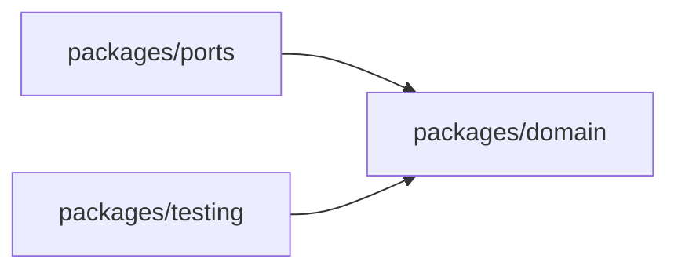
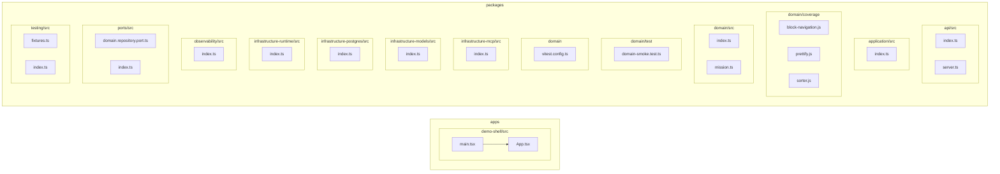

# 🗺️ PROJECT MAP — epos
> Автоматически сгенерировано: `2026-05-11 22:28:49`
> Скрипт: `node dev_studio/refresh.js`

## 📊 Telemetry / Context Health
| Metric | Value | Note |
|---|---|---|
| **Total Files** | `21` | Только JS/TS/TSX исходники |
| **Total Lines** | `505` | Суммарно по проекту |
| **Project Weight** | `~7 872 tokens` | Оценка (4 символа/токен) |
| **Context Pressure** | `6.2%` | Нагрузка на окно 128k (Full Scan) |
| **Map Efficiency** | `~81%` | Экономия контекста через карту |

---

## Высокоуровневая архитектура
> Связи между основными пакетами и приложениями

## Детальная карта компонентов
> Полный граф зависимостей всех файлов проекта

## Компонент: `apps`

| Файл | Строк | Размер | Описание |
|---|---|---|---|
| `demo-shell/src/App.tsx` | 32 | 0.8 KB | — |
| `demo-shell/src/main.tsx` | 10 | 0.2 KB | — |

## Компонент: `packages`

| Файл | Строк | Размер | Описание |
|---|---|---|---|
| `api/src/index.ts` | 3 | 0.0 KB | — |
| `api/src/server.ts` | 16 | 0.3 KB | — |
| `application/src/index.ts` | 3 | 0.1 KB | — |
| `domain/coverage/block-navigation.js` | 88 | 2.6 KB | — |
| `domain/coverage/prettify.js` | 3 | 17.2 KB | — |
| `domain/coverage/sorter.js` | 211 | 6.6 KB | — |
| `domain/src/index.ts` | 2 | 0.0 KB | — |
| `domain/src/mission.ts` | 31 | 0.6 KB | — |
| `domain/test/domain-smoke.test.ts` | 39 | 0.9 KB | — |
| `domain/vitest.config.ts` | 21 | 0.4 KB | — |
| `infrastructure-mcp/src/index.ts` | 3 | 0.1 KB | — |
| `infrastructure-models/src/index.ts` | 3 | 0.1 KB | — |
| `infrastructure-postgres/src/index.ts` | 4 | 0.1 KB | — |
| `infrastructure-runtime/src/index.ts` | 4 | 0.1 KB | — |
| `observability/src/index.ts` | 3 | 0.1 KB | — |
| `ports/src/domain.repository.port.ts` | 7 | 0.2 KB | — |
| `ports/src/index.ts` | 3 | 0.1 KB | — |
| `testing/src/fixtures.ts` | 16 | 0.3 KB | — |
| `testing/src/index.ts` | 3 | 0.1 KB | — |

### `api/src/server.ts`
- **Экспорт**: `buildServer`
- **Роуты**:
  - `GET /health`
- **Зависимости**:

### `application/src/index.ts`
- **Экспорт**: `APPLICATION_VERSION`

### `domain/src/mission.ts`
- **Экспорт**: `MissionStatus`, `MissionBrief`, `Mission`, `assertMissionCanRun`

### `infrastructure-mcp/src/index.ts`
- **Экспорт**: `MCP_VERSION`

### `infrastructure-models/src/index.ts`
- **Экспорт**: `DEFAULT_PROVIDER`

### `infrastructure-postgres/src/index.ts`
- **Экспорт**: `DB_ENGINE`, `DB_VERSION`

### `infrastructure-runtime/src/index.ts`
- **Экспорт**: `RUNTIME_MODE`, `DURABILITY_ENABLED`

### `observability/src/index.ts`
- **Экспорт**: `LOG_LEVEL`

### `ports/src/domain.repository.port.ts`
- **Экспорт**: `MissionRepositoryPort`
- **Зависимости**:
  - `@epos/domain` → Mission

### `testing/src/fixtures.ts`
- **Экспорт**: `createTestMission`
- **Зависимости**:
  - `@epos/domain` → Mission

## Переменные окружения

| Переменная | Используется в |
|---|---|

## API Реестр

| Метод | Путь | Файл |
|---|---|---|
| `GET` | `/health` | `packages/api/src/server.ts` |
