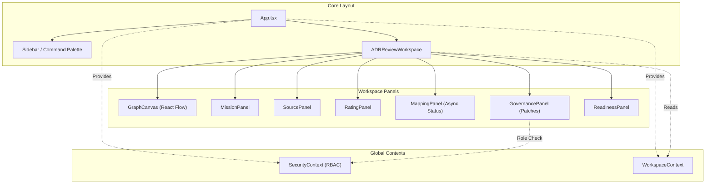

# 🗺️ PROJECT MAP — epios
> Автоматически сгенерировано: `2026-05-15 04:10:55`
> Скрипт: `node dev_studio/refresh.js`

## 📊 Telemetry / Context Health
| Metric | Value | Note |
|---|---|---|
| **Total Files** | `133` | Только JS/TS/TSX исходники |
| **Total Lines** | `14242` | Суммарно по проекту |
| **Project Weight** | `~113 354 tokens` | Оценка (4 символа/токен) |
| **Context Pressure** | `88.6%` | Нагрузка на окно 128k (Full Scan) |
| **Map Efficiency** | `~87%` | Экономия контекста через карту |

---

## Высокоуровневая архитектура
> Связи между основными пакетами и приложениями

## Детальная карта компонентов
> Полный граф зависимостей всех файлов проекта

```mermaid
flowchart LR

subgraph 0["apps"]
subgraph 1["demo-shell"]
subgraph 2["dist"]
subgraph 3["assets"]
4["index-COAmHwb-.js"]
end
end
subgraph 7["src"]
8["App.tsx"]
subgraph F["components"]
G["ADRReviewWorkspace.tsx"]
1C["GovernancePanel.tsx"]
1D["ReadinessPanel.tsx"]
1E["SecureMcpIframe.tsx"]
21["ArchiveView.tsx"]
2F["CommandPalette.tsx"]
2G["Sidebar.tsx"]
2H["Modal.tsx"]
2I["SidebarItem.tsx"]
2J["WorkspaceRoom.tsx"]
2K["GraphCanvas.tsx"]
2M["CustomNode.tsx"]
2N["MissionPanel.tsx"]
2O["MappingPanel.tsx"]
2P["SourcePanel.tsx"]
2Q["RatingPanel.tsx"]
end
T["api-config.ts"]
subgraph U["context"]
V["SecurityContext.tsx"]
28["WorkspaceContext.tsx"]
end
subgraph 1A["hooks"]
1B["useApi.ts"]
end
2R["i18n.ts"]
34["main.tsx"]
35["index.css"]
subgraph 3A["mcp"]
3B["schemas.ts"]
end
end
end
end
subgraph 5["@emotion"]
6["is-prop-valid"]
end
subgraph 9["node_modules"]
subgraph A[".pnpm"]
subgraph B["react@18.3.1"]
subgraph C["node_modules"]
subgraph D["react"]
E["index.js"]
end
end
end
subgraph H["framer-motion@12.38.0_react-dom@18.3.1_react@18.3.1__react@18.3.1"]
subgraph I["node_modules"]
subgraph J["framer-motion"]
subgraph K["dist"]
subgraph L["cjs"]
M["index.js"]
end
end
end
end
end
subgraph N["lucide-react@1.14.0_react@18.3.1"]
subgraph O["node_modules"]
subgraph P["lucide-react"]
subgraph Q["dist"]
subgraph R["cjs"]
S["lucide-react.js"]
end
end
end
end
end
subgraph 1X["zod@4.4.3"]
subgraph 1Y["node_modules"]
subgraph 1Z["zod"]
20["index.js"]
end
end
end
subgraph 22["react-i18next@17.0.7_i18next@26.1.0_typescript@5.9.3__react-dom@18.3.1_react@18.3.1__react@18.3.1_typescript@5.9.3"]
subgraph 23["node_modules"]
subgraph 24["react-i18next"]
subgraph 25["dist"]
subgraph 26["es"]
27["index.js"]
end
end
end
end
end
subgraph 29["reactflow@11.11.4_@types+react@18.3.28_react-dom@18.3.1_react@18.3.1__react@18.3.1"]
subgraph 2A["node_modules"]
subgraph 2B["reactflow"]
subgraph 2C["dist"]
subgraph 2D["esm"]
2E["index.mjs"]
end
2L["style.css"]
end
end
end
end
subgraph 2S["i18next@26.1.0_typescript@5.9.3"]
subgraph 2T["node_modules"]
subgraph 2U["i18next"]
subgraph 2V["dist"]
subgraph 2W["esm"]
2X["i18next.js"]
end
end
end
end
end
subgraph 2Y["i18next-browser-languagedetector@8.2.1"]
subgraph 2Z["node_modules"]
subgraph 30["i18next-browser-languagedetector"]
subgraph 31["dist"]
subgraph 32["esm"]
33["i18nextBrowserLanguageDetector.js"]
end
end
end
end
end
subgraph 36["react-dom@18.3.1_react@18.3.1"]
subgraph 37["node_modules"]
subgraph 38["react-dom"]
39["client.js"]
end
end
end
subgraph 3K["@fastify+cors@8.5.0"]
subgraph 3L["node_modules"]
subgraph 3M["@fastify"]
subgraph 3N["cors"]
3O["index.js"]
end
end
end
end
subgraph 3P["dotenv@16.6.1"]
subgraph 3Q["node_modules"]
subgraph 3R["dotenv"]
subgraph 3S["lib"]
3T["main.js"]
end
end
end
end
subgraph 3U["dotenv-expand@11.0.7"]
subgraph 3V["node_modules"]
subgraph 3W["dotenv-expand"]
subgraph 3X["lib"]
3Y["main.js"]
end
end
end
end
subgraph 3Z["drizzle-orm@0.45.2_postgres@3.4.9"]
subgraph 40["node_modules"]
subgraph 41["drizzle-orm"]
subgraph 42["postgres-js"]
43["index.js"]
end
5T["index.js"]
subgraph 5V["pg-core"]
5W["index.js"]
end
end
end
end
subgraph 44["fastify@4.29.1"]
subgraph 45["node_modules"]
subgraph 46["fastify"]
47["fastify.js"]
end
end
end
subgraph 48["postgres@3.4.9"]
subgraph 49["node_modules"]
subgraph 4A["postgres"]
subgraph 4B["src"]
4C["index.js"]
end
end
end
end
subgraph 6F["vitest@1.6.1_@types+node@25.7.0"]
subgraph 6G["node_modules"]
subgraph 6H["vitest"]
subgraph 6I["dist"]
6J["index.js"]
6N["config.cjs"]
end
end
end
end
subgraph 94["drizzle-kit@0.31.10"]
subgraph 95["node_modules"]
subgraph 96["drizzle-kit"]
97["index.mjs"]
end
end
end
end
end
subgraph W["packages"]
subgraph X["domain"]
subgraph Y["src"]
Z["index.ts"]
10["adr.ts"]
11["errors.ts"]
12["events.ts"]
13["governance.ts"]
14["node.ts"]
15["mapping.ts"]
16["rating.ts"]
17["security.ts"]
18["source.ts"]
19["workspace.ts"]
end
subgraph 6S["coverage"]
6T["block-navigation.js"]
6U["prettify.js"]
6V["sorter.js"]
end
subgraph 6W["test"]
6X["domain-smoke.test.ts"]
6Y["node-invariants.test.ts"]
6Z["source-rating.test.ts"]
70["workspace.test.ts"]
end
71["vitest.config.ts"]
end
subgraph 1F["infrastructure-mcp"]
subgraph 1G["src"]
1H["index.ts"]
1I["mcp-app.registry.ts"]
1V["mcp-bridge.ts"]
1W["schemas.ts"]
end
subgraph 72["dist"]
subgraph 73["domain"]
subgraph 74["src"]
75["adr.d.ts"]
76["adr.js"]
77["errors.d.ts"]
78["errors.js"]
79["events.d.ts"]
7A["events.js"]
7B["governance.d.ts"]
7C["node.js"]
7D["governance.js"]
7E["index.d.ts"]
7F["mapping.js"]
7G["rating.js"]
7H["security.js"]
7I["source.js"]
7J["workspace.js"]
7K["index.js"]
7L["mapping.d.ts"]
7M["mission.d.ts"]
7N["mission.js"]
7O["node.d.ts"]
7P["rating.d.ts"]
7Q["security.d.ts"]
7R["source.d.ts"]
7S["workspace.d.ts"]
end
end
7T["index.d.ts"]
7U["mcp-app.registry.js"]
7V["mcp-bridge.js"]
7W["index.js"]
subgraph 7X["infrastructure-mcp"]
subgraph 7Y["src"]
7Z["index.d.ts"]
80["mcp-app.registry.js"]
81["mcp-bridge.js"]
82["schemas.js"]
83["index.js"]
84["mcp-app.registry.d.ts"]
85["mcp-bridge.d.ts"]
86["schemas.d.ts"]
end
end
87["mcp-app.registry.d.ts"]
8A["mcp-bridge.d.ts"]
subgraph 8B["ports"]
subgraph 8C["src"]
8D["adr.repository.port.d.ts"]
8E["adr.repository.port.js"]
8F["domain.repository.port.d.ts"]
8G["domain.repository.port.js"]
8H["governance.port.d.ts"]
8I["governance.port.js"]
8J["graph.repository.port.d.ts"]
8K["graph.repository.port.js"]
8L["index.d.ts"]
8M["mapping.repository.port.js"]
8N["mcp.port.js"]
8O["outbox.repository.port.js"]
8P["security.port.js"]
8Q["unit-of-work.port.js"]
8R["index.js"]
8S["mapping.repository.port.d.ts"]
8T["mcp.port.d.ts"]
8U["outbox.repository.port.d.ts"]
8V["security.port.d.ts"]
8W["unit-of-work.port.d.ts"]
end
end
end
subgraph 8X["test"]
8Y["mcp-bridge.test.ts"]
8Z["smoke.test.ts"]
end
end
subgraph 1J["ports"]
subgraph 1K["src"]
1L["index.ts"]
1M["adr.repository.port.ts"]
1N["domain.repository.port.ts"]
1O["governance.port.ts"]
1P["graph.repository.port.ts"]
1Q["mapping.repository.port.ts"]
1R["mcp.port.ts"]
1S["outbox.repository.port.ts"]
1T["security.port.ts"]
1U["unit-of-work.port.ts"]
end
end
subgraph 3C["api"]
subgraph 3D["coverage"]
3E["block-navigation.js"]
3F["prettify.js"]
3G["sorter.js"]
end
subgraph 3H["src"]
3I["bin.ts"]
3J["server.ts"]
4D["mock-data.ts"]
subgraph 4E["routes"]
4F["adr.routes.ts"]
5G["governance.routes.ts"]
5H["mapping.routes.ts"]
5K["mcp.routes.ts"]
5L["rating.routes.ts"]
5M["security.routes.ts"]
5N["source.routes.ts"]
5O["workspace.routes.ts"]
end
subgraph 5I["dto"]
5J["index.ts"]
end
6C["index.ts"]
end
subgraph 6D["test"]
6E["adr.test.ts"]
6K["api.test.ts"]
end
6L["vitest.config.ts"]
end
subgraph 4G["application"]
subgraph 4H["src"]
4I["index.ts"]
4J["mapping-processor.ts"]
subgraph 4K["use-cases"]
4L["add-edge.ts"]
4S["add-node.ts"]
4T["add-source.ts"]
4U["adr-use-cases.ts"]
4V["apply-patch.ts"]
4W["apply-retention.ts"]
4X["assess-readiness.ts"]
4Y["cast-vote.ts"]
4Z["create-workspace.ts"]
50["get-mapping-run.ts"]
51["get-node-ratings.ts"]
52["get-readiness.ts"]
53["get-trace.ts"]
54["get-workspace-graph.ts"]
55["list-mapping-runs.ts"]
56["list-patches.ts"]
57["list-sources.ts"]
58["list-workspaces.ts"]
59["patch-node.ts"]
5A["patch-workspace.ts"]
5B["propose-patch.ts"]
5C["rate-node.ts"]
5D["redact-node.ts"]
5E["start-mapping-run.ts"]
5F["submit-claim.ts"]
end
end
subgraph 6O["test"]
6P["create-workspace.test.ts"]
6Q["use-cases.test.ts"]
end
6R["vitest.config.ts"]
end
subgraph 4N["observability"]
subgraph 4O["src"]
4P["index.ts"]
4Q["audit.ts"]
4R["tracer.ts"]
end
end
subgraph 5P["infrastructure-postgres"]
subgraph 5Q["src"]
5R["index.ts"]
5S["governance.repository.ts"]
5U["schema.ts"]
5X["graph.repository.ts"]
5Y["identity.repository.ts"]
5Z["outbox.repository.ts"]
60["rating.repository.ts"]
61["source.repository.ts"]
62["unit-of-work.ts"]
63["workspace.repository.ts"]
98["manual_migrate.ts"]
99["seed.ts"]
end
93["drizzle.config.ts"]
end
subgraph 64["infrastructure-runtime"]
subgraph 65["src"]
66["index.ts"]
67["in-memory-governance.repository.ts"]
68["in-memory-repositories.ts"]
69["in-memory-unit-of-work.ts"]
6A["outbox-worker.ts"]
6B["security-mocks.ts"]
end
end
subgraph 90["infrastructure-models"]
subgraph 91["src"]
92["index.ts"]
end
end
subgraph 9A["testing"]
subgraph 9B["src"]
9C["fixtures.ts"]
9D["index.ts"]
end
end
end
4M["crypto"]
6M["path"]
subgraph 88["@epos"]
89["ports"]
end
4-->6
8-->G
8-->21
8-->2F
8-->2G
8-->2J
8-->28
8-->E
G-->T
G-->V
G-->1B
G-->1C
G-->1D
G-->1E
G-->M
G-->S
G-->E
V-->T
V-->Z
V-->E
Z-->10
Z-->11
Z-->12
Z-->13
Z-->15
Z-->14
Z-->16
Z-->17
Z-->18
Z-->19
13-->11
13-->12
13-->14
14-->11
14-->12
19-->11
1B-->T
1B-->E
1C-->T
1C-->V
1C-->M
1C-->S
1C-->E
1D-->T
1D-->M
1D-->S
1D-->E
1E-->1H
1E-->E
1H-->1I
1H-->1V
1H-->1W
1I-->1L
1L-->1M
1L-->1N
1L-->1O
1L-->1P
1L-->1Q
1L-->1R
1L-->1S
1L-->1T
1L-->1U
1M-->Z
1N-->Z
1O-->Z
1P-->Z
1Q-->Z
1T-->Z
1U-->1N
1U-->1O
1U-->1P
1U-->1S
1V-->1W
1V-->1L
1W-->20
21-->28
21-->M
21-->S
21-->E
21-->27
28-->Z
28-->E
28-->2E
2F-->28
2F-->M
2F-->S
2F-->E
2G-->T
2G-->V
2G-->28
2G-->1B
2G-->2H
2G-->2I
2G-->Z
2G-->M
2G-->S
2G-->E
2G-->27
2H-->M
2H-->S
2H-->E
2I-->M
2I-->S
2I-->E
2I-->27
2J-->T
2J-->V
2J-->28
2J-->2K
2J-->2N
2J-->2Q
2J-->Z
2J-->M
2J-->S
2J-->E
2K-->28
2K-->1B
2K-->2M
2K-->S
2K-->E
2K-->2E
2K-->2L
2M-->S
2M-->E
2M-->2E
2N-->1C
2N-->2O
2N-->2P
2N-->Z
2N-->M
2N-->S
2N-->E
2O-->T
2O-->Z
2O-->M
2O-->S
2O-->E
2P-->T
2P-->M
2P-->S
2P-->E
2Q-->T
2Q-->S
2Q-->E
2R-->2X
2R-->33
2R-->27
34-->8
34-->V
34-->28
34-->2R
34-->35
34-->E
34-->39
34-->2L
3B-->20
3I-->3J
3J-->4D
3J-->4F
3J-->5G
3J-->5H
3J-->5K
3J-->5L
3J-->5M
3J-->5N
3J-->5O
3J-->4I
3J-->1H
3J-->5R
3J-->66
3J-->1L
3J-->3O
3J-->3T
3J-->3Y
3J-->43
3J-->47
3J-->4C
4D-->Z
4F-->4I
4F-->47
4I-->4J
4I-->4L
4I-->4S
4I-->4T
4I-->4U
4I-->4V
4I-->4W
4I-->4X
4I-->4Y
4I-->4Z
4I-->50
4I-->51
4I-->52
4I-->53
4I-->54
4I-->55
4I-->56
4I-->57
4I-->58
4I-->59
4I-->5A
4I-->5B
4I-->5C
4I-->5D
4I-->5E
4I-->5F
4J-->Z
4J-->1L
4L-->Z
4L-->4P
4L-->1L
4L-->4M
4P-->4Q
4P-->4R
4S-->Z
4S-->4P
4S-->1L
4S-->4M
4T-->Z
4T-->1L
4T-->4M
4U-->Z
4U-->1L
4V-->Z
4V-->1L
4V-->4M
4W-->Z
4W-->1L
4X-->Z
4X-->1L
4X-->4M
4Y-->Z
4Y-->4P
4Y-->1L
4Y-->4M
4Z-->Z
4Z-->4P
4Z-->1L
4Z-->4M
50-->Z
50-->1L
51-->Z
51-->1L
52-->Z
52-->1L
53-->Z
53-->1L
54-->Z
54-->1L
55-->Z
55-->1L
56-->Z
56-->1L
57-->Z
57-->1L
58-->Z
58-->1L
59-->Z
59-->1L
5A-->Z
5A-->1L
5B-->Z
5B-->1L
5B-->4M
5C-->Z
5C-->1L
5C-->4M
5D-->Z
5D-->1L
5E-->Z
5E-->1L
5E-->4M
5F-->Z
5F-->1L
5F-->4M
5G-->4I
5G-->1L
5G-->47
5H-->5J
5H-->4I
5H-->47
5J-->Z
5K-->1H
5K-->1L
5K-->47
5L-->4I
5L-->Z
5L-->47
5M-->4I
5M-->Z
5M-->1L
5M-->47
5N-->4I
5N-->Z
5N-->47
5O-->5J
5O-->4I
5O-->47
5R-->5S
5R-->5X
5R-->5Y
5R-->5Z
5R-->60
5R-->5U
5R-->61
5R-->62
5R-->63
5S-->5U
5S-->Z
5S-->1L
5S-->5T
5S-->43
5U-->5W
5X-->5U
5X-->Z
5X-->1L
5X-->5T
5X-->43
5Y-->5U
5Y-->Z
5Y-->1L
5Y-->5T
5Y-->43
5Z-->5U
5Z-->1L
5Z-->5T
5Z-->43
60-->5U
60-->Z
60-->1L
60-->5T
60-->43
61-->5U
61-->Z
61-->1L
61-->5T
61-->43
62-->5S
62-->5X
62-->5Z
62-->60
62-->61
62-->63
62-->1L
62-->43
63-->5U
63-->Z
63-->1L
63-->5T
63-->43
66-->67
66-->68
66-->69
66-->6A
66-->6B
67-->Z
67-->1L
68-->Z
68-->1L
69-->1L
6A-->4P
6A-->1L
6B-->Z
6B-->1L
6B-->4M
6C-->3J
6E-->3J
6E-->47
6E-->6J
6K-->3J
6K-->Z
6K-->1L
6K-->47
6K-->6J
6L-->6M
6L-->6N
6P-->4Z
6P-->1L
6P-->6J
6Q-->4L
6Q-->4S
6Q-->4Y
6Q-->4Z
6Q-->54
6Q-->58
6Q-->59
6Q-->5F
6Q-->Z
6Q-->1L
6Q-->6J
6R-->6M
6R-->6N
6X-->Z
6X-->6J
6Y-->Z
6Y-->6J
6Z-->Z
6Z-->6J
70-->11
70-->19
70-->6J
71-->6N
7B-->7A
7B-->7C
7C-->78
7D-->78
7E-->76
7E-->78
7E-->7A
7E-->7D
7E-->7F
7E-->7C
7E-->7G
7E-->7H
7E-->7I
7E-->7J
7J-->78
7K-->76
7K-->78
7K-->7A
7K-->7D
7K-->7F
7K-->7C
7K-->7G
7K-->7H
7K-->7I
7K-->7J
7O-->7A
7T-->7U
7T-->7V
7W-->7U
7W-->7V
7Z-->80
7Z-->81
7Z-->82
81-->82
82-->20
83-->80
83-->81
83-->82
84-->1L
85-->1L
86-->20
87-->89
8A-->89
8D-->Z
8F-->Z
8H-->Z
8J-->Z
8L-->8E
8L-->8G
8L-->8I
8L-->8K
8L-->8M
8L-->8N
8L-->8O
8L-->8P
8L-->8Q
8R-->8E
8R-->8G
8R-->8I
8R-->8K
8R-->8M
8R-->8N
8R-->8O
8R-->8P
8R-->8Q
8S-->Z
8V-->Z
8W-->8G
8W-->8I
8W-->8K
8W-->8O
8Y-->1V
8Y-->1L
8Y-->6J
8Z-->6J
93-->3T
93-->3Y
93-->97
98-->3T
98-->3Y
98-->4C
99-->5U
99-->3T
99-->3Y
99-->43
99-->4C
9C-->Z
9D-->9C
```

## 🎨 Архитектура UI Интерфейсов (demo-shell)
> Обобщенная концептуальная структура компонентов пользовательского интерфейса

> Подробная документация и Roadmap по развитию интерфейсов находится в [docs/05_ui_roadmap/](docs/05_ui_roadmap/00_ROADMAP_INDEX.md)

## Компонент: `apps`

| Файл | Строк | Размер | Описание |
|---|---|---|---|
| `demo-shell/src/api-config.ts` | 7 | 0.3 KB | Централизованная конфигурация API URL. |
| `demo-shell/src/App.tsx` | 73 | 1.9 KB | — |
| `demo-shell/src/components/ADRReviewWorkspace.tsx` | 853 | 27.9 KB | — |
| `demo-shell/src/components/ArchiveView.tsx` | 247 | 7.4 KB | — |
| `demo-shell/src/components/CommandPalette.tsx` | 341 | 9.1 KB | — |
| `demo-shell/src/components/CustomNode.tsx` | 169 | 4.4 KB | — |
| `demo-shell/src/components/GovernancePanel.tsx` | 498 | 14.7 KB | — |
| `demo-shell/src/components/GraphCanvas.tsx` | 579 | 16.2 KB | — |
| `demo-shell/src/components/MappingPanel.tsx` | 270 | 7.8 KB | — |
| `demo-shell/src/components/MissionPanel.tsx` | 303 | 8.7 KB | — |
| `demo-shell/src/components/Modal.tsx` | 100 | 2.7 KB | — |
| `demo-shell/src/components/RatingPanel.tsx` | 234 | 6.2 KB | — |
| `demo-shell/src/components/ReadinessPanel.tsx` | 403 | 11.7 KB | — |
| `demo-shell/src/components/SecureMcpIframe.tsx` | 101 | 3.0 KB | — |
| `demo-shell/src/components/Sidebar.tsx` | 774 | 24.7 KB | — |
| `demo-shell/src/components/SidebarItem.tsx` | 278 | 7.6 KB | — |
| `demo-shell/src/components/SourcePanel.tsx` | 232 | 6.9 KB | — |
| `demo-shell/src/components/WorkspaceRoom.tsx` | 665 | 21.5 KB | — |
| `demo-shell/src/context/SecurityContext.tsx` | 68 | 1.6 KB | — |
| `demo-shell/src/context/WorkspaceContext.tsx` | 145 | 3.8 KB | — |
| `demo-shell/src/hooks/useApi.ts` | 43 | 1.1 KB | — |
| `demo-shell/src/i18n.ts` | 99 | 3.4 KB | — |
| `demo-shell/src/main.tsx` | 20 | 0.5 KB | — |
| `demo-shell/src/mcp/schemas.ts` | 20 | 0.7 KB | — |

### `demo-shell/src/api-config.ts`
- **Экспорт**: `API_BASE_URL`

### `demo-shell/src/components/ArchiveView.tsx`
- **Экспорт**: `ArchiveView`
- **Зависимости**:
  - `../context/WorkspaceContext` → useWorkspace

### `demo-shell/src/components/GovernancePanel.tsx`
- **Экспорт**: `GovernancePanel`
- **Зависимости**:
  - `../api-config` → API_BASE_URL
  - `../context/SecurityContext` → useSecurity

### `demo-shell/src/components/MappingPanel.tsx`
- **Экспорт**: `MappingPanel`
- **Зависимости**:
  - `../api-config` → API_BASE_URL
  - `@epios/domain` → MappingRun

### `demo-shell/src/components/MissionPanel.tsx`
- **Экспорт**: `MissionPanel`
- **Зависимости**:
  - `./GovernancePanel` → GovernancePanel
  - `./SourcePanel` → SourcePanel
  - `./MappingPanel` → MappingPanel
  - `@epios/domain` → Workspace

### `demo-shell/src/components/Modal.tsx`
- **Экспорт**: `Modal`
- **Зависимости**:

### `demo-shell/src/components/RatingPanel.tsx`
- **Экспорт**: `RatingPanel`
- **Зависимости**:
  - `../api-config` → API_BASE_URL

### `demo-shell/src/components/ReadinessPanel.tsx`
- **Экспорт**: `ReadinessPanel`
- **Зависимости**:
  - `../api-config` → API_BASE_URL

### `demo-shell/src/components/SecureMcpIframe.tsx`
- **Экспорт**: `SecureMcpIframe`
- **Зависимости**:
  - `@epios/infrastructure-mcp` → McpRequestSchema

### `demo-shell/src/components/SidebarItem.tsx`
- **Экспорт**: `SidebarItemProps`, `SidebarItem`
- **Зависимости**:

### `demo-shell/src/components/SourcePanel.tsx`
- **Экспорт**: `SourcePanel`
- **Зависимости**:
  - `../api-config` → API_BASE_URL

### `demo-shell/src/context/SecurityContext.tsx`
- **Экспорт**: `SecurityProvider`, `useSecurity`
- **Зависимости**:
  - `@epios/domain` → User
  - `../api-config` → API_BASE_URL

### `demo-shell/src/context/WorkspaceContext.tsx`
- **Экспорт**: `WorkspaceProvider`, `useWorkspace`
- **Зависимости**:
  - `@epios/domain` → Workspace, WorkspaceStatus

### `demo-shell/src/hooks/useApi.ts`
- **Экспорт**: `useApi`
- **Зависимости**:
  - `../api-config` → API_BASE_URL

### `demo-shell/src/mcp/schemas.ts`
- **Экспорт**: `McpRequestSchema`, `McpResponseSchema`, `McpRequest`, `McpResponse`
- **Зависимости**:

## Компонент: `packages`

| Файл | Строк | Размер | Описание |
|---|---|---|---|
| `api/coverage/block-navigation.js` | 88 | 2.6 KB | — |
| `api/coverage/prettify.js` | 3 | 17.2 KB | — |
| `api/coverage/sorter.js` | 211 | 6.6 KB | — |
| `api/src/bin.ts` | 13 | 0.3 KB | — |
| `api/src/dto/index.ts` | 57 | 1.1 KB | — |
| `api/src/index.ts` | 3 | 0.0 KB | — |
| `api/src/mock-data.ts` | 578 | 17.6 KB | Mock data factory for demo/development mode. |
| `api/src/routes/adr.routes.ts` | 26 | 0.6 KB | — |
| `api/src/routes/governance.routes.ts` | 126 | 3.7 KB | — |
| `api/src/routes/mapping.routes.ts` | 95 | 2.8 KB | — |
| `api/src/routes/mcp.routes.ts` | 45 | 1.3 KB | — |
| `api/src/routes/rating.routes.ts` | 30 | 0.9 KB | — |
| `api/src/routes/security.routes.ts` | 66 | 2.0 KB | — |
| `api/src/routes/source.routes.ts` | 34 | 0.9 KB | — |
| `api/src/routes/workspace.routes.ts` | 52 | 1.4 KB | — |
| `api/src/server.ts` | 291 | 9.5 KB | — |
| `api/test/adr.test.ts` | 48 | 1.2 KB | — |
| `api/test/api.test.ts` | 315 | 8.2 KB | — |
| `api/vitest.config.ts` | 42 | 1.1 KB | — |
| `application/src/index.ts` | 27 | 1.2 KB | — |
| `application/src/mapping-processor.ts` | 96 | 2.5 KB | — |
| `application/src/use-cases/add-edge.ts` | 47 | 1.3 KB | — |
| `application/src/use-cases/add-node.ts` | 56 | 1.4 KB | — |
| `application/src/use-cases/add-source.ts` | 29 | 0.7 KB | — |
| `application/src/use-cases/adr-use-cases.ts` | 19 | 0.5 KB | — |
| `application/src/use-cases/apply-patch.ts` | 75 | 2.3 KB | — |
| `application/src/use-cases/apply-retention.ts` | 60 | 1.7 KB | — |
| `application/src/use-cases/assess-readiness.ts` | 90 | 2.8 KB | — |
| `application/src/use-cases/cast-vote.ts` | 144 | 4.6 KB | — |
| `application/src/use-cases/create-workspace.ts` | 49 | 1.2 KB | — |
| `application/src/use-cases/get-mapping-run.ts` | 11 | 0.3 KB | — |
| `application/src/use-cases/get-node-ratings.ts` | 11 | 0.3 KB | — |
| `application/src/use-cases/get-readiness.ts` | 11 | 0.4 KB | — |
| `application/src/use-cases/get-trace.ts` | 11 | 0.3 KB | — |
| `application/src/use-cases/get-workspace-graph.ts` | 21 | 0.6 KB | — |
| `application/src/use-cases/list-mapping-runs.ts` | 11 | 0.3 KB | — |
| `application/src/use-cases/list-patches.ts` | 15 | 0.4 KB | — |
| `application/src/use-cases/list-sources.ts` | 11 | 0.3 KB | — |
| `application/src/use-cases/list-workspaces.ts` | 11 | 0.3 KB | — |
| `application/src/use-cases/patch-node.ts` | 35 | 1.2 KB | — |
| `application/src/use-cases/patch-workspace.ts` | 36 | 1.1 KB | — |
| `application/src/use-cases/propose-patch.ts` | 57 | 1.5 KB | — |
| `application/src/use-cases/rate-node.ts` | 29 | 0.7 KB | — |
| `application/src/use-cases/redact-node.ts` | 63 | 1.6 KB | — |
| `application/src/use-cases/start-mapping-run.ts` | 43 | 1.0 KB | — |
| `application/src/use-cases/submit-claim.ts` | 54 | 1.3 KB | — |
| `application/test/create-workspace.test.ts` | 63 | 1.6 KB | — |
| `application/test/use-cases.test.ts` | 390 | 11.7 KB | — |
| `application/vitest.config.ts` | 28 | 0.6 KB | — |
| `domain/coverage/block-navigation.js` | 88 | 2.6 KB | — |
| `domain/coverage/prettify.js` | 3 | 17.2 KB | — |
| `domain/coverage/sorter.js` | 211 | 6.6 KB | — |
| `domain/src/adr.ts` | 42 | 0.7 KB | — |
| `domain/src/errors.ts` | 28 | 0.7 KB | — |
| `domain/src/events.ts` | 6 | 0.1 KB | — |
| `domain/src/governance.ts` | 282 | 6.0 KB | A Claim in EPIOS is a node that undergoes a formal governance process. |
| `domain/src/index.ts` | 11 | 0.3 KB | — |
| `domain/src/mapping.ts` | 15 | 0.3 KB | — |
| `domain/src/node.ts` | 174 | 3.7 KB | — |
| `domain/src/rating.ts` | 11 | 0.2 KB | — |
| `domain/src/security.ts` | 40 | 0.8 KB | — |
| `domain/src/source.ts` | 11 | 0.2 KB | — |
| `domain/src/workspace.ts` | 189 | 4.3 KB | Returns a plain object representation for persistence/serialization. |
| `domain/test/domain-smoke.test.ts` | 51 | 1.3 KB | — |
| `domain/test/node-invariants.test.ts` | 51 | 1.2 KB | — |
| `domain/test/source-rating.test.ts` | 33 | 0.8 KB | — |
| `domain/test/workspace.test.ts` | 63 | 1.7 KB | — |
| `domain/vitest.config.ts` | 21 | 0.4 KB | — |
| `infrastructure-mcp/src/index.ts` | 5 | 0.1 KB | — |
| `infrastructure-mcp/src/mcp-app.registry.ts` | 35 | 0.8 KB | — |
| `infrastructure-mcp/src/mcp-bridge.ts` | 77 | 2.0 KB | Hardened MCP Bridge implementation. |
| `infrastructure-mcp/src/schemas.ts` | 33 | 1.0 KB | MCP Bridge Message Schemas |
| `infrastructure-mcp/test/mcp-bridge.test.ts` | 49 | 1.4 KB | — |
| `infrastructure-mcp/test/smoke.test.ts` | 8 | 0.2 KB | — |
| `infrastructure-models/src/index.ts` | 3 | 0.1 KB | — |
| `infrastructure-postgres/drizzle.config.ts` | 17 | 0.4 KB | — |
| `infrastructure-postgres/src/governance.repository.ts` | 357 | 10.2 KB | — |
| `infrastructure-postgres/src/graph.repository.ts` | 202 | 5.8 KB | — |
| `infrastructure-postgres/src/identity.repository.ts` | 68 | 1.7 KB | — |
| `infrastructure-postgres/src/index.ts` | 14 | 0.5 KB | — |
| `infrastructure-postgres/src/manual_migrate.ts` | 30 | 0.9 KB | — |
| `infrastructure-postgres/src/outbox.repository.ts` | 53 | 1.4 KB | — |
| `infrastructure-postgres/src/rating.repository.ts` | 50 | 1.4 KB | — |
| `infrastructure-postgres/src/schema.ts` | 209 | 6.9 KB | — |
| `infrastructure-postgres/src/seed.ts` | 378 | 13.2 KB | — |
| `infrastructure-postgres/src/source.repository.ts` | 60 | 1.6 KB | — |
| `infrastructure-postgres/src/unit-of-work.ts` | 55 | 2.1 KB | PostgresUnitOfWork provides access to all repositories within a single Drizzle transaction. |
| `infrastructure-postgres/src/workspace.repository.ts` | 126 | 4.1 KB | — |
| `infrastructure-runtime/src/in-memory-governance.repository.ts` | 108 | 3.3 KB | — |
| `infrastructure-runtime/src/in-memory-repositories.ts` | 242 | 6.4 KB | — |
| `infrastructure-runtime/src/in-memory-unit-of-work.ts` | 52 | 1.6 KB | InMemoryUnitOfWork provides access to all repositories. |
| `infrastructure-runtime/src/index.ts` | 9 | 0.3 KB | — |
| `infrastructure-runtime/src/outbox-worker.ts` | 75 | 2.0 KB | — |
| `infrastructure-runtime/src/security-mocks.ts` | 82 | 2.2 KB | — |
| `observability/src/audit.ts` | 25 | 0.6 KB | — |
| `observability/src/index.ts` | 3 | 0.1 KB | — |
| `observability/src/tracer.ts` | 24 | 0.5 KB | — |
| `ports/src/adr.repository.port.ts` | 8 | 0.2 KB | — |
| `ports/src/domain.repository.port.ts` | 19 | 0.5 KB | — |
| `ports/src/governance.port.ts` | 32 | 1.2 KB | — |
| `ports/src/graph.repository.port.ts` | 14 | 0.6 KB | — |
| `ports/src/index.ts` | 11 | 0.4 KB | — |
| `ports/src/mapping.repository.port.ts` | 8 | 0.2 KB | — |
| `ports/src/mcp.port.ts` | 35 | 1.0 KB | Port for MCP Application Registry. |
| `ports/src/outbox.repository.port.ts` | 14 | 0.3 KB | — |
| `ports/src/security.port.ts` | 15 | 0.6 KB | — |
| `ports/src/unit-of-work.port.ts` | 33 | 1.1 KB | UnitOfWork provides access to all repositories within a single transaction scope. |
| `testing/src/fixtures.ts` | 23 | 0.5 KB | — |
| `testing/src/index.ts` | 3 | 0.1 KB | — |

### `api/src/dto/index.ts`
- **Экспорт**: `CreateWorkspaceDto`, `AddNodeDto`, `AddEdgeDto`, `PatchNodeDto`, `ADRDto`, `ADRFlowDto`, `AddSourceDto`, `RateNodeDto`

### `api/src/mock-data.ts`
- **Экспорт**: `MockData`, `createMockData`

### `api/src/server.ts`
- **Экспорт**: `ServerDependencies`, `buildServer`
- **Роуты**:
  - `GET /health`
- **Зависимости**:
  - `./routes/workspace.routes.js` → workspaceRoutes
  - `./routes/mapping.routes.js` → mappingRoutes
  - `./routes/governance.routes.js` → governanceRoutes
  - `./routes/adr.routes.js` → adrRoutes
  - `./routes/mcp.routes.js` → mcpRoutes
  - `./routes/source.routes.js` → sourceRoutes
  - `./routes/rating.routes.js` → ratingRoutes
  - `./routes/security.routes.js` → securityRoutes
  - `./mock-data.js` → createMockData

### `application/src/mapping-processor.ts`
- **Экспорт**: `MappingProcessor`
- **Зависимости**:
  - `@epios/domain` → EpistemicNode

### `application/src/use-cases/add-edge.ts`
- **Экспорт**: `AddEdgeRequest`, `AddEdgeUseCase`
- **Зависимости**:
  - `@epios/domain` → EpistemicEdge, EpistemicEdgeType
  - `@epios/ports` → GraphRepositoryPort, WorkspaceRepositoryPort
  - `@epios/observability` → tracer

### `application/src/use-cases/add-node.ts`
- **Экспорт**: `AddNodeRequest`, `AddNodeUseCase`
- **Зависимости**:
  - `@epios/ports` → GraphRepositoryPort, WorkspaceRepositoryPort
  - `@epios/observability` → tracer

### `application/src/use-cases/add-source.ts`
- **Экспорт**: `AddSourceRequest`, `AddSourceUseCase`
- **Зависимости**:
  - `@epios/domain` → Source, SourceType
  - `@epios/ports` → SourceRepositoryPort

### `application/src/use-cases/adr-use-cases.ts`
- **Экспорт**: `ListADRsUseCase`, `GetADRUseCase`
- **Зависимости**:
  - `@epios/domain` → ADR
  - `@epios/ports` → ADRRepositoryPort

### `application/src/use-cases/apply-patch.ts`
- **Экспорт**: `ApplyPatchRequest`, `ApplyPatchUseCase`
- **Зависимости**:
  - `@epios/ports` → UnitOfWorkPort
  - `@epios/domain` → ArtifactVersion

### `application/src/use-cases/apply-retention.ts`
- **Экспорт**: `ApplyRetentionUseCase`
- **Зависимости**:
  - `@epios/domain` → RetentionPolicy

### `application/src/use-cases/assess-readiness.ts`
- **Экспорт**: `AssessReadinessRequest`, `AssessReadinessUseCase`
- **Зависимости**:
  - `@epios/ports` → GovernanceRepositoryPort, GraphRepositoryPort
  - `@epios/domain` → ReadinessAssessment, ReadinessStatus

### `application/src/use-cases/cast-vote.ts`
- **Экспорт**: `CastVoteRequest`, `CastVoteUseCase`
- **Зависимости**:
  - `@epios/ports` → UnitOfWorkPort, OutboxMessage
  - `@epios/observability` → auditLogger
  - `@epios/domain` → DomainEvent

### `application/src/use-cases/create-workspace.ts`
- **Экспорт**: `CreateWorkspaceRequest`, `CreateWorkspaceUseCase`
- **Зависимости**:
  - `@epios/ports` → WorkspaceRepositoryPort
  - `@epios/observability` → tracer

### `application/src/use-cases/get-mapping-run.ts`
- **Экспорт**: `GetMappingRunUseCase`
- **Зависимости**:
  - `@epios/domain` → MappingRun
  - `@epios/ports` → MappingRepositoryPort

### `application/src/use-cases/get-node-ratings.ts`
- **Экспорт**: `GetNodeRatingsUseCase`
- **Зависимости**:
  - `@epios/domain` → Rating
  - `@epios/ports` → RatingRepositoryPort

### `application/src/use-cases/get-readiness.ts`
- **Экспорт**: `GetReadinessUseCase`
- **Зависимости**:
  - `@epios/ports` → GovernanceRepositoryPort
  - `@epios/domain` → ReadinessAssessment

### `application/src/use-cases/get-trace.ts`
- **Экспорт**: `GetTraceUseCase`
- **Зависимости**:
  - `@epios/ports` → GovernanceRepositoryPort
  - `@epios/domain` → TraceEvent

### `application/src/use-cases/get-workspace-graph.ts`
- **Экспорт**: `WorkspaceGraph`, `GetWorkspaceGraphUseCase`
- **Зависимости**:
  - `@epios/domain` → EpistemicNode, EpistemicEdge
  - `@epios/ports` → GraphRepositoryPort

### `application/src/use-cases/list-mapping-runs.ts`
- **Экспорт**: `ListMappingRunsUseCase`
- **Зависимости**:
  - `@epios/domain` → MappingRun
  - `@epios/ports` → MappingRepositoryPort

### `application/src/use-cases/list-patches.ts`
- **Экспорт**: `ListPatchesRequest`, `ListPatchesUseCase`
- **Зависимости**:
  - `@epios/domain` → NodePatch
  - `@epios/ports` → GovernanceRepositoryPort

### `application/src/use-cases/list-sources.ts`
- **Экспорт**: `ListSourcesUseCase`
- **Зависимости**:
  - `@epios/domain` → Source
  - `@epios/ports` → SourceRepositoryPort

### `application/src/use-cases/list-workspaces.ts`
- **Экспорт**: `ListWorkspacesUseCase`
- **Зависимости**:
  - `@epios/domain` → Workspace
  - `@epios/ports` → WorkspaceRepositoryPort

### `application/src/use-cases/patch-node.ts`
- **Экспорт**: `PatchNodeRequest`, `PatchNodeUseCase`
- **Зависимости**:
  - `@epios/domain` → EpistemicNode, NodeStrength, EvidenceRef
  - `@epios/ports` → GraphRepositoryPort

### `application/src/use-cases/patch-workspace.ts`
- **Экспорт**: `PatchWorkspaceDto`, `PatchWorkspaceUseCase`
- **Зависимости**:
  - `@epios/ports` → WorkspaceRepositoryPort
  - `@epios/domain` → Workspace, WorkspaceStatus

### `application/src/use-cases/propose-patch.ts`
- **Экспорт**: `ProposePatchRequest`, `ProposePatchUseCase`
- **Зависимости**:
  - `@epios/domain` → NodePatch, GovernanceProcess
  - `@epios/ports` → GovernanceRepositoryPort, GraphRepositoryPort

### `application/src/use-cases/rate-node.ts`
- **Экспорт**: `RateNodeRequest`, `RateNodeUseCase`
- **Зависимости**:
  - `@epios/domain` → Rating, EpistemicRatingValue
  - `@epios/ports` → RatingRepositoryPort

### `application/src/use-cases/redact-node.ts`
- **Экспорт**: `RedactNodeUseCase`
- **Зависимости**:
  - `@epios/domain` → EpistemicNode, RedactionRule
  - `@epios/ports` → GraphRepositoryPort, SecurityPort

### `application/src/use-cases/start-mapping-run.ts`
- **Экспорт**: `StartMappingRunRequest`, `StartMappingRunUseCase`
- **Зависимости**:
  - `@epios/domain` → MappingRun
  - `@epios/ports` → MappingRepositoryPort, OutboxRepositoryPort

### `application/src/use-cases/submit-claim.ts`
- **Экспорт**: `SubmitClaimRequest`, `SubmitClaimUseCase`
- **Зависимости**:
  - `@epios/ports` → UnitOfWorkPort

### `domain/src/adr.ts`
- **Экспорт**: `ADRStatus`, `ADRPriority`, `ADR`, `ADRFlow`

### `domain/src/errors.ts`
- **Экспорт**: `DomainError`, `ValidationError`, `InvalidTransitionError`, `ConcurrencyError`

### `domain/src/events.ts`
- **Экспорт**: `DomainEvent`

### `domain/src/governance.ts`
- **Экспорт**: `ApprovalStatus`, `Vote`, `GovernanceProcessProps`, `GovernanceProcess`, `Claim`, `NodePatchProps`, `NodePatch`, `PatchGovernanceProps`, `PatchGovernance`, `ReadinessStatus`, `ReadinessAssessment`, `ArtifactVersion`, `TraceEvent`
- **Зависимости**:
  - `./errors.js` → ValidationError, InvalidTransitionError
  - `./events.js` → DomainEvent
  - `./node.js` → EpistemicNode

### `domain/src/mapping.ts`
- **Экспорт**: `MappingRunStatus`, `MappingRun`

### `domain/src/node.ts`
- **Экспорт**: `NodeType`, `NodeStrength`, `EvidenceRef`, `EpistemicNodeProps`, `EpistemicNode`, `EpistemicEdgeType`, `EpistemicEdge`
- **Зависимости**:
  - `./errors.js` → ValidationError
  - `./events.js` → DomainEvent

### `domain/src/rating.ts`
- **Экспорт**: `EpistemicRatingValue`, `Rating`

### `domain/src/security.ts`
- **Экспорт**: `UserRole`, `User`, `Permission`, `RetentionPolicy`, `RedactionRule`, `AuditRecord`

### `domain/src/source.ts`
- **Экспорт**: `SourceType`, `Source`

### `domain/src/workspace.ts`
- **Экспорт**: `WorkspaceStatus`, `WorkspaceMode`, `WorkspaceSensitivity`, `WorkspaceBrief`, `WorkspaceActor`, `WorkspaceProps`, `Workspace`, `assertWorkspaceCanRun`
- **Зависимости**:
  - `./errors.js` → ValidationError, InvalidTransitionError

### `infrastructure-mcp/src/index.ts`
- **Экспорт**: `MCP_VERSION`

### `infrastructure-mcp/src/mcp-app.registry.ts`
- **Экспорт**: `InMemoryMCPAppRegistry`
- **Зависимости**:
  - `@epios/ports` → MCPApp, MCPAppRegistryPort

### `infrastructure-mcp/src/mcp-bridge.ts`
- **Экспорт**: `MockMCPBridge`
- **Зависимости**:
  - `@epios/ports` → MCPBridgePort, MCPAppRegistryPort
  - `./schemas.js` → ExecuteToolSchema

### `infrastructure-mcp/src/schemas.ts`
- **Экспорт**: `McpRequestSchema`, `McpResponseSchema`, `ExecuteToolSchema`, `McpRequest`, `McpResponse`, `ExecuteTool`
- **Зависимости**:

### `infrastructure-models/src/index.ts`
- **Экспорт**: `DEFAULT_PROVIDER`

### `infrastructure-postgres/src/governance.repository.ts`
- **Экспорт**: `PostgresGovernanceRepository`
- **Зависимости**:
  - `@epios/ports` → GovernanceRepositoryPort

### `infrastructure-postgres/src/graph.repository.ts`
- **Экспорт**: `PostgresGraphRepository`
- **Зависимости**:
  - `@epios/ports` → GraphRepositoryPort
  - `./schema.js` → epistemicNodes, epistemicEdges

### `infrastructure-postgres/src/identity.repository.ts`
- **Экспорт**: `PostgresIdentityRepository`
- **Зависимости**:
  - `@epios/domain` → User, UserRole
  - `@epios/ports` → IdentityRepositoryPort
  - `./schema.js` → identities

### `infrastructure-postgres/src/index.ts`
- **Экспорт**: `DB_ENGINE`, `DB_VERSION`

### `infrastructure-postgres/src/outbox.repository.ts`
- **Экспорт**: `PostgresOutboxRepository`
- **Зависимости**:
  - `@epios/ports` → OutboxMessage, OutboxRepositoryPort
  - `./schema.js` → outbox

### `infrastructure-postgres/src/rating.repository.ts`
- **Экспорт**: `PostgresRatingRepository`
- **Зависимости**:
  - `@epios/domain` → Rating, EpistemicRatingValue
  - `@epios/ports` → RatingRepositoryPort
  - `./schema.js` → ratings

### `infrastructure-postgres/src/schema.ts`
- **Экспорт**: `workspaces`, `epistemicNodes`, `epistemicEdges`, `sources`, `ratings`, `identities`, `governanceProcesses`, `nodePatches`, `readinessAssessments`, `artifactVersions`, `traceEvents`, `outbox`

### `infrastructure-postgres/src/source.repository.ts`
- **Экспорт**: `PostgresSourceRepository`
- **Зависимости**:
  - `@epios/domain` → Source, SourceType
  - `@epios/ports` → SourceRepositoryPort
  - `./schema.js` → sources

### `infrastructure-postgres/src/unit-of-work.ts`
- **Экспорт**: `PostgresUnitOfWork`, `PostgresUnitOfWorkProvider`
- **Зависимости**:
  - `./graph.repository.js` → PostgresGraphRepository
  - `./workspace.repository.js` → PostgresWorkspaceRepository
  - `./source.repository.js` → PostgresSourceRepository
  - `./rating.repository.js` → PostgresRatingRepository
  - `./governance.repository.js` → PostgresGovernanceRepository
  - `./outbox.repository.js` → PostgresOutboxRepository

### `infrastructure-postgres/src/workspace.repository.ts`
- **Экспорт**: `PostgresWorkspaceRepository`
- **Зависимости**:
  - `@epios/ports` → WorkspaceRepositoryPort
  - `./schema.js` → workspaces

### `infrastructure-runtime/src/in-memory-governance.repository.ts`
- **Экспорт**: `InMemoryGovernanceRepository`
- **Зависимости**:
  - `@epios/ports` → GovernanceRepositoryPort

### `infrastructure-runtime/src/in-memory-repositories.ts`
- **Экспорт**: `InMemoryADRRepository`, `MOCK_ADRS`, `InMemoryWorkspaceRepository`, `InMemoryGraphRepository`, `InMemorySourceRepository`, `InMemoryRatingRepository`, `InMemoryMappingRepository`, `InMemoryOutboxRepository`

### `infrastructure-runtime/src/in-memory-unit-of-work.ts`
- **Экспорт**: `InMemoryUnitOfWork`, `InMemoryUnitOfWorkProvider`

### `infrastructure-runtime/src/index.ts`
- **Экспорт**: `RUNTIME_MODE`, `DURABILITY_ENABLED`

### `infrastructure-runtime/src/outbox-worker.ts`
- **Экспорт**: `OutboxWorkerOptions`, `OutboxWorker`
- **Зависимости**:
  - `@epios/ports` → OutboxRepositoryPort
  - `@epios/observability` → auditLogger

### `infrastructure-runtime/src/security-mocks.ts`
- **Экспорт**: `InMemoryIdentityRepository`, `MockSecurityService`
- **Зависимости**:
  - `@epios/domain` → User, UserRole, AuditRecord
  - `@epios/ports` → SecurityPort, IdentityRepositoryPort

### `observability/src/audit.ts`
- **Экспорт**: `AuditEntry`, `AuditLogger`, `auditLogger`

### `observability/src/tracer.ts`
- **Экспорт**: `TraceEvent`, `Tracer`, `ConsoleTracer`, `tracer`

### `ports/src/adr.repository.port.ts`
- **Экспорт**: `ADRRepositoryPort`
- **Зависимости**:
  - `@epios/domain` → ADR

### `ports/src/domain.repository.port.ts`
- **Экспорт**: `WorkspaceRepositoryPort`, `SourceRepositoryPort`, `RatingRepositoryPort`
- **Зависимости**:
  - `@epios/domain` → Workspace, Source, Rating

### `ports/src/governance.port.ts`
- **Экспорт**: `GovernanceRepositoryPort`

### `ports/src/graph.repository.port.ts`
- **Экспорт**: `GraphRepositoryPort`
- **Зависимости**:
  - `@epios/domain` → EpistemicNode, EpistemicEdge

### `ports/src/mapping.repository.port.ts`
- **Экспорт**: `MappingRepositoryPort`
- **Зависимости**:
  - `@epios/domain` → MappingRun

### `ports/src/mcp.port.ts`
- **Экспорт**: `MCPApp`, `MCPAppRegistryPort`, `MCPBridgePort`

### `ports/src/outbox.repository.port.ts`
- **Экспорт**: `OutboxMessage`, `OutboxRepositoryPort`

### `ports/src/security.port.ts`
- **Экспорт**: `SecurityPort`, `IdentityRepositoryPort`
- **Зависимости**:
  - `@epios/domain` → User, UserRole, AuditRecord

### `ports/src/unit-of-work.port.ts`
- **Экспорт**: `UnitOfWork`, `UnitOfWorkPort`
- **Зависимости**:
  - `./graph.repository.port.js` → GraphRepositoryPort
  - `./governance.port.js` → GovernanceRepositoryPort
  - `./outbox.repository.port.js` → OutboxRepositoryPort

### `testing/src/fixtures.ts`
- **Экспорт**: `createTestWorkspace`
- **Зависимости**:
  - `@epios/domain` → Workspace

## Переменные окружения

| Переменная | Используется в |
|---|---|
| `DATABASE_URL` | packages/server.ts, packages/drizzle.config.ts, packages/manual_migrate.ts, packages/seed.ts |
| `EPIOS_DATABASE_MODE` | packages/server.ts, packages/api.test.ts |
| `FRONTEND_URL` | packages/server.ts |
| `NODE_ENV` | packages/server.ts |
| `PORT` | packages/bin.ts |

## API Реестр

| Метод | Путь | Файл |
|---|---|---|
| `GET` | `/health` | `packages/api/src/server.ts` |
