# 🗺️ PROJECT MAP — epos
> Автоматически сгенерировано: `2026-05-12 07:14:10`
> Скрипт: `node dev_studio/refresh.js`

## 📊 Telemetry / Context Health
| Metric | Value | Note |
|---|---|---|
| **Total Files** | `72` | Только JS/TS/TSX исходники |
| **Total Lines** | `5627` | Суммарно по проекту |
| **Project Weight** | `~51 157 tokens` | Оценка (4 символа/токен) |
| **Context Pressure** | `40.0%` | Нагрузка на окно 128k (Full Scan) |
| **Map Efficiency** | `~86%` | Экономия контекста через карту |

---

## Высокоуровневая архитектура
> Связи между основными пакетами и приложениями

## Детальная карта компонентов
> Полный граф зависимостей всех файлов проекта

```mermaid
flowchart LR

subgraph 0["apps"]
subgraph 1["demo-shell"]
subgraph 2["dist"]
subgraph 3["assets"]
4["index-D4vUquLR.js"]
end
end
subgraph 7["src"]
8["App.tsx"]
subgraph F["components"]
G["CommandPalette.tsx"]
V["MissionRoom.tsx"]
W["GovernancePanel.tsx"]
X["GraphCanvas.tsx"]
17["CustomNode.tsx"]
18["Sidebar.tsx"]
end
subgraph T["context"]
U["MissionContext.tsx"]
end
subgraph 15["hooks"]
16["useApi.ts"]
end
19["main.tsx"]
1A["index.css"]
end
end
end
subgraph 5["@emotion"]
6["is-prop-valid"]
end
subgraph 9["node_modules"]
subgraph A[".pnpm"]
subgraph B["react@18.3.1"]
subgraph C["node_modules"]
subgraph D["react"]
E["index.js"]
end
end
end
subgraph H["framer-motion@12.38.0_react_8b618d649db4043b646326868cdfb743"]
subgraph I["node_modules"]
subgraph J["framer-motion"]
subgraph K["dist"]
subgraph L["cjs"]
M["index.js"]
end
end
end
end
end
subgraph N["lucide-react@1.14.0_react@18.3.1"]
subgraph O["node_modules"]
subgraph P["lucide-react"]
subgraph Q["dist"]
subgraph R["cjs"]
S["lucide-react.js"]
end
end
end
end
end
subgraph Y["reactflow@11.11.4_@types+re_c2b98541cbcfabf22830798c75b6ca44"]
subgraph Z["node_modules"]
subgraph 10["reactflow"]
subgraph 11["dist"]
subgraph 12["esm"]
13["index.mjs"]
end
14["style.css"]
end
end
end
end
subgraph 1B["react-dom@18.3.1_react@18.3.1"]
subgraph 1C["node_modules"]
subgraph 1D["react-dom"]
1E["client.js"]
end
end
end
subgraph 1O["@fastify+cors@8.5.0"]
subgraph 1P["node_modules"]
subgraph 1Q["@fastify"]
subgraph 1R["cors"]
1S["index.js"]
end
end
end
end
subgraph 1T["dotenv@16.6.1"]
subgraph 1U["node_modules"]
subgraph 1V["dotenv"]
subgraph 1W["lib"]
1X["main.js"]
end
end
end
end
subgraph 1Y["drizzle-orm@0.30.10_@types+_e0e2009336beb99158b32f944ddf65e4"]
subgraph 1Z["node_modules"]
subgraph 20["drizzle-orm"]
subgraph 21["postgres-js"]
22["index.js"]
end
3N["index.js"]
subgraph 3P["pg-core"]
3Q["index.js"]
end
end
end
end
subgraph 23["fastify@4.29.1"]
subgraph 24["node_modules"]
subgraph 25["fastify"]
26["fastify.js"]
end
end
end
subgraph 27["postgres@3.4.9"]
subgraph 28["node_modules"]
subgraph 29["postgres"]
subgraph 2A["src"]
2B["index.js"]
end
end
end
end
subgraph 40["vitest@1.6.1_@types+node@25.6.2"]
subgraph 41["node_modules"]
subgraph 42["vitest"]
subgraph 43["dist"]
44["index.js"]
47["config.cjs"]
end
end
end
end
end
end
subgraph 1F["packages"]
subgraph 1G["api"]
subgraph 1H["coverage"]
1I["block-navigation.js"]
1J["prettify.js"]
1K["sorter.js"]
end
subgraph 1L["src"]
1M["bin.ts"]
1N["server.ts"]
subgraph 2C["routes"]
2D["governance.routes.ts"]
39["mapping.routes.ts"]
3C["mcp.routes.ts"]
3D["mission.routes.ts"]
end
subgraph 3A["dto"]
3B["index.ts"]
end
3X["index.ts"]
end
subgraph 3Y["test"]
3Z["api.test.ts"]
end
45["vitest.config.ts"]
end
subgraph 2E["application"]
subgraph 2F["src"]
2G["index.ts"]
subgraph 2H["use-cases"]
2I["add-edge.ts"]
32["add-node.ts"]
33["cast-vote.ts"]
34["create-mission.ts"]
35["get-mission-graph.ts"]
36["list-missions.ts"]
37["patch-node.ts"]
38["submit-claim.ts"]
end
end
subgraph 48["test"]
49["create-mission.test.ts"]
4A["use-cases.test.ts"]
end
4B["vitest.config.ts"]
end
subgraph 2K["domain"]
subgraph 2L["src"]
2M["index.ts"]
2N["governance.ts"]
2O["node.ts"]
2P["mission.ts"]
end
subgraph 4C["coverage"]
4D["block-navigation.js"]
4E["prettify.js"]
4F["sorter.js"]
end
subgraph 4G["test"]
4H["domain-smoke.test.ts"]
4I["mission.test.ts"]
4J["node-invariants.test.ts"]
end
4K["vitest.config.ts"]
end
subgraph 2Q["observability"]
subgraph 2R["src"]
2S["index.ts"]
2T["audit.ts"]
2U["tracer.ts"]
end
end
subgraph 2V["ports"]
subgraph 2W["src"]
2X["index.js"]
2Y["domain.repository.port.js"]
2Z["governance.port.js"]
30["graph.repository.port.js"]
31["mcp.port.js"]
5P["domain.repository.port.d.ts"]
5Q["domain.repository.port.ts"]
5R["governance.port.d.ts"]
5S["governance.port.ts"]
5T["graph.repository.port.d.ts"]
5U["graph.repository.port.ts"]
5V["index.d.ts"]
5W["index.ts"]
5X["mcp.port.d.ts"]
5Y["mcp.port.ts"]
end
end
subgraph 3E["infrastructure-mcp"]
subgraph 3F["src"]
3G["index.ts"]
3H["mcp-app.registry.ts"]
3I["mcp-bridge.ts"]
end
subgraph 4L["dist"]
subgraph 4M["domain"]
subgraph 4N["src"]
4O["governance.d.ts"]
4P["node.js"]
4Q["governance.js"]
4R["index.d.ts"]
4S["mission.js"]
4T["index.js"]
4U["mission.d.ts"]
4V["node.d.ts"]
end
end
4W["index.d.ts"]
4X["mcp-app.registry.js"]
4Y["mcp-bridge.js"]
4Z["index.js"]
subgraph 50["infrastructure-mcp"]
subgraph 51["src"]
52["index.d.ts"]
53["mcp-app.registry.js"]
54["mcp-bridge.js"]
55["index.js"]
56["mcp-app.registry.d.ts"]
57["mcp-bridge.d.ts"]
end
end
58["mcp-app.registry.d.ts"]
59["mcp-bridge.d.ts"]
subgraph 5A["ports"]
subgraph 5B["src"]
5C["domain.repository.port.d.ts"]
5D["domain.repository.port.js"]
5E["governance.port.d.ts"]
5F["governance.port.js"]
5G["graph.repository.port.d.ts"]
5H["graph.repository.port.js"]
5I["index.d.ts"]
5J["mcp.port.js"]
5K["index.js"]
5L["mcp.port.d.ts"]
end
end
end
end
subgraph 3J["infrastructure-postgres"]
subgraph 3K["src"]
3L["index.ts"]
3M["graph.repository.ts"]
3O["schema.ts"]
3R["mission.repository.ts"]
end
end
subgraph 3S["infrastructure-runtime"]
subgraph 3T["src"]
3U["index.ts"]
3V["in-memory-governance.repository.ts"]
3W["in-memory-repositories.ts"]
end
end
subgraph 5M["infrastructure-models"]
subgraph 5N["src"]
5O["index.ts"]
end
end
subgraph 5Z["testing"]
subgraph 60["src"]
61["fixtures.ts"]
62["index.ts"]
end
end
end
2J["crypto"]
46["path"]
4-->6
8-->G
8-->V
8-->18
8-->E
G-->U
G-->M
G-->S
G-->E
U-->E
V-->U
V-->W
V-->X
V-->M
V-->S
V-->E
W-->M
W-->S
W-->E
X-->U
X-->16
X-->17
X-->S
X-->E
X-->13
X-->14
16-->E
17-->S
17-->E
17-->13
18-->U
18-->16
18-->M
18-->S
18-->E
19-->8
19-->U
19-->1A
19-->E
19-->1E
19-->14
1M-->1N
1N-->2D
1N-->39
1N-->3C
1N-->3D
1N-->2G
1N-->3G
1N-->3L
1N-->3U
1N-->2X
1N-->1S
1N-->1X
1N-->22
1N-->26
1N-->2B
2D-->2G
2D-->26
2G-->2I
2G-->32
2G-->33
2G-->34
2G-->35
2G-->36
2G-->37
2G-->38
2I-->2M
2I-->2S
2I-->2X
2I-->2J
2M-->2N
2M-->2P
2M-->2O
2N-->2O
2S-->2T
2S-->2U
2X-->2Y
2X-->2Z
2X-->30
2X-->31
32-->2M
32-->2S
32-->2X
32-->2J
33-->2M
33-->2S
33-->2X
34-->2M
34-->2S
34-->2X
34-->2J
35-->2M
35-->2X
36-->2M
36-->2X
37-->2M
37-->2X
38-->2M
38-->2X
38-->2J
39-->3B
39-->2G
39-->26
3B-->2M
3C-->2X
3C-->26
3D-->3B
3D-->2G
3D-->26
3G-->3H
3G-->3I
3H-->2X
3I-->2X
3L-->3M
3L-->3R
3L-->3O
3M-->3O
3M-->2M
3M-->2X
3M-->3N
3M-->22
3O-->3Q
3R-->3O
3R-->2M
3R-->2X
3R-->3N
3R-->22
3U-->3V
3U-->3W
3V-->2M
3V-->2X
3W-->2M
3W-->2X
3X-->1N
3Z-->1N
3Z-->2X
3Z-->26
3Z-->44
45-->46
45-->47
49-->34
49-->2X
49-->44
4A-->2I
4A-->32
4A-->33
4A-->34
4A-->35
4A-->36
4A-->37
4A-->38
4A-->2M
4A-->2X
4A-->44
4B-->46
4B-->47
4H-->2M
4H-->44
4I-->2P
4I-->44
4J-->2M
4J-->44
4K-->47
4O-->4P
4R-->4Q
4R-->4S
4R-->4P
4T-->4Q
4T-->4S
4T-->4P
4W-->4X
4W-->4Y
4Z-->4X
4Z-->4Y
52-->53
52-->54
55-->53
55-->54
56-->2X
57-->2X
58-->2X
59-->2X
5C-->2M
5E-->2M
5G-->2M
5I-->5D
5I-->5F
5I-->5H
5I-->5J
5K-->5D
5K-->5F
5K-->5H
5K-->5J
5P-->2M
5Q-->2M
5R-->2M
5S-->2M
5T-->2M
5U-->2M
5V-->2Y
5V-->2Z
5V-->30
5V-->31
5W-->2Y
5W-->2Z
5W-->30
5W-->31
61-->2M
62-->61
```

## Компонент: `apps`

| Файл | Строк | Размер | Описание |
|---|---|---|---|
| `demo-shell/src/App.tsx` | 56 | 1.4 KB | — |
| `demo-shell/src/components/CommandPalette.tsx` | 263 | 8.1 KB | — |
| `demo-shell/src/components/CustomNode.tsx` | 162 | 3.9 KB | — |
| `demo-shell/src/components/GovernancePanel.tsx` | 281 | 8.1 KB | — |
| `demo-shell/src/components/GraphCanvas.tsx` | 558 | 15.8 KB | — |
| `demo-shell/src/components/MissionRoom.tsx` | 820 | 27.5 KB | — |
| `demo-shell/src/components/Sidebar.tsx` | 347 | 9.9 KB | — |
| `demo-shell/src/context/MissionContext.tsx` | 110 | 3.1 KB | — |
| `demo-shell/src/hooks/useApi.ts` | 32 | 0.9 KB | — |
| `demo-shell/src/main.tsx` | 16 | 0.4 KB | — |

### `demo-shell/src/components/GovernancePanel.tsx`
- **Экспорт**: `GovernancePanel`
- **Зависимости**:

### `demo-shell/src/context/MissionContext.tsx`
- **Экспорт**: `MissionProvider`, `useMission`
- **Зависимости**:

### `demo-shell/src/hooks/useApi.ts`
- **Экспорт**: `useApi`
- **Зависимости**:

## Компонент: `packages`

| Файл | Строк | Размер | Описание |
|---|---|---|---|
| `api/coverage/block-navigation.js` | 88 | 2.6 KB | — |
| `api/coverage/prettify.js` | 3 | 17.2 KB | — |
| `api/coverage/sorter.js` | 211 | 6.6 KB | — |
| `api/src/bin.ts` | 13 | 0.3 KB | — |
| `api/src/dto/index.ts` | 40 | 0.8 KB | — |
| `api/src/index.ts` | 3 | 0.0 KB | — |
| `api/src/routes/governance.routes.ts` | 34 | 0.9 KB | — |
| `api/src/routes/mapping.routes.ts` | 59 | 1.6 KB | — |
| `api/src/routes/mcp.routes.ts` | 38 | 1.0 KB | — |
| `api/src/routes/mission.routes.ts` | 32 | 1.0 KB | — |
| `api/src/server.ts` | 197 | 9.0 KB | — |
| `api/test/api.test.ts` | 204 | 5.7 KB | — |
| `api/vitest.config.ts` | 34 | 1.0 KB | — |
| `application/src/index.ts` | 9 | 0.3 KB | — |
| `application/src/use-cases/add-edge.ts` | 47 | 1.2 KB | — |
| `application/src/use-cases/add-node.ts` | 55 | 1.3 KB | — |
| `application/src/use-cases/cast-vote.ts` | 76 | 2.0 KB | — |
| `application/src/use-cases/create-mission.ts` | 49 | 1.1 KB | — |
| `application/src/use-cases/get-mission-graph.ts` | 21 | 0.6 KB | — |
| `application/src/use-cases/list-missions.ts` | 11 | 0.3 KB | — |
| `application/src/use-cases/patch-node.ts` | 37 | 1.0 KB | — |
| `application/src/use-cases/submit-claim.ts` | 49 | 1.2 KB | — |
| `application/test/create-mission.test.ts` | 61 | 1.5 KB | — |
| `application/test/use-cases.test.ts` | 301 | 10.0 KB | — |
| `application/vitest.config.ts` | 29 | 0.6 KB | — |
| `domain/coverage/block-navigation.js` | 88 | 2.6 KB | — |
| `domain/coverage/prettify.js` | 3 | 17.2 KB | — |
| `domain/coverage/sorter.js` | 211 | 6.6 KB | — |
| `domain/src/governance.ts` | 28 | 0.6 KB | A Claim in EPOS is a node that undergoes a formal governance process. |
| `domain/src/index.ts` | 4 | 0.1 KB | — |
| `domain/src/mission.ts` | 50 | 0.9 KB | — |
| `domain/src/node.ts` | 52 | 0.9 KB | — |
| `domain/test/domain-smoke.test.ts` | 49 | 1.2 KB | — |
| `domain/test/mission.test.ts` | 49 | 1.2 KB | — |
| `domain/test/node-invariants.test.ts` | 51 | 1.2 KB | — |
| `domain/vitest.config.ts` | 22 | 0.4 KB | — |
| `infrastructure-mcp/src/index.ts` | 4 | 0.1 KB | — |
| `infrastructure-mcp/src/mcp-app.registry.ts` | 35 | 0.8 KB | — |
| `infrastructure-mcp/src/mcp-bridge.ts` | 64 | 1.6 KB | — |
| `infrastructure-models/src/index.ts` | 3 | 0.1 KB | — |
| `infrastructure-postgres/src/graph.repository.ts` | 142 | 4.0 KB | — |
| `infrastructure-postgres/src/index.ts` | 8 | 0.2 KB | — |
| `infrastructure-postgres/src/mission.repository.ts` | 96 | 2.9 KB | — |
| `infrastructure-postgres/src/schema.ts` | 69 | 2.3 KB | — |
| `infrastructure-runtime/src/in-memory-governance.repository.ts` | 29 | 0.9 KB | — |
| `infrastructure-runtime/src/in-memory-repositories.ts` | 59 | 1.8 KB | — |
| `infrastructure-runtime/src/index.ts` | 6 | 0.2 KB | — |
| `observability/src/audit.ts` | 25 | 0.6 KB | — |
| `observability/src/index.ts` | 3 | 0.1 KB | — |
| `observability/src/tracer.ts` | 24 | 0.5 KB | — |
| `ports/src/domain.repository.port.js` | 3 | 0.1 KB | — |
| `ports/src/domain.repository.port.ts` | 8 | 0.2 KB | — |
| `ports/src/governance.port.js` | 3 | 0.1 KB | — |
| `ports/src/governance.port.ts` | 9 | 0.4 KB | — |
| `ports/src/graph.repository.port.js` | 3 | 0.1 KB | — |
| `ports/src/graph.repository.port.ts` | 11 | 0.4 KB | — |
| `ports/src/index.js` | 7 | 0.2 KB | — |
| `ports/src/index.ts` | 6 | 0.2 KB | — |
| `ports/src/mcp.port.js` | 3 | 0.0 KB | — |
| `ports/src/mcp.port.ts` | 35 | 1.0 KB | Port for MCP Application Registry. |
| `testing/src/fixtures.ts` | 16 | 0.3 KB | — |
| `testing/src/index.ts` | 3 | 0.1 KB | — |

### `api/src/dto/index.ts`
- **Экспорт**: `CreateMissionDto`, `AddNodeDto`, `AddEdgeDto`, `PatchNodeDto`

### `api/src/server.ts`
- **Экспорт**: `ServerDependencies`, `buildServer`
- **Роуты**:
  - `GET /health`
- **Зависимости**:
  - `./routes/mission.routes.js` → missionRoutes
  - `./routes/mapping.routes.js` → mappingRoutes
  - `./routes/governance.routes.js` → governanceRoutes
  - `./routes/mcp.routes.js` → mcpRoutes

### `application/src/use-cases/add-edge.ts`
- **Экспорт**: `AddEdgeRequest`, `AddEdgeUseCase`
- **Зависимости**:
  - `@epos/domain` → EpistemicEdge, EpistemicEdgeType
  - `@epos/ports` → GraphRepositoryPort, MissionRepositoryPort
  - `@epos/observability` → tracer

### `application/src/use-cases/add-node.ts`
- **Экспорт**: `AddNodeRequest`, `AddNodeUseCase`
- **Зависимости**:
  - `@epos/ports` → GraphRepositoryPort, MissionRepositoryPort
  - `@epos/observability` → tracer

### `application/src/use-cases/cast-vote.ts`
- **Экспорт**: `CastVoteRequest`, `CastVoteUseCase`
- **Зависимости**:
  - `@epos/ports` → GovernanceRepositoryPort, GraphRepositoryPort
  - `@epos/domain` → Vote
  - `@epos/observability` → auditLogger

### `application/src/use-cases/create-mission.ts`
- **Экспорт**: `CreateMissionRequest`, `CreateMissionUseCase`
- **Зависимости**:
  - `@epos/ports` → MissionRepositoryPort
  - `@epos/observability` → tracer

### `application/src/use-cases/get-mission-graph.ts`
- **Экспорт**: `MissionGraph`, `GetMissionGraphUseCase`
- **Зависимости**:
  - `@epos/domain` → EpistemicNode, EpistemicEdge
  - `@epos/ports` → GraphRepositoryPort

### `application/src/use-cases/list-missions.ts`
- **Экспорт**: `ListMissionsUseCase`
- **Зависимости**:
  - `@epos/domain` → Mission
  - `@epos/ports` → MissionRepositoryPort

### `application/src/use-cases/patch-node.ts`
- **Экспорт**: `PatchNodeRequest`, `PatchNodeUseCase`
- **Зависимости**:
  - `@epos/domain` → EpistemicNode, NodeStrength, EvidenceRef
  - `@epos/ports` → GraphRepositoryPort

### `application/src/use-cases/submit-claim.ts`
- **Экспорт**: `SubmitClaimRequest`, `SubmitClaimUseCase`
- **Зависимости**:
  - `@epos/domain` → Claim, GovernanceProcess
  - `@epos/ports` → GraphRepositoryPort, GovernanceRepositoryPort

### `domain/src/governance.ts`
- **Экспорт**: `ApprovalStatus`, `Vote`, `GovernanceProcess`, `Claim`
- **Зависимости**:
  - `./node.js` → EpistemicNode

### `domain/src/mission.ts`
- **Экспорт**: `MissionStatus`, `MissionMode`, `MissionSensitivity`, `MissionBrief`, `MissionActor`, `Mission`, `assertMissionCanRun`

### `domain/src/node.ts`
- **Экспорт**: `NodeType`, `NodeStrength`, `EvidenceRef`, `EpistemicNode`, `EpistemicEdgeType`, `EpistemicEdge`

### `infrastructure-mcp/src/index.ts`
- **Экспорт**: `MCP_VERSION`

### `infrastructure-mcp/src/mcp-app.registry.ts`
- **Экспорт**: `InMemoryMCPAppRegistry`
- **Зависимости**:
  - `@epos/ports` → MCPApp, MCPAppRegistryPort

### `infrastructure-mcp/src/mcp-bridge.ts`
- **Экспорт**: `MockMCPBridge`
- **Зависимости**:
  - `@epos/ports` → MCPBridgePort, MCPAppRegistryPort

### `infrastructure-models/src/index.ts`
- **Экспорт**: `DEFAULT_PROVIDER`

### `infrastructure-postgres/src/graph.repository.ts`
- **Экспорт**: `PostgresGraphRepository`
- **Зависимости**:
  - `@epos/ports` → GraphRepositoryPort
  - `./schema.js` → epistemicNodes, epistemicEdges

### `infrastructure-postgres/src/index.ts`
- **Экспорт**: `DB_ENGINE`, `DB_VERSION`

### `infrastructure-postgres/src/mission.repository.ts`
- **Экспорт**: `PostgresMissionRepository`
- **Зависимости**:
  - `@epos/ports` → MissionRepositoryPort
  - `./schema.js` → missions

### `infrastructure-postgres/src/schema.ts`
- **Экспорт**: `missions`, `epistemicNodes`, `epistemicEdges`

### `infrastructure-runtime/src/in-memory-governance.repository.ts`
- **Экспорт**: `InMemoryGovernanceRepository`
- **Зависимости**:
  - `@epos/domain` → GovernanceProcess
  - `@epos/ports` → GovernanceRepositoryPort

### `infrastructure-runtime/src/in-memory-repositories.ts`
- **Экспорт**: `InMemoryMissionRepository`, `InMemoryGraphRepository`
- **Зависимости**:
  - `@epos/domain` → Mission, EpistemicNode, EpistemicEdge
  - `@epos/ports` → MissionRepositoryPort, GraphRepositoryPort

### `infrastructure-runtime/src/index.ts`
- **Экспорт**: `RUNTIME_MODE`, `DURABILITY_ENABLED`

### `observability/src/audit.ts`
- **Экспорт**: `AuditEntry`, `AuditLogger`, `auditLogger`

### `observability/src/tracer.ts`
- **Экспорт**: `TraceEvent`, `Tracer`, `ConsoleTracer`, `tracer`

### `ports/src/domain.repository.port.ts`
- **Экспорт**: `MissionRepositoryPort`
- **Зависимости**:
  - `@epos/domain` → Mission

### `ports/src/governance.port.ts`
- **Экспорт**: `GovernanceRepositoryPort`
- **Зависимости**:
  - `@epos/domain` → GovernanceProcess

### `ports/src/graph.repository.port.ts`
- **Экспорт**: `GraphRepositoryPort`
- **Зависимости**:
  - `@epos/domain` → EpistemicNode, EpistemicEdge

### `ports/src/mcp.port.ts`
- **Экспорт**: `MCPApp`, `MCPAppRegistryPort`, `MCPBridgePort`

### `testing/src/fixtures.ts`
- **Экспорт**: `createTestMission`
- **Зависимости**:
  - `@epos/domain` → Mission

## Переменные окружения

| Переменная | Используется в |
|---|---|
| `DATABASE_URL` | packages/server.ts |
| `EPOS_DATABASE_MODE` | packages/server.ts |
| `PORT` | packages/bin.ts |

## API Реестр

| Метод | Путь | Файл |
|---|---|---|
| `GET` | `/health` | `packages/api/src/server.ts` |
