# 🗺️ PROJECT MAP — epios
> Автоматически сгенерировано: `2026-05-13 13:15:34`
> Скрипт: `node dev_studio/refresh.js`

## 📊 Telemetry / Context Health
| Metric | Value | Note |
|---|---|---|
| **Total Files** | `92` | Только JS/TS/TSX исходники |
| **Total Lines** | `7934` | Суммарно по проекту |
| **Project Weight** | `~65 556 tokens` | Оценка (4 символа/токен) |
| **Context Pressure** | `51.2%` | Нагрузка на окно 128k (Full Scan) |
| **Map Efficiency** | `~86%` | Экономия контекста через карту |

---

## Высокоуровневая архитектура
> Связи между основными пакетами и приложениями

## Детальная карта компонентов
> Полный граф зависимостей всех файлов проекта

```mermaid
flowchart LR

subgraph 0["apps"]
subgraph 1["demo-shell"]
subgraph 2["dist"]
subgraph 3["assets"]
4["index-D4vUquLR.js"]
end
end
subgraph 7["src"]
8["App.tsx"]
subgraph F["components"]
G["ADRReviewWorkspace.tsx"]
V["CommandPalette.tsx"]
14["Sidebar.tsx"]
15["WorkspaceRoom.tsx"]
16["GraphCanvas.tsx"]
18["CustomNode.tsx"]
19["MissionPanel.tsx"]
1A["GovernancePanel.tsx"]
1B["SourcePanel.tsx"]
1M["RatingPanel.tsx"]
end
subgraph T["hooks"]
U["useApi.ts"]
end
subgraph W["context"]
X["WorkspaceContext.tsx"]
end
1N["main.tsx"]
1O["index.css"]
end
end
end
subgraph 5["@emotion"]
6["is-prop-valid"]
end
subgraph 9["node_modules"]
subgraph A[".pnpm"]
subgraph B["react@18.3.1"]
subgraph C["node_modules"]
subgraph D["react"]
E["index.js"]
end
end
end
subgraph H["framer-motion@12.38.0_react_8b618d649db4043b646326868cdfb743"]
subgraph I["node_modules"]
subgraph J["framer-motion"]
subgraph K["dist"]
subgraph L["cjs"]
M["index.js"]
end
end
end
end
end
subgraph N["lucide-react@1.14.0_react@18.3.1"]
subgraph O["node_modules"]
subgraph P["lucide-react"]
subgraph Q["dist"]
subgraph R["cjs"]
S["lucide-react.js"]
end
end
end
end
end
subgraph Y["reactflow@11.11.4_@types+re_c2b98541cbcfabf22830798c75b6ca44"]
subgraph Z["node_modules"]
subgraph 10["reactflow"]
subgraph 11["dist"]
subgraph 12["esm"]
13["index.mjs"]
end
17["style.css"]
end
end
end
end
subgraph 1P["react-dom@18.3.1_react@18.3.1"]
subgraph 1Q["node_modules"]
subgraph 1R["react-dom"]
1S["client.js"]
end
end
end
subgraph 21["@fastify+cors@8.5.0"]
subgraph 22["node_modules"]
subgraph 23["@fastify"]
subgraph 24["cors"]
25["index.js"]
end
end
end
end
subgraph 26["dotenv@16.6.1"]
subgraph 27["node_modules"]
subgraph 28["dotenv"]
subgraph 29["lib"]
2A["main.js"]
end
end
end
end
subgraph 2B["drizzle-orm@0.30.10_@types+_e0e2009336beb99158b32f944ddf65e4"]
subgraph 2C["node_modules"]
subgraph 2D["drizzle-orm"]
subgraph 2E["postgres-js"]
2F["index.js"]
end
42["index.js"]
subgraph 44["pg-core"]
45["index.js"]
end
end
end
end
subgraph 2G["fastify@4.29.1"]
subgraph 2H["node_modules"]
subgraph 2I["fastify"]
2J["fastify.js"]
end
end
end
subgraph 2K["postgres@3.4.9"]
subgraph 2L["node_modules"]
subgraph 2M["postgres"]
subgraph 2N["src"]
2O["index.js"]
end
end
end
end
subgraph 4H["vitest@1.6.1_@types+node@25.7.0"]
subgraph 4I["node_modules"]
subgraph 4J["vitest"]
subgraph 4K["dist"]
4L["index.js"]
4P["config.cjs"]
end
end
end
end
end
end
subgraph 1C["packages"]
subgraph 1D["domain"]
subgraph 1E["src"]
1F["index.ts"]
1G["adr.ts"]
1H["governance.ts"]
1I["node.ts"]
1J["rating.ts"]
1K["source.ts"]
1L["workspace.ts"]
end
subgraph 4U["coverage"]
4V["block-navigation.js"]
4W["prettify.js"]
4X["sorter.js"]
end
subgraph 4Y["test"]
4Z["domain-smoke.test.ts"]
50["node-invariants.test.ts"]
51["source-rating.test.ts"]
52["workspace.test.ts"]
end
53["vitest.config.ts"]
end
subgraph 1T["api"]
subgraph 1U["coverage"]
1V["block-navigation.js"]
1W["prettify.js"]
1X["sorter.js"]
end
subgraph 1Y["src"]
1Z["bin.ts"]
20["server.ts"]
subgraph 2P["routes"]
2Q["adr.routes.ts"]
3L["governance.routes.ts"]
3M["mapping.routes.ts"]
3P["mcp.routes.ts"]
3Q["mission.routes.ts"]
3R["rating.routes.ts"]
3S["workspace.routes.ts"]
end
subgraph 3N["dto"]
3O["index.ts"]
end
4E["index.ts"]
end
subgraph 4F["test"]
4G["adr.test.ts"]
4M["api.test.ts"]
end
4N["vitest.config.ts"]
end
subgraph 2R["application"]
subgraph 2S["src"]
2T["index.ts"]
subgraph 2U["use-cases"]
2V["add-edge.ts"]
39["add-node.ts"]
3A["add-source.ts"]
3B["adr-use-cases.ts"]
3C["cast-vote.ts"]
3D["create-workspace.ts"]
3E["get-node-ratings.ts"]
3F["get-workspace-graph.ts"]
3G["list-sources.ts"]
3H["list-workspaces.ts"]
3I["patch-node.ts"]
3J["rate-node.ts"]
3K["submit-claim.ts"]
end
end
subgraph 4Q["test"]
4R["create-workspace.test.ts"]
4S["use-cases.test.ts"]
end
4T["vitest.config.ts"]
end
subgraph 2X["observability"]
subgraph 2Y["src"]
2Z["index.ts"]
30["audit.ts"]
31["tracer.ts"]
end
end
subgraph 32["ports"]
subgraph 33["src"]
34["index.js"]
35["domain.repository.port.js"]
36["governance.port.js"]
37["graph.repository.port.js"]
38["mcp.port.js"]
6K["domain.repository.port.d.ts"]
6L["domain.repository.port.ts"]
6M["governance.port.d.ts"]
6N["governance.port.ts"]
6O["graph.repository.port.d.ts"]
6P["graph.repository.port.ts"]
6Q["index.d.ts"]
6R["index.ts"]
6S["mcp.port.d.ts"]
6T["mcp.port.ts"]
end
end
subgraph 3T["infrastructure-mcp"]
subgraph 3U["src"]
3V["index.ts"]
3W["mcp-app.registry.ts"]
3X["mcp-bridge.ts"]
end
subgraph 54["dist"]
subgraph 55["domain"]
subgraph 56["src"]
57["adr.d.ts"]
58["adr.js"]
59["governance.d.ts"]
5A["node.js"]
5B["governance.js"]
5C["index.d.ts"]
5D["rating.js"]
5E["source.js"]
5F["workspace.js"]
5G["index.js"]
5H["mission.d.ts"]
5I["mission.js"]
5J["node.d.ts"]
5K["rating.d.ts"]
5L["source.d.ts"]
5M["workspace.d.ts"]
end
end
5N["index.d.ts"]
5O["mcp-app.registry.js"]
5P["mcp-bridge.js"]
5Q["index.js"]
subgraph 5R["infrastructure-mcp"]
subgraph 5S["src"]
5T["index.d.ts"]
5U["mcp-app.registry.js"]
5V["mcp-bridge.js"]
5W["index.js"]
5X["mcp-app.registry.d.ts"]
5Y["mcp-bridge.d.ts"]
end
end
5Z["mcp-app.registry.d.ts"]
62["mcp-bridge.d.ts"]
subgraph 63["ports"]
subgraph 64["src"]
65["domain.repository.port.d.ts"]
66["domain.repository.port.js"]
67["governance.port.d.ts"]
68["governance.port.js"]
69["graph.repository.port.d.ts"]
6A["graph.repository.port.js"]
6B["index.d.ts"]
6C["mcp.port.js"]
6D["index.js"]
6E["mcp.port.d.ts"]
end
end
end
subgraph 6F["test"]
6G["smoke.test.ts"]
end
end
subgraph 3Y["infrastructure-postgres"]
subgraph 3Z["src"]
40["index.ts"]
41["graph.repository.ts"]
43["schema.ts"]
46["rating.repository.ts"]
47["source.repository.ts"]
48["workspace.repository.ts"]
end
end
subgraph 49["infrastructure-runtime"]
subgraph 4A["src"]
4B["index.ts"]
4C["in-memory-governance.repository.ts"]
4D["in-memory-repositories.ts"]
end
end
subgraph 6H["infrastructure-models"]
subgraph 6I["src"]
6J["index.ts"]
end
end
subgraph 6U["testing"]
subgraph 6V["src"]
6W["fixtures.ts"]
6X["index.ts"]
end
end
end
2W["crypto"]
4O["path"]
subgraph 60["@epos"]
61["ports"]
end
4-->6
8-->G
8-->V
8-->14
8-->15
8-->X
8-->E
G-->U
G-->M
G-->S
G-->E
U-->E
V-->X
V-->M
V-->S
V-->E
X-->E
X-->13
14-->X
14-->U
14-->M
14-->S
14-->E
15-->X
15-->16
15-->19
15-->1M
15-->1F
15-->M
15-->S
15-->E
16-->X
16-->U
16-->18
16-->S
16-->E
16-->13
16-->17
18-->S
18-->E
18-->13
19-->1A
19-->1B
19-->1F
19-->M
19-->S
19-->E
1A-->M
1A-->S
1A-->E
1B-->M
1B-->S
1B-->E
1F-->1G
1F-->1H
1F-->1I
1F-->1J
1F-->1K
1F-->1L
1H-->1I
1M-->M
1M-->S
1M-->E
1N-->8
1N-->X
1N-->1O
1N-->E
1N-->1S
1N-->17
1Z-->20
20-->2Q
20-->3L
20-->3M
20-->3P
20-->3Q
20-->3R
20-->3S
20-->2T
20-->1F
20-->3V
20-->40
20-->4B
20-->34
20-->25
20-->2A
20-->2F
20-->2J
20-->2O
2Q-->2T
2Q-->2J
2T-->2V
2T-->39
2T-->3A
2T-->3B
2T-->3C
2T-->3D
2T-->3E
2T-->3F
2T-->3G
2T-->3H
2T-->3I
2T-->3J
2T-->3K
2V-->1F
2V-->2Z
2V-->34
2V-->2W
2Z-->30
2Z-->31
34-->35
34-->36
34-->37
34-->38
39-->1F
39-->2Z
39-->34
39-->2W
3A-->1F
3A-->34
3A-->2W
3B-->1F
3C-->1F
3C-->2Z
3C-->34
3D-->1F
3D-->2Z
3D-->34
3D-->2W
3E-->1F
3E-->34
3F-->1F
3F-->34
3G-->1F
3G-->34
3H-->1F
3H-->34
3I-->1F
3I-->34
3J-->1F
3J-->34
3J-->2W
3K-->1F
3K-->34
3K-->2W
3L-->2T
3L-->2J
3M-->3O
3M-->2T
3M-->2J
3O-->1F
3P-->34
3P-->2J
3Q-->2T
3Q-->1F
3Q-->2J
3R-->2T
3R-->1F
3R-->2J
3S-->3O
3S-->2T
3S-->2J
3V-->3W
3V-->3X
3W-->34
3X-->34
40-->41
40-->46
40-->43
40-->47
40-->48
41-->43
41-->1F
41-->34
41-->42
41-->2F
43-->45
46-->43
46-->1F
46-->34
46-->42
46-->2F
47-->43
47-->1F
47-->34
47-->42
47-->2F
48-->43
48-->1F
48-->34
48-->42
48-->2F
4B-->4C
4B-->4D
4C-->1F
4C-->34
4D-->1F
4D-->34
4E-->20
4G-->20
4G-->2J
4G-->4L
4M-->20
4M-->34
4M-->2J
4M-->4L
4N-->4O
4N-->4P
4R-->3D
4R-->34
4R-->4L
4S-->2V
4S-->39
4S-->3C
4S-->3D
4S-->3F
4S-->3H
4S-->3I
4S-->3K
4S-->1F
4S-->34
4S-->4L
4T-->4O
4T-->4P
4Z-->1F
4Z-->4L
50-->1F
50-->4L
51-->1F
51-->4L
52-->1L
52-->4L
53-->4P
59-->5A
5C-->58
5C-->5B
5C-->5A
5C-->5D
5C-->5E
5C-->5F
5G-->58
5G-->5B
5G-->5A
5G-->5D
5G-->5E
5G-->5F
5N-->5O
5N-->5P
5Q-->5O
5Q-->5P
5T-->5U
5T-->5V
5W-->5U
5W-->5V
5X-->34
5Y-->34
5Z-->61
62-->61
65-->1F
67-->1F
69-->1F
6B-->66
6B-->68
6B-->6A
6B-->6C
6D-->66
6D-->68
6D-->6A
6D-->6C
6G-->4L
6K-->1F
6L-->1F
6M-->1F
6N-->1F
6O-->1F
6P-->1F
6Q-->35
6Q-->36
6Q-->37
6Q-->38
6R-->35
6R-->36
6R-->37
6R-->38
6W-->1F
6X-->6W
```

## Компонент: `apps`

| Файл | Строк | Размер | Описание |
|---|---|---|---|
| `demo-shell/src/App.tsx` | 59 | 1.5 KB | — |
| `demo-shell/src/components/ADRReviewWorkspace.tsx` | 693 | 21.0 KB | — |
| `demo-shell/src/components/CommandPalette.tsx` | 341 | 9.1 KB | — |
| `demo-shell/src/components/CustomNode.tsx` | 159 | 3.9 KB | — |
| `demo-shell/src/components/GovernancePanel.tsx` | 280 | 8.1 KB | — |
| `demo-shell/src/components/GraphCanvas.tsx` | 550 | 15.5 KB | — |
| `demo-shell/src/components/MissionPanel.tsx` | 323 | 9.2 KB | — |
| `demo-shell/src/components/RatingPanel.tsx` | 233 | 6.3 KB | — |
| `demo-shell/src/components/Sidebar.tsx` | 358 | 9.6 KB | — |
| `demo-shell/src/components/SourcePanel.tsx` | 230 | 6.9 KB | — |
| `demo-shell/src/components/WorkspaceRoom.tsx` | 545 | 17.1 KB | — |
| `demo-shell/src/context/WorkspaceContext.tsx` | 134 | 3.4 KB | — |
| `demo-shell/src/hooks/useApi.ts` | 32 | 0.9 KB | — |
| `demo-shell/src/main.tsx` | 16 | 0.4 KB | — |

### `demo-shell/src/components/GovernancePanel.tsx`
- **Экспорт**: `GovernancePanel`
- **Зависимости**:

### `demo-shell/src/components/MissionPanel.tsx`
- **Экспорт**: `MissionPanel`
- **Зависимости**:
  - `./GovernancePanel` → GovernancePanel
  - `./SourcePanel` → SourcePanel
  - `@epios/domain` → Workspace

### `demo-shell/src/components/RatingPanel.tsx`
- **Экспорт**: `RatingPanel`
- **Зависимости**:

### `demo-shell/src/components/SourcePanel.tsx`
- **Экспорт**: `SourcePanel`
- **Зависимости**:

### `demo-shell/src/context/WorkspaceContext.tsx`
- **Экспорт**: `WorkspaceProvider`, `useWorkspace`
- **Зависимости**:

### `demo-shell/src/hooks/useApi.ts`
- **Экспорт**: `useApi`
- **Зависимости**:

## Компонент: `packages`

| Файл | Строк | Размер | Описание |
|---|---|---|---|
| `api/coverage/block-navigation.js` | 88 | 2.6 KB | — |
| `api/coverage/prettify.js` | 3 | 17.2 KB | — |
| `api/coverage/sorter.js` | 211 | 6.6 KB | — |
| `api/src/bin.ts` | 13 | 0.3 KB | — |
| `api/src/dto/index.ts` | 57 | 1.1 KB | — |
| `api/src/index.ts` | 3 | 0.0 KB | — |
| `api/src/routes/adr.routes.ts` | 26 | 0.6 KB | — |
| `api/src/routes/governance.routes.ts` | 34 | 0.9 KB | — |
| `api/src/routes/mapping.routes.ts` | 61 | 1.7 KB | — |
| `api/src/routes/mcp.routes.ts` | 38 | 1.0 KB | — |
| `api/src/routes/mission.routes.ts` | 34 | 0.9 KB | — |
| `api/src/routes/rating.routes.ts` | 30 | 0.9 KB | — |
| `api/src/routes/workspace.routes.ts` | 37 | 1.0 KB | — |
| `api/src/server.ts` | 509 | 15.3 KB | — |
| `api/test/adr.test.ts` | 48 | 1.2 KB | — |
| `api/test/api.test.ts` | 210 | 5.6 KB | — |
| `api/vitest.config.ts` | 42 | 1.1 KB | — |
| `application/src/index.ts` | 14 | 0.6 KB | — |
| `application/src/use-cases/add-edge.ts` | 47 | 1.3 KB | — |
| `application/src/use-cases/add-node.ts` | 55 | 1.4 KB | — |
| `application/src/use-cases/add-source.ts` | 29 | 0.7 KB | — |
| `application/src/use-cases/adr-use-cases.ts` | 20 | 0.4 KB | — |
| `application/src/use-cases/cast-vote.ts` | 76 | 2.0 KB | — |
| `application/src/use-cases/create-workspace.ts` | 49 | 1.2 KB | — |
| `application/src/use-cases/get-node-ratings.ts` | 11 | 0.3 KB | — |
| `application/src/use-cases/get-workspace-graph.ts` | 21 | 0.6 KB | — |
| `application/src/use-cases/list-sources.ts` | 11 | 0.3 KB | — |
| `application/src/use-cases/list-workspaces.ts` | 11 | 0.3 KB | — |
| `application/src/use-cases/patch-node.ts` | 37 | 1.0 KB | — |
| `application/src/use-cases/rate-node.ts` | 29 | 0.7 KB | — |
| `application/src/use-cases/submit-claim.ts` | 49 | 1.2 KB | — |
| `application/test/create-workspace.test.ts` | 63 | 1.6 KB | — |
| `application/test/use-cases.test.ts` | 337 | 10.3 KB | — |
| `application/vitest.config.ts` | 28 | 0.6 KB | — |
| `domain/coverage/block-navigation.js` | 88 | 2.6 KB | — |
| `domain/coverage/prettify.js` | 3 | 17.2 KB | — |
| `domain/coverage/sorter.js` | 211 | 6.6 KB | — |
| `domain/src/adr.ts` | 42 | 0.7 KB | — |
| `domain/src/governance.ts` | 28 | 0.6 KB | A Claim in EPIOS is a node that undergoes a formal governance process. |
| `domain/src/index.ts` | 7 | 0.2 KB | — |
| `domain/src/node.ts` | 52 | 0.9 KB | — |
| `domain/src/rating.ts` | 11 | 0.2 KB | — |
| `domain/src/source.ts` | 11 | 0.2 KB | — |
| `domain/src/workspace.ts` | 50 | 1.0 KB | — |
| `domain/test/domain-smoke.test.ts` | 51 | 1.3 KB | — |
| `domain/test/node-invariants.test.ts` | 51 | 1.2 KB | — |
| `domain/test/source-rating.test.ts` | 33 | 0.8 KB | — |
| `domain/test/workspace.test.ts` | 51 | 1.3 KB | — |
| `domain/vitest.config.ts` | 21 | 0.4 KB | — |
| `infrastructure-mcp/src/index.ts` | 4 | 0.1 KB | — |
| `infrastructure-mcp/src/mcp-app.registry.ts` | 35 | 0.8 KB | — |
| `infrastructure-mcp/src/mcp-bridge.ts` | 64 | 1.6 KB | — |
| `infrastructure-mcp/test/smoke.test.ts` | 8 | 0.2 KB | — |
| `infrastructure-models/src/index.ts` | 3 | 0.1 KB | — |
| `infrastructure-postgres/src/graph.repository.ts` | 142 | 4.0 KB | — |
| `infrastructure-postgres/src/index.ts` | 10 | 0.3 KB | — |
| `infrastructure-postgres/src/rating.repository.ts` | 50 | 1.4 KB | — |
| `infrastructure-postgres/src/schema.ts` | 95 | 3.0 KB | — |
| `infrastructure-postgres/src/source.repository.ts` | 60 | 1.6 KB | — |
| `infrastructure-postgres/src/workspace.repository.ts` | 96 | 3.0 KB | — |
| `infrastructure-runtime/src/in-memory-governance.repository.ts` | 29 | 0.9 KB | — |
| `infrastructure-runtime/src/in-memory-repositories.ts` | 161 | 4.1 KB | — |
| `infrastructure-runtime/src/index.ts` | 6 | 0.2 KB | — |
| `observability/src/audit.ts` | 25 | 0.6 KB | — |
| `observability/src/index.ts` | 3 | 0.1 KB | — |
| `observability/src/tracer.ts` | 24 | 0.5 KB | — |
| `ports/src/domain.repository.port.js` | 3 | 0.1 KB | — |
| `ports/src/domain.repository.port.ts` | 19 | 0.5 KB | — |
| `ports/src/governance.port.js` | 3 | 0.1 KB | — |
| `ports/src/governance.port.ts` | 9 | 0.4 KB | — |
| `ports/src/graph.repository.port.js` | 3 | 0.1 KB | — |
| `ports/src/graph.repository.port.ts` | 11 | 0.5 KB | — |
| `ports/src/index.js` | 7 | 0.2 KB | — |
| `ports/src/index.ts` | 6 | 0.2 KB | — |
| `ports/src/mcp.port.js` | 3 | 0.0 KB | — |
| `ports/src/mcp.port.ts` | 35 | 1.0 KB | Port for MCP Application Registry. |
| `testing/src/fixtures.ts` | 23 | 0.5 KB | — |
| `testing/src/index.ts` | 3 | 0.1 KB | — |

### `api/src/dto/index.ts`
- **Экспорт**: `CreateWorkspaceDto`, `AddNodeDto`, `AddEdgeDto`, `PatchNodeDto`, `ADRDto`, `ADRFlowDto`, `AddSourceDto`, `RateNodeDto`

### `api/src/server.ts`
- **Экспорт**: `ServerDependencies`, `buildServer`
- **Роуты**:
  - `GET /health`
- **Зависимости**:
  - `./routes/workspace.routes.js` → workspaceRoutes
  - `./routes/mapping.routes.js` → mappingRoutes
  - `./routes/governance.routes.js` → governanceRoutes
  - `./routes/adr.routes.js` → adrRoutes
  - `./routes/mcp.routes.js` → mcpRoutes
  - `./routes/mission.routes.js` → missionRoutes
  - `./routes/rating.routes.js` → ratingRoutes

### `application/src/use-cases/add-edge.ts`
- **Экспорт**: `AddEdgeRequest`, `AddEdgeUseCase`
- **Зависимости**:
  - `@epios/domain` → EpistemicEdge, EpistemicEdgeType
  - `@epios/ports` → GraphRepositoryPort, WorkspaceRepositoryPort
  - `@epios/observability` → tracer

### `application/src/use-cases/add-node.ts`
- **Экспорт**: `AddNodeRequest`, `AddNodeUseCase`
- **Зависимости**:
  - `@epios/ports` → GraphRepositoryPort, WorkspaceRepositoryPort
  - `@epios/observability` → tracer

### `application/src/use-cases/add-source.ts`
- **Экспорт**: `AddSourceRequest`, `AddSourceUseCase`
- **Зависимости**:
  - `@epios/domain` → Source, SourceType
  - `@epios/ports` → SourceRepositoryPort

### `application/src/use-cases/adr-use-cases.ts`
- **Экспорт**: `ListADRsUseCase`, `GetADRUseCase`
- **Зависимости**:
  - `@epios/domain` → ADR

### `application/src/use-cases/cast-vote.ts`
- **Экспорт**: `CastVoteRequest`, `CastVoteUseCase`
- **Зависимости**:
  - `@epios/ports` → GovernanceRepositoryPort, GraphRepositoryPort
  - `@epios/domain` → Vote
  - `@epios/observability` → auditLogger

### `application/src/use-cases/create-workspace.ts`
- **Экспорт**: `CreateWorkspaceRequest`, `CreateWorkspaceUseCase`
- **Зависимости**:
  - `@epios/ports` → WorkspaceRepositoryPort
  - `@epios/observability` → tracer

### `application/src/use-cases/get-node-ratings.ts`
- **Экспорт**: `GetNodeRatingsUseCase`
- **Зависимости**:
  - `@epios/domain` → Rating
  - `@epios/ports` → RatingRepositoryPort

### `application/src/use-cases/get-workspace-graph.ts`
- **Экспорт**: `WorkspaceGraph`, `GetWorkspaceGraphUseCase`
- **Зависимости**:
  - `@epios/domain` → EpistemicNode, EpistemicEdge
  - `@epios/ports` → GraphRepositoryPort

### `application/src/use-cases/list-sources.ts`
- **Экспорт**: `ListSourcesUseCase`
- **Зависимости**:
  - `@epios/domain` → Source
  - `@epios/ports` → SourceRepositoryPort

### `application/src/use-cases/list-workspaces.ts`
- **Экспорт**: `ListWorkspacesUseCase`
- **Зависимости**:
  - `@epios/domain` → Workspace
  - `@epios/ports` → WorkspaceRepositoryPort

### `application/src/use-cases/patch-node.ts`
- **Экспорт**: `PatchNodeRequest`, `PatchNodeUseCase`
- **Зависимости**:
  - `@epios/domain` → EpistemicNode, NodeStrength, EvidenceRef
  - `@epios/ports` → GraphRepositoryPort

### `application/src/use-cases/rate-node.ts`
- **Экспорт**: `RateNodeRequest`, `RateNodeUseCase`
- **Зависимости**:
  - `@epios/domain` → Rating, EpistemicRatingValue
  - `@epios/ports` → RatingRepositoryPort

### `application/src/use-cases/submit-claim.ts`
- **Экспорт**: `SubmitClaimRequest`, `SubmitClaimUseCase`
- **Зависимости**:
  - `@epios/domain` → Claim, GovernanceProcess
  - `@epios/ports` → GraphRepositoryPort, GovernanceRepositoryPort

### `domain/src/adr.ts`
- **Экспорт**: `ADRStatus`, `ADRPriority`, `ADR`, `ADRFlow`

### `domain/src/governance.ts`
- **Экспорт**: `ApprovalStatus`, `Vote`, `GovernanceProcess`, `Claim`
- **Зависимости**:
  - `./node.js` → EpistemicNode

### `domain/src/node.ts`
- **Экспорт**: `NodeType`, `NodeStrength`, `EvidenceRef`, `EpistemicNode`, `EpistemicEdgeType`, `EpistemicEdge`

### `domain/src/rating.ts`
- **Экспорт**: `EpistemicRatingValue`, `Rating`

### `domain/src/source.ts`
- **Экспорт**: `SourceType`, `Source`

### `domain/src/workspace.ts`
- **Экспорт**: `WorkspaceStatus`, `WorkspaceMode`, `WorkspaceSensitivity`, `WorkspaceBrief`, `WorkspaceActor`, `Workspace`, `assertWorkspaceCanRun`

### `infrastructure-mcp/src/index.ts`
- **Экспорт**: `MCP_VERSION`

### `infrastructure-mcp/src/mcp-app.registry.ts`
- **Экспорт**: `InMemoryMCPAppRegistry`
- **Зависимости**:
  - `@epios/ports` → MCPApp, MCPAppRegistryPort

### `infrastructure-mcp/src/mcp-bridge.ts`
- **Экспорт**: `MockMCPBridge`
- **Зависимости**:
  - `@epios/ports` → MCPBridgePort, MCPAppRegistryPort

### `infrastructure-models/src/index.ts`
- **Экспорт**: `DEFAULT_PROVIDER`

### `infrastructure-postgres/src/graph.repository.ts`
- **Экспорт**: `PostgresGraphRepository`
- **Зависимости**:
  - `@epios/ports` → GraphRepositoryPort
  - `./schema.js` → epistemicNodes, epistemicEdges

### `infrastructure-postgres/src/index.ts`
- **Экспорт**: `DB_ENGINE`, `DB_VERSION`

### `infrastructure-postgres/src/rating.repository.ts`
- **Экспорт**: `PostgresRatingRepository`
- **Зависимости**:
  - `@epios/domain` → Rating, EpistemicRatingValue
  - `@epios/ports` → RatingRepositoryPort
  - `./schema.js` → ratings

### `infrastructure-postgres/src/schema.ts`
- **Экспорт**: `workspaces`, `epistemicNodes`, `epistemicEdges`, `sources`, `ratings`

### `infrastructure-postgres/src/source.repository.ts`
- **Экспорт**: `PostgresSourceRepository`
- **Зависимости**:
  - `@epios/domain` → Source, SourceType
  - `@epios/ports` → SourceRepositoryPort
  - `./schema.js` → sources

### `infrastructure-postgres/src/workspace.repository.ts`
- **Экспорт**: `PostgresWorkspaceRepository`
- **Зависимости**:
  - `@epios/ports` → WorkspaceRepositoryPort
  - `./schema.js` → workspaces

### `infrastructure-runtime/src/in-memory-governance.repository.ts`
- **Экспорт**: `InMemoryGovernanceRepository`
- **Зависимости**:
  - `@epios/domain` → GovernanceProcess
  - `@epios/ports` → GovernanceRepositoryPort

### `infrastructure-runtime/src/in-memory-repositories.ts`
- **Экспорт**: `InMemoryADRRepository`, `MOCK_ADRS`, `InMemoryWorkspaceRepository`, `InMemoryGraphRepository`, `InMemorySourceRepository`, `InMemoryRatingRepository`

### `infrastructure-runtime/src/index.ts`
- **Экспорт**: `RUNTIME_MODE`, `DURABILITY_ENABLED`

### `observability/src/audit.ts`
- **Экспорт**: `AuditEntry`, `AuditLogger`, `auditLogger`

### `observability/src/tracer.ts`
- **Экспорт**: `TraceEvent`, `Tracer`, `ConsoleTracer`, `tracer`

### `ports/src/domain.repository.port.ts`
- **Экспорт**: `WorkspaceRepositoryPort`, `SourceRepositoryPort`, `RatingRepositoryPort`
- **Зависимости**:
  - `@epios/domain` → Workspace, Source, Rating

### `ports/src/governance.port.ts`
- **Экспорт**: `GovernanceRepositoryPort`
- **Зависимости**:
  - `@epios/domain` → GovernanceProcess

### `ports/src/graph.repository.port.ts`
- **Экспорт**: `GraphRepositoryPort`
- **Зависимости**:
  - `@epios/domain` → EpistemicNode, EpistemicEdge

### `ports/src/mcp.port.ts`
- **Экспорт**: `MCPApp`, `MCPAppRegistryPort`, `MCPBridgePort`

### `testing/src/fixtures.ts`
- **Экспорт**: `createTestWorkspace`
- **Зависимости**:
  - `@epios/domain` → Workspace

## Переменные окружения

| Переменная | Используется в |
|---|---|
| `DATABASE_URL` | packages/server.ts |
| `EPIOS_DATABASE_MODE` | packages/server.ts |
| `PORT` | packages/bin.ts |

## API Реестр

| Метод | Путь | Файл |
|---|---|---|
| `GET` | `/health` | `packages/api/src/server.ts` |
