# 🗺️ PROJECT MAP — epios
> Автоматически сгенерировано: `2026-05-13 11:20:38`
> Скрипт: `node dev_studio/refresh.js`

## 📊 Telemetry / Context Health
| Metric | Value | Note |
|---|---|---|
| **Total Files** | `74` | Только JS/TS/TSX исходники |
| **Total Lines** | `6694` | Суммарно по проекту |
| **Project Weight** | `~57 156 tokens` | Оценка (4 символа/токен) |
| **Context Pressure** | `44.7%` | Нагрузка на окно 128k (Full Scan) |
| **Map Efficiency** | `~88%` | Экономия контекста через карту |

---

## Высокоуровневая архитектура
> Связи между основными пакетами и приложениями

## Детальная карта компонентов
> Полный граф зависимостей всех файлов проекта

```mermaid
flowchart LR

subgraph 0["apps"]
subgraph 1["demo-shell"]
subgraph 2["dist"]
subgraph 3["assets"]
4["index-D4vUquLR.js"]
end
end
subgraph 7["src"]
8["App.tsx"]
subgraph F["components"]
G["ADRReviewWorkspace.tsx"]
T["CommandPalette.tsx"]
12["Sidebar.tsx"]
15["WorkspaceRoom.tsx"]
16["GovernancePanel.tsx"]
17["GraphCanvas.tsx"]
19["CustomNode.tsx"]
end
subgraph U["context"]
V["WorkspaceContext.tsx"]
end
subgraph 13["hooks"]
14["useApi.ts"]
end
1A["main.tsx"]
1B["index.css"]
end
end
end
subgraph 5["@emotion"]
6["is-prop-valid"]
end
subgraph 9["node_modules"]
subgraph A[".pnpm"]
subgraph B["react@18.3.1"]
subgraph C["node_modules"]
subgraph D["react"]
E["index.js"]
end
end
end
subgraph H["framer-motion@12.38.0_react_8b618d649db4043b646326868cdfb743"]
subgraph I["node_modules"]
subgraph J["framer-motion"]
subgraph K["dist"]
subgraph L["cjs"]
M["index.js"]
end
end
end
end
end
subgraph N["lucide-react@1.14.0_react@18.3.1"]
subgraph O["node_modules"]
subgraph P["lucide-react"]
subgraph Q["dist"]
subgraph R["cjs"]
S["lucide-react.js"]
end
end
end
end
end
subgraph W["reactflow@11.11.4_@types+re_c2b98541cbcfabf22830798c75b6ca44"]
subgraph X["node_modules"]
subgraph Y["reactflow"]
subgraph Z["dist"]
subgraph 10["esm"]
11["index.mjs"]
end
18["style.css"]
end
end
end
end
subgraph 1C["react-dom@18.3.1_react@18.3.1"]
subgraph 1D["node_modules"]
subgraph 1E["react-dom"]
1F["client.js"]
end
end
end
subgraph 1P["@fastify+cors@8.5.0"]
subgraph 1Q["node_modules"]
subgraph 1R["@fastify"]
subgraph 1S["cors"]
1T["index.js"]
end
end
end
end
subgraph 1U["dotenv@16.6.1"]
subgraph 1V["node_modules"]
subgraph 1W["dotenv"]
subgraph 1X["lib"]
1Y["main.js"]
end
end
end
end
subgraph 1Z["drizzle-orm@0.30.10_@types+_e0e2009336beb99158b32f944ddf65e4"]
subgraph 20["node_modules"]
subgraph 21["drizzle-orm"]
subgraph 22["postgres-js"]
23["index.js"]
end
3O["index.js"]
subgraph 3Q["pg-core"]
3R["index.js"]
end
end
end
end
subgraph 24["fastify@4.29.1"]
subgraph 25["node_modules"]
subgraph 26["fastify"]
27["fastify.js"]
end
end
end
subgraph 28["postgres@3.4.9"]
subgraph 29["node_modules"]
subgraph 2A["postgres"]
subgraph 2B["src"]
2C["index.js"]
end
end
end
end
subgraph 41["vitest@1.6.1_@types+node@25.7.0"]
subgraph 42["node_modules"]
subgraph 43["vitest"]
subgraph 44["dist"]
45["index.js"]
48["config.cjs"]
end
end
end
end
end
end
subgraph 1G["packages"]
subgraph 1H["api"]
subgraph 1I["coverage"]
1J["block-navigation.js"]
1K["prettify.js"]
1L["sorter.js"]
end
subgraph 1M["src"]
1N["bin.ts"]
1O["server.ts"]
subgraph 2D["routes"]
2E["governance.routes.ts"]
3A["mapping.routes.ts"]
3D["mcp.routes.ts"]
3E["workspace.routes.ts"]
end
subgraph 3B["dto"]
3C["index.ts"]
end
3Y["index.ts"]
end
subgraph 3Z["test"]
40["api.test.ts"]
end
46["vitest.config.ts"]
end
subgraph 2F["application"]
subgraph 2G["src"]
2H["index.ts"]
subgraph 2I["use-cases"]
2J["add-edge.ts"]
33["add-node.ts"]
34["cast-vote.ts"]
35["create-workspace.ts"]
36["get-workspace-graph.ts"]
37["list-workspaces.ts"]
38["patch-node.ts"]
39["submit-claim.ts"]
end
end
subgraph 49["test"]
4A["create-workspace.test.ts"]
4B["use-cases.test.ts"]
end
4C["vitest.config.ts"]
end
subgraph 2L["domain"]
subgraph 2M["src"]
2N["index.ts"]
2O["governance.ts"]
2P["node.ts"]
2Q["workspace.ts"]
end
subgraph 4D["coverage"]
4E["block-navigation.js"]
4F["prettify.js"]
4G["sorter.js"]
end
subgraph 4H["test"]
4I["domain-smoke.test.ts"]
4J["node-invariants.test.ts"]
4K["workspace.test.ts"]
end
4L["vitest.config.ts"]
end
subgraph 2R["observability"]
subgraph 2S["src"]
2T["index.ts"]
2U["audit.ts"]
2V["tracer.ts"]
end
end
subgraph 2W["ports"]
subgraph 2X["src"]
2Y["index.js"]
2Z["domain.repository.port.js"]
30["governance.port.js"]
31["graph.repository.port.js"]
32["mcp.port.js"]
5W["domain.repository.port.d.ts"]
5X["domain.repository.port.ts"]
5Y["governance.port.d.ts"]
5Z["governance.port.ts"]
60["graph.repository.port.d.ts"]
61["graph.repository.port.ts"]
62["index.d.ts"]
63["index.ts"]
64["mcp.port.d.ts"]
65["mcp.port.ts"]
end
end
subgraph 3F["infrastructure-mcp"]
subgraph 3G["src"]
3H["index.ts"]
3I["mcp-app.registry.ts"]
3J["mcp-bridge.ts"]
end
subgraph 4M["dist"]
subgraph 4N["domain"]
subgraph 4O["src"]
4P["governance.d.ts"]
4Q["node.js"]
4R["governance.js"]
4S["index.d.ts"]
4T["workspace.js"]
4U["index.js"]
4V["mission.d.ts"]
4W["mission.js"]
4X["node.d.ts"]
4Y["workspace.d.ts"]
end
end
4Z["index.d.ts"]
50["mcp-app.registry.js"]
51["mcp-bridge.js"]
52["index.js"]
subgraph 53["infrastructure-mcp"]
subgraph 54["src"]
55["index.d.ts"]
56["mcp-app.registry.js"]
57["mcp-bridge.js"]
58["index.js"]
59["mcp-app.registry.d.ts"]
5A["mcp-bridge.d.ts"]
end
end
5B["mcp-app.registry.d.ts"]
5E["mcp-bridge.d.ts"]
subgraph 5F["ports"]
subgraph 5G["src"]
5H["domain.repository.port.d.ts"]
5I["domain.repository.port.js"]
5J["governance.port.d.ts"]
5K["governance.port.js"]
5L["graph.repository.port.d.ts"]
5M["graph.repository.port.js"]
5N["index.d.ts"]
5O["mcp.port.js"]
5P["index.js"]
5Q["mcp.port.d.ts"]
end
end
end
subgraph 5R["test"]
5S["smoke.test.ts"]
end
end
subgraph 3K["infrastructure-postgres"]
subgraph 3L["src"]
3M["index.ts"]
3N["graph.repository.ts"]
3P["schema.ts"]
3S["workspace.repository.ts"]
end
end
subgraph 3T["infrastructure-runtime"]
subgraph 3U["src"]
3V["index.ts"]
3W["in-memory-governance.repository.ts"]
3X["in-memory-repositories.ts"]
end
end
subgraph 5T["infrastructure-models"]
subgraph 5U["src"]
5V["index.ts"]
end
end
subgraph 66["testing"]
subgraph 67["src"]
68["fixtures.ts"]
69["index.ts"]
end
end
end
2K["crypto"]
47["path"]
subgraph 5C["@epos"]
5D["ports"]
end
4-->6
8-->G
8-->T
8-->12
8-->15
8-->V
8-->E
G-->M
G-->S
G-->E
T-->V
T-->M
T-->S
T-->E
V-->E
V-->11
12-->V
12-->14
12-->M
12-->S
12-->E
14-->E
15-->V
15-->16
15-->17
15-->M
15-->S
15-->E
16-->M
16-->S
16-->E
17-->V
17-->14
17-->19
17-->S
17-->E
17-->11
17-->18
19-->S
19-->E
19-->11
1A-->8
1A-->V
1A-->1B
1A-->E
1A-->1F
1A-->18
1N-->1O
1O-->2E
1O-->3A
1O-->3D
1O-->3E
1O-->2H
1O-->2N
1O-->3H
1O-->3M
1O-->3V
1O-->2Y
1O-->1T
1O-->1Y
1O-->23
1O-->27
1O-->2C
2E-->2H
2E-->27
2H-->2J
2H-->33
2H-->34
2H-->35
2H-->36
2H-->37
2H-->38
2H-->39
2J-->2N
2J-->2T
2J-->2Y
2J-->2K
2N-->2O
2N-->2P
2N-->2Q
2O-->2P
2T-->2U
2T-->2V
2Y-->2Z
2Y-->30
2Y-->31
2Y-->32
33-->2N
33-->2T
33-->2Y
33-->2K
34-->2N
34-->2T
34-->2Y
35-->2N
35-->2T
35-->2Y
35-->2K
36-->2N
36-->2Y
37-->2N
37-->2Y
38-->2N
38-->2Y
39-->2N
39-->2Y
39-->2K
3A-->3C
3A-->2H
3A-->27
3C-->2N
3D-->2Y
3D-->27
3E-->3C
3E-->2H
3E-->27
3H-->3I
3H-->3J
3I-->2Y
3J-->2Y
3M-->3N
3M-->3P
3M-->3S
3N-->3P
3N-->2N
3N-->2Y
3N-->3O
3N-->23
3P-->3R
3S-->3P
3S-->2N
3S-->2Y
3S-->3O
3S-->23
3V-->3W
3V-->3X
3W-->2N
3W-->2Y
3X-->2N
3X-->2Y
3Y-->1O
40-->1O
40-->2Y
40-->27
40-->45
46-->47
46-->48
4A-->35
4A-->2Y
4A-->45
4B-->2J
4B-->33
4B-->34
4B-->35
4B-->36
4B-->37
4B-->38
4B-->39
4B-->2N
4B-->2Y
4B-->45
4C-->47
4C-->48
4I-->2N
4I-->45
4J-->2N
4J-->45
4K-->2Q
4K-->45
4L-->48
4P-->4Q
4S-->4R
4S-->4Q
4S-->4T
4U-->4R
4U-->4Q
4U-->4T
4Z-->50
4Z-->51
52-->50
52-->51
55-->56
55-->57
58-->56
58-->57
59-->2Y
5A-->2Y
5B-->5D
5E-->5D
5H-->2N
5J-->2N
5L-->2N
5N-->5I
5N-->5K
5N-->5M
5N-->5O
5P-->5I
5P-->5K
5P-->5M
5P-->5O
5S-->45
5W-->2N
5X-->2N
5Y-->2N
5Z-->2N
60-->2N
61-->2N
62-->2Z
62-->30
62-->31
62-->32
63-->2Z
63-->30
63-->31
63-->32
68-->2N
69-->68
```

## Компонент: `apps`

| Файл | Строк | Размер | Описание |
|---|---|---|---|
| `demo-shell/src/App.tsx` | 59 | 1.5 KB | — |
| `demo-shell/src/components/ADRReviewWorkspace.tsx` | 596 | 16.6 KB | — |
| `demo-shell/src/components/CommandPalette.tsx` | 341 | 9.1 KB | — |
| `demo-shell/src/components/CustomNode.tsx` | 159 | 3.9 KB | — |
| `demo-shell/src/components/GovernancePanel.tsx` | 280 | 8.1 KB | — |
| `demo-shell/src/components/GraphCanvas.tsx` | 550 | 15.5 KB | — |
| `demo-shell/src/components/Sidebar.tsx` | 358 | 9.6 KB | — |
| `demo-shell/src/components/WorkspaceRoom.tsx` | 831 | 27.7 KB | — |
| `demo-shell/src/context/WorkspaceContext.tsx` | 134 | 3.4 KB | — |
| `demo-shell/src/hooks/useApi.ts` | 32 | 0.9 KB | — |
| `demo-shell/src/main.tsx` | 16 | 0.4 KB | — |

### `demo-shell/src/components/GovernancePanel.tsx`
- **Экспорт**: `GovernancePanel`
- **Зависимости**:

### `demo-shell/src/context/WorkspaceContext.tsx`
- **Экспорт**: `WorkspaceProvider`, `useWorkspace`
- **Зависимости**:

### `demo-shell/src/hooks/useApi.ts`
- **Экспорт**: `useApi`
- **Зависимости**:

## Компонент: `packages`

| Файл | Строк | Размер | Описание |
|---|---|---|---|
| `api/coverage/block-navigation.js` | 88 | 2.6 KB | — |
| `api/coverage/prettify.js` | 3 | 17.2 KB | — |
| `api/coverage/sorter.js` | 211 | 6.6 KB | — |
| `api/src/bin.ts` | 13 | 0.3 KB | — |
| `api/src/dto/index.ts` | 40 | 0.8 KB | — |
| `api/src/index.ts` | 3 | 0.0 KB | — |
| `api/src/routes/governance.routes.ts` | 34 | 0.9 KB | — |
| `api/src/routes/mapping.routes.ts` | 61 | 1.7 KB | — |
| `api/src/routes/mcp.routes.ts` | 38 | 1.0 KB | — |
| `api/src/routes/workspace.routes.ts` | 37 | 1.0 KB | — |
| `api/src/server.ts` | 470 | 13.7 KB | — |
| `api/test/api.test.ts` | 210 | 5.6 KB | — |
| `api/vitest.config.ts` | 42 | 1.1 KB | — |
| `application/src/index.ts` | 9 | 0.4 KB | — |
| `application/src/use-cases/add-edge.ts` | 47 | 1.3 KB | — |
| `application/src/use-cases/add-node.ts` | 55 | 1.4 KB | — |
| `application/src/use-cases/cast-vote.ts` | 76 | 2.0 KB | — |
| `application/src/use-cases/create-workspace.ts` | 49 | 1.2 KB | — |
| `application/src/use-cases/get-workspace-graph.ts` | 21 | 0.6 KB | — |
| `application/src/use-cases/list-workspaces.ts` | 11 | 0.3 KB | — |
| `application/src/use-cases/patch-node.ts` | 37 | 1.0 KB | — |
| `application/src/use-cases/submit-claim.ts` | 49 | 1.2 KB | — |
| `application/test/create-workspace.test.ts` | 63 | 1.6 KB | — |
| `application/test/use-cases.test.ts` | 337 | 10.3 KB | — |
| `application/vitest.config.ts` | 28 | 0.6 KB | — |
| `domain/coverage/block-navigation.js` | 88 | 2.6 KB | — |
| `domain/coverage/prettify.js` | 3 | 17.2 KB | — |
| `domain/coverage/sorter.js` | 211 | 6.6 KB | — |
| `domain/src/governance.ts` | 28 | 0.6 KB | A Claim in EPIOS is a node that undergoes a formal governance process. |
| `domain/src/index.ts` | 4 | 0.1 KB | — |
| `domain/src/node.ts` | 52 | 0.9 KB | — |
| `domain/src/workspace.ts` | 50 | 1.0 KB | — |
| `domain/test/domain-smoke.test.ts` | 51 | 1.3 KB | — |
| `domain/test/node-invariants.test.ts` | 51 | 1.2 KB | — |
| `domain/test/workspace.test.ts` | 51 | 1.3 KB | — |
| `domain/vitest.config.ts` | 21 | 0.4 KB | — |
| `infrastructure-mcp/src/index.ts` | 4 | 0.1 KB | — |
| `infrastructure-mcp/src/mcp-app.registry.ts` | 35 | 0.8 KB | — |
| `infrastructure-mcp/src/mcp-bridge.ts` | 64 | 1.6 KB | — |
| `infrastructure-mcp/test/smoke.test.ts` | 8 | 0.2 KB | — |
| `infrastructure-models/src/index.ts` | 3 | 0.1 KB | — |
| `infrastructure-postgres/src/graph.repository.ts` | 142 | 4.0 KB | — |
| `infrastructure-postgres/src/index.ts` | 8 | 0.2 KB | — |
| `infrastructure-postgres/src/schema.ts` | 69 | 2.2 KB | — |
| `infrastructure-postgres/src/workspace.repository.ts` | 96 | 3.0 KB | — |
| `infrastructure-runtime/src/in-memory-governance.repository.ts` | 29 | 0.9 KB | — |
| `infrastructure-runtime/src/in-memory-repositories.ts` | 66 | 1.9 KB | — |
| `infrastructure-runtime/src/index.ts` | 6 | 0.2 KB | — |
| `observability/src/audit.ts` | 25 | 0.6 KB | — |
| `observability/src/index.ts` | 3 | 0.1 KB | — |
| `observability/src/tracer.ts` | 24 | 0.5 KB | — |
| `ports/src/domain.repository.port.js` | 3 | 0.1 KB | — |
| `ports/src/domain.repository.port.ts` | 8 | 0.2 KB | — |
| `ports/src/governance.port.js` | 3 | 0.1 KB | — |
| `ports/src/governance.port.ts` | 9 | 0.4 KB | — |
| `ports/src/graph.repository.port.js` | 3 | 0.1 KB | — |
| `ports/src/graph.repository.port.ts` | 11 | 0.5 KB | — |
| `ports/src/index.js` | 7 | 0.2 KB | — |
| `ports/src/index.ts` | 6 | 0.2 KB | — |
| `ports/src/mcp.port.js` | 3 | 0.0 KB | — |
| `ports/src/mcp.port.ts` | 35 | 1.0 KB | Port for MCP Application Registry. |
| `testing/src/fixtures.ts` | 23 | 0.5 KB | — |
| `testing/src/index.ts` | 3 | 0.1 KB | — |

### `api/src/dto/index.ts`
- **Экспорт**: `CreateWorkspaceDto`, `AddNodeDto`, `AddEdgeDto`, `PatchNodeDto`

### `api/src/server.ts`
- **Экспорт**: `ServerDependencies`, `buildServer`
- **Роуты**:
  - `GET /health`
- **Зависимости**:
  - `./routes/workspace.routes.js` → workspaceRoutes
  - `./routes/mapping.routes.js` → mappingRoutes
  - `./routes/governance.routes.js` → governanceRoutes
  - `./routes/mcp.routes.js` → mcpRoutes

### `application/src/use-cases/add-edge.ts`
- **Экспорт**: `AddEdgeRequest`, `AddEdgeUseCase`
- **Зависимости**:
  - `@epios/domain` → EpistemicEdge, EpistemicEdgeType
  - `@epios/ports` → GraphRepositoryPort, WorkspaceRepositoryPort
  - `@epios/observability` → tracer

### `application/src/use-cases/add-node.ts`
- **Экспорт**: `AddNodeRequest`, `AddNodeUseCase`
- **Зависимости**:
  - `@epios/ports` → GraphRepositoryPort, WorkspaceRepositoryPort
  - `@epios/observability` → tracer

### `application/src/use-cases/cast-vote.ts`
- **Экспорт**: `CastVoteRequest`, `CastVoteUseCase`
- **Зависимости**:
  - `@epios/ports` → GovernanceRepositoryPort, GraphRepositoryPort
  - `@epios/domain` → Vote
  - `@epios/observability` → auditLogger

### `application/src/use-cases/create-workspace.ts`
- **Экспорт**: `CreateWorkspaceRequest`, `CreateWorkspaceUseCase`
- **Зависимости**:
  - `@epios/ports` → WorkspaceRepositoryPort
  - `@epios/observability` → tracer

### `application/src/use-cases/get-workspace-graph.ts`
- **Экспорт**: `WorkspaceGraph`, `GetWorkspaceGraphUseCase`
- **Зависимости**:
  - `@epios/domain` → EpistemicNode, EpistemicEdge
  - `@epios/ports` → GraphRepositoryPort

### `application/src/use-cases/list-workspaces.ts`
- **Экспорт**: `ListWorkspacesUseCase`
- **Зависимости**:
  - `@epios/domain` → Workspace
  - `@epios/ports` → WorkspaceRepositoryPort

### `application/src/use-cases/patch-node.ts`
- **Экспорт**: `PatchNodeRequest`, `PatchNodeUseCase`
- **Зависимости**:
  - `@epios/domain` → EpistemicNode, NodeStrength, EvidenceRef
  - `@epios/ports` → GraphRepositoryPort

### `application/src/use-cases/submit-claim.ts`
- **Экспорт**: `SubmitClaimRequest`, `SubmitClaimUseCase`
- **Зависимости**:
  - `@epios/domain` → Claim, GovernanceProcess
  - `@epios/ports` → GraphRepositoryPort, GovernanceRepositoryPort

### `domain/src/governance.ts`
- **Экспорт**: `ApprovalStatus`, `Vote`, `GovernanceProcess`, `Claim`
- **Зависимости**:
  - `./node.js` → EpistemicNode

### `domain/src/node.ts`
- **Экспорт**: `NodeType`, `NodeStrength`, `EvidenceRef`, `EpistemicNode`, `EpistemicEdgeType`, `EpistemicEdge`

### `domain/src/workspace.ts`
- **Экспорт**: `WorkspaceStatus`, `WorkspaceMode`, `WorkspaceSensitivity`, `WorkspaceBrief`, `WorkspaceActor`, `Workspace`, `assertWorkspaceCanRun`

### `infrastructure-mcp/src/index.ts`
- **Экспорт**: `MCP_VERSION`

### `infrastructure-mcp/src/mcp-app.registry.ts`
- **Экспорт**: `InMemoryMCPAppRegistry`
- **Зависимости**:
  - `@epios/ports` → MCPApp, MCPAppRegistryPort

### `infrastructure-mcp/src/mcp-bridge.ts`
- **Экспорт**: `MockMCPBridge`
- **Зависимости**:
  - `@epios/ports` → MCPBridgePort, MCPAppRegistryPort

### `infrastructure-models/src/index.ts`
- **Экспорт**: `DEFAULT_PROVIDER`

### `infrastructure-postgres/src/graph.repository.ts`
- **Экспорт**: `PostgresGraphRepository`
- **Зависимости**:
  - `@epios/ports` → GraphRepositoryPort
  - `./schema.js` → epistemicNodes, epistemicEdges

### `infrastructure-postgres/src/index.ts`
- **Экспорт**: `DB_ENGINE`, `DB_VERSION`

### `infrastructure-postgres/src/schema.ts`
- **Экспорт**: `workspaces`, `epistemicNodes`, `epistemicEdges`

### `infrastructure-postgres/src/workspace.repository.ts`
- **Экспорт**: `PostgresWorkspaceRepository`
- **Зависимости**:
  - `@epios/ports` → WorkspaceRepositoryPort
  - `./schema.js` → workspaces

### `infrastructure-runtime/src/in-memory-governance.repository.ts`
- **Экспорт**: `InMemoryGovernanceRepository`
- **Зависимости**:
  - `@epios/domain` → GovernanceProcess
  - `@epios/ports` → GovernanceRepositoryPort

### `infrastructure-runtime/src/in-memory-repositories.ts`
- **Экспорт**: `InMemoryWorkspaceRepository`, `InMemoryGraphRepository`
- **Зависимости**:
  - `@epios/domain` → Workspace, EpistemicNode, EpistemicEdge
  - `@epios/ports` → WorkspaceRepositoryPort, GraphRepositoryPort

### `infrastructure-runtime/src/index.ts`
- **Экспорт**: `RUNTIME_MODE`, `DURABILITY_ENABLED`

### `observability/src/audit.ts`
- **Экспорт**: `AuditEntry`, `AuditLogger`, `auditLogger`

### `observability/src/tracer.ts`
- **Экспорт**: `TraceEvent`, `Tracer`, `ConsoleTracer`, `tracer`

### `ports/src/domain.repository.port.ts`
- **Экспорт**: `WorkspaceRepositoryPort`
- **Зависимости**:
  - `@epios/domain` → Workspace

### `ports/src/governance.port.ts`
- **Экспорт**: `GovernanceRepositoryPort`
- **Зависимости**:
  - `@epios/domain` → GovernanceProcess

### `ports/src/graph.repository.port.ts`
- **Экспорт**: `GraphRepositoryPort`
- **Зависимости**:
  - `@epios/domain` → EpistemicNode, EpistemicEdge

### `ports/src/mcp.port.ts`
- **Экспорт**: `MCPApp`, `MCPAppRegistryPort`, `MCPBridgePort`

### `testing/src/fixtures.ts`
- **Экспорт**: `createTestWorkspace`
- **Зависимости**:
  - `@epios/domain` → Workspace

## Переменные окружения

| Переменная | Используется в |
|---|---|
| `DATABASE_URL` | packages/server.ts |
| `EPIOS_DATABASE_MODE` | packages/server.ts |
| `PORT` | packages/bin.ts |

## API Реестр

| Метод | Путь | Файл |
|---|---|---|
| `GET` | `/health` | `packages/api/src/server.ts` |
