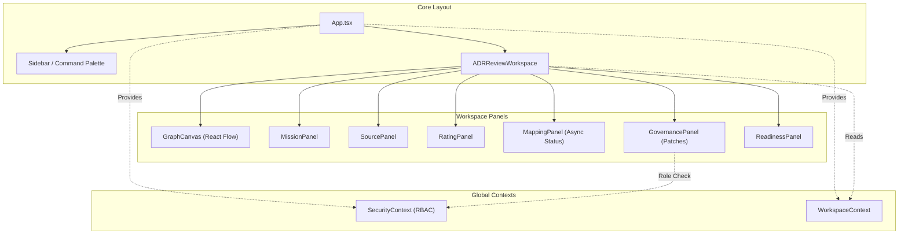

# 🗺️ PROJECT MAP — epios
> Автоматически сгенерировано: `2026-05-15 12:16:40`
> Скрипт: `node dev_studio/refresh.js`

## 📊 Telemetry / Context Health
| Metric | Value | Note |
|---|---|---|
| **Total Files** | `154` | Только JS/TS/TSX исходники |
| **Total Lines** | `16357` | Суммарно по проекту |
| **Project Weight** | `~129 391 tokens` | Оценка (4 символа/токен) |
| **Context Pressure** | `101.1%` | Нагрузка на окно 128k (Full Scan) |
| **Map Efficiency** | `~87%` | Экономия контекста через карту |

---

## Высокоуровневая архитектура
> Связи между основными пакетами и приложениями

```mermaid
flowchart LR

subgraph 0["apps"]
subgraph 1["demo-shell"]
subgraph 2["dist"]
subgraph 3["apps"]
subgraph 4["demo-shell"]
subgraph 5["src"]
6["App.d.ts"]
D["App.js"]
subgraph F["components"]
G["ADRReviewWorkspace.js"]
Y["GovernancePanel.js"]
Z["ReadinessPanel.js"]
10["SecureMcpIframe.js"]
29["ArchiveView.js"]
2H["CommandPalette.js"]
2I["Sidebar.js"]
2J["Modal.js"]
2K["SidebarItem.js"]
2L["WorkspaceRoom.js"]
2M["GraphCanvas.js"]
2U["CustomNode.js"]
2V["MissionPanel.js"]
2W["MappingPanel.js"]
2X["SourcePanel.js"]
2Y["RatingPanel.js"]
30["ADRReviewWorkspace.d.ts"]
31["ArchiveView.d.ts"]
32["CommandPalette.d.ts"]
33["CustomNode.d.ts"]
34["GovernancePanel.d.ts"]
35["GraphCanvas.d.ts"]
36["MappingPanel.d.ts"]
37["MissionPanel.d.ts"]
38["Modal.d.ts"]
39["RatingPanel.d.ts"]
3A["ReadinessPanel.d.ts"]
3B["SecureMcpIframe.d.ts"]
3C["Sidebar.d.ts"]
3D["SidebarItem.d.ts"]
3E["SourcePanel.d.ts"]
3F["WorkspaceRoom.d.ts"]
end
T["api-config.js"]
subgraph U["context"]
V["SecurityContext.js"]
2G["WorkspaceContext.js"]
3G["SecurityContext.d.ts"]
3H["WorkspaceContext.d.ts"]
end
subgraph W["hooks"]
X["useApi.js"]
3I["useApi.d.ts"]
end
2Z["api-config.d.ts"]
3J["i18n.d.ts"]
3Q["i18n.js"]
3X["main.d.ts"]
40["main.js"]
subgraph 45["mcp"]
46["schemas.d.ts"]
47["schemas.js"]
end
end
end
end
subgraph 48["assets"]
49["index-COAmHwb-.js"]
end
subgraph 4C["packages"]
subgraph 4D["domain"]
subgraph 4E["src"]
4F["adr.d.ts"]
4G["adr.js"]
4H["approval.d.ts"]
4I["approval.js"]
4J["artifact.d.ts"]
4K["mission.js"]
4L["errors.js"]
4M["artifact.js"]
4N["decision.d.ts"]
4O["decision.js"]
4P["errors.d.ts"]
4Q["events.d.ts"]
4R["events.js"]
4S["evidence.d.ts"]
4T["evidence.js"]
4U["governance.d.ts"]
4V["node.js"]
4W["governance.js"]
4X["index.d.ts"]
4Y["mapping.js"]
4Z["rating.js"]
50["security.js"]
51["source.js"]
52["workspace.js"]
53["index.js"]
54["mapping.d.ts"]
55["mission.d.ts"]
56["node.d.ts"]
57["rating.d.ts"]
58["security.d.ts"]
59["source.d.ts"]
5A["workspace.d.ts"]
end
end
subgraph 5B["infrastructure-mcp"]
subgraph 5C["src"]
5D["index.d.ts"]
5E["mcp-app.registry.js"]
5F["mcp-bridge.js"]
5G["schemas.js"]
5H["index.js"]
5I["mcp-app.registry.d.ts"]
5J["mcp-bridge.d.ts"]
5K["schemas.d.ts"]
end
end
subgraph 5L["ports"]
subgraph 5M["src"]
5N["adr.repository.port.d.ts"]
5O["adr.repository.port.js"]
5P["artifact.repository.port.d.ts"]
5Q["artifact.repository.port.js"]
5R["decision.repository.port.d.ts"]
5S["decision.repository.port.js"]
5T["domain.repository.port.d.ts"]
5U["domain.repository.port.js"]
5V["evidence.repository.port.d.ts"]
5W["evidence.repository.port.js"]
5X["governance.port.d.ts"]
5Y["governance.port.js"]
5Z["graph.repository.port.d.ts"]
60["graph.repository.port.js"]
61["index.d.ts"]
62["mcp.port.js"]
63["mission.repository.port.js"]
64["outbox.repository.port.js"]
65["security.port.js"]
66["unit-of-work.port.js"]
67["index.js"]
68["mapping.repository.port.d.ts"]
69["mapping.repository.port.js"]
6A["mcp.port.d.ts"]
6B["mission.repository.port.d.ts"]
6C["outbox.repository.port.d.ts"]
6D["security.port.d.ts"]
6E["unit-of-work.port.d.ts"]
end
end
end
end
subgraph 6F["src"]
6G["App.tsx"]
subgraph 6H["components"]
6I["ADRReviewWorkspace.tsx"]
6O["GovernancePanel.tsx"]
6P["ReadinessPanel.tsx"]
6Q["SecureMcpIframe.tsx"]
6R["ArchiveView.tsx"]
6T["CommandPalette.tsx"]
6U["Sidebar.tsx"]
6V["Modal.tsx"]
6W["SidebarItem.tsx"]
6X["WorkspaceRoom.tsx"]
6Y["GraphCanvas.tsx"]
6Z["CustomNode.tsx"]
70["MissionPanel.tsx"]
71["MappingPanel.tsx"]
72["SourcePanel.tsx"]
73["RatingPanel.tsx"]
end
6J["api-config.ts"]
subgraph 6K["context"]
6L["SecurityContext.tsx"]
6S["WorkspaceContext.tsx"]
end
subgraph 6M["hooks"]
6N["useApi.ts"]
end
74["i18n.ts"]
75["main.tsx"]
76["index.css"]
subgraph 77["mcp"]
78["schemas.ts"]
end
end
end
end
subgraph 7["node_modules"]
subgraph 8[".pnpm"]
subgraph 9["react@18.3.1"]
subgraph A["node_modules"]
subgraph B["react"]
C["jsx-runtime.js"]
E["index.js"]
end
end
end
subgraph H["framer-motion@12.38.0_react-dom@18.3.1_react@18.3.1__react@18.3.1"]
subgraph I["node_modules"]
subgraph J["framer-motion"]
subgraph K["dist"]
subgraph L["cjs"]
M["index.js"]
end
end
end
end
end
subgraph N["lucide-react@1.14.0_react@18.3.1"]
subgraph O["node_modules"]
subgraph P["lucide-react"]
subgraph Q["dist"]
subgraph R["cjs"]
S["lucide-react.js"]
end
end
end
end
end
subgraph 25["zod@4.4.3"]
subgraph 26["node_modules"]
subgraph 27["zod"]
28["index.js"]
end
end
end
subgraph 2A["react-i18next@17.0.7_i18next@26.1.0_typescript@5.9.3__react-dom@18.3.1_react@18.3.1__react@18.3.1_typescript@5.9.3"]
subgraph 2B["node_modules"]
subgraph 2C["react-i18next"]
subgraph 2D["dist"]
subgraph 2E["es"]
2F["index.js"]
end
end
end
end
end
subgraph 2N["reactflow@11.11.4_@types+react@18.3.28_react-dom@18.3.1_react@18.3.1__react@18.3.1"]
subgraph 2O["node_modules"]
subgraph 2P["reactflow"]
subgraph 2Q["dist"]
subgraph 2R["esm"]
2S["index.mjs"]
end
2T["style.css"]
end
end
end
end
subgraph 3K["i18next@26.1.0_typescript@5.9.3"]
subgraph 3L["node_modules"]
subgraph 3M["i18next"]
subgraph 3N["dist"]
subgraph 3O["esm"]
3P["i18next.js"]
end
end
end
end
end
subgraph 3R["i18next-browser-languagedetector@8.2.1"]
subgraph 3S["node_modules"]
subgraph 3T["i18next-browser-languagedetector"]
subgraph 3U["dist"]
subgraph 3V["esm"]
3W["i18nextBrowserLanguageDetector.js"]
end
end
end
end
end
subgraph 41["react-dom@18.3.1_react@18.3.1"]
subgraph 42["node_modules"]
subgraph 43["react-dom"]
44["client.js"]
end
end
end
subgraph 7H["@fastify+cors@8.5.0"]
subgraph 7I["node_modules"]
subgraph 7J["@fastify"]
subgraph 7K["cors"]
7L["index.js"]
end
end
end
end
subgraph 7M["dotenv@16.6.1"]
subgraph 7N["node_modules"]
subgraph 7O["dotenv"]
subgraph 7P["lib"]
7Q["main.js"]
end
end
end
end
subgraph 7R["dotenv-expand@11.0.7"]
subgraph 7S["node_modules"]
subgraph 7T["dotenv-expand"]
subgraph 7U["lib"]
7V["main.js"]
end
end
end
end
subgraph 7W["drizzle-orm@0.45.2_postgres@3.4.9"]
subgraph 7X["node_modules"]
subgraph 7Y["drizzle-orm"]
subgraph 7Z["postgres-js"]
80["index.js"]
end
9S["index.js"]
subgraph 9U["pg-core"]
9V["index.js"]
end
end
end
end
subgraph 81["fastify@4.29.1"]
subgraph 82["node_modules"]
subgraph 83["fastify"]
84["fastify.js"]
end
end
end
subgraph 85["postgres@3.4.9"]
subgraph 86["node_modules"]
subgraph 87["postgres"]
subgraph 88["src"]
89["index.js"]
end
end
end
end
subgraph AJ["vitest@1.6.1_@types+node@25.7.0"]
subgraph AK["node_modules"]
subgraph AL["vitest"]
subgraph AM["dist"]
AN["index.js"]
AR["config.cjs"]
end
end
end
end
subgraph DT["drizzle-kit@0.31.10"]
subgraph DU["node_modules"]
subgraph DV["drizzle-kit"]
DW["index.mjs"]
end
end
end
end
end
subgraph 11["packages"]
subgraph 12["infrastructure-mcp"]
subgraph 13["src"]
14["index.ts"]
15["mcp-app.registry.ts"]
23["mcp-bridge.ts"]
24["schemas.ts"]
end
subgraph BA["dist"]
subgraph BB["domain"]
subgraph BC["src"]
BD["adr.d.ts"]
BE["adr.js"]
BF["approval.d.ts"]
BG["approval.js"]
BH["artifact.d.ts"]
BI["mission.js"]
BJ["errors.js"]
BK["artifact.js"]
BL["decision.d.ts"]
BM["decision.js"]
BN["errors.d.ts"]
BO["events.d.ts"]
BP["events.js"]
BQ["evidence.d.ts"]
BR["evidence.js"]
BS["governance.d.ts"]
BT["node.js"]
BU["governance.js"]
BV["index.d.ts"]
BW["mapping.js"]
BX["rating.js"]
BY["security.js"]
BZ["source.js"]
C0["workspace.js"]
C1["index.js"]
C2["mapping.d.ts"]
C3["mission.d.ts"]
C4["node.d.ts"]
C5["rating.d.ts"]
C6["security.d.ts"]
C7["source.d.ts"]
C8["workspace.d.ts"]
end
end
C9["index.d.ts"]
CA["mcp-app.registry.js"]
CB["mcp-bridge.js"]
CC["index.js"]
subgraph CD["infrastructure-mcp"]
subgraph CE["src"]
CF["index.d.ts"]
CG["mcp-app.registry.js"]
CH["mcp-bridge.js"]
CI["schemas.js"]
CJ["index.js"]
CK["mcp-app.registry.d.ts"]
CL["mcp-bridge.d.ts"]
CM["schemas.d.ts"]
end
end
CN["mcp-app.registry.d.ts"]
CQ["mcp-bridge.d.ts"]
subgraph CR["ports"]
subgraph CS["src"]
CT["adr.repository.port.d.ts"]
CU["adr.repository.port.js"]
CV["artifact.repository.port.d.ts"]
CW["artifact.repository.port.js"]
CX["decision.repository.port.d.ts"]
CY["decision.repository.port.js"]
CZ["domain.repository.port.d.ts"]
D0["domain.repository.port.js"]
D1["evidence.repository.port.d.ts"]
D2["evidence.repository.port.js"]
D3["governance.port.d.ts"]
D4["governance.port.js"]
D5["graph.repository.port.d.ts"]
D6["graph.repository.port.js"]
D7["index.d.ts"]
D8["mcp.port.js"]
D9["mission.repository.port.js"]
DA["outbox.repository.port.js"]
DB["security.port.js"]
DC["unit-of-work.port.js"]
DD["index.js"]
DE["mapping.repository.port.d.ts"]
DF["mapping.repository.port.js"]
DG["mcp.port.d.ts"]
DH["mission.repository.port.d.ts"]
DI["outbox.repository.port.d.ts"]
DJ["security.port.d.ts"]
DK["unit-of-work.port.d.ts"]
end
end
end
subgraph DL["test"]
DM["mcp-bridge.test.ts"]
DN["security.test.ts"]
DO["smoke.test.ts"]
end
end
subgraph 16["ports"]
subgraph 17["src"]
18["index.ts"]
19["adr.repository.port.ts"]
1S["artifact.repository.port.ts"]
1T["decision.repository.port.ts"]
1U["domain.repository.port.ts"]
1V["evidence.repository.port.ts"]
1W["governance.port.ts"]
1X["graph.repository.port.ts"]
1Y["mcp.port.ts"]
1Z["mission.repository.port.ts"]
20["outbox.repository.port.ts"]
21["security.port.ts"]
22["unit-of-work.port.ts"]
E1["mapping.repository.port.ts"]
end
end
subgraph 1A["domain"]
subgraph 1B["src"]
1C["index.ts"]
1D["adr.ts"]
1E["approval.ts"]
1F["mission.ts"]
1G["errors.ts"]
1H["events.ts"]
1I["artifact.ts"]
1J["decision.ts"]
1K["evidence.ts"]
1L["governance.ts"]
1M["node.ts"]
1N["mapping.ts"]
1O["rating.ts"]
1P["security.ts"]
1Q["source.ts"]
1R["workspace.ts"]
end
subgraph AY["coverage"]
AZ["block-navigation.js"]
B0["prettify.js"]
B1["sorter.js"]
end
subgraph B2["test"]
B3["domain-smoke.test.ts"]
B4["evidence.test.ts"]
B5["mission.test.ts"]
B6["node-invariants.test.ts"]
B7["source-rating.test.ts"]
B8["workspace.test.ts"]
end
B9["vitest.config.ts"]
end
subgraph 79["api"]
subgraph 7A["coverage"]
7B["block-navigation.js"]
7C["prettify.js"]
7D["sorter.js"]
end
subgraph 7E["src"]
7F["bin.ts"]
7G["server.ts"]
8A["mock-data.ts"]
subgraph 8B["routes"]
8C["adr.routes.ts"]
9F["governance.routes.ts"]
9G["mapping.routes.ts"]
9J["mcp.routes.ts"]
9K["rating.routes.ts"]
9L["security.routes.ts"]
9M["source.routes.ts"]
9N["workspace.routes.ts"]
end
subgraph 9H["dto"]
9I["index.ts"]
end
subgraph AD["contracts"]
AE["openapi.ts"]
AF["schemas.ts"]
end
AG["index.ts"]
end
subgraph AH["test"]
AI["adr.test.ts"]
AO["api.test.ts"]
end
AP["vitest.config.ts"]
end
subgraph 8D["application"]
subgraph 8E["src"]
8F["index.ts"]
8G["mapping-processor.ts"]
subgraph 8H["use-cases"]
8I["add-edge.ts"]
8P["add-node.ts"]
8Q["adr-use-cases.ts"]
8R["apply-patch.ts"]
8S["apply-retention.ts"]
8T["assess-readiness.ts"]
8U["cast-vote.ts"]
8V["create-mission.ts"]
8W["create-workspace.ts"]
8X["get-mapping-run.ts"]
8Y["get-node-ratings.ts"]
8Z["get-readiness.ts"]
90["get-trace.ts"]
91["get-workspace-graph.ts"]
92["ingest-source.ts"]
93["list-mapping-runs.ts"]
94["list-patches.ts"]
95["list-sources.ts"]
96["list-workspaces.ts"]
97["patch-node.ts"]
98["patch-workspace.ts"]
99["propose-patch.ts"]
9A["rate-node.ts"]
9B["redact-node.ts"]
9C["run-mapping.ts"]
9D["submit-claim.ts"]
9E["update-mission-brief.ts"]
end
end
subgraph AS["test"]
AT["async-runtime.test.ts"]
AU["create-workspace.test.ts"]
AV["mission.use-cases.test.ts"]
AW["use-cases.test.ts"]
end
AX["vitest.config.ts"]
end
subgraph 8K["observability"]
subgraph 8L["src"]
8M["index.ts"]
8N["audit.ts"]
8O["tracer.ts"]
end
subgraph DZ["test"]
E0["redaction.test.ts"]
end
end
subgraph 9O["infrastructure-postgres"]
subgraph 9P["src"]
9Q["index.ts"]
9R["governance.repository.ts"]
9T["schema.ts"]
9W["graph.repository.ts"]
9X["identity.repository.ts"]
9Y["outbox.repository.ts"]
9Z["rating.repository.ts"]
A0["source.repository.ts"]
A1["unit-of-work.ts"]
A2["evidence.repository.ts"]
A3["mission.repository.ts"]
A4["workspace.repository.ts"]
DX["manual_migrate.ts"]
DY["seed.ts"]
end
DS["drizzle.config.ts"]
end
subgraph A5["infrastructure-runtime"]
subgraph A6["src"]
A7["index.ts"]
A8["in-memory-governance.repository.ts"]
A9["in-memory-repositories.ts"]
AA["in-memory-unit-of-work.ts"]
AB["outbox-worker.ts"]
AC["security-mocks.ts"]
end
end
subgraph DP["infrastructure-models"]
subgraph DQ["src"]
DR["index.ts"]
end
end
subgraph E2["testing"]
subgraph E3["src"]
E4["fixtures.ts"]
E5["index.ts"]
end
end
end
subgraph 3Y["."]
3Z["index.css"]
end
subgraph 4A["@emotion"]
4B["is-prop-valid"]
end
8J["crypto"]
AQ["path"]
subgraph CO["@epos"]
CP["ports"]
end
6-->C
D-->G
D-->29
D-->2H
D-->2I
D-->2L
D-->2G
D-->E
D-->C
G-->T
G-->V
G-->X
G-->Y
G-->Z
G-->10
G-->M
G-->S
G-->E
G-->C
V-->T
V-->E
V-->C
X-->T
X-->E
Y-->T
Y-->V
Y-->M
Y-->S
Y-->E
Y-->C
Z-->T
Z-->M
Z-->S
Z-->E
Z-->C
10-->14
10-->E
10-->C
14-->15
14-->23
14-->24
15-->18
18-->19
18-->1S
18-->1T
18-->1U
18-->1V
18-->1W
18-->1X
18-->1Y
18-->1Z
18-->20
18-->21
18-->22
19-->1C
1C-->1D
1C-->1E
1C-->1I
1C-->1J
1C-->1G
1C-->1H
1C-->1K
1C-->1L
1C-->1N
1C-->1F
1C-->1M
1C-->1O
1C-->1P
1C-->1Q
1C-->1R
1E-->1F
1F-->1G
1F-->1H
1I-->1G
1I-->1F
1J-->1F
1K-->1G
1L-->1G
1L-->1H
1L-->1M
1M-->1G
1M-->1H
1Q-->1G
1R-->1G
1S-->1C
1T-->1C
1U-->1C
1V-->1C
1W-->1C
1X-->1C
1Z-->1C
21-->1C
22-->1S
22-->1T
22-->1U
22-->1V
22-->1W
22-->1X
22-->1Z
22-->20
23-->24
23-->1C
23-->18
24-->28
29-->2G
29-->M
29-->S
29-->2F
29-->C
2G-->E
2G-->C
2H-->2G
2H-->M
2H-->S
2H-->E
2H-->C
2I-->T
2I-->V
2I-->2G
2I-->X
2I-->2J
2I-->2K
2I-->M
2I-->S
2I-->E
2I-->2F
2I-->C
2J-->M
2J-->S
2J-->E
2J-->C
2K-->M
2K-->S
2K-->E
2K-->2F
2K-->C
2L-->T
2L-->V
2L-->2G
2L-->2M
2L-->2V
2L-->2Y
2L-->M
2L-->S
2L-->E
2L-->C
2M-->2G
2M-->X
2M-->2U
2M-->S
2M-->E
2M-->C
2M-->2S
2M-->2T
2U-->S
2U-->E
2U-->C
2U-->2S
2V-->Y
2V-->2W
2V-->2X
2V-->M
2V-->S
2V-->E
2V-->C
2W-->T
2W-->M
2W-->S
2W-->E
2W-->C
2X-->T
2X-->M
2X-->S
2X-->E
2X-->C
2Y-->T
2Y-->S
2Y-->E
2Y-->C
30-->E
31-->E
32-->E
33-->E
33-->C
33-->2S
34-->E
35-->E
35-->2T
36-->E
37-->1C
37-->E
38-->E
39-->E
3A-->E
3B-->E
3C-->E
3D-->E
3E-->E
3F-->E
3G-->1C
3G-->E
3H-->1C
3H-->E
3H-->2S
3J-->3P
3Q-->3P
3Q-->3W
3Q-->2F
3X-->3Q
3X-->3Z
3X-->2T
40-->D
40-->V
40-->2G
40-->3Q
40-->3Z
40-->E
40-->44
40-->C
40-->2T
46-->28
47-->28
49-->4B
4J-->4K
4K-->4L
4M-->4L
4N-->4K
4T-->4L
4U-->4R
4U-->4V
4V-->4L
4W-->4L
4X-->4G
4X-->4I
4X-->4M
4X-->4O
4X-->4L
4X-->4R
4X-->4T
4X-->4W
4X-->4Y
4X-->4K
4X-->4V
4X-->4Z
4X-->50
4X-->51
4X-->52
51-->4L
52-->4L
53-->4G
53-->4I
53-->4M
53-->4O
53-->4L
53-->4R
53-->4T
53-->4W
53-->4Y
53-->4K
53-->4V
53-->4Z
53-->50
53-->51
53-->52
55-->4R
56-->4R
5D-->5E
5D-->5F
5D-->5G
5F-->5G
5F-->1C
5G-->28
5H-->5E
5H-->5F
5H-->5G
5I-->18
5J-->18
5K-->28
5N-->1C
5P-->1C
5R-->1C
5T-->1C
5V-->1C
5X-->1C
5Z-->1C
61-->5O
61-->5Q
61-->5S
61-->5U
61-->5W
61-->5Y
61-->60
61-->62
61-->63
61-->64
61-->65
61-->66
67-->5O
67-->5Q
67-->5S
67-->5U
67-->5W
67-->5Y
67-->60
67-->62
67-->63
67-->64
67-->65
67-->66
68-->1C
6B-->1C
6D-->1C
6E-->5Q
6E-->5S
6E-->5U
6E-->5W
6E-->5Y
6E-->60
6E-->63
6E-->64
6G-->6I
6G-->6R
6G-->6T
6G-->6U
6G-->6X
6G-->6S
6G-->E
6I-->6J
6I-->6L
6I-->6N
6I-->6O
6I-->6P
6I-->6Q
6I-->M
6I-->S
6I-->E
6L-->6J
6L-->1C
6L-->E
6N-->6J
6N-->E
6O-->6J
6O-->6L
6O-->M
6O-->S
6O-->E
6P-->6J
6P-->M
6P-->S
6P-->E
6Q-->14
6Q-->E
6R-->6S
6R-->M
6R-->S
6R-->E
6R-->2F
6S-->1C
6S-->E
6S-->2S
6T-->6S
6T-->M
6T-->S
6T-->E
6U-->6J
6U-->6L
6U-->6S
6U-->6N
6U-->6V
6U-->6W
6U-->1C
6U-->M
6U-->S
6U-->E
6U-->2F
6V-->M
6V-->S
6V-->E
6W-->M
6W-->S
6W-->E
6W-->2F
6X-->6J
6X-->6L
6X-->6S
6X-->6Y
6X-->70
6X-->73
6X-->1C
6X-->M
6X-->S
6X-->E
6Y-->6S
6Y-->6N
6Y-->6Z
6Y-->S
6Y-->E
6Y-->2S
6Y-->2T
6Z-->S
6Z-->E
6Z-->2S
70-->6O
70-->71
70-->72
70-->1C
70-->M
70-->S
70-->E
71-->6J
71-->1C
71-->M
71-->S
71-->E
72-->6J
72-->M
72-->S
72-->E
73-->6J
73-->S
73-->E
74-->3P
74-->3W
74-->2F
75-->6G
75-->6L
75-->6S
75-->74
75-->76
75-->E
75-->44
75-->2T
78-->28
7F-->7G
7G-->8A
7G-->8C
7G-->9F
7G-->9G
7G-->9J
7G-->9K
7G-->9L
7G-->9M
7G-->9N
7G-->8F
7G-->14
7G-->9Q
7G-->A7
7G-->18
7G-->7L
7G-->7Q
7G-->7V
7G-->80
7G-->84
7G-->89
8A-->1C
8C-->8F
8C-->84
8F-->8G
8F-->8I
8F-->8P
8F-->8Q
8F-->8R
8F-->8S
8F-->8T
8F-->8U
8F-->8V
8F-->8W
8F-->8X
8F-->8Y
8F-->8Z
8F-->90
8F-->91
8F-->92
8F-->93
8F-->94
8F-->95
8F-->96
8F-->97
8F-->98
8F-->99
8F-->9A
8F-->9B
8F-->9C
8F-->9D
8F-->9E
8G-->1C
8G-->18
8I-->1C
8I-->8M
8I-->18
8I-->8J
8M-->8N
8M-->8O
8P-->1C
8P-->8M
8P-->18
8P-->8J
8Q-->1C
8Q-->18
8R-->1C
8R-->18
8R-->8J
8S-->1C
8S-->18
8T-->1C
8T-->18
8T-->8J
8U-->1C
8U-->8M
8U-->18
8U-->8J
8V-->1C
8V-->18
8V-->8J
8W-->1C
8W-->8M
8W-->18
8W-->8J
8X-->1C
8X-->18
8Y-->1C
8Y-->18
8Z-->1C
8Z-->18
90-->1C
90-->18
91-->1C
91-->18
92-->1C
92-->18
92-->8J
93-->1C
93-->18
94-->1C
94-->18
95-->1C
95-->18
96-->1C
96-->18
97-->1C
97-->18
98-->1C
98-->18
99-->1C
99-->18
99-->8J
9A-->1C
9A-->18
9A-->8J
9B-->1C
9B-->18
9C-->1C
9C-->18
9C-->8J
9D-->1C
9D-->18
9D-->8J
9E-->1C
9E-->18
9E-->8J
9F-->8F
9F-->18
9F-->84
9G-->9I
9G-->8F
9G-->84
9I-->1C
9J-->14
9J-->18
9J-->84
9K-->8F
9K-->1C
9K-->84
9L-->8F
9L-->1C
9L-->18
9L-->84
9M-->8F
9M-->1C
9M-->84
9N-->9I
9N-->8F
9N-->84
9Q-->9R
9Q-->9W
9Q-->9X
9Q-->9Y
9Q-->9Z
9Q-->9T
9Q-->A0
9Q-->A1
9Q-->A4
9R-->9T
9R-->1C
9R-->18
9R-->9S
9R-->80
9T-->9V
9W-->9T
9W-->1C
9W-->18
9W-->9S
9W-->80
9X-->9T
9X-->1C
9X-->18
9X-->9S
9X-->80
9Y-->9T
9Y-->18
9Y-->9S
9Y-->80
9Z-->9T
9Z-->1C
9Z-->18
9Z-->9S
9Z-->80
A0-->9T
A0-->1C
A0-->18
A0-->8J
A0-->9S
A0-->80
A1-->A2
A1-->9R
A1-->9W
A1-->A3
A1-->9Y
A1-->9Z
A1-->A0
A1-->A4
A1-->18
A1-->80
A2-->9T
A2-->1C
A2-->9S
A2-->80
A3-->9T
A3-->1C
A3-->18
A3-->9S
A3-->80
A4-->9T
A4-->1C
A4-->18
A4-->9S
A4-->80
A7-->A8
A7-->A9
A7-->AA
A7-->AB
A7-->AC
A8-->1C
A8-->18
A9-->1C
A9-->18
AA-->18
AB-->8M
AB-->18
AC-->1C
AC-->18
AC-->8J
AF-->28
AG-->7G
AI-->7G
AI-->84
AI-->AN
AO-->7G
AO-->1C
AO-->18
AO-->84
AO-->AN
AP-->AQ
AP-->AR
AT-->9C
AT-->18
AT-->8J
AT-->AN
AU-->8W
AU-->18
AU-->AN
AV-->8V
AV-->92
AV-->9C
AV-->9E
AV-->1C
AV-->18
AV-->AN
AW-->8I
AW-->8P
AW-->8U
AW-->8W
AW-->91
AW-->96
AW-->97
AW-->9D
AW-->1C
AW-->18
AW-->AN
AX-->AQ
AX-->AR
B3-->1C
B3-->AN
B4-->1K
B4-->AN
B5-->1F
B5-->AN
B6-->1C
B6-->AN
B7-->1C
B7-->AN
B8-->1G
B8-->1R
B8-->AN
B9-->AR
BH-->BI
BI-->BJ
BK-->BJ
BL-->BI
BR-->BJ
BS-->BP
BS-->BT
BT-->BJ
BU-->BJ
BV-->BE
BV-->BG
BV-->BK
BV-->BM
BV-->BJ
BV-->BP
BV-->BR
BV-->BU
BV-->BW
BV-->BI
BV-->BT
BV-->BX
BV-->BY
BV-->BZ
BV-->C0
BZ-->BJ
C0-->BJ
C1-->BE
C1-->BG
C1-->BK
C1-->BM
C1-->BJ
C1-->BP
C1-->BR
C1-->BU
C1-->BW
C1-->BI
C1-->BT
C1-->BX
C1-->BY
C1-->BZ
C1-->C0
C3-->BP
C4-->BP
C9-->CA
C9-->CB
CC-->CA
CC-->CB
CF-->CG
CF-->CH
CF-->CI
CH-->CI
CH-->1C
CI-->28
CJ-->CG
CJ-->CH
CJ-->CI
CK-->18
CL-->18
CM-->28
CN-->CP
CQ-->CP
CT-->1C
CV-->1C
CX-->1C
CZ-->1C
D1-->1C
D3-->1C
D5-->1C
D7-->CU
D7-->CW
D7-->CY
D7-->D0
D7-->D2
D7-->D4
D7-->D6
D7-->D8
D7-->D9
D7-->DA
D7-->DB
D7-->DC
DD-->CU
DD-->CW
DD-->CY
DD-->D0
DD-->D2
DD-->D4
DD-->D6
DD-->D8
DD-->D9
DD-->DA
DD-->DB
DD-->DC
DE-->1C
DH-->1C
DJ-->1C
DK-->CW
DK-->CY
DK-->D0
DK-->D2
DK-->D4
DK-->D6
DK-->D9
DK-->DA
DM-->23
DM-->18
DM-->AN
DN-->23
DN-->1C
DN-->18
DN-->AN
DO-->AN
DS-->7Q
DS-->7V
DS-->DW
DX-->7Q
DX-->7V
DX-->89
DY-->9T
DY-->7Q
DY-->7V
DY-->80
DY-->89
E0-->8O
E0-->AN
E1-->1C
E4-->1C
E5-->E4
```

## Детальная карта компонентов
> Полный граф зависимостей всех файлов проекта

```mermaid
flowchart LR

subgraph 0["apps"]
subgraph 1["demo-shell"]
subgraph 2["dist"]
subgraph 3["apps"]
subgraph 4["demo-shell"]
subgraph 5["src"]
6["App.d.ts"]
D["App.js"]
subgraph F["components"]
G["ADRReviewWorkspace.js"]
Y["GovernancePanel.js"]
Z["ReadinessPanel.js"]
10["SecureMcpIframe.js"]
29["ArchiveView.js"]
2H["CommandPalette.js"]
2I["Sidebar.js"]
2J["Modal.js"]
2K["SidebarItem.js"]
2L["WorkspaceRoom.js"]
2M["GraphCanvas.js"]
2U["CustomNode.js"]
2V["MissionPanel.js"]
2W["MappingPanel.js"]
2X["SourcePanel.js"]
2Y["RatingPanel.js"]
30["ADRReviewWorkspace.d.ts"]
31["ArchiveView.d.ts"]
32["CommandPalette.d.ts"]
33["CustomNode.d.ts"]
34["GovernancePanel.d.ts"]
35["GraphCanvas.d.ts"]
36["MappingPanel.d.ts"]
37["MissionPanel.d.ts"]
38["Modal.d.ts"]
39["RatingPanel.d.ts"]
3A["ReadinessPanel.d.ts"]
3B["SecureMcpIframe.d.ts"]
3C["Sidebar.d.ts"]
3D["SidebarItem.d.ts"]
3E["SourcePanel.d.ts"]
3F["WorkspaceRoom.d.ts"]
end
T["api-config.js"]
subgraph U["context"]
V["SecurityContext.js"]
2G["WorkspaceContext.js"]
3G["SecurityContext.d.ts"]
3H["WorkspaceContext.d.ts"]
end
subgraph W["hooks"]
X["useApi.js"]
3I["useApi.d.ts"]
end
2Z["api-config.d.ts"]
3J["i18n.d.ts"]
3Q["i18n.js"]
3X["main.d.ts"]
40["main.js"]
subgraph 45["mcp"]
46["schemas.d.ts"]
47["schemas.js"]
end
end
end
end
subgraph 48["assets"]
49["index-COAmHwb-.js"]
end
subgraph 4C["packages"]
subgraph 4D["domain"]
subgraph 4E["src"]
4F["adr.d.ts"]
4G["adr.js"]
4H["approval.d.ts"]
4I["approval.js"]
4J["artifact.d.ts"]
4K["mission.js"]
4L["errors.js"]
4M["artifact.js"]
4N["decision.d.ts"]
4O["decision.js"]
4P["errors.d.ts"]
4Q["events.d.ts"]
4R["events.js"]
4S["evidence.d.ts"]
4T["evidence.js"]
4U["governance.d.ts"]
4V["node.js"]
4W["governance.js"]
4X["index.d.ts"]
4Y["mapping.js"]
4Z["rating.js"]
50["security.js"]
51["source.js"]
52["workspace.js"]
53["index.js"]
54["mapping.d.ts"]
55["mission.d.ts"]
56["node.d.ts"]
57["rating.d.ts"]
58["security.d.ts"]
59["source.d.ts"]
5A["workspace.d.ts"]
end
end
subgraph 5B["infrastructure-mcp"]
subgraph 5C["src"]
5D["index.d.ts"]
5E["mcp-app.registry.js"]
5F["mcp-bridge.js"]
5G["schemas.js"]
5H["index.js"]
5I["mcp-app.registry.d.ts"]
5J["mcp-bridge.d.ts"]
5K["schemas.d.ts"]
end
end
subgraph 5L["ports"]
subgraph 5M["src"]
5N["adr.repository.port.d.ts"]
5O["adr.repository.port.js"]
5P["artifact.repository.port.d.ts"]
5Q["artifact.repository.port.js"]
5R["decision.repository.port.d.ts"]
5S["decision.repository.port.js"]
5T["domain.repository.port.d.ts"]
5U["domain.repository.port.js"]
5V["evidence.repository.port.d.ts"]
5W["evidence.repository.port.js"]
5X["governance.port.d.ts"]
5Y["governance.port.js"]
5Z["graph.repository.port.d.ts"]
60["graph.repository.port.js"]
61["index.d.ts"]
62["mcp.port.js"]
63["mission.repository.port.js"]
64["outbox.repository.port.js"]
65["security.port.js"]
66["unit-of-work.port.js"]
67["index.js"]
68["mapping.repository.port.d.ts"]
69["mapping.repository.port.js"]
6A["mcp.port.d.ts"]
6B["mission.repository.port.d.ts"]
6C["outbox.repository.port.d.ts"]
6D["security.port.d.ts"]
6E["unit-of-work.port.d.ts"]
end
end
end
end
subgraph 6F["src"]
6G["App.tsx"]
subgraph 6H["components"]
6I["ADRReviewWorkspace.tsx"]
6O["GovernancePanel.tsx"]
6P["ReadinessPanel.tsx"]
6Q["SecureMcpIframe.tsx"]
6R["ArchiveView.tsx"]
6T["CommandPalette.tsx"]
6U["Sidebar.tsx"]
6V["Modal.tsx"]
6W["SidebarItem.tsx"]
6X["WorkspaceRoom.tsx"]
6Y["GraphCanvas.tsx"]
6Z["CustomNode.tsx"]
70["MissionPanel.tsx"]
71["MappingPanel.tsx"]
72["SourcePanel.tsx"]
73["RatingPanel.tsx"]
end
6J["api-config.ts"]
subgraph 6K["context"]
6L["SecurityContext.tsx"]
6S["WorkspaceContext.tsx"]
end
subgraph 6M["hooks"]
6N["useApi.ts"]
end
74["i18n.ts"]
75["main.tsx"]
76["index.css"]
subgraph 77["mcp"]
78["schemas.ts"]
end
end
end
end
subgraph 7["node_modules"]
subgraph 8[".pnpm"]
subgraph 9["react@18.3.1"]
subgraph A["node_modules"]
subgraph B["react"]
C["jsx-runtime.js"]
E["index.js"]
end
end
end
subgraph H["framer-motion@12.38.0_react-dom@18.3.1_react@18.3.1__react@18.3.1"]
subgraph I["node_modules"]
subgraph J["framer-motion"]
subgraph K["dist"]
subgraph L["cjs"]
M["index.js"]
end
end
end
end
end
subgraph N["lucide-react@1.14.0_react@18.3.1"]
subgraph O["node_modules"]
subgraph P["lucide-react"]
subgraph Q["dist"]
subgraph R["cjs"]
S["lucide-react.js"]
end
end
end
end
end
subgraph 25["zod@4.4.3"]
subgraph 26["node_modules"]
subgraph 27["zod"]
28["index.js"]
end
end
end
subgraph 2A["react-i18next@17.0.7_i18next@26.1.0_typescript@5.9.3__react-dom@18.3.1_react@18.3.1__react@18.3.1_typescript@5.9.3"]
subgraph 2B["node_modules"]
subgraph 2C["react-i18next"]
subgraph 2D["dist"]
subgraph 2E["es"]
2F["index.js"]
end
end
end
end
end
subgraph 2N["reactflow@11.11.4_@types+react@18.3.28_react-dom@18.3.1_react@18.3.1__react@18.3.1"]
subgraph 2O["node_modules"]
subgraph 2P["reactflow"]
subgraph 2Q["dist"]
subgraph 2R["esm"]
2S["index.mjs"]
end
2T["style.css"]
end
end
end
end
subgraph 3K["i18next@26.1.0_typescript@5.9.3"]
subgraph 3L["node_modules"]
subgraph 3M["i18next"]
subgraph 3N["dist"]
subgraph 3O["esm"]
3P["i18next.js"]
end
end
end
end
end
subgraph 3R["i18next-browser-languagedetector@8.2.1"]
subgraph 3S["node_modules"]
subgraph 3T["i18next-browser-languagedetector"]
subgraph 3U["dist"]
subgraph 3V["esm"]
3W["i18nextBrowserLanguageDetector.js"]
end
end
end
end
end
subgraph 41["react-dom@18.3.1_react@18.3.1"]
subgraph 42["node_modules"]
subgraph 43["react-dom"]
44["client.js"]
end
end
end
subgraph 7H["@fastify+cors@8.5.0"]
subgraph 7I["node_modules"]
subgraph 7J["@fastify"]
subgraph 7K["cors"]
7L["index.js"]
end
end
end
end
subgraph 7M["dotenv@16.6.1"]
subgraph 7N["node_modules"]
subgraph 7O["dotenv"]
subgraph 7P["lib"]
7Q["main.js"]
end
end
end
end
subgraph 7R["dotenv-expand@11.0.7"]
subgraph 7S["node_modules"]
subgraph 7T["dotenv-expand"]
subgraph 7U["lib"]
7V["main.js"]
end
end
end
end
subgraph 7W["drizzle-orm@0.45.2_postgres@3.4.9"]
subgraph 7X["node_modules"]
subgraph 7Y["drizzle-orm"]
subgraph 7Z["postgres-js"]
80["index.js"]
end
9S["index.js"]
subgraph 9U["pg-core"]
9V["index.js"]
end
end
end
end
subgraph 81["fastify@4.29.1"]
subgraph 82["node_modules"]
subgraph 83["fastify"]
84["fastify.js"]
end
end
end
subgraph 85["postgres@3.4.9"]
subgraph 86["node_modules"]
subgraph 87["postgres"]
subgraph 88["src"]
89["index.js"]
end
end
end
end
subgraph AJ["vitest@1.6.1_@types+node@25.7.0"]
subgraph AK["node_modules"]
subgraph AL["vitest"]
subgraph AM["dist"]
AN["index.js"]
AR["config.cjs"]
end
end
end
end
subgraph DT["drizzle-kit@0.31.10"]
subgraph DU["node_modules"]
subgraph DV["drizzle-kit"]
DW["index.mjs"]
end
end
end
end
end
subgraph 11["packages"]
subgraph 12["infrastructure-mcp"]
subgraph 13["src"]
14["index.ts"]
15["mcp-app.registry.ts"]
23["mcp-bridge.ts"]
24["schemas.ts"]
end
subgraph BA["dist"]
subgraph BB["domain"]
subgraph BC["src"]
BD["adr.d.ts"]
BE["adr.js"]
BF["approval.d.ts"]
BG["approval.js"]
BH["artifact.d.ts"]
BI["mission.js"]
BJ["errors.js"]
BK["artifact.js"]
BL["decision.d.ts"]
BM["decision.js"]
BN["errors.d.ts"]
BO["events.d.ts"]
BP["events.js"]
BQ["evidence.d.ts"]
BR["evidence.js"]
BS["governance.d.ts"]
BT["node.js"]
BU["governance.js"]
BV["index.d.ts"]
BW["mapping.js"]
BX["rating.js"]
BY["security.js"]
BZ["source.js"]
C0["workspace.js"]
C1["index.js"]
C2["mapping.d.ts"]
C3["mission.d.ts"]
C4["node.d.ts"]
C5["rating.d.ts"]
C6["security.d.ts"]
C7["source.d.ts"]
C8["workspace.d.ts"]
end
end
C9["index.d.ts"]
CA["mcp-app.registry.js"]
CB["mcp-bridge.js"]
CC["index.js"]
subgraph CD["infrastructure-mcp"]
subgraph CE["src"]
CF["index.d.ts"]
CG["mcp-app.registry.js"]
CH["mcp-bridge.js"]
CI["schemas.js"]
CJ["index.js"]
CK["mcp-app.registry.d.ts"]
CL["mcp-bridge.d.ts"]
CM["schemas.d.ts"]
end
end
CN["mcp-app.registry.d.ts"]
CQ["mcp-bridge.d.ts"]
subgraph CR["ports"]
subgraph CS["src"]
CT["adr.repository.port.d.ts"]
CU["adr.repository.port.js"]
CV["artifact.repository.port.d.ts"]
CW["artifact.repository.port.js"]
CX["decision.repository.port.d.ts"]
CY["decision.repository.port.js"]
CZ["domain.repository.port.d.ts"]
D0["domain.repository.port.js"]
D1["evidence.repository.port.d.ts"]
D2["evidence.repository.port.js"]
D3["governance.port.d.ts"]
D4["governance.port.js"]
D5["graph.repository.port.d.ts"]
D6["graph.repository.port.js"]
D7["index.d.ts"]
D8["mcp.port.js"]
D9["mission.repository.port.js"]
DA["outbox.repository.port.js"]
DB["security.port.js"]
DC["unit-of-work.port.js"]
DD["index.js"]
DE["mapping.repository.port.d.ts"]
DF["mapping.repository.port.js"]
DG["mcp.port.d.ts"]
DH["mission.repository.port.d.ts"]
DI["outbox.repository.port.d.ts"]
DJ["security.port.d.ts"]
DK["unit-of-work.port.d.ts"]
end
end
end
subgraph DL["test"]
DM["mcp-bridge.test.ts"]
DN["security.test.ts"]
DO["smoke.test.ts"]
end
end
subgraph 16["ports"]
subgraph 17["src"]
18["index.ts"]
19["adr.repository.port.ts"]
1S["artifact.repository.port.ts"]
1T["decision.repository.port.ts"]
1U["domain.repository.port.ts"]
1V["evidence.repository.port.ts"]
1W["governance.port.ts"]
1X["graph.repository.port.ts"]
1Y["mcp.port.ts"]
1Z["mission.repository.port.ts"]
20["outbox.repository.port.ts"]
21["security.port.ts"]
22["unit-of-work.port.ts"]
E1["mapping.repository.port.ts"]
end
end
subgraph 1A["domain"]
subgraph 1B["src"]
1C["index.ts"]
1D["adr.ts"]
1E["approval.ts"]
1F["mission.ts"]
1G["errors.ts"]
1H["events.ts"]
1I["artifact.ts"]
1J["decision.ts"]
1K["evidence.ts"]
1L["governance.ts"]
1M["node.ts"]
1N["mapping.ts"]
1O["rating.ts"]
1P["security.ts"]
1Q["source.ts"]
1R["workspace.ts"]
end
subgraph AY["coverage"]
AZ["block-navigation.js"]
B0["prettify.js"]
B1["sorter.js"]
end
subgraph B2["test"]
B3["domain-smoke.test.ts"]
B4["evidence.test.ts"]
B5["mission.test.ts"]
B6["node-invariants.test.ts"]
B7["source-rating.test.ts"]
B8["workspace.test.ts"]
end
B9["vitest.config.ts"]
end
subgraph 79["api"]
subgraph 7A["coverage"]
7B["block-navigation.js"]
7C["prettify.js"]
7D["sorter.js"]
end
subgraph 7E["src"]
7F["bin.ts"]
7G["server.ts"]
8A["mock-data.ts"]
subgraph 8B["routes"]
8C["adr.routes.ts"]
9F["governance.routes.ts"]
9G["mapping.routes.ts"]
9J["mcp.routes.ts"]
9K["rating.routes.ts"]
9L["security.routes.ts"]
9M["source.routes.ts"]
9N["workspace.routes.ts"]
end
subgraph 9H["dto"]
9I["index.ts"]
end
subgraph AD["contracts"]
AE["openapi.ts"]
AF["schemas.ts"]
end
AG["index.ts"]
end
subgraph AH["test"]
AI["adr.test.ts"]
AO["api.test.ts"]
end
AP["vitest.config.ts"]
end
subgraph 8D["application"]
subgraph 8E["src"]
8F["index.ts"]
8G["mapping-processor.ts"]
subgraph 8H["use-cases"]
8I["add-edge.ts"]
8P["add-node.ts"]
8Q["adr-use-cases.ts"]
8R["apply-patch.ts"]
8S["apply-retention.ts"]
8T["assess-readiness.ts"]
8U["cast-vote.ts"]
8V["create-mission.ts"]
8W["create-workspace.ts"]
8X["get-mapping-run.ts"]
8Y["get-node-ratings.ts"]
8Z["get-readiness.ts"]
90["get-trace.ts"]
91["get-workspace-graph.ts"]
92["ingest-source.ts"]
93["list-mapping-runs.ts"]
94["list-patches.ts"]
95["list-sources.ts"]
96["list-workspaces.ts"]
97["patch-node.ts"]
98["patch-workspace.ts"]
99["propose-patch.ts"]
9A["rate-node.ts"]
9B["redact-node.ts"]
9C["run-mapping.ts"]
9D["submit-claim.ts"]
9E["update-mission-brief.ts"]
end
end
subgraph AS["test"]
AT["async-runtime.test.ts"]
AU["create-workspace.test.ts"]
AV["mission.use-cases.test.ts"]
AW["use-cases.test.ts"]
end
AX["vitest.config.ts"]
end
subgraph 8K["observability"]
subgraph 8L["src"]
8M["index.ts"]
8N["audit.ts"]
8O["tracer.ts"]
end
subgraph DZ["test"]
E0["redaction.test.ts"]
end
end
subgraph 9O["infrastructure-postgres"]
subgraph 9P["src"]
9Q["index.ts"]
9R["governance.repository.ts"]
9T["schema.ts"]
9W["graph.repository.ts"]
9X["identity.repository.ts"]
9Y["outbox.repository.ts"]
9Z["rating.repository.ts"]
A0["source.repository.ts"]
A1["unit-of-work.ts"]
A2["evidence.repository.ts"]
A3["mission.repository.ts"]
A4["workspace.repository.ts"]
DX["manual_migrate.ts"]
DY["seed.ts"]
end
DS["drizzle.config.ts"]
end
subgraph A5["infrastructure-runtime"]
subgraph A6["src"]
A7["index.ts"]
A8["in-memory-governance.repository.ts"]
A9["in-memory-repositories.ts"]
AA["in-memory-unit-of-work.ts"]
AB["outbox-worker.ts"]
AC["security-mocks.ts"]
end
end
subgraph DP["infrastructure-models"]
subgraph DQ["src"]
DR["index.ts"]
end
end
subgraph E2["testing"]
subgraph E3["src"]
E4["fixtures.ts"]
E5["index.ts"]
end
end
end
subgraph 3Y["."]
3Z["index.css"]
end
subgraph 4A["@emotion"]
4B["is-prop-valid"]
end
8J["crypto"]
AQ["path"]
subgraph CO["@epos"]
CP["ports"]
end
6-->C
D-->G
D-->29
D-->2H
D-->2I
D-->2L
D-->2G
D-->E
D-->C
G-->T
G-->V
G-->X
G-->Y
G-->Z
G-->10
G-->M
G-->S
G-->E
G-->C
V-->T
V-->E
V-->C
X-->T
X-->E
Y-->T
Y-->V
Y-->M
Y-->S
Y-->E
Y-->C
Z-->T
Z-->M
Z-->S
Z-->E
Z-->C
10-->14
10-->E
10-->C
14-->15
14-->23
14-->24
15-->18
18-->19
18-->1S
18-->1T
18-->1U
18-->1V
18-->1W
18-->1X
18-->1Y
18-->1Z
18-->20
18-->21
18-->22
19-->1C
1C-->1D
1C-->1E
1C-->1I
1C-->1J
1C-->1G
1C-->1H
1C-->1K
1C-->1L
1C-->1N
1C-->1F
1C-->1M
1C-->1O
1C-->1P
1C-->1Q
1C-->1R
1E-->1F
1F-->1G
1F-->1H
1I-->1G
1I-->1F
1J-->1F
1K-->1G
1L-->1G
1L-->1H
1L-->1M
1M-->1G
1M-->1H
1Q-->1G
1R-->1G
1S-->1C
1T-->1C
1U-->1C
1V-->1C
1W-->1C
1X-->1C
1Z-->1C
21-->1C
22-->1S
22-->1T
22-->1U
22-->1V
22-->1W
22-->1X
22-->1Z
22-->20
23-->24
23-->1C
23-->18
24-->28
29-->2G
29-->M
29-->S
29-->2F
29-->C
2G-->E
2G-->C
2H-->2G
2H-->M
2H-->S
2H-->E
2H-->C
2I-->T
2I-->V
2I-->2G
2I-->X
2I-->2J
2I-->2K
2I-->M
2I-->S
2I-->E
2I-->2F
2I-->C
2J-->M
2J-->S
2J-->E
2J-->C
2K-->M
2K-->S
2K-->E
2K-->2F
2K-->C
2L-->T
2L-->V
2L-->2G
2L-->2M
2L-->2V
2L-->2Y
2L-->M
2L-->S
2L-->E
2L-->C
2M-->2G
2M-->X
2M-->2U
2M-->S
2M-->E
2M-->C
2M-->2S
2M-->2T
2U-->S
2U-->E
2U-->C
2U-->2S
2V-->Y
2V-->2W
2V-->2X
2V-->M
2V-->S
2V-->E
2V-->C
2W-->T
2W-->M
2W-->S
2W-->E
2W-->C
2X-->T
2X-->M
2X-->S
2X-->E
2X-->C
2Y-->T
2Y-->S
2Y-->E
2Y-->C
30-->E
31-->E
32-->E
33-->E
33-->C
33-->2S
34-->E
35-->E
35-->2T
36-->E
37-->1C
37-->E
38-->E
39-->E
3A-->E
3B-->E
3C-->E
3D-->E
3E-->E
3F-->E
3G-->1C
3G-->E
3H-->1C
3H-->E
3H-->2S
3J-->3P
3Q-->3P
3Q-->3W
3Q-->2F
3X-->3Q
3X-->3Z
3X-->2T
40-->D
40-->V
40-->2G
40-->3Q
40-->3Z
40-->E
40-->44
40-->C
40-->2T
46-->28
47-->28
49-->4B
4J-->4K
4K-->4L
4M-->4L
4N-->4K
4T-->4L
4U-->4R
4U-->4V
4V-->4L
4W-->4L
4X-->4G
4X-->4I
4X-->4M
4X-->4O
4X-->4L
4X-->4R
4X-->4T
4X-->4W
4X-->4Y
4X-->4K
4X-->4V
4X-->4Z
4X-->50
4X-->51
4X-->52
51-->4L
52-->4L
53-->4G
53-->4I
53-->4M
53-->4O
53-->4L
53-->4R
53-->4T
53-->4W
53-->4Y
53-->4K
53-->4V
53-->4Z
53-->50
53-->51
53-->52
55-->4R
56-->4R
5D-->5E
5D-->5F
5D-->5G
5F-->5G
5F-->1C
5G-->28
5H-->5E
5H-->5F
5H-->5G
5I-->18
5J-->18
5K-->28
5N-->1C
5P-->1C
5R-->1C
5T-->1C
5V-->1C
5X-->1C
5Z-->1C
61-->5O
61-->5Q
61-->5S
61-->5U
61-->5W
61-->5Y
61-->60
61-->62
61-->63
61-->64
61-->65
61-->66
67-->5O
67-->5Q
67-->5S
67-->5U
67-->5W
67-->5Y
67-->60
67-->62
67-->63
67-->64
67-->65
67-->66
68-->1C
6B-->1C
6D-->1C
6E-->5Q
6E-->5S
6E-->5U
6E-->5W
6E-->5Y
6E-->60
6E-->63
6E-->64
6G-->6I
6G-->6R
6G-->6T
6G-->6U
6G-->6X
6G-->6S
6G-->E
6I-->6J
6I-->6L
6I-->6N
6I-->6O
6I-->6P
6I-->6Q
6I-->M
6I-->S
6I-->E
6L-->6J
6L-->1C
6L-->E
6N-->6J
6N-->E
6O-->6J
6O-->6L
6O-->M
6O-->S
6O-->E
6P-->6J
6P-->M
6P-->S
6P-->E
6Q-->14
6Q-->E
6R-->6S
6R-->M
6R-->S
6R-->E
6R-->2F
6S-->1C
6S-->E
6S-->2S
6T-->6S
6T-->M
6T-->S
6T-->E
6U-->6J
6U-->6L
6U-->6S
6U-->6N
6U-->6V
6U-->6W
6U-->1C
6U-->M
6U-->S
6U-->E
6U-->2F
6V-->M
6V-->S
6V-->E
6W-->M
6W-->S
6W-->E
6W-->2F
6X-->6J
6X-->6L
6X-->6S
6X-->6Y
6X-->70
6X-->73
6X-->1C
6X-->M
6X-->S
6X-->E
6Y-->6S
6Y-->6N
6Y-->6Z
6Y-->S
6Y-->E
6Y-->2S
6Y-->2T
6Z-->S
6Z-->E
6Z-->2S
70-->6O
70-->71
70-->72
70-->1C
70-->M
70-->S
70-->E
71-->6J
71-->1C
71-->M
71-->S
71-->E
72-->6J
72-->M
72-->S
72-->E
73-->6J
73-->S
73-->E
74-->3P
74-->3W
74-->2F
75-->6G
75-->6L
75-->6S
75-->74
75-->76
75-->E
75-->44
75-->2T
78-->28
7F-->7G
7G-->8A
7G-->8C
7G-->9F
7G-->9G
7G-->9J
7G-->9K
7G-->9L
7G-->9M
7G-->9N
7G-->8F
7G-->14
7G-->9Q
7G-->A7
7G-->18
7G-->7L
7G-->7Q
7G-->7V
7G-->80
7G-->84
7G-->89
8A-->1C
8C-->8F
8C-->84
8F-->8G
8F-->8I
8F-->8P
8F-->8Q
8F-->8R
8F-->8S
8F-->8T
8F-->8U
8F-->8V
8F-->8W
8F-->8X
8F-->8Y
8F-->8Z
8F-->90
8F-->91
8F-->92
8F-->93
8F-->94
8F-->95
8F-->96
8F-->97
8F-->98
8F-->99
8F-->9A
8F-->9B
8F-->9C
8F-->9D
8F-->9E
8G-->1C
8G-->18
8I-->1C
8I-->8M
8I-->18
8I-->8J
8M-->8N
8M-->8O
8P-->1C
8P-->8M
8P-->18
8P-->8J
8Q-->1C
8Q-->18
8R-->1C
8R-->18
8R-->8J
8S-->1C
8S-->18
8T-->1C
8T-->18
8T-->8J
8U-->1C
8U-->8M
8U-->18
8U-->8J
8V-->1C
8V-->18
8V-->8J
8W-->1C
8W-->8M
8W-->18
8W-->8J
8X-->1C
8X-->18
8Y-->1C
8Y-->18
8Z-->1C
8Z-->18
90-->1C
90-->18
91-->1C
91-->18
92-->1C
92-->18
92-->8J
93-->1C
93-->18
94-->1C
94-->18
95-->1C
95-->18
96-->1C
96-->18
97-->1C
97-->18
98-->1C
98-->18
99-->1C
99-->18
99-->8J
9A-->1C
9A-->18
9A-->8J
9B-->1C
9B-->18
9C-->1C
9C-->18
9C-->8J
9D-->1C
9D-->18
9D-->8J
9E-->1C
9E-->18
9E-->8J
9F-->8F
9F-->18
9F-->84
9G-->9I
9G-->8F
9G-->84
9I-->1C
9J-->14
9J-->18
9J-->84
9K-->8F
9K-->1C
9K-->84
9L-->8F
9L-->1C
9L-->18
9L-->84
9M-->8F
9M-->1C
9M-->84
9N-->9I
9N-->8F
9N-->84
9Q-->9R
9Q-->9W
9Q-->9X
9Q-->9Y
9Q-->9Z
9Q-->9T
9Q-->A0
9Q-->A1
9Q-->A4
9R-->9T
9R-->1C
9R-->18
9R-->9S
9R-->80
9T-->9V
9W-->9T
9W-->1C
9W-->18
9W-->9S
9W-->80
9X-->9T
9X-->1C
9X-->18
9X-->9S
9X-->80
9Y-->9T
9Y-->18
9Y-->9S
9Y-->80
9Z-->9T
9Z-->1C
9Z-->18
9Z-->9S
9Z-->80
A0-->9T
A0-->1C
A0-->18
A0-->8J
A0-->9S
A0-->80
A1-->A2
A1-->9R
A1-->9W
A1-->A3
A1-->9Y
A1-->9Z
A1-->A0
A1-->A4
A1-->18
A1-->80
A2-->9T
A2-->1C
A2-->9S
A2-->80
A3-->9T
A3-->1C
A3-->18
A3-->9S
A3-->80
A4-->9T
A4-->1C
A4-->18
A4-->9S
A4-->80
A7-->A8
A7-->A9
A7-->AA
A7-->AB
A7-->AC
A8-->1C
A8-->18
A9-->1C
A9-->18
AA-->18
AB-->8M
AB-->18
AC-->1C
AC-->18
AC-->8J
AF-->28
AG-->7G
AI-->7G
AI-->84
AI-->AN
AO-->7G
AO-->1C
AO-->18
AO-->84
AO-->AN
AP-->AQ
AP-->AR
AT-->9C
AT-->18
AT-->8J
AT-->AN
AU-->8W
AU-->18
AU-->AN
AV-->8V
AV-->92
AV-->9C
AV-->9E
AV-->1C
AV-->18
AV-->AN
AW-->8I
AW-->8P
AW-->8U
AW-->8W
AW-->91
AW-->96
AW-->97
AW-->9D
AW-->1C
AW-->18
AW-->AN
AX-->AQ
AX-->AR
B3-->1C
B3-->AN
B4-->1K
B4-->AN
B5-->1F
B5-->AN
B6-->1C
B6-->AN
B7-->1C
B7-->AN
B8-->1G
B8-->1R
B8-->AN
B9-->AR
BH-->BI
BI-->BJ
BK-->BJ
BL-->BI
BR-->BJ
BS-->BP
BS-->BT
BT-->BJ
BU-->BJ
BV-->BE
BV-->BG
BV-->BK
BV-->BM
BV-->BJ
BV-->BP
BV-->BR
BV-->BU
BV-->BW
BV-->BI
BV-->BT
BV-->BX
BV-->BY
BV-->BZ
BV-->C0
BZ-->BJ
C0-->BJ
C1-->BE
C1-->BG
C1-->BK
C1-->BM
C1-->BJ
C1-->BP
C1-->BR
C1-->BU
C1-->BW
C1-->BI
C1-->BT
C1-->BX
C1-->BY
C1-->BZ
C1-->C0
C3-->BP
C4-->BP
C9-->CA
C9-->CB
CC-->CA
CC-->CB
CF-->CG
CF-->CH
CF-->CI
CH-->CI
CH-->1C
CI-->28
CJ-->CG
CJ-->CH
CJ-->CI
CK-->18
CL-->18
CM-->28
CN-->CP
CQ-->CP
CT-->1C
CV-->1C
CX-->1C
CZ-->1C
D1-->1C
D3-->1C
D5-->1C
D7-->CU
D7-->CW
D7-->CY
D7-->D0
D7-->D2
D7-->D4
D7-->D6
D7-->D8
D7-->D9
D7-->DA
D7-->DB
D7-->DC
DD-->CU
DD-->CW
DD-->CY
DD-->D0
DD-->D2
DD-->D4
DD-->D6
DD-->D8
DD-->D9
DD-->DA
DD-->DB
DD-->DC
DE-->1C
DH-->1C
DJ-->1C
DK-->CW
DK-->CY
DK-->D0
DK-->D2
DK-->D4
DK-->D6
DK-->D9
DK-->DA
DM-->23
DM-->18
DM-->AN
DN-->23
DN-->1C
DN-->18
DN-->AN
DO-->AN
DS-->7Q
DS-->7V
DS-->DW
DX-->7Q
DX-->7V
DX-->89
DY-->9T
DY-->7Q
DY-->7V
DY-->80
DY-->89
E0-->8O
E0-->AN
E1-->1C
E4-->1C
E5-->E4
```

## 🎨 Архитектура UI Интерфейсов (demo-shell)
> Обобщенная концептуальная структура компонентов пользовательского интерфейса



> Подробная документация и Roadmap по развитию интерфейсов находится в [docs/05_ui_roadmap/](docs/05_ui_roadmap/00_ROADMAP_INDEX.md)

## Компонент: `apps`

| Файл | Строк | Размер | Описание |
|---|---|---|---|
| `demo-shell/src/api-config.ts` | 7 | 0.3 KB | Централизованная конфигурация API URL. |
| `demo-shell/src/App.tsx` | 73 | 1.9 KB | — |
| `demo-shell/src/components/ADRReviewWorkspace.tsx` | 853 | 27.9 KB | — |
| `demo-shell/src/components/ArchiveView.tsx` | 247 | 7.4 KB | — |
| `demo-shell/src/components/CommandPalette.tsx` | 341 | 9.1 KB | — |
| `demo-shell/src/components/CustomNode.tsx` | 169 | 4.4 KB | — |
| `demo-shell/src/components/GovernancePanel.tsx` | 498 | 14.7 KB | — |
| `demo-shell/src/components/GraphCanvas.tsx` | 579 | 16.2 KB | — |
| `demo-shell/src/components/MappingPanel.tsx` | 270 | 7.8 KB | — |
| `demo-shell/src/components/MissionPanel.tsx` | 303 | 8.7 KB | — |
| `demo-shell/src/components/Modal.tsx` | 100 | 2.7 KB | — |
| `demo-shell/src/components/RatingPanel.tsx` | 234 | 6.2 KB | — |
| `demo-shell/src/components/ReadinessPanel.tsx` | 403 | 11.7 KB | — |
| `demo-shell/src/components/SecureMcpIframe.tsx` | 101 | 3.0 KB | — |
| `demo-shell/src/components/Sidebar.tsx` | 774 | 24.7 KB | — |
| `demo-shell/src/components/SidebarItem.tsx` | 278 | 7.6 KB | — |
| `demo-shell/src/components/SourcePanel.tsx` | 232 | 6.9 KB | — |
| `demo-shell/src/components/WorkspaceRoom.tsx` | 665 | 21.5 KB | — |
| `demo-shell/src/context/SecurityContext.tsx` | 68 | 1.6 KB | — |
| `demo-shell/src/context/WorkspaceContext.tsx` | 145 | 3.8 KB | — |
| `demo-shell/src/hooks/useApi.ts` | 43 | 1.1 KB | — |
| `demo-shell/src/i18n.ts` | 99 | 3.4 KB | — |
| `demo-shell/src/main.tsx` | 20 | 0.5 KB | — |
| `demo-shell/src/mcp/schemas.ts` | 20 | 0.7 KB | — |

### `demo-shell/src/api-config.ts`
- **Экспорт**: `API_BASE_URL`

### `demo-shell/src/components/ArchiveView.tsx`
- **Экспорт**: `ArchiveView`
- **Зависимости**:
  - `../context/WorkspaceContext` → useWorkspace

### `demo-shell/src/components/GovernancePanel.tsx`
- **Экспорт**: `GovernancePanel`
- **Зависимости**:
  - `../api-config` → API_BASE_URL
  - `../context/SecurityContext` → useSecurity

### `demo-shell/src/components/MappingPanel.tsx`
- **Экспорт**: `MappingPanel`
- **Зависимости**:
  - `../api-config` → API_BASE_URL
  - `@epios/domain` → MappingRun

### `demo-shell/src/components/MissionPanel.tsx`
- **Экспорт**: `MissionPanel`
- **Зависимости**:
  - `./GovernancePanel` → GovernancePanel
  - `./SourcePanel` → SourcePanel
  - `./MappingPanel` → MappingPanel
  - `@epios/domain` → Workspace

### `demo-shell/src/components/Modal.tsx`
- **Экспорт**: `Modal`
- **Зависимости**:

### `demo-shell/src/components/RatingPanel.tsx`
- **Экспорт**: `RatingPanel`
- **Зависимости**:
  - `../api-config` → API_BASE_URL

### `demo-shell/src/components/ReadinessPanel.tsx`
- **Экспорт**: `ReadinessPanel`
- **Зависимости**:
  - `../api-config` → API_BASE_URL

### `demo-shell/src/components/SecureMcpIframe.tsx`
- **Экспорт**: `SecureMcpIframe`
- **Зависимости**:
  - `@epios/infrastructure-mcp` → McpRequestSchema

### `demo-shell/src/components/SidebarItem.tsx`
- **Экспорт**: `SidebarItemProps`, `SidebarItem`
- **Зависимости**:

### `demo-shell/src/components/SourcePanel.tsx`
- **Экспорт**: `SourcePanel`
- **Зависимости**:
  - `../api-config` → API_BASE_URL

### `demo-shell/src/context/SecurityContext.tsx`
- **Экспорт**: `SecurityProvider`, `useSecurity`
- **Зависимости**:
  - `@epios/domain` → User
  - `../api-config` → API_BASE_URL

### `demo-shell/src/context/WorkspaceContext.tsx`
- **Экспорт**: `WorkspaceProvider`, `useWorkspace`
- **Зависимости**:
  - `@epios/domain` → Workspace, WorkspaceStatus

### `demo-shell/src/hooks/useApi.ts`
- **Экспорт**: `useApi`
- **Зависимости**:
  - `../api-config` → API_BASE_URL

### `demo-shell/src/mcp/schemas.ts`
- **Экспорт**: `McpRequestSchema`, `McpResponseSchema`, `McpRequest`, `McpResponse`
- **Зависимости**:

## Компонент: `packages`

| Файл | Строк | Размер | Описание |
|---|---|---|---|
| `api/coverage/block-navigation.js` | 88 | 2.6 KB | — |
| `api/coverage/prettify.js` | 3 | 17.2 KB | — |
| `api/coverage/sorter.js` | 211 | 6.6 KB | — |
| `api/src/bin.ts` | 13 | 0.3 KB | — |
| `api/src/contracts/openapi.ts` | 30 | 0.6 KB | OpenAPI Definition for EPIOS (Derived from Schemas) |
| `api/src/contracts/schemas.ts` | 57 | 1.3 KB | — |
| `api/src/dto/index.ts` | 57 | 1.1 KB | — |
| `api/src/index.ts` | 3 | 0.0 KB | — |
| `api/src/mock-data.ts` | 578 | 17.6 KB | Mock data factory for demo/development mode. |
| `api/src/routes/adr.routes.ts` | 27 | 0.6 KB | — |
| `api/src/routes/governance.routes.ts` | 126 | 3.7 KB | — |
| `api/src/routes/mapping.routes.ts` | 98 | 2.9 KB | — |
| `api/src/routes/mcp.routes.ts` | 45 | 1.3 KB | — |
| `api/src/routes/rating.routes.ts` | 30 | 0.9 KB | — |
| `api/src/routes/security.routes.ts` | 66 | 2.0 KB | — |
| `api/src/routes/source.routes.ts` | 38 | 1.1 KB | — |
| `api/src/routes/workspace.routes.ts` | 52 | 1.4 KB | — |
| `api/src/server.ts` | 300 | 9.7 KB | — |
| `api/test/adr.test.ts` | 55 | 1.4 KB | — |
| `api/test/api.test.ts` | 234 | 5.9 KB | — |
| `api/vitest.config.ts` | 42 | 1.1 KB | — |
| `application/src/index.ts` | 29 | 1.3 KB | — |
| `application/src/mapping-processor.ts` | 90 | 2.4 KB | — |
| `application/src/use-cases/add-edge.ts` | 47 | 1.3 KB | — |
| `application/src/use-cases/add-node.ts` | 57 | 1.4 KB | — |
| `application/src/use-cases/adr-use-cases.ts` | 19 | 0.5 KB | — |
| `application/src/use-cases/apply-patch.ts` | 75 | 2.3 KB | — |
| `application/src/use-cases/apply-retention.ts` | 60 | 1.7 KB | — |
| `application/src/use-cases/assess-readiness.ts` | 90 | 2.8 KB | — |
| `application/src/use-cases/cast-vote.ts` | 146 | 4.8 KB | — |
| `application/src/use-cases/create-mission.ts` | 66 | 1.9 KB | — |
| `application/src/use-cases/create-workspace.ts` | 49 | 1.2 KB | — |
| `application/src/use-cases/get-mapping-run.ts` | 11 | 0.3 KB | — |
| `application/src/use-cases/get-node-ratings.ts` | 11 | 0.3 KB | — |
| `application/src/use-cases/get-readiness.ts` | 11 | 0.4 KB | — |
| `application/src/use-cases/get-trace.ts` | 11 | 0.3 KB | — |
| `application/src/use-cases/get-workspace-graph.ts` | 21 | 0.6 KB | — |
| `application/src/use-cases/ingest-source.ts` | 53 | 1.5 KB | — |
| `application/src/use-cases/list-mapping-runs.ts` | 11 | 0.3 KB | — |
| `application/src/use-cases/list-patches.ts` | 15 | 0.4 KB | — |
| `application/src/use-cases/list-sources.ts` | 11 | 0.3 KB | — |
| `application/src/use-cases/list-workspaces.ts` | 11 | 0.3 KB | — |
| `application/src/use-cases/patch-node.ts` | 35 | 1.3 KB | — |
| `application/src/use-cases/patch-workspace.ts` | 36 | 1.1 KB | — |
| `application/src/use-cases/propose-patch.ts` | 57 | 1.5 KB | — |
| `application/src/use-cases/rate-node.ts` | 29 | 0.7 KB | — |
| `application/src/use-cases/redact-node.ts` | 63 | 1.6 KB | — |
| `application/src/use-cases/run-mapping.ts` | 69 | 2.1 KB | — |
| `application/src/use-cases/submit-claim.ts` | 55 | 1.4 KB | — |
| `application/src/use-cases/update-mission-brief.ts` | 51 | 1.5 KB | — |
| `application/test/async-runtime.test.ts` | 98 | 3.0 KB | — |
| `application/test/create-workspace.test.ts` | 63 | 1.6 KB | — |
| `application/test/mission.use-cases.test.ts` | 191 | 5.5 KB | — |
| `application/test/use-cases.test.ts` | 390 | 11.7 KB | — |
| `application/vitest.config.ts` | 28 | 0.6 KB | — |
| `domain/coverage/block-navigation.js` | 88 | 2.6 KB | — |
| `domain/coverage/prettify.js` | 3 | 17.2 KB | — |
| `domain/coverage/sorter.js` | 211 | 6.6 KB | — |
| `domain/src/adr.ts` | 42 | 0.7 KB | — |
| `domain/src/approval.ts` | 49 | 1.1 KB | — |
| `domain/src/artifact.ts` | 69 | 1.7 KB | — |
| `domain/src/decision.ts` | 46 | 1.0 KB | — |
| `domain/src/errors.ts` | 35 | 0.8 KB | — |
| `domain/src/events.ts` | 6 | 0.1 KB | — |
| `domain/src/evidence.ts` | 80 | 2.2 KB | — |
| `domain/src/governance.ts` | 282 | 6.0 KB | A Claim in EPIOS is a node that undergoes a formal governance process. |
| `domain/src/index.ts` | 16 | 0.4 KB | — |
| `domain/src/mapping.ts` | 16 | 0.3 KB | — |
| `domain/src/mission.ts` | 250 | 5.6 KB | — |
| `domain/src/node.ts` | 170 | 3.6 KB | — |
| `domain/src/rating.ts` | 11 | 0.2 KB | — |
| `domain/src/security.ts` | 40 | 0.8 KB | — |
| `domain/src/source.ts` | 55 | 1.5 KB | — |
| `domain/src/workspace.ts` | 189 | 4.3 KB | Returns a plain object representation for persistence/serialization. |
| `domain/test/domain-smoke.test.ts` | 51 | 1.3 KB | — |
| `domain/test/evidence.test.ts` | 32 | 0.9 KB | — |
| `domain/test/mission.test.ts` | 49 | 1.3 KB | — |
| `domain/test/node-invariants.test.ts` | 51 | 1.2 KB | — |
| `domain/test/source-rating.test.ts` | 33 | 0.8 KB | — |
| `domain/test/workspace.test.ts` | 63 | 1.7 KB | — |
| `domain/vitest.config.ts` | 21 | 0.4 KB | — |
| `infrastructure-mcp/src/index.ts` | 5 | 0.1 KB | — |
| `infrastructure-mcp/src/mcp-app.registry.ts` | 35 | 0.8 KB | — |
| `infrastructure-mcp/src/mcp-bridge.ts` | 103 | 2.9 KB | Hardened MCP Bridge implementation. |
| `infrastructure-mcp/src/schemas.ts` | 44 | 1.3 KB | MCP Bridge Message Schemas |
| `infrastructure-mcp/test/mcp-bridge.test.ts` | 49 | 1.4 KB | — |
| `infrastructure-mcp/test/security.test.ts` | 86 | 2.6 KB | — |
| `infrastructure-mcp/test/smoke.test.ts` | 8 | 0.2 KB | — |
| `infrastructure-models/src/index.ts` | 3 | 0.1 KB | — |
| `infrastructure-postgres/drizzle.config.ts` | 17 | 0.4 KB | — |
| `infrastructure-postgres/src/evidence.repository.ts` | 58 | 1.6 KB | — |
| `infrastructure-postgres/src/governance.repository.ts` | 357 | 10.2 KB | — |
| `infrastructure-postgres/src/graph.repository.ts` | 203 | 5.8 KB | — |
| `infrastructure-postgres/src/identity.repository.ts` | 68 | 1.7 KB | — |
| `infrastructure-postgres/src/index.ts` | 14 | 0.5 KB | — |
| `infrastructure-postgres/src/manual_migrate.ts` | 30 | 0.9 KB | — |
| `infrastructure-postgres/src/mission.repository.ts` | 210 | 6.5 KB | — |
| `infrastructure-postgres/src/outbox.repository.ts` | 57 | 1.6 KB | — |
| `infrastructure-postgres/src/rating.repository.ts` | 50 | 1.4 KB | — |
| `infrastructure-postgres/src/schema.ts` | 516 | 17.7 KB | — |
| `infrastructure-postgres/src/seed.ts` | 378 | 13.2 KB | — |
| `infrastructure-postgres/src/source.repository.ts` | 124 | 3.7 KB | — |
| `infrastructure-postgres/src/unit-of-work.ts` | 78 | 3.2 KB | PostgresUnitOfWork provides access to all repositories within a single Drizzle transaction. |
| `infrastructure-postgres/src/workspace.repository.ts` | 126 | 4.1 KB | — |
| `infrastructure-runtime/src/in-memory-governance.repository.ts` | 108 | 3.3 KB | — |
| `infrastructure-runtime/src/in-memory-repositories.ts` | 258 | 6.8 KB | — |
| `infrastructure-runtime/src/in-memory-unit-of-work.ts` | 80 | 2.8 KB | InMemoryUnitOfWork provides access to all repositories. |
| `infrastructure-runtime/src/index.ts` | 9 | 0.3 KB | — |
| `infrastructure-runtime/src/outbox-worker.ts` | 75 | 2.0 KB | — |
| `infrastructure-runtime/src/security-mocks.ts` | 83 | 2.2 KB | — |
| `observability/src/audit.ts` | 25 | 0.6 KB | — |
| `observability/src/index.ts` | 3 | 0.1 KB | — |
| `observability/src/tracer.ts` | 60 | 1.4 KB | — |
| `observability/test/redaction.test.ts` | 47 | 1.4 KB | — |
| `ports/src/adr.repository.port.ts` | 8 | 0.2 KB | — |
| `ports/src/artifact.repository.port.ts` | 12 | 0.5 KB | — |
| `ports/src/decision.repository.port.ts` | 14 | 0.5 KB | — |
| `ports/src/domain.repository.port.ts` | 27 | 0.8 KB | — |
| `ports/src/evidence.repository.port.ts` | 12 | 0.4 KB | — |
| `ports/src/governance.port.ts` | 32 | 1.2 KB | — |
| `ports/src/graph.repository.port.ts` | 14 | 0.6 KB | — |
| `ports/src/index.ts` | 14 | 0.5 KB | — |
| `ports/src/mapping.repository.port.ts` | 8 | 0.2 KB | — |
| `ports/src/mcp.port.ts` | 35 | 1.0 KB | Port for MCP Application Registry. |
| `ports/src/mission.repository.port.ts` | 14 | 0.4 KB | — |
| `ports/src/outbox.repository.port.ts` | 16 | 0.4 KB | — |
| `ports/src/security.port.ts` | 15 | 0.6 KB | — |
| `ports/src/unit-of-work.port.ts` | 51 | 1.8 KB | UnitOfWork provides access to all repositories within a single transaction scope. |
| `testing/src/fixtures.ts` | 23 | 0.5 KB | — |
| `testing/src/index.ts` | 3 | 0.1 KB | — |

### `api/src/contracts/openapi.ts`
- **Экспорт**: `OpenAPIConfig`

### `api/src/contracts/schemas.ts`
- **Экспорт**: `MissionStatusSchema`, `MissionBriefSchema`, `MissionReadModelSchema`, `CreateMissionSchema`, `UpdateMissionBriefSchema`, `IngestSourceSchema`, `StartRunSchema`, `ResolveApprovalSchema`, `ErrorResponseSchema`
- **Зависимости**:

### `api/src/dto/index.ts`
- **Экспорт**: `CreateWorkspaceDto`, `AddNodeDto`, `AddEdgeDto`, `PatchNodeDto`, `ADRDto`, `ADRFlowDto`, `AddSourceDto`, `RateNodeDto`

### `api/src/mock-data.ts`
- **Экспорт**: `MockData`, `createMockData`

### `api/src/server.ts`
- **Экспорт**: `ServerDependencies`, `buildServer`
- **Роуты**:
  - `GET /health`
- **Зависимости**:
  - `./routes/workspace.routes.js` → workspaceRoutes
  - `./routes/mapping.routes.js` → mappingRoutes
  - `./routes/governance.routes.js` → governanceRoutes
  - `./routes/adr.routes.js` → adrRoutes
  - `./routes/mcp.routes.js` → mcpRoutes
  - `./routes/source.routes.js` → sourceRoutes
  - `./routes/rating.routes.js` → ratingRoutes
  - `./routes/security.routes.js` → securityRoutes
  - `./mock-data.js` → createMockData

### `application/src/mapping-processor.ts`
- **Экспорт**: `MappingProcessor`
- **Зависимости**:
  - `@epios/domain` → EpistemicNode

### `application/src/use-cases/add-edge.ts`
- **Экспорт**: `AddEdgeRequest`, `AddEdgeUseCase`
- **Зависимости**:
  - `@epios/domain` → EpistemicEdge, EpistemicEdgeType
  - `@epios/ports` → GraphRepositoryPort, WorkspaceRepositoryPort
  - `@epios/observability` → tracer

### `application/src/use-cases/add-node.ts`
- **Экспорт**: `AddNodeRequest`, `AddNodeUseCase`
- **Зависимости**:
  - `@epios/ports` → GraphRepositoryPort, WorkspaceRepositoryPort
  - `@epios/observability` → tracer

### `application/src/use-cases/adr-use-cases.ts`
- **Экспорт**: `ListADRsUseCase`, `GetADRUseCase`
- **Зависимости**:
  - `@epios/domain` → ADR
  - `@epios/ports` → ADRRepositoryPort

### `application/src/use-cases/apply-patch.ts`
- **Экспорт**: `ApplyPatchRequest`, `ApplyPatchUseCase`
- **Зависимости**:
  - `@epios/ports` → UnitOfWorkPort
  - `@epios/domain` → ArtifactVersion

### `application/src/use-cases/apply-retention.ts`
- **Экспорт**: `ApplyRetentionUseCase`
- **Зависимости**:
  - `@epios/domain` → RetentionPolicy

### `application/src/use-cases/assess-readiness.ts`
- **Экспорт**: `AssessReadinessRequest`, `AssessReadinessUseCase`
- **Зависимости**:
  - `@epios/ports` → GovernanceRepositoryPort, GraphRepositoryPort
  - `@epios/domain` → ReadinessAssessment, ReadinessStatus

### `application/src/use-cases/cast-vote.ts`
- **Экспорт**: `CastVoteRequest`, `CastVoteUseCase`
- **Зависимости**:
  - `@epios/ports` → UnitOfWorkPort, OutboxMessage
  - `@epios/observability` → auditLogger
  - `@epios/domain` → DomainEvent

### `application/src/use-cases/create-mission.ts`
- **Экспорт**: `CreateMissionRequest`, `CreateMissionUseCase`
- **Зависимости**:
  - `@epios/domain` → Mission, MissionBrief, ActorRef
  - `@epios/ports` → UnitOfWorkPort, OutboxMessage

### `application/src/use-cases/create-workspace.ts`
- **Экспорт**: `CreateWorkspaceRequest`, `CreateWorkspaceUseCase`
- **Зависимости**:
  - `@epios/ports` → WorkspaceRepositoryPort
  - `@epios/observability` → tracer

### `application/src/use-cases/get-mapping-run.ts`
- **Экспорт**: `GetMappingRunUseCase`
- **Зависимости**:
  - `@epios/domain` → MappingRun
  - `@epios/ports` → MappingRepositoryPort

### `application/src/use-cases/get-node-ratings.ts`
- **Экспорт**: `GetNodeRatingsUseCase`
- **Зависимости**:
  - `@epios/domain` → Rating
  - `@epios/ports` → RatingRepositoryPort

### `application/src/use-cases/get-readiness.ts`
- **Экспорт**: `GetReadinessUseCase`
- **Зависимости**:
  - `@epios/ports` → GovernanceRepositoryPort
  - `@epios/domain` → ReadinessAssessment

### `application/src/use-cases/get-trace.ts`
- **Экспорт**: `GetTraceUseCase`
- **Зависимости**:
  - `@epios/ports` → GovernanceRepositoryPort
  - `@epios/domain` → TraceEvent

### `application/src/use-cases/get-workspace-graph.ts`
- **Экспорт**: `WorkspaceGraph`, `GetWorkspaceGraphUseCase`
- **Зависимости**:
  - `@epios/domain` → EpistemicNode, EpistemicEdge
  - `@epios/ports` → GraphRepositoryPort

### `application/src/use-cases/ingest-source.ts`
- **Экспорт**: `IngestSourceRequest`, `IngestSourceUseCase`
- **Зависимости**:
  - `@epios/domain` → Source, SourceType
  - `@epios/ports` → UnitOfWorkPort

### `application/src/use-cases/list-mapping-runs.ts`
- **Экспорт**: `ListMappingRunsUseCase`
- **Зависимости**:
  - `@epios/domain` → MappingRun
  - `@epios/ports` → MappingRepositoryPort

### `application/src/use-cases/list-patches.ts`
- **Экспорт**: `ListPatchesRequest`, `ListPatchesUseCase`
- **Зависимости**:
  - `@epios/domain` → NodePatch
  - `@epios/ports` → GovernanceRepositoryPort

### `application/src/use-cases/list-sources.ts`
- **Экспорт**: `ListSourcesUseCase`
- **Зависимости**:
  - `@epios/domain` → Source
  - `@epios/ports` → SourceRepositoryPort

### `application/src/use-cases/list-workspaces.ts`
- **Экспорт**: `ListWorkspacesUseCase`
- **Зависимости**:
  - `@epios/domain` → Workspace
  - `@epios/ports` → WorkspaceRepositoryPort

### `application/src/use-cases/patch-node.ts`
- **Экспорт**: `PatchNodeRequest`, `PatchNodeUseCase`
- **Зависимости**:
  - `@epios/domain` → EpistemicNode, NodeStrength, EvidenceRef
  - `@epios/ports` → GraphRepositoryPort

### `application/src/use-cases/patch-workspace.ts`
- **Экспорт**: `PatchWorkspaceDto`, `PatchWorkspaceUseCase`
- **Зависимости**:
  - `@epios/ports` → WorkspaceRepositoryPort
  - `@epios/domain` → Workspace, WorkspaceStatus

### `application/src/use-cases/propose-patch.ts`
- **Экспорт**: `ProposePatchRequest`, `ProposePatchUseCase`
- **Зависимости**:
  - `@epios/domain` → NodePatch, GovernanceProcess
  - `@epios/ports` → GovernanceRepositoryPort, GraphRepositoryPort

### `application/src/use-cases/rate-node.ts`
- **Экспорт**: `RateNodeRequest`, `RateNodeUseCase`
- **Зависимости**:
  - `@epios/domain` → Rating, EpistemicRatingValue
  - `@epios/ports` → RatingRepositoryPort

### `application/src/use-cases/redact-node.ts`
- **Экспорт**: `RedactNodeUseCase`
- **Зависимости**:
  - `@epios/domain` → EpistemicNode, RedactionRule
  - `@epios/ports` → GraphRepositoryPort, SecurityPort

### `application/src/use-cases/run-mapping.ts`
- **Экспорт**: `RunMappingRequest`, `RunMappingUseCase`
- **Зависимости**:
  - `@epios/domain` → MissionRun, ActorRef
  - `@epios/ports` → UnitOfWorkPort, OutboxMessage

### `application/src/use-cases/submit-claim.ts`
- **Экспорт**: `SubmitClaimRequest`, `SubmitClaimUseCase`
- **Зависимости**:
  - `@epios/ports` → UnitOfWorkPort

### `application/src/use-cases/update-mission-brief.ts`
- **Экспорт**: `UpdateMissionBriefRequest`, `UpdateMissionBriefUseCase`
- **Зависимости**:
  - `@epios/domain` → MissionBrief
  - `@epios/ports` → UnitOfWorkPort, OutboxMessage

### `domain/src/adr.ts`
- **Экспорт**: `ADRStatus`, `ADRPriority`, `ADR`, `ADRFlow`

### `domain/src/approval.ts`
- **Экспорт**: `ApprovalStatus`, `ApprovalPreview`, `ApprovalRequestProps`, `ApprovalRequest`
- **Зависимости**:
  - `./mission.js` → ActorRef

### `domain/src/artifact.ts`
- **Экспорт**: `ArtifactType`, `LivingArtifactProps`, `LivingArtifact`, `ArtifactPatchProps`, `ArtifactPatch`
- **Зависимости**:
  - `./errors.js` → ValidationError
  - `./mission.js` → ActorRef

### `domain/src/decision.ts`
- **Экспорт**: `DecisionType`, `DecisionOption`, `DecisionRecordProps`, `DecisionRecord`
- **Зависимости**:
  - `./mission.js` → ActorRef

### `domain/src/errors.ts`
- **Экспорт**: `DomainError`, `ValidationError`, `InvalidTransitionError`, `ConcurrencyError`, `SecurityError`

### `domain/src/events.ts`
- **Экспорт**: `DomainEvent`

### `domain/src/evidence.ts`
- **Экспорт**: `CitationStatus`, `SourceSpan`, `EvidenceRefProps`, `EvidenceRef`, `EvidenceSetProps`, `EvidenceSet`
- **Зависимости**:
  - `./errors.js` → ValidationError

### `domain/src/governance.ts`
- **Экспорт**: `GovernanceStatus`, `Vote`, `GovernanceProcessProps`, `GovernanceProcess`, `Claim`, `NodePatchProps`, `NodePatch`, `PatchGovernanceProps`, `PatchGovernance`, `ReadinessStatus`, `ReadinessAssessment`, `ArtifactVersion`, `TraceEvent`
- **Зависимости**:
  - `./errors.js` → ValidationError, InvalidTransitionError
  - `./events.js` → DomainEvent
  - `./node.js` → EpistemicNode

### `domain/src/mapping.ts`
- **Экспорт**: `MappingRunStatus`, `MappingRun`

### `domain/src/mission.ts`
- **Экспорт**: `MissionStatus`, `MissionMode`, `ActorRef`, `MissionBrief`, `MissionProps`, `Mission`, `MissionRunStatus`, `MissionRunStage`, `MissionRunProps`, `MissionRun`
- **Зависимости**:
  - `./errors.js` → ValidationError, InvalidTransitionError
  - `./events.js` → DomainEvent

### `domain/src/node.ts`
- **Экспорт**: `NodeType`, `NodeStrength`, `EpistemicNodeProps`, `EpistemicNode`, `EpistemicEdgeType`, `EpistemicEdge`
- **Зависимости**:
  - `./errors.js` → ValidationError
  - `./events.js` → DomainEvent

### `domain/src/rating.ts`
- **Экспорт**: `EpistemicRatingValue`, `Rating`

### `domain/src/security.ts`
- **Экспорт**: `UserRole`, `User`, `Permission`, `RetentionPolicy`, `RedactionRule`, `AuditRecord`

### `domain/src/source.ts`
- **Экспорт**: `SourceType`, `SourceQuality`, `SourceProps`, `Source`
- **Зависимости**:
  - `./errors.js` → ValidationError

### `domain/src/workspace.ts`
- **Экспорт**: `WorkspaceStatus`, `WorkspaceMode`, `WorkspaceSensitivity`, `WorkspaceBrief`, `WorkspaceActor`, `WorkspaceProps`, `Workspace`, `assertWorkspaceCanRun`
- **Зависимости**:
  - `./errors.js` → ValidationError, InvalidTransitionError

### `infrastructure-mcp/src/index.ts`
- **Экспорт**: `MCP_VERSION`

### `infrastructure-mcp/src/mcp-app.registry.ts`
- **Экспорт**: `InMemoryMCPAppRegistry`
- **Зависимости**:
  - `@epios/ports` → MCPApp, MCPAppRegistryPort

### `infrastructure-mcp/src/mcp-bridge.ts`
- **Экспорт**: `MockMCPBridge`
- **Зависимости**:
  - `@epios/ports` → MCPBridgePort, MCPAppRegistryPort
  - `@epios/domain` → SecurityError
  - `./schemas.js` → ExecuteToolSchema, CallResourceSchema, GetAppMetadataSchema

### `infrastructure-mcp/src/schemas.ts`
- **Экспорт**: `McpRequestSchema`, `McpResponseSchema`, `ExecuteToolSchema`, `CallResourceSchema`, `GetAppMetadataSchema`, `McpRequest`, `McpResponse`, `ExecuteTool`, `CallResource`, `GetAppMetadata`
- **Зависимости**:

### `infrastructure-models/src/index.ts`
- **Экспорт**: `DEFAULT_PROVIDER`

### `infrastructure-postgres/src/evidence.repository.ts`
- **Экспорт**: `PostgresEvidenceRepository`
- **Зависимости**:
  - `./schema.js` → evidenceSets, evidences, evidenceSources

### `infrastructure-postgres/src/governance.repository.ts`
- **Экспорт**: `PostgresGovernanceRepository`
- **Зависимости**:
  - `@epios/ports` → GovernanceRepositoryPort

### `infrastructure-postgres/src/graph.repository.ts`
- **Экспорт**: `PostgresGraphRepository`
- **Зависимости**:
  - `@epios/ports` → GraphRepositoryPort
  - `./schema.js` → epistemicNodes, epistemicEdges

### `infrastructure-postgres/src/identity.repository.ts`
- **Экспорт**: `PostgresIdentityRepository`
- **Зависимости**:
  - `@epios/domain` → User, UserRole
  - `@epios/ports` → IdentityRepositoryPort
  - `./schema.js` → identities

### `infrastructure-postgres/src/index.ts`
- **Экспорт**: `DB_ENGINE`, `DB_VERSION`

### `infrastructure-postgres/src/mission.repository.ts`
- **Экспорт**: `PostgresMissionRepository`, `PostgresMissionRunRepository`
- **Зависимости**:
  - `@epios/ports` → MissionRepositoryPort, MissionRunRepositoryPort
  - `./schema.js` → missions, missionRuns

### `infrastructure-postgres/src/outbox.repository.ts`
- **Экспорт**: `PostgresOutboxRepository`
- **Зависимости**:
  - `@epios/ports` → OutboxMessage, OutboxRepositoryPort
  - `./schema.js` → outboxEvents

### `infrastructure-postgres/src/rating.repository.ts`
- **Экспорт**: `PostgresRatingRepository`
- **Зависимости**:
  - `@epios/domain` → Rating, EpistemicRatingValue
  - `@epios/ports` → RatingRepositoryPort
  - `./schema.js` → ratings

### `infrastructure-postgres/src/schema.ts`
- **Экспорт**: `workspaces`, `epistemicNodes`, `epistemicEdges`, `sources`, `sourceChunks`, `ratings`, `identities`, `governanceProcesses`, `nodePatches`, `readinessAssessments`, `livingArtifacts`, `artifactVersions`, `artifactPatches`, `artifactPatchNodeRefs`, `decisionRecords`, `approvalRequests`, `conflictCards`, `traceEvents`, `outboxEvents`, `missions`, `missionRuns`, `evidenceRefs`, `epistemicNodeEvidenceRefs`, `evidenceSets`, `domainBoundaries`

### `infrastructure-postgres/src/source.repository.ts`
- **Экспорт**: `PostgresSourceRepository`
- **Зависимости**:
  - `@epios/domain` → Source, SourceType, SourceQuality
  - `@epios/ports` → SourceRepositoryPort
  - `./schema.js` → sources, sourceChunks

### `infrastructure-postgres/src/unit-of-work.ts`
- **Экспорт**: `PostgresUnitOfWork`, `PostgresUnitOfWorkProvider`
- **Зависимости**:
  - `./graph.repository.js` → PostgresGraphRepository
  - `./workspace.repository.js` → PostgresWorkspaceRepository
  - `./source.repository.js` → PostgresSourceRepository
  - `./rating.repository.js` → PostgresRatingRepository
  - `./governance.repository.js` → PostgresGovernanceRepository
  - `./outbox.repository.js` → PostgresOutboxRepository
  - `./mission.repository.js` → PostgresMissionRepository, PostgresMissionRunRepository
  - `./evidence.repository.js` → PostgresEvidenceRepository

### `infrastructure-postgres/src/workspace.repository.ts`
- **Экспорт**: `PostgresWorkspaceRepository`
- **Зависимости**:
  - `@epios/ports` → WorkspaceRepositoryPort
  - `./schema.js` → workspaces

### `infrastructure-runtime/src/in-memory-governance.repository.ts`
- **Экспорт**: `InMemoryGovernanceRepository`
- **Зависимости**:
  - `@epios/ports` → GovernanceRepositoryPort

### `infrastructure-runtime/src/in-memory-repositories.ts`
- **Экспорт**: `InMemoryADRRepository`, `MOCK_ADRS`, `InMemoryWorkspaceRepository`, `InMemoryGraphRepository`, `InMemorySourceRepository`, `InMemoryRatingRepository`, `InMemoryMappingRepository`, `InMemoryOutboxRepository`

### `infrastructure-runtime/src/in-memory-unit-of-work.ts`
- **Экспорт**: `InMemoryUnitOfWork`, `InMemoryUnitOfWorkProvider`

### `infrastructure-runtime/src/index.ts`
- **Экспорт**: `RUNTIME_MODE`, `DURABILITY_ENABLED`

### `infrastructure-runtime/src/outbox-worker.ts`
- **Экспорт**: `OutboxWorkerOptions`, `OutboxWorker`
- **Зависимости**:
  - `@epios/ports` → OutboxRepositoryPort
  - `@epios/observability` → auditLogger

### `infrastructure-runtime/src/security-mocks.ts`
- **Экспорт**: `InMemoryIdentityRepository`, `MockSecurityService`
- **Зависимости**:
  - `@epios/domain` → User, UserRole, AuditRecord
  - `@epios/ports` → SecurityPort, IdentityRepositoryPort

### `observability/src/audit.ts`
- **Экспорт**: `AuditEntry`, `AuditLogger`, `auditLogger`

### `observability/src/tracer.ts`
- **Экспорт**: `TraceEvent`, `Tracer`, `ConsoleTracer`, `tracer`

### `ports/src/adr.repository.port.ts`
- **Экспорт**: `ADRRepositoryPort`
- **Зависимости**:
  - `@epios/domain` → ADR

### `ports/src/artifact.repository.port.ts`
- **Экспорт**: `ArtifactRepositoryPort`
- **Зависимости**:
  - `@epios/domain` → LivingArtifact, ArtifactPatch

### `ports/src/decision.repository.port.ts`
- **Экспорт**: `DecisionRepositoryPort`, `ApprovalRepositoryPort`
- **Зависимости**:
  - `@epios/domain` → DecisionRecord, ApprovalRequest

### `ports/src/domain.repository.port.ts`
- **Экспорт**: `WorkspaceRepositoryPort`, `SourceRepositoryPort`, `RatingRepositoryPort`, `MappingRepositoryPort`
- **Зависимости**:
  - `@epios/domain` → Workspace, Source, Rating, MappingRun

### `ports/src/evidence.repository.port.ts`
- **Экспорт**: `EvidenceRepositoryPort`
- **Зависимости**:
  - `@epios/domain` → EvidenceRef, EvidenceSet

### `ports/src/governance.port.ts`
- **Экспорт**: `GovernanceRepositoryPort`

### `ports/src/graph.repository.port.ts`
- **Экспорт**: `GraphRepositoryPort`
- **Зависимости**:
  - `@epios/domain` → EpistemicNode, EpistemicEdge

### `ports/src/mapping.repository.port.ts`
- **Экспорт**: `MappingRepositoryPort`
- **Зависимости**:
  - `@epios/domain` → MappingRun

### `ports/src/mcp.port.ts`
- **Экспорт**: `MCPApp`, `MCPAppRegistryPort`, `MCPBridgePort`

### `ports/src/mission.repository.port.ts`
- **Экспорт**: `MissionRepositoryPort`, `MissionRunRepositoryPort`
- **Зависимости**:
  - `@epios/domain` → Mission, MissionRun

### `ports/src/outbox.repository.port.ts`
- **Экспорт**: `OutboxMessage`, `OutboxRepositoryPort`

### `ports/src/security.port.ts`
- **Экспорт**: `SecurityPort`, `IdentityRepositoryPort`
- **Зависимости**:
  - `@epios/domain` → User, UserRole, AuditRecord

### `ports/src/unit-of-work.port.ts`
- **Экспорт**: `UnitOfWork`, `UnitOfWorkPort`
- **Зависимости**:
  - `./graph.repository.port.js` → GraphRepositoryPort
  - `./governance.port.js` → GovernanceRepositoryPort
  - `./outbox.repository.port.js` → OutboxRepositoryPort
  - `./evidence.repository.port.js` → EvidenceRepositoryPort
  - `./artifact.repository.port.js` → ArtifactRepositoryPort

### `testing/src/fixtures.ts`
- **Экспорт**: `createTestWorkspace`
- **Зависимости**:
  - `@epios/domain` → Workspace

## Переменные окружения

| Переменная | Используется в |
|---|---|
| `DATABASE_URL` | packages/server.ts, packages/drizzle.config.ts, packages/manual_migrate.ts, packages/seed.ts |
| `EPIOS_DATABASE_MODE` | packages/server.ts, packages/adr.test.ts, packages/api.test.ts |
| `FRONTEND_URL` | packages/server.ts |
| `NODE_ENV` | packages/server.ts |
| `PORT` | packages/bin.ts |

## API Реестр

| Метод | Путь | Файл |
|---|---|---|
| `GET` | `/health` | `packages/api/src/server.ts` |
