# 🗺️ PROJECT MAP — epios
> Автоматически сгенерировано: `2026-05-13 21:24:44`
> Скрипт: `node dev_studio/refresh.js`

## 📊 Telemetry / Context Health
| Metric | Value | Note |
|---|---|---|
| **Total Files** | `110` | Только JS/TS/TSX исходники |
| **Total Lines** | `10011` | Суммарно по проекту |
| **Project Weight** | `~81 236 tokens` | Оценка (4 символа/токен) |
| **Context Pressure** | `63.5%` | Нагрузка на окно 128k (Full Scan) |
| **Map Efficiency** | `~86%` | Экономия контекста через карту |

---

## Высокоуровневая архитектура
> Связи между основными пакетами и приложениями

## Детальная карта компонентов
> Полный граф зависимостей всех файлов проекта

```mermaid
flowchart LR

subgraph 0["apps"]
subgraph 1["demo-shell"]
subgraph 2["dist"]
subgraph 3["assets"]
4["index-D4vUquLR.js"]
end
end
subgraph 7["src"]
8["App.tsx"]
subgraph F["components"]
G["ADRReviewWorkspace.tsx"]
W["GovernancePanel.tsx"]
X["ReadinessPanel.tsx"]
Y["CommandPalette.tsx"]
1I["Sidebar.tsx"]
1J["WorkspaceRoom.tsx"]
1K["GraphCanvas.tsx"]
1M["CustomNode.tsx"]
1N["MissionPanel.tsx"]
1O["MappingPanel.tsx"]
1P["SourcePanel.tsx"]
1Q["RatingPanel.tsx"]
end
subgraph T["hooks"]
U["useApi.ts"]
end
V["api-config.ts"]
subgraph Z["context"]
10["WorkspaceContext.tsx"]
end
1R["main.tsx"]
1S["index.css"]
end
end
end
subgraph 5["@emotion"]
6["is-prop-valid"]
end
subgraph 9["node_modules"]
subgraph A[".pnpm"]
subgraph B["react@18.3.1"]
subgraph C["node_modules"]
subgraph D["react"]
E["index.js"]
end
end
end
subgraph H["framer-motion@12.38.0_react_8b618d649db4043b646326868cdfb743"]
subgraph I["node_modules"]
subgraph J["framer-motion"]
subgraph K["dist"]
subgraph L["cjs"]
M["index.js"]
end
end
end
end
end
subgraph N["lucide-react@1.14.0_react@18.3.1"]
subgraph O["node_modules"]
subgraph P["lucide-react"]
subgraph Q["dist"]
subgraph R["cjs"]
S["lucide-react.js"]
end
end
end
end
end
subgraph 11["reactflow@11.11.4_@types+re_c2b98541cbcfabf22830798c75b6ca44"]
subgraph 12["node_modules"]
subgraph 13["reactflow"]
subgraph 14["dist"]
subgraph 15["esm"]
16["index.mjs"]
end
1L["style.css"]
end
end
end
end
subgraph 1T["react-dom@18.3.1_react@18.3.1"]
subgraph 1U["node_modules"]
subgraph 1V["react-dom"]
1W["client.js"]
end
end
end
subgraph 25["@fastify+cors@8.5.0"]
subgraph 26["node_modules"]
subgraph 27["@fastify"]
subgraph 28["cors"]
29["index.js"]
end
end
end
end
subgraph 2A["dotenv@16.6.1"]
subgraph 2B["node_modules"]
subgraph 2C["dotenv"]
subgraph 2D["lib"]
2E["main.js"]
end
end
end
end
subgraph 2G["drizzle-orm@0.45.2_postgres@3.4.9"]
subgraph 2H["node_modules"]
subgraph 2I["drizzle-orm"]
subgraph 2J["postgres-js"]
2K["index.js"]
end
4H["index.js"]
subgraph 4J["pg-core"]
4K["index.js"]
end
end
end
end
subgraph 2L["fastify@4.29.1"]
subgraph 2M["node_modules"]
subgraph 2N["fastify"]
2O["fastify.js"]
end
end
end
subgraph 2P["postgres@3.4.9"]
subgraph 2Q["node_modules"]
subgraph 2R["postgres"]
subgraph 2S["src"]
2T["index.js"]
end
end
end
end
subgraph 4W["vitest@1.6.1_@types+node@25.7.0"]
subgraph 4X["node_modules"]
subgraph 4Y["vitest"]
subgraph 4Z["dist"]
50["index.js"]
54["config.cjs"]
end
end
end
end
subgraph 76["dotenv-expand@11.0.7"]
subgraph 77["node_modules"]
subgraph 78["dotenv-expand"]
subgraph 79["lib"]
7A["main.js"]
end
end
end
end
subgraph 7B["drizzle-kit@0.31.10"]
subgraph 7C["node_modules"]
subgraph 7D["drizzle-kit"]
7E["index.mjs"]
end
end
end
end
end
subgraph 17["packages"]
subgraph 18["domain"]
subgraph 19["src"]
1A["index.ts"]
1B["adr.ts"]
1C["governance.ts"]
1D["node.ts"]
1E["mapping.ts"]
1F["rating.ts"]
1G["source.ts"]
1H["workspace.ts"]
end
subgraph 59["coverage"]
5A["block-navigation.js"]
5B["prettify.js"]
5C["sorter.js"]
end
subgraph 5D["test"]
5E["domain-smoke.test.ts"]
5F["node-invariants.test.ts"]
5G["source-rating.test.ts"]
5H["workspace.test.ts"]
end
5I["vitest.config.ts"]
end
subgraph 1X["api"]
subgraph 1Y["coverage"]
1Z["block-navigation.js"]
20["prettify.js"]
21["sorter.js"]
end
subgraph 22["src"]
23["bin.ts"]
24["server.ts"]
subgraph 2U["routes"]
2V["adr.routes.ts"]
40["governance.routes.ts"]
41["mapping.routes.ts"]
44["mcp.routes.ts"]
45["mission.routes.ts"]
46["rating.routes.ts"]
47["workspace.routes.ts"]
end
subgraph 42["dto"]
43["index.ts"]
end
4T["index.ts"]
end
subgraph 4U["test"]
4V["adr.test.ts"]
51["api.test.ts"]
end
52["vitest.config.ts"]
end
subgraph 2W["application"]
subgraph 2X["src"]
2Y["index.ts"]
2Z["mapping-processor.ts"]
subgraph 37["use-cases"]
38["add-edge.ts"]
3F["add-node.ts"]
3G["add-source.ts"]
3H["adr-use-cases.ts"]
3I["apply-patch.ts"]
3J["assess-readiness.ts"]
3K["cast-vote.ts"]
3L["create-workspace.ts"]
3M["get-mapping-run.ts"]
3N["get-node-ratings.ts"]
3O["get-readiness.ts"]
3P["get-trace.ts"]
3Q["get-workspace-graph.ts"]
3R["list-mapping-runs.ts"]
3S["list-patches.ts"]
3T["list-sources.ts"]
3U["list-workspaces.ts"]
3V["patch-node.ts"]
3W["propose-patch.ts"]
3X["rate-node.ts"]
3Y["start-mapping-run.ts"]
3Z["submit-claim.ts"]
end
end
subgraph 55["test"]
56["create-workspace.test.ts"]
57["use-cases.test.ts"]
end
58["vitest.config.ts"]
end
subgraph 30["ports"]
subgraph 31["src"]
32["index.js"]
33["domain.repository.port.js"]
34["governance.port.js"]
35["graph.repository.port.js"]
36["mcp.port.js"]
7G["domain.repository.port.d.ts"]
7H["domain.repository.port.ts"]
7I["governance.port.d.ts"]
7J["governance.port.ts"]
7K["graph.repository.port.d.ts"]
7L["graph.repository.port.ts"]
7M["index.d.ts"]
7N["index.ts"]
7O["mapping.repository.port.ts"]
7P["outbox.repository.port.ts"]
7Q["mcp.port.d.ts"]
7R["mcp.port.ts"]
end
end
subgraph 3A["observability"]
subgraph 3B["src"]
3C["index.ts"]
3D["audit.ts"]
3E["tracer.ts"]
end
end
subgraph 48["infrastructure-mcp"]
subgraph 49["src"]
4A["index.ts"]
4B["mcp-app.registry.ts"]
4C["mcp-bridge.ts"]
end
subgraph 5J["dist"]
subgraph 5K["domain"]
subgraph 5L["src"]
5M["adr.d.ts"]
5N["adr.js"]
5O["governance.d.ts"]
5P["node.js"]
5Q["governance.js"]
5R["index.d.ts"]
5S["rating.js"]
5T["source.js"]
5U["workspace.js"]
5V["index.js"]
5W["mapping.d.ts"]
5X["mapping.js"]
5Y["mission.d.ts"]
5Z["mission.js"]
60["node.d.ts"]
61["rating.d.ts"]
62["source.d.ts"]
63["workspace.d.ts"]
end
end
64["index.d.ts"]
65["mcp-app.registry.js"]
66["mcp-bridge.js"]
67["index.js"]
subgraph 68["infrastructure-mcp"]
subgraph 69["src"]
6A["index.d.ts"]
6B["mcp-app.registry.js"]
6C["mcp-bridge.js"]
6D["index.js"]
6E["mcp-app.registry.d.ts"]
6F["mcp-bridge.d.ts"]
end
end
6G["mcp-app.registry.d.ts"]
6J["mcp-bridge.d.ts"]
subgraph 6K["ports"]
subgraph 6L["src"]
6M["domain.repository.port.d.ts"]
6N["domain.repository.port.js"]
6O["governance.port.d.ts"]
6P["governance.port.js"]
6Q["graph.repository.port.d.ts"]
6R["graph.repository.port.js"]
6S["index.d.ts"]
6T["mcp.port.js"]
6U["index.js"]
6V["mapping.repository.port.d.ts"]
6W["mapping.repository.port.js"]
6X["mcp.port.d.ts"]
6Y["outbox.repository.port.d.ts"]
6Z["outbox.repository.port.js"]
end
end
end
subgraph 70["test"]
71["smoke.test.ts"]
end
end
subgraph 4D["infrastructure-postgres"]
subgraph 4E["src"]
4F["index.ts"]
4G["graph.repository.ts"]
4I["schema.ts"]
4L["rating.repository.ts"]
4M["source.repository.ts"]
4N["workspace.repository.ts"]
7F["seed.ts"]
end
75["drizzle.config.ts"]
end
subgraph 4O["infrastructure-runtime"]
subgraph 4P["src"]
4Q["index.ts"]
4R["in-memory-governance.repository.ts"]
4S["in-memory-repositories.ts"]
end
end
subgraph 72["infrastructure-models"]
subgraph 73["src"]
74["index.ts"]
end
end
subgraph 7S["testing"]
subgraph 7T["src"]
7U["fixtures.ts"]
7V["index.ts"]
end
end
end
2F["dotenv-expand"]
39["crypto"]
53["path"]
subgraph 6H["@epos"]
6I["ports"]
end
4-->6
8-->G
8-->Y
8-->1I
8-->1J
8-->10
8-->E
G-->U
G-->W
G-->X
G-->M
G-->S
G-->E
U-->V
U-->E
W-->V
W-->M
W-->S
W-->E
X-->V
X-->M
X-->S
X-->E
Y-->10
Y-->M
Y-->S
Y-->E
10-->1A
10-->E
10-->16
1A-->1B
1A-->1C
1A-->1E
1A-->1D
1A-->1F
1A-->1G
1A-->1H
1C-->1D
1I-->10
1I-->U
1I-->1A
1I-->M
1I-->S
1I-->E
1J-->V
1J-->10
1J-->1K
1J-->1N
1J-->1Q
1J-->1A
1J-->M
1J-->S
1J-->E
1K-->10
1K-->U
1K-->1M
1K-->S
1K-->E
1K-->16
1K-->1L
1M-->S
1M-->E
1M-->16
1N-->W
1N-->1O
1N-->1P
1N-->1A
1N-->M
1N-->S
1N-->E
1O-->V
1O-->1A
1O-->M
1O-->S
1O-->E
1P-->V
1P-->M
1P-->S
1P-->E
1Q-->V
1Q-->S
1Q-->E
1R-->8
1R-->10
1R-->1S
1R-->E
1R-->1W
1R-->1L
23-->24
24-->2V
24-->40
24-->41
24-->44
24-->45
24-->46
24-->47
24-->2Y
24-->1A
24-->4A
24-->4F
24-->4Q
24-->32
24-->29
24-->2E
24-->2F
24-->2K
24-->2O
24-->2T
2V-->2Y
2V-->2O
2Y-->2Z
2Y-->38
2Y-->3F
2Y-->3G
2Y-->3H
2Y-->3I
2Y-->3J
2Y-->3K
2Y-->3L
2Y-->3M
2Y-->3N
2Y-->3O
2Y-->3P
2Y-->3Q
2Y-->3R
2Y-->3S
2Y-->3T
2Y-->3U
2Y-->3V
2Y-->3W
2Y-->3X
2Y-->3Y
2Y-->3Z
2Z-->32
32-->33
32-->34
32-->35
32-->36
38-->1A
38-->3C
38-->32
38-->39
3C-->3D
3C-->3E
3F-->1A
3F-->3C
3F-->32
3F-->39
3G-->1A
3G-->32
3G-->39
3H-->1A
3I-->1A
3I-->32
3J-->1A
3J-->32
3K-->1A
3K-->3C
3K-->32
3L-->1A
3L-->3C
3L-->32
3L-->39
3M-->1A
3M-->32
3N-->1A
3N-->32
3O-->1A
3O-->32
3P-->1A
3P-->32
3Q-->1A
3Q-->32
3R-->1A
3R-->32
3S-->1A
3S-->32
3T-->1A
3T-->32
3U-->1A
3U-->32
3V-->1A
3V-->32
3W-->1A
3W-->32
3W-->39
3X-->1A
3X-->32
3X-->39
3Y-->1A
3Y-->32
3Y-->39
3Z-->1A
3Z-->32
3Z-->39
40-->2Y
40-->2O
41-->43
41-->2Y
41-->2O
43-->1A
44-->32
44-->2O
45-->2Y
45-->1A
45-->2O
46-->2Y
46-->1A
46-->2O
47-->43
47-->2Y
47-->2O
4A-->4B
4A-->4C
4B-->32
4C-->32
4F-->4G
4F-->4L
4F-->4I
4F-->4M
4F-->4N
4G-->4I
4G-->1A
4G-->32
4G-->4H
4G-->2K
4I-->4K
4L-->4I
4L-->1A
4L-->32
4L-->4H
4L-->2K
4M-->4I
4M-->1A
4M-->32
4M-->4H
4M-->2K
4N-->4I
4N-->1A
4N-->32
4N-->4H
4N-->2K
4Q-->4R
4Q-->4S
4R-->1A
4R-->32
4S-->1A
4S-->32
4T-->24
4V-->24
4V-->2O
4V-->50
51-->24
51-->32
51-->2O
51-->50
52-->53
52-->54
56-->3L
56-->32
56-->50
57-->38
57-->3F
57-->3K
57-->3L
57-->3Q
57-->3U
57-->3V
57-->3Z
57-->1A
57-->32
57-->50
58-->53
58-->54
5E-->1A
5E-->50
5F-->1A
5F-->50
5G-->1A
5G-->50
5H-->1H
5H-->50
5I-->54
5O-->5P
5R-->5N
5R-->5Q
5R-->5P
5R-->5S
5R-->5T
5R-->5U
5V-->5N
5V-->5Q
5V-->5P
5V-->5S
5V-->5T
5V-->5U
64-->65
64-->66
67-->65
67-->66
6A-->6B
6A-->6C
6D-->6B
6D-->6C
6E-->32
6F-->32
6G-->6I
6J-->6I
6M-->1A
6O-->1A
6Q-->1A
6S-->6N
6S-->6P
6S-->6R
6S-->6T
6U-->6N
6U-->6P
6U-->6R
6U-->6T
6V-->1A
6Y-->1A
71-->50
75-->2E
75-->7A
75-->7E
7F-->4I
7F-->39
7F-->2E
7F-->7A
7F-->2K
7F-->2T
7G-->1A
7H-->1A
7I-->1A
7J-->1A
7K-->1A
7L-->1A
7M-->33
7M-->34
7M-->35
7M-->36
7N-->33
7N-->34
7N-->35
7N-->7O
7N-->36
7N-->7P
7O-->1A
7U-->1A
7V-->7U
```

## Компонент: `apps`

| Файл | Строк | Размер | Описание |
|---|---|---|---|
| `demo-shell/src/api-config.ts` | 7 | 0.3 KB | Централизованная конфигурация API URL. |
| `demo-shell/src/App.tsx` | 59 | 1.5 KB | — |
| `demo-shell/src/components/ADRReviewWorkspace.tsx` | 744 | 23.0 KB | — |
| `demo-shell/src/components/CommandPalette.tsx` | 341 | 9.1 KB | — |
| `demo-shell/src/components/CustomNode.tsx` | 153 | 3.9 KB | — |
| `demo-shell/src/components/GovernancePanel.tsx` | 450 | 13.1 KB | — |
| `demo-shell/src/components/GraphCanvas.tsx` | 568 | 15.9 KB | — |
| `demo-shell/src/components/MappingPanel.tsx` | 270 | 7.8 KB | — |
| `demo-shell/src/components/MissionPanel.tsx` | 321 | 9.3 KB | — |
| `demo-shell/src/components/RatingPanel.tsx` | 234 | 6.2 KB | — |
| `demo-shell/src/components/ReadinessPanel.tsx` | 403 | 11.7 KB | — |
| `demo-shell/src/components/Sidebar.tsx` | 354 | 9.6 KB | — |
| `demo-shell/src/components/SourcePanel.tsx` | 232 | 6.9 KB | — |
| `demo-shell/src/components/WorkspaceRoom.tsx` | 633 | 20.2 KB | — |
| `demo-shell/src/context/WorkspaceContext.tsx` | 130 | 3.4 KB | — |
| `demo-shell/src/hooks/useApi.ts` | 41 | 1.0 KB | — |
| `demo-shell/src/main.tsx` | 16 | 0.4 KB | — |

### `demo-shell/src/api-config.ts`
- **Экспорт**: `API_BASE_URL`

### `demo-shell/src/components/GovernancePanel.tsx`
- **Экспорт**: `GovernancePanel`
- **Зависимости**:
  - `../api-config` → API_BASE_URL

### `demo-shell/src/components/MappingPanel.tsx`
- **Экспорт**: `MappingPanel`
- **Зависимости**:
  - `../api-config` → API_BASE_URL
  - `@epios/domain` → MappingRun

### `demo-shell/src/components/MissionPanel.tsx`
- **Экспорт**: `MissionPanel`
- **Зависимости**:
  - `./GovernancePanel` → GovernancePanel
  - `./SourcePanel` → SourcePanel
  - `./MappingPanel` → MappingPanel
  - `@epios/domain` → Workspace

### `demo-shell/src/components/RatingPanel.tsx`
- **Экспорт**: `RatingPanel`
- **Зависимости**:
  - `../api-config` → API_BASE_URL

### `demo-shell/src/components/ReadinessPanel.tsx`
- **Экспорт**: `ReadinessPanel`
- **Зависимости**:
  - `../api-config` → API_BASE_URL

### `demo-shell/src/components/SourcePanel.tsx`
- **Экспорт**: `SourcePanel`
- **Зависимости**:
  - `../api-config` → API_BASE_URL

### `demo-shell/src/context/WorkspaceContext.tsx`
- **Экспорт**: `WorkspaceProvider`, `useWorkspace`
- **Зависимости**:
  - `@epios/domain` → Workspace

### `demo-shell/src/hooks/useApi.ts`
- **Экспорт**: `useApi`
- **Зависимости**:
  - `../api-config` → API_BASE_URL

## Компонент: `packages`

| Файл | Строк | Размер | Описание |
|---|---|---|---|
| `api/coverage/block-navigation.js` | 88 | 2.6 KB | — |
| `api/coverage/prettify.js` | 3 | 17.2 KB | — |
| `api/coverage/sorter.js` | 211 | 6.6 KB | — |
| `api/src/bin.ts` | 13 | 0.3 KB | — |
| `api/src/dto/index.ts` | 57 | 1.1 KB | — |
| `api/src/index.ts` | 3 | 0.0 KB | — |
| `api/src/routes/adr.routes.ts` | 26 | 0.6 KB | — |
| `api/src/routes/governance.routes.ts` | 94 | 2.9 KB | — |
| `api/src/routes/mapping.routes.ts` | 95 | 2.8 KB | — |
| `api/src/routes/mcp.routes.ts` | 38 | 1.0 KB | — |
| `api/src/routes/mission.routes.ts` | 34 | 0.9 KB | — |
| `api/src/routes/rating.routes.ts` | 30 | 0.9 KB | — |
| `api/src/routes/workspace.routes.ts` | 37 | 1.0 KB | — |
| `api/src/server.ts` | 574 | 17.1 KB | — |
| `api/test/adr.test.ts` | 48 | 1.2 KB | — |
| `api/test/api.test.ts` | 210 | 5.6 KB | — |
| `api/vitest.config.ts` | 42 | 1.1 KB | — |
| `application/src/index.ts` | 24 | 1.0 KB | — |
| `application/src/mapping-processor.ts` | 83 | 2.2 KB | — |
| `application/src/use-cases/add-edge.ts` | 47 | 1.3 KB | — |
| `application/src/use-cases/add-node.ts` | 55 | 1.4 KB | — |
| `application/src/use-cases/add-source.ts` | 29 | 0.7 KB | — |
| `application/src/use-cases/adr-use-cases.ts` | 20 | 0.4 KB | — |
| `application/src/use-cases/apply-patch.ts` | 74 | 2.2 KB | — |
| `application/src/use-cases/assess-readiness.ts` | 91 | 2.9 KB | — |
| `application/src/use-cases/cast-vote.ts` | 164 | 4.9 KB | — |
| `application/src/use-cases/create-workspace.ts` | 49 | 1.2 KB | — |
| `application/src/use-cases/get-mapping-run.ts` | 11 | 0.3 KB | — |
| `application/src/use-cases/get-node-ratings.ts` | 11 | 0.3 KB | — |
| `application/src/use-cases/get-readiness.ts` | 11 | 0.4 KB | — |
| `application/src/use-cases/get-trace.ts` | 11 | 0.3 KB | — |
| `application/src/use-cases/get-workspace-graph.ts` | 21 | 0.6 KB | — |
| `application/src/use-cases/list-mapping-runs.ts` | 11 | 0.3 KB | — |
| `application/src/use-cases/list-patches.ts` | 26 | 1.0 KB | — |
| `application/src/use-cases/list-sources.ts` | 11 | 0.3 KB | — |
| `application/src/use-cases/list-workspaces.ts` | 11 | 0.3 KB | — |
| `application/src/use-cases/patch-node.ts` | 37 | 1.0 KB | — |
| `application/src/use-cases/propose-patch.ts` | 55 | 1.5 KB | — |
| `application/src/use-cases/rate-node.ts` | 29 | 0.7 KB | — |
| `application/src/use-cases/start-mapping-run.ts` | 43 | 1.0 KB | — |
| `application/src/use-cases/submit-claim.ts` | 49 | 1.2 KB | — |
| `application/test/create-workspace.test.ts` | 63 | 1.6 KB | — |
| `application/test/use-cases.test.ts` | 337 | 10.3 KB | — |
| `application/vitest.config.ts` | 28 | 0.6 KB | — |
| `domain/coverage/block-navigation.js` | 88 | 2.6 KB | — |
| `domain/coverage/prettify.js` | 3 | 17.2 KB | — |
| `domain/coverage/sorter.js` | 211 | 6.6 KB | — |
| `domain/src/adr.ts` | 42 | 0.7 KB | — |
| `domain/src/governance.ts` | 81 | 1.7 KB | A Claim in EPIOS is a node that undergoes a formal governance process. |
| `domain/src/index.ts` | 8 | 0.2 KB | — |
| `domain/src/mapping.ts` | 15 | 0.3 KB | — |
| `domain/src/node.ts` | 52 | 0.9 KB | — |
| `domain/src/rating.ts` | 11 | 0.2 KB | — |
| `domain/src/source.ts` | 11 | 0.2 KB | — |
| `domain/src/workspace.ts` | 50 | 1.0 KB | — |
| `domain/test/domain-smoke.test.ts` | 51 | 1.3 KB | — |
| `domain/test/node-invariants.test.ts` | 51 | 1.2 KB | — |
| `domain/test/source-rating.test.ts` | 33 | 0.8 KB | — |
| `domain/test/workspace.test.ts` | 51 | 1.3 KB | — |
| `domain/vitest.config.ts` | 21 | 0.4 KB | — |
| `infrastructure-mcp/src/index.ts` | 4 | 0.1 KB | — |
| `infrastructure-mcp/src/mcp-app.registry.ts` | 35 | 0.8 KB | — |
| `infrastructure-mcp/src/mcp-bridge.ts` | 64 | 1.6 KB | — |
| `infrastructure-mcp/test/smoke.test.ts` | 8 | 0.2 KB | — |
| `infrastructure-models/src/index.ts` | 3 | 0.1 KB | — |
| `infrastructure-postgres/drizzle.config.ts` | 17 | 0.4 KB | — |
| `infrastructure-postgres/src/graph.repository.ts` | 142 | 4.0 KB | — |
| `infrastructure-postgres/src/index.ts` | 10 | 0.3 KB | — |
| `infrastructure-postgres/src/rating.repository.ts` | 50 | 1.4 KB | — |
| `infrastructure-postgres/src/schema.ts` | 95 | 3.0 KB | — |
| `infrastructure-postgres/src/seed.ts` | 140 | 3.6 KB | — |
| `infrastructure-postgres/src/source.repository.ts` | 60 | 1.6 KB | — |
| `infrastructure-postgres/src/workspace.repository.ts` | 96 | 3.0 KB | — |
| `infrastructure-runtime/src/in-memory-governance.repository.ts` | 99 | 2.9 KB | — |
| `infrastructure-runtime/src/in-memory-repositories.ts` | 219 | 5.8 KB | — |
| `infrastructure-runtime/src/index.ts` | 6 | 0.2 KB | — |
| `observability/src/audit.ts` | 25 | 0.6 KB | — |
| `observability/src/index.ts` | 3 | 0.1 KB | — |
| `observability/src/tracer.ts` | 24 | 0.5 KB | — |
| `ports/src/domain.repository.port.js` | 3 | 0.1 KB | — |
| `ports/src/domain.repository.port.ts` | 19 | 0.5 KB | — |
| `ports/src/governance.port.js` | 3 | 0.1 KB | — |
| `ports/src/governance.port.ts` | 32 | 1.2 KB | — |
| `ports/src/graph.repository.port.js` | 3 | 0.1 KB | — |
| `ports/src/graph.repository.port.ts` | 11 | 0.5 KB | — |
| `ports/src/index.js` | 7 | 0.2 KB | — |
| `ports/src/index.ts` | 8 | 0.3 KB | — |
| `ports/src/mapping.repository.port.ts` | 8 | 0.2 KB | — |
| `ports/src/mcp.port.js` | 3 | 0.0 KB | — |
| `ports/src/mcp.port.ts` | 35 | 1.0 KB | Port for MCP Application Registry. |
| `ports/src/outbox.repository.port.ts` | 14 | 0.3 KB | — |
| `testing/src/fixtures.ts` | 23 | 0.5 KB | — |
| `testing/src/index.ts` | 3 | 0.1 KB | — |

### `api/src/dto/index.ts`
- **Экспорт**: `CreateWorkspaceDto`, `AddNodeDto`, `AddEdgeDto`, `PatchNodeDto`, `ADRDto`, `ADRFlowDto`, `AddSourceDto`, `RateNodeDto`

### `api/src/server.ts`
- **Экспорт**: `ServerDependencies`, `buildServer`
- **Роуты**:
  - `GET /health`
- **Зависимости**:
  - `./routes/workspace.routes.js` → workspaceRoutes
  - `./routes/mapping.routes.js` → mappingRoutes
  - `./routes/governance.routes.js` → governanceRoutes
  - `./routes/adr.routes.js` → adrRoutes
  - `./routes/mcp.routes.js` → mcpRoutes
  - `./routes/mission.routes.js` → missionRoutes
  - `./routes/rating.routes.js` → ratingRoutes

### `application/src/mapping-processor.ts`
- **Экспорт**: `MappingProcessor`

### `application/src/use-cases/add-edge.ts`
- **Экспорт**: `AddEdgeRequest`, `AddEdgeUseCase`
- **Зависимости**:
  - `@epios/domain` → EpistemicEdge, EpistemicEdgeType
  - `@epios/ports` → GraphRepositoryPort, WorkspaceRepositoryPort
  - `@epios/observability` → tracer

### `application/src/use-cases/add-node.ts`
- **Экспорт**: `AddNodeRequest`, `AddNodeUseCase`
- **Зависимости**:
  - `@epios/ports` → GraphRepositoryPort, WorkspaceRepositoryPort
  - `@epios/observability` → tracer

### `application/src/use-cases/add-source.ts`
- **Экспорт**: `AddSourceRequest`, `AddSourceUseCase`
- **Зависимости**:
  - `@epios/domain` → Source, SourceType
  - `@epios/ports` → SourceRepositoryPort

### `application/src/use-cases/adr-use-cases.ts`
- **Экспорт**: `ListADRsUseCase`, `GetADRUseCase`
- **Зависимости**:
  - `@epios/domain` → ADR

### `application/src/use-cases/apply-patch.ts`
- **Экспорт**: `ApplyPatchRequest`, `ApplyPatchUseCase`
- **Зависимости**:
  - `@epios/ports` → GovernanceRepositoryPort, GraphRepositoryPort
  - `@epios/domain` → ArtifactVersion

### `application/src/use-cases/assess-readiness.ts`
- **Экспорт**: `AssessReadinessRequest`, `AssessReadinessUseCase`
- **Зависимости**:
  - `@epios/ports` → GovernanceRepositoryPort, GraphRepositoryPort
  - `@epios/domain` → ReadinessAssessment, ReadinessStatus

### `application/src/use-cases/cast-vote.ts`
- **Экспорт**: `CastVoteRequest`, `CastVoteUseCase`
- **Зависимости**:
  - `@epios/ports` → GovernanceRepositoryPort, GraphRepositoryPort
  - `@epios/domain` → Vote, ArtifactVersion
  - `@epios/observability` → auditLogger

### `application/src/use-cases/create-workspace.ts`
- **Экспорт**: `CreateWorkspaceRequest`, `CreateWorkspaceUseCase`
- **Зависимости**:
  - `@epios/ports` → WorkspaceRepositoryPort
  - `@epios/observability` → tracer

### `application/src/use-cases/get-mapping-run.ts`
- **Экспорт**: `GetMappingRunUseCase`
- **Зависимости**:
  - `@epios/domain` → MappingRun
  - `@epios/ports` → MappingRepositoryPort

### `application/src/use-cases/get-node-ratings.ts`
- **Экспорт**: `GetNodeRatingsUseCase`
- **Зависимости**:
  - `@epios/domain` → Rating
  - `@epios/ports` → RatingRepositoryPort

### `application/src/use-cases/get-readiness.ts`
- **Экспорт**: `GetReadinessUseCase`
- **Зависимости**:
  - `@epios/ports` → GovernanceRepositoryPort
  - `@epios/domain` → ReadinessAssessment

### `application/src/use-cases/get-trace.ts`
- **Экспорт**: `GetTraceUseCase`
- **Зависимости**:
  - `@epios/ports` → GovernanceRepositoryPort
  - `@epios/domain` → TraceEvent

### `application/src/use-cases/get-workspace-graph.ts`
- **Экспорт**: `WorkspaceGraph`, `GetWorkspaceGraphUseCase`
- **Зависимости**:
  - `@epios/domain` → EpistemicNode, EpistemicEdge
  - `@epios/ports` → GraphRepositoryPort

### `application/src/use-cases/list-mapping-runs.ts`
- **Экспорт**: `ListMappingRunsUseCase`
- **Зависимости**:
  - `@epios/domain` → MappingRun
  - `@epios/ports` → MappingRepositoryPort

### `application/src/use-cases/list-patches.ts`
- **Экспорт**: `ListPatchesRequest`, `ListPatchesUseCase`
- **Зависимости**:
  - `@epios/domain` → NodePatch
  - `@epios/ports` → GovernanceRepositoryPort

### `application/src/use-cases/list-sources.ts`
- **Экспорт**: `ListSourcesUseCase`
- **Зависимости**:
  - `@epios/domain` → Source
  - `@epios/ports` → SourceRepositoryPort

### `application/src/use-cases/list-workspaces.ts`
- **Экспорт**: `ListWorkspacesUseCase`
- **Зависимости**:
  - `@epios/domain` → Workspace
  - `@epios/ports` → WorkspaceRepositoryPort

### `application/src/use-cases/patch-node.ts`
- **Экспорт**: `PatchNodeRequest`, `PatchNodeUseCase`
- **Зависимости**:
  - `@epios/domain` → EpistemicNode, NodeStrength, EvidenceRef
  - `@epios/ports` → GraphRepositoryPort

### `application/src/use-cases/propose-patch.ts`
- **Экспорт**: `ProposePatchRequest`, `ProposePatchUseCase`
- **Зависимости**:
  - `@epios/domain` → NodePatch, GovernanceProcess
  - `@epios/ports` → GovernanceRepositoryPort, GraphRepositoryPort

### `application/src/use-cases/rate-node.ts`
- **Экспорт**: `RateNodeRequest`, `RateNodeUseCase`
- **Зависимости**:
  - `@epios/domain` → Rating, EpistemicRatingValue
  - `@epios/ports` → RatingRepositoryPort

### `application/src/use-cases/start-mapping-run.ts`
- **Экспорт**: `StartMappingRunRequest`, `StartMappingRunUseCase`
- **Зависимости**:
  - `@epios/domain` → MappingRun
  - `@epios/ports` → MappingRepositoryPort, OutboxRepositoryPort

### `application/src/use-cases/submit-claim.ts`
- **Экспорт**: `SubmitClaimRequest`, `SubmitClaimUseCase`
- **Зависимости**:
  - `@epios/domain` → Claim, GovernanceProcess
  - `@epios/ports` → GraphRepositoryPort, GovernanceRepositoryPort

### `domain/src/adr.ts`
- **Экспорт**: `ADRStatus`, `ADRPriority`, `ADR`, `ADRFlow`

### `domain/src/governance.ts`
- **Экспорт**: `ApprovalStatus`, `Vote`, `GovernanceProcess`, `Claim`, `NodePatch`, `PatchGovernance`, `ReadinessStatus`, `ReadinessAssessment`, `ArtifactVersion`, `TraceEvent`
- **Зависимости**:
  - `./node.js` → EpistemicNode

### `domain/src/mapping.ts`
- **Экспорт**: `MappingRunStatus`, `MappingRun`

### `domain/src/node.ts`
- **Экспорт**: `NodeType`, `NodeStrength`, `EvidenceRef`, `EpistemicNode`, `EpistemicEdgeType`, `EpistemicEdge`

### `domain/src/rating.ts`
- **Экспорт**: `EpistemicRatingValue`, `Rating`

### `domain/src/source.ts`
- **Экспорт**: `SourceType`, `Source`

### `domain/src/workspace.ts`
- **Экспорт**: `WorkspaceStatus`, `WorkspaceMode`, `WorkspaceSensitivity`, `WorkspaceBrief`, `WorkspaceActor`, `Workspace`, `assertWorkspaceCanRun`

### `infrastructure-mcp/src/index.ts`
- **Экспорт**: `MCP_VERSION`

### `infrastructure-mcp/src/mcp-app.registry.ts`
- **Экспорт**: `InMemoryMCPAppRegistry`
- **Зависимости**:
  - `@epios/ports` → MCPApp, MCPAppRegistryPort

### `infrastructure-mcp/src/mcp-bridge.ts`
- **Экспорт**: `MockMCPBridge`
- **Зависимости**:
  - `@epios/ports` → MCPBridgePort, MCPAppRegistryPort

### `infrastructure-models/src/index.ts`
- **Экспорт**: `DEFAULT_PROVIDER`

### `infrastructure-postgres/src/graph.repository.ts`
- **Экспорт**: `PostgresGraphRepository`
- **Зависимости**:
  - `@epios/ports` → GraphRepositoryPort
  - `./schema.js` → epistemicNodes, epistemicEdges

### `infrastructure-postgres/src/index.ts`
- **Экспорт**: `DB_ENGINE`, `DB_VERSION`

### `infrastructure-postgres/src/rating.repository.ts`
- **Экспорт**: `PostgresRatingRepository`
- **Зависимости**:
  - `@epios/domain` → Rating, EpistemicRatingValue
  - `@epios/ports` → RatingRepositoryPort
  - `./schema.js` → ratings

### `infrastructure-postgres/src/schema.ts`
- **Экспорт**: `workspaces`, `epistemicNodes`, `epistemicEdges`, `sources`, `ratings`

### `infrastructure-postgres/src/source.repository.ts`
- **Экспорт**: `PostgresSourceRepository`
- **Зависимости**:
  - `@epios/domain` → Source, SourceType
  - `@epios/ports` → SourceRepositoryPort
  - `./schema.js` → sources

### `infrastructure-postgres/src/workspace.repository.ts`
- **Экспорт**: `PostgresWorkspaceRepository`
- **Зависимости**:
  - `@epios/ports` → WorkspaceRepositoryPort
  - `./schema.js` → workspaces

### `infrastructure-runtime/src/in-memory-governance.repository.ts`
- **Экспорт**: `InMemoryGovernanceRepository`
- **Зависимости**:
  - `@epios/ports` → GovernanceRepositoryPort

### `infrastructure-runtime/src/in-memory-repositories.ts`
- **Экспорт**: `InMemoryADRRepository`, `MOCK_ADRS`, `InMemoryWorkspaceRepository`, `InMemoryGraphRepository`, `InMemorySourceRepository`, `InMemoryRatingRepository`, `InMemoryMappingRepository`, `InMemoryOutboxRepository`

### `infrastructure-runtime/src/index.ts`
- **Экспорт**: `RUNTIME_MODE`, `DURABILITY_ENABLED`

### `observability/src/audit.ts`
- **Экспорт**: `AuditEntry`, `AuditLogger`, `auditLogger`

### `observability/src/tracer.ts`
- **Экспорт**: `TraceEvent`, `Tracer`, `ConsoleTracer`, `tracer`

### `ports/src/domain.repository.port.ts`
- **Экспорт**: `WorkspaceRepositoryPort`, `SourceRepositoryPort`, `RatingRepositoryPort`
- **Зависимости**:
  - `@epios/domain` → Workspace, Source, Rating

### `ports/src/governance.port.ts`
- **Экспорт**: `GovernanceRepositoryPort`

### `ports/src/graph.repository.port.ts`
- **Экспорт**: `GraphRepositoryPort`
- **Зависимости**:
  - `@epios/domain` → EpistemicNode, EpistemicEdge

### `ports/src/mapping.repository.port.ts`
- **Экспорт**: `MappingRepositoryPort`
- **Зависимости**:
  - `@epios/domain` → MappingRun

### `ports/src/mcp.port.ts`
- **Экспорт**: `MCPApp`, `MCPAppRegistryPort`, `MCPBridgePort`

### `ports/src/outbox.repository.port.ts`
- **Экспорт**: `OutboxMessage`, `OutboxRepositoryPort`

### `testing/src/fixtures.ts`
- **Экспорт**: `createTestWorkspace`
- **Зависимости**:
  - `@epios/domain` → Workspace

## Переменные окружения

| Переменная | Используется в |
|---|---|
| `DATABASE_URL` | packages/server.ts, packages/drizzle.config.ts, packages/seed.ts |
| `EPIOS_DATABASE_MODE` | packages/server.ts |
| `PORT` | packages/bin.ts |

## API Реестр

| Метод | Путь | Файл |
|---|---|---|
| `GET` | `/health` | `packages/api/src/server.ts` |
