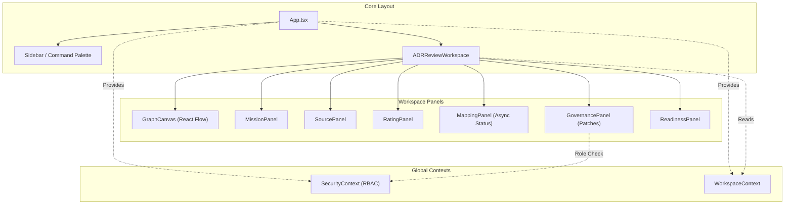

# 🗺️ PROJECT MAP — epios
> Автоматически сгенерировано: `2026-05-15 19:41:20`
> Скрипт: `node dev_studio/refresh.js`

## 📊 Telemetry / Context Health
| Metric | Value | Note |
|---|---|---|
| **Total Files** | `161` | Только JS/TS/TSX исходники |
| **Total Lines** | `17674` | Суммарно по проекту |
| **Project Weight** | `~140 376 tokens` | Оценка (4 символа/токен) |
| **Context Pressure** | `109.7%` | Нагрузка на окно 128k (Full Scan) |
| **Map Efficiency** | `~87%` | Экономия контекста через карту |

---

## Высокоуровневая архитектура
> Связи между основными пакетами и приложениями

```mermaid
flowchart LR

subgraph 0["apps"]
subgraph 1["demo-shell"]
subgraph 2["dist"]
subgraph 3["assets"]
4["index-MCK84GHV.js"]
end
end
subgraph 7["src"]
8["App.tsx"]
subgraph F["components"]
G["ADRReviewWorkspace.tsx"]
1H["GovernancePanel.tsx"]
1I["ReadinessPanel.tsx"]
1J["SecureMcpIframe.tsx"]
29["ArchiveView.tsx"]
2N["CommandPalette.tsx"]
2O["Sidebar.tsx"]
2P["Modal.tsx"]
2Q["SidebarItem.tsx"]
2R["WorkspaceRoom.tsx"]
2S["GraphCanvas.tsx"]
2U["CustomNode.tsx"]
2V["MissionPanel.tsx"]
2W["MappingPanel.tsx"]
2X["SourcePanel.tsx"]
2Y["RatingPanel.tsx"]
end
T["api-config.ts"]
subgraph U["context"]
V["SecurityContext.tsx"]
2G["WorkspaceContext.tsx"]
end
subgraph 1F["hooks"]
1G["useApi.ts"]
end
2Z["i18n.ts"]
3C["main.tsx"]
3D["index.css"]
subgraph 3I["mcp"]
3J["schemas.ts"]
end
end
end
end
subgraph 5["@emotion"]
6["is-prop-valid"]
end
subgraph 9["node_modules"]
subgraph A[".pnpm"]
subgraph B["react@18.3.1"]
subgraph C["node_modules"]
subgraph D["react"]
E["index.js"]
end
end
end
subgraph H["framer-motion@12.38.0_react-dom@18.3.1_react@18.3.1__react@18.3.1"]
subgraph I["node_modules"]
subgraph J["framer-motion"]
subgraph K["dist"]
subgraph L["cjs"]
M["index.js"]
end
end
end
end
end
subgraph N["lucide-react@1.14.0_react@18.3.1"]
subgraph O["node_modules"]
subgraph P["lucide-react"]
subgraph Q["dist"]
subgraph R["cjs"]
S["lucide-react.js"]
end
end
end
end
end
subgraph 25["zod@4.4.3"]
subgraph 26["node_modules"]
subgraph 27["zod"]
28["index.js"]
end
end
end
subgraph 2A["react-i18next@17.0.7_i18next@26.1.0_typescript@5.9.3__react-dom@18.3.1_react@18.3.1__react@18.3.1_typescript@5.9.3"]
subgraph 2B["node_modules"]
subgraph 2C["react-i18next"]
subgraph 2D["dist"]
subgraph 2E["es"]
2F["index.js"]
end
end
end
end
end
subgraph 2H["reactflow@11.11.4_@types+react@18.3.28_react-dom@18.3.1_react@18.3.1__react@18.3.1"]
subgraph 2I["node_modules"]
subgraph 2J["reactflow"]
subgraph 2K["dist"]
subgraph 2L["esm"]
2M["index.mjs"]
end
2T["style.css"]
end
end
end
end
subgraph 30["i18next@26.1.0_typescript@5.9.3"]
subgraph 31["node_modules"]
subgraph 32["i18next"]
subgraph 33["dist"]
subgraph 34["esm"]
35["i18next.js"]
end
end
end
end
end
subgraph 36["i18next-browser-languagedetector@8.2.1"]
subgraph 37["node_modules"]
subgraph 38["i18next-browser-languagedetector"]
subgraph 39["dist"]
subgraph 3A["esm"]
3B["i18nextBrowserLanguageDetector.js"]
end
end
end
end
end
subgraph 3E["react-dom@18.3.1_react@18.3.1"]
subgraph 3F["node_modules"]
subgraph 3G["react-dom"]
3H["client.js"]
end
end
end
subgraph 3S["@fastify+cors@8.5.0"]
subgraph 3T["node_modules"]
subgraph 3U["@fastify"]
subgraph 3V["cors"]
3W["index.js"]
end
end
end
end
subgraph 3X["dotenv@16.6.1"]
subgraph 3Y["node_modules"]
subgraph 3Z["dotenv"]
subgraph 40["lib"]
41["main.js"]
end
end
end
end
subgraph 42["dotenv-expand@11.0.7"]
subgraph 43["node_modules"]
subgraph 44["dotenv-expand"]
subgraph 45["lib"]
46["main.js"]
end
end
end
end
subgraph 47["drizzle-orm@0.45.2_postgres@3.4.9"]
subgraph 48["node_modules"]
subgraph 49["drizzle-orm"]
subgraph 4A["postgres-js"]
4B["index.js"]
AL["migrator.js"]
end
63["index.js"]
subgraph 65["pg-core"]
66["index.js"]
end
end
end
end
subgraph 4C["fastify@4.29.1"]
subgraph 4D["node_modules"]
subgraph 4E["fastify"]
4F["fastify.js"]
end
end
end
subgraph 4G["postgres@3.4.9"]
subgraph 4H["node_modules"]
subgraph 4I["postgres"]
subgraph 4J["src"]
4K["index.js"]
end
end
end
end
subgraph 6X["vitest@1.6.1_@types+node@25.7.0"]
subgraph 6Y["node_modules"]
subgraph 6Z["vitest"]
subgraph 70["dist"]
71["index.js"]
75["config.cjs"]
end
end
end
end
subgraph A7["drizzle-kit@0.31.10"]
subgraph A8["node_modules"]
subgraph A9["drizzle-kit"]
AA["index.mjs"]
end
end
end
subgraph AF["@testcontainers+postgresql@10.28.0"]
subgraph AG["node_modules"]
subgraph AH["@testcontainers"]
subgraph AI["postgresql"]
subgraph AJ["build"]
AK["index.js"]
end
end
end
end
end
end
end
subgraph W["packages"]
subgraph X["domain"]
subgraph Y["src"]
Z["index.ts"]
10["adr.ts"]
11["approval.ts"]
12["mission.ts"]
13["errors.ts"]
14["events.ts"]
15["artifact.ts"]
16["decision.ts"]
17["evidence.ts"]
18["governance.ts"]
19["node.ts"]
1A["mapping.ts"]
1B["rating.ts"]
1C["security.ts"]
1D["source.ts"]
1E["workspace.ts"]
end
subgraph 7C["coverage"]
7D["block-navigation.js"]
7E["prettify.js"]
7F["sorter.js"]
end
subgraph 7G["test"]
7H["domain-smoke.test.ts"]
7I["evidence.test.ts"]
7J["mission.test.ts"]
7K["node-invariants.test.ts"]
7L["source-rating.test.ts"]
7M["workspace.test.ts"]
end
7N["vitest.config.ts"]
end
subgraph 1K["infrastructure-mcp"]
subgraph 1L["src"]
1M["index.ts"]
1N["mcp-app.registry.ts"]
23["mcp-bridge.ts"]
24["schemas.ts"]
end
subgraph 7O["dist"]
subgraph 7P["domain"]
subgraph 7Q["src"]
7R["adr.d.ts"]
7S["adr.js"]
7T["approval.d.ts"]
7U["approval.js"]
7V["artifact.d.ts"]
7W["mission.js"]
7X["errors.js"]
7Y["artifact.js"]
7Z["decision.d.ts"]
80["decision.js"]
81["errors.d.ts"]
82["events.d.ts"]
83["events.js"]
84["evidence.d.ts"]
85["evidence.js"]
86["governance.d.ts"]
87["node.js"]
88["governance.js"]
89["index.d.ts"]
8A["mapping.js"]
8B["rating.js"]
8C["security.js"]
8D["source.js"]
8E["workspace.js"]
8F["index.js"]
8G["mapping.d.ts"]
8H["mission.d.ts"]
8I["node.d.ts"]
8J["rating.d.ts"]
8K["security.d.ts"]
8L["source.d.ts"]
8M["workspace.d.ts"]
end
end
8N["index.d.ts"]
8O["mcp-app.registry.js"]
8P["mcp-bridge.js"]
8Q["index.js"]
subgraph 8R["infrastructure-mcp"]
subgraph 8S["src"]
8T["index.d.ts"]
8U["mcp-app.registry.js"]
8V["mcp-bridge.js"]
8W["schemas.js"]
8X["index.js"]
8Y["mcp-app.registry.d.ts"]
8Z["mcp-bridge.d.ts"]
90["schemas.d.ts"]
end
end
91["mcp-app.registry.d.ts"]
94["mcp-bridge.d.ts"]
subgraph 95["ports"]
subgraph 96["src"]
97["adr.repository.port.d.ts"]
98["adr.repository.port.js"]
99["artifact.repository.port.d.ts"]
9A["artifact.repository.port.js"]
9B["decision.repository.port.d.ts"]
9C["decision.repository.port.js"]
9D["domain.repository.port.d.ts"]
9E["domain.repository.port.js"]
9F["evidence.repository.port.d.ts"]
9G["evidence.repository.port.js"]
9H["governance.port.d.ts"]
9I["governance.port.js"]
9J["graph.repository.port.d.ts"]
9K["graph.repository.port.js"]
9L["index.d.ts"]
9M["mcp.port.js"]
9N["mission.repository.port.js"]
9O["outbox.repository.port.js"]
9P["security.port.js"]
9Q["unit-of-work.port.js"]
9R["index.js"]
9S["mapping.repository.port.d.ts"]
9T["mapping.repository.port.js"]
9U["mcp.port.d.ts"]
9V["mission.repository.port.d.ts"]
9W["outbox.repository.port.d.ts"]
9X["security.port.d.ts"]
9Y["unit-of-work.port.d.ts"]
end
end
end
subgraph 9Z["test"]
A0["mcp-bridge.test.ts"]
A1["security.test.ts"]
A2["smoke.test.ts"]
end
end
subgraph 1O["ports"]
subgraph 1P["src"]
1Q["index.ts"]
1R["adr.repository.port.ts"]
1S["artifact.repository.port.ts"]
1T["decision.repository.port.ts"]
1U["domain.repository.port.ts"]
1V["evidence.repository.port.ts"]
1W["governance.port.ts"]
1X["graph.repository.port.ts"]
1Y["mcp.port.ts"]
1Z["mission.repository.port.ts"]
20["outbox.repository.port.ts"]
21["security.port.ts"]
22["unit-of-work.port.ts"]
AS["mapping.repository.port.ts"]
end
end
subgraph 3K["api"]
subgraph 3L["coverage"]
3M["block-navigation.js"]
3N["prettify.js"]
3O["sorter.js"]
end
subgraph 3P["src"]
3Q["bin.ts"]
3R["server.ts"]
4L["mock-data.ts"]
subgraph 4M["routes"]
4N["adr.routes.ts"]
5Q["governance.routes.ts"]
5R["mapping.routes.ts"]
5U["mcp.routes.ts"]
5V["rating.routes.ts"]
5W["security.routes.ts"]
5X["source.routes.ts"]
5Y["workspace.routes.ts"]
end
subgraph 5S["dto"]
5T["index.ts"]
end
subgraph 6R["contracts"]
6S["openapi.ts"]
6T["schemas.ts"]
end
6U["index.ts"]
end
subgraph 6V["test"]
6W["adr.test.ts"]
72["api.test.ts"]
end
73["vitest.config.ts"]
end
subgraph 4O["application"]
subgraph 4P["src"]
4Q["index.ts"]
4R["mapping-processor.ts"]
subgraph 4S["use-cases"]
4T["add-edge.ts"]
50["add-node.ts"]
51["adr-use-cases.ts"]
52["apply-patch.ts"]
53["apply-retention.ts"]
54["assess-readiness.ts"]
55["cast-vote.ts"]
56["create-mission.ts"]
57["create-workspace.ts"]
58["get-mapping-run.ts"]
59["get-node-ratings.ts"]
5A["get-readiness.ts"]
5B["get-trace.ts"]
5C["get-workspace-graph.ts"]
5D["ingest-source.ts"]
5E["list-mapping-runs.ts"]
5F["list-patches.ts"]
5G["list-sources.ts"]
5H["list-workspaces.ts"]
5I["patch-node.ts"]
5J["patch-workspace.ts"]
5K["propose-patch.ts"]
5L["rate-node.ts"]
5M["redact-node.ts"]
5N["run-mapping.ts"]
5O["submit-claim.ts"]
5P["update-mission-brief.ts"]
end
end
subgraph 76["test"]
77["async-runtime.test.ts"]
78["create-workspace.test.ts"]
79["mission.use-cases.test.ts"]
7A["use-cases.test.ts"]
end
7B["vitest.config.ts"]
end
subgraph 4V["observability"]
subgraph 4W["src"]
4X["index.ts"]
4Y["audit.ts"]
4Z["tracer.ts"]
end
subgraph AQ["test"]
AR["redaction.test.ts"]
end
end
subgraph 5Z["infrastructure-postgres"]
subgraph 60["src"]
61["index.ts"]
62["artifact.repository.ts"]
64["schema.ts"]
67["decision.repository.ts"]
68["evidence.repository.ts"]
69["governance.repository.ts"]
6A["graph.repository.ts"]
6B["identity.repository.ts"]
6C["mapping.repository.ts"]
6D["mission.repository.ts"]
6E["outbox.repository.ts"]
6F["rating.repository.ts"]
6G["source.repository.ts"]
6H["unit-of-work.ts"]
6I["workspace.repository.ts"]
AB["manual_migrate.ts"]
AC["seed.ts"]
end
A6["drizzle.config.ts"]
subgraph AD["test"]
AE["container-setup.ts"]
AN["graph-concurrency.test.ts"]
AO["repository-integration.test.ts"]
AP["transactional-integrity.test.ts"]
end
end
subgraph 6J["infrastructure-runtime"]
subgraph 6K["src"]
6L["index.ts"]
6M["in-memory-governance.repository.ts"]
6N["in-memory-repositories.ts"]
6O["in-memory-unit-of-work.ts"]
6P["outbox-worker.ts"]
6Q["security-mocks.ts"]
end
end
subgraph A3["infrastructure-models"]
subgraph A4["src"]
A5["index.ts"]
end
end
subgraph AT["testing"]
subgraph AU["src"]
AV["fixtures.ts"]
AW["index.ts"]
end
end
end
4U["crypto"]
74["path"]
subgraph 92["@epos"]
93["ports"]
end
AM["url"]
4-->6
8-->G
8-->29
8-->2N
8-->2O
8-->2R
8-->2G
8-->E
G-->T
G-->V
G-->1G
G-->1H
G-->1I
G-->1J
G-->M
G-->S
G-->E
V-->T
V-->Z
V-->E
Z-->10
Z-->11
Z-->15
Z-->16
Z-->13
Z-->14
Z-->17
Z-->18
Z-->1A
Z-->12
Z-->19
Z-->1B
Z-->1C
Z-->1D
Z-->1E
11-->12
12-->13
12-->14
15-->13
15-->12
16-->12
17-->13
18-->13
18-->14
18-->19
19-->13
19-->14
1D-->13
1E-->13
1G-->T
1G-->E
1H-->T
1H-->V
1H-->M
1H-->S
1H-->E
1I-->T
1I-->M
1I-->S
1I-->E
1J-->1M
1J-->E
1M-->1N
1M-->23
1M-->24
1N-->1Q
1Q-->1R
1Q-->1S
1Q-->1T
1Q-->1U
1Q-->1V
1Q-->1W
1Q-->1X
1Q-->1Y
1Q-->1Z
1Q-->20
1Q-->21
1Q-->22
1R-->Z
1S-->Z
1T-->Z
1U-->Z
1V-->Z
1W-->Z
1X-->Z
1Z-->Z
21-->Z
22-->1S
22-->1T
22-->1U
22-->1V
22-->1W
22-->1X
22-->1Z
22-->20
23-->24
23-->Z
23-->1Q
24-->28
29-->2G
29-->M
29-->S
29-->E
29-->2F
2G-->Z
2G-->E
2G-->2M
2N-->2G
2N-->M
2N-->S
2N-->E
2O-->T
2O-->V
2O-->2G
2O-->1G
2O-->2P
2O-->2Q
2O-->Z
2O-->M
2O-->S
2O-->E
2O-->2F
2P-->M
2P-->S
2P-->E
2Q-->M
2Q-->S
2Q-->E
2Q-->2F
2R-->T
2R-->V
2R-->2G
2R-->2S
2R-->2V
2R-->2Y
2R-->Z
2R-->M
2R-->S
2R-->E
2S-->2G
2S-->1G
2S-->2U
2S-->S
2S-->E
2S-->2M
2S-->2T
2U-->S
2U-->E
2U-->2M
2V-->1H
2V-->2W
2V-->2X
2V-->Z
2V-->M
2V-->S
2V-->E
2W-->T
2W-->Z
2W-->M
2W-->S
2W-->E
2X-->T
2X-->M
2X-->S
2X-->E
2Y-->T
2Y-->S
2Y-->E
2Z-->35
2Z-->3B
2Z-->2F
3C-->8
3C-->V
3C-->2G
3C-->2Z
3C-->3D
3C-->E
3C-->3H
3C-->2T
3J-->28
3Q-->3R
3R-->4L
3R-->4N
3R-->5Q
3R-->5R
3R-->5U
3R-->5V
3R-->5W
3R-->5X
3R-->5Y
3R-->4Q
3R-->1M
3R-->61
3R-->6L
3R-->1Q
3R-->3W
3R-->41
3R-->46
3R-->4B
3R-->4F
3R-->4K
4L-->Z
4N-->4Q
4N-->4F
4Q-->4R
4Q-->4T
4Q-->50
4Q-->51
4Q-->52
4Q-->53
4Q-->54
4Q-->55
4Q-->56
4Q-->57
4Q-->58
4Q-->59
4Q-->5A
4Q-->5B
4Q-->5C
4Q-->5D
4Q-->5E
4Q-->5F
4Q-->5G
4Q-->5H
4Q-->5I
4Q-->5J
4Q-->5K
4Q-->5L
4Q-->5M
4Q-->5N
4Q-->5O
4Q-->5P
4R-->Z
4R-->1Q
4T-->Z
4T-->4X
4T-->1Q
4T-->4U
4X-->4Y
4X-->4Z
50-->Z
50-->4X
50-->1Q
50-->4U
51-->Z
51-->1Q
52-->Z
52-->1Q
52-->4U
53-->Z
53-->1Q
54-->Z
54-->1Q
54-->4U
55-->Z
55-->4X
55-->1Q
55-->4U
56-->Z
56-->1Q
56-->4U
57-->Z
57-->4X
57-->1Q
57-->4U
58-->Z
58-->1Q
59-->Z
59-->1Q
5A-->Z
5A-->1Q
5B-->Z
5B-->1Q
5C-->Z
5C-->1Q
5D-->Z
5D-->1Q
5D-->4U
5E-->Z
5E-->1Q
5F-->Z
5F-->1Q
5G-->Z
5G-->1Q
5H-->Z
5H-->1Q
5I-->Z
5I-->1Q
5J-->Z
5J-->1Q
5K-->Z
5K-->1Q
5K-->4U
5L-->Z
5L-->1Q
5L-->4U
5M-->Z
5M-->1Q
5N-->Z
5N-->1Q
5N-->4U
5O-->Z
5O-->1Q
5O-->4U
5P-->Z
5P-->1Q
5P-->4U
5Q-->4Q
5Q-->1Q
5Q-->4F
5R-->5T
5R-->4Q
5R-->4F
5T-->Z
5U-->1M
5U-->1Q
5U-->4F
5V-->4Q
5V-->Z
5V-->4F
5W-->4Q
5W-->Z
5W-->1Q
5W-->4F
5X-->4Q
5X-->Z
5X-->4F
5Y-->5T
5Y-->4Q
5Y-->4F
61-->62
61-->67
61-->68
61-->69
61-->6A
61-->6B
61-->6C
61-->6D
61-->6E
61-->6F
61-->64
61-->6G
61-->6H
61-->6I
62-->64
62-->Z
62-->1Q
62-->63
62-->4B
64-->66
67-->64
67-->Z
67-->1Q
67-->63
67-->4B
68-->64
68-->Z
68-->63
68-->4B
69-->64
69-->Z
69-->1Q
69-->63
69-->4B
6A-->64
6A-->Z
6A-->1Q
6A-->63
6A-->4B
6B-->64
6B-->Z
6B-->1Q
6B-->63
6B-->4B
6C-->64
6C-->Z
6C-->1Q
6C-->63
6C-->4B
6D-->64
6D-->Z
6D-->1Q
6D-->63
6D-->4B
6E-->64
6E-->1Q
6E-->63
6E-->4B
6F-->64
6F-->Z
6F-->1Q
6F-->63
6F-->4B
6G-->64
6G-->Z
6G-->1Q
6G-->4U
6G-->63
6G-->4B
6H-->62
6H-->67
6H-->68
6H-->69
6H-->6A
6H-->6C
6H-->6D
6H-->6E
6H-->6F
6H-->6G
6H-->6I
6H-->1Q
6H-->4B
6I-->64
6I-->Z
6I-->1Q
6I-->63
6I-->4B
6L-->6M
6L-->6N
6L-->6O
6L-->6P
6L-->6Q
6M-->Z
6M-->1Q
6N-->Z
6N-->1Q
6O-->1Q
6P-->4X
6P-->1Q
6Q-->Z
6Q-->1Q
6Q-->4U
6T-->28
6U-->3R
6W-->3R
6W-->4F
6W-->71
72-->3R
72-->Z
72-->1Q
72-->4F
72-->71
73-->74
73-->75
77-->5N
77-->1Q
77-->4U
77-->71
78-->57
78-->1Q
78-->71
79-->56
79-->5D
79-->5N
79-->5P
79-->Z
79-->1Q
79-->71
7A-->4T
7A-->50
7A-->55
7A-->57
7A-->5C
7A-->5H
7A-->5I
7A-->5O
7A-->Z
7A-->1Q
7A-->71
7B-->74
7B-->75
7H-->Z
7H-->71
7I-->17
7I-->71
7J-->12
7J-->71
7K-->Z
7K-->71
7L-->Z
7L-->71
7M-->13
7M-->1E
7M-->71
7N-->75
7V-->7W
7W-->7X
7Y-->7X
7Z-->7W
85-->7X
86-->83
86-->87
87-->7X
88-->7X
89-->7S
89-->7U
89-->7Y
89-->80
89-->7X
89-->83
89-->85
89-->88
89-->8A
89-->7W
89-->87
89-->8B
89-->8C
89-->8D
89-->8E
8D-->7X
8E-->7X
8F-->7S
8F-->7U
8F-->7Y
8F-->80
8F-->7X
8F-->83
8F-->85
8F-->88
8F-->8A
8F-->7W
8F-->87
8F-->8B
8F-->8C
8F-->8D
8F-->8E
8H-->83
8I-->83
8N-->8O
8N-->8P
8Q-->8O
8Q-->8P
8T-->8U
8T-->8V
8T-->8W
8V-->8W
8V-->Z
8W-->28
8X-->8U
8X-->8V
8X-->8W
8Y-->1Q
8Z-->1Q
90-->28
91-->93
94-->93
97-->Z
99-->Z
9B-->Z
9D-->Z
9F-->Z
9H-->Z
9J-->Z
9L-->98
9L-->9A
9L-->9C
9L-->9E
9L-->9G
9L-->9I
9L-->9K
9L-->9M
9L-->9N
9L-->9O
9L-->9P
9L-->9Q
9R-->98
9R-->9A
9R-->9C
9R-->9E
9R-->9G
9R-->9I
9R-->9K
9R-->9M
9R-->9N
9R-->9O
9R-->9P
9R-->9Q
9S-->Z
9V-->Z
9X-->Z
9Y-->9A
9Y-->9C
9Y-->9E
9Y-->9G
9Y-->9I
9Y-->9K
9Y-->9N
9Y-->9O
A0-->23
A0-->1Q
A0-->71
A1-->23
A1-->Z
A1-->1Q
A1-->71
A2-->71
A6-->41
A6-->46
A6-->AA
AB-->41
AB-->46
AB-->4K
AC-->64
AC-->41
AC-->46
AC-->4B
AC-->4K
AE-->AK
AE-->4B
AE-->AL
AE-->74
AE-->4K
AE-->AM
AN-->6A
AN-->AE
AN-->Z
AN-->AK
AN-->4B
AN-->4K
AN-->71
AO-->6I
AO-->AE
AO-->Z
AO-->AK
AO-->4B
AO-->4K
AO-->71
AP-->6D
AP-->6H
AP-->6I
AP-->AE
AP-->Z
AP-->AK
AP-->4B
AP-->4K
AP-->71
AR-->4Z
AR-->71
AS-->Z
AV-->Z
AW-->AV
```

## Детальная карта компонентов
> Полный граф зависимостей всех файлов проекта

```mermaid
flowchart LR

subgraph 0["apps"]
subgraph 1["demo-shell"]
subgraph 2["dist"]
subgraph 3["assets"]
4["index-MCK84GHV.js"]
end
end
subgraph 7["src"]
8["App.tsx"]
subgraph F["components"]
G["ADRReviewWorkspace.tsx"]
1H["GovernancePanel.tsx"]
1I["ReadinessPanel.tsx"]
1J["SecureMcpIframe.tsx"]
29["ArchiveView.tsx"]
2N["CommandPalette.tsx"]
2O["Sidebar.tsx"]
2P["Modal.tsx"]
2Q["SidebarItem.tsx"]
2R["WorkspaceRoom.tsx"]
2S["GraphCanvas.tsx"]
2U["CustomNode.tsx"]
2V["MissionPanel.tsx"]
2W["MappingPanel.tsx"]
2X["SourcePanel.tsx"]
2Y["RatingPanel.tsx"]
end
T["api-config.ts"]
subgraph U["context"]
V["SecurityContext.tsx"]
2G["WorkspaceContext.tsx"]
end
subgraph 1F["hooks"]
1G["useApi.ts"]
end
2Z["i18n.ts"]
3C["main.tsx"]
3D["index.css"]
subgraph 3I["mcp"]
3J["schemas.ts"]
end
end
end
end
subgraph 5["@emotion"]
6["is-prop-valid"]
end
subgraph 9["node_modules"]
subgraph A[".pnpm"]
subgraph B["react@18.3.1"]
subgraph C["node_modules"]
subgraph D["react"]
E["index.js"]
end
end
end
subgraph H["framer-motion@12.38.0_react-dom@18.3.1_react@18.3.1__react@18.3.1"]
subgraph I["node_modules"]
subgraph J["framer-motion"]
subgraph K["dist"]
subgraph L["cjs"]
M["index.js"]
end
end
end
end
end
subgraph N["lucide-react@1.14.0_react@18.3.1"]
subgraph O["node_modules"]
subgraph P["lucide-react"]
subgraph Q["dist"]
subgraph R["cjs"]
S["lucide-react.js"]
end
end
end
end
end
subgraph 25["zod@4.4.3"]
subgraph 26["node_modules"]
subgraph 27["zod"]
28["index.js"]
end
end
end
subgraph 2A["react-i18next@17.0.7_i18next@26.1.0_typescript@5.9.3__react-dom@18.3.1_react@18.3.1__react@18.3.1_typescript@5.9.3"]
subgraph 2B["node_modules"]
subgraph 2C["react-i18next"]
subgraph 2D["dist"]
subgraph 2E["es"]
2F["index.js"]
end
end
end
end
end
subgraph 2H["reactflow@11.11.4_@types+react@18.3.28_react-dom@18.3.1_react@18.3.1__react@18.3.1"]
subgraph 2I["node_modules"]
subgraph 2J["reactflow"]
subgraph 2K["dist"]
subgraph 2L["esm"]
2M["index.mjs"]
end
2T["style.css"]
end
end
end
end
subgraph 30["i18next@26.1.0_typescript@5.9.3"]
subgraph 31["node_modules"]
subgraph 32["i18next"]
subgraph 33["dist"]
subgraph 34["esm"]
35["i18next.js"]
end
end
end
end
end
subgraph 36["i18next-browser-languagedetector@8.2.1"]
subgraph 37["node_modules"]
subgraph 38["i18next-browser-languagedetector"]
subgraph 39["dist"]
subgraph 3A["esm"]
3B["i18nextBrowserLanguageDetector.js"]
end
end
end
end
end
subgraph 3E["react-dom@18.3.1_react@18.3.1"]
subgraph 3F["node_modules"]
subgraph 3G["react-dom"]
3H["client.js"]
end
end
end
subgraph 3S["@fastify+cors@8.5.0"]
subgraph 3T["node_modules"]
subgraph 3U["@fastify"]
subgraph 3V["cors"]
3W["index.js"]
end
end
end
end
subgraph 3X["dotenv@16.6.1"]
subgraph 3Y["node_modules"]
subgraph 3Z["dotenv"]
subgraph 40["lib"]
41["main.js"]
end
end
end
end
subgraph 42["dotenv-expand@11.0.7"]
subgraph 43["node_modules"]
subgraph 44["dotenv-expand"]
subgraph 45["lib"]
46["main.js"]
end
end
end
end
subgraph 47["drizzle-orm@0.45.2_postgres@3.4.9"]
subgraph 48["node_modules"]
subgraph 49["drizzle-orm"]
subgraph 4A["postgres-js"]
4B["index.js"]
AL["migrator.js"]
end
63["index.js"]
subgraph 65["pg-core"]
66["index.js"]
end
end
end
end
subgraph 4C["fastify@4.29.1"]
subgraph 4D["node_modules"]
subgraph 4E["fastify"]
4F["fastify.js"]
end
end
end
subgraph 4G["postgres@3.4.9"]
subgraph 4H["node_modules"]
subgraph 4I["postgres"]
subgraph 4J["src"]
4K["index.js"]
end
end
end
end
subgraph 6X["vitest@1.6.1_@types+node@25.7.0"]
subgraph 6Y["node_modules"]
subgraph 6Z["vitest"]
subgraph 70["dist"]
71["index.js"]
75["config.cjs"]
end
end
end
end
subgraph A7["drizzle-kit@0.31.10"]
subgraph A8["node_modules"]
subgraph A9["drizzle-kit"]
AA["index.mjs"]
end
end
end
subgraph AF["@testcontainers+postgresql@10.28.0"]
subgraph AG["node_modules"]
subgraph AH["@testcontainers"]
subgraph AI["postgresql"]
subgraph AJ["build"]
AK["index.js"]
end
end
end
end
end
end
end
subgraph W["packages"]
subgraph X["domain"]
subgraph Y["src"]
Z["index.ts"]
10["adr.ts"]
11["approval.ts"]
12["mission.ts"]
13["errors.ts"]
14["events.ts"]
15["artifact.ts"]
16["decision.ts"]
17["evidence.ts"]
18["governance.ts"]
19["node.ts"]
1A["mapping.ts"]
1B["rating.ts"]
1C["security.ts"]
1D["source.ts"]
1E["workspace.ts"]
end
subgraph 7C["coverage"]
7D["block-navigation.js"]
7E["prettify.js"]
7F["sorter.js"]
end
subgraph 7G["test"]
7H["domain-smoke.test.ts"]
7I["evidence.test.ts"]
7J["mission.test.ts"]
7K["node-invariants.test.ts"]
7L["source-rating.test.ts"]
7M["workspace.test.ts"]
end
7N["vitest.config.ts"]
end
subgraph 1K["infrastructure-mcp"]
subgraph 1L["src"]
1M["index.ts"]
1N["mcp-app.registry.ts"]
23["mcp-bridge.ts"]
24["schemas.ts"]
end
subgraph 7O["dist"]
subgraph 7P["domain"]
subgraph 7Q["src"]
7R["adr.d.ts"]
7S["adr.js"]
7T["approval.d.ts"]
7U["approval.js"]
7V["artifact.d.ts"]
7W["mission.js"]
7X["errors.js"]
7Y["artifact.js"]
7Z["decision.d.ts"]
80["decision.js"]
81["errors.d.ts"]
82["events.d.ts"]
83["events.js"]
84["evidence.d.ts"]
85["evidence.js"]
86["governance.d.ts"]
87["node.js"]
88["governance.js"]
89["index.d.ts"]
8A["mapping.js"]
8B["rating.js"]
8C["security.js"]
8D["source.js"]
8E["workspace.js"]
8F["index.js"]
8G["mapping.d.ts"]
8H["mission.d.ts"]
8I["node.d.ts"]
8J["rating.d.ts"]
8K["security.d.ts"]
8L["source.d.ts"]
8M["workspace.d.ts"]
end
end
8N["index.d.ts"]
8O["mcp-app.registry.js"]
8P["mcp-bridge.js"]
8Q["index.js"]
subgraph 8R["infrastructure-mcp"]
subgraph 8S["src"]
8T["index.d.ts"]
8U["mcp-app.registry.js"]
8V["mcp-bridge.js"]
8W["schemas.js"]
8X["index.js"]
8Y["mcp-app.registry.d.ts"]
8Z["mcp-bridge.d.ts"]
90["schemas.d.ts"]
end
end
91["mcp-app.registry.d.ts"]
94["mcp-bridge.d.ts"]
subgraph 95["ports"]
subgraph 96["src"]
97["adr.repository.port.d.ts"]
98["adr.repository.port.js"]
99["artifact.repository.port.d.ts"]
9A["artifact.repository.port.js"]
9B["decision.repository.port.d.ts"]
9C["decision.repository.port.js"]
9D["domain.repository.port.d.ts"]
9E["domain.repository.port.js"]
9F["evidence.repository.port.d.ts"]
9G["evidence.repository.port.js"]
9H["governance.port.d.ts"]
9I["governance.port.js"]
9J["graph.repository.port.d.ts"]
9K["graph.repository.port.js"]
9L["index.d.ts"]
9M["mcp.port.js"]
9N["mission.repository.port.js"]
9O["outbox.repository.port.js"]
9P["security.port.js"]
9Q["unit-of-work.port.js"]
9R["index.js"]
9S["mapping.repository.port.d.ts"]
9T["mapping.repository.port.js"]
9U["mcp.port.d.ts"]
9V["mission.repository.port.d.ts"]
9W["outbox.repository.port.d.ts"]
9X["security.port.d.ts"]
9Y["unit-of-work.port.d.ts"]
end
end
end
subgraph 9Z["test"]
A0["mcp-bridge.test.ts"]
A1["security.test.ts"]
A2["smoke.test.ts"]
end
end
subgraph 1O["ports"]
subgraph 1P["src"]
1Q["index.ts"]
1R["adr.repository.port.ts"]
1S["artifact.repository.port.ts"]
1T["decision.repository.port.ts"]
1U["domain.repository.port.ts"]
1V["evidence.repository.port.ts"]
1W["governance.port.ts"]
1X["graph.repository.port.ts"]
1Y["mcp.port.ts"]
1Z["mission.repository.port.ts"]
20["outbox.repository.port.ts"]
21["security.port.ts"]
22["unit-of-work.port.ts"]
AS["mapping.repository.port.ts"]
end
end
subgraph 3K["api"]
subgraph 3L["coverage"]
3M["block-navigation.js"]
3N["prettify.js"]
3O["sorter.js"]
end
subgraph 3P["src"]
3Q["bin.ts"]
3R["server.ts"]
4L["mock-data.ts"]
subgraph 4M["routes"]
4N["adr.routes.ts"]
5Q["governance.routes.ts"]
5R["mapping.routes.ts"]
5U["mcp.routes.ts"]
5V["rating.routes.ts"]
5W["security.routes.ts"]
5X["source.routes.ts"]
5Y["workspace.routes.ts"]
end
subgraph 5S["dto"]
5T["index.ts"]
end
subgraph 6R["contracts"]
6S["openapi.ts"]
6T["schemas.ts"]
end
6U["index.ts"]
end
subgraph 6V["test"]
6W["adr.test.ts"]
72["api.test.ts"]
end
73["vitest.config.ts"]
end
subgraph 4O["application"]
subgraph 4P["src"]
4Q["index.ts"]
4R["mapping-processor.ts"]
subgraph 4S["use-cases"]
4T["add-edge.ts"]
50["add-node.ts"]
51["adr-use-cases.ts"]
52["apply-patch.ts"]
53["apply-retention.ts"]
54["assess-readiness.ts"]
55["cast-vote.ts"]
56["create-mission.ts"]
57["create-workspace.ts"]
58["get-mapping-run.ts"]
59["get-node-ratings.ts"]
5A["get-readiness.ts"]
5B["get-trace.ts"]
5C["get-workspace-graph.ts"]
5D["ingest-source.ts"]
5E["list-mapping-runs.ts"]
5F["list-patches.ts"]
5G["list-sources.ts"]
5H["list-workspaces.ts"]
5I["patch-node.ts"]
5J["patch-workspace.ts"]
5K["propose-patch.ts"]
5L["rate-node.ts"]
5M["redact-node.ts"]
5N["run-mapping.ts"]
5O["submit-claim.ts"]
5P["update-mission-brief.ts"]
end
end
subgraph 76["test"]
77["async-runtime.test.ts"]
78["create-workspace.test.ts"]
79["mission.use-cases.test.ts"]
7A["use-cases.test.ts"]
end
7B["vitest.config.ts"]
end
subgraph 4V["observability"]
subgraph 4W["src"]
4X["index.ts"]
4Y["audit.ts"]
4Z["tracer.ts"]
end
subgraph AQ["test"]
AR["redaction.test.ts"]
end
end
subgraph 5Z["infrastructure-postgres"]
subgraph 60["src"]
61["index.ts"]
62["artifact.repository.ts"]
64["schema.ts"]
67["decision.repository.ts"]
68["evidence.repository.ts"]
69["governance.repository.ts"]
6A["graph.repository.ts"]
6B["identity.repository.ts"]
6C["mapping.repository.ts"]
6D["mission.repository.ts"]
6E["outbox.repository.ts"]
6F["rating.repository.ts"]
6G["source.repository.ts"]
6H["unit-of-work.ts"]
6I["workspace.repository.ts"]
AB["manual_migrate.ts"]
AC["seed.ts"]
end
A6["drizzle.config.ts"]
subgraph AD["test"]
AE["container-setup.ts"]
AN["graph-concurrency.test.ts"]
AO["repository-integration.test.ts"]
AP["transactional-integrity.test.ts"]
end
end
subgraph 6J["infrastructure-runtime"]
subgraph 6K["src"]
6L["index.ts"]
6M["in-memory-governance.repository.ts"]
6N["in-memory-repositories.ts"]
6O["in-memory-unit-of-work.ts"]
6P["outbox-worker.ts"]
6Q["security-mocks.ts"]
end
end
subgraph A3["infrastructure-models"]
subgraph A4["src"]
A5["index.ts"]
end
end
subgraph AT["testing"]
subgraph AU["src"]
AV["fixtures.ts"]
AW["index.ts"]
end
end
end
4U["crypto"]
74["path"]
subgraph 92["@epos"]
93["ports"]
end
AM["url"]
4-->6
8-->G
8-->29
8-->2N
8-->2O
8-->2R
8-->2G
8-->E
G-->T
G-->V
G-->1G
G-->1H
G-->1I
G-->1J
G-->M
G-->S
G-->E
V-->T
V-->Z
V-->E
Z-->10
Z-->11
Z-->15
Z-->16
Z-->13
Z-->14
Z-->17
Z-->18
Z-->1A
Z-->12
Z-->19
Z-->1B
Z-->1C
Z-->1D
Z-->1E
11-->12
12-->13
12-->14
15-->13
15-->12
16-->12
17-->13
18-->13
18-->14
18-->19
19-->13
19-->14
1D-->13
1E-->13
1G-->T
1G-->E
1H-->T
1H-->V
1H-->M
1H-->S
1H-->E
1I-->T
1I-->M
1I-->S
1I-->E
1J-->1M
1J-->E
1M-->1N
1M-->23
1M-->24
1N-->1Q
1Q-->1R
1Q-->1S
1Q-->1T
1Q-->1U
1Q-->1V
1Q-->1W
1Q-->1X
1Q-->1Y
1Q-->1Z
1Q-->20
1Q-->21
1Q-->22
1R-->Z
1S-->Z
1T-->Z
1U-->Z
1V-->Z
1W-->Z
1X-->Z
1Z-->Z
21-->Z
22-->1S
22-->1T
22-->1U
22-->1V
22-->1W
22-->1X
22-->1Z
22-->20
23-->24
23-->Z
23-->1Q
24-->28
29-->2G
29-->M
29-->S
29-->E
29-->2F
2G-->Z
2G-->E
2G-->2M
2N-->2G
2N-->M
2N-->S
2N-->E
2O-->T
2O-->V
2O-->2G
2O-->1G
2O-->2P
2O-->2Q
2O-->Z
2O-->M
2O-->S
2O-->E
2O-->2F
2P-->M
2P-->S
2P-->E
2Q-->M
2Q-->S
2Q-->E
2Q-->2F
2R-->T
2R-->V
2R-->2G
2R-->2S
2R-->2V
2R-->2Y
2R-->Z
2R-->M
2R-->S
2R-->E
2S-->2G
2S-->1G
2S-->2U
2S-->S
2S-->E
2S-->2M
2S-->2T
2U-->S
2U-->E
2U-->2M
2V-->1H
2V-->2W
2V-->2X
2V-->Z
2V-->M
2V-->S
2V-->E
2W-->T
2W-->Z
2W-->M
2W-->S
2W-->E
2X-->T
2X-->M
2X-->S
2X-->E
2Y-->T
2Y-->S
2Y-->E
2Z-->35
2Z-->3B
2Z-->2F
3C-->8
3C-->V
3C-->2G
3C-->2Z
3C-->3D
3C-->E
3C-->3H
3C-->2T
3J-->28
3Q-->3R
3R-->4L
3R-->4N
3R-->5Q
3R-->5R
3R-->5U
3R-->5V
3R-->5W
3R-->5X
3R-->5Y
3R-->4Q
3R-->1M
3R-->61
3R-->6L
3R-->1Q
3R-->3W
3R-->41
3R-->46
3R-->4B
3R-->4F
3R-->4K
4L-->Z
4N-->4Q
4N-->4F
4Q-->4R
4Q-->4T
4Q-->50
4Q-->51
4Q-->52
4Q-->53
4Q-->54
4Q-->55
4Q-->56
4Q-->57
4Q-->58
4Q-->59
4Q-->5A
4Q-->5B
4Q-->5C
4Q-->5D
4Q-->5E
4Q-->5F
4Q-->5G
4Q-->5H
4Q-->5I
4Q-->5J
4Q-->5K
4Q-->5L
4Q-->5M
4Q-->5N
4Q-->5O
4Q-->5P
4R-->Z
4R-->1Q
4T-->Z
4T-->4X
4T-->1Q
4T-->4U
4X-->4Y
4X-->4Z
50-->Z
50-->4X
50-->1Q
50-->4U
51-->Z
51-->1Q
52-->Z
52-->1Q
52-->4U
53-->Z
53-->1Q
54-->Z
54-->1Q
54-->4U
55-->Z
55-->4X
55-->1Q
55-->4U
56-->Z
56-->1Q
56-->4U
57-->Z
57-->4X
57-->1Q
57-->4U
58-->Z
58-->1Q
59-->Z
59-->1Q
5A-->Z
5A-->1Q
5B-->Z
5B-->1Q
5C-->Z
5C-->1Q
5D-->Z
5D-->1Q
5D-->4U
5E-->Z
5E-->1Q
5F-->Z
5F-->1Q
5G-->Z
5G-->1Q
5H-->Z
5H-->1Q
5I-->Z
5I-->1Q
5J-->Z
5J-->1Q
5K-->Z
5K-->1Q
5K-->4U
5L-->Z
5L-->1Q
5L-->4U
5M-->Z
5M-->1Q
5N-->Z
5N-->1Q
5N-->4U
5O-->Z
5O-->1Q
5O-->4U
5P-->Z
5P-->1Q
5P-->4U
5Q-->4Q
5Q-->1Q
5Q-->4F
5R-->5T
5R-->4Q
5R-->4F
5T-->Z
5U-->1M
5U-->1Q
5U-->4F
5V-->4Q
5V-->Z
5V-->4F
5W-->4Q
5W-->Z
5W-->1Q
5W-->4F
5X-->4Q
5X-->Z
5X-->4F
5Y-->5T
5Y-->4Q
5Y-->4F
61-->62
61-->67
61-->68
61-->69
61-->6A
61-->6B
61-->6C
61-->6D
61-->6E
61-->6F
61-->64
61-->6G
61-->6H
61-->6I
62-->64
62-->Z
62-->1Q
62-->63
62-->4B
64-->66
67-->64
67-->Z
67-->1Q
67-->63
67-->4B
68-->64
68-->Z
68-->63
68-->4B
69-->64
69-->Z
69-->1Q
69-->63
69-->4B
6A-->64
6A-->Z
6A-->1Q
6A-->63
6A-->4B
6B-->64
6B-->Z
6B-->1Q
6B-->63
6B-->4B
6C-->64
6C-->Z
6C-->1Q
6C-->63
6C-->4B
6D-->64
6D-->Z
6D-->1Q
6D-->63
6D-->4B
6E-->64
6E-->1Q
6E-->63
6E-->4B
6F-->64
6F-->Z
6F-->1Q
6F-->63
6F-->4B
6G-->64
6G-->Z
6G-->1Q
6G-->4U
6G-->63
6G-->4B
6H-->62
6H-->67
6H-->68
6H-->69
6H-->6A
6H-->6C
6H-->6D
6H-->6E
6H-->6F
6H-->6G
6H-->6I
6H-->1Q
6H-->4B
6I-->64
6I-->Z
6I-->1Q
6I-->63
6I-->4B
6L-->6M
6L-->6N
6L-->6O
6L-->6P
6L-->6Q
6M-->Z
6M-->1Q
6N-->Z
6N-->1Q
6O-->1Q
6P-->4X
6P-->1Q
6Q-->Z
6Q-->1Q
6Q-->4U
6T-->28
6U-->3R
6W-->3R
6W-->4F
6W-->71
72-->3R
72-->Z
72-->1Q
72-->4F
72-->71
73-->74
73-->75
77-->5N
77-->1Q
77-->4U
77-->71
78-->57
78-->1Q
78-->71
79-->56
79-->5D
79-->5N
79-->5P
79-->Z
79-->1Q
79-->71
7A-->4T
7A-->50
7A-->55
7A-->57
7A-->5C
7A-->5H
7A-->5I
7A-->5O
7A-->Z
7A-->1Q
7A-->71
7B-->74
7B-->75
7H-->Z
7H-->71
7I-->17
7I-->71
7J-->12
7J-->71
7K-->Z
7K-->71
7L-->Z
7L-->71
7M-->13
7M-->1E
7M-->71
7N-->75
7V-->7W
7W-->7X
7Y-->7X
7Z-->7W
85-->7X
86-->83
86-->87
87-->7X
88-->7X
89-->7S
89-->7U
89-->7Y
89-->80
89-->7X
89-->83
89-->85
89-->88
89-->8A
89-->7W
89-->87
89-->8B
89-->8C
89-->8D
89-->8E
8D-->7X
8E-->7X
8F-->7S
8F-->7U
8F-->7Y
8F-->80
8F-->7X
8F-->83
8F-->85
8F-->88
8F-->8A
8F-->7W
8F-->87
8F-->8B
8F-->8C
8F-->8D
8F-->8E
8H-->83
8I-->83
8N-->8O
8N-->8P
8Q-->8O
8Q-->8P
8T-->8U
8T-->8V
8T-->8W
8V-->8W
8V-->Z
8W-->28
8X-->8U
8X-->8V
8X-->8W
8Y-->1Q
8Z-->1Q
90-->28
91-->93
94-->93
97-->Z
99-->Z
9B-->Z
9D-->Z
9F-->Z
9H-->Z
9J-->Z
9L-->98
9L-->9A
9L-->9C
9L-->9E
9L-->9G
9L-->9I
9L-->9K
9L-->9M
9L-->9N
9L-->9O
9L-->9P
9L-->9Q
9R-->98
9R-->9A
9R-->9C
9R-->9E
9R-->9G
9R-->9I
9R-->9K
9R-->9M
9R-->9N
9R-->9O
9R-->9P
9R-->9Q
9S-->Z
9V-->Z
9X-->Z
9Y-->9A
9Y-->9C
9Y-->9E
9Y-->9G
9Y-->9I
9Y-->9K
9Y-->9N
9Y-->9O
A0-->23
A0-->1Q
A0-->71
A1-->23
A1-->Z
A1-->1Q
A1-->71
A2-->71
A6-->41
A6-->46
A6-->AA
AB-->41
AB-->46
AB-->4K
AC-->64
AC-->41
AC-->46
AC-->4B
AC-->4K
AE-->AK
AE-->4B
AE-->AL
AE-->74
AE-->4K
AE-->AM
AN-->6A
AN-->AE
AN-->Z
AN-->AK
AN-->4B
AN-->4K
AN-->71
AO-->6I
AO-->AE
AO-->Z
AO-->AK
AO-->4B
AO-->4K
AO-->71
AP-->6D
AP-->6H
AP-->6I
AP-->AE
AP-->Z
AP-->AK
AP-->4B
AP-->4K
AP-->71
AR-->4Z
AR-->71
AS-->Z
AV-->Z
AW-->AV
```

## 🎨 Архитектура UI Интерфейсов (demo-shell)
> Обобщенная концептуальная структура компонентов пользовательского интерфейса



> Подробная документация и Roadmap по развитию интерфейсов находится в [docs/05_ui_roadmap/](docs/05_ui_roadmap/00_ROADMAP_INDEX.md)

## Компонент: `apps`

| Файл | Строк | Размер | Описание |
|---|---|---|---|
| `demo-shell/src/api-config.ts` | 7 | 0.3 KB | Централизованная конфигурация API URL. |
| `demo-shell/src/App.tsx` | 73 | 1.9 KB | — |
| `demo-shell/src/components/ADRReviewWorkspace.tsx` | 893 | 29.2 KB | — |
| `demo-shell/src/components/ArchiveView.tsx` | 247 | 7.4 KB | — |
| `demo-shell/src/components/CommandPalette.tsx` | 341 | 9.1 KB | — |
| `demo-shell/src/components/CustomNode.tsx` | 169 | 4.4 KB | — |
| `demo-shell/src/components/GovernancePanel.tsx` | 498 | 14.7 KB | — |
| `demo-shell/src/components/GraphCanvas.tsx` | 579 | 16.2 KB | — |
| `demo-shell/src/components/MappingPanel.tsx` | 270 | 7.8 KB | — |
| `demo-shell/src/components/MissionPanel.tsx` | 303 | 8.7 KB | — |
| `demo-shell/src/components/Modal.tsx` | 100 | 2.7 KB | — |
| `demo-shell/src/components/RatingPanel.tsx` | 234 | 6.2 KB | — |
| `demo-shell/src/components/ReadinessPanel.tsx` | 403 | 11.7 KB | — |
| `demo-shell/src/components/SecureMcpIframe.tsx` | 101 | 3.0 KB | — |
| `demo-shell/src/components/Sidebar.tsx` | 774 | 24.7 KB | — |
| `demo-shell/src/components/SidebarItem.tsx` | 278 | 7.6 KB | — |
| `demo-shell/src/components/SourcePanel.tsx` | 232 | 6.9 KB | — |
| `demo-shell/src/components/WorkspaceRoom.tsx` | 665 | 21.5 KB | — |
| `demo-shell/src/context/SecurityContext.tsx` | 68 | 1.6 KB | — |
| `demo-shell/src/context/WorkspaceContext.tsx` | 147 | 3.8 KB | — |
| `demo-shell/src/hooks/useApi.ts` | 43 | 1.1 KB | — |
| `demo-shell/src/i18n.ts` | 99 | 3.4 KB | — |
| `demo-shell/src/main.tsx` | 20 | 0.5 KB | — |
| `demo-shell/src/mcp/schemas.ts` | 20 | 0.7 KB | — |

### `demo-shell/src/api-config.ts`
- **Экспорт**: `API_BASE_URL`

### `demo-shell/src/components/ArchiveView.tsx`
- **Экспорт**: `ArchiveView`
- **Зависимости**:
  - `../context/WorkspaceContext` → useWorkspace

### `demo-shell/src/components/GovernancePanel.tsx`
- **Экспорт**: `GovernancePanel`
- **Зависимости**:
  - `../api-config` → API_BASE_URL
  - `../context/SecurityContext` → useSecurity

### `demo-shell/src/components/MappingPanel.tsx`
- **Экспорт**: `MappingPanel`
- **Зависимости**:
  - `../api-config` → API_BASE_URL
  - `@epios/domain` → MappingRun

### `demo-shell/src/components/MissionPanel.tsx`
- **Экспорт**: `MissionPanel`
- **Зависимости**:
  - `./GovernancePanel` → GovernancePanel
  - `./SourcePanel` → SourcePanel
  - `./MappingPanel` → MappingPanel
  - `@epios/domain` → Workspace

### `demo-shell/src/components/Modal.tsx`
- **Экспорт**: `Modal`
- **Зависимости**:

### `demo-shell/src/components/RatingPanel.tsx`
- **Экспорт**: `RatingPanel`
- **Зависимости**:
  - `../api-config` → API_BASE_URL

### `demo-shell/src/components/ReadinessPanel.tsx`
- **Экспорт**: `ReadinessPanel`
- **Зависимости**:
  - `../api-config` → API_BASE_URL

### `demo-shell/src/components/SecureMcpIframe.tsx`
- **Экспорт**: `SecureMcpIframe`
- **Зависимости**:
  - `@epios/infrastructure-mcp` → McpRequestSchema

### `demo-shell/src/components/SidebarItem.tsx`
- **Экспорт**: `SidebarItemProps`, `SidebarItem`
- **Зависимости**:

### `demo-shell/src/components/SourcePanel.tsx`
- **Экспорт**: `SourcePanel`
- **Зависимости**:
  - `../api-config` → API_BASE_URL

### `demo-shell/src/context/SecurityContext.tsx`
- **Экспорт**: `SecurityProvider`, `useSecurity`
- **Зависимости**:
  - `@epios/domain` → User
  - `../api-config` → API_BASE_URL

### `demo-shell/src/context/WorkspaceContext.tsx`
- **Экспорт**: `WorkspaceProvider`, `useWorkspace`
- **Зависимости**:
  - `@epios/domain` → Workspace, WorkspaceStatus

### `demo-shell/src/hooks/useApi.ts`
- **Экспорт**: `useApi`
- **Зависимости**:
  - `../api-config` → API_BASE_URL

### `demo-shell/src/mcp/schemas.ts`
- **Экспорт**: `McpRequestSchema`, `McpResponseSchema`, `McpRequest`, `McpResponse`
- **Зависимости**:

## Компонент: `packages`

| Файл | Строк | Размер | Описание |
|---|---|---|---|
| `api/coverage/block-navigation.js` | 88 | 2.6 KB | — |
| `api/coverage/prettify.js` | 3 | 17.2 KB | — |
| `api/coverage/sorter.js` | 211 | 6.6 KB | — |
| `api/src/bin.ts` | 13 | 0.3 KB | — |
| `api/src/contracts/openapi.ts` | 30 | 0.6 KB | OpenAPI Definition for EPIOS (Derived from Schemas) |
| `api/src/contracts/schemas.ts` | 57 | 1.3 KB | — |
| `api/src/dto/index.ts` | 58 | 1.1 KB | — |
| `api/src/index.ts` | 3 | 0.0 KB | — |
| `api/src/mock-data.ts` | 579 | 17.8 KB | Mock data factory for demo/development mode. |
| `api/src/routes/adr.routes.ts` | 27 | 0.6 KB | — |
| `api/src/routes/governance.routes.ts` | 128 | 3.8 KB | — |
| `api/src/routes/mapping.routes.ts` | 98 | 3.0 KB | — |
| `api/src/routes/mcp.routes.ts` | 45 | 1.3 KB | — |
| `api/src/routes/rating.routes.ts` | 30 | 0.9 KB | — |
| `api/src/routes/security.routes.ts` | 66 | 2.0 KB | — |
| `api/src/routes/source.routes.ts` | 38 | 1.1 KB | — |
| `api/src/routes/workspace.routes.ts` | 52 | 1.4 KB | — |
| `api/src/server.ts` | 356 | 11.8 KB | — |
| `api/test/adr.test.ts` | 55 | 1.4 KB | — |
| `api/test/api.test.ts` | 238 | 6.0 KB | — |
| `api/vitest.config.ts` | 42 | 1.1 KB | — |
| `application/src/index.ts` | 29 | 1.3 KB | — |
| `application/src/mapping-processor.ts` | 90 | 2.4 KB | — |
| `application/src/use-cases/add-edge.ts` | 47 | 1.3 KB | — |
| `application/src/use-cases/add-node.ts` | 57 | 1.5 KB | — |
| `application/src/use-cases/adr-use-cases.ts` | 19 | 0.5 KB | — |
| `application/src/use-cases/apply-patch.ts` | 75 | 2.3 KB | — |
| `application/src/use-cases/apply-retention.ts` | 60 | 1.7 KB | — |
| `application/src/use-cases/assess-readiness.ts` | 90 | 2.9 KB | — |
| `application/src/use-cases/cast-vote.ts` | 146 | 5.0 KB | — |
| `application/src/use-cases/create-mission.ts` | 66 | 1.9 KB | — |
| `application/src/use-cases/create-workspace.ts` | 49 | 1.2 KB | — |
| `application/src/use-cases/get-mapping-run.ts` | 11 | 0.3 KB | — |
| `application/src/use-cases/get-node-ratings.ts` | 11 | 0.3 KB | — |
| `application/src/use-cases/get-readiness.ts` | 11 | 0.4 KB | — |
| `application/src/use-cases/get-trace.ts` | 11 | 0.3 KB | — |
| `application/src/use-cases/get-workspace-graph.ts` | 21 | 0.6 KB | — |
| `application/src/use-cases/ingest-source.ts` | 53 | 1.5 KB | — |
| `application/src/use-cases/list-mapping-runs.ts` | 11 | 0.3 KB | — |
| `application/src/use-cases/list-patches.ts` | 15 | 0.4 KB | — |
| `application/src/use-cases/list-sources.ts` | 11 | 0.3 KB | — |
| `application/src/use-cases/list-workspaces.ts` | 11 | 0.3 KB | — |
| `application/src/use-cases/patch-node.ts` | 35 | 1.3 KB | — |
| `application/src/use-cases/patch-workspace.ts` | 36 | 1.1 KB | — |
| `application/src/use-cases/propose-patch.ts` | 57 | 1.5 KB | — |
| `application/src/use-cases/rate-node.ts` | 29 | 0.7 KB | — |
| `application/src/use-cases/redact-node.ts` | 63 | 1.6 KB | — |
| `application/src/use-cases/run-mapping.ts` | 69 | 2.1 KB | — |
| `application/src/use-cases/submit-claim.ts` | 55 | 1.4 KB | — |
| `application/src/use-cases/update-mission-brief.ts` | 51 | 1.6 KB | — |
| `application/test/async-runtime.test.ts` | 98 | 3.1 KB | — |
| `application/test/create-workspace.test.ts` | 63 | 1.6 KB | — |
| `application/test/mission.use-cases.test.ts` | 191 | 5.7 KB | — |
| `application/test/use-cases.test.ts` | 395 | 11.8 KB | — |
| `application/vitest.config.ts` | 28 | 0.6 KB | — |
| `domain/coverage/block-navigation.js` | 88 | 2.6 KB | — |
| `domain/coverage/prettify.js` | 3 | 17.2 KB | — |
| `domain/coverage/sorter.js` | 211 | 6.6 KB | — |
| `domain/src/adr.ts` | 42 | 0.7 KB | — |
| `domain/src/approval.ts` | 49 | 1.1 KB | — |
| `domain/src/artifact.ts` | 69 | 1.8 KB | — |
| `domain/src/decision.ts` | 46 | 1.1 KB | — |
| `domain/src/errors.ts` | 35 | 0.9 KB | — |
| `domain/src/events.ts` | 6 | 0.1 KB | — |
| `domain/src/evidence.ts` | 114 | 2.6 KB | — |
| `domain/src/governance.ts` | 282 | 6.3 KB | — |
| `domain/src/index.ts` | 16 | 0.5 KB | — |
| `domain/src/mapping.ts` | 16 | 0.4 KB | — |
| `domain/src/mission.ts` | 250 | 5.8 KB | — |
| `domain/src/node.ts` | 170 | 3.8 KB | — |
| `domain/src/rating.ts` | 11 | 0.2 KB | — |
| `domain/src/security.ts` | 40 | 0.8 KB | — |
| `domain/src/source.ts` | 55 | 1.6 KB | — |
| `domain/src/workspace.ts` | 189 | 4.3 KB | Returns a plain object representation for persistence/serialization. |
| `domain/test/domain-smoke.test.ts` | 51 | 1.3 KB | — |
| `domain/test/evidence.test.ts` | 34 | 0.9 KB | — |
| `domain/test/mission.test.ts` | 49 | 1.4 KB | — |
| `domain/test/node-invariants.test.ts` | 51 | 1.2 KB | — |
| `domain/test/source-rating.test.ts` | 33 | 0.8 KB | — |
| `domain/test/workspace.test.ts` | 63 | 1.7 KB | — |
| `domain/vitest.config.ts` | 21 | 0.4 KB | — |
| `infrastructure-mcp/src/index.ts` | 5 | 0.1 KB | — |
| `infrastructure-mcp/src/mcp-app.registry.ts` | 35 | 0.8 KB | — |
| `infrastructure-mcp/src/mcp-bridge.ts` | 103 | 3.0 KB | — |
| `infrastructure-mcp/src/schemas.ts` | 44 | 1.3 KB | — |
| `infrastructure-mcp/test/mcp-bridge.test.ts` | 49 | 1.4 KB | — |
| `infrastructure-mcp/test/security.test.ts` | 86 | 2.7 KB | — |
| `infrastructure-mcp/test/smoke.test.ts` | 8 | 0.2 KB | — |
| `infrastructure-models/src/index.ts` | 3 | 0.1 KB | — |
| `infrastructure-postgres/drizzle.config.ts` | 17 | 0.4 KB | — |
| `infrastructure-postgres/src/artifact.repository.ts` | 299 | 8.6 KB | — |
| `infrastructure-postgres/src/decision.repository.ts` | 202 | 6.2 KB | — |
| `infrastructure-postgres/src/evidence.repository.ts` | 60 | 1.6 KB | — |
| `infrastructure-postgres/src/governance.repository.ts` | 361 | 10.3 KB | — |
| `infrastructure-postgres/src/graph.repository.ts` | 203 | 6.0 KB | — |
| `infrastructure-postgres/src/identity.repository.ts` | 68 | 1.7 KB | — |
| `infrastructure-postgres/src/index.ts` | 19 | 0.7 KB | — |
| `infrastructure-postgres/src/manual_migrate.ts` | 30 | 0.9 KB | — |
| `infrastructure-postgres/src/mapping.repository.ts` | 84 | 2.5 KB | — |
| `infrastructure-postgres/src/mission.repository.ts` | 211 | 6.8 KB | — |
| `infrastructure-postgres/src/outbox.repository.ts` | 57 | 1.7 KB | — |
| `infrastructure-postgres/src/rating.repository.ts` | 50 | 1.4 KB | — |
| `infrastructure-postgres/src/schema.ts` | 541 | 18.7 KB | — |
| `infrastructure-postgres/src/seed.ts` | 378 | 13.2 KB | — |
| `infrastructure-postgres/src/source.repository.ts` | 124 | 3.8 KB | — |
| `infrastructure-postgres/src/unit-of-work.ts` | 89 | 3.6 KB | PostgresUnitOfWork provides access to all repositories within a single Drizzle transaction. |
| `infrastructure-postgres/src/workspace.repository.ts` | 126 | 4.1 KB | — |
| `infrastructure-postgres/test/container-setup.ts` | 37 | 0.9 KB | — |
| `infrastructure-postgres/test/graph-concurrency.test.ts` | 70 | 2.2 KB | — |
| `infrastructure-postgres/test/repository-integration.test.ts` | 100 | 3.1 KB | — |
| `infrastructure-postgres/test/transactional-integrity.test.ts` | 151 | 4.7 KB | — |
| `infrastructure-runtime/src/in-memory-governance.repository.ts` | 108 | 3.3 KB | — |
| `infrastructure-runtime/src/in-memory-repositories.ts` | 433 | 11.8 KB | — |
| `infrastructure-runtime/src/in-memory-unit-of-work.ts` | 80 | 2.9 KB | — |
| `infrastructure-runtime/src/index.ts` | 9 | 0.3 KB | — |
| `infrastructure-runtime/src/outbox-worker.ts` | 75 | 2.0 KB | — |
| `infrastructure-runtime/src/security-mocks.ts` | 83 | 2.2 KB | — |
| `observability/src/audit.ts` | 25 | 0.6 KB | — |
| `observability/src/index.ts` | 3 | 0.1 KB | — |
| `observability/src/tracer.ts` | 60 | 1.4 KB | — |
| `observability/test/redaction.test.ts` | 47 | 1.5 KB | — |
| `ports/src/adr.repository.port.ts` | 8 | 0.2 KB | — |
| `ports/src/artifact.repository.port.ts` | 16 | 0.7 KB | — |
| `ports/src/decision.repository.port.ts` | 14 | 0.5 KB | — |
| `ports/src/domain.repository.port.ts` | 27 | 0.9 KB | — |
| `ports/src/evidence.repository.port.ts` | 12 | 0.4 KB | — |
| `ports/src/governance.port.ts` | 32 | 1.2 KB | — |
| `ports/src/graph.repository.port.ts` | 14 | 0.6 KB | — |
| `ports/src/index.ts` | 14 | 0.5 KB | — |
| `ports/src/mapping.repository.port.ts` | 8 | 0.2 KB | — |
| `ports/src/mcp.port.ts` | 35 | 1.0 KB | Port for MCP Application Registry. |
| `ports/src/mission.repository.port.ts` | 14 | 0.4 KB | — |
| `ports/src/outbox.repository.port.ts` | 16 | 0.4 KB | — |
| `ports/src/security.port.ts` | 15 | 0.6 KB | — |
| `ports/src/unit-of-work.port.ts` | 51 | 1.8 KB | — |
| `testing/src/fixtures.ts` | 23 | 0.5 KB | — |
| `testing/src/index.ts` | 3 | 0.1 KB | — |

### `api/src/contracts/openapi.ts`
- **Экспорт**: `OpenAPIConfig`

### `api/src/contracts/schemas.ts`
- **Экспорт**: `MissionStatusSchema`, `MissionBriefSchema`, `MissionReadModelSchema`, `CreateMissionSchema`, `UpdateMissionBriefSchema`, `IngestSourceSchema`, `StartRunSchema`, `ResolveApprovalSchema`, `ErrorResponseSchema`
- **Зависимости**:

### `api/src/dto/index.ts`
- **Экспорт**: `CreateWorkspaceDto`, `AddNodeDto`, `AddEdgeDto`, `PatchNodeDto`, `ADRDto`, `ADRFlowDto`, `AddSourceDto`, `RateNodeDto`

### `api/src/mock-data.ts`
- **Экспорт**: `MockData`, `createMockData`

### `api/src/server.ts`
- **Экспорт**: `ServerDependencies`, `buildServer`
- **Роуты**:
  - `GET /health`
- **Зависимости**:
  - `./routes/workspace.routes.js` → workspaceRoutes
  - `./routes/mapping.routes.js` → mappingRoutes
  - `./routes/governance.routes.js` → governanceRoutes
  - `./routes/adr.routes.js` → adrRoutes
  - `./routes/mcp.routes.js` → mcpRoutes
  - `./routes/source.routes.js` → sourceRoutes
  - `./routes/rating.routes.js` → ratingRoutes
  - `./routes/security.routes.js` → securityRoutes
  - `./mock-data.js` → createMockData

### `application/src/mapping-processor.ts`
- **Экспорт**: `MappingProcessor`
- **Зависимости**:
  - `@epios/domain` → EpistemicNode

### `application/src/use-cases/add-edge.ts`
- **Экспорт**: `AddEdgeRequest`, `AddEdgeUseCase`
- **Зависимости**:
  - `@epios/domain` → EpistemicEdge, EpistemicEdgeType
  - `@epios/ports` → GraphRepositoryPort, WorkspaceRepositoryPort
  - `@epios/observability` → tracer

### `application/src/use-cases/add-node.ts`
- **Экспорт**: `AddNodeRequest`, `AddNodeUseCase`
- **Зависимости**:
  - `@epios/ports` → GraphRepositoryPort, WorkspaceRepositoryPort
  - `@epios/observability` → tracer

### `application/src/use-cases/adr-use-cases.ts`
- **Экспорт**: `ListADRsUseCase`, `GetADRUseCase`
- **Зависимости**:
  - `@epios/domain` → ADR
  - `@epios/ports` → ADRRepositoryPort

### `application/src/use-cases/apply-patch.ts`
- **Экспорт**: `ApplyPatchRequest`, `ApplyPatchUseCase`
- **Зависимости**:
  - `@epios/ports` → UnitOfWorkPort
  - `@epios/domain` → ArtifactVersion

### `application/src/use-cases/apply-retention.ts`
- **Экспорт**: `ApplyRetentionUseCase`
- **Зависимости**:
  - `@epios/domain` → RetentionPolicy

### `application/src/use-cases/assess-readiness.ts`
- **Экспорт**: `AssessReadinessRequest`, `AssessReadinessUseCase`
- **Зависимости**:
  - `@epios/ports` → GovernanceRepositoryPort, GraphRepositoryPort
  - `@epios/domain` → ReadinessAssessment, ReadinessStatus

### `application/src/use-cases/cast-vote.ts`
- **Экспорт**: `CastVoteRequest`, `CastVoteUseCase`
- **Зависимости**:
  - `@epios/ports` → UnitOfWorkPort, OutboxMessage
  - `@epios/observability` → auditLogger
  - `@epios/domain` → DomainEvent

### `application/src/use-cases/create-mission.ts`
- **Экспорт**: `CreateMissionRequest`, `CreateMissionUseCase`
- **Зависимости**:
  - `@epios/domain` → Mission, MissionBrief, ActorRef
  - `@epios/ports` → UnitOfWorkPort, OutboxMessage

### `application/src/use-cases/create-workspace.ts`
- **Экспорт**: `CreateWorkspaceRequest`, `CreateWorkspaceUseCase`
- **Зависимости**:
  - `@epios/ports` → WorkspaceRepositoryPort
  - `@epios/observability` → tracer

### `application/src/use-cases/get-mapping-run.ts`
- **Экспорт**: `GetMappingRunUseCase`
- **Зависимости**:
  - `@epios/domain` → MappingRun
  - `@epios/ports` → MappingRepositoryPort

### `application/src/use-cases/get-node-ratings.ts`
- **Экспорт**: `GetNodeRatingsUseCase`
- **Зависимости**:
  - `@epios/domain` → Rating
  - `@epios/ports` → RatingRepositoryPort

### `application/src/use-cases/get-readiness.ts`
- **Экспорт**: `GetReadinessUseCase`
- **Зависимости**:
  - `@epios/ports` → GovernanceRepositoryPort
  - `@epios/domain` → ReadinessAssessment

### `application/src/use-cases/get-trace.ts`
- **Экспорт**: `GetTraceUseCase`
- **Зависимости**:
  - `@epios/ports` → GovernanceRepositoryPort
  - `@epios/domain` → TraceEvent

### `application/src/use-cases/get-workspace-graph.ts`
- **Экспорт**: `WorkspaceGraph`, `GetWorkspaceGraphUseCase`
- **Зависимости**:
  - `@epios/domain` → EpistemicNode, EpistemicEdge
  - `@epios/ports` → GraphRepositoryPort

### `application/src/use-cases/ingest-source.ts`
- **Экспорт**: `IngestSourceRequest`, `IngestSourceUseCase`
- **Зависимости**:
  - `@epios/domain` → Source, SourceType
  - `@epios/ports` → UnitOfWorkPort

### `application/src/use-cases/list-mapping-runs.ts`
- **Экспорт**: `ListMappingRunsUseCase`
- **Зависимости**:
  - `@epios/domain` → MappingRun
  - `@epios/ports` → MappingRepositoryPort

### `application/src/use-cases/list-patches.ts`
- **Экспорт**: `ListPatchesRequest`, `ListPatchesUseCase`
- **Зависимости**:
  - `@epios/domain` → NodePatch
  - `@epios/ports` → GovernanceRepositoryPort

### `application/src/use-cases/list-sources.ts`
- **Экспорт**: `ListSourcesUseCase`
- **Зависимости**:
  - `@epios/domain` → Source
  - `@epios/ports` → SourceRepositoryPort

### `application/src/use-cases/list-workspaces.ts`
- **Экспорт**: `ListWorkspacesUseCase`
- **Зависимости**:
  - `@epios/domain` → Workspace
  - `@epios/ports` → WorkspaceRepositoryPort

### `application/src/use-cases/patch-node.ts`
- **Экспорт**: `PatchNodeRequest`, `PatchNodeUseCase`
- **Зависимости**:
  - `@epios/domain` → EpistemicNode, NodeStrength, EvidenceRef
  - `@epios/ports` → GraphRepositoryPort

### `application/src/use-cases/patch-workspace.ts`
- **Экспорт**: `PatchWorkspaceDto`, `PatchWorkspaceUseCase`
- **Зависимости**:
  - `@epios/ports` → WorkspaceRepositoryPort
  - `@epios/domain` → Workspace, WorkspaceStatus

### `application/src/use-cases/propose-patch.ts`
- **Экспорт**: `ProposePatchRequest`, `ProposePatchUseCase`
- **Зависимости**:
  - `@epios/domain` → NodePatch, GovernanceProcess
  - `@epios/ports` → GovernanceRepositoryPort, GraphRepositoryPort

### `application/src/use-cases/rate-node.ts`
- **Экспорт**: `RateNodeRequest`, `RateNodeUseCase`
- **Зависимости**:
  - `@epios/domain` → Rating, EpistemicRatingValue
  - `@epios/ports` → RatingRepositoryPort

### `application/src/use-cases/redact-node.ts`
- **Экспорт**: `RedactNodeUseCase`
- **Зависимости**:
  - `@epios/domain` → EpistemicNode, RedactionRule
  - `@epios/ports` → GraphRepositoryPort, SecurityPort

### `application/src/use-cases/run-mapping.ts`
- **Экспорт**: `RunMappingRequest`, `RunMappingUseCase`
- **Зависимости**:
  - `@epios/domain` → MissionRun, ActorRef
  - `@epios/ports` → UnitOfWorkPort, OutboxMessage

### `application/src/use-cases/submit-claim.ts`
- **Экспорт**: `SubmitClaimRequest`, `SubmitClaimUseCase`
- **Зависимости**:
  - `@epios/ports` → UnitOfWorkPort

### `application/src/use-cases/update-mission-brief.ts`
- **Экспорт**: `UpdateMissionBriefRequest`, `UpdateMissionBriefUseCase`
- **Зависимости**:
  - `@epios/domain` → MissionBrief
  - `@epios/ports` → UnitOfWorkPort, OutboxMessage

### `domain/src/adr.ts`
- **Экспорт**: `ADRStatus`, `ADRPriority`, `ADR`, `ADRFlow`

### `domain/src/approval.ts`
- **Экспорт**: `ApprovalStatus`, `ApprovalPreview`, `ApprovalRequestProps`, `ApprovalRequest`
- **Зависимости**:
  - `./mission.js` → ActorRef

### `domain/src/artifact.ts`
- **Экспорт**: `ArtifactType`, `LivingArtifactProps`, `LivingArtifact`, `ArtifactPatchProps`, `ArtifactPatch`
- **Зависимости**:
  - `./errors.js` → ValidationError
  - `./mission.js` → ActorRef

### `domain/src/decision.ts`
- **Экспорт**: `DecisionType`, `DecisionOption`, `DecisionRecordProps`, `DecisionRecord`
- **Зависимости**:
  - `./mission.js` → ActorRef

### `domain/src/errors.ts`
- **Экспорт**: `DomainError`, `ValidationError`, `InvalidTransitionError`, `ConcurrencyError`, `SecurityError`

### `domain/src/events.ts`
- **Экспорт**: `DomainEvent`

### `domain/src/evidence.ts`
- **Экспорт**: `CitationStatus`, `SourceSpan`, `EvidenceRefProps`, `EvidenceRef`, `EvidenceSetProps`, `EvidenceSet`
- **Зависимости**:
  - `./errors.js` → ValidationError

### `domain/src/governance.ts`
- **Экспорт**: `GovernanceStatus`, `Vote`, `GovernanceProcessProps`, `GovernanceProcess`, `Claim`, `NodePatchProps`, `NodePatch`, `PatchGovernanceProps`, `PatchGovernance`, `ReadinessStatus`, `ReadinessAssessment`, `ArtifactVersion`, `TraceEvent`
- **Зависимости**:
  - `./errors.js` → ValidationError, InvalidTransitionError
  - `./events.js` → DomainEvent
  - `./node.js` → EpistemicNode

### `domain/src/mapping.ts`
- **Экспорт**: `MappingRunStatus`, `MappingRun`

### `domain/src/mission.ts`
- **Экспорт**: `MissionStatus`, `MissionMode`, `ActorRef`, `MissionBrief`, `MissionProps`, `Mission`, `MissionRunStatus`, `MissionRunStage`, `MissionRunProps`, `MissionRun`
- **Зависимости**:
  - `./errors.js` → ValidationError, InvalidTransitionError
  - `./events.js` → DomainEvent

### `domain/src/node.ts`
- **Экспорт**: `NodeType`, `NodeStrength`, `EpistemicNodeProps`, `EpistemicNode`, `EpistemicEdgeType`, `EpistemicEdge`
- **Зависимости**:
  - `./errors.js` → ValidationError
  - `./events.js` → DomainEvent

### `domain/src/rating.ts`
- **Экспорт**: `EpistemicRatingValue`, `Rating`

### `domain/src/security.ts`
- **Экспорт**: `UserRole`, `User`, `Permission`, `RetentionPolicy`, `RedactionRule`, `AuditRecord`

### `domain/src/source.ts`
- **Экспорт**: `SourceType`, `SourceQuality`, `SourceProps`, `Source`
- **Зависимости**:
  - `./errors.js` → ValidationError

### `domain/src/workspace.ts`
- **Экспорт**: `WorkspaceStatus`, `WorkspaceMode`, `WorkspaceSensitivity`, `WorkspaceBrief`, `WorkspaceActor`, `WorkspaceProps`, `Workspace`, `assertWorkspaceCanRun`
- **Зависимости**:
  - `./errors.js` → ValidationError, InvalidTransitionError

### `infrastructure-mcp/src/index.ts`
- **Экспорт**: `MCP_VERSION`

### `infrastructure-mcp/src/mcp-app.registry.ts`
- **Экспорт**: `InMemoryMCPAppRegistry`
- **Зависимости**:
  - `@epios/ports` → MCPApp, MCPAppRegistryPort

### `infrastructure-mcp/src/mcp-bridge.ts`
- **Экспорт**: `MockMCPBridge`
- **Зависимости**:
  - `@epios/ports` → MCPBridgePort, MCPAppRegistryPort
  - `@epios/domain` → SecurityError
  - `./schemas.js` → ExecuteToolSchema, CallResourceSchema, GetAppMetadataSchema

### `infrastructure-mcp/src/schemas.ts`
- **Экспорт**: `McpRequestSchema`, `McpResponseSchema`, `ExecuteToolSchema`, `CallResourceSchema`, `GetAppMetadataSchema`, `McpRequest`, `McpResponse`, `ExecuteTool`, `CallResource`, `GetAppMetadata`
- **Зависимости**:

### `infrastructure-models/src/index.ts`
- **Экспорт**: `DEFAULT_PROVIDER`

### `infrastructure-postgres/src/artifact.repository.ts`
- **Экспорт**: `PostgresArtifactRepository`
- **Зависимости**:
  - `@epios/ports` → ArtifactRepositoryPort

### `infrastructure-postgres/src/decision.repository.ts`
- **Экспорт**: `PostgresDecisionRepository`, `PostgresApprovalRepository`
- **Зависимости**:
  - `@epios/ports` → DecisionRepositoryPort, ApprovalRepositoryPort
  - `./schema.js` → decisionRecords, approvalRequests

### `infrastructure-postgres/src/evidence.repository.ts`
- **Экспорт**: `PostgresEvidenceRepository`
- **Зависимости**:
  - `@epios/domain` → EvidenceSet
  - `./schema.js` → evidenceSets

### `infrastructure-postgres/src/governance.repository.ts`
- **Экспорт**: `PostgresGovernanceRepository`
- **Зависимости**:
  - `@epios/ports` → GovernanceRepositoryPort

### `infrastructure-postgres/src/graph.repository.ts`
- **Экспорт**: `PostgresGraphRepository`
- **Зависимости**:
  - `@epios/ports` → GraphRepositoryPort
  - `./schema.js` → epistemicNodes, epistemicEdges

### `infrastructure-postgres/src/identity.repository.ts`
- **Экспорт**: `PostgresIdentityRepository`
- **Зависимости**:
  - `@epios/domain` → User, UserRole
  - `@epios/ports` → IdentityRepositoryPort
  - `./schema.js` → identities

### `infrastructure-postgres/src/index.ts`
- **Экспорт**: `DB_ENGINE`, `DB_VERSION`

### `infrastructure-postgres/src/mapping.repository.ts`
- **Экспорт**: `PostgresMappingRepository`
- **Зависимости**:
  - `@epios/domain` → MappingRun, MappingRunStatus
  - `@epios/ports` → MappingRepositoryPort
  - `./schema.js` → mappingRuns

### `infrastructure-postgres/src/mission.repository.ts`
- **Экспорт**: `PostgresMissionRepository`, `PostgresMissionRunRepository`
- **Зависимости**:
  - `@epios/ports` → MissionRepositoryPort, MissionRunRepositoryPort
  - `./schema.js` → missions, missionRuns

### `infrastructure-postgres/src/outbox.repository.ts`
- **Экспорт**: `PostgresOutboxRepository`
- **Зависимости**:
  - `@epios/ports` → OutboxMessage, OutboxRepositoryPort
  - `./schema.js` → outboxEvents

### `infrastructure-postgres/src/rating.repository.ts`
- **Экспорт**: `PostgresRatingRepository`
- **Зависимости**:
  - `@epios/domain` → Rating, EpistemicRatingValue
  - `@epios/ports` → RatingRepositoryPort
  - `./schema.js` → ratings

### `infrastructure-postgres/src/schema.ts`
- **Экспорт**: `workspaces`, `epistemicNodes`, `epistemicEdges`, `sources`, `sourceChunks`, `ratings`, `identities`, `governanceProcesses`, `nodePatches`, `readinessAssessments`, `livingArtifacts`, `artifactVersions`, `artifactPatches`, `artifactPatchNodeRefs`, `decisionRecords`, `approvalRequests`, `conflictCards`, `traceEvents`, `outboxEvents`, `missions`, `missionRuns`, `evidenceRefs`, `epistemicNodeEvidenceRefs`, `evidenceSets`, `domainBoundaries`, `mappingRuns`

### `infrastructure-postgres/src/source.repository.ts`
- **Экспорт**: `PostgresSourceRepository`
- **Зависимости**:
  - `@epios/domain` → Source, SourceType, SourceQuality
  - `@epios/ports` → SourceRepositoryPort
  - `./schema.js` → sources, sourceChunks

### `infrastructure-postgres/src/unit-of-work.ts`
- **Экспорт**: `PostgresUnitOfWork`, `PostgresUnitOfWorkProvider`
- **Зависимости**:
  - `./graph.repository.js` → PostgresGraphRepository
  - `./workspace.repository.js` → PostgresWorkspaceRepository
  - `./source.repository.js` → PostgresSourceRepository
  - `./rating.repository.js` → PostgresRatingRepository
  - `./governance.repository.js` → PostgresGovernanceRepository
  - `./outbox.repository.js` → PostgresOutboxRepository
  - `./evidence.repository.js` → PostgresEvidenceRepository
  - `./artifact.repository.js` → PostgresArtifactRepository
  - `./mapping.repository.js` → PostgresMappingRepository

### `infrastructure-postgres/src/workspace.repository.ts`
- **Экспорт**: `PostgresWorkspaceRepository`
- **Зависимости**:
  - `@epios/ports` → WorkspaceRepositoryPort
  - `./schema.js` → workspaces

### `infrastructure-runtime/src/in-memory-governance.repository.ts`
- **Экспорт**: `InMemoryGovernanceRepository`
- **Зависимости**:
  - `@epios/ports` → GovernanceRepositoryPort

### `infrastructure-runtime/src/in-memory-repositories.ts`
- **Экспорт**: `InMemoryADRRepository`, `MOCK_ADRS`, `InMemoryWorkspaceRepository`, `InMemoryGraphRepository`, `InMemorySourceRepository`, `InMemoryRatingRepository`, `InMemoryMappingRepository`, `InMemoryOutboxRepository`, `InMemoryMissionRepository`, `InMemoryMissionRunRepository`, `InMemoryEvidenceRepository`, `InMemoryArtifactRepository`, `InMemoryDecisionRepository`, `InMemoryApprovalRepository`

### `infrastructure-runtime/src/in-memory-unit-of-work.ts`
- **Экспорт**: `InMemoryUnitOfWork`, `InMemoryUnitOfWorkProvider`

### `infrastructure-runtime/src/index.ts`
- **Экспорт**: `RUNTIME_MODE`, `DURABILITY_ENABLED`

### `infrastructure-runtime/src/outbox-worker.ts`
- **Экспорт**: `OutboxWorkerOptions`, `OutboxWorker`
- **Зависимости**:
  - `@epios/ports` → OutboxRepositoryPort
  - `@epios/observability` → auditLogger

### `infrastructure-runtime/src/security-mocks.ts`
- **Экспорт**: `InMemoryIdentityRepository`, `MockSecurityService`
- **Зависимости**:
  - `@epios/domain` → User, UserRole, AuditRecord
  - `@epios/ports` → SecurityPort, IdentityRepositoryPort

### `observability/src/audit.ts`
- **Экспорт**: `AuditEntry`, `AuditLogger`, `auditLogger`

### `observability/src/tracer.ts`
- **Экспорт**: `TraceEvent`, `Tracer`, `ConsoleTracer`, `tracer`

### `ports/src/adr.repository.port.ts`
- **Экспорт**: `ADRRepositoryPort`
- **Зависимости**:
  - `@epios/domain` → ADR

### `ports/src/artifact.repository.port.ts`
- **Экспорт**: `ArtifactRepositoryPort`
- **Зависимости**:
  - `@epios/domain` → LivingArtifact, ArtifactPatch, ArtifactVersion

### `ports/src/decision.repository.port.ts`
- **Экспорт**: `DecisionRepositoryPort`, `ApprovalRepositoryPort`
- **Зависимости**:
  - `@epios/domain` → DecisionRecord, ApprovalRequest

### `ports/src/domain.repository.port.ts`
- **Экспорт**: `WorkspaceRepositoryPort`, `SourceRepositoryPort`, `RatingRepositoryPort`, `MappingRepositoryPort`
- **Зависимости**:
  - `@epios/domain` → Workspace, Source, Rating, MappingRun

### `ports/src/evidence.repository.port.ts`
- **Экспорт**: `EvidenceRepositoryPort`
- **Зависимости**:
  - `@epios/domain` → EvidenceRef, EvidenceSet

### `ports/src/governance.port.ts`
- **Экспорт**: `GovernanceRepositoryPort`

### `ports/src/graph.repository.port.ts`
- **Экспорт**: `GraphRepositoryPort`
- **Зависимости**:
  - `@epios/domain` → EpistemicNode, EpistemicEdge

### `ports/src/mapping.repository.port.ts`
- **Экспорт**: `MappingRepositoryPort`
- **Зависимости**:
  - `@epios/domain` → MappingRun

### `ports/src/mcp.port.ts`
- **Экспорт**: `MCPApp`, `MCPAppRegistryPort`, `MCPBridgePort`

### `ports/src/mission.repository.port.ts`
- **Экспорт**: `MissionRepositoryPort`, `MissionRunRepositoryPort`
- **Зависимости**:
  - `@epios/domain` → Mission, MissionRun

### `ports/src/outbox.repository.port.ts`
- **Экспорт**: `OutboxMessage`, `OutboxRepositoryPort`

### `ports/src/security.port.ts`
- **Экспорт**: `SecurityPort`, `IdentityRepositoryPort`
- **Зависимости**:
  - `@epios/domain` → User, UserRole, AuditRecord

### `ports/src/unit-of-work.port.ts`
- **Экспорт**: `UnitOfWork`, `UnitOfWorkPort`
- **Зависимости**:
  - `./graph.repository.port.js` → GraphRepositoryPort
  - `./governance.port.js` → GovernanceRepositoryPort
  - `./outbox.repository.port.js` → OutboxRepositoryPort
  - `./evidence.repository.port.js` → EvidenceRepositoryPort
  - `./artifact.repository.port.js` → ArtifactRepositoryPort

### `testing/src/fixtures.ts`
- **Экспорт**: `createTestWorkspace`
- **Зависимости**:
  - `@epios/domain` → Workspace

## Переменные окружения

| Переменная | Используется в |
|---|---|
| `DATABASE_URL` | packages/server.ts, packages/drizzle.config.ts, packages/manual_migrate.ts, packages/seed.ts |
| `EPIOS_DATABASE_MODE` | packages/server.ts, packages/adr.test.ts, packages/api.test.ts |
| `FRONTEND_URL` | packages/server.ts |
| `NODE_ENV` | packages/server.ts |
| `PORT` | packages/bin.ts |

## API Реестр

| Метод | Путь | Файл |
|---|---|---|
| `GET` | `/health` | `packages/api/src/server.ts` |
