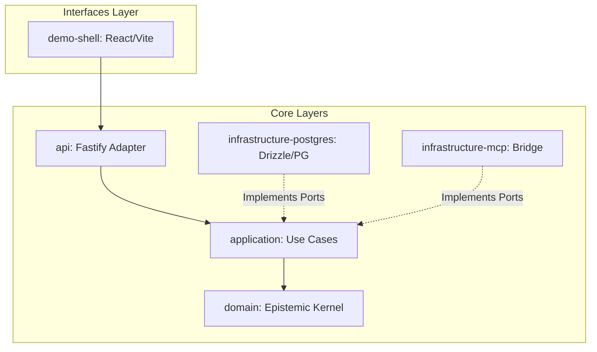
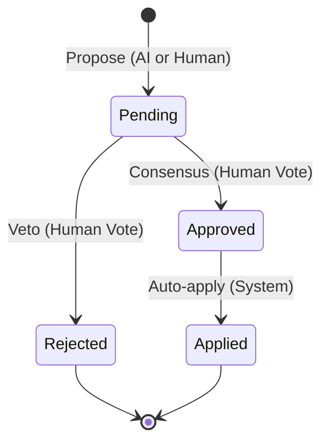

# Epistemic OS (epios)

[](https://github.com/xlabkm-ux/epios/actions)
[](docs/04_delivery/RELEASE_STATE.md)
[](LICENSE)

Epistemic Operating System (EPIOS) is an open-source operating layer designed for structured reasoning, evidence-backed knowledge artifacts, and safe AI-assisted actions.

## 🚀 MVP Release Candidate: v0.1.0-rc.1

We are proud to announce the first release candidate of the EPIOS MVP. This release establishes the foundational "Universal Mission Room" where humans and AI agents collaborate on complex knowledge graphs.

### Current Status
For detailed release status, known limitations, and evidence of testing, see:
👉 **[RELEASE_STATE.md](docs/04_delivery/RELEASE_STATE.md)**

## 🗺️ Roadmap: Towards v0.2.0 (ADR Review Hardening)
The current focus is on **ADR-0099 Architectural Hardening**.
Current execution truth is maintained via **[GitHub Issues](https://github.com/xlabkm-ux/epios/issues)**.


## 🛠 Quick Start

### Prerequisites
- **Node.js**: v22 LTS
- **pnpm**: `npm install -g pnpm` (v9.12.3 recommended)
- **Docker**: For running the PostgreSQL database

### 1. Clone & Install
```bash
git clone https://github.com/xlabkm-ux/epios.git
cd epios
pnpm install
```

### 2. Run with Docker (Recommended)
EPIOS is now fully containerized for easy pilot deployment.

```bash
# Start all services (Postgres, API, UI)
docker compose up -d

# Initialize with Pilot Pack data
docker exec -it epios-api pnpm --filter @epios/infrastructure-postgres seed
```
- **Demo Shell**: [http://localhost:5173](http://localhost:5173)
- **API Server**: [http://localhost:3000](http://localhost:3000)

For detailed operational instructions, see the **[📘 RUNBOOK.md](docs/05_operations/RUNBOOK.md)**.

### 3. Development Environment
If you prefer to run locally for development:

```bash
# Start Postgres only
pnpm db:up

# Run migrations and seed
pnpm db:init

# Launch API and UI
pnpm dev
```
The **Demo Shell** will be available at `http://localhost:5173`.
The **API** will be available at `http://localhost:3000`.

## 📖 Demo Scenarios

Explore the power of EPIOS through our documented use-case scenarios:
- [Scenario A: Architecture Document](docs/03_specs/scenarios/SCENARIO_A_ARCH_DOC.md)
- [Scenario B: Project Planning](docs/03_specs/scenarios/SCENARIO_B_PROJECT_PLANNING.md)
- [Scenario C: Research Review](docs/03_specs/scenarios/SCENARIO_C_RESEARCH_REVIEW.md)
- [Scenario D: Decision Support](docs/03_specs/scenarios/SCENARIO_D_DECISION_SUPPORT.md)

## 🏗 Architecture

EPIOS follows a layered hexagonal architecture. The monorepo structure strictly enforces these boundaries.



### Physical Directory Mapping
- **`apps/demo-shell`**: The primary "Mission Room" UI.
- **`packages/domain`**: Pure business logic, entities (`EpistemicNode`), and invariants.
- **`packages/application`**: Orchestration and use cases (e.g., `SubmitClaim`, `ApplyPatch`).
- **`packages/api`**: HTTP interface and DTO validation.
- **`packages/infrastructure-*`**: Concrete implementations of repository ports (Postgres, MCP).

For a deeper dive, see our [Architecture Foundation](docs/01_foundation/EPIOS-01-architecture-foundation.md).

## 🧠 Knowledge Ontology

EPIOS structures reasoning through a formal graph ontology. 

### Node Types
| Type | Description |
|---|---|
| **Claim** | A specific assertion that requires evidence and approval. |
| **Observation** | A neutral fact or data point from a source. |
| **Hypothesis** | A tentative explanation being tested. |
| **Risk** | A potential threat or limitation. |
| **Decision** | A finalized architectural or process choice. |

### Edge Types
- `supports` / `contradicts`: Links evidence or observations to claims.
- `refines`: Connects a more specific claim to a general one.
- `addresses`: Links a decision to a risk or question.

## 🛡 Security & Governance

EPIOS implements a strict **"Human-in-the-loop"** policy. AI agents can propose knowledge, but only humans can authorize its inclusion in the permanent record.

### Governance State Machine
Every `Claim` and `Patch` undergoes a formal lifecycle:



Every action is captured in a **Trace Summary**, ensuring full auditability of how a "Ready" state was reached.

## 🤝 Contributing

We welcome contributions! Please see our [CONTRIBUTING.md](CONTRIBUTING.md) and [Governance Plan](docs/00_project/GOVERNANCE_PLAN.md) for details.

## 📜 License

Licensed under the Apache License, Version 2.0. See [LICENSE](LICENSE) for the full text.
