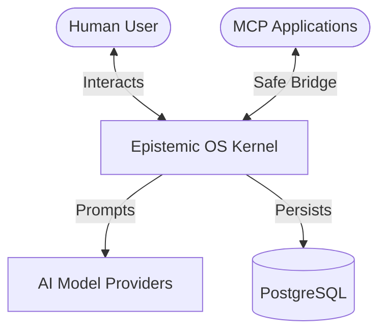
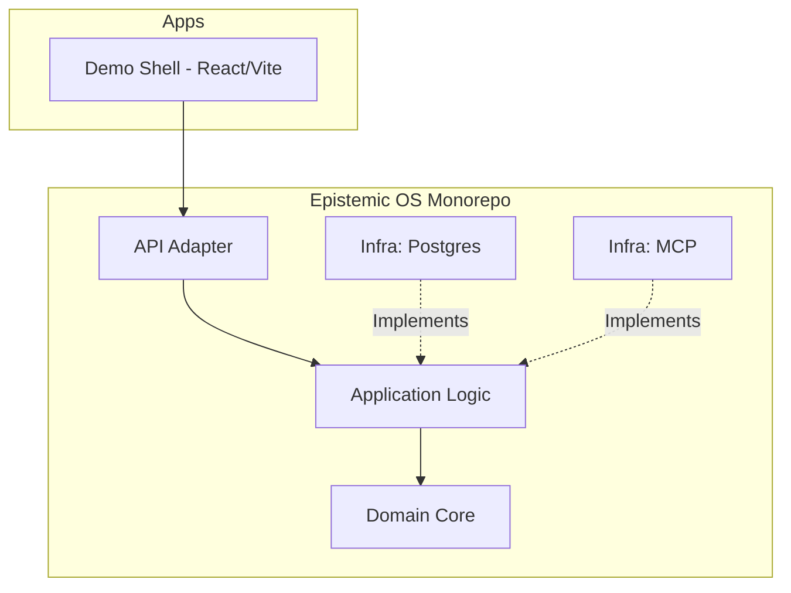

# Epistemic OS (epos)

Epistemic Operating System v1.0 is an operating layer for structured reasoning, evidence-backed artifacts, explicit human decisions, and safe AI-assisted actions.

## Overview

Epistemic OS is not a chat product or a generic agent framework. It is a platform kernel designed for:
- **Epistemic Clarity**: Clear distinction between claims, evidence, and artifacts.
- **Human Sovereignty**: Explicit human-in-the-loop decisions for all significant actions.
- **Traceability**: Full provenance and audit trails for every change.
- **Safe Actions**: Controlled side effects through policy-based boundaries.

## Strategic Formula

`situation → distinction → evidence → artifact → decision → action`

## Project Status

> [!CAUTION]
> **Alpha Status**: This project is in active early development. It is currently for **internal development and architecture validation only**. APIs and domain models are subject to breaking changes.

- **Status**: Alpha / MVP Development
- **MVP Goal**: Universal Mission Room (6-week horizon)
- **Primary License**: Apache-2.0

## Architecture

### System Context (C4 Level 1)



### Container Structure (C4 Level 2)



### Prerequisites

- Node.js (v20+)
- pnpm
- Docker (for PostgreSQL and optional services)

### Installation

```bash
pnpm install
```

### Development

```bash
pnpm dev
```

## Documentation

Detailed documentation can be found in the [docs/](docs/README.md) directory:
- [EPOS-00: Project Brief & Foundation](work_doc/epos_00_project_brief_and_foundation.md)
- [EPOS-01: Architecture Foundation](work_doc/epos_01_architecture_foundation.md)
- [EPOS-02: Domain Model](work_doc/epos_02_domain_model.md)

## License

This project is licensed under the Apache License 2.0 - see the [LICENSE](LICENSE) file for details.
