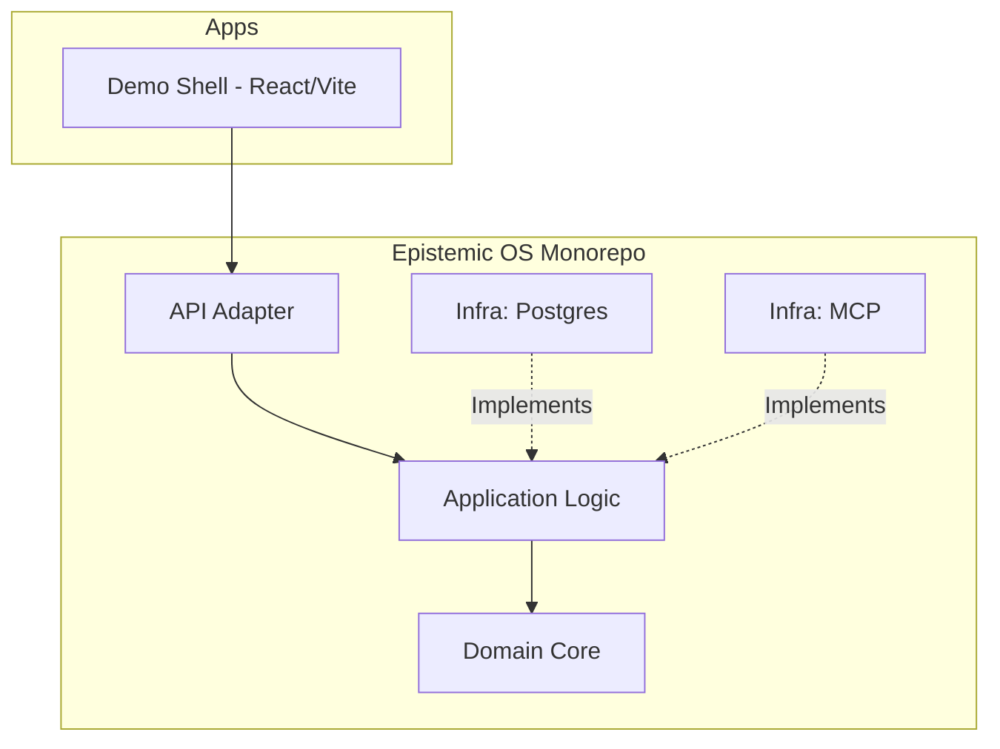

# Epistemic OS (epios)

Epistemic Operating System (EPIOS) is an open-source operating layer designed for structured reasoning, evidence-backed knowledge artifacts, and safe AI-assisted actions.

## 🚀 MVP Release Candidate: v0.1.0-rc.1

We are proud to announce the first release candidate of the EPIOS MVP. This release establishes the foundational "Universal Mission Room" where humans and AI agents collaborate on complex knowledge graphs.

### Key Features
- **Neural Graph Workspace**: Interactive 2D canvas for mapping hypotheses, evidence, and claims.
- **Epistemic Governance**: Built-in approval workflows for integrating new knowledge into the mission state.
- **MCP Integration**: Secure bridge for Model Context Protocol (MCP) applications.
- **Hexagonal Architecture**: Clean separation between domain logic and infrastructure.

## 🗺️ Roadmap v1.1: ADR Review Readiness
Details can be found in the [Master QA Plan](docs/04_delivery/v1_1_qa_plan/EPIOS_v1_1_Master_Sprint_QA_Plan.md).
Current status and task tracking is available via [GitHub Issues](https://github.com/xlabkm-ux/epios/issues).

## 🛠 Quick Start

### Prerequisites
- **Node.js**: v22 LTS
- **pnpm**: `npm install -g pnpm` (v9.12.3 recommended)
- **Docker**: For running the PostgreSQL database

### 1. Clone & Install
```bash
git clone https://github.com/xlabkm-ux/epios.git
cd epios
pnpm install
```

### 2. Infrastructure
Start the PostgreSQL database and required services:
```bash
docker-compose up -d
```

### 3. Run Development Environment
Launch the API and the Demo Shell simultaneously:
```bash
pnpm dev
```
The **Demo Shell** will be available at `http://localhost:5173`.
The **API** will be available at `http://localhost:3000`.

## 📖 Demo Scenarios

Explore the power of EPIOS through our documented use-case scenarios:
- [Scenario A: Architecture Document](docs/03_specs/scenarios/SCENARIO_A_ARCH_DOC.md)
- [Scenario B: Project Planning](docs/03_specs/scenarios/SCENARIO_B_PROJECT_PLANNING.md)
- [Scenario C: Research Review](docs/03_specs/scenarios/SCENARIO_C_RESEARCH_REVIEW.md)
- [Scenario D: Decision Support](docs/03_specs/scenarios/SCENARIO_D_DECISION_SUPPORT.md)

## 🏗 Architecture

EPIOS follows a layered hexagonal architecture to ensure modularity and testability.



For a deeper dive, see our [Architecture Foundation](docs/01_foundation/EPIOS-01-architecture-foundation.md).

## 🛡 Security & Governance

EPIOS implements a strict "Human-in-the-loop" policy for all state-changing actions. Every claim submitted via an AI agent must pass through the `GovernancePanel` for human approval before becoming a permanent part of the mission graph.

## 🤝 Contributing

We welcome contributions! Please see our [CONTRIBUTING.md](CONTRIBUTING.md) and [Governance Plan](docs/00_project/GOVERNANCE_PLAN.md) for details.

## 📜 License

Licensed under the Apache License, Version 2.0. See [LICENSE](LICENSE) for the full text.
