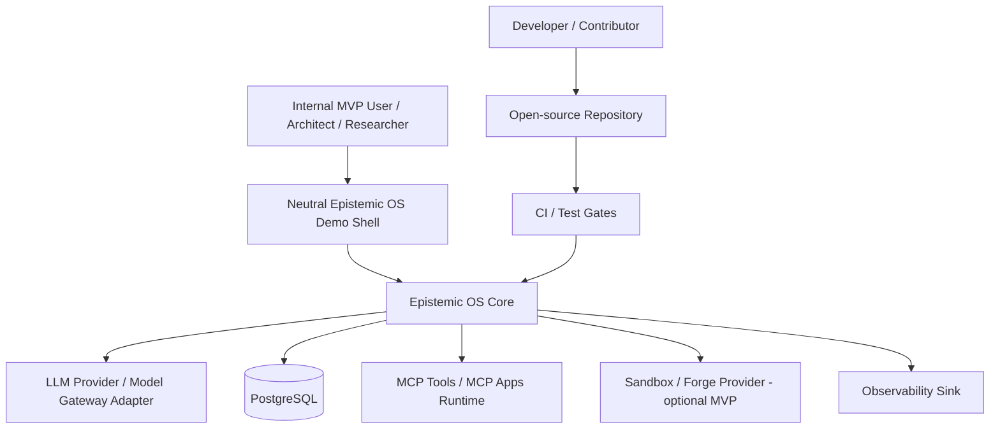
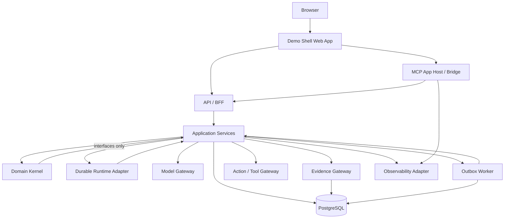
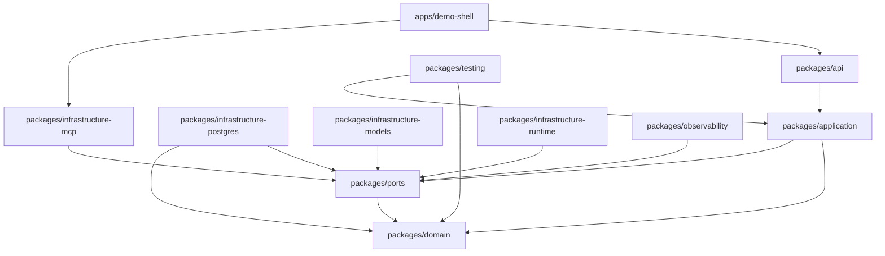

# EPIOS-01 — Architecture Foundation

**Project:** Epistemic OS v1.0  
**Document ID:** `EPIOS-01-ARCHITECTURE-FOUNDATION`  
**Version:** Draft 0.1  
**Status:** Accepted_concept for MVP Bootstrap  
**Depends on:** `EPIOS-00-PROJECT-BRIEF`  
**Repository model:** Open-source from day one  
**Target MVP horizon:** 6 weeks or faster  
**Deployment target for MVP:** Internal dev only  
**Language policy:** TypeScript core; Go/Rust later only for infrastructure components  

---

## 1. Purpose of This Document

This document defines the architecture foundation for **Epistemic OS v1.0**.

It establishes:

- system context;
- container architecture;
- layer boundaries;
- module map;
- dependency rules;
- core ports and adapters;
- MVP runtime topology;
- repository structure;
- architecture anti-patterns;
- initial architecture gates.

This document does not define detailed database schemas, complete domain object fields or sprint tasks. Those are handled by later documents.

---

## 2. Architecture Thesis

Epistemic OS is a domain-first platform for traceable reasoning, evidence-backed artifacts, explicit human decisions and safe AI-assisted actions.

The architecture must protect the following invariant:

```text
The domain model owns epistemic meaning.
The runtime owns durable execution.
The UI renders state and sends typed commands.
The infrastructure adapts external capabilities.
```

The system must not become:

- a chat app with side panels;
- a generic agent loop;
- a provider-specific model wrapper;
- an MCP iframe collection;
- a graph database demo;
- a workflow engine hidden inside HTTP handlers.

---

## 3. C4 Context

### 3.1. System Context Diagram



### 3.2. Actors

| Actor | Goal | Primary Concern |
|---|---|---|
| Internal MVP User | Use Mission Room to produce traceable artifacts | clarity, speed, artifact usefulness |
| Architect / Researcher | Review claims, evidence, decisions | provenance, boundaries, traceability |
| Developer / Contributor | Extend or test the platform | contracts, module boundaries, local setup |
| Security Reviewer | Verify action/MCP/tool boundaries | policy, approval, secrets, iframe safety |
| Operator / Maintainer | Run internal dev deployment | logs, traces, migrations, reproducibility |

### 3.3. External Systems

| External System | Role | MVP Requirement |
|---|---|---|
| PostgreSQL | System of record | Required |
| LLM Provider | Optional model execution | Optional; fake deterministic provider required |
| MCP Runtime / Apps | Interactive UI apps and tool boundary | Required for MVP Apps |
| Sandbox / Forge | Safe materialization / code execution | Optional MVP stretch |
| Observability backend | Traces/logs/metrics | Minimal local console/OTel-compatible adapter |

---

## 4. C4 Container Architecture

### 4.1. Container Diagram



### 4.2. Containers

| Container | Responsibility | Must Not Do |
|---|---|---|
| Demo Shell Web App | Neutral Mission Room UI, artifact workspace, cards, trace panels | own domain rules, execute tools directly |
| API / BFF | Typed HTTP/WebSocket/SSE boundary, auth/dev identity, DTO validation | contain business decisions or provider logic |
| Application Services | Use cases, orchestration, transactions, policies, command handling | embed infrastructure-specific details |
| Domain Kernel | Epistemic invariants, entities, value objects, domain services | call DB, LLM, HTTP, filesystem or UI |
| Durable Runtime Adapter | MissionRun execution, signals, retries, waits, activity boundaries | own epistemic truth or artifact logic |
| MCP App Host / Bridge | Render and secure MCP Apps, validate bridge messages | trust iframe, bypass policy, hold secrets |
| Model Gateway | Normalize model calls, streaming events, usage/cost | own mission state, approvals or artifacts |
| Evidence Gateway | Ingestion/retrieval/citation validation | decide final claim truth alone |
| Action Gateway | Tool/action planning and execution through policy | perform side effects without idempotency/audit |
| PostgreSQL | System of record | act as hidden domain logic layer |
| Outbox Worker | Safe projections and async event handling | become workflow runtime |
| Observability Adapter | Logs/traces/metrics/events | expose sensitive payloads without redaction |

---

## 5. Layered Architecture

### 5.1. Layers

```text
Interfaces
  Demo Shell
  MCP Apps
  HTTP API / BFF
  CLI / Dev tools

Application
  Mission use cases
  Artifact use cases
  Evidence use cases
  Approval use cases
  Runtime orchestration
  Projection use cases

Domain
  Mission
  EpistemicNode
  ReasoningEdge
  DomainBoundary
  EvidenceRef
  DecisionRecord
  LivingArtifact
  ArtifactPatch
  ApprovalRequest
  Domain services

Infrastructure
  PostgreSQL repositories
  Model provider adapters
  MCP adapters
  Runtime adapters
  Outbox workers
  Observability adapters
  Sandbox/Forge adapters
```

### 5.2. Dependency Rule

```text
Interfaces → Application → Domain
Infrastructure → Application / Domain ports
Domain → no external dependencies
```

Domain cannot import:

- web framework;
- database client;
- ORM;
- LLM SDK;
- MCP SDK;
- Temporal SDK;
- React;
- filesystem;
- environment variables;
- logging framework.

Application can depend on:

- domain;
- ports;
- transaction boundary abstractions;
- typed command/query contracts.

Infrastructure implements ports.

Interfaces call application services through typed commands and queries.

---

## 6. Core Module Map

### 6.1. MVP Modules

```text
apps/
  demo-shell/
    Neutral Mission Room UI
    MCP App host integration

packages/
  domain/
    Epistemic Kernel
    Mission domain
    Artifact domain
    Evidence value objects
    Policy value objects

  application/
    Mission use cases
    Artifact use cases
    Evidence use cases
    Approval use cases
    Projection use cases

  ports/
    Repository ports
    ModelGatewayPort
    EvidenceGatewayPort
    DurableRuntimePort
    ActionGatewayPort
    PolicyEnginePort
    ObservabilityPort

  infrastructure-postgres/
    PostgreSQL repositories
    migrations
    transaction manager
    outbox store

  infrastructure-models/
    fake deterministic provider
    OpenAI-compatible adapter optional

  infrastructure-mcp/
    MCPAppRegistry
    bridge validation
    app manifests

  infrastructure-runtime/
    lightweight runner MVP
    Temporal-ready adapter boundary

  api/
    BFF / HTTP API
    DTO validation
    error contract

  observability/
    trace/event schema
    local logger
    OTel-ready adapter

  testing/
    fixtures
    contract tests
    fake providers
    test utilities
```

### 6.2. Suggested Repository Layout

```text
epistemic-os/
  README.md
  LICENSE
  CONTRIBUTING.md
  SECURITY.md
  CODE_OF_CONDUCT.md
  package.json
  pnpm-workspace.yaml
  turbo.json or nx.json
  .env.example
  docker-compose.yml

  apps/
    demo-shell/

  packages/
    domain/
    application/
    ports/
    api/
    infrastructure-postgres/
    infrastructure-models/
    infrastructure-mcp/
    infrastructure-runtime/
    observability/
    testing/

  docs/
    00_project/
    01_architecture/
    02_adrs/
    03_specs/
    04_delivery/
    05_runbooks/

  tools/
    scripts/
    dev/
```

### 6.3. Package Dependency Direction



Rule:

```text
No package may depend upward into apps/demo-shell.
No infrastructure package may be imported by domain.
No application service may import a concrete provider SDK directly.
```

---

## 7. Domain Boundary Overview

### 7.1. Domain Aggregates

MVP aggregate candidates:

| Aggregate | Owns | Notes |
|---|---|---|
| Mission | mission brief, constraints, mode, run refs | main work unit |
| MissionRun | state, transitions, pending approvals, runtime refs | durable execution aggregate |
| EpistemicGraph | nodes, edges, boundaries | may be stored relationally first |
| LivingArtifact | versions, patches, status | artifact state and lineage |
| ApprovalRequest | preview, status, decision refs | human-in-the-loop boundary |
| Source / EvidenceSet | source metadata, chunks, evidence refs | evidence/provenance boundary |

### 7.2. Domain Services

| Domain Service | Responsibility |
|---|---|
| EpistemicKernel | node creation, edge rules, gate evaluation |
| BoundaryEvaluator | strength downgrade, reality level checks |
| ArtifactPatchPolicy | patch validity, required refs |
| DecisionPolicy | when human decision is required |
| TemporalValidityPolicy | expired/deprecated node handling |
| RiskClassifier | domain-level risk classification before infra policy |

### 7.3. Value Objects

- MissionId;
- NodeId;
- EvidenceId;
- ArtifactId;
- DecisionId;
- IdempotencyKey;
- CorrelationId;
- RealityLevel;
- ClaimStrength;
- TemporalScope;
- RiskClass;
- SourceSpan;
- DomainBoundaryRef.

---

## 8. Application Use Cases

### 8.1. MVP Use Cases

```text
CreateMission
UpdateMissionBrief
RunEpistemicMapping
AttachEvidence
ProposeArtifactPatch
ReviewArtifactPatch
CreateConflictCard
CreateApprovalRequest
ResolveApproval
ApplyArtifactPatch
GetMissionReadModel
GetTraceForMission
```

### 8.2. Use Case Shape

Each use case should follow this structure:

```ts
type UseCase<I, O> = {
  execute(input: I, context: RequestContext): Promise<O>;
};
```

Every use case receives:

```ts
type RequestContext = {
  actor: ActorRef;
  correlationId: string;
  idempotencyKey?: string;
  featureFlags?: Record<string, boolean>;
  now: Date;
};
```

Rules:

- all input validated before use case execution;
- all domain mutations happen in transaction where required;
- side effects use ports;
- observability events emitted through ObservabilityPort;
- write operations require idempotency where retry/duplicate is possible.

---

## 9. Core Ports

### 9.1. Repository Ports

```ts
interface MissionRepositoryPort {
  save(mission: Mission): Promise<void>;
  findById(missionId: string): Promise<Mission | null>;
}

interface EpistemicGraphRepositoryPort {
  upsertNode(node: EpistemicNode): Promise<void>;
  upsertEdge(edge: ReasoningEdge): Promise<void>;
  findNode(nodeId: string): Promise<EpistemicNode | null>;
  findMissionGraph(missionId: string): Promise<EpistemicSubgraph>;
}

interface ArtifactRepositoryPort {
  saveArtifact(artifact: LivingArtifact): Promise<void>;
  savePatch(patch: ArtifactPatch): Promise<void>;
  findArtifact(artifactId: string): Promise<LivingArtifact | null>;
}
```

### 9.2. Transaction Port

```ts
interface TransactionManagerPort {
  withTransaction<T>(fn: (tx: TransactionContext) => Promise<T>): Promise<T>;
}
```

### 9.3. Outbox Port

```ts
interface OutboxPort {
  enqueue(event: OutboxEvent, tx?: TransactionContext): Promise<void>;
  markProcessed(eventId: string): Promise<void>;
  markFailed(eventId: string, error: string): Promise<void>;
  nextBatch(limit: number): Promise<OutboxEvent[]>;
}
```

### 9.4. Model Gateway Port

```ts
interface ModelGatewayPort {
  complete(request: ModelRequest): Promise<ModelResponse>;
  stream(request: ModelRequest): AsyncIterable<ModelEvent>;
}
```

MVP must include a fake deterministic provider implementation.

### 9.5. Evidence Gateway Port

```ts
interface EvidenceGatewayPort {
  ingest(command: IngestSourceCommand): Promise<SourceRef>;
  retrieve(query: EvidenceQuery): Promise<EvidenceSet>;
  validateCitations(input: CitationValidationInput): Promise<CitationValidationResult>;
}
```

### 9.6. Durable Runtime Port

```ts
interface DurableRuntimePort {
  start(command: StartMissionRunCommand): Promise<MissionRunRef>;
  signal(runId: string, signal: MissionSignal): Promise<void>;
  cancel(runId: string, reason: string): Promise<void>;
  query(runId: string): Promise<MissionRunStatus>;
}
```

MVP can use a lightweight in-process runner if it respects the port and does not block future Temporal adoption.

### 9.7. Policy Engine Port

```ts
interface PolicyEnginePort {
  evaluate(input: PolicyInput): Promise<PolicyDecision>;
}
```

### 9.8. Observability Port

```ts
interface ObservabilityPort {
  emit(event: TraceEvent): Promise<void>;
  startSpan?(span: SpanInput): SpanHandle;
}
```

---

## 10. MVP Runtime Topology

### 10.1. Recommended MVP Topology

```text
Browser
  → Demo Shell
  → API/BFF
  → Application Services
  → Domain Kernel
  → PostgreSQL
  → Outbox Worker
  → Fake/Optional Model Gateway
  → MCP App Host
```

### 10.2. Docker Compose Services

Minimum:

```text
postgres
api
web
dev-worker
```

Optional:

```text
temporal
otel-collector
local-object-store
```

### 10.3. Internal Dev Only Assumption

Because MVP deployment is internal dev only, the system may use simplified assumptions:

- dev auth instead of production auth;
- local-only environment;
- internal demo data;
- non-production observability backend;
- no public traffic;
- no external customer data.

But internal-only does not allow:

- committed secrets;
- unsafe command execution by default;
- bypassed approval for write actions;
- hidden state outside PostgreSQL for domain data;
- unvalidated MCP bridge messages.

---

## 11. PostgreSQL Architecture Baseline

### 11.1. PostgreSQL Responsibilities

PostgreSQL stores:

- missions;
- mission runs;
- epistemic nodes;
- reasoning edges;
- domain boundaries;
- evidence sources;
- evidence refs;
- living artifacts;
- artifact versions;
- artifact patches;
- approval requests;
- decision records;
- trace/audit events or trace event refs;
- outbox events;
- idempotency keys.

### 11.2. PostgreSQL Design Rules

- use migrations from day one;
- every table has created_at / updated_at where relevant;
- every mutable aggregate has version column;
- every side-effect command has idempotency key where relevant;
- graph queries are mission-scoped for MVP;
- JSONB is allowed only for semi-structured metadata, not as a substitute for core schema;
- foreign keys should be used where they do not slow iteration unreasonably;
- avoid hidden business rules in SQL triggers for MVP.

### 11.3. Outbox Baseline

Outbox is required for projection and async consistency.

```text
Application transaction:
  write aggregate changes
  write outbox event
  commit

Worker:
  read pending outbox
  process idempotently
  mark processed or failed
```

Outbox is not a workflow runtime.

---

## 12. MCP Apps Architecture Baseline

### 12.1. MCP App Role

MCP Apps provide interactive UI views inside the Mission Room.

MVP Apps:

- ClaimApp;
- EvidenceViewer;
- ApprovalApp.

Optional stretch:

- ConflictApp;
- ArtifactPatchPreviewApp;
- TraceViewer.

### 12.2. Security Boundary

MCP App iframe is untrusted by default.

All messages must pass:

```text
origin validation
schema validation
nonce replay protection
timestamp validation
capability check
policy check for writes
audit event
```

### 12.3. Command Flow

```text
MCP App UI
  → postMessage typed request
  → MCP App Host validates
  → API typed command
  → Application use case
  → Policy / Domain / Persistence
  → response event
  → App state update
```

MCP App never imports domain packages directly.

---

## 13. Observability Architecture Baseline

### 13.1. Required Correlation Fields

Every significant event should include:

```text
correlationId
actorId
missionId
runId, if applicable
artifactId, if applicable
nodeId, if applicable
evidenceId, if applicable
approvalId, if applicable
idempotencyKey, if applicable
```

### 13.2. MVP Events

```text
mission.created
mission.brief_updated
run.started
run.state_changed
epistemic.node_created
epistemic.node_downgraded
evidence.ingested
evidence.retrieved
artifact.created
artifact.patch_proposed
artifact.patch_applied
approval.created
approval.resolved
mcp.message_rejected
mcp.command_submitted
policy.allowed
policy.denied
policy.approval_required
```

### 13.3. Redaction Rule

No observability event may leak:

- API keys;
- raw authorization headers;
- private provider tokens;
- unredacted sensitive documents;
- sandbox secrets;
- full prompt payloads unless explicitly allowed by redaction policy.

---

## 14. Error Architecture

### 14.1. Error Contract

Every API-facing error must include:

```ts
type ErrorResponse = {
  error: {
    code: string;
    message: string;
    retryable: boolean;
    correlationId: string;
    details?: unknown;
  };
};
```

### 14.2. Error Classes

MVP error classes:

```text
VALIDATION_ERROR
NOT_FOUND
CONFLICT
POLICY_DENIED
APPROVAL_REQUIRED
IDEMPOTENCY_CONFLICT
MCP_MESSAGE_INVALID
MCP_ORIGIN_DENIED
CITATION_INVALID
EVIDENCE_WEAK
RUNTIME_FAILED
MODEL_FAILED
INTERNAL_ERROR
```

### 14.3. Fail-Fast Rules

Fail fast when:

- required environment variables missing;
- PostgreSQL unavailable at startup where required;
- migrations not applied;
- MCP bridge secret/config missing;
- unsupported schema version received;
- write action lacks idempotency key;
- high-risk action lacks policy decision.

---

## 15. Architecture Anti-Patterns

The following are explicitly prohibited:

### 15.1. UI-Owned Business Logic

Bad:

```text
ApprovalApp decides whether action is allowed.
```

Correct:

```text
ApprovalApp sends typed command; backend policy decides.
```

### 15.2. Provider-Owned Workflow

Bad:

```text
LLM provider response state is MissionRun source of truth.
```

Correct:

```text
MissionRun, Artifact, Decision and Trace live in Epistemic OS.
Provider state is optimization only.
```

### 15.3. SQL-Owned Domain Logic

Bad:

```text
Epistemic validity encoded in triggers and ad hoc SQL.
```

Correct:

```text
Domain service enforces invariant; repository persists result.
```

### 15.4. Mock-as-Architecture

Bad:

```text
Fake provider or mock retriever defines real contract accidentally.
```

Correct:

```text
Fake implements explicit port contract for tests and demos.
```

### 15.5. MCP App as Trusted Actor

Bad:

```text
Iframe sends applyPatch and backend applies it directly.
```

Correct:

```text
Iframe sends request; host validates; backend policy/use case applies.
```

### 15.6. Graph DB First

Bad:

```text
Start with Neo4j schema before EpistemicNode contract is stable.
```

Correct:

```text
GraphRepositoryPort first; PostgreSQL relational graph for MVP.
```

### 15.7. Hidden Authority

Bad:

```text
System presents hypothesis as deep truth.
```

Correct:

```text
System marks hypothesis, boundary, evidence and required human decision.
```

---

## 16. Architecture Gates

### 16.1. Gate A — Dependency Direction

Pass criteria:

```text
- domain imports no infrastructure;
- application imports no concrete provider SDK;
- UI imports no repositories;
- infrastructure implements ports;
- package dependency graph passes static check.
```

### 16.2. Gate B — Persistence Correctness

Pass criteria:

```text
- PostgreSQL migrations run locally;
- mission and artifact data persist across restart;
- outbox event written in same transaction as aggregate update;
- idempotency conflict test passes.
```

### 16.3. Gate C — MCP Bridge Safety

Pass criteria:

```text
- invalid origin rejected;
- invalid schema rejected;
- replayed nonce rejected;
- write command without capability rejected;
- all MCP commands audited.
```

### 16.4. Gate D — Epistemic Invariants

Pass criteria:

```text
- unsupported claim downgraded;
- strong node requires evidence or explicit human assertion boundary;
- expired node cannot support strong patch without revalidation;
- artifact patch requires node/evidence/decision linkage.
```

### 16.5. Gate E — Demo Flow

Pass criteria:

```text
- create mission;
- build brief;
- create nodes;
- attach evidence;
- propose patch;
- approve patch through ApprovalApp;
- persist artifact version;
- view trace.
```

---

## 17. Decisions Captured in This Document

```text
AD-01: Use layered hexagonal architecture.
AD-02: Domain has no infrastructure dependencies.
AD-03: PostgreSQL is MVP system of record.
AD-04: Outbox is required from MVP.
AD-05: MCP Apps are untrusted UI surfaces.
AD-06: Demo shell is not domain owner.
AD-07: ModelGateway is capability boundary, not workflow owner.
AD-08: GraphRepositoryPort precedes any graph database choice.
AD-09: Internal dev deployment still enforces security boundaries.
```

These decisions should be converted into ADRs if accepted.

---

## 18. Approval Checklist

This document is approved when the project owner confirms:

- C4 context is acceptable;
- container boundaries are acceptable;
- layer rules are acceptable;
- repository structure is acceptable;
- PostgreSQL baseline is acceptable;
- MCP Apps architecture baseline is acceptable;
- MVP runtime topology is acceptable;
- architecture anti-patterns are acceptable;
- architecture gates are acceptable.

---

## 19. Next Document After Approval

After this document is approved, create:

```text
EPIOS-02 — Domain Model
```

That document should define:

- Mission;
- MissionRun;
- EpistemicNode;
- ReasoningEdge;
- DomainBoundary;
- EvidenceRef;
- Source;
- DecisionRecord;
- ApprovalRequest;
- LivingArtifact;
- ArtifactPatch;
- domain invariants;
- state machines;
- domain errors;
- domain tests.

