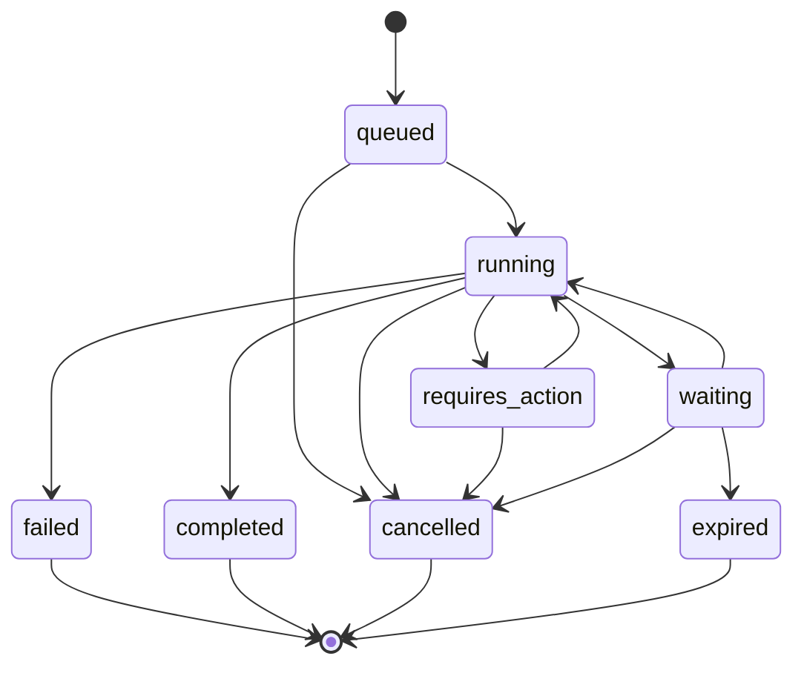
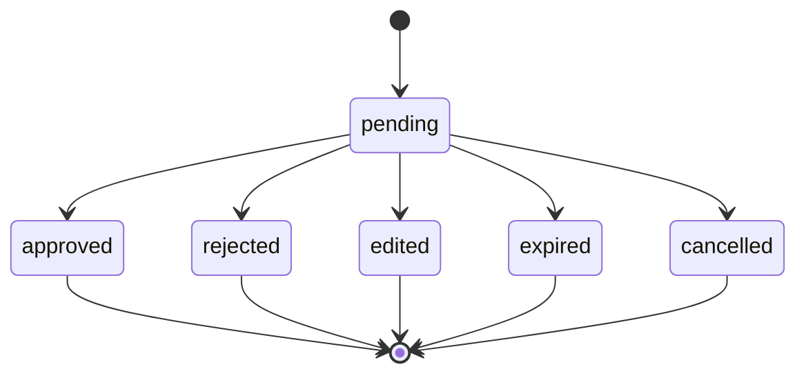

# EPIOS-02 — Domain Model

**Project:** Epistemic OS v1.0  
**Document ID:** `EPIOS-02-DOMAIN-MODEL`  
**Version:** Draft 0.1  
**Status:** Accepted_concept for MVP Bootstrap  
**Depends on:** `EPIOS-00-PROJECT-BRIEF`, `EPIOS-01-ARCHITECTURE-FOUNDATION`  
**Target MVP horizon:** 6 weeks or faster  
**Storage baseline:** PostgreSQL-first  
**Language policy:** TypeScript core  

---

## 1. Purpose of This Document

This document defines the domain model for **Epistemic OS v1.0 MVP**.

It specifies:

- domain language;
- aggregate boundaries;
- entities;
- value objects;
- state machines;
- invariants;
- domain services;
- domain events;
- domain errors;
- minimal domain test matrix.

This document does not define database tables, REST endpoints, UI layouts, or infrastructure adapters. Those are handled in later documents.

---

## 2. Domain Thesis

Epistemic OS exists to transform unstructured material into traceable, bounded and reviewable artifacts.

The domain model must preserve this chain:

```text
Mission
→ Epistemic Nodes
→ Evidence and Boundaries
→ Artifact Patches
→ Human Decisions
→ Traceable Artifact
```

The central invariant:

```text
No meaningful artifact mutation without epistemic reason, evidence/boundary context,
traceable decision state and rollbackable patch history.
```

---

## 3. Ubiquitous Language

| Term | Meaning |
|---|---|
| Mission | Unit of user work: situation, document, project, review or decision task. |
| Mission Brief | Structured description of goal, context, constraints, success criteria and unknowns. |
| MissionRun | Executable attempt to advance a mission through a workflow. |
| EpistemicNode | Atomic claim, observation, hypothesis, decision, risk or question. |
| ReasoningEdge | Typed relation between epistemic nodes. |
| DomainBoundary | Scope where a node has valid force. |
| EvidenceRef | Reference to supporting or contextual source material. |
| Source | Ingested user input, document, repo file, tool output or external source. |
| LivingArtifact | Versioned working output of a mission. |
| ArtifactPatch | Proposed or applied mutation to a LivingArtifact. |
| DecisionRecord | Human, policy or system decision with rationale and trace. |
| ApprovalRequest | Human-in-the-loop request to approve, reject or edit an action/patch. |
| ConflictCard | Explicit decision fork where the system must not decide silently. |
| TraceEvent | Observable event emitted by domain/application flows. |
| IdempotencyKey | Key preventing duplicated side effects or repeated write commands. |

---

## 4. Aggregate Overview

MVP aggregates:

| Aggregate | Responsibility | Owns | Does Not Own |
|---|---|---|---|
| Mission | User work context and scope | brief, status, artifact refs, run refs | provider calls, UI state |
| MissionRun | Durable execution state | run state, pending approval refs, runtime refs | epistemic truth, provider SDK |
| EpistemicGraph | Nodes, edges and boundaries inside mission | nodes, edges, boundaries | storage engine choice |
| EvidenceSet | Source and evidence references | sources, chunks, evidence refs | final artifact mutation |
| LivingArtifact | Versioned artifact state | versions, patch refs, status | evidence retrieval, policy decisions |
| ApprovalRequest | Human approval lifecycle | preview, status, decision link | execution implementation |
| DecisionRecord | Recorded human/system decision | option, rationale, actor, time | UI rendering |

MVP implementation may store aggregates in separate repositories, but domain rules must not depend on table shape.

---

## 5. Value Objects

### 5.1. Identity Value Objects

```ts
type MissionId = Brand<string, 'MissionId'>;
type RunId = Brand<string, 'RunId'>;
type NodeId = Brand<string, 'NodeId'>;
type EdgeId = Brand<string, 'EdgeId'>;
type BoundaryId = Brand<string, 'BoundaryId'>;
type SourceId = Brand<string, 'SourceId'>;
type EvidenceId = Brand<string, 'EvidenceId'>;
type ArtifactId = Brand<string, 'ArtifactId'>;
type PatchId = Brand<string, 'PatchId'>;
type DecisionId = Brand<string, 'DecisionId'>;
type ApprovalId = Brand<string, 'ApprovalId'>;
type CorrelationId = Brand<string, 'CorrelationId'>;
type IdempotencyKey = Brand<string, 'IdempotencyKey'>;
```

### 5.2. Semantic Value Objects

```ts
type RealityLevel =
  | 'material'
  | 'psychic'
  | 'social'
  | 'linguistic'
  | 'systemic'
  | 'trajectory'
  | 'indirect_depth'
  | 'unknown';

type NodeStrength =
  | 'strong'
  | 'moderate'
  | 'weak'
  | 'hypothesis_only'
  | 'question_only';

type NodeStatus =
  | 'raw'
  | 'source_supported'
  | 'multi_source_supported'
  | 'contradicted'
  | 'human_decision_required'
  | 'deprecated';
```

### 5.3. Temporal Scope

```ts
type EpistemicTemporalScope = {
  validFrom: string;
  validTo?: string;
  observedAt?: string;
  assertedAt: string;
  temporalResolution:
    | 'instant'
    | 'day'
    | 'week'
    | 'month'
    | 'quarter'
    | 'version'
    | 'unknown';
  validityBasis:
    | 'source_timestamp'
    | 'user_assertion'
    | 'system_inference'
    | 'artifact_version'
    | 'repo_commit';
};
```

Invariant:

```text
If validTo is before current mission context time, node cannot be used as strong support
without explicit revalidation.
```

### 5.4. SourceSpan

```ts
type SourceSpan = {
  sourceId: SourceId;
  chunkId?: string;
  startOffset?: number;
  endOffset?: number;
  locator?: string;
};
```

### 5.5. ActorRef

```ts
type ActorRef = {
  actorType: 'user' | 'system' | 'policy' | 'tool' | 'role_pass';
  actorId: string;
};
```

---

## 6. Mission Aggregate

### 6.1. Responsibility

Mission represents a bounded unit of work.

It owns:

- goal;
- context summary;
- constraints;
- success criteria;
- unknowns;
- sensitivity;
- status;
- refs to runs, artifacts and graph.

It does not own:

- model calls;
- retrieval implementation;
- tool execution;
- UI state;
- provider-specific state.

### 6.2. Mission Type

```ts
type Mission = {
  missionId: MissionId;
  title: string;
  brief: MissionBrief;
  status: MissionStatus;
  mode: MissionMode;
  sensitivity: 'low' | 'medium' | 'high';
  artifactIds: ArtifactId[];
  runIds: RunId[];
  createdBy: ActorRef;
  createdAt: string;
  updatedAt: string;
  version: number;
};

type MissionBrief = {
  goal: string;
  context?: string;
  successCriteria: string[];
  constraints: string[];
  unknowns: string[];
  desiredArtifactType?: ArtifactType;
};

type MissionStatus =
  | 'draft'
  | 'briefed'
  | 'running'
  | 'waiting_for_decision'
  | 'review'
  | 'completed'
  | 'archived';

type MissionMode = 'fast' | 'studio' | 'lab' | 'forge';
```

### 6.3. Mission Invariants

```text
- Mission must have non-empty goal before running.
- Mission cannot complete without at least one artifact or explicit no-artifact decision.
- High sensitivity mission requires redaction policy before external model/tool calls.
- Mission status must reflect active MissionRun when one exists.
```

---

## 7. MissionRun Aggregate

### 7.1. Responsibility

MissionRun is an executable attempt to advance a Mission.

It owns:

- state;
- state transitions;
- pending approval refs;
- runtime correlation refs;
- failure reason;
- idempotency context.

It does not own:

- epistemic graph truth;
- artifact content;
- provider state as source of truth.

### 7.2. MissionRun Type

```ts
type MissionRun = {
  runId: RunId;
  missionId: MissionId;
  status: MissionRunStatus;
  currentStage?: MissionRunStage;
  pendingApprovalIds: ApprovalId[];
  idempotencyKey?: IdempotencyKey;
  startedBy: ActorRef;
  startedAt: string;
  updatedAt: string;
  completedAt?: string;
  failedReason?: DomainError;
  version: number;
};

type MissionRunStatus =
  | 'queued'
  | 'running'
  | 'requires_action'
  | 'waiting'
  | 'completed'
  | 'failed'
  | 'cancelled'
  | 'expired';

type MissionRunStage =
  | 'intake'
  | 'briefing'
  | 'preflight'
  | 'mapping'
  | 'working'
  | 'artifact_build'
  | 'review'
  | 'forge';
```

### 7.3. MissionRun State Machine



### 7.4. MissionRun Invariants

```text
- Terminal runs cannot transition again.
- requires_action must reference at least one ApprovalRequest or DecisionRecord need.
- waiting must have a wait reason.
- failed must have typed DomainError.
- side-effecting run steps require idempotency key.
- duplicate signal must not create duplicate side effect.
```

---

## 8. EpistemicGraph Aggregate

### 8.1. Responsibility

EpistemicGraph is the mission-local graph of nodes, edges and boundaries.

It owns:

- EpistemicNodes;
- ReasoningEdges;
- DomainBoundaries;
- graph-level consistency rules.

It does not own:

- graph database choice;
- UI graph layout;
- vector search implementation.

### 8.2. EpistemicNode

```ts
type EpistemicNode = {
  nodeId: NodeId;
  missionId: MissionId;
  semanticCore: string;
  nodeType:
    | 'observation'
    | 'claim'
    | 'interpretation'
    | 'hypothesis'
    | 'decision'
    | 'recommendation'
    | 'risk'
    | 'value_choice'
    | 'question';
  realityLevel: RealityLevel;
  strength: NodeStrength;
  status: NodeStatus;
  temporalScope: EpistemicTemporalScope;
  evidenceRefs: EvidenceId[];
  boundaryRefs: BoundaryId[];
  decisionRefs: DecisionId[];
  createdBy: ActorRef;
  createdAt: string;
  updatedAt: string;
  version: number;
};
```

### 8.3. ReasoningEdge

```ts
type ReasoningEdge = {
  edgeId: EdgeId;
  missionId: MissionId;
  fromNodeId: NodeId;
  toNodeId: NodeId;
  type:
    | 'supports'
    | 'contradicts'
    | 'refines'
    | 'generalizes'
    | 'questions'
    | 'depends_on'
    | 'causes_risk_for';
  strength: 'strong' | 'moderate' | 'weak';
  evidenceRefs: EvidenceId[];
  createdBy: ActorRef;
  createdAt: string;
};
```

### 8.4. DomainBoundary

```ts
type DomainBoundary = {
  boundaryId: BoundaryId;
  missionId: MissionId;
  appliesToNodeId: NodeId;
  scopeDescription: string;
  validRealityLevels: RealityLevel[];
  excludedScopes: string[];
  downgradePolicy?: 'downgrade_to_moderate' | 'downgrade_to_weak' | 'hypothesis_only' | 'question_only';
  createdAt: string;
};
```

### 8.5. EpistemicGraph Invariants

```text
- Strong node must have evidence or explicit human assertion boundary.
- Unsupported system-generated node cannot be strong.
- Contradicted node cannot be used as strong support without decision.
- Expired node cannot support new strong patch without revalidation.
- Edge endpoints must belong to same mission.
- Boundary must reference existing node.
- Node downgrade must preserve previous strength in trace/domain event.
```

---

## 9. EvidenceSet Aggregate

### 9.1. Responsibility

EvidenceSet manages sources and evidence references available to a mission.

It owns:

- source metadata;
- source chunks;
- evidence references;
- evidence quality metadata;
- citation validity status.

It does not own:

- artifact mutation;
- final truth decision;
- user decision state.

### 9.2. Source

```ts
type Source = {
  sourceId: SourceId;
  missionId: MissionId;
  sourceType:
    | 'user_input'
    | 'document'
    | 'repo_file'
    | 'web'
    | 'connector'
    | 'tool_output';
  title: string;
  uri?: string;
  contentHash?: string;
  freshness?: string;
  sourceQuality: 'high' | 'medium' | 'low' | 'unknown';
  createdAt: string;
};
```

### 9.3. EvidenceRef

```ts
type EvidenceRef = {
  evidenceId: EvidenceId;
  missionId: MissionId;
  sourceId: SourceId;
  span?: SourceSpan;
  quote?: string;
  relevanceScore?: number;
  supportsNodeIds: NodeId[];
  citationStatus: 'valid' | 'invalid' | 'stale' | 'unverified';
  boundaryNote?: string;
  createdAt: string;
};
```

### 9.4. Evidence Invariants

```text
- EvidenceRef must reference existing Source.
- EvidenceRef with quote span must be traceable to source locator or chunk.
- Invalid citation cannot be used to support strong node.
- Stale evidence requires temporal boundary or downgrade.
- Evidence source quality must be visible to consuming use cases.
```

---

## 10. LivingArtifact Aggregate

### 10.1. Responsibility

LivingArtifact is the versioned working output of a mission.

It owns:

- artifact identity;
- artifact status;
- versions;
- patch history;
- review state.

It does not own:

- epistemic graph rules;
- evidence retrieval;
- policy decisions;
- UI editing state.

### 10.2. LivingArtifact

```ts
type ArtifactType =
  | 'markdown_document'
  | 'project_plan'
  | 'architecture_document'
  | 'research_review'
  | 'decision_memo'
  | 'code'
  | 'export_package';

type LivingArtifact = {
  artifactId: ArtifactId;
  missionId: MissionId;
  artifactType: ArtifactType;
  title: string;
  currentVersion: number;
  status: 'draft' | 'review' | 'approved' | 'exported' | 'archived';
  createdAt: string;
  updatedAt: string;
};
```

### 10.3. ArtifactVersion

```ts
type ArtifactVersion = {
  artifactId: ArtifactId;
  version: number;
  contentRef: string;
  createdBy: ActorRef;
  createdAt: string;
  patchId?: PatchId;
};
```

### 10.4. ArtifactPatch

```ts
type ArtifactPatch = {
  patchId: PatchId;
  artifactId: ArtifactId;
  missionId: MissionId;
  baseVersion: number;
  diff: string;
  reason: string;
  nodeRefs: NodeId[];
  evidenceRefs: EvidenceId[];
  decisionRefs: DecisionId[];
  riskClass: 'low' | 'medium' | 'high' | 'critical';
  author: ActorRef;
  status: 'proposed' | 'accepted' | 'rejected' | 'edited' | 'applied';
  createdAt: string;
  appliedAt?: string;
};
```

### 10.5. Artifact Invariants

```text
- Patch baseVersion must match current artifact version unless explicitly rebased.
- Patch must have non-empty reason.
- Significant patch must reference at least one node or decision.
- High-risk patch requires approval before apply.
- Applied patch creates new artifact version.
- Rejected patch cannot be applied later without new review.
```

---

## 11. DecisionRecord Aggregate

### 11.1. Responsibility

DecisionRecord captures human, policy or system decisions that affect mission outcome.

It owns:

- decision subject;
- options;
- selected option;
- rationale;
- actor;
- timestamp.

It does not own:

- UI choice rendering;
- approval execution;
- policy engine internals.

### 11.2. DecisionRecord

```ts
type DecisionRecord = {
  decisionId: DecisionId;
  missionId: MissionId;
  runId?: RunId;
  decisionType:
    | 'human_choice'
    | 'approval'
    | 'rejection'
    | 'edit_then_approve'
    | 'policy_downgrade'
    | 'policy_deny'
    | 'system_default';
  subjectType: 'node' | 'edge' | 'patch' | 'tool_call' | 'mission' | 'artifact';
  subjectRef: string;
  options: DecisionOption[];
  selectedOptionId?: string;
  rationale?: string;
  actor: ActorRef;
  createdAt: string;
};

type DecisionOption = {
  optionId: string;
  label: string;
  description?: string;
  consequence?: string;
  riskClass?: 'low' | 'medium' | 'high' | 'critical';
};
```

### 11.3. Decision Invariants

```text
- Human-choice decision must not be created with actorType=system.
- Decision with options must select an existing option unless deferred.
- Policy deny must include reason.
- Decision affecting patch must be linked from ArtifactPatch.
- Decision created from ConflictCard must preserve options and consequence text.
```

---

## 12. ApprovalRequest Aggregate

### 12.1. Responsibility

ApprovalRequest manages approval lifecycle for risky actions or patches.

It owns:

- preview;
- status;
- risk class;
- timeout;
- idempotency key;
- resolution decision.

It does not own:

- action execution;
- policy engine internals;
- UI rendering.

### 12.2. ApprovalRequest

```ts
type ApprovalRequest = {
  approvalId: ApprovalId;
  missionId: MissionId;
  runId: RunId;
  subjectType: 'tool_call' | 'artifact_patch' | 'forge_action' | 'external_write';
  subjectRef: string;
  preview: ApprovalPreview;
  riskClass: 'low' | 'medium' | 'high' | 'critical';
  status: 'pending' | 'approved' | 'rejected' | 'edited' | 'expired' | 'cancelled';
  idempotencyKey: IdempotencyKey;
  createdAt: string;
  expiresAt?: string;
  resolvedAt?: string;
  decisionId?: DecisionId;
};

type ApprovalPreview = {
  title: string;
  summary: string;
  whatWillHappen: string[];
  dataLeavingSystem?: string[];
  rollback?: string;
};
```

### 12.3. Approval State Machine



### 12.4. Approval Invariants

```text
- Approval starts as pending.
- Terminal approval cannot change status.
- High/critical risk subject cannot execute while approval is pending.
- Approval resolution must create DecisionRecord.
- Same idempotency key cannot approve twice with different outcome.
```

---

## 13. ConflictCard Entity

### 13.1. Responsibility

ConflictCard represents an explicit fork where the system must not silently decide.

It is usually linked to nodes, artifact patches or mission decisions.

### 13.2. ConflictCard

```ts
type ConflictCard = {
  conflictId: string;
  missionId: MissionId;
  title: string;
  summary: string;
  nodeRefs: NodeId[];
  evidenceRefs: EvidenceId[];
  options: DecisionOption[];
  severity: 'low' | 'medium' | 'high' | 'critical';
  status: 'open' | 'resolved' | 'deferred' | 'dismissed';
  decisionId?: DecisionId;
  createdAt: string;
};
```

### 13.3. Conflict Invariants

```text
- High/critical conflict requires human decision before final artifact approval.
- Resolved conflict must reference DecisionRecord.
- Dismissed conflict must include rationale.
- Conflict options must include consequences or trade-offs.
```

---

## 14. Domain Services

### 14.1. EpistemicKernel

Responsibility:

- create nodes from claim-like input;
- apply strength downgrade rules;
- validate boundary and temporal scope;
- create reasoning edges;
- decide when conflict is required.

```ts
interface EpistemicKernel {
  createNode(input: CreateNodeInput, context: EpistemicContext): EpistemicNode;
  evaluateNode(node: EpistemicNode, context: EpistemicContext): NodeEvaluation;
  createEdge(input: CreateEdgeInput): ReasoningEdge;
  requiresConflict(input: ConflictCheckInput): boolean;
}
```

### 14.2. BoundaryEvaluator

Responsibility:

- determine whether node strength exceeds boundary;
- downgrade if required;
- create boundary notes.

### 14.3. TemporalValidityPolicy

Responsibility:

- determine whether node is valid at mission time;
- require revalidation for expired nodes.

### 14.4. ArtifactPatchPolicy

Responsibility:

- validate patch references;
- require decision/approval for risky patch;
- prevent applying rejected/stale patch.

### 14.5. ApprovalPolicy

Responsibility:

- determine whether action/patch requires approval;
- validate approval resolution.

---

## 15. Domain Events

Domain events describe meaningful changes. They are not infrastructure messages by themselves.

MVP domain events:

```ts
type DomainEvent =
  | { type: 'mission.created'; missionId: MissionId }
  | { type: 'mission.brief_updated'; missionId: MissionId }
  | { type: 'run.state_changed'; runId: RunId; from: MissionRunStatus; to: MissionRunStatus }
  | { type: 'epistemic.node_created'; nodeId: NodeId; missionId: MissionId }
  | { type: 'epistemic.node_downgraded'; nodeId: NodeId; from: NodeStrength; to: NodeStrength; reason: string }
  | { type: 'epistemic.conflict_required'; missionId: MissionId; nodeIds: NodeId[] }
  | { type: 'artifact.patch_proposed'; patchId: PatchId; artifactId: ArtifactId }
  | { type: 'artifact.patch_applied'; patchId: PatchId; artifactId: ArtifactId; version: number }
  | { type: 'approval.created'; approvalId: ApprovalId; missionId: MissionId }
  | { type: 'approval.resolved'; approvalId: ApprovalId; decisionId: DecisionId }
  | { type: 'decision.recorded'; decisionId: DecisionId; missionId: MissionId };
```

Rules:

```text
- Domain events must not contain secrets.
- Domain events must be serializable.
- Domain events must be convertible into outbox events where needed.
- Domain events should include IDs, not large payloads.
```

---

## 16. Domain Errors

### 16.1. Error Shape

```ts
type DomainError = {
  code: DomainErrorCode;
  message: string;
  retryable: boolean;
  details?: unknown;
};
```

### 16.2. Domain Error Codes

```ts
type DomainErrorCode =
  | 'MISSION_GOAL_REQUIRED'
  | 'INVALID_RUN_TRANSITION'
  | 'TERMINAL_RUN_CANNOT_TRANSITION'
  | 'NODE_EVIDENCE_REQUIRED'
  | 'NODE_TEMPORALLY_EXPIRED'
  | 'NODE_BOUNDARY_VIOLATION'
  | 'EDGE_CROSS_MISSION_INVALID'
  | 'EVIDENCE_SOURCE_REQUIRED'
  | 'CITATION_INVALID'
  | 'PATCH_REASON_REQUIRED'
  | 'PATCH_BASE_VERSION_CONFLICT'
  | 'PATCH_REFERENCES_REQUIRED'
  | 'PATCH_APPROVAL_REQUIRED'
  | 'APPROVAL_ALREADY_RESOLVED'
  | 'APPROVAL_IDEMPOTENCY_CONFLICT'
  | 'DECISION_OPTION_INVALID'
  | 'CONFLICT_DECISION_REQUIRED';
```

---

## 17. Domain Test Matrix

### 17.1. P0 Invariant Tests

| Test | Expected Result |
|---|---|
| Create mission without goal | rejected |
| Run invalid transition `requires_action -> completed` | rejected |
| Terminal run transition | rejected |
| System-generated strong node without evidence | downgraded or rejected |
| Expired node supports strong patch | rejected unless revalidated |
| Edge across missions | rejected |
| Artifact patch without reason | rejected |
| Artifact patch without node/evidence/decision refs | rejected for significant patch |
| Apply patch with stale baseVersion | rejected or requires rebase |
| High-risk patch without approval | rejected |
| Resolve approval twice with different outcome | idempotency conflict |
| High/critical conflict without decision before final approval | rejected |

### 17.2. P1 Tests

| Test | Expected Result |
|---|---|
| Weak evidence creates weak/hypothesis node | accepted with downgrade |
| Contradicted node supports patch | requires decision |
| Dismissed conflict without rationale | rejected |
| Decision option not in options list | rejected |
| Invalid citation supports node | rejected |
| Stale evidence supports node | downgraded or temporal boundary required |

---

## 18. MVP Domain Constraints

Because MVP target is 6 weeks or faster, domain model must stay lean.

### 18.1. Include in MVP

```text
Mission
MissionBrief
MissionRun
EpistemicNode
ReasoningEdge
DomainBoundary
Source
EvidenceRef
LivingArtifact
ArtifactPatch
DecisionRecord
ApprovalRequest
ConflictCard
```

### 18.2. Exclude from MVP

```text
Full ontology management
Multi-tenant organization model
Complex graph algorithms
User-facing coherence score
3D/spatial graph layout
Advanced role-pass system
Marketplace/plugin domain
Billing domain
Enterprise retention domain
Full autonomous agent memory
```

### 18.3. Use Experimental Flags for

```text
Role passes beyond basic mapping
Conflict auto-detection beyond simple contradiction/risk
Forge actions
External write actions
Advanced retrieval modes
MCP ArtifactPatch app
```

---

## 19. Acceptance Criteria

This document is approved when the project owner confirms:

- aggregate boundaries are acceptable;
- Mission model is acceptable;
- MissionRun state machine is acceptable;
- EpistemicNode and ReasoningEdge model is acceptable;
- temporal validity is acceptable;
- EvidenceRef model is acceptable;
- ArtifactPatch model is acceptable;
- Approval and Decision model is acceptable;
- domain invariants are acceptable;
- MVP exclusions are acceptable.

---

## 20. Next Document After Approval

After this document is approved, create:

```text
EPIOS-03 — MVP Scope and 6-Week Roadmap
```

That document should define:

- 6-week sprint plan;
- MVP vertical slice;
- demo scenarios;
- acceptance gates per week;
- backlog priorities;
- team workflow;
- release candidate criteria.

