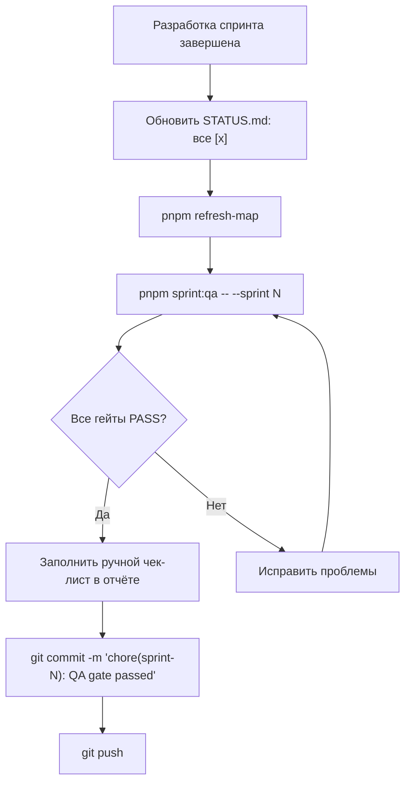

Owner: @architect
Status: accepted

# 🧪 РЕГЛАМЕНТ QA-ПРИЁМКИ СПРИНТА (Sprint QA Gate Regulation)

> **Идентификатор:** EPIOS-QA-SPRINT-GATE  
> **Версия:** 1.0  
> **Статус:** `accepted` (обязателен к применению)  
> **Дата принятия:** 2026-05-16  
> **Область действия:** Все спринты проекта Epistemic OS (epios)  
> **Инструмент:** `tools/sprint-qa/run-sprint-qa.ts`

---

## 1. Назначение

Настоящий регламент устанавливает **обязательную технологию QA-приёмки**, которая применяется **при завершении каждого спринта** в проекте Epistemic OS. Ни один спринт не может быть закрыт без успешного прохождения автоматизированных Quality Gates и заполнения ручного чек-листа приёмки.

### Принцип

```
Код без прохождения Quality Gates = незавершённый спринт.
Незавершённый спринт = запрет на git push финального коммита.
```

---

## 2. Порядок применения

### 2.1. Когда применять

Регламент применяется **каждый раз, когда агент или разработчик считает спринт завершённым**, перед:

1. Финальным `git commit` с меткой `feat:` / `chore:` завершения спринта.
2. Обновлением `STATUS.md` (пометка спринта как «Завершено»).
3. Выполнением `git push` в удалённый репозиторий.

### 2.2. Команда запуска

```bash
pnpm sprint:qa -- --sprint <N>
```

Где `<N>` — номер завершаемого спринта (например, `5`).

### 2.3. Последовательность действий (обязательная)



---

## 3. Quality Gates (автоматизированные)

Автоматический раннер выполняет **8 последовательных гейтов**. Каждый гейт возвращает один из статусов:

| Статус | Значение | Влияние на закрытие спринта |
| :--- | :--- | :--- |
| ✅ `PASS` | Гейт пройден | Разрешено |
| ❌ `FAIL` | Гейт провален | **Заблокировано** |
| ⚠️ `WARN` | Не-блокирующее предупреждение | Разрешено (с замечанием) |
| ⏭ `SKIP` | Гейт пропущен (причина указана) | Разрешено |

### Описание гейтов

| # | ID | Название | Команда | Блокирующий |
| :--- | :--- | :--- | :--- | :--- |
| 1 | G1 | **Static Analysis — Lint** | `pnpm lint` | ✅ Да |
| 2 | G1b | **Static Analysis — TypeCheck** | `pnpm typecheck` | ✅ Да |
| 3 | G2 | **Architecture Boundaries** | `pnpm depcruise` | ✅ Да |
| 4 | G3 | **Domain Invariants — Unit Tests** | `pnpm test:domain` | ✅ Да |
| 5 | G4 | **Full Test Suite** | `pnpm test` | ✅ Да |
| 6 | G5 | **Security Audit & Secret Scan** | `pnpm test:security` | ⚠️ Нет |
| 7 | G6 | **Documentation Governance** | `pnpm check:docs-governance` | ✅ Да |
| 8 | G7 | **STATUS.md Checklist** | (встроенная проверка) | ✅ Да |
| 9 | G8 | **PROJECT_MAP.md Freshness** | (встроенная проверка) | ⚠️ Нет |

### Правило блокировки

> **Если хотя бы один блокирующий гейт (G1–G4, G6–G7) имеет статус `FAIL`, спринт НЕ МОЖЕТ быть закрыт.**

---

## 4. Ручная приёмка (Manual QA Checklist)

После успешного прохождения автоматических гейтов, в сгенерированном отчёте необходимо заполнить ручной чек-лист:

| # | Проверка | Описание |
| :--- | :--- | :--- |
| 1 | Demo Shell | Приложение открывается из чистого состояния без ошибок |
| 2 | Канонический сценарий | ADR Review проходит от начала до конца |
| 3 | Новая функциональность | Все новые фичи спринта визуально доступны в UI |
| 4 | Регрессии | Отсутствие поломок в существующих функциях |
| 5 | Readiness-индикаторы | Корректное отображение состояния готовности |
| 6 | Документация | Все затронутые документы актуализированы |

### Процедура ручной проверки (45–60 мин)

1. Открыть Demo Shell из чистого состояния (`pnpm demo:adr-review`).
2. Выполнить канонический сценарий ADR Review (Scenario F / Event Sourcing).
3. Проверить каждую панель: отметить как `mocked / partial / real`.
4. Записать точки замешательства пользователя.
5. Записать, где поток слишком тяжёлый.
6. Оценить: Readiness — полезен или вводит в заблуждение?
7. Принять решение: `keep / change / cut / defer` для каждого инкремента.
8. Заполнить чек-лист в сгенерированном отчёте.

---

## 5. Артефакты (выходные документы)

Каждый запуск `pnpm sprint:qa` генерирует два артефакта:

| Файл | Формат | Путь |
| :--- | :--- | :--- |
| QA Report (Markdown) | `.md` | `docs/04_delivery/sprint-reviews/S<N>_QA_REPORT.md` |
| QA Report (Machine) | `.json` | `docs/04_delivery/sprint-reviews/S<N>_QA_REPORT.json` |

Markdown-отчёт содержит:
- Метаданные (дата, коммит, ветка)
- Таблицу результатов гейтов
- Развёрнутые детали по FAIL/WARN гейтам
- Ручной чек-лист приёмки
- Поле подписи (QA-инженер, дата, решение)

---

## 6. Интеграция с AGENT.md

Данный регламент расширяет раздел **§4 «Итеративный процесс разработки»** и **§6 «Обязательное самотестирование»** файла `AGENT.md`.

### Обновлённый порядок завершения спринта:

```
1. Завершить разработку всех задач спринта
2. Отметить все пункты [x] в STATUS.md
3. Обновить PROJECT_MAP.md (pnpm refresh-map)
4. Запустить Sprint QA Runner (pnpm sprint:qa -- --sprint N)
5. При FAIL — исправить и перезапустить
6. При PASS — заполнить ручной чек-лист в сгенерированном отчёте
7. Выполнить git commit с меткой завершения
8. Выполнить git push
```

---

## 7. Интеграция с CI/CD

Sprint QA Runner интегрирован в CI-пайплайн через GitHub Actions workflow `ci.yml`:

```yaml
- name: Sprint QA Gate
  run: pnpm sprint:qa -- --sprint ${{ github.event.inputs.sprint }}
```

Для ручного запуска на CI доступен workflow dispatch с параметром `sprint`.

---

## 8. Эскалация

| Ситуация | Действие |
| :--- | :--- |
| Гейт G5 (Security) показывает WARN | Зафиксировать в Known Limitations, продолжить |
| Гейт G7 (STATUS.md) показывает FAIL | Обязательно завершить все пункты чек-листа |
| Гейт G8 (PROJECT_MAP) показывает WARN | Обновить карту: `pnpm refresh-map` |
| Любой блокирующий гейт FAIL | Исправить, перезапустить. Спринт не закрывается |
| Ручная приёмка выявила регрессию | Создать hotfix, перезапустить Sprint QA |

---

## 9. Метрики и история

Все JSON-отчёты хранятся в `docs/04_delivery/sprint-reviews/` и формируют историю качества проекта. По ним можно отслеживать:

- **Тренд времени сборки** (totalDurationMs по спринтам)
- **Частоту предупреждений безопасности** (G5 WARN rate)
- **Стабильность архитектурных границ** (G2 pass rate)
- **Скорость прохождения QA** (сколько перезапусков до PASS)

---

## 10. Ссылки

| Документ | Путь |
| :--- | :--- |
| Sprint QA Runner (код) | [`run-sprint-qa.ts`](../../tools/sprint-qa/run-sprint-qa.ts) |
| Правила агента | [`AGENT.md`](../../AGENT.md) |
| Стратегия тестирования | [`TEST_STRATEGY_AND_MATRIX.md`](TEST_STRATEGY_AND_MATRIX.md) |
| Master QA Plan | [`EPIOS_v1_1_Master_Sprint_QA_Plan.md`](v1_1_qa_plan/EPIOS_v1_1_Master_Sprint_QA_Plan.md) |
| Release Checklist | [`RELEASE_CHECKLIST.md`](../../RELEASE_CHECKLIST.md) |
| Оперативный план | [`STATUS.md`](../../STATUS.md) |

---

*Утверждено: Antigravity AI Architect — 2026-05-16*
